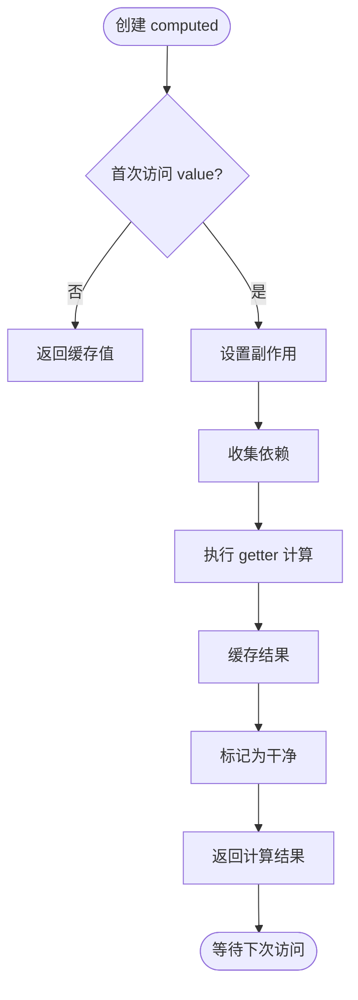
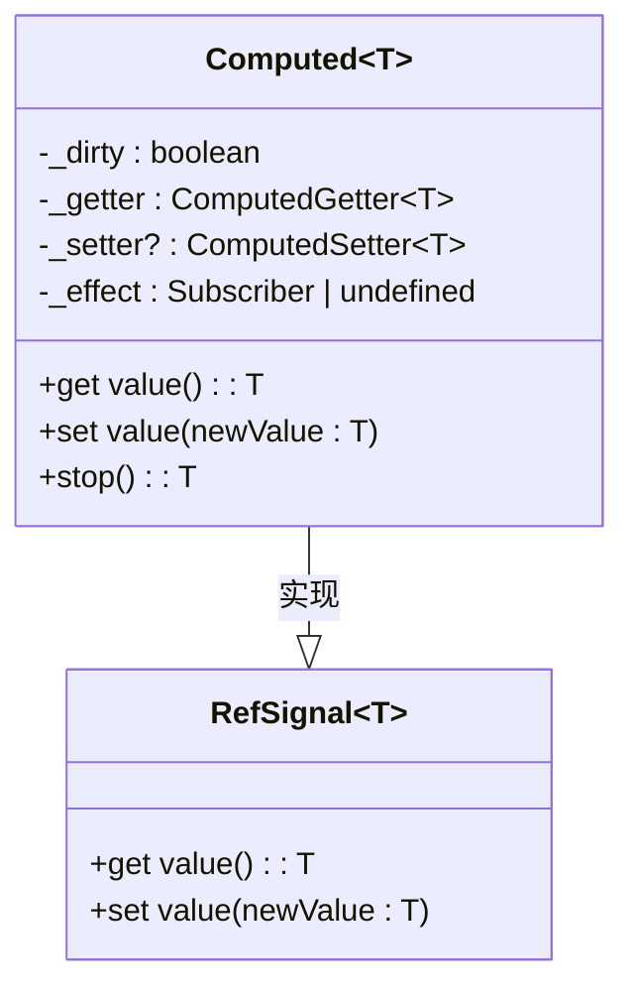
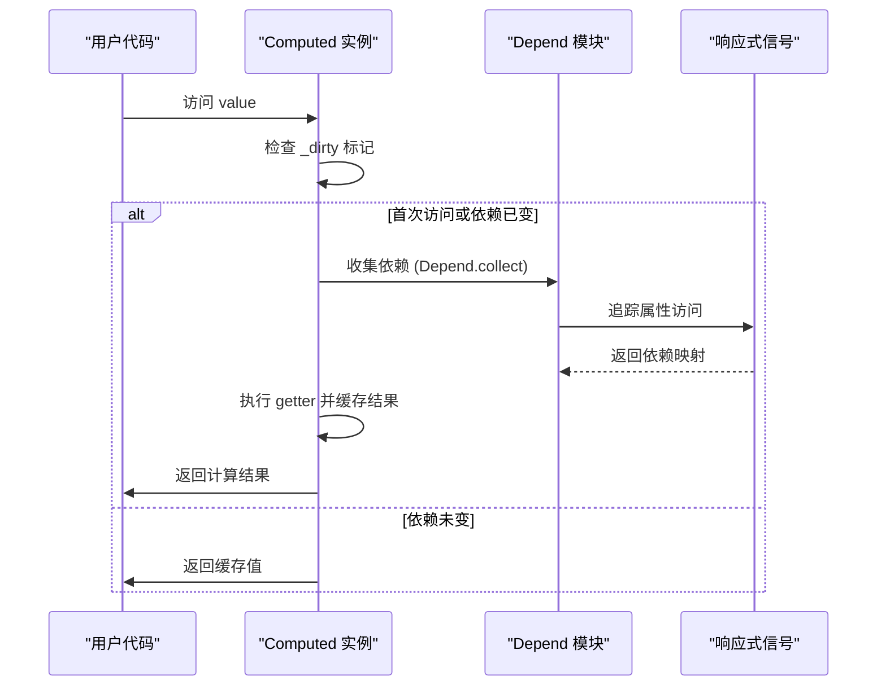
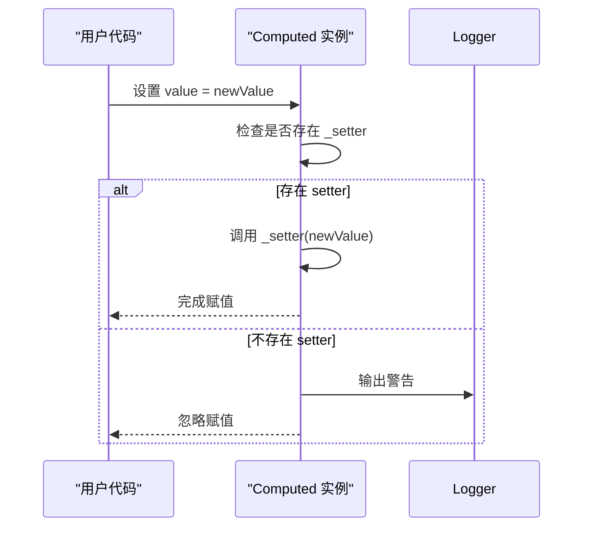
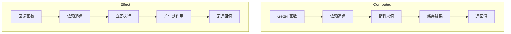

# computed API

<cite>
**本文档引用的文件**
- [computed.ts](file://packages/responsive/src/signal/computed/computed.ts)
- [helpers.ts](file://packages/responsive/src/signal/computed/helpers.ts)
- [ref.ts](file://packages/responsive/src/signal/ref/ref.ts)
- [ref.ts](file://packages/responsive/src/signal/types/ref.ts)
- [depend.ts](file://packages/responsive/src/depend/depend.ts)
- [effect.ts](file://packages/responsive/src/effect/effect.ts)
- [computed.test.ts](file://packages/responsive/__tests__/signal/computed.test.ts)
- [README.md](file://packages/responsive/README.md)
</cite>

## 目录
1. [引言](#引言)
2. [核心设计原理](#核心设计原理)
3. [类型定义与兼容性](#类型定义与兼容性)
4. [调用形式与使用场景](#调用形式与使用场景)
5. [与effect的区别](#与effect的区别)
6. [性能优化与常见错误](#性能优化与常见错误)
7. [总结](#总结)

## 引言

`computed` API 是 Vitarx 响应式系统中的核心功能之一，用于创建基于响应式依赖的只读派生状态。它通过惰性求值和缓存机制，确保计算属性仅在依赖项发生变化时才重新计算，从而优化性能。本文档将全面解析 `computed` API 的设计、使用方法、内部机制以及最佳实践。

**本文档引用的文件**
- [computed.ts](file://packages/responsive/src/signal/computed/computed.ts)
- [helpers.ts](file://packages/responsive/src/signal/computed/helpers.ts)
- [README.md](file://packages/responsive/README.md)

## 核心设计原理

`computed` API 的核心在于其惰性求值和缓存策略。当创建一个计算属性时，它并不会立即执行 getter 函数，而是等到首次访问其 `value` 属性时才进行计算。这种懒计算策略避免了不必要的计算开销。

**Diagram sources**
- [computed.ts](file://packages/responsive/src/signal/computed/computed.ts#L202-L217)

当依赖项发生变化时，计算属性会自动标记为“脏”（dirty），并在下次访问 `value` 时重新计算。这一过程由 `Depend` 模块负责依赖追踪，`SignalManager` 负责通知更新。

**Section sources**
- [computed.ts](file://packages/responsive/src/signal/computed/computed.ts#L120-L121)
- [depend.ts](file://packages/responsive/src/depend/depend.ts#L59-L64)

## 类型定义与兼容性

`computed` API 的类型定义确保了其与 `Ref<T>` 的兼容性。计算属性实现了 `RefSignal<T>` 接口，使其可以像普通的响应式引用一样使用。

**Diagram sources**
- [ref.ts](file://packages/responsive/src/signal/types/ref.ts#L10-L22)
- [computed.ts](file://packages/responsive/src/signal/computed/computed.ts#L98-L114)

`ComputedRef<T>` 类型实际上是 `Computed<T>` 的别名，它继承了 `Ref<T>` 的所有特性，同时提供了额外的控制方法，如 `stop()` 用于停止监听依赖变化。

**Section sources**
- [ref.ts](file://packages/responsive/src/signal/types/ref.ts#L10-L22)
- [computed.ts](file://packages/responsive/src/signal/computed/computed.ts#L98-L114)

## 调用形式与使用场景

`computed` 函数支持两种调用形式：仅包含 getter 的只读计算属性，以及包含 getter 和 setter 的可写计算属性。

### 只读计算属性

只读计算属性是最常见的使用形式，它通过一个 getter 函数从响应式依赖中派生出新的状态。

**Diagram sources**
- [computed.ts](file://packages/responsive/src/signal/computed/computed.ts#L202-L217)
- [depend.ts](file://packages/responsive/src/depend/depend.ts#L75-L78)

### 可写计算属性

可写计算属性通过提供 `setter` 函数，允许对计算属性进行赋值操作，从而反向影响其依赖项。

**Diagram sources**
- [computed.ts](file://packages/responsive/src/signal/computed/computed.ts#L227-L235)

**Section sources**
- [computed.ts](file://packages/responsive/src/signal/computed/computed.ts#L30-L58)
- [helpers.ts](file://packages/responsive/src/signal/computed/helpers.ts#L70-L76)

## 与effect的区别

`computed` 与 `effect` 的核心区别在于前者是值（value），后者是副作用（side effect）。`computed` 的目的是产生一个可缓存的派生值，而 `effect` 的目的是执行一段会产生外部影响的代码。

**Diagram sources**
- [computed.ts](file://packages/responsive/src/signal/computed/computed.ts#L156-L174)
- [effect.ts](file://packages/responsive/src/effect/effect.ts#L34-L36)

`computed` 的 getter 函数在执行时会收集依赖，但不会立即执行，而是等到需要时才计算。而 `effect` 的回调函数在创建时就会立即执行一次，并在依赖变化时再次执行，其主要目的是触发副作用，如更新 DOM 或发送网络请求。

**Section sources**
- [computed.ts](file://packages/responsive/src/signal/computed/computed.ts#L156-L174)
- [effect.ts](file://packages/responsive/src/effect/effect.ts#L34-L36)

## 性能优化与常见错误

### 性能优化

1. **利用缓存机制**：`computed` 的自动缓存可以避免重复计算，特别是在处理复杂逻辑时。
2. **避免在 getter 中产生副作用**：getter 函数应该是纯函数，不应修改外部状态或产生其他副作用。
3. **合理使用 `immediate` 选项**：仅在需要立即计算结果时使用 `immediate: true`，否则应保持默认的懒计算模式。

### 常见错误

1. **在 computed 中产生副作用**：这会破坏响应式系统的确定性，导致难以预测的行为。
2. **忽略 setter 的正确使用**：如果需要可写计算属性，必须提供 `setter` 函数，否则直接赋值会被忽略并发出警告。
3. **过度使用 computed**：对于简单的状态派生，直接在模板或代码中计算可能更清晰。

**Section sources**
- [computed.ts](file://packages/responsive/src/signal/computed/computed.ts#L231-L234)
- [computed.test.ts](file://packages/responsive/__tests__/signal/computed.test.ts#L26-L38)

## 总结

`computed` API 是构建高效、可维护的响应式应用的关键工具。通过理解其惰性求值、缓存策略和与 `effect` 的区别，开发者可以更好地利用这一功能来管理应用的状态。正确使用 `computed` 不仅能提升性能，还能使代码更加清晰和易于理解。

**Section sources**
- [computed.ts](file://packages/responsive/src/signal/computed/computed.ts)
- [README.md](file://packages/responsive/README.md#L556-L718)