# reactive API

<cite>
**本文档引用的文件**
- [proxy-handler.ts](file://packages/responsive/src/signal/reactive/proxy-handler.ts)
- [helpers.ts](file://packages/responsive/src/signal/reactive/helpers.ts)
- [ref.ts](file://packages/responsive/src/signal/ref/ref.ts)
- [depend.ts](file://packages/responsive/src/depend/depend.ts)
- [manager.ts](file://packages/responsive/src/signal/manager.ts)
- [readonly.ts](file://packages/responsive/src/signal/readonly/readonly.ts)
- [helpers.ts](file://packages/responsive/src/signal/readonly/helpers.ts)
</cite>

## 目录
1. [引言](#引言)
2. [核心实现原理](#核心实现原理)
3. [响应式代理处理器](#响应式代理处理器)
4. [依赖收集系统](#依赖收集系统)
5. [衍生API对比](#衍生api对比)
6. [使用规范与限制](#使用规范与限制)
7. [实际应用示例](#实际应用示例)
8. [总结](#总结)

## 引言
reactive API是响应式系统的核心实现，通过Proxy代理对象的getter和setter操作，实现了深度响应式追踪。该系统能够自动追踪对象属性的访问和修改，当数据发生变化时，自动通知相关的副作用函数重新执行。本文档将深入解析reactive API的实现原理和使用规范。

## 核心实现原理

reactive API的核心是利用ES6的Proxy特性，通过拦截对象的get、set、has、ownKeys等陷阱函数，实现对对象属性的访问和修改的监控。当创建一个响应式对象时，系统会返回一个代理对象，所有对该对象的访问都会被代理处理器拦截。

响应式系统的关键在于依赖收集和触发机制。当访问响应式对象的属性时，系统会收集当前的依赖（即正在执行的副作用函数）；当修改属性值时，系统会通知所有依赖于该属性的副作用函数重新执行。

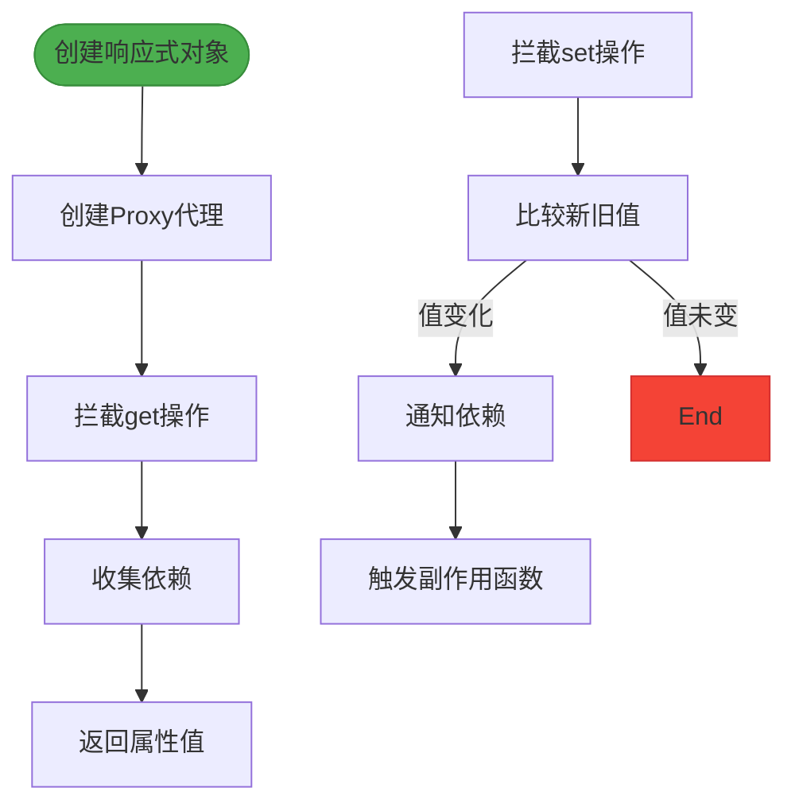

**Diagram sources**
- [proxy-handler.ts](file://packages/responsive/src/signal/reactive/proxy-handler.ts#L83-L397)

**Section sources**
- [proxy-handler.ts](file://packages/responsive/src/signal/reactive/proxy-handler.ts#L83-L397)

## 响应式代理处理器

### Proxy陷阱函数分析

响应式代理处理器`ReactiveProxyHandler`实现了多个Proxy陷阱函数，每个函数都有特定的作用：

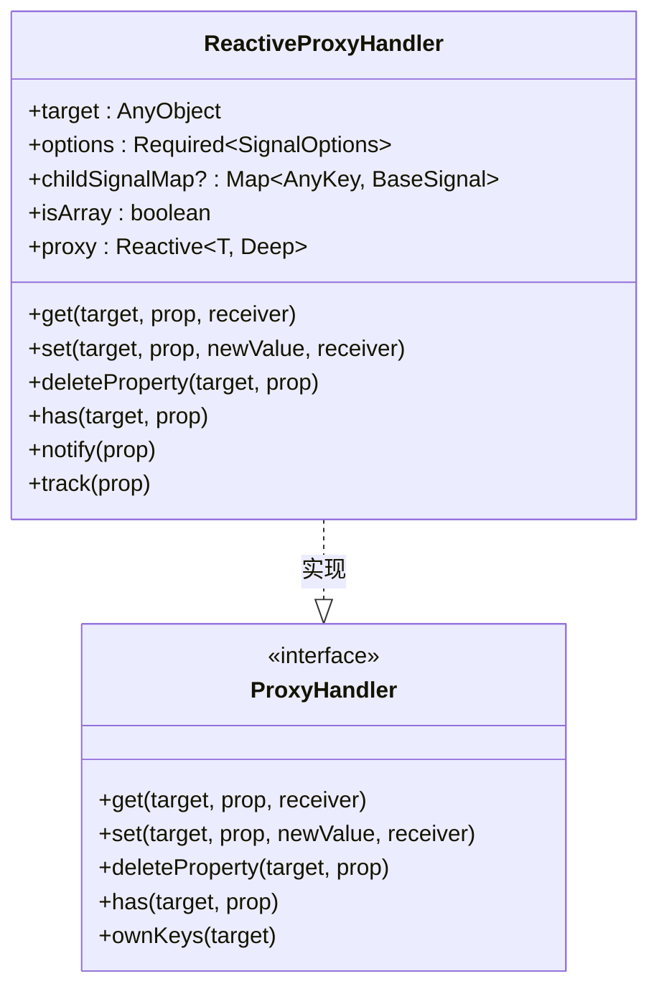

**Diagram sources**
- [proxy-handler.ts](file://packages/responsive/src/signal/reactive/proxy-handler.ts#L83-L397)

**Section sources**
- [proxy-handler.ts](file://packages/responsive/src/signal/reactive/proxy-handler.ts#L83-L397)

#### get陷阱函数

get陷阱函数是依赖收集的核心，主要功能包括：

1. **内部符号处理**：拦截内部标识符属性的访问，如`REACTIVE_PROXY_SYMBOL`、`SIGNAL_RAW_VALUE_SYMBOL`等
2. **集合方法代理**：处理数组方法的调用，确保长度变化被正确追踪
3. **惰性深度代理**：对嵌套对象进行惰性代理，只有在访问时才创建子代理
4. **依赖收集**：通过`Depend.track()`方法收集当前属性的依赖

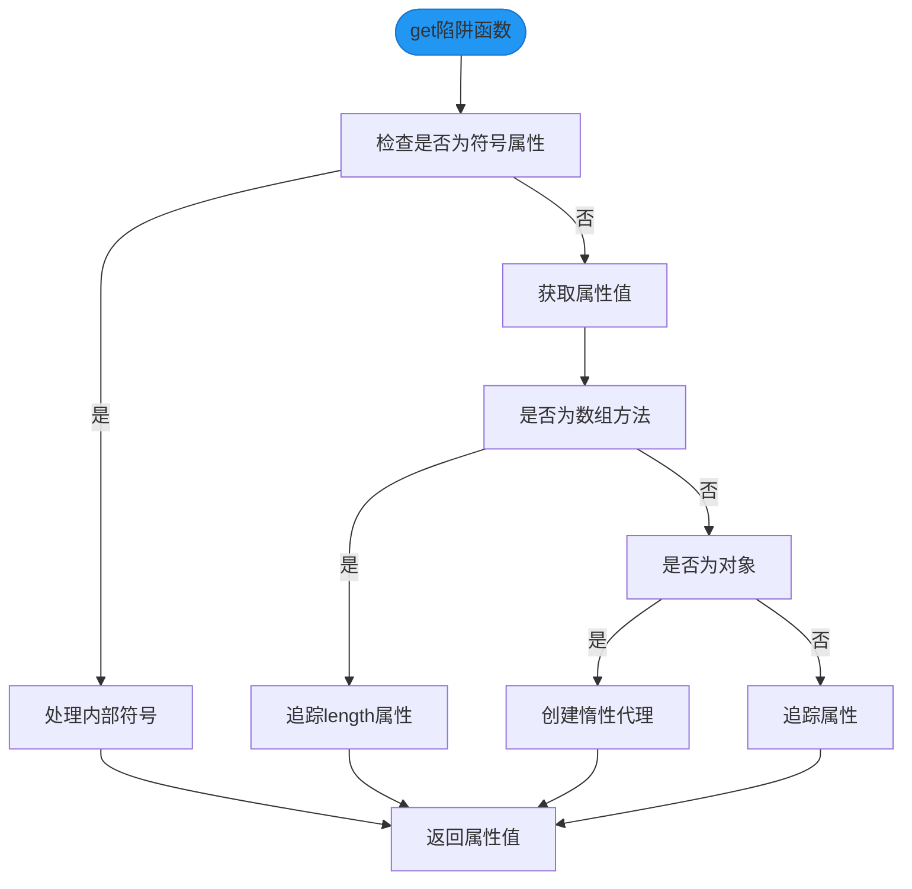

**Diagram sources**
- [proxy-handler.ts](file://packages/responsive/src/signal/reactive/proxy-handler.ts#L171-L214)

#### set陷阱函数

set陷阱函数负责处理属性值的设置和变更通知：

1. **值比较**：使用配置的比较函数（默认为Object.is）比较新旧值
2. **子代理清理**：删除旧的子代理引用
3. **值更新**：更新目标对象的属性值
4. **变更通知**：通过`notify()`方法通知所有依赖

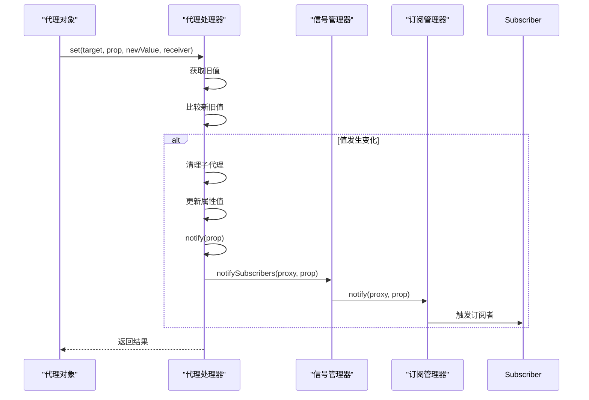

**Diagram sources**
- [proxy-handler.ts](file://packages/responsive/src/signal/reactive/proxy-handler.ts#L251-L263)
- [manager.ts](file://packages/responsive/src/signal/manager.ts#L115-L122)

#### has和ownKeys陷阱函数

has陷阱函数用于拦截`in`操作符和`hasOwnProperty`方法的调用，主要作用是收集属性存在性检查的依赖。ownKeys陷阱函数拦截`Object.keys()`、`for...in`等操作，用于收集对象键枚举的依赖。

## 依赖收集系统

### 依赖收集与触发流程

依赖收集系统通过`Depend`类实现，主要包含以下核心方法：

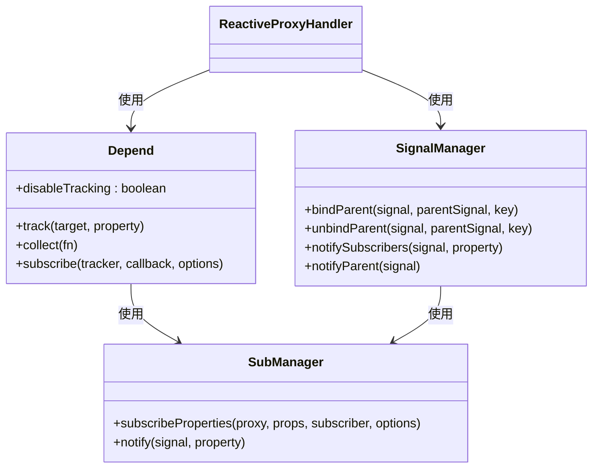

**Diagram sources**
- [depend.ts](file://packages/responsive/src/depend/depend.ts#L41-L152)
- [manager.ts](file://packages/responsive/src/signal/manager.ts#L17-L153)
- [proxy-handler.ts](file://packages/responsive/src/signal/reactive/proxy-handler.ts#L83-L397)

**Section sources**
- [depend.ts](file://packages/responsive/src/depend/depend.ts#L41-L152)
- [manager.ts](file://packages/responsive/src/signal/manager.ts#L17-L153)

### 依赖收集流程

依赖收集的完整流程如下：

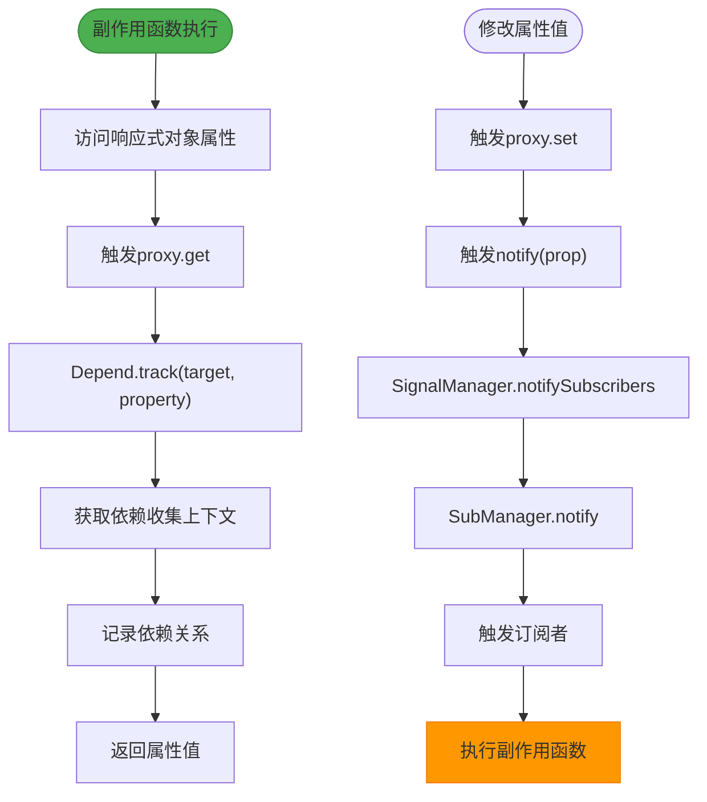

**Diagram sources**
- [depend.ts](file://packages/responsive/src/depend/depend.ts#L59-L64)
- [proxy-handler.ts](file://packages/responsive/src/signal/reactive/proxy-handler.ts#L297-L299)

## 衍生API对比

### reactive API家族

reactive API提供了一系列衍生API，满足不同的使用场景需求：

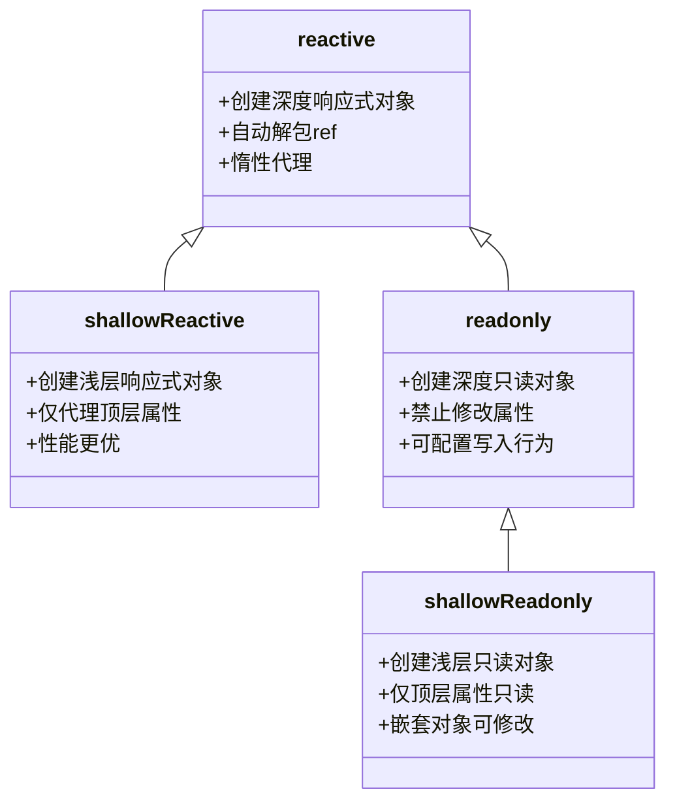

**Diagram sources**
- [helpers.ts](file://packages/responsive/src/signal/reactive/helpers.ts#L35-L111)
- [helpers.ts](file://packages/responsive/src/signal/readonly/helpers.ts#L28-L66)
- [readonly.ts](file://packages/responsive/src/signal/readonly/readonly.ts#L39-L136)

**Section sources**
- [helpers.ts](file://packages/responsive/src/signal/reactive/helpers.ts#L35-L111)
- [helpers.ts](file://packages/responsive/src/signal/readonly/helpers.ts#L28-L66)

### API特性对比表

| 特性 | reactive | shallowReactive | readonly | shallowReadonly |
|------|----------|-----------------|----------|-----------------|
| **深度代理** | ✓ | ✗ | ✓ | ✗ |
| **响应式** | ✓ | ✓ | ✗ | ✗ |
| **可修改** | ✓ | ✓ | ✗ | ✗ |
| **性能开销** | 高 | 低 | 中 | 低 |
| **适用场景** | 深层状态管理 | 性能敏感场景 | 配置对象 | 部分保护场景 |

**Section sources**
- [helpers.ts](file://packages/responsive/src/signal/reactive/helpers.ts#L35-L111)
- [helpers.ts](file://packages/responsive/src/signal/readonly/helpers.ts#L28-L66)

## 使用规范与限制

### 基本使用规范

reactive API的使用需要遵循一定的规范：

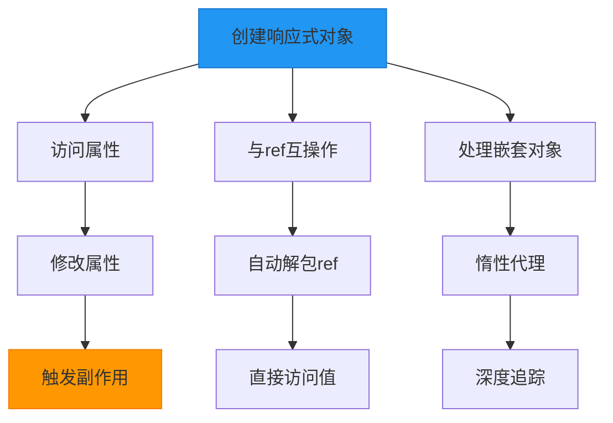

**Section sources**
- [proxy-handler.ts](file://packages/responsive/src/signal/reactive/proxy-handler.ts#L186-L209)
- [ref.ts](file://packages/responsive/src/signal/ref/ref.ts#L136-L147)

### 主要限制与解决方案

reactive API存在一些使用限制，需要特别注意：

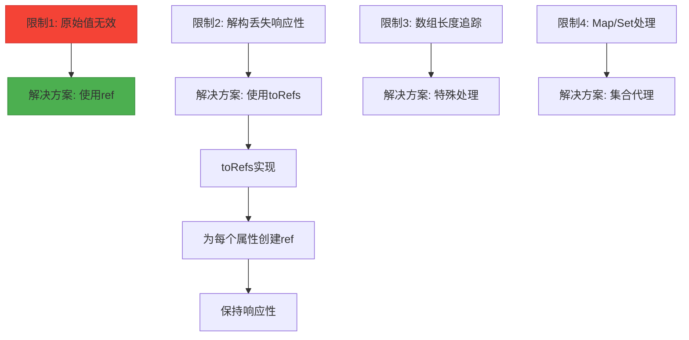

**Diagram sources**
- [helpers.ts](file://packages/responsive/src/signal/reactive/helpers.ts#L35-L111)
- [ref.ts](file://packages/responsive/src/signal/ref/ref.ts#L39-L41)

#### 原始值限制

reactive API只能用于对象类型，对原始值（number、string、boolean等）无效。对于原始值的响应式需求，应该使用`ref` API。

#### 解构响应性丢失

当对响应式对象进行解构时，会丢失响应性：

```typescript
const state = reactive({ count: 0, name: 'Alice' })
const { count, name } = state // count和name不再是响应式的
```

解决方案是使用`toRefs`：

```typescript
const state = reactive({ count: 0, name: 'Alice' })
const { count, name } = toRefs(state) // count和name是ref，保持响应性
```

**Section sources**
- [ref.ts](file://packages/responsive/src/signal/ref/ref.ts#L39-L41)
- [helpers.ts](file://packages/responsive/src/signal/reactive/helpers.ts#L35-L111)

## 实际应用示例

### 状态管理应用

reactive API在状态管理中的典型应用：

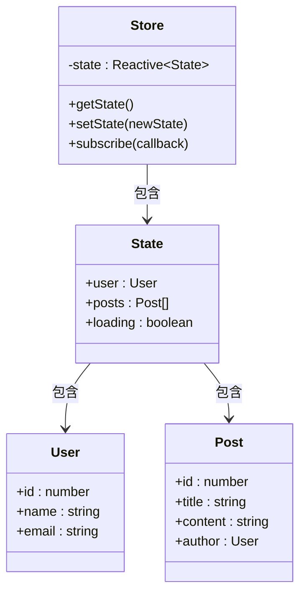

**Section sources**
- [proxy-handler.ts](file://packages/responsive/src/signal/reactive/proxy-handler.ts#L83-L397)
- [ref.ts](file://packages/responsive/src/signal/ref/ref.ts#L70-L472)

### 响应式对象操作

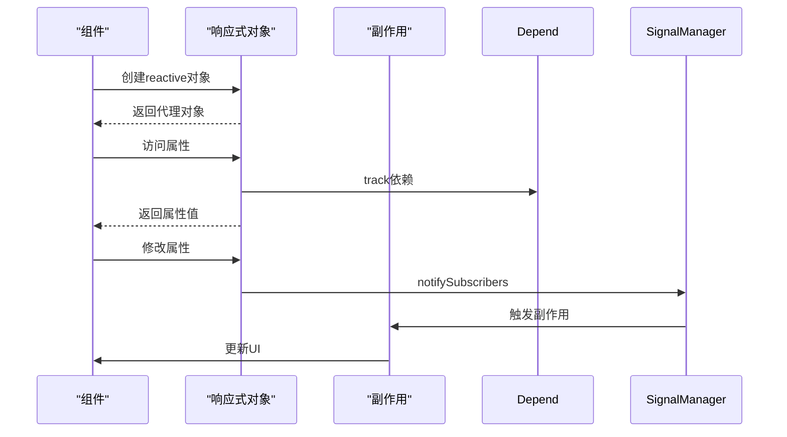

**Diagram sources**
- [proxy-handler.ts](file://packages/responsive/src/signal/reactive/proxy-handler.ts#L251-L263)
- [manager.ts](file://packages/responsive/src/signal/manager.ts#L115-L122)

## 总结

reactive API通过Proxy代理实现了强大的深度响应式系统，能够自动追踪对象属性的访问和修改。系统通过`Depend`类进行依赖收集，通过`SignalManager`和`SubManager`进行变更通知，形成了完整的响应式闭环。

主要特点包括：
- **深度响应式**：自动代理嵌套对象的所有属性
- **惰性代理**：只有在访问时才创建子代理，优化性能
- **自动解包**：自动解包ref类型的值
- **灵活配置**：支持自定义比较函数和深度配置

使用时需要注意其限制，如不能用于原始值、解构会丢失响应性等，并使用相应的解决方案如`ref`和`toRefs`。

**Section sources**
- [proxy-handler.ts](file://packages/responsive/src/signal/reactive/proxy-handler.ts#L83-L397)
- [helpers.ts](file://packages/responsive/src/signal/reactive/helpers.ts#L35-L111)
- [ref.ts](file://packages/responsive/src/signal/ref/ref.ts#L70-L472)