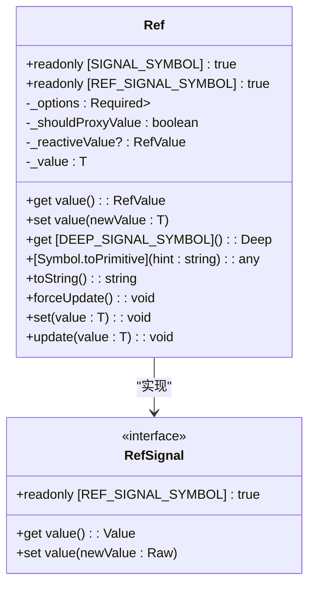
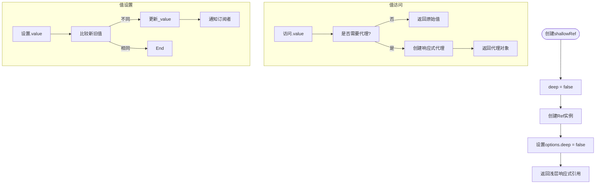
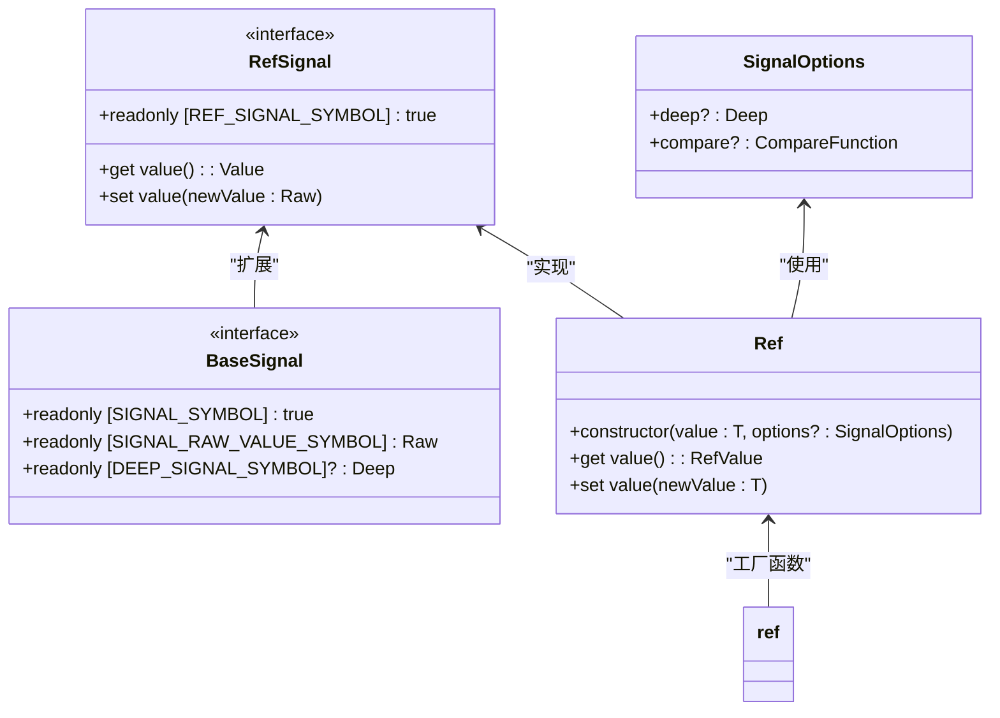
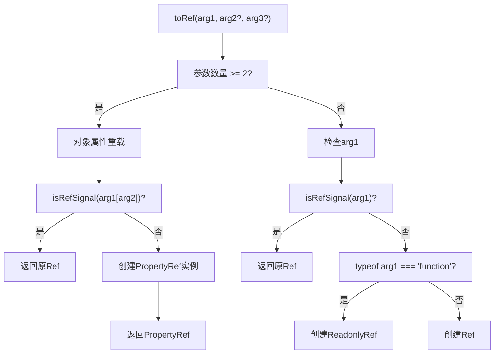
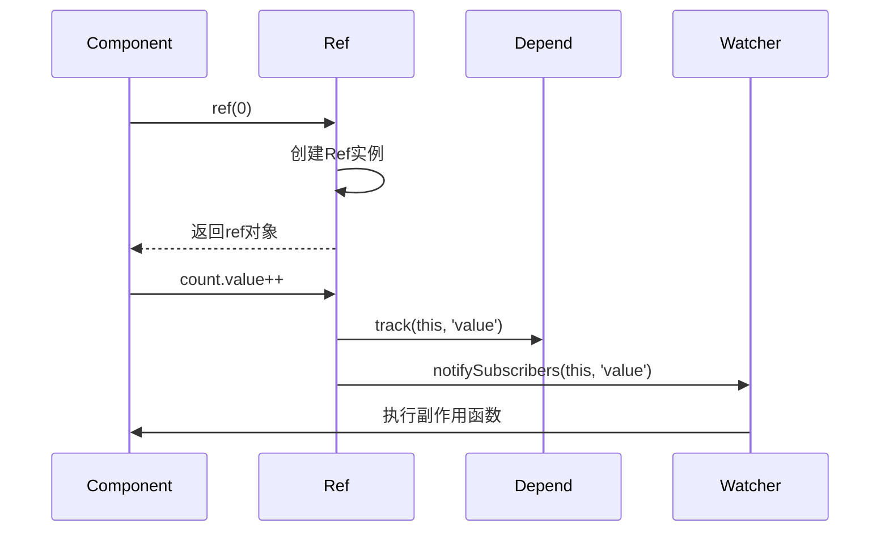

# ref API

<cite>
**本文档中引用的文件**  
- [ref.ts](file://packages/responsive/src/signal/ref/ref.ts)
- [helpers.ts](file://packages/responsive/src/signal/ref/helpers.ts)
- [property.ts](file://packages/responsive/src/signal/ref/property.ts)
- [readonly.ts](file://packages/responsive/src/signal/ref/readonly.ts)
- [ref.test.ts](file://packages/responsive/__tests__/signal/ref.test.ts)
- [types/ref.ts](file://packages/responsive/src/signal/types/ref.ts)
- [base.ts](file://packages/responsive/src/signal/types/base.ts)
- [constants.ts](file://packages/responsive/src/signal/constants.ts)
- [conversion.ts](file://packages/responsive/src/signal/utils/conversion.ts)
- [verify.ts](file://packages/responsive/src/signal/utils/verify.ts)
</cite>

## 目录
1. [简介](#简介)
2. [核心组件](#核心组件)
3. [RefSignal类结构](#refsignal类结构)
4. [shallowRef浅层响应式](#shallowref浅层响应式)
5. [TypeScript类型定义](#typescript类型定义)
6. [辅助函数](#辅助函数)
7. [使用示例](#使用示例)

## 简介
`ref` API 是响应式系统的核心组成部分，用于创建包装原始值的响应式引用对象。通过 `.value` 属性访问和修改值，当值发生变化时会自动触发依赖更新。该API支持深度响应式和浅层响应式两种模式，适用于不同场景的性能优化需求。

## 核心组件

`ref` API 的核心实现位于 `packages/responsive/src/signal/ref/` 目录下，主要包括 `Ref` 类、`ref` 工厂函数以及相关的类型定义和工具函数。`Ref` 类实现了 `RefSignal` 接口，通过内部的 `_value` 存储原始值，并在访问 `.value` 时进行依赖追踪和响应式代理。

**本节来源**
- [ref.ts](file://packages/responsive/src/signal/ref/ref.ts#L70-L287)
- [types/ref.ts](file://packages/responsive/src/signal/types/ref.ts#L10-L22)

## RefSignal类结构

`Ref` 类是 `ref` API 的核心实现，其结构设计遵循响应式系统的基本原则：

**图示来源**
- [ref.ts](file://packages/responsive/src/signal/ref/ref.ts#L70-L287)
- [types/ref.ts](file://packages/responsive/src/signal/types/ref.ts#L10-L22)

### 属性与方法说明

- **`[SIGNAL_SYMBOL]`**: 响应式信号标识符，用于标记对象为响应式信号
- **`[REF_SIGNAL_SYMBOL]`**: 值引用信号标识符，用于标记对象为引用类型信号
- **`_value`**: 私有属性，存储原始值
- **`_reactiveValue`**: 私有属性，存储代理后的响应式对象（当需要深度响应式时）
- **`value` getter**: 获取响应式值，同时追踪依赖
- **`value` setter**: 设置新值并触发更新通知
- **`forceUpdate()`**: 强制触发更新事件，即使值未改变
- **`set()` 和 `update()`**: 便捷方法，等同于直接设置 `value` 属性

**本节来源**
- [ref.ts](file://packages/responsive/src/signal/ref/ref.ts#L70-L287)
- [constants.ts](file://packages/responsive/src/signal/constants.ts#L1-L25)

## shallowRef浅层响应式

`shallowRef` 函数创建浅层响应式引用，只对顶层属性进行响应式处理，而不会递归代理嵌套对象。这种模式在处理大型数据结构或第三方不可变对象时能显著提升性能。

**图示来源**
- [ref.ts](file://packages/responsive/src/signal/ref/ref.ts#L413-L472)
- [ref.test.ts](file://packages/responsive/__tests__/signal/ref.test.ts#L64-L70)

### 适用场景

- 大型数据结构：避免深度代理带来的性能开销
- 第三方不可变对象：保持对象的不可变性
- 频繁更新的复杂对象：减少不必要的响应式转换

**本节来源**
- [ref.ts](file://packages/responsive/src/signal/ref/ref.ts#L413-L472)
- [ref.test.ts](file://packages/responsive/__tests__/signal/ref.test.ts#L64-L70)

## TypeScript类型定义

`ref` API 提供了完整的 TypeScript 类型支持，确保类型安全和开发体验。

**图示来源**
- [types/ref.ts](file://packages/responsive/src/signal/types/ref.ts#L10-L22)
- [base.ts](file://packages/responsive/src/signal/types/base.ts#L55-L88)
- [ref.ts](file://packages/responsive/src/signal/ref/ref.ts#L70-L287)

### 主要类型

- **`RefSignal<T, R>`**: 引用信号接口，定义了 `value` 属性的 getter 和 setter
- **`BaseSignal<R, D>`**: 基础信号接口，包含信号标识符和原始值访问
- **`SignalOptions<D>`**: 信号配置选项，支持 `deep` 和 `compare` 参数
- **`UnwrapNestedRefs<T>`**: 递归解包嵌套响应式信号值的工具类型

**本节来源**
- [types/ref.ts](file://packages/responsive/src/signal/types/ref.ts#L10-L22)
- [base.ts](file://packages/responsive/src/signal/types/base.ts#L55-L88)
- [ref.ts](file://packages/responsive/src/signal/ref/ref.ts#L39-L54)

## 辅助函数

`ref` API 提供了一系列辅助函数来增强使用体验和灵活性。

### toRef 和 toRefs

**图示来源**
- [helpers.ts](file://packages/responsive/src/signal/ref/helpers.ts#L141-L164)
- [property.ts](file://packages/responsive/src/signal/ref/property.ts#L36-L54)
- [readonly.ts](file://packages/responsive/src/signal/ref/readonly.ts#L33-L73)

### unref 和 toRaw

- **`unref<T>(ref)`**: 如果输入是 `RefSignal` 对象，则返回其 `.value`；否则原样返回
- **`toRaw<T>(signal)`**: 将响应式信号对象转换为其原始值，不会触发依赖收集

**本节来源**
- [helpers.ts](file://packages/responsive/src/signal/ref/helpers.ts#L38-L40)
- [conversion.ts](file://packages/responsive/src/signal/utils/conversion.ts#L43-L48)
- [verify.ts](file://packages/responsive/src/signal/utils/verify.ts#L24-L25)

## 使用示例

### 基本用法

**图示来源**
- [ref.test.ts](file://packages/responsive/__tests__/signal/ref.test.ts#L17-L28)
- [ref.ts](file://packages/responsive/src/signal/ref/ref.ts#L136-L147)

### 组件中使用

- 创建响应式变量
- 绑定DOM引用
- 与 `computed` 和 `watch` 集成使用

**本节来源**
- [ref.test.ts](file://packages/responsive/__tests__/signal/ref.test.ts#L15-L187)
- [ref.ts](file://packages/responsive/src/signal/ref/ref.ts#L70-L287)