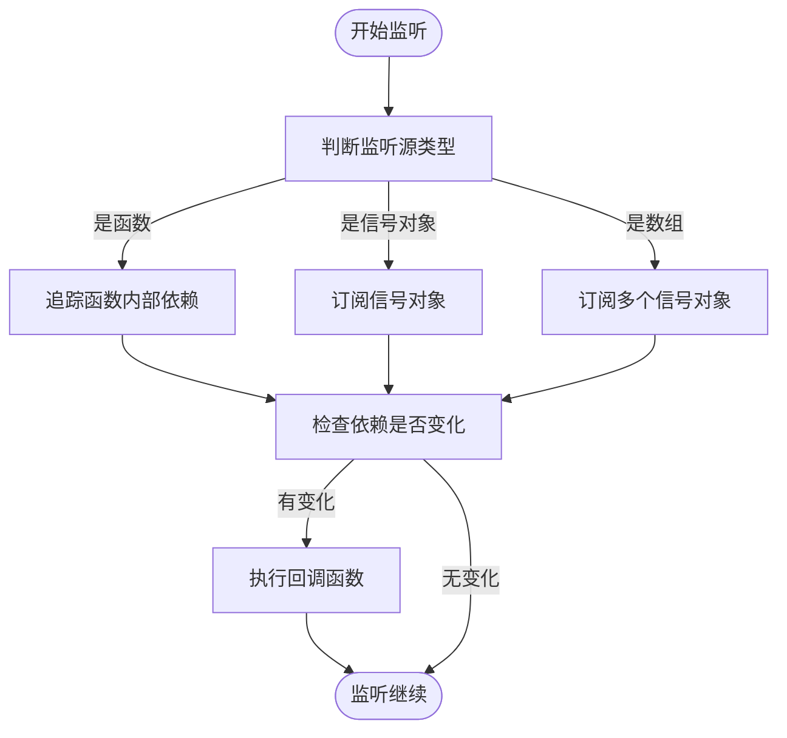
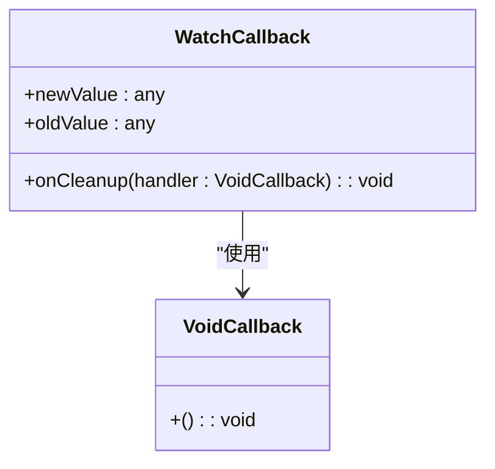
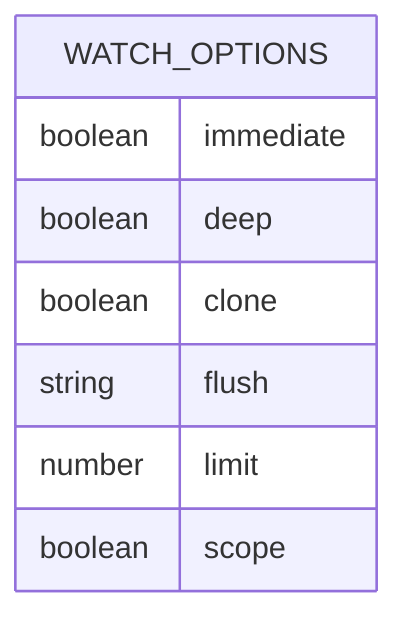
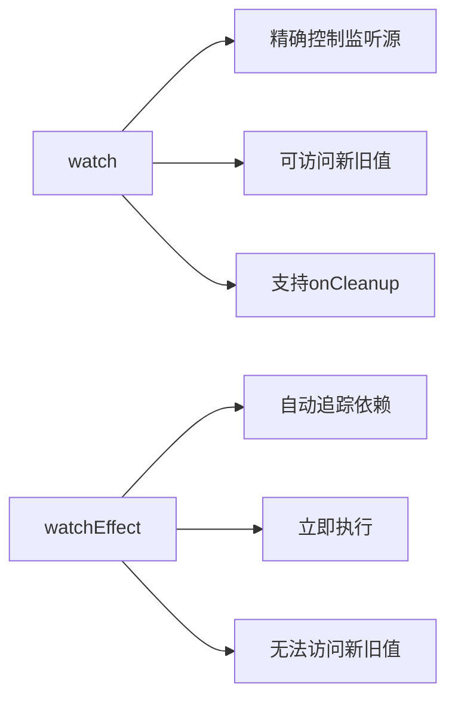

# watch API

<cite>
**本文档中引用的文件**  
- [watch.ts](file://packages/responsive/src/signal/watch/watch.ts)
- [ref.ts](file://packages/responsive/src/signal/ref/ref.ts)
- [depend.ts](file://packages/responsive/src/depend/depend.ts)
- [subManager.ts](file://packages/responsive/src/observer/subManager.ts)
- [subscriber.ts](file://packages/responsive/src/observer/subscriber.ts)
</cite>

## 目录
1. [简介](#简介)
2. [监听机制](#监听机制)
3. [回调函数参数](#回调函数参数)
4. [配置选项](#配置选项)
5. [与watchEffect的对比](#与watcheffect的对比)
6. [典型用例](#典型用例)
7. [最佳实践](#最佳实践)

## 简介
`watch` API 是响应式系统中的核心功能之一，用于监听响应式数据源（如 `ref`、`reactive` 对象、getter 函数或其数组组合）的变化，并在变化时执行指定的回调函数。它提供了精确的控制能力，适用于需要明确指定监听源和回调执行时机的场景。

**Section sources**
- [watch.ts](file://packages/responsive/src/signal/watch/watch.ts#L1-L432)

## 监听机制
`watch` 函数通过依赖追踪机制监听响应式数据源的变化。当传入 `ref` 或 `reactive` 对象时，会直接监听该对象的属性变化；当传入函数时，会优先追踪函数内部依赖的响应式信号，若无依赖则监听函数返回值的变化。

对于数组形式的监听源，`watch` 会同时监听多个响应式对象的变化，并在任意一个对象发生变化时触发回调。该机制基于 `SubManager` 和 `Depend` 模块实现，通过 `WeakMap` 存储订阅关系，并在数据变更时通知相关订阅者。

**Diagram sources**
- [watch.ts](file://packages/responsive/src/signal/watch/watch.ts#L192-L295)
- [subManager.ts](file://packages/responsive/src/observer/subManager.ts#L1-L424)

**Section sources**
- [watch.ts](file://packages/responsive/src/signal/watch/watch.ts#L192-L295)
- [subManager.ts](file://packages/responsive/src/observer/subManager.ts#L1-L424)

## 回调函数参数
`watch` 的回调函数接收三个参数：新值、旧值和 `onCleanup` 工具函数。

- **新值与旧值**：表示响应式数据源变化前后的内容。当配置 `clone: true` 时，新旧值会被深度克隆，避免引用相同对象导致无法辨别差异的问题。
- **onCleanup**：用于注册清理逻辑的函数，接收一个清理函数作为参数。该清理函数会在下次回调触发前或监听被销毁时自动执行，常用于取消定时器、解绑事件监听器等资源释放操作。

**Diagram sources**
- [watch.ts](file://packages/responsive/src/signal/watch/watch.ts#L91-L95)
- [watch.ts](file://packages/responsive/src/signal/watch/watch.ts#L204-L209)

**Section sources**
- [watch.ts](file://packages/responsive/src/signal/watch/watch.ts#L91-L95)

## 配置选项
`watch` 提供了多个配置选项来控制监听行为：

- **immediate**：是否立即执行一次回调，默认为 `false`。设置为 `true` 时，会在监听创建后立即执行回调。
- **deep**：是否深度监听嵌套对象的变化。对于 `reactive` 对象，默认会深度监听其所有嵌套属性。
- **clone**：是否深度克隆新旧值，默认为 `false`。启用此选项可解决对象引用相同导致无法辨别差异的问题，但会带来额外的性能开销。
- **flush**：指定回调的执行时机，可选值包括 `'default'`、`'pre'`、`'post'` 和 `'sync'`，分别对应不同的调度策略。
- **limit**：限制回调触发次数，设置为 `0` 表示无限制。
- **scope**：是否自动添加到当前作用域，作用域销毁时会自动清理监听。

**Diagram sources**
- [watch.ts](file://packages/responsive/src/signal/watch/watch.ts#L48-L66)
- [subscriber.ts](file://packages/responsive/src/observer/subscriber.ts#L17-L59)

**Section sources**
- [watch.ts](file://packages/responsive/src/signal/watch/watch.ts#L48-L66)

## 与watchEffect的对比
`watch` 与 `watchEffect` 的主要区别在于控制粒度和使用场景：

- **watch**：适用于需要精确控制监听源和回调时机的场景。必须明确指定监听源，可以访问新旧值，并支持 `onCleanup` 清理机制。
- **watchEffect**：更侧重于副作用的自动追踪，会立即执行并自动追踪其内部访问的所有响应式依赖。无需指定监听源，但无法直接访问新旧值。

`watch` 提供了更细粒度的控制能力，适合处理复杂的响应式逻辑；而 `watchEffect` 更适合简单的副作用追踪场景。

**Diagram sources**
- [watch.ts](file://packages/responsive/src/signal/watch/watch.ts#L192-L295)
- [depend.ts](file://packages/responsive/src/depend/depend.ts#L129-L149)

**Section sources**
- [watch.ts](file://packages/responsive/src/signal/watch/watch.ts#L192-L295)
- [depend.ts](file://packages/responsive/src/depend/depend.ts#L129-L149)

## 典型用例
`watch` 可用于多种实际场景：

- **监听路由变化**：当路由参数发生变化时，更新页面内容或执行导航逻辑。
- **表单验证**：监听表单字段的变化，实时验证输入并显示错误信息。
- **异步数据同步**：监听状态变化，自动发起 API 请求并同步数据。
- **性能优化**：通过 `flush` 配置控制回调执行时机，避免不必要的重复渲染。

这些用例展示了 `watch` 在构建响应式应用中的灵活性和实用性。

**Section sources**
- [watch.ts](file://packages/responsive/src/signal/watch/watch.ts#L155-L190)

## 最佳实践
使用 `watch` 时应注意以下最佳实践：

- 避免在回调中修改监听源的值，以防止无限循环调用。
- 合理使用 `immediate` 选项，避免不必要的初始执行。
- 对于大型对象的监听，谨慎使用 `clone` 选项以避免性能问题。
- 利用 `onCleanup` 正确管理副作用资源，防止内存泄漏。
- 通过 `limit` 选项控制触发次数，避免过度响应。

遵循这些实践可确保 `watch` 的高效和稳定运行。

**Section sources**
- [watch.ts](file://packages/responsive/src/signal/watch/watch.ts#L192-L295)
- [subscriber.ts](file://packages/responsive/src/observer/subscriber.ts#L159-L166)