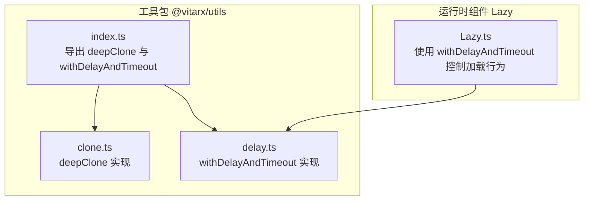
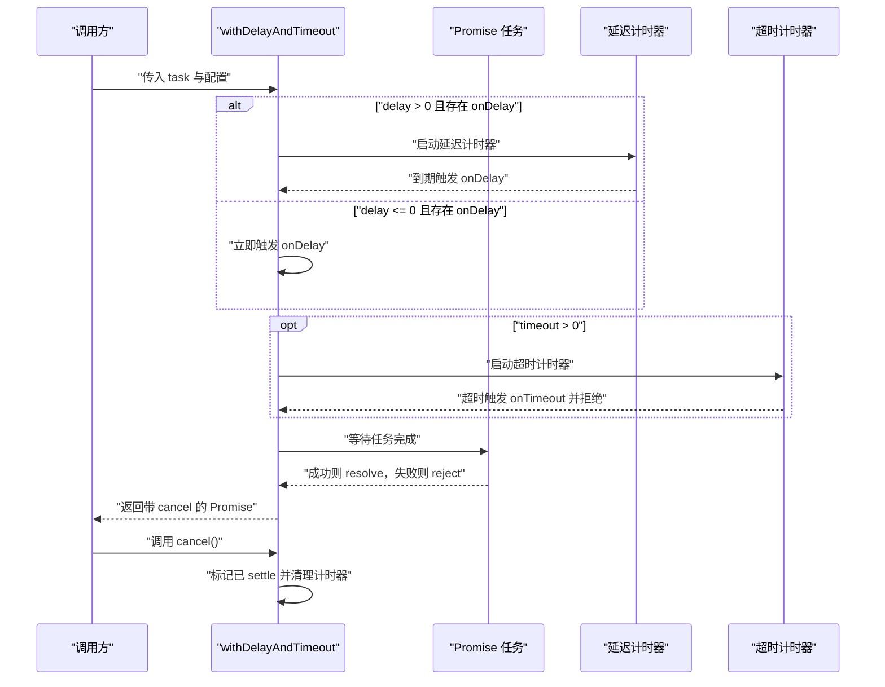
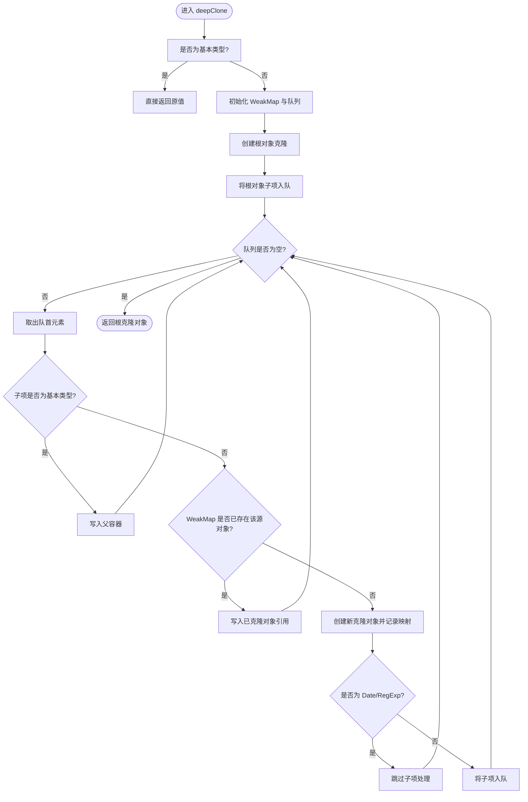
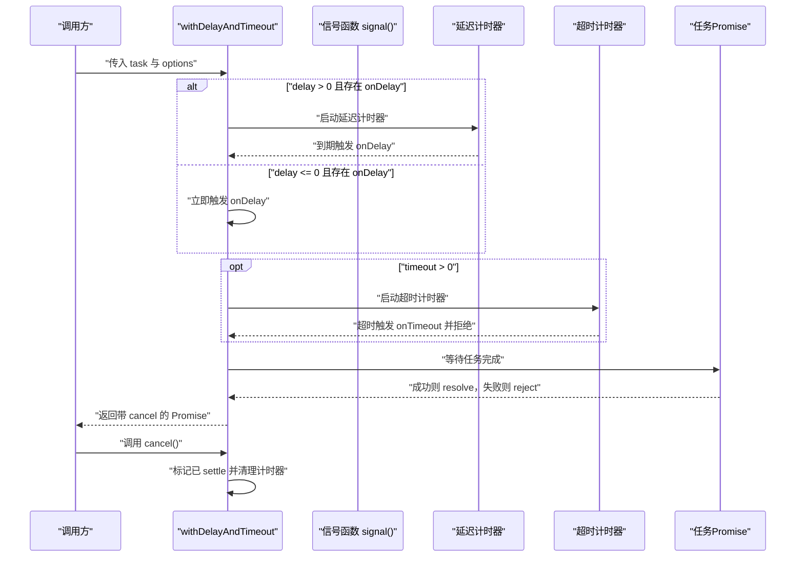
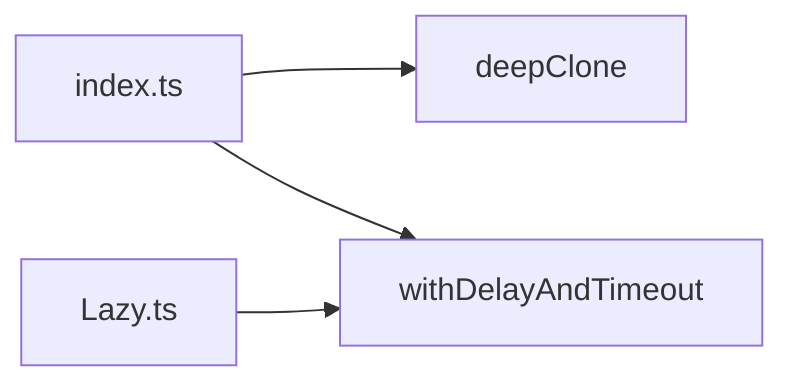

# 工具函数

<cite>
**本文引用的文件**
- [clone.ts](file://packages/utils/src/clone.ts)
- [delay.ts](file://packages/utils/src/delay.ts)
- [index.ts](file://packages/utils/src/index.ts)
- [README.md（工具包）](file://packages/utils/README.md)
- [Lazy.ts](file://packages/runtime-core/src/widget/widgets/Lazy.ts)
- [clone.test.ts](file://packages/utils/__tests__/clone.test.ts)
</cite>

## 目录
1. [简介](#简介)
2. [项目结构](#项目结构)
3. [核心组件](#核心组件)
4. [架构总览](#架构总览)
5. [详细组件分析](#详细组件分析)
6. [依赖分析](#依赖分析)
7. [性能考虑](#性能考虑)
8. [故障排查指南](#故障排查指南)
9. [结论](#结论)
10. [附录](#附录)

## 简介
本文件聚焦于两个工具函数API文档：deepClone 与 withDelayAndTimeout。前者提供对对象、数组、Set、Map、Date、RegExp 等类型的深度克隆，并能正确处理循环引用；后者用于为任意 Promise 任务增加延迟显示与超时控制，并返回一个带 cancel 方法的 Promise，便于在 UI 或业务层进行任务有效性检查与手动取消。

## 项目结构
- 工具函数位于 @vitarx/utils 包内，分别提供 deepClone 与 withDelayAndTimeout 的实现与导出入口。
- 工具包 README 对 deepClone 的能力进行了简要说明。
- 运行时组件 Lazy 在实际场景中使用了 withDelayAndTimeout 实现“加载延迟 + 请求超时”的交互体验。

图表来源
- [index.ts](file://packages/utils/src/index.ts#L1-L8)
- [clone.ts](file://packages/utils/src/clone.ts#L1-L124)
- [delay.ts](file://packages/utils/src/delay.ts#L1-L145)
- [Lazy.ts](file://packages/runtime-core/src/widget/widgets/Lazy.ts#L1-L235)

章节来源
- [index.ts](file://packages/utils/src/index.ts#L1-L8)
- [README.md（工具包）](file://packages/utils/README.md#L1-L50)

## 核心组件
- deepClone：对对象、数组、Set、Map、Date、RegExp 等类型进行深度克隆，支持循环引用处理。
- withDelayAndTimeout：为 Promise 任务增加延迟触发、超时控制与取消能力，返回带 cancel 的 Promise。

章节来源
- [clone.ts](file://packages/utils/src/clone.ts#L69-L124)
- [delay.ts](file://packages/utils/src/delay.ts#L1-L145)
- [README.md（工具包）](file://packages/utils/README.md#L7-L11)

## 架构总览
- deepClone 采用广度优先遍历策略，借助 WeakMap 记录已克隆对象以避免重复克隆与死循环，同时针对 Set/Map/Array/Object 分别创建对应容器并入队子项。
- withDelayAndTimeout 封装 Promise 生命周期：在 delay > 0 时延后触发 onDelay；在 timeout > 0 时超时触发 onTimeout 并拒绝；任务完成后清理计时器并调用 onResolve/onReject；同时暴露 cancel 方法以便外部主动取消。

图表来源
- [delay.ts](file://packages/utils/src/delay.ts#L72-L145)

## 详细组件分析

### deepClone 组件分析
- 功能概述
  - 支持基本类型、对象、数组、Set、Map、Date、RegExp 的深度克隆。
  - 正确处理循环引用，避免无限递归与内存泄漏。
  - 保留原型链，确保克隆实例仍属于原类的构造关系。
- 关键实现要点
  - 类型判定：通过 isPrimitive 快速识别基本类型，减少不必要的克隆开销。
  - 克隆策略：按类型选择对应的工厂函数创建空容器，再广度优先入队子项。
  - 循环引用：使用 WeakMap 记录源对象到克隆对象的映射，遇到已克隆对象直接复用。
  - 子项入队：针对 Set/Map/Array/Object 使用不同枚举方式，保证键名与索引的正确传递。
  - 值注入：统一通过 addToParent 写入父容器，兼容 Set/Map 的特殊写入方式。
- 复杂度与性能
  - 时间复杂度：O(N)，N 为所有可枚举节点数量（含嵌套）。
  - 空间复杂度：O(N)，主要由队列与 WeakMap 占用。
  - 循环引用：通过 WeakMap 哈希表避免重复克隆，提升稳定性。
- 错误处理与边界
  - 基本类型直接返回，Symbol 键的对象可被正确克隆。
  - 原型链被保留，确保克隆对象与源对象具有相同的构造关系。
- 使用建议
  - 对包含循环引用的数据结构进行深拷贝时，优先使用 deepClone。
  - 克隆包含 Date/RegExp/Set/Map 的复合对象时，注意其内部结构会被完整复制。

图表来源
- [clone.ts](file://packages/utils/src/clone.ts#L1-L124)

章节来源
- [clone.ts](file://packages/utils/src/clone.ts#L1-L124)
- [clone.test.ts](file://packages/utils/__tests__/clone.test.ts#L1-L98)

### withDelayAndTimeout 组件分析
- 功能概述
  - 为 Promise 任务增加延迟触发与超时控制，支持 onDelay、onTimeout、onResolve、onReject 回调。
  - 返回一个带 cancel 方法的 Promise，可在 UI 交互或业务层进行任务有效性检查与手动取消。
- 参数与返回值
  - 参数
    - task：Promise 实例或返回 Promise 的函数。
    - options.delay：延迟触发的毫秒数（<=0 表示无延迟）。
    - options.timeout：超时时间（<=0 不生效）。
    - options.onDelay：延迟触发回调（一般用于显示 loading）。
    - options.onTimeout：超时回调（返回错误对象）。
    - options.onResolve：任务成功回调。
    - options.onReject：任务失败回调。
    - options.signal：任务有效性检查函数，返回 true 表示任务无效。
  - 返回值：Promise<T>，并附加 cancel() 方法。
- 执行流程
  - 启动延迟计时器：delay > 0 时延后触发 onDelay；delay <= 0 时立即触发。
  - 启动超时计时器：timeout > 0 时超时触发 onTimeout 并拒绝。
  - 等待任务完成：成功走 resolve，失败走 reject，并清理计时器。
  - cancel：若未 settle，调用 cancel 标记已 settle 并清理计时器。
- 使用示例（来自 Lazy 组件）
  - 在惰性加载场景中，通过 delay 显示 loading，通过 timeout 控制加载超时，通过 cancel 在组件卸载时中断加载任务。
  - 参考路径：[Lazy.ts](file://packages/runtime-core/src/widget/widgets/Lazy.ts#L159-L170)

图表来源
- [delay.ts](file://packages/utils/src/delay.ts#L72-L145)

章节来源
- [delay.ts](file://packages/utils/src/delay.ts#L1-L145)
- [Lazy.ts](file://packages/runtime-core/src/widget/widgets/Lazy.ts#L159-L170)

## 依赖分析
- 导出关系
  - index.ts 统一导出 deepClone 与 withDelayAndTimeout，供上层模块按需引入。
- 使用关系
  - Lazy 组件在运行时使用 withDelayAndTimeout 控制异步组件加载的延迟与超时。
  - 工具包 README 对 deepClone 的能力进行了概览说明。

图表来源
- [index.ts](file://packages/utils/src/index.ts#L1-L8)
- [Lazy.ts](file://packages/runtime-core/src/widget/widgets/Lazy.ts#L1-L235)

章节来源
- [index.ts](file://packages/utils/src/index.ts#L1-L8)
- [Lazy.ts](file://packages/runtime-core/src/widget/widgets/Lazy.ts#L1-L235)

## 性能考虑
- deepClone
  - 时间复杂度 O(N)，空间复杂度 O(N)，适合中小规模数据结构。
  - 使用 WeakMap 避免重复克隆，降低循环引用场景下的开销。
- withDelayAndTimeout
  - 仅在 delay/timeout > 0 时创建计时器，避免不必要的定时器占用。
  - 任务完成后及时清理计时器，防止内存泄漏。

## 故障排查指南
- deepClone
  - 若出现循环引用导致的异常或性能问题，请确认数据结构中是否存在自引用或相互引用。
  - 若克隆结果原型链丢失，请检查源对象是否为类实例，deepClone 会保留原型链。
  - 参考测试用例验证基本类型、数组、对象、Symbol 键、Date/RegExp/Set/Map、循环引用与原型链的行为。
- withDelayAndTimeout
  - 若 onDelay 未触发，请检查 delay 是否大于 0 且 onDelay 是否提供。
  - 若 onTimeout 未触发，请检查 timeout 是否大于 0 且任务未提前完成。
  - 若 cancel 无效，请确认任务是否已 settle（已完成或已拒绝），cancel 仅对未 settle 的任务有效。
  - 若使用 signal 检查任务有效性，请确保 signal 返回 true 时任务应被取消。

章节来源
- [clone.test.ts](file://packages/utils/__tests__/clone.test.ts#L1-L98)
- [delay.ts](file://packages/utils/src/delay.ts#L72-L145)

## 结论
- deepClone 提供稳定、高效的深度克隆能力，覆盖常见内置类型与循环引用场景，适合在需要安全复制复杂数据结构的场景使用。
- withDelayAndTimeout 为异步任务提供了灵活的延迟与超时控制，并通过 cancel 机制支持任务生命周期管理，适用于 UI 加载态与网络请求的超时控制。

## 附录
- API 摘要
  - deepClone(obj)
    - 输入：任意类型
    - 输出：与输入类型一致的深拷贝副本
    - 特性：支持循环引用、Date/RegExp/Set/Map、原型链保留
  - withDelayAndTimeout(task, options)
    - 输入：Promise 或返回 Promise 的函数，以及配置项（delay、timeout、onDelay、onTimeout、onResolve、onReject、signal）
    - 输出：Promise<T>，并附加 cancel() 方法
    - 特性：延迟触发、超时拒绝、取消控制、任务有效性检查

章节来源
- [clone.ts](file://packages/utils/src/clone.ts#L69-L124)
- [delay.ts](file://packages/utils/src/delay.ts#L1-L145)