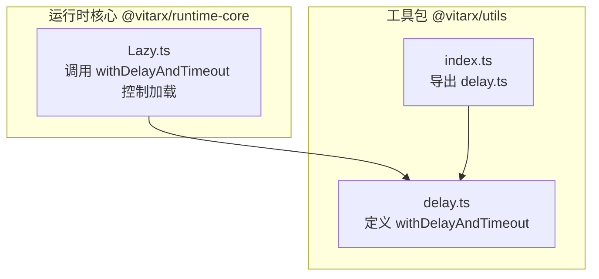
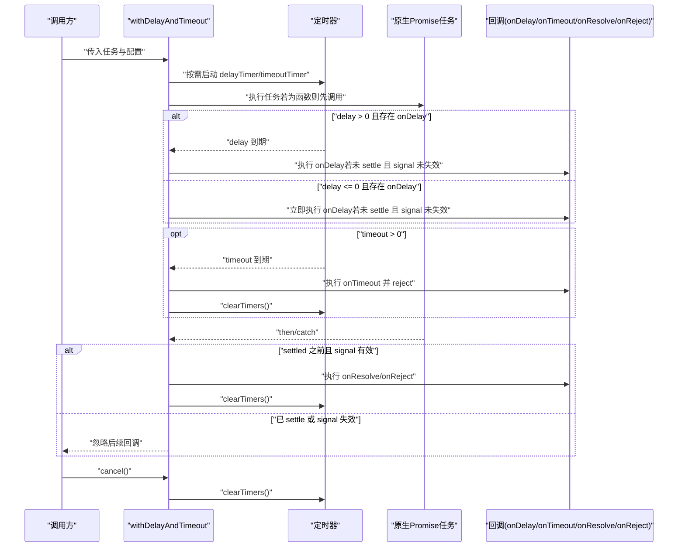
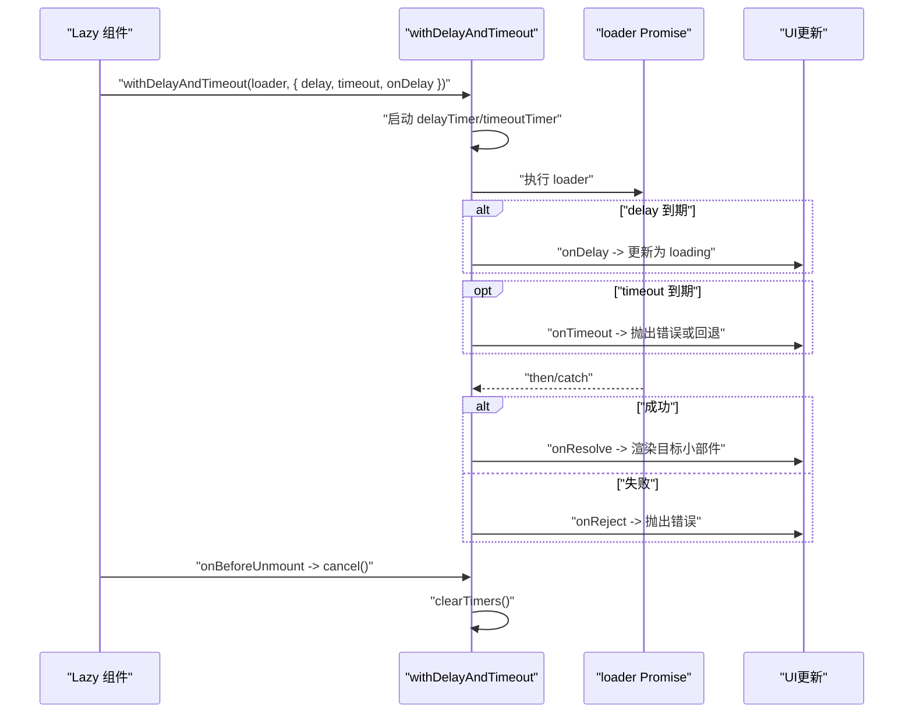
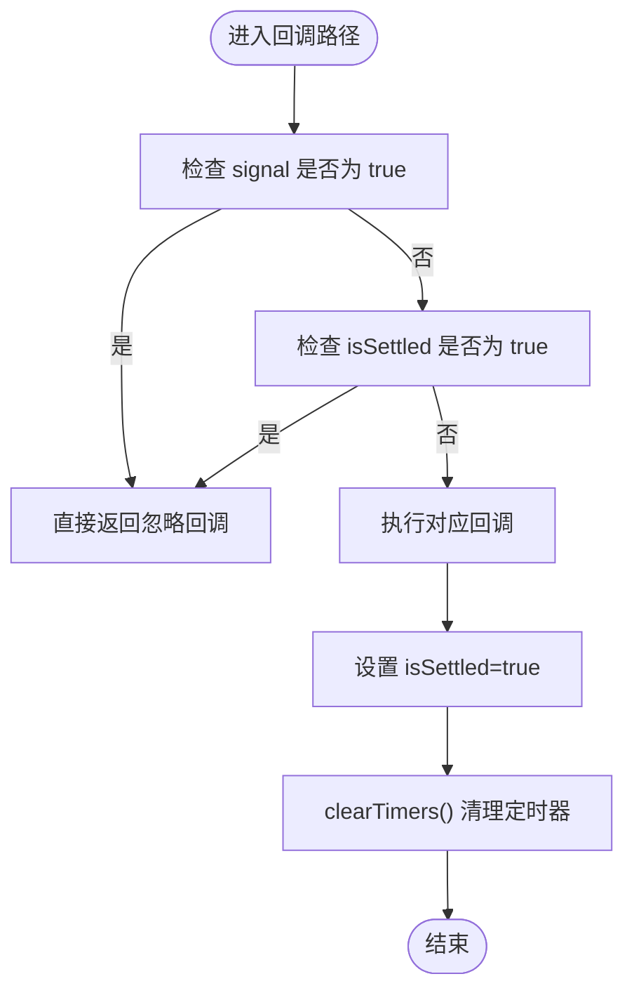

# 延迟与超时控制 (withDelayAndTimeout)

<cite>
**本文引用的文件列表**
- [delay.ts](file://packages/utils/src/delay.ts)
- [index.ts](file://packages/utils/src/index.ts)
- [Lazy.ts](file://packages/runtime-core/src/widget/widgets/Lazy.ts)
</cite>

## 目录
1. [简介](#简介)
2. [项目结构](#项目结构)
3. [核心组件](#核心组件)
4. [架构总览](#架构总览)
5. [详细组件分析](#详细组件分析)
6. [依赖分析](#依赖分析)
7. [性能考量](#性能考量)
8. [故障排查指南](#故障排查指南)
9. [结论](#结论)
10. [附录](#附录)

## 简介
本文档围绕 withDelayAndTimeout 函数展开，系统阐述其作为 Promise 包装器的能力：支持延迟触发（如显示 loading）、超时中断、成功/失败回调，以及基于 signal 的任务有效性检查；并说明返回值是一个增强的 Promise，具备 cancel 方法用于手动取消任务执行。文档同时解析 DelayTimeoutOptions 接口各参数的语义与协作方式，并给出典型使用场景与最佳实践，包括请求加载状态、网络请求超时、组件卸载时自动取消异步任务等。最后强调 isSettled 状态标记与 clearTimers 机制对防止回调重复执行、确保资源清理与状态一致性的关键作用。

## 项目结构
- withDelayAndTimeout 定义于工具包 @vitarx/utils 的 delay.ts 中，并通过该包的入口 index.ts 导出，供上层组件使用。
- 运行时核心包 @vitarx/runtime-core 的 Lazy 惰性加载组件在渲染异步小部件时，调用 withDelayAndTimeout 对加载任务进行延迟与超时控制，并在组件卸载时通过 cancel 方法主动取消未完成的任务。

图表来源
- [delay.ts](file://packages/utils/src/delay.ts#L1-L144)
- [index.ts](file://packages/utils/src/index.ts#L1-L8)
- [Lazy.ts](file://packages/runtime-core/src/widget/widgets/Lazy.ts#L1-L200)

章节来源
- [delay.ts](file://packages/utils/src/delay.ts#L1-L144)
- [index.ts](file://packages/utils/src/index.ts#L1-L8)
- [Lazy.ts](file://packages/runtime-core/src/widget/widgets/Lazy.ts#L1-L200)

## 核心组件
- withDelayAndTimeout：将任意 Promise 或返回 Promise 的任务封装为带延迟与超时控制的增强 Promise，并提供 cancel 主动取消能力。
- DelayTimeoutOptions：配置项接口，包含 delay、timeout、onDelay、onTimeout、onResolve、onReject、signal 等字段，分别用于延迟触发、超时控制、成功/失败回调以及任务有效性检查。
- 返回值 Promise<T> & { cancel: () => void }：标准 Promise，但附加 cancel 方法，用于在任务尚未 settle 时主动终止并清理定时器。

章节来源
- [delay.ts](file://packages/utils/src/delay.ts#L1-L144)

## 架构总览
下图展示 withDelayAndTimeout 的工作流：接收任务与配置，按需启动 delayTimer 与 timeoutTimer，监听原生 Promise 的 settle 事件，根据 isSettled 与 signal 的结果决定是否执行回调与清理定时器；同时暴露 cancel 方法以支持外部主动取消。

图表来源
- [delay.ts](file://packages/utils/src/delay.ts#L72-L144)

## 详细组件分析

### withDelayAndTimeout 函数
- 功能定位
  - 将任意 Promise 或返回 Promise 的任务封装为带延迟与超时控制的增强 Promise。
  - 提供 onDelay、onTimeout、onResolve、onReject 回调，便于 UI 层展示 loading、超时提示与错误处理。
  - 通过 signal 与 isSettled 状态标记，确保任务在完成或无效时不再触发回调，避免重复执行与资源泄漏。
  - 通过 cancel 方法，允许外部在任务未完成时主动取消，配合 clearTimers 完成清理。
- 关键实现要点
  - delayTimer/timeoutTimer：分别用于延迟触发与超时中断。
  - isSettled：布尔标记，一旦任务完成（成功/失败/超时/取消）即置为 true，后续回调均被忽略。
  - clearTimers：统一清理 delayTimer 与 timeoutTimer，防止定时器泄漏。
  - signal：可选的布尔函数，用于判断任务是否仍有效；若返回 true，则在任何回调路径中均提前返回，避免无效更新。
  - 返回值增强 Promise：附加 cancel 方法，内部同样设置 isSettled 并清理定时器。
- 参数与行为
  - task：Promise 实例或返回 Promise 的函数；若为函数，将在内部先执行以获取 Promise。
  - options.delay：延迟毫秒数；delay > 0 时在到期后触发 onDelay；delay <= 0 时立即触发 onDelay（若未失效）。
  - options.timeout：超时毫秒数；timeout > 0 时在到期后触发 onTimeout 并 reject，同时清理定时器。
  - options.onDelay：延迟触发回调，通常用于显示 loading。
  - options.onTimeout：超时回调，接收 Error 对象。
  - options.onResolve：任务成功回调，接收成功值。
  - options.onReject：任务失败回调，接收错误对象。
  - options.signal：任务有效性检查函数，返回 true 表示任务无效，回调路径将被忽略。
- 返回值
  - Promise<T>：标准 Promise，支持 .then/.catch/.finally 与 await。
  - Promise<T> & { cancel: () => void }：额外提供 cancel 方法，用于主动取消任务。

章节来源
- [delay.ts](file://packages/utils/src/delay.ts#L1-L144)

### DelayTimeoutOptions 接口详解
- delay?: number
  - 含义：延迟触发的毫秒数；用于控制何时触发 onDelay。
  - 场景：避免短时任务频繁切换 loading 状态，仅在超过一定延迟时才显示 loading。
- timeout?: number
  - 含义：超时时间（毫秒）；<=0 时不生效。
  - 场景：限制网络请求或异步任务的最大等待时间，超时后中断并触发 onTimeout。
- onDelay?: () => void
  - 含义：延迟触发回调。
  - 场景：显示 loading、打开骨架屏、切换占位符等。
- onTimeout?: (error: Error) => void
  - 含义：超时回调，接收 Error 对象。
  - 场景：记录超时日志、向用户提示、回退策略等。
- onResolve?: (value: T) => void
  - 含义：任务成功回调。
  - 场景：缓存结果、更新 UI、继续下一步流程。
- onReject?: (error: unknown) => void
  - 含义：任务失败回调。
  - 场景：错误上报、UI 错误提示、降级处理。
- signal?: () => boolean
  - 含义：任务有效性检查函数；返回 true 表示任务无效。
  - 场景：组件卸载、路由切换、条件变更导致任务不再需要时，阻止后续回调执行。

章节来源
- [delay.ts](file://packages/utils/src/delay.ts#L1-L16)

### 与 Lazy 组件的集成
- Lazy 在加载异步小部件时，使用 withDelayAndTimeout 包装 loader Promise，通过 delay 与 onDelay 控制 loading 显示时机，通过 timeout 限制加载时间，通过 cancel 在组件卸载时主动取消未完成的加载任务。
- Lazy 将 task.cancel 赋值给内部 _cancelTask，在 onBeforeUnmount 生命周期中调用，确保资源清理与状态一致性。

图表来源
- [Lazy.ts](file://packages/runtime-core/src/widget/widgets/Lazy.ts#L142-L194)
- [delay.ts](file://packages/utils/src/delay.ts#L72-L144)

章节来源
- [Lazy.ts](file://packages/runtime-core/src/widget/widgets/Lazy.ts#L142-L194)

### isSettled 与 clearTimers 的协作机制
- isSettled：在以下路径中被设置为 true：
  - 超时到期（timeout > 0）时；
  - 原生 Promise 成功/失败时；
  - 调用 cancel 时。
- clearTimers：在超时、成功、失败、取消时统一清理 delayTimer 与 timeoutTimer，防止定时器泄漏与回调重复执行。
- signal：在 delay 到期、timeout 到期、Promise settle 之前均会检查，若返回 true 则直接返回，避免无效更新。

图表来源
- [delay.ts](file://packages/utils/src/delay.ts#L90-L144)

章节来源
- [delay.ts](file://packages/utils/src/delay.ts#L90-L144)

## 依赖分析
- 内部依赖
  - withDelayAndTimeout 位于 @vitarx/utils 包，通过 index.ts 导出，供其他包使用。
  - @vitarx/runtime-core 的 Lazy 组件在构建阶段导入 withDelayAndTimeout，用于控制异步小部件加载。
- 外部依赖
  - 无第三方依赖，纯浏览器/Node 环境 API（setTimeout/clearTimeout）。
- 耦合与内聚
  - withDelayAndTimeout 与 Lazy 的耦合点在于回调 onDelay 与取消 cancel 的使用，职责清晰、边界明确。
  - isSettled 与 clearTimers 的设计提升了内聚性，避免了跨模块的复杂状态同步。

图表来源
- [delay.ts](file://packages/utils/src/delay.ts#L1-L144)
- [Lazy.ts](file://packages/runtime-core/src/widget/widgets/Lazy.ts#L1-L200)

章节来源
- [delay.ts](file://packages/utils/src/delay.ts#L1-L144)
- [Lazy.ts](file://packages/runtime-core/src/widget/widgets/Lazy.ts#L1-L200)

## 性能考量
- 定时器管理
  - delayTimer 与 timeoutTimer 在成功/失败/超时/取消时均会清理，避免内存泄漏与回调风暴。
- 回调去抖
  - isSettled 与 signal 的双重保护，确保同一任务不会因多次 settle 或无效状态而重复执行回调。
- 任务粒度
  - 将长耗时任务封装为 Promise 并交由 withDelayAndTimeout 控制，有助于 UI 流畅与用户体验优化。
- 注意事项
  - 若 delay 与 timeout 设置过小，可能导致频繁切换 loading 状态；建议结合业务场景合理设置。
  - onTimeout 与 onReject 的处理应避免阻塞主线程，必要时采用微任务或异步处理。

[本节为通用性能建议，无需特定文件来源]

## 故障排查指南
- 症状：回调被重复执行
  - 可能原因：未正确设置 isSettled 或未调用 clearTimers。
  - 处理：确认在成功/失败/超时/取消路径均设置 isSettled 并调用 clearTimers。
- 症状：定时器泄漏或持续触发
  - 可能原因：未在取消或完成时清理定时器。
  - 处理：确保在所有分支调用 clearTimers。
- 症状：组件卸载后仍更新 UI
  - 可能原因：未使用 signal 或未在生命周期中调用 cancel。
  - 处理：在 signal 中返回组件是否仍处于激活状态；在卸载时调用 cancel。
- 症状：超时未触发
  - 可能原因：timeout <= 0 或任务提前完成。
  - 处理：确认 timeout > 0 且任务确实未在超时前完成。

章节来源
- [delay.ts](file://packages/utils/src/delay.ts#L90-L144)
- [Lazy.ts](file://packages/runtime-core/src/widget/widgets/Lazy.ts#L142-L194)

## 结论
withDelayAndTimeout 通过 delay、timeout、signal 与回调体系，为异步任务提供了完善的延迟与超时控制能力，并以 isSettled 与 clearTimers 保障状态一致性与资源清理。结合 Lazy 组件的集成，可在真实业务中实现流畅的加载体验与健壮的取消机制。建议在实际使用中根据场景合理配置 delay 与 timeout，并始终通过 signal 与 cancel 确保任务的有效性与可控性。

[本节为总结性内容，无需特定文件来源]

## 附录

### API 规范与使用示例（路径指引）
- 函数定义与类型
  - withDelayAndTimeout<T>(task: Promise<T> | (() => Promise<T>), options: DelayTimeoutOptions<T>): Promise<T> & { cancel: () => void }
  - 参考路径：[delay.ts](file://packages/utils/src/delay.ts#L72-L144)
- 配置项接口
  - DelayTimeoutOptions<T>
  - 参考路径：[delay.ts](file://packages/utils/src/delay.ts#L1-L16)
- 入口导出
  - @vitarx/utils/src/index.ts 导出 delay.ts
  - 参考路径：[index.ts](file://packages/utils/src/index.ts#L1-L8)
- 组件集成示例（Lazy）
  - 使用 withDelayAndTimeout 控制加载、设置 delay/timeout、在卸载时 cancel
  - 参考路径：[Lazy.ts](file://packages/runtime-core/src/widget/widgets/Lazy.ts#L142-L194)