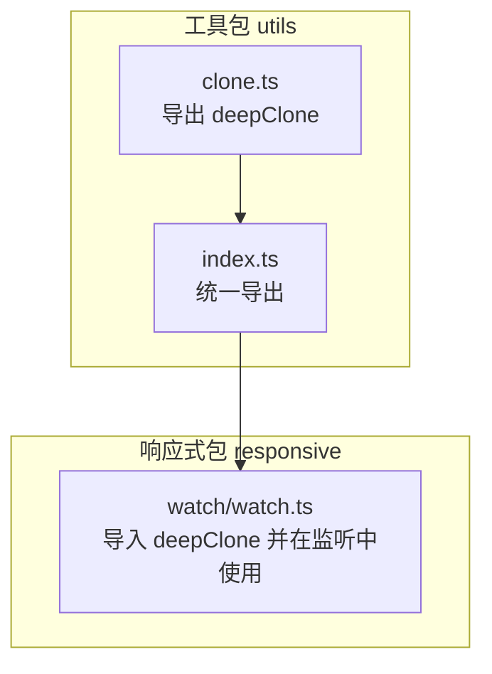
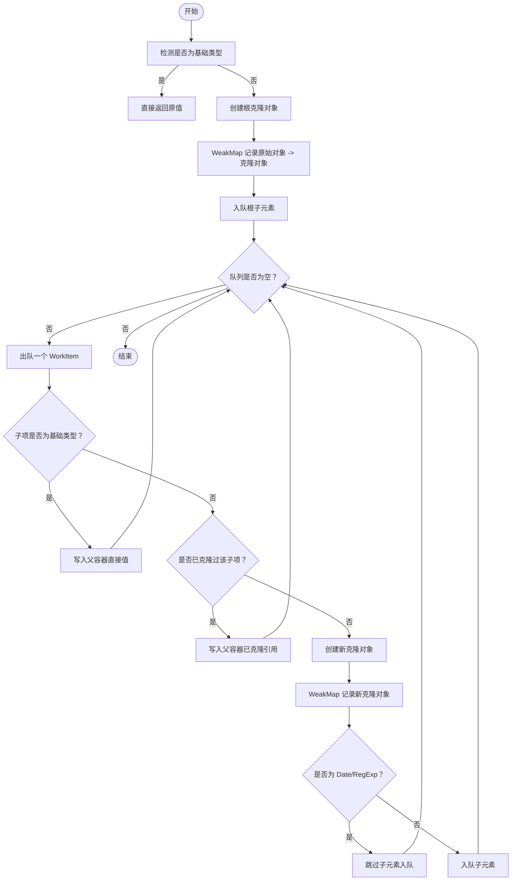
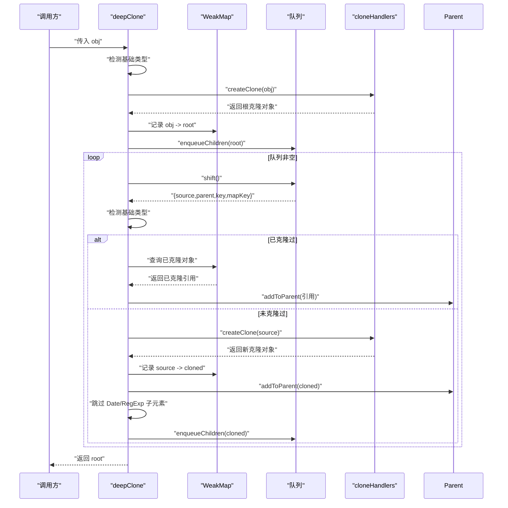
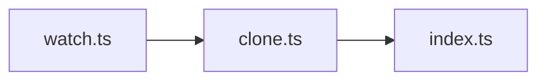

# 深克隆 (deepClone)

<cite>
**本文引用的文件**
- [packages/utils/src/clone.ts](file://packages/utils/src/clone.ts)
- [packages/utils/src/index.ts](file://packages/utils/src/index.ts)
- [packages/utils/__tests__/clone.test.ts](file://packages/utils/__tests__/clone.test.ts)
- [packages/responsive/src/signal/watch/watch.ts](file://packages/responsive/src/signal/watch/watch.ts)
</cite>

## 目录
1. [简介](#简介)
2. [项目结构](#项目结构)
3. [核心组件](#核心组件)
4. [架构总览](#架构总览)
5. [详细组件分析](#详细组件分析)
6. [依赖分析](#依赖分析)
7. [性能考量](#性能考量)
8. [故障排查指南](#故障排查指南)
9. [结论](#结论)
10. [附录](#附录)

## 简介
本文件为 deepClone 深度克隆函数的详细 API 文档，面向使用者与维护者，系统阐述该函数如何实现任意类型对象的深度克隆，覆盖 Date、RegExp、Set、Map、数组、普通对象以及循环引用的正确处理机制；说明其内部使用 WeakMap 追踪已克隆对象以解决循环引用问题，并采用广度优先遍历策略确保克隆过程的稳定性与性能；提供实际使用场景与注意事项，包括不会克隆函数与 undefined 值、原型链继承行为、类型定义 Cloneable 与 WorkItem 的作用，以及 cloneHandlers 处理器的扩展可能性。

## 项目结构
deepClone 位于工具包 packages/utils 中，作为公共工具函数被其他模块复用。其导出入口与使用关系如下图所示：

图表来源
- [packages/utils/src/clone.ts](file://packages/utils/src/clone.ts#L69-L124)
- [packages/utils/src/index.ts](file://packages/utils/src/index.ts#L1-L8)
- [packages/responsive/src/signal/watch/watch.ts](file://packages/responsive/src/signal/watch/watch.ts#L1-L10)

章节来源
- [packages/utils/src/clone.ts](file://packages/utils/src/clone.ts#L69-L124)
- [packages/utils/src/index.ts](file://packages/utils/src/index.ts#L1-L8)

## 核心组件
- deepClone<T>(obj: T): T
  - 功能：对任意类型对象进行深度克隆，支持循环引用、Date、RegExp、Set、Map、数组与普通对象。
  - 返回：与输入类型一致的新对象，保证结构与内容等价但引用不同。
- Cloneable
  - 作用：约束对象类型，使其同时具备字符串键与数字索引访问能力，便于统一处理对象与数组。
- WorkItem
  - 作用：工作单元，描述待处理的子元素来源、父容器、键名（含 Set/Map 特殊键），以及 Map 的键值。
- cloneHandlers
  - 作用：预定义的克隆处理器，分别针对 Date、RegExp、Set、Map、Array、Object 提供构造策略，确保克隆后对象类型与原型链正确。

章节来源
- [packages/utils/src/clone.ts](file://packages/utils/src/clone.ts#L1-L21)
- [packages/utils/src/clone.ts](file://packages/utils/src/clone.ts#L69-L124)

## 架构总览
deepClone 的整体流程采用“广度优先遍历 + WeakMap 循环引用追踪”的策略：
- 初始阶段：判断是否为基础类型，若是直接返回；否则创建根克隆对象并入队根子元素。
- 遍历阶段：从队列取出一个 WorkItem，若为基础类型则直接写入父容器；若遇到循环引用则写入已克隆对象；否则创建新克隆对象并入队其子元素。
- 特殊处理：Date 与 RegExp 不再继续入队其子元素；Set/Map 使用迭代器入队；数组使用索引入队；普通对象使用 ownKeys 入队。

图表来源
- [packages/utils/src/clone.ts](file://packages/utils/src/clone.ts#L69-L124)

## 详细组件分析

### deepClone 函数
- 输入输出
  - 输入：任意类型 T 的对象 obj
  - 输出：类型为 T 的新对象，结构与内容等价但引用不同
- 关键步骤
  - 基础类型短路：直接返回
  - 初始化：WeakMap 用于循环引用追踪；WorkItem 队列用于广度优先遍历
  - 根克隆：createClone 生成根对象；enqueueChildren 将根子元素入队
  - 遍历：逐个处理队列元素，按类型分支处理
  - 循环引用：若 WeakMap 中已有该对象映射，直接写入已克隆引用
  - 特殊类型：Date/RegExp 不再入队其子元素
  - 写入父容器：根据键类型（普通键、索引、Set、Map）选择 add/set/赋值
- 处理器扩展点
  - cloneHandlers：可通过新增类型分支扩展更多内置类型的克隆策略
  - createClone：集中创建克隆对象的入口，便于统一扩展

图表来源
- [packages/utils/src/clone.ts](file://packages/utils/src/clone.ts#L69-L124)

章节来源
- [packages/utils/src/clone.ts](file://packages/utils/src/clone.ts#L69-L124)

### 类型定义与职责
- Cloneable
  - 作用：限定对象可同时通过字符串键与数字索引访问，便于统一处理对象与数组
- WorkItem
  - 作用：承载一次入队/出队的处理信息，包含 source、parent、key、mapKey
  - key 支持：字符串键、数字索引、Symbol 键，以及 Set/Map 的特殊标记
- cloneHandlers
  - Date：复制时间戳
  - RegExp：复制 source 与 flags
  - Set/Map：创建空集合/映射
  - Array：创建空数组
  - Object：基于原型链创建新对象，保留原型链

章节来源
- [packages/utils/src/clone.ts](file://packages/utils/src/clone.ts#L1-L21)

### 数据结构与算法
- 数据结构
  - WeakMap：键为原始对象，值为对应克隆对象，用于 O(1) 查找与避免内存泄漏
  - 队列：存储 WorkItem，实现广度优先遍历
- 算法策略
  - 广度优先遍历：保证层级顺序处理，减少递归深度，提升稳定性
  - 循环引用处理：通过 WeakMap 映射避免重复克隆与无限递归
  - 特殊类型处理：对 Date/RegExp 跳过子元素入队，避免不必要的遍历
- 复杂度
  - 时间复杂度：O(N)，N 为所有可枚举节点数量
  - 空间复杂度：O(N)，WeakMap 与队列均与节点数量线性相关

章节来源
- [packages/utils/src/clone.ts](file://packages/utils/src/clone.ts#L69-L124)

### 使用场景与示例
- 基本类型
  - null、undefined、布尔、数字、字符串、BigInt、Symbol 均按值返回
- 数组与对象
  - 深层嵌套数组与对象会被克隆，父子对象引用不同
- 循环引用
  - 自引用或相互引用的对象，克隆后仍保持正确的循环引用关系
- 内置类型
  - Date/RegExp/ Set/Map 克隆后类型与内容正确，且引用不同
- Symbol 键
  - 对象的 Symbol 键也会被保留
- 原型链
  - 克隆后对象仍保持原对象的原型链

章节来源
- [packages/utils/__tests__/clone.test.ts](file://packages/utils/__tests__/clone.test.ts#L1-L98)

### 在响应式系统中的应用
- watch 监听中使用 deepClone
  - 当配置 clone: true 时，新旧值会被深度克隆，从而避免因对象引用相同导致无法区分新旧差异
  - 在回调中拿到的是独立对象副本，便于进行差异对比与副作用管理

章节来源
- [packages/responsive/src/signal/watch/watch.ts](file://packages/responsive/src/signal/watch/watch.ts#L1-L100)
- [packages/responsive/src/signal/watch/watch.ts](file://packages/responsive/src/signal/watch/watch.ts#L220-L240)

## 依赖分析
- 模块耦合
  - clone.ts 与 index.ts：clone.ts 作为工具函数被统一导出，index.ts 提供聚合导出
  - watch.ts 依赖 @vitarx/utils，导入 deepClone 并在监听逻辑中使用
- 外部依赖
  - 无外部运行时依赖，完全由标准 Web API 实现（WeakMap、Reflect、Date、RegExp、Set、Map、Array、Object）

图表来源
- [packages/utils/src/clone.ts](file://packages/utils/src/clone.ts#L69-L124)
- [packages/utils/src/index.ts](file://packages/utils/src/index.ts#L1-L8)
- [packages/responsive/src/signal/watch/watch.ts](file://packages/responsive/src/signal/watch/watch.ts#L1-L10)

章节来源
- [packages/utils/src/index.ts](file://packages/utils/src/index.ts#L1-L8)
- [packages/responsive/src/signal/watch/watch.ts](file://packages/responsive/src/signal/watch/watch.ts#L1-L10)

## 性能考量
- 广度优先遍历的优势
  - 避免深层递归可能导致的栈溢出风险
  - 适合大规模嵌套结构，稳定可控
- WeakMap 的选择
  - O(1) 查找，避免重复克隆，降低时间与空间开销
  - 使用弱引用键，避免持有对象导致的内存泄漏
- 特殊类型优化
  - Date/RegExp 不再入队子元素，减少遍历节点数
- 注意事项
  - 函数与 undefined 值不会被克隆，属于预期行为
  - 克隆大对象存在额外内存与时间成本，建议在必要时开启 clone 选项

[本节为通用性能讨论，无需特定文件来源]

## 故障排查指南
- 克隆结果与期望不符
  - 确认输入是否为基础类型：基础类型会直接返回，不会产生新对象
  - 检查是否存在循环引用：deepClone 已内置处理，若出现异常请确认对象结构
- 原型链丢失
  - deepClone 会保留原型链，若出现异常，请检查对象是否为普通对象或受代理影响
- 函数与 undefined 未被克隆
  - 这是设计预期：函数与 undefined 不会被克隆，避免无意义的克隆与副作用
- 性能问题
  - 大对象深度克隆会带来额外开销，建议在监听等高频场景谨慎启用 clone 选项

章节来源
- [packages/utils/src/clone.ts](file://packages/utils/src/clone.ts#L69-L124)
- [packages/utils/__tests__/clone.test.ts](file://packages/utils/__tests__/clone.test.ts#L1-L98)

## 结论
deepClone 通过“广度优先遍历 + WeakMap 循环引用追踪”的策略，实现了对任意类型对象的稳定、高性能深度克隆。其内置处理器覆盖常见内置类型，支持循环引用、Symbol 键与原型链保留；同时明确不克隆函数与 undefined 值，符合预期行为。在响应式系统中，该函数为监听回调提供安全的独立对象副本，便于差异对比与副作用管理。

[本节为总结性内容，无需特定文件来源]

## 附录

### API 定义与签名
- deepClone<T>(obj: T): T
  - 参数：obj，任意类型对象
  - 返回：与输入类型一致的新对象
  - 行为：深度克隆，保留 Date/RegExp/Set/Map/数组/对象结构与循环引用关系，保留原型链；不克隆函数与 undefined

章节来源
- [packages/utils/src/clone.ts](file://packages/utils/src/clone.ts#L69-L124)

### 类型定义
- Cloneable
  - 作用：统一约束对象与数组的键访问能力
- WorkItem
  - 字段：source、parent、key、mapKey
  - 用途：描述一次入队/出队的处理单元
- cloneHandlers
  - Date、RegExp、Set、Map、Array、Object 的克隆策略

章节来源
- [packages/utils/src/clone.ts](file://packages/utils/src/clone.ts#L1-L21)

### 典型使用路径
- 工具导出路径
  - [packages/utils/src/index.ts](file://packages/utils/src/index.ts#L1-L8)
- 测试用例路径
  - [packages/utils/__tests__/clone.test.ts](file://packages/utils/__tests__/clone.test.ts#L1-L98)
- 在 watch 中的使用路径
  - [packages/responsive/src/signal/watch/watch.ts](file://packages/responsive/src/signal/watch/watch.ts#L220-L240)