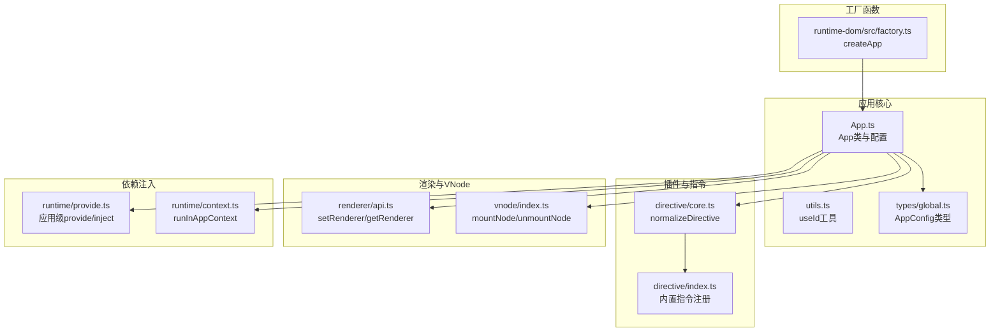
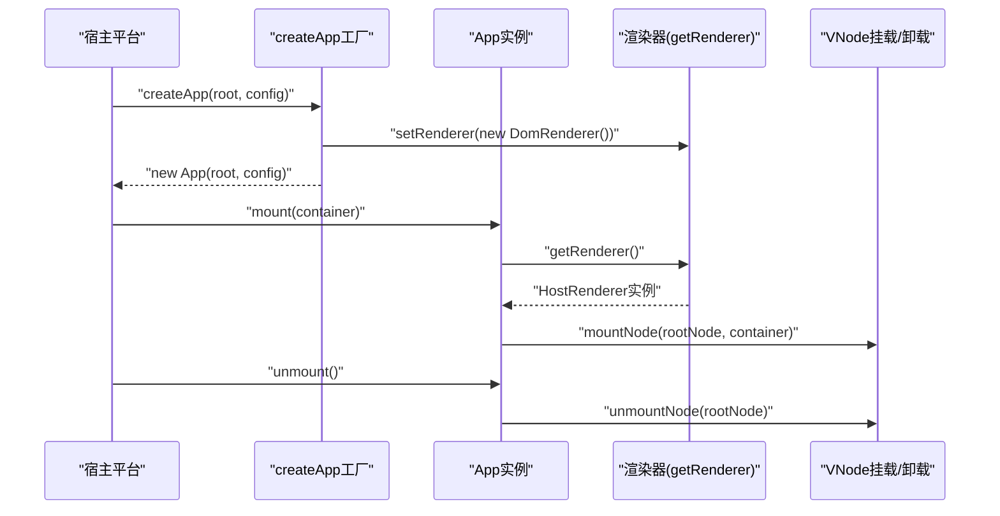
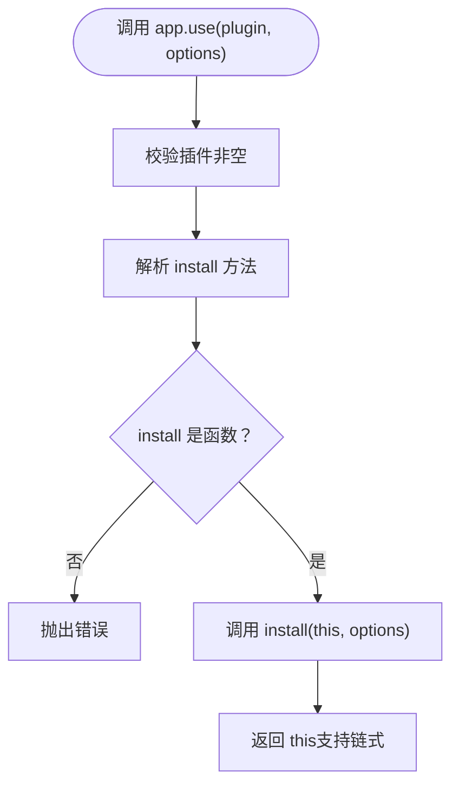
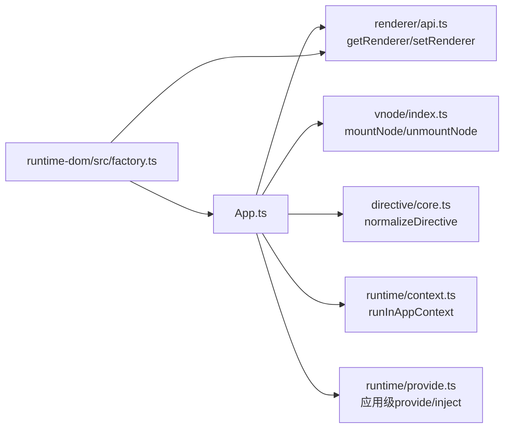

# 应用管理

<cite>
**本文引用的文件列表**
- [packages/runtime-core/src/app/App.ts](file://packages/runtime-core/src/app/App.ts)
- [packages/runtime-core/src/app/utils.ts](file://packages/runtime-core/src/app/utils.ts)
- [packages/runtime-core/src/app/index.ts](file://packages/runtime-core/src/app/index.ts)
- [packages/runtime-core/src/types/global.ts](file://packages/runtime-core/src/types/global.ts)
- [packages/runtime-core/src/directive/core.ts](file://packages/runtime-core/src/directive/core.ts)
- [packages/runtime-core/src/directive/index.ts](file://packages/runtime-core/src/directive/index.ts)
- [packages/runtime-core/src/renderer/api.ts](file://packages/runtime-core/src/renderer/api.ts)
- [packages/runtime-core/src/vnode/index.ts](file://packages/runtime-core/src/vnode/index.ts)
- [packages/runtime-core/src/runtime/provide.ts](file://packages/runtime-core/src/runtime/provide.ts)
- [packages/runtime-core/src/runtime/context.ts](file://packages/runtime-core/src/runtime/context.ts)
- [packages/runtime-core/src/runtime/index.ts](file://packages/runtime-core/src/runtime/index.ts)
- [packages/runtime-dom/src/factory.ts](file://packages/runtime-dom/src/factory.ts)
- [packages/runtime-core/__tests__/app/App.test.ts](file://packages/runtime-core/__tests__/app/App.test.ts)
- [packages/runtime-dom/__tests__/client/factory.test.ts](file://packages/runtime-dom/__tests__/client/factory.test.ts)
</cite>

## 目录
1. [简介](#简介)
2. [项目结构](#项目结构)
3. [核心组件](#核心组件)
4. [架构总览](#架构总览)
5. [详细组件分析](#详细组件分析)
6. [依赖关系分析](#依赖关系分析)
7. [性能考量](#性能考量)
8. [故障排查指南](#故障排查指南)
9. [结论](#结论)
10. [附录](#附录)

## 简介
本文件围绕应用管理API，聚焦于App类与createApp工厂函数，系统性梳理以下内容：
- App类构造函数参数、配置选项（errorHandler、idPrefix）及其默认值
- 实例方法：mount、unmount、use、directive、provide、inject的调用签名、参数类型、返回值与行为细节
- 插件系统工作机制：对象插件与函数插件的安装流程
- createApp函数的使用示例与链式调用
- 应用配置的合并策略与错误处理机制

## 项目结构
与应用管理API直接相关的模块分布如下：
- 应用核心：App类、App配置类型、工具函数
- 插件与指令：插件类型定义、指令标准化
- 渲染与VNode：渲染器注册与获取、节点挂载/卸载
- 依赖注入：应用级provide/inject与组件级provide/inject
- 工厂函数：宿主平台提供的createApp实现

图表来源
- [packages/runtime-core/src/app/App.ts](file://packages/runtime-core/src/app/App.ts#L1-L120)
- [packages/runtime-core/src/app/utils.ts](file://packages/runtime-core/src/app/utils.ts#L1-L40)
- [packages/runtime-core/src/types/global.ts](file://packages/runtime-core/src/types/global.ts#L159-L178)
- [packages/runtime-core/src/directive/core.ts](file://packages/runtime-core/src/directive/core.ts#L62-L87)
- [packages/runtime-core/src/directive/index.ts](file://packages/runtime-core/src/directive/index.ts#L1-L8)
- [packages/runtime-core/src/renderer/api.ts](file://packages/runtime-core/src/renderer/api.ts#L1-L26)
- [packages/runtime-core/src/vnode/index.ts](file://packages/runtime-core/src/vnode/index.ts#L1-L9)
- [packages/runtime-core/src/runtime/provide.ts](file://packages/runtime-core/src/runtime/provide.ts#L1-L131)
- [packages/runtime-core/src/runtime/context.ts](file://packages/runtime-core/src/runtime/context.ts#L1-L200)
- [packages/runtime-dom/src/factory.ts](file://packages/runtime-dom/src/factory.ts#L1-L23)

章节来源
- [packages/runtime-core/src/app/App.ts](file://packages/runtime-core/src/app/App.ts#L1-L120)
- [packages/runtime-core/src/app/utils.ts](file://packages/runtime-core/src/app/utils.ts#L1-L40)
- [packages/runtime-core/src/types/global.ts](file://packages/runtime-core/src/types/global.ts#L159-L178)
- [packages/runtime-core/src/directive/core.ts](file://packages/runtime-core/src/directive/core.ts#L62-L87)
- [packages/runtime-core/src/directive/index.ts](file://packages/runtime-core/src/directive/index.ts#L1-L8)
- [packages/runtime-core/src/renderer/api.ts](file://packages/runtime-core/src/renderer/api.ts#L1-L26)
- [packages/runtime-core/src/vnode/index.ts](file://packages/runtime-core/src/vnode/index.ts#L1-L9)
- [packages/runtime-core/src/runtime/provide.ts](file://packages/runtime-core/src/runtime/provide.ts#L1-L131)
- [packages/runtime-core/src/runtime/context.ts](file://packages/runtime-core/src/runtime/context.ts#L1-L200)
- [packages/runtime-dom/src/factory.ts](file://packages/runtime-dom/src/factory.ts#L1-L23)

## 核心组件
- App类：应用生命周期与核心能力的承载者，负责配置、挂载/卸载、指令注册、插件安装、依赖注入等。
- createApp工厂函数：宿主平台提供的应用实例创建入口，负责注册渲染器与默认驱动器。
- useId工具：基于应用上下文生成全局唯一ID，支持前缀优先级与计数器隔离。
- AppConfig类型：定义应用配置项，包含errorHandler与idPrefix。

章节来源
- [packages/runtime-core/src/app/App.ts](file://packages/runtime-core/src/app/App.ts#L107-L141)
- [packages/runtime-dom/src/factory.ts](file://packages/runtime-dom/src/factory.ts#L1-L23)
- [packages/runtime-core/src/app/utils.ts](file://packages/runtime-core/src/app/utils.ts#L1-L40)
- [packages/runtime-core/src/types/global.ts](file://packages/runtime-core/src/types/global.ts#L159-L178)

## 架构总览
应用管理API的运行时交互如下：
- 工厂函数createApp负责注册渲染器与默认驱动器，并创建App实例。
- App实例在构造时完成配置合并与根节点注入。
- 挂载阶段通过渲染器查询容器并调用VNode挂载逻辑。
- 卸载阶段调用VNode卸载逻辑。
- 指令通过标准化函数转换为统一格式并存储于应用上下文。
- 插件系统支持函数插件与对象插件两种形态，均通过install方法接入。
- 依赖注入分为应用级（provide/inject）与组件级（runtime/provide），后者在组件上下文中生效。

图表来源
- [packages/runtime-dom/src/factory.ts](file://packages/runtime-dom/src/factory.ts#L1-L23)
- [packages/runtime-core/src/renderer/api.ts](file://packages/runtime-core/src/renderer/api.ts#L1-L26)
- [packages/runtime-core/src/vnode/index.ts](file://packages/runtime-core/src/vnode/index.ts#L1-L9)
- [packages/runtime-core/src/app/App.ts](file://packages/runtime-core/src/app/App.ts#L187-L202)

## 详细组件分析

### App类与配置
- 构造函数
  - 参数
    - root：VNode或WidgetTypes，支持函数组件或虚拟节点
    - config：可选的AppConfig对象
  - 行为
    - 若root为函数，内部转换为WidgetVNode
    - 合并配置：initConfig将默认值与传入配置合并，传入配置覆盖默认值
    - 注入应用上下文：对根节点树递归设置appContext
  - 默认值
    - errorHandler：默认使用日志记录器输出未捕获异常
    - idPrefix：默认“v”
- 关键属性
  - config：只读，类型为Required<AppConfig>
  - rootNode：只读，返回根VNode
  - version：返回框架版本号

章节来源
- [packages/runtime-core/src/app/App.ts](file://packages/runtime-core/src/app/App.ts#L132-L141)
- [packages/runtime-core/src/app/App.ts](file://packages/runtime-core/src/app/App.ts#L216-L224)
- [packages/runtime-core/src/app/App.ts](file://packages/runtime-core/src/app/App.ts#L148-L150)
- [packages/runtime-core/src/app/App.ts](file://packages/runtime-core/src/app/App.ts#L175-L177)
- [packages/runtime-core/src/types/global.ts](file://packages/runtime-core/src/types/global.ts#L159-L178)

### 实例方法详解

#### mount(container)
- 签名与返回
  - 参数：container为HostParentElement或选择器字符串
  - 返回：this，支持链式调用
- 行为
  - 若传入字符串，通过渲染器的querySelector获取容器
  - 若未找到容器，抛出错误
  - 调用mountNode将rootNode挂载到容器
- 典型用法
  - 通过DOM元素或选择器挂载
- 相关实现
  - 渲染器获取与容器校验
  - VNode挂载

章节来源
- [packages/runtime-core/src/app/App.ts](file://packages/runtime-core/src/app/App.ts#L187-L202)
- [packages/runtime-core/src/renderer/api.ts](file://packages/runtime-core/src/renderer/api.ts#L1-L26)
- [packages/runtime-core/src/vnode/index.ts](file://packages/runtime-core/src/vnode/index.ts#L1-L9)

#### unmount()
- 签名与返回
  - 无参数
  - 无返回值
- 行为
  - 调用unmountNode卸载rootNode
- 典型用法
  - 应用销毁时清理资源

章节来源
- [packages/runtime-core/src/app/App.ts](file://packages/runtime-core/src/app/App.ts#L207-L209)
- [packages/runtime-core/src/vnode/index.ts](file://packages/runtime-core/src/vnode/index.ts#L1-L9)

#### directive(name[, directive])
- 签名与返回
  - 重载1：directive(name: string) -> Directive | undefined
  - 重载2：directive(name: string, directive: DirectiveOptions | mounted | updated) -> this
- 行为
  - 注册：若提供directive，将标准化后的指令存入应用级指令表，返回this
  - 获取：若未提供directive，返回已注册指令或undefined
- 标准化
  - normalizeDirective支持函数或对象形式，确保name字段存在且函数字段补齐
- 典型用法
  - 注册全局指令并链式调用
  - 获取已注册指令

章节来源
- [packages/runtime-core/src/app/App.ts](file://packages/runtime-core/src/app/App.ts#L292-L306)
- [packages/runtime-core/src/directive/core.ts](file://packages/runtime-core/src/directive/core.ts#L62-L87)
- [packages/runtime-core/src/directive/index.ts](file://packages/runtime-core/src/directive/index.ts#L1-L8)

#### provide(name, value) / inject(name[, defaultValue])
- 签名与返回
  - provide：返回this，支持链式调用
  - inject：返回注入值或默认值
- 行为
  - 应用级：App实例维护Map，provide/inject在App实例上生效
  - 组件级：runtime/provide在组件上下文中向上查找祖先节点的injectionStore，若未找到则回退到App实例
- 典型用法
  - 在App层提供全局数据，组件中通过inject获取

章节来源
- [packages/runtime-core/src/app/App.ts](file://packages/runtime-core/src/app/App.ts#L313-L336)
- [packages/runtime-core/src/runtime/provide.ts](file://packages/runtime-core/src/runtime/provide.ts#L1-L131)

#### use(plugin[, options])
- 签名与返回
  - use(plugin: Function|Object) -> this
  - use<T>(plugin: Function|Object, options: T) -> this
- 行为
  - 支持函数插件与对象插件（必须提供install方法）
  - 校验插件类型与install方法存在性
  - 调用install(this, options)，options可选
- 典型用法
  - 安装第三方或自定义插件，支持传入选项

章节来源
- [packages/runtime-core/src/app/App.ts](file://packages/runtime-core/src/app/App.ts#L376-L392)

#### runInContext(fn)
- 签名与返回
  - runInContext<T>(fn: () => T) -> T
- 行为
  - 在应用上下文中执行函数，返回执行结果
- 典型用法
  - 在应用范围内执行需要上下文的逻辑

章节来源
- [packages/runtime-core/src/app/App.ts](file://packages/runtime-core/src/app/App.ts#L232-L234)
- [packages/runtime-core/src/runtime/context.ts](file://packages/runtime-core/src/runtime/context.ts#L1-L200)

### 插件系统工作机制
- 插件类型
  - 函数插件：(app, options?) => void
  - 对象插件：{ install: (app, options?) => void }
- 安装流程
  - 校验插件非空
  - 解析install方法（对象插件取install属性）
  - 校验install为函数
  - 调用install(this, options)，options可省略
- 选项传递
  - 无配置：options为undefined
  - 有必填配置：options为必填
  - 有可选配置：options为可选

图表来源
- [packages/runtime-core/src/app/App.ts](file://packages/runtime-core/src/app/App.ts#L376-L392)

章节来源
- [packages/runtime-core/src/app/App.ts](file://packages/runtime-core/src/app/App.ts#L22-L59)
- [packages/runtime-core/src/app/App.ts](file://packages/runtime-core/src/app/App.ts#L376-L392)

### createApp工厂函数
- 定义位置
  - 宿主平台包（如runtime-dom）提供createApp，内部注册渲染器与默认驱动器
- 行为
  - setRenderer(new DomRenderer())
  - setupDefaultDrivers()
  - return new App(root, config)
- 使用示例
  - 传入VNode或WidgetTypes作为root
  - 传入可选的AppConfig
  - 支持链式调用mount/unmount等方法

章节来源
- [packages/runtime-dom/src/factory.ts](file://packages/runtime-dom/src/factory.ts#L1-L23)

### 配置合并与默认值
- 合并策略
  - initConfig返回Required<AppConfig>，默认值与传入配置合并，传入配置覆盖默认值
- 默认值
  - errorHandler：默认使用日志记录器输出未捕获异常
  - idPrefix：默认“v”
- useId前缀优先级
  - useId优先使用传入prefix，其次使用app.config.idPrefix，最后回退到“v”

章节来源
- [packages/runtime-core/src/app/App.ts](file://packages/runtime-core/src/app/App.ts#L216-L224)
- [packages/runtime-core/src/app/utils.ts](file://packages/runtime-core/src/app/utils.ts#L17-L39)
- [packages/runtime-core/src/types/global.ts](file://packages/runtime-core/src/types/global.ts#L159-L178)

## 依赖关系分析
- App类依赖
  - 渲染器：通过getRenderer获取HostRenderer
  - VNode：mountNode/unmountNode进行挂载/卸载
  - 指令：normalizeDirective标准化指令
  - 日志：defaultErrorHandler使用logger
  - 上下文：runInAppContext
  - 注入：App实例维护provide/inject
- 工厂函数依赖
  - runtime-dom/src/factory.ts依赖@vitarx/runtime-core的App与setRenderer
  - 注册DomRenderer与默认驱动器

图表来源
- [packages/runtime-core/src/app/App.ts](file://packages/runtime-core/src/app/App.ts#L1-L120)
- [packages/runtime-core/src/renderer/api.ts](file://packages/runtime-core/src/renderer/api.ts#L1-L26)
- [packages/runtime-core/src/vnode/index.ts](file://packages/runtime-core/src/vnode/index.ts#L1-L9)
- [packages/runtime-core/src/directive/core.ts](file://packages/runtime-core/src/directive/core.ts#L62-L87)
- [packages/runtime-core/src/runtime/context.ts](file://packages/runtime-core/src/runtime/context.ts#L1-L200)
- [packages/runtime-core/src/runtime/provide.ts](file://packages/runtime-core/src/runtime/provide.ts#L1-L131)
- [packages/runtime-dom/src/factory.ts](file://packages/runtime-dom/src/factory.ts#L1-L23)

章节来源
- [packages/runtime-core/src/app/App.ts](file://packages/runtime-core/src/app/App.ts#L1-L120)
- [packages/runtime-dom/src/factory.ts](file://packages/runtime-dom/src/factory.ts#L1-L23)

## 性能考量
- 指令标准化
  - normalizeDirective在注册时完成指令对象标准化，避免运行时重复判断
- 挂载/卸载
  - mountNode/unmountNode基于渲染器执行，尽量减少不必要的DOM操作
- 配置合并
  - initConfig采用浅合并策略，避免深度拷贝带来的开销
- useId
  - 使用上下文计数器与全局计数器，避免频繁分配与字符串拼接

[本节为通用指导，不涉及具体文件分析]

## 故障排查指南
- 选择器未匹配到容器
  - 现象：mount抛出错误
  - 原因：getRenderer().querySelector返回null
  - 处理：确认选择器正确或传入DOM元素
- 指令名称为空
  - 现象：directive注册时报TypeError
  - 原因：去空格后name为空
  - 处理：确保指令名称非空
- 插件类型不合法
  - 现象：use报错
  - 原因：plugin为空或install不是函数
  - 处理：确保插件为函数或对象且提供install方法
- 组件级provide/inject错误
  - 现象：调用抛出错误
  - 原因：不在组件上下文中调用
  - 处理：确保在有状态组件初始化阶段使用

章节来源
- [packages/runtime-core/src/app/App.ts](file://packages/runtime-core/src/app/App.ts#L187-L202)
- [packages/runtime-core/src/app/App.ts](file://packages/runtime-core/src/app/App.ts#L292-L306)
- [packages/runtime-core/src/app/App.ts](file://packages/runtime-core/src/app/App.ts#L376-L392)
- [packages/runtime-core/src/runtime/provide.ts](file://packages/runtime-core/src/runtime/provide.ts#L31-L41)

## 结论
App类与createApp工厂函数共同构成了应用管理的核心API。App类提供了完善的生命周期管理、配置合并、指令与插件系统、依赖注入以及上下文执行能力；createApp工厂函数在宿主平台层面完成渲染器与驱动器的注册，确保应用能够在具体平台上正常运行。通过标准化的插件与指令机制，开发者可以灵活扩展应用能力；通过清晰的配置与错误处理策略，保障应用的健壮性与可维护性。

[本节为总结性内容，不涉及具体文件分析]

## 附录

### API参考速查

- App构造函数
  - 参数：root（VNode或WidgetTypes）、config（可选）
  - 默认值：errorHandler（默认日志记录器）、idPrefix（默认“v”）

- 实例方法
  - mount(container: HostParentElement | string): this
  - unmount(): void
  - directive(name: string): Directive | undefined
  - directive(name: string, directive: DirectiveOptions | mounted | updated): this
  - provide(name: string | symbol, value: any): this
  - inject(name: string | symbol, defaultValue?: any): any
  - use(plugin: Function|Object, options?: any): this
  - runInContext(fn: () => T): T

- 工厂函数
  - createApp(root, config?): App
  - 宿主平台：runtime-dom/src/factory.ts

- 配置类型
  - AppConfig：errorHandler、idPrefix

章节来源
- [packages/runtime-core/src/app/App.ts](file://packages/runtime-core/src/app/App.ts#L132-L141)
- [packages/runtime-core/src/app/App.ts](file://packages/runtime-core/src/app/App.ts#L187-L202)
- [packages/runtime-core/src/app/App.ts](file://packages/runtime-core/src/app/App.ts#L292-L306)
- [packages/runtime-core/src/app/App.ts](file://packages/runtime-core/src/app/App.ts#L313-L336)
- [packages/runtime-core/src/app/App.ts](file://packages/runtime-core/src/app/App.ts#L376-L392)
- [packages/runtime-core/src/app/App.ts](file://packages/runtime-core/src/app/App.ts#L232-L234)
- [packages/runtime-dom/src/factory.ts](file://packages/runtime-dom/src/factory.ts#L1-L23)
- [packages/runtime-core/src/types/global.ts](file://packages/runtime-core/src/types/global.ts#L159-L178)

### 使用示例路径
- 工厂函数与渲染器注册
  - [packages/runtime-dom/src/factory.ts](file://packages/runtime-dom/src/factory.ts#L1-L23)
- App挂载与卸载
  - [packages/runtime-core/__tests__/app/App.test.ts](file://packages/runtime-core/__tests__/app/App.test.ts#L86-L123)
- 指令注册与获取
  - [packages/runtime-core/__tests__/app/App.test.ts](file://packages/runtime-core/__tests__/app/App.test.ts#L147-L193)
- 插件系统
  - [packages/runtime-core/__tests__/app/App.test.ts](file://packages/runtime-core/__tests__/app/App.test.ts#L195-L228)
- createApp配置传入
  - [packages/runtime-dom/__tests__/client/factory.test.ts](file://packages/runtime-dom/__tests__/client/factory.test.ts#L51-L68)