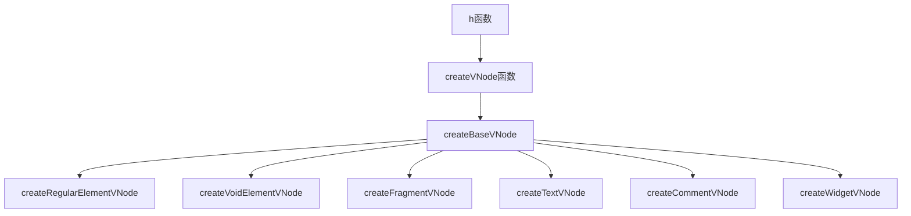
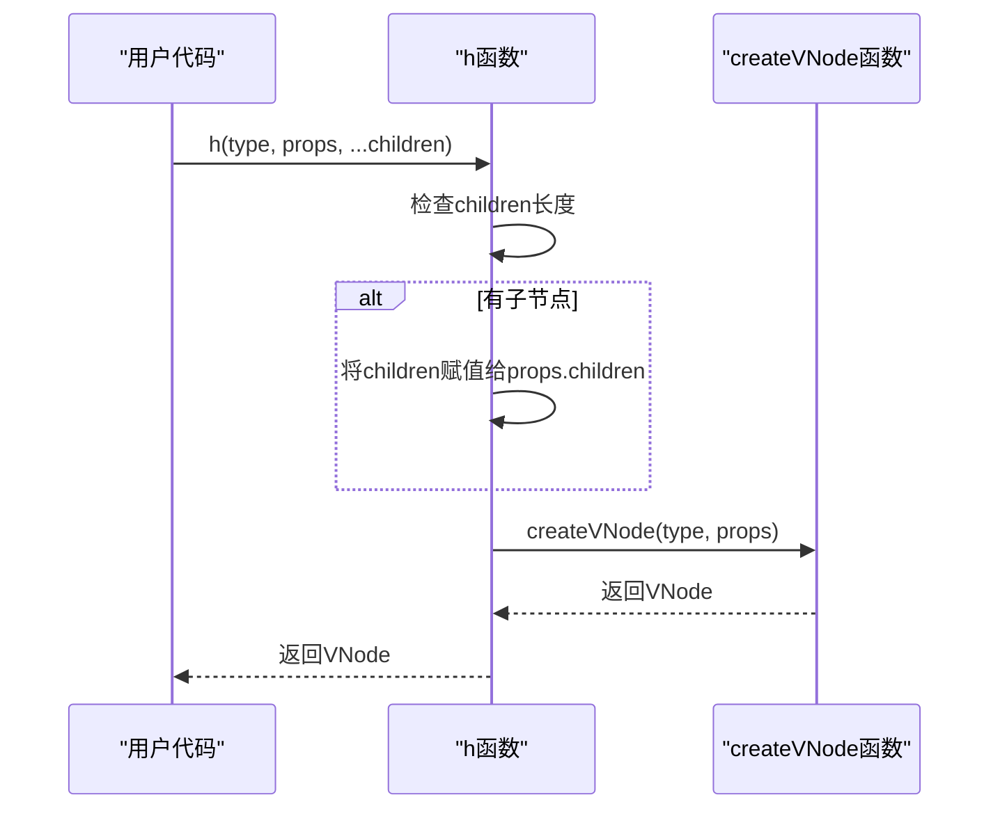
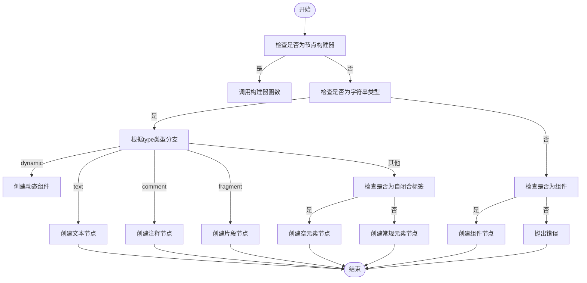
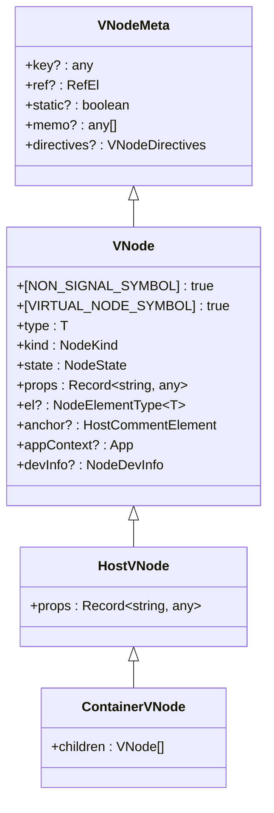

# 虚拟DOM

<cite>
**本文档中引用的文件**   
- [create.ts](file://packages/runtime-core/src/vnode/core/create.ts#L1-L159)
- [base.ts](file://packages/runtime-core/src/vnode/creator/base.ts#L1-L118)
- [element.ts](file://packages/runtime-core/src/vnode/creator/element.ts#L1-L69)
- [fragment.ts](file://packages/runtime-core/src/vnode/creator/fragment.ts#L1-L24)
- [special.ts](file://packages/runtime-core/src/vnode/creator/special.ts#L1-L36)
- [vnode.ts](file://packages/runtime-core/src/types/vnode.ts#L1-L195)
- [nodeTypes.ts](file://packages/runtime-core/src/constants/nodeTypes.ts#L1-L32)
- [jsx-runtime.ts](file://packages/vitarx/src/jsx-runtime.ts#L1-L31)
- [BaseNode.ts](file://packages/runtime-core/src/types/nodes/BaseNode.ts#L1-L223)
</cite>

## 目录
1. [简介](#简介)
2. [核心API概述](#核心api概述)
3. [h函数详解](#h函数详解)
4. [createVNode函数内部工作原理](#createvnode函数内部工作原理)
5. [props对象结构](#props对象结构)
6. [虚拟DOM树构建示例](#虚拟dom树构建示例)
7. [总结](#总结)

## 简介
虚拟DOM是现代前端框架中的核心概念，它提供了一种高效的方式来描述UI结构。本文档将详细介绍Vitarx框架中虚拟DOM创建API的核心功能，重点关注`h`和`createVNode`函数的实现和使用方法。通过这些API，开发者可以创建复杂的虚拟DOM树，包括普通元素、文本节点、片段和动态组件。

**Section sources**
- [create.ts](file://packages/runtime-core/src/vnode/core/create.ts#L1-L159)

## 核心API概述
Vitarx框架提供了两个主要的API来创建虚拟DOM节点：`h`函数和`createVNode`函数。这两个函数都位于`packages/runtime-core/src/vnode/core/create.ts`文件中，是构建虚拟DOM树的基础工具。

`h`函数是一个便捷的工厂函数，它简化了虚拟节点的创建过程，特别适合在JSX或手写代码中使用。`createVNode`函数则是底层的核心实现，处理各种节点类型的创建逻辑。



**Diagram sources**
- [create.ts](file://packages/runtime-core/src/vnode/core/create.ts#L1-L159)
- [base.ts](file://packages/runtime-core/src/vnode/creator/base.ts#L1-L118)

**Section sources**
- [create.ts](file://packages/runtime-core/src/vnode/core/create.ts#L1-L159)

## h函数详解
`h`函数是创建虚拟DOM节点的主要API，它接受三个参数：`type`（节点类型）、`props`（属性对象）和`children`（子节点）。这个函数的设计遵循了函数式编程的原则，提供了一种简洁的方式来描述UI结构。

### 参数说明
- **type**: 节点类型，可以是HTML标签名（如'div'、'span'）、组件函数或特殊节点类型（如'fragment'、'text'）
- **props**: 属性对象，包含节点的所有属性，如class、style、事件处理器等
- **children**: 子节点，可以是单个节点或节点数组

`h`函数的实现非常简洁，它首先检查是否有子节点，如果有则将子节点添加到`props`对象的`children`属性中，然后调用`createVNode`函数创建虚拟节点。



**Diagram sources**
- [create.ts](file://packages/runtime-core/src/vnode/core/create.ts#L146-L158)

**Section sources**
- [create.ts](file://packages/runtime-core/src/vnode/core/create.ts#L146-L158)

## createVNode函数内部工作原理
`createVNode`函数是虚拟DOM创建的核心实现，它根据不同的`type`参数创建相应的虚拟节点实例。这个函数的实现展示了框架如何处理各种节点类型，包括普通元素、文本节点、片段和动态组件。

### 节点类型处理流程
`createVNode`函数首先检查`type`是否为节点构建器，如果是则直接调用构建器函数。然后根据`type`的类型进行不同的处理：

1. **字符串类型节点**:
   - `text`: 创建文本节点
   - `comment`: 创建注释节点
   - `fragment`: 创建片段节点
   - `dynamic`: 创建动态组件节点
   - 其他: 根据是否为自闭合标签创建常规元素节点或空元素节点

2. **组件节点**: 检查是否为组件类型，如果是则创建组件节点

3. **其他类型**: 抛出错误



**Diagram sources**
- [create.ts](file://packages/runtime-core/src/vnode/core/create.ts#L87-L136)

**Section sources**
- [create.ts](file://packages/runtime-core/src/vnode/core/create.ts#L87-L136)

## props对象结构
`props`对象是虚拟节点的重要组成部分，它包含了节点的所有属性信息。在Vitarx框架中，`props`对象的结构经过精心设计，以支持各种功能和优化。

### 核心属性
- **children**: 子节点列表，可以是单个节点或节点数组
- **ref**: 引用，用于直接访问节点对应的真实DOM元素或组件实例
- **key**: 唯一键，用于diff算法优化
- **static**: 静态标记，用于性能优化
- **memo**: 记忆化依赖数组，用于控制节点更新时机
- **v-bind**: 属性绑定，用于合并多个属性对象
- **v-model**: 双向绑定，自动转换为`modelValue`和`onUpdate:modelValue`
- **v-***: 指令，如`v-show`、`v-if`等

### 特殊属性处理
在`createBaseVNode`函数中，`props`对象会经过一系列处理：

1. **提取ref**: 从`props`中提取`ref`属性并赋值给节点的`ref`属性
2. **提取key**: 从`props`中提取`key`属性并赋值给节点的`key`属性
3. **处理v-static**: 提取`v-static`属性作为节点的静态标记
4. **处理特殊节点**: 对于特殊节点类型，对所有属性进行解包
5. **处理普通节点**: 执行`v-bind`合并，提取并处理指令



**Diagram sources**
- [BaseNode.ts](file://packages/runtime-core/src/types/nodes/BaseNode.ts#L30-L148)
- [base.ts](file://packages/runtime-core/src/vnode/creator/base.ts#L22-L117)

**Section sources**
- [BaseNode.ts](file://packages/runtime-core/src/types/nodes/BaseNode.ts#L30-L148)
- [base.ts](file://packages/runtime-core/src/vnode/creator/base.ts#L22-L117)

## 虚拟DOM树构建示例
通过`h`函数和`createVNode`函数，可以构建复杂的虚拟DOM树。以下是一些常见的使用示例：

### 创建普通元素
```typescript
// 创建一个div元素，包含class属性和子节点
const divNode = h('div', { class: 'container' }, [
  h('h1', { style: 'color: red' }, '标题'),
  h('p', null, '段落内容')
])
```

### 创建文本节点
```typescript
// 创建文本节点
const textNode = h('text', { value: 'Hello World' })
```

### 创建片段
```typescript
// 创建片段节点，包含多个子节点
const fragmentNode = h('fragment', null, [
  h('div', null, '第一个子节点'),
  h('div', null, '第二个子节点')
])
```

### 创建动态组件
```typescript
// 创建动态组件
const MyComponent = () => h('div', null, '组件内容')
const dynamicNode = h('dynamic', { is: MyComponent, prop: 'value' })
```

这些示例展示了如何使用`h`函数构建不同类型的虚拟DOM节点。在实际使用中，这些节点会被渲染器转换为真实DOM，实现高效的UI更新。

**Section sources**
- [create.ts](file://packages/runtime-core/src/vnode/core/create.ts#L146-L158)
- [element.ts](file://packages/runtime-core/src/vnode/creator/element.ts#L26-L68)
- [fragment.ts](file://packages/runtime-core/src/vnode/creator/fragment.ts#L15-L23)
- [special.ts](file://packages/runtime-core/src/vnode/creator/special.ts#L19-L35)

## 总结
Vitarx框架的虚拟DOM创建API提供了强大而灵活的工具来构建UI。`h`函数作为主要的API，简化了虚拟节点的创建过程，而`createVNode`函数则提供了底层的实现细节。通过理解这些API的工作原理，开发者可以更好地利用框架的功能，构建高效、可维护的应用程序。

**Section sources**
- [create.ts](file://packages/runtime-core/src/vnode/core/create.ts#L1-L159)
- [base.ts](file://packages/runtime-core/src/vnode/creator/base.ts#L1-L118)