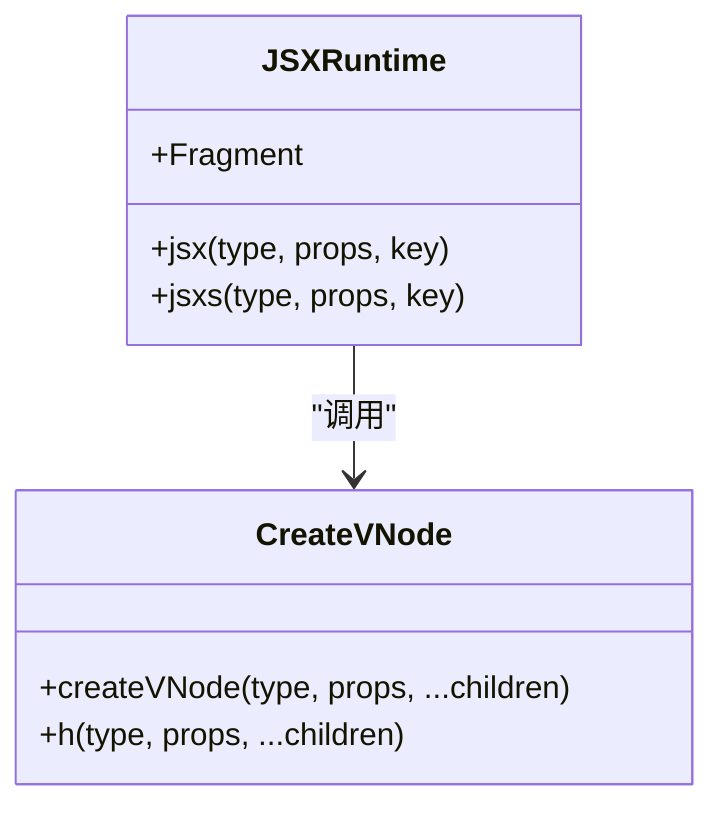
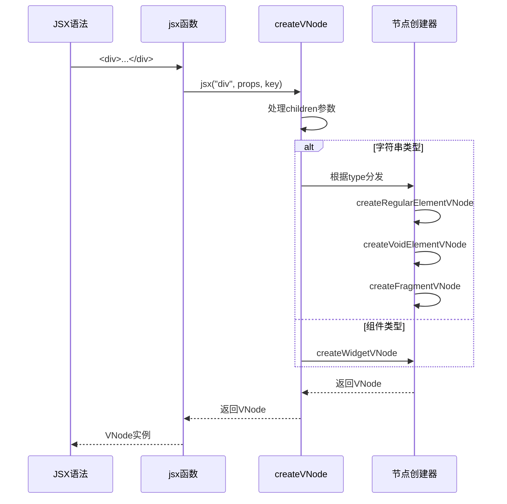
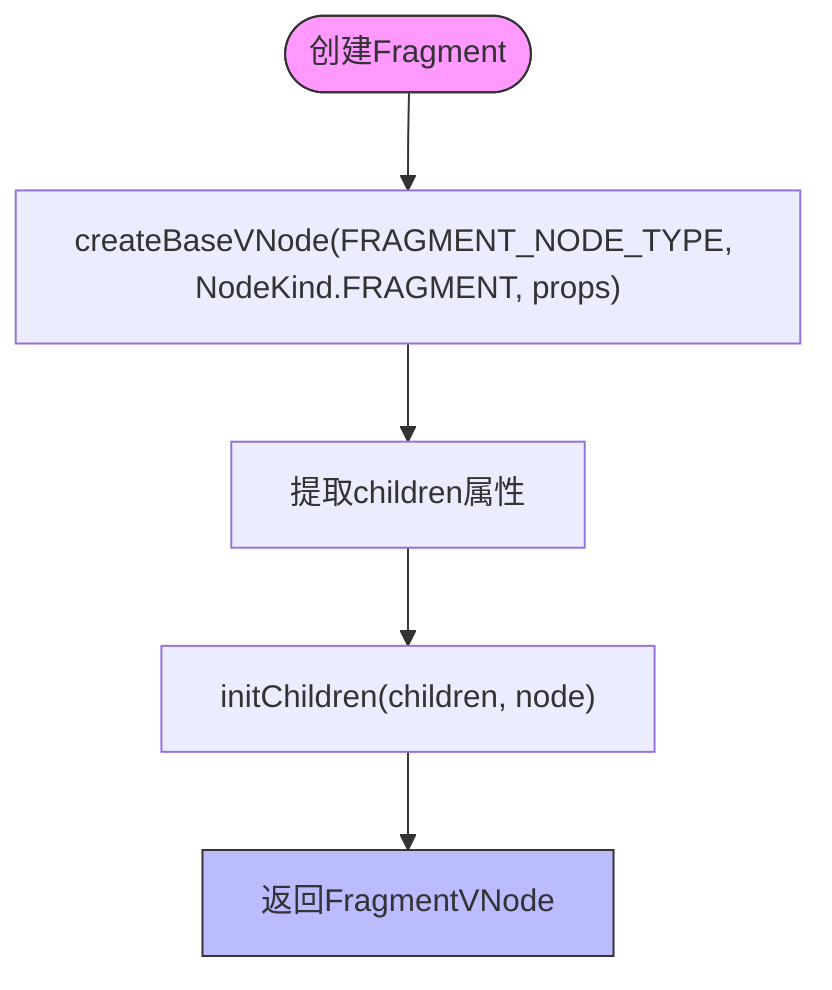
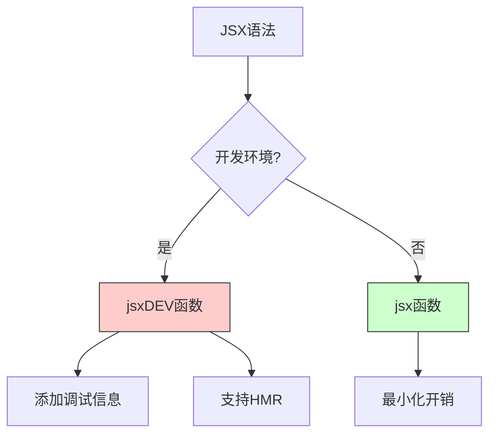

# JSX运行时API

<cite>
**本文档引用文件**  
- [jsx-runtime.ts](file://packages/vitarx/src/jsx-runtime.ts)
- [jsx-dev-runtime.ts](file://packages/vitarx/src/jsx-dev-runtime.ts)
- [create.ts](file://packages/runtime-core/src/vnode/core/create.ts)
- [base.ts](file://packages/runtime-core/src/vnode/creator/base.ts)
- [fragment.ts](file://packages/runtime-core/src/vnode/creator/fragment.ts)
- [element.ts](file://packages/runtime-core/src/vnode/creator/element.ts)
- [widget.ts](file://packages/runtime-core/src/vnode/creator/widget.ts)
- [nodeTypes.ts](file://packages/runtime-core/src/constants/nodeTypes.ts)
- [vnode.ts](file://packages/runtime-core/src/types/vnode.ts)
- [dev.ts](file://packages/runtime-core/src/utils/dev.ts)
</cite>

## 目录
1. [简介](#简介)
2. [JSX运行时函数](#jsx运行时函数)
3. [虚拟DOM节点创建机制](#虚拟dom节点创建机制)
4. [Fragment实现原理](#fragment实现原理)
5. [Babel与TSX配置](#babel与tsx配置)
6. [开发模式与生产模式差异](#开发模式与生产模式差异)
7. [类型定义说明](#类型定义说明)
8. [总结](#总结)

## 简介
vitarx框架提供了完整的JSX语法支持，通过`jsx`、`jsxs`和`Fragment`等运行时函数将JSX语法转换为虚拟DOM节点（VNode）。本文档详细说明这些函数的功能与实现机制，并解释其与底层`createVNode`函数的关联。同时涵盖Babel配置、TSX类型定义以及开发模式与生产模式的差异。

## JSX运行时函数

vitarx框架通过`jsx-runtime.ts`文件提供JSX运行时支持，主要包含`jsx`和`Fragment`两个核心导出。



**Diagram sources**  
- [jsx-runtime.ts](file://packages/vitarx/src/jsx-runtime.ts)
- [create.ts](file://packages/runtime-core/src/vnode/core/create.ts)

**Section sources**  
- [jsx-runtime.ts](file://packages/vitarx/src/jsx-runtime.ts#L1-L30)

### jsx函数
`jsx`函数是JSX语法转换的核心入口，负责将JSX元素转换为虚拟DOM节点。它接收组件类型、属性对象和可选的key参数，最终调用`createVNode`创建VNode实例。

该函数首先处理key属性，将其从props中提取并设置到VNode上，然后调用`createVNode`完成节点创建。在类型系统中，`jsx`使用泛型`T extends ValidNodeType`确保类型安全。

### jsxs函数
`jsxs`函数在vitarx中实际上是`jsx`函数的别名导出。这种设计保持了与React JSX运行时的兼容性，允许开发者在需要时明确区分单个元素（jsx）和多个子元素（jsxs）的创建，尽管底层实现完全相同。

### Fragment组件
`Fragment`是一个特殊的占位组件，用于包裹多个子元素而不创建额外的DOM节点。它在`nodeTypes.ts`中被定义为字符串常量`'fragment'`的类型重载，既可作为字符串使用，也可作为函数组件调用。

## 虚拟DOM节点创建机制

JSX运行时函数最终都依赖于`runtime-core`包中的`createVNode`函数来创建虚拟DOM节点。这个函数是整个虚拟DOM系统的核心。



**Diagram sources**  
- [jsx-runtime.ts](file://packages/vitarx/src/jsx-runtime.ts#L15-L28)
- [create.ts](file://packages/runtime-core/src/vnode/core/create.ts#L90-L147)
- [base.ts](file://packages/runtime-core/src/vnode/creator/base.ts#L22-L117)

**Section sources**  
- [create.ts](file://packages/runtime-core/src/vnode/core/create.ts#L90-L147)
- [base.ts](file://packages/runtime-core/src/vnode/creator/base.ts#L22-L117)

### createVNode函数
`createVNode`函数是虚拟DOM节点创建的统一入口。它接收类型、属性和可变数量的子节点参数。函数首先处理子节点的合并，然后根据类型进行分发：

- 对于字符串类型，通过switch语句判断特殊类型（如`fragment`、`text`、`comment`等）
- 对于常规HTML元素，调用`createRegularElementVNode`或`createVoidElementVNode`
- 对于组件类型，调用`createWidgetVNode`

### 基础节点创建
`createBaseVNode`函数负责创建所有类型节点的共同基础结构。它设置节点的基本属性，如`type`、`kind`、`props`和`appContext`，并处理开发模式下的调试信息。该函数还负责提取`key`和`ref`属性，并对特殊节点类型进行响应式值的解包。

## Fragment实现原理

Fragment是JSX中重要的语法特性，允许组件返回多个根节点。vitarx框架通过`createFragmentVNode`函数实现这一功能。



**Diagram sources**  
- [fragment.ts](file://packages/runtime-core/src/vnode/creator/fragment.ts#L15-L23)
- [nodeTypes.ts](file://packages/runtime-core/src/constants/nodeTypes.ts#L9-L47)

**Section sources**  
- [fragment.ts](file://packages/runtime-core/src/vnode/creator/fragment.ts#L15-L23)
- [nodeTypes.ts](file://packages/runtime-core/src/constants/nodeTypes.ts#L9-L47)

### 片段节点创建
`createFragmentVNode`函数创建一个特殊的虚拟节点，其类型为`FRAGMENT_NODE_TYPE`。该节点本身不渲染为任何DOM元素，而是将其子节点直接渲染到父容器中。这通过`FragmentController`实现，该控制器在挂载时将子节点直接插入容器，而不是创建新的DOM元素。

### 使用方式
Fragment支持三种等价的使用方式：
- `<Fragment>...</Fragment>`：显式使用Fragment组件
- `<fragment>...</fragment>`：使用小写标签形式
- `<>...</>`：使用空标签简写形式

这些形式在编译后都会转换为对`jsx`函数的调用，传入`Fragment`作为类型参数。

## Babel与TSX配置

为了在项目中使用JSX语法，需要正确配置Babel和TypeScript。

### Babel配置
在Babel配置中，需要设置JSX转换为vitarx的运行时函数：

```json
{
  "plugins": [
    ["@babel/plugin-transform-react-jsx", {
      "runtime": "automatic",
      "importSource": "@vitarx/vitarx"
    }]
  ]
}
```

此配置会自动将JSX语法转换为对`jsx`函数的调用，并从`@vitarx/vitarx`包中导入必要的运行时函数。

### TypeScript配置
在`tsconfig.json`中需要配置JSX相关选项：

```json
{
  "compilerOptions": {
    "jsx": "react-jsx",
    "jsxImportSource": "@vitarx/vitarx"
  }
}
```

`jsxImportSource`选项指定了JSX运行时的导入源，确保TypeScript能够正确解析JSX语法并关联到vitarx的类型定义。

**Section sources**  
- [jsx-runtime.ts](file://packages/vitarx/src/jsx-runtime.ts)
- [vnode.ts](file://packages/runtime-core/src/types/vnode.ts)

## 开发模式与生产模式差异

vitarx框架提供了两种JSX运行时：生产模式的`jsx-runtime`和开发模式的`jsx-dev-runtime`，以支持更好的调试体验。



**Diagram sources**  
- [jsx-runtime.ts](file://packages/vitarx/src/jsx-runtime.ts)
- [jsx-dev-runtime.ts](file://packages/vitarx/src/jsx-dev-runtime.ts)
- [dev.ts](file://packages/runtime-core/src/utils/dev.ts)

**Section sources**  
- [jsx-dev-runtime.ts](file://packages/vitarx/src/jsx-dev-runtime.ts#L24-L44)
- [dev.ts](file://packages/runtime-core/src/utils/dev.ts#L8-L36)

### jsxDEV函数
`jsxDEV`函数是开发模式下的JSX运行时入口，它在`jsx`函数的基础上增加了调试功能。该函数接收额外的参数：
- `isStatic`：标记节点是否静态
- `source`：源码位置信息，包含文件名、行号和列号
- `self`：组件实例的this上下文

这些信息被存储在节点的`devInfo`属性中，用于错误追踪和调试。

### 调试优势
开发模式提供了多项调试优势：
- **错误定位**：当出现渲染错误时，可以精确显示错误发生的文件位置
- **组件检查**：开发者工具可以显示组件的源码位置和实例信息
- **热模块替换**：支持HMR功能，`jsxDEV`函数会检查是否有更新的模块版本
- **属性验证**：在开发模式下会执行组件属性的验证，提供有用的警告信息

### 生产模式优化
生产模式的`jsx`函数经过优化，移除了所有开发相关的代码，确保最小的运行时开销。这包括：
- 移除调试信息的处理
- 移除属性验证逻辑
- 最小化的函数调用开销
- 代码压缩和tree-shaking友好

## 类型定义说明

vitarx框架使用TypeScript提供了完整的类型定义，确保JSX使用的类型安全。

### 核心类型
在`vnode.ts`文件中定义了JSX相关的核心类型：
- `ValidNodeType`：所有有效的节点类型联合，包括HTML元素、Fragment和组件
- `VNodeInstanceType`：根据节点类型推导出的具体VNode实例类型
- `CodeSourceInfo`：开发模式下的源码位置信息类型
- `NodeDevInfo`：开发模式下的调试信息接口

### 类型推导
vitarx利用TypeScript的条件类型和泛型推导，实现了精确的类型安全。例如，当创建一个`div`元素时，类型系统能够推导出返回的是`RegularElementVNode<'div'>`类型，包含正确的属性约束。

### JSX元素映射
通过`JSXElementNames`类型，vitarx将JSX标签名映射到具体的元素类型。这使得TypeScript能够验证元素属性的正确性，例如确保`img`元素有`src`属性，而`div`元素可以有`children`。

**Section sources**  
- [vnode.ts](file://packages/runtime-core/src/types/vnode.ts#L39-L177)
- [element.ts](file://packages/runtime-core/src/types/element.ts#L49-L89)

## 总结
vitarx框架通过精心设计的JSX运行时API，提供了完整的JSX语法支持。`jsx`、`jsxs`和`Fragment`函数将JSX语法转换为虚拟DOM节点，底层依赖于`createVNode`函数的统一节点创建机制。框架区分开发模式和生产模式，开发模式提供丰富的调试信息和HMR支持，而生产模式则经过优化以确保最佳性能。通过完整的TypeScript类型定义，vitarx确保了JSX使用的类型安全，为开发者提供了良好的开发体验。