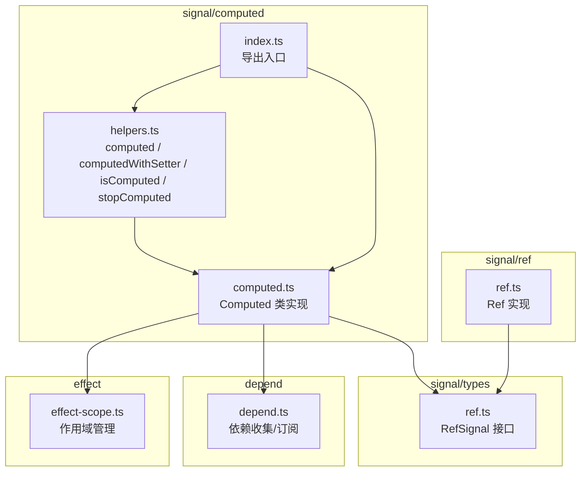
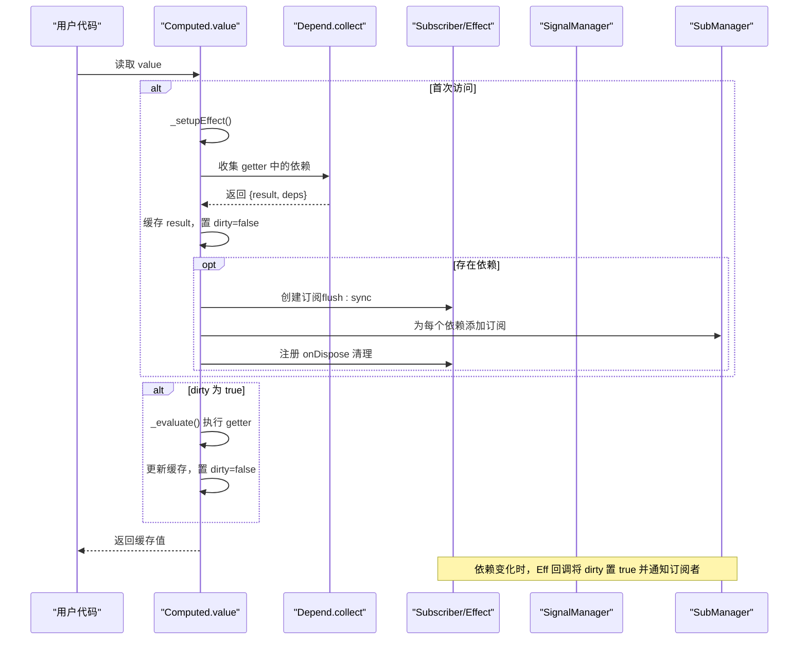
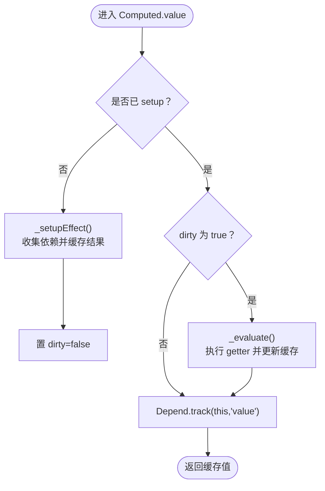
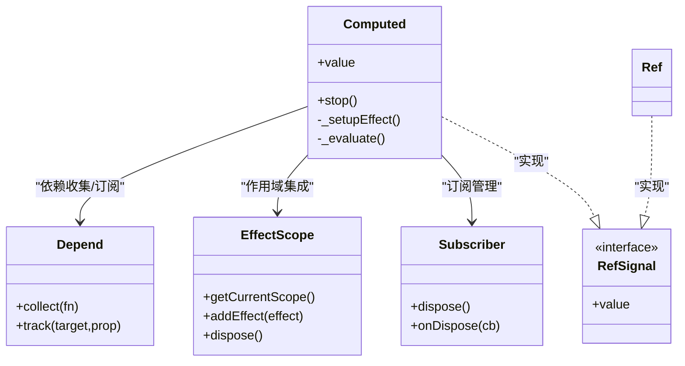

# computed API

<cite>
**本文引用的文件**
- [packages/responsive/src/signal/computed/computed.ts](file://packages/responsive/src/signal/computed/computed.ts)
- [packages/responsive/src/signal/computed/helpers.ts](file://packages/responsive/src/signal/computed/helpers.ts)
- [packages/responsive/src/signal/computed/index.ts](file://packages/responsive/src/signal/computed/index.ts)
- [packages/responsive/src/signal/types/ref.ts](file://packages/responsive/src/signal/types/ref.ts)
- [packages/responsive/src/signal/ref/ref.ts](file://packages/responsive/src/signal/ref/ref.ts)
- [packages/responsive/src/depend/depend.ts](file://packages/responsive/src/depend/depend.ts)
- [packages/responsive/src/effect/effect-scope.ts](file://packages/responsive/src/effect/effect-scope.ts)
- [packages/responsive/README.md](file://packages/responsive/README.md)
- [packages/responsive/__tests__/signal/computed.test.ts](file://packages/responsive/__tests__/signal/computed.test.ts)
</cite>

## 目录
1. [简介](#简介)
2. [项目结构](#项目结构)
3. [核心组件](#核心组件)
4. [架构总览](#架构总览)
5. [详细组件分析](#详细组件分析)
6. [依赖分析](#依赖分析)
7. [性能考量](#性能考量)
8. [故障排查指南](#故障排查指南)
9. [结论](#结论)
10. [附录](#附录)

## 简介
本文件面向 vitarx 响应式系统中的 computed API，系统性阐述其惰性求值与缓存机制、基于 getter 的响应式计算属性创建方式、自动依赖追踪原理，以及 ComputedOptions 的关键配置项（setter、immediate、scope）的使用场景与最佳实践。文档还结合 README 中的函数签名与参数说明，解释 computed 在避免重复计算、提升性能方面的优势，并说明与 ref、reactive 的协作模式与常见应用场景（如列表过滤、数值统计等）。

## 项目结构
computed API 位于响应式核心包 @vitarx/responsive 的 signal/computed 目录下，主要由以下文件组成：
- computed.ts：Computed 类实现，包含 getter/setter、脏标记、依赖收集与订阅、作用域集成、停止监听等核心逻辑
- helpers.ts：辅助函数 computed、computedWithSetter、isComputed、stopComputed
- index.ts：导出 computed 与 helpers
- types/ref.ts：RefSignal 接口，定义 value 的 get/set 约束
- ref/ref.ts：Ref 实现，演示如何与 computed 协作
- depend/depend.ts：依赖收集与订阅基础设施
- effect/effect-scope.ts：作用域管理，支持自动清理副作用
- README.md：API 参考与示例
- __tests__/signal/computed.test.ts：行为测试，验证缓存、懒计算、setter、immediate 等

图表来源
- [packages/responsive/src/signal/computed/computed.ts](file://packages/responsive/src/signal/computed/computed.ts#L1-L120)
- [packages/responsive/src/signal/computed/helpers.ts](file://packages/responsive/src/signal/computed/helpers.ts#L1-L60)
- [packages/responsive/src/signal/computed/index.ts](file://packages/responsive/src/signal/computed/index.ts#L1-L3)
- [packages/responsive/src/signal/types/ref.ts](file://packages/responsive/src/signal/types/ref.ts#L1-L23)
- [packages/responsive/src/signal/ref/ref.ts](file://packages/responsive/src/signal/ref/ref.ts#L120-L180)
- [packages/responsive/src/depend/depend.ts](file://packages/responsive/src/depend/depend.ts#L1-L80)
- [packages/responsive/src/effect/effect-scope.ts](file://packages/responsive/src/effect/effect-scope.ts#L1-L60)

章节来源
- [packages/responsive/src/signal/computed/index.ts](file://packages/responsive/src/signal/computed/index.ts#L1-L3)
- [packages/responsive/src/signal/computed/computed.ts](file://packages/responsive/src/signal/computed/computed.ts#L1-L120)
- [packages/responsive/src/signal/computed/helpers.ts](file://packages/responsive/src/signal/computed/helpers.ts#L1-L60)

## 核心组件
- Computed<T>：计算属性的核心类，实现惰性求值、缓存、依赖追踪与作用域集成
- computed/getter：工厂函数，创建 Computed 实例
- computedWithSetter：便捷函数，快速创建带 setter 的计算属性
- isComputed：类型守卫，判断值是否为 Computed 实例
- stopComputed：停止依赖监听并返回最终值

章节来源
- [packages/responsive/src/signal/computed/computed.ts](file://packages/responsive/src/signal/computed/computed.ts#L98-L175)
- [packages/responsive/src/signal/computed/helpers.ts](file://packages/responsive/src/signal/computed/helpers.ts#L43-L131)

## 架构总览
computed 的工作流遵循“依赖收集 → 延迟执行 → 缓存命中 → 变更通知”的闭环：
- 首次访问 value 时，若未 setup，则执行依赖收集并缓存结果，同时为每个依赖建立订阅
- 依赖变化时，通过订阅回调将 dirty 标记置为 true，并通知订阅者
- 下次访问 value 时，若 dirty 为 true，则重新执行 getter 并更新缓存
- stop() 可解除订阅，释放资源，但仍保留最后一次缓存值

图表来源
- [packages/responsive/src/signal/computed/computed.ts](file://packages/responsive/src/signal/computed/computed.ts#L192-L236)
- [packages/responsive/src/signal/computed/computed.ts](file://packages/responsive/src/signal/computed/computed.ts#L290-L366)
- [packages/responsive/src/depend/depend.ts](file://packages/responsive/src/depend/depend.ts#L66-L80)

## 详细组件分析

### Computed 类与惰性求值/缓存机制
- 惰性求值：首次访问 value 时才 setupEffect，避免不必要的计算
- 脏标记：_dirty 控制是否需要重新计算；依赖变化时置为 true
- 缓存：_value 存储最近一次计算结果；未变化时直接返回缓存
- 依赖收集：通过 Depend.collect 包裹 getter 执行，自动记录访问的响应式对象与属性
- 订阅建立：为每个依赖属性创建 Subscriber，使用同步模式（flush: 'sync'）即时响应
- 停止监听：stop() 释放订阅与作用域关联，保留最后一次缓存值

图表来源
- [packages/responsive/src/signal/computed/computed.ts](file://packages/responsive/src/signal/computed/computed.ts#L192-L236)
- [packages/responsive/src/signal/computed/computed.ts](file://packages/responsive/src/signal/computed/computed.ts#L290-L339)

章节来源
- [packages/responsive/src/signal/computed/computed.ts](file://packages/responsive/src/signal/computed/computed.ts#L192-L366)

### ComputedOptions 配置详解
- setter：处理对 computed.value 的赋值；若未提供，赋值会发出警告，提示不应直接修改计算属性
- immediate：是否在创建时立即执行 getter 并缓存结果；默认 false，采用懒计算
- scope：是否自动加入当前 EffectScope；true 时加入当前作用域；也可传入具体 EffectScope 实例；销毁作用域时自动清理

章节来源
- [packages/responsive/src/signal/computed/computed.ts](file://packages/responsive/src/signal/computed/computed.ts#L35-L78)
- [packages/responsive/src/signal/computed/computed.ts](file://packages/responsive/src/signal/computed/computed.ts#L156-L174)
- [packages/responsive/src/effect/effect-scope.ts](file://packages/responsive/src/effect/effect-scope.ts#L108-L120)

### 依赖追踪与订阅
- 依赖收集：Depend.collect 在上下文中执行 getter，记录访问的响应式对象与属性集合
- 订阅建立：为每个依赖属性注册 Subscriber，使用同步刷新模式，确保依赖变化时立即触发
- 清理：onDispose 时移除订阅，避免内存泄漏

章节来源
- [packages/responsive/src/depend/depend.ts](file://packages/responsive/src/depend/depend.ts#L66-L80)
- [packages/responsive/src/signal/computed/computed.ts](file://packages/responsive/src/signal/computed/computed.ts#L325-L366)

### 与 ref、reactive 的协作
- 与 ref 协作：computed 读取 ref.value 时会建立依赖；ref 变化会触发 computed 重新计算
- 与 reactive 协作：computed 读取 reactive 对象属性时同样建立依赖；reactive 属性变化会触发 computed
- RefSignal 接口：value 的 get/set 约束保证 computed 可以像普通引用一样使用

章节来源
- [packages/responsive/src/signal/types/ref.ts](file://packages/responsive/src/signal/types/ref.ts#L10-L23)
- [packages/responsive/src/signal/ref/ref.ts](file://packages/responsive/src/signal/ref/ref.ts#L136-L182)
- [packages/responsive/__tests__/signal/computed.test.ts](file://packages/responsive/__tests__/signal/computed.test.ts#L84-L94)

### API 使用示例与场景
- 基础用法：创建依赖 ref 的计算属性，首次访问触发计算，后续访问返回缓存
- setter 场景：双向绑定（例如将 computed.value 赋值映射回底层 ref）
- immediate 场景：在创建时立即计算，避免首次访问前的空值
- 嵌套 computed：computed 之间可相互依赖，形成派生状态链
- 与 reactive 交互：对 reactive 对象属性的读取同样纳入依赖追踪

章节来源
- [packages/responsive/README.md](file://packages/responsive/README.md#L556-L720)
- [packages/responsive/__tests__/signal/computed.test.ts](file://packages/responsive/__tests__/signal/computed.test.ts#L1-L120)

## 依赖分析
computed 的关键依赖关系如下：
- Computed 依赖 Depend（依赖收集）、EffectScope（作用域管理）、Subscriber/SubManager（订阅与清理）
- Computed 实现 RefSignal 接口，与 Ref/Reactive 共享统一的响应式语义
- helpers.ts 作为工厂与工具函数，封装 Computed 的创建与辅助能力

图表来源
- [packages/responsive/src/signal/computed/computed.ts](file://packages/responsive/src/signal/computed/computed.ts#L98-L175)
- [packages/responsive/src/depend/depend.ts](file://packages/responsive/src/depend/depend.ts#L66-L80)
- [packages/responsive/src/effect/effect-scope.ts](file://packages/responsive/src/effect/effect-scope.ts#L108-L120)
- [packages/responsive/src/signal/types/ref.ts](file://packages/responsive/src/signal/types/ref.ts#L10-L23)
- [packages/responsive/src/signal/ref/ref.ts](file://packages/responsive/src/signal/ref/ref.ts#L136-L182)

章节来源
- [packages/responsive/src/signal/computed/computed.ts](file://packages/responsive/src/signal/computed/computed.ts#L98-L175)
- [packages/responsive/src/signal/computed/helpers.ts](file://packages/responsive/src/signal/computed/helpers.ts#L43-L131)
- [packages/responsive/src/signal/types/ref.ts](file://packages/responsive/src/signal/types/ref.ts#L10-L23)

## 性能考量
- 惰性求值与缓存：避免重复计算，只有在依赖变化后再次访问 value 时才重新计算
- 懒计算策略：多次修改依赖值而不访问 value，不会触发重新计算，降低开销
- 同步订阅：依赖变化时立即置脏并通知，减少不必要的批量合并成本
- 作用域自动清理：避免长期运行导致的内存泄漏与无效订阅

章节来源
- [packages/responsive/__tests__/signal/computed.test.ts](file://packages/responsive/__tests__/signal/computed.test.ts#L25-L65)
- [packages/responsive/src/signal/computed/computed.ts](file://packages/responsive/src/signal/computed/computed.ts#L325-L366)

## 故障排查指南
- 未检测到依赖：若 getter 内未访问任何响应式属性，将发出警告，computed 不会随数据变化而更新
- 直接修改计算属性：未提供 setter 时对 computed.value 赋值会发出警告，应通过 setter 或底层 ref 更新
- 停止监听：调用 stop() 后，computed 不再响应依赖变化，但仍保留最后一次缓存值
- 作用域问题：若希望自动清理，应启用 scope 或手动将 effect 加入作用域

章节来源
- [packages/responsive/src/signal/computed/computed.ts](file://packages/responsive/src/signal/computed/computed.ts#L361-L366)
- [packages/responsive/src/signal/computed/computed.ts](file://packages/responsive/src/signal/computed/computed.ts#L250-L266)
- [packages/responsive/src/signal/computed/helpers.ts](file://packages/responsive/src/signal/computed/helpers.ts#L101-L131)

## 结论
computed API 通过惰性求值与缓存、细粒度依赖追踪与同步订阅，提供了高性能、易用的派生状态能力。ComputedOptions 的 setter/immediate/scope 为双向绑定、立即计算与作用域管理提供了灵活支持。配合 ref、reactive，computed 能够胜任列表过滤、数值统计等常见派生状态场景，显著减少重复计算并提升整体性能。

## 附录
- 函数签名与参数说明（来自 README）：
  - computed(getter, options?): 创建计算属性
  - computedWithSetter(getter, setter, options?): 快捷创建带 setter 的计算属性
  - isComputed(val): 判断是否为计算属性实例
  - stopComputed(computed | T): 停止监听并返回最终值
- 常见应用场景：
  - 列表过滤：基于输入筛选 reactive 列表
  - 数值统计：基于多源 ref 计算平均值、总和等
  - 双向绑定：通过 setter 将 computed.value 的赋值映射到底层 ref

章节来源
- [packages/responsive/README.md](file://packages/responsive/README.md#L556-L720)
- [packages/responsive/__tests__/signal/computed.test.ts](file://packages/responsive/__tests__/signal/computed.test.ts#L1-L120)