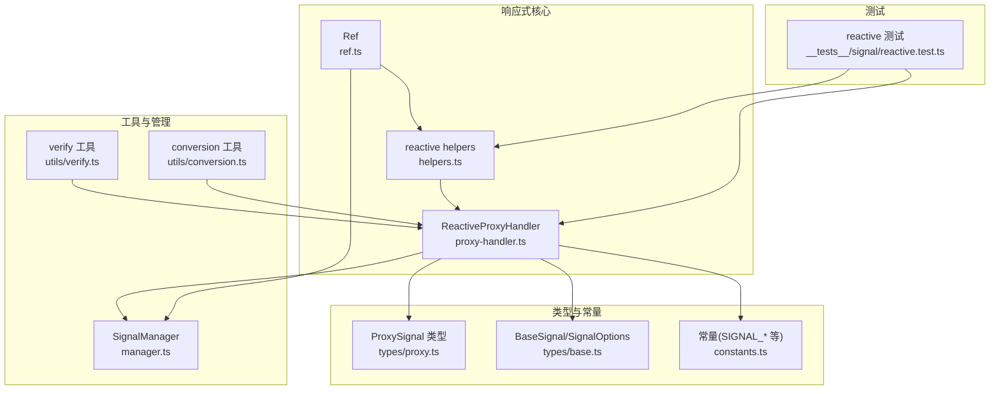
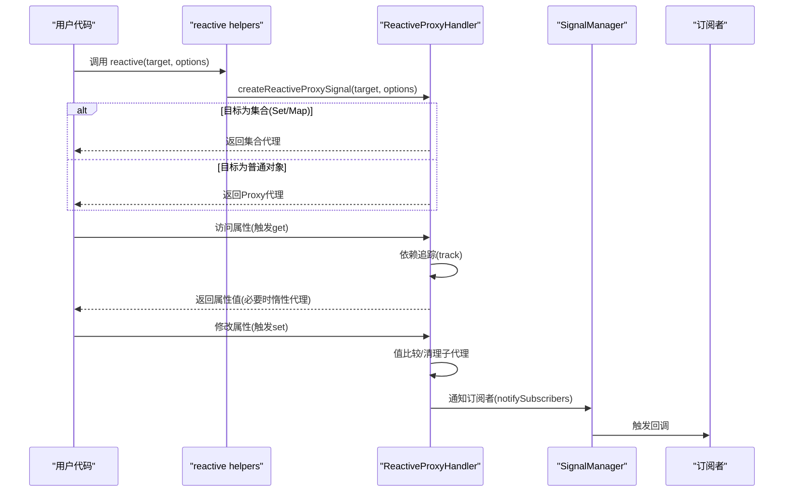
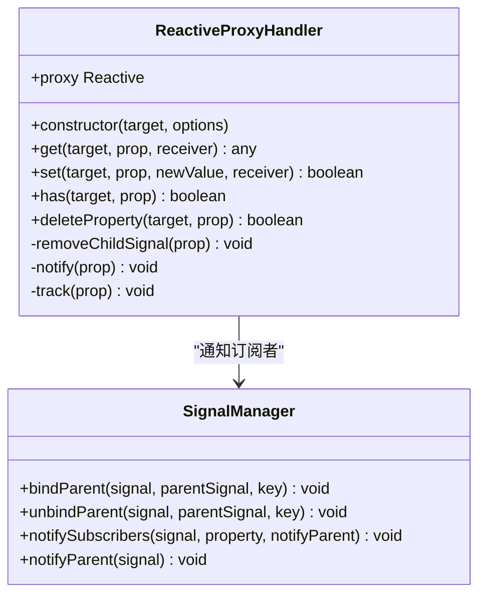
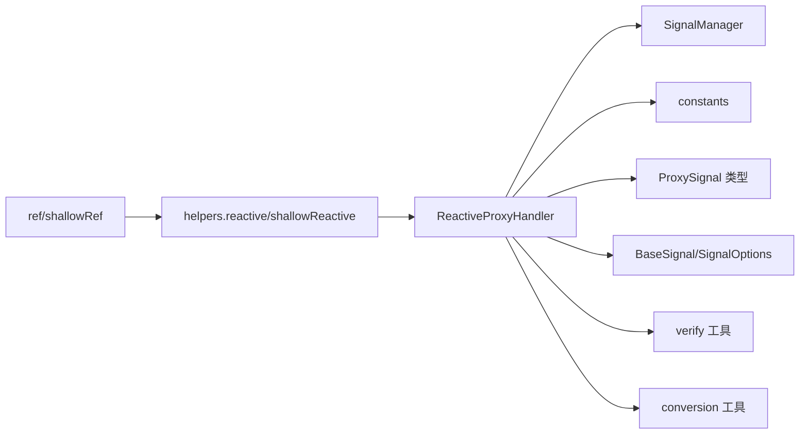

# reactive API

<cite>
**本文引用的文件列表**
- [packages/responsive/src/signal/reactive/proxy-handler.ts](file://packages/responsive/src/signal/reactive/proxy-handler.ts)
- [packages/responsive/src/signal/reactive/helpers.ts](file://packages/responsive/src/signal/reactive/helpers.ts)
- [packages/responsive/src/signal/ref/ref.ts](file://packages/responsive/src/signal/ref/ref.ts)
- [packages/responsive/src/signal/ref/helpers.ts](file://packages/responsive/src/signal/ref/helpers.ts)
- [packages/responsive/src/signal/types/proxy.ts](file://packages/responsive/src/signal/types/proxy.ts)
- [packages/responsive/src/signal/types/base.ts](file://packages/responsive/src/signal/types/base.ts)
- [packages/responsive/src/signal/constants.ts](file://packages/responsive/src/signal/constants.ts)
- [packages/responsive/src/signal/manager.ts](file://packages/responsive/src/signal/manager.ts)
- [packages/responsive/src/signal/utils/verify.ts](file://packages/responsive/src/signal/utils/verify.ts)
- [packages/responsive/src/signal/utils/conversion.ts](file://packages/responsive/src/signal/utils/conversion.ts)
- [packages/responsive/__tests__/signal/reactive.test.ts](file://packages/responsive/__tests__/signal/reactive.test.ts)
</cite>

## 目录
1. [简介](#简介)
2. [项目结构](#项目结构)
3. [核心组件](#核心组件)
4. [架构总览](#架构总览)
5. [详细组件分析](#详细组件分析)
6. [依赖关系分析](#依赖关系分析)
7. [性能考量](#性能考量)
8. [故障排查指南](#故障排查指南)
9. [结论](#结论)
10. [附录](#附录)

## 简介
本文件面向vitarx框架的响应式系统，聚焦reactive API的响应式转换机制与使用方式。重点阐述：
- 如何通过Proxy拦截对象的getter/setter等操作实现依赖追踪与响应式更新
- 对普通对象、数组、Map、Set等集合类型的处理能力
- unreactive函数的作用与使用场景，即如何获取响应式对象的原始值以避免不必要的响应式开销
- reactive与ref在处理对象时的区别，以及在复杂状态管理中的最佳实践
- 结合测试用例中的Map与Set使用场景，提供可落地的应用参考

## 项目结构
reactive API位于responsive包的signal模块中，核心文件包括：
- reactive代理处理器与工厂函数：proxy-handler.ts、helpers.ts
- ref引用信号实现：ref.ts、helpers.ts
- 类型定义：types/base.ts、types/proxy.ts
- 常量与工具：constants.ts、utils/verify.ts、utils/conversion.ts
- 信号管理器：manager.ts
- 测试用例：__tests__/signal/reactive.test.ts



图表来源
- [packages/responsive/src/signal/reactive/proxy-handler.ts](file://packages/responsive/src/signal/reactive/proxy-handler.ts#L1-L398)
- [packages/responsive/src/signal/reactive/helpers.ts](file://packages/responsive/src/signal/reactive/helpers.ts#L1-L112)
- [packages/responsive/src/signal/ref/ref.ts](file://packages/responsive/src/signal/ref/ref.ts#L1-L473)
- [packages/responsive/src/signal/types/proxy.ts](file://packages/responsive/src/signal/types/proxy.ts#L1-L19)
- [packages/responsive/src/signal/types/base.ts](file://packages/responsive/src/signal/types/base.ts#L1-L89)
- [packages/responsive/src/signal/constants.ts](file://packages/responsive/src/signal/constants.ts#L1-L25)
- [packages/responsive/src/signal/manager.ts](file://packages/responsive/src/signal/manager.ts#L1-L153)
- [packages/responsive/src/signal/utils/verify.ts](file://packages/responsive/src/signal/utils/verify.ts#L1-L85)
- [packages/responsive/src/signal/utils/conversion.ts](file://packages/responsive/src/signal/utils/conversion.ts#L1-L49)
- [packages/responsive/__tests__/signal/reactive.test.ts](file://packages/responsive/__tests__/signal/reactive.test.ts#L1-L157)

章节来源
- [packages/responsive/src/signal/reactive/proxy-handler.ts](file://packages/responsive/src/signal/reactive/proxy-handler.ts#L1-L398)
- [packages/responsive/src/signal/reactive/helpers.ts](file://packages/responsive/src/signal/reactive/helpers.ts#L1-L112)
- [packages/responsive/src/signal/ref/ref.ts](file://packages/responsive/src/signal/ref/ref.ts#L1-L473)
- [packages/responsive/src/signal/types/proxy.ts](file://packages/responsive/src/signal/types/proxy.ts#L1-L19)
- [packages/responsive/src/signal/types/base.ts](file://packages/responsive/src/signal/types/base.ts#L1-L89)
- [packages/responsive/src/signal/constants.ts](file://packages/responsive/src/signal/constants.ts#L1-L25)
- [packages/responsive/src/signal/manager.ts](file://packages/responsive/src/signal/manager.ts#L1-L153)
- [packages/responsive/src/signal/utils/verify.ts](file://packages/responsive/src/signal/utils/verify.ts#L1-L85)
- [packages/responsive/src/signal/utils/conversion.ts](file://packages/responsive/src/signal/utils/conversion.ts#L1-L49)
- [packages/responsive/__tests__/signal/reactive.test.ts](file://packages/responsive/__tests__/signal/reactive.test.ts#L1-L157)

## 核心组件
- reactive工厂函数：对外暴露reactive与shallowReactive，负责创建响应式代理或浅层代理
- ReactiveProxyHandler：实现Proxy处理器，拦截getter/setter/has/deleteProperty等，完成依赖追踪、惰性深度代理、集合代理、数组长度变更通知等
- SignalManager：管理信号父子关系与通知链路，向上游传播变更
- Ref与Ref辅助：ref/shallowRef提供值引用的响应式封装，与reactive形成互补
- 类型系统：BaseSignal、ProxySignal、SignalOptions等，统一信号的结构与行为契约
- 工具函数：isReactive、isSignal、isRefSignal、toRaw、unreactive等，支撑类型判断与原始值访问

章节来源
- [packages/responsive/src/signal/reactive/helpers.ts](file://packages/responsive/src/signal/reactive/helpers.ts#L1-L112)
- [packages/responsive/src/signal/reactive/proxy-handler.ts](file://packages/responsive/src/signal/reactive/proxy-handler.ts#L1-L398)
- [packages/responsive/src/signal/ref/ref.ts](file://packages/responsive/src/signal/ref/ref.ts#L1-L473)
- [packages/responsive/src/signal/types/base.ts](file://packages/responsive/src/signal/types/base.ts#L1-L89)
- [packages/responsive/src/signal/types/proxy.ts](file://packages/responsive/src/signal/types/proxy.ts#L1-L19)
- [packages/responsive/src/signal/manager.ts](file://packages/responsive/src/signal/manager.ts#L1-L153)
- [packages/responsive/src/signal/utils/verify.ts](file://packages/responsive/src/signal/utils/verify.ts#L1-L85)
- [packages/responsive/src/signal/utils/conversion.ts](file://packages/responsive/src/signal/utils/conversion.ts#L1-L49)

## 架构总览
reactive的核心流程如下：
- 用户调用reactive或shallowReactive创建响应式对象
- 若目标为普通对象，使用ReactiveProxyHandler创建Proxy代理
- 若目标为集合(Set/Map)，使用独立的集合代理逻辑
- 访问属性时，ReactiveProxyHandler.get进行依赖追踪与惰性深度代理
- 修改属性时，ReactiveProxyHandler.set进行值比较、子代理清理、通知订阅者
- SignalManager负责向上游传播变更，确保依赖树完整更新



图表来源
- [packages/responsive/src/signal/reactive/helpers.ts](file://packages/responsive/src/signal/reactive/helpers.ts#L1-L112)
- [packages/responsive/src/signal/reactive/proxy-handler.ts](file://packages/responsive/src/signal/reactive/proxy-handler.ts#L147-L300)
- [packages/responsive/src/signal/manager.ts](file://packages/responsive/src/signal/manager.ts#L106-L123)

## 详细组件分析

### ReactiveProxyHandler：响应式代理处理器
- 作用：实现Proxy处理器，拦截getter/setter/has/deleteProperty等，完成依赖追踪、惰性深度代理、集合代理、数组长度变更通知
- 关键点：
  - get：处理内部符号、数组函数、惰性深度代理、依赖追踪、ref解包
  - set：值比较、子代理清理、通知订阅者
  - has：依赖追踪
  - deleteProperty：删除属性并清理子代理、通知订阅者
  - 数组特殊处理：重写set以监控length变化与数组长度变动
  - 集合代理：对Set/Map进行统一代理，拦截clear/delete/add/set并监控size变化
  - createReactiveProxySignal：根据目标类型选择普通对象代理或集合代理



图表来源
- [packages/responsive/src/signal/reactive/proxy-handler.ts](file://packages/responsive/src/signal/reactive/proxy-handler.ts#L83-L300)
- [packages/responsive/src/signal/manager.ts](file://packages/responsive/src/signal/manager.ts#L17-L123)

章节来源
- [packages/responsive/src/signal/reactive/proxy-handler.ts](file://packages/responsive/src/signal/reactive/proxy-handler.ts#L147-L300)
- [packages/responsive/src/signal/manager.ts](file://packages/responsive/src/signal/manager.ts#L106-L123)

### reactive与shallowReactive：工厂函数
- reactive：默认深度代理，适合嵌套对象的全量响应式
- shallowReactive：浅层代理，仅顶层属性响应式，深层属性变更需手动通知
- isReactive：判断值是否为响应式对象
- unreactive：获取响应式对象的原始值，避免后续访问产生依赖追踪

```mermaid
flowchart TD
Start(["调用 reactive/shallowReactive"]) --> CheckType["判断目标类型"]
CheckType --> |普通对象| CreateProxy["创建 ReactiveProxyHandler 并返回 Proxy"]
CheckType --> |集合(Set/Map)| CreateCollection["创建集合代理"]
CreateProxy --> End(["返回响应式对象"])
CreateCollection --> End
```

图表来源
- [packages/responsive/src/signal/reactive/helpers.ts](file://packages/responsive/src/signal/reactive/helpers.ts#L1-L112)
- [packages/responsive/src/signal/reactive/proxy-handler.ts](file://packages/responsive/src/signal/reactive/proxy-handler.ts#L360-L398)

章节来源
- [packages/responsive/src/signal/reactive/helpers.ts](file://packages/responsive/src/signal/reactive/helpers.ts#L1-L112)
- [packages/responsive/src/signal/reactive/proxy-handler.ts](file://packages/responsive/src/signal/reactive/proxy-handler.ts#L360-L398)

### 集合类型支持：Map与Set
- 集合代理：对Set/Map进行统一代理，拦截clear/delete/add/set并监控size变化
- size变更：通过统一工具函数触发size变更通知
- 访问size时进行依赖追踪，保证响应式更新

章节来源
- [packages/responsive/src/signal/reactive/proxy-handler.ts](file://packages/responsive/src/signal/reactive/proxy-handler.ts#L302-L358)
- [packages/responsive/__tests__/signal/reactive.test.ts](file://packages/responsive/__tests__/signal/reactive.test.ts#L57-L73)

### 数组类型支持
- 数组代理：重写set以监控length变化与数组长度变动
- push/unshift/pop/shift/splice/fill等：通过数组原生方法实现，长度变化时触发length依赖更新

章节来源
- [packages/responsive/src/signal/reactive/proxy-handler.ts](file://packages/responsive/src/signal/reactive/proxy-handler.ts#L119-L139)
- [packages/responsive/__tests__/signal/reactive.test.ts](file://packages/responsive/__tests__/signal/reactive.test.ts#L75-L123)

### 与ref的交互与区别
- reactive：对对象整体进行响应式包装，支持嵌套对象的自动解包与深度代理
- ref：对单个值进行响应式封装，支持深浅两种模式；当嵌套在reactive中时，访问时自动解包
- shallowReactive：保持嵌套对象为原始对象，不进行深度代理，深层属性变更需手动通知

章节来源
- [packages/responsive/src/signal/reactive/helpers.ts](file://packages/responsive/src/signal/reactive/helpers.ts#L1-L112)
- [packages/responsive/src/signal/ref/ref.ts](file://packages/responsive/src/signal/ref/ref.ts#L1-L473)
- [packages/responsive/__tests__/signal/reactive.test.ts](file://packages/responsive/__tests__/signal/reactive.test.ts#L125-L145)

### unreactive：获取原始值
- 作用：在需要绕过响应式系统直接操作原始数据、或将响应式对象传递给不支持Proxy的外部库时使用
- 行为：若输入为响应式对象，返回其原始未代理值；否则原样返回
- 适用场景：性能敏感路径、第三方库集成、原始值比较等

章节来源
- [packages/responsive/src/signal/reactive/helpers.ts](file://packages/responsive/src/signal/reactive/helpers.ts#L85-L112)
- [packages/responsive/src/signal/utils/conversion.ts](file://packages/responsive/src/signal/utils/conversion.ts#L1-L49)

### 依赖追踪与通知链路
- 依赖追踪：ReactiveProxyHandler.get中调用Depend.track进行依赖收集
- 通知订阅者：ReactiveProxyHandler.set/has/deleteProperty中调用SignalManager.notifySubscribers
- 父子关系：SignalManager.bindParent/unbindParent维护父子信号关系，notifyParent递归通知上游

章节来源
- [packages/responsive/src/signal/reactive/proxy-handler.ts](file://packages/responsive/src/signal/reactive/proxy-handler.ts#L286-L300)
- [packages/responsive/src/signal/manager.ts](file://packages/responsive/src/signal/manager.ts#L17-L123)

## 依赖关系分析
- reactive依赖：
  - ReactiveProxyHandler：实现Proxy拦截与响应式逻辑
  - SignalManager：管理父子关系与通知
  - 常量与类型：SIGNAL_SYMBOL、PROXY_SIGNAL_SYMBOL、DEEP_SIGNAL_SYMBOL、SIGNAL_RAW_VALUE_SYMBOL等
  - 工具：isSignal/isProxySignal/isRefSignal、toRaw等
- 与ref的关系：
  - reactive中对嵌套的Ref进行自动解包
  - shallowReactive保持嵌套对象为原始对象，不进行深度代理
- 与集合类型：
  - 集合代理独立实现，不依赖普通对象代理逻辑



图表来源
- [packages/responsive/src/signal/reactive/helpers.ts](file://packages/responsive/src/signal/reactive/helpers.ts#L1-L112)
- [packages/responsive/src/signal/reactive/proxy-handler.ts](file://packages/responsive/src/signal/reactive/proxy-handler.ts#L1-L398)
- [packages/responsive/src/signal/ref/ref.ts](file://packages/responsive/src/signal/ref/ref.ts#L1-L473)
- [packages/responsive/src/signal/types/proxy.ts](file://packages/responsive/src/signal/types/proxy.ts#L1-L19)
- [packages/responsive/src/signal/types/base.ts](file://packages/responsive/src/signal/types/base.ts#L1-L89)
- [packages/responsive/src/signal/constants.ts](file://packages/responsive/src/signal/constants.ts#L1-L25)
- [packages/responsive/src/signal/utils/verify.ts](file://packages/responsive/src/signal/utils/verify.ts#L1-L85)
- [packages/responsive/src/signal/utils/conversion.ts](file://packages/responsive/src/signal/utils/conversion.ts#L1-L49)

## 性能考量
- 深度代理 vs 浅层代理
  - reactive默认深度代理，适合嵌套对象全量响应式，但会带来额外的代理创建与依赖追踪成本
  - shallowReactive仅顶层响应式，深层属性变更需手动通知，适合大型对象或性能敏感场景
- 惰性深度代理
  - ReactiveProxyHandler在访问属性时才创建子代理，避免一次性创建全部子代理带来的开销
- 值比较
  - 通过SignalOptions.compare自定义比较函数，减少不必要的更新
- 集合代理
  - 集合代理对size变化进行统一监控，避免对每个元素进行细粒度追踪
- 原始值访问
  - 使用unreactive获取原始值，避免后续访问产生依赖追踪，降低开销

章节来源
- [packages/responsive/src/signal/reactive/proxy-handler.ts](file://packages/responsive/src/signal/reactive/proxy-handler.ts#L186-L214)
- [packages/responsive/src/signal/reactive/helpers.ts](file://packages/responsive/src/signal/reactive/helpers.ts#L1-L112)
- [packages/responsive/src/signal/types/base.ts](file://packages/responsive/src/signal/types/base.ts#L14-L47)
- [packages/responsive/src/signal/reactive/proxy-handler.ts](file://packages/responsive/src/signal/reactive/proxy-handler.ts#L302-L358)

## 故障排查指南
- 报错：目标必须为对象
  - 现象：传入非对象或冻结对象会抛出错误
  - 处理：确保传入的是普通对象或集合类型，且未被冻结
- 嵌套代理冲突
  - 现象：传入Ref或已代理对象会抛出错误
  - 处理：使用ref/shallowRef包装值，或使用unreactive获取原始值后再处理
- shallowReactive深层属性不更新
  - 现象：修改嵌套对象属性不触发更新
  - 处理：使用forceUpdate或手动通知，或改用reactive进行深度代理
- 集合代理size未更新
  - 现象：对Set/Map执行add/delete/set/clear后size未触发更新
  - 处理：确认使用reactive创建集合代理，集合代理会统一监控size变化

章节来源
- [packages/responsive/src/signal/reactive/proxy-handler.ts](file://packages/responsive/src/signal/reactive/proxy-handler.ts#L382-L397)
- [packages/responsive/src/signal/ref/ref.ts](file://packages/responsive/src/signal/ref/ref.ts#L160-L183)
- [packages/responsive/src/signal/reactive/proxy-handler.ts](file://packages/responsive/src/signal/reactive/proxy-handler.ts#L302-L358)

## 结论
reactive API通过Proxy拦截与SignalManager协作，实现了对普通对象、数组、Map、Set等集合类型的统一响应式支持。其惰性深度代理与值比较策略在保证响应式能力的同时兼顾性能。unreactive提供了原始值访问能力，便于在特定场景下规避不必要的依赖追踪。结合ref的值引用能力，开发者可以在复杂状态管理中灵活选择深度与浅层策略，平衡性能与易用性。

## 附录
- 实际应用示例（基于测试用例）
  - Map与Set使用场景：参见测试用例中对Map.set/get与Set.add/has的覆盖
  - 数组操作：参见测试用例中push/unshift/pop/shift/splice/fill与length变更
  - 与ref交互：参见测试用例中嵌套ref的自动解包与shallowReactive保持原始ref的行为
- 最佳实践
  - 嵌套对象优先使用reactive，深层对象或性能敏感场景使用shallowReactive并配合手动通知
  - 需要与第三方库集成时，使用unreactive获取原始值
  - 自定义比较函数用于稳定对象引用或特定业务场景

章节来源
- [packages/responsive/__tests__/signal/reactive.test.ts](file://packages/responsive/__tests__/signal/reactive.test.ts#L1-L157)