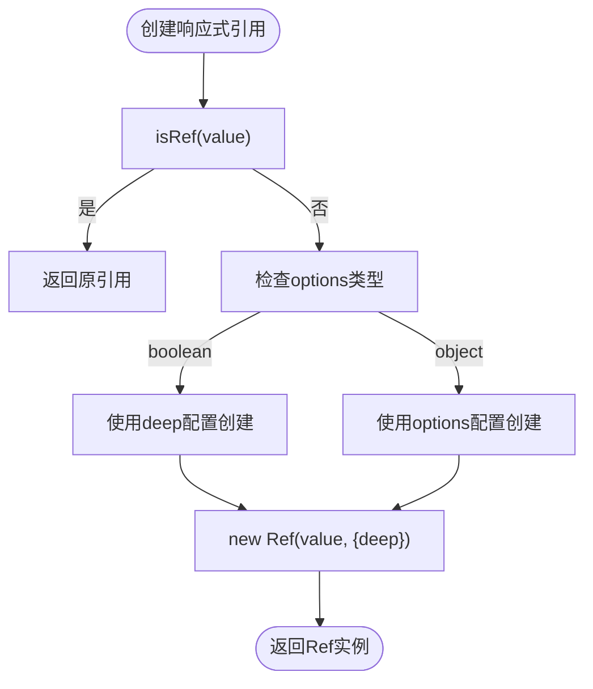

# ref API

<cite>
**本文档引用的文件**
- [ref.ts](file://packages/responsive/src/signal/ref/ref.ts)
- [property.ts](file://packages/responsive/src/signal/ref/property.ts)
- [readonly.ts](file://packages/responsive/src/signal/ref/readonly.ts)
- [helpers.ts](file://packages/responsive/src/signal/ref/helpers.ts)
- [types/ref.ts](file://packages/responsive/src/signal/types/ref.ts)
- [constants.ts](file://packages/responsive/src/signal/constants.ts)
- [conversion.ts](file://packages/responsive/src/signal/utils/conversion.ts)
- [verify.ts](file://packages/responsive/src/signal/utils/verify.ts)
- [mark.ts](file://packages/responsive/src/signal/utils/mark.ts)
- [manager.ts](file://packages/responsive/src/signal/manager.ts)
- [ref.test.ts](file://packages/responsive/__tests__/signal/ref.test.ts)
</cite>

## 目录
1. [简介](#简介)
2. [核心机制](#核心机制)
3. [RefSignal类实现](#refsignal类实现)
4. [响应式引用创建](#响应式引用创建)
5. [只读引用](#只读引用)
6. [辅助工具函数](#辅助工具函数)
7. [依赖收集与副作用](#依赖收集与副作用)
8. [与其他API的交互](#与其他api的交互)

## 简介
ref API是vitarx框架中用于创建响应式引用的核心机制。它允许将基本类型或对象包装为响应式引用，通过.value属性访问和更新值，并在模板中实现自动解包。该API为组件状态管理提供了灵活的解决方案。

## 核心机制
ref API通过RefSignal类将值包装为响应式引用，利用getter/setter拦截.value属性的访问与更新。当值发生变化时，会触发依赖收集和副作用执行。对于对象类型，默认进行深度代理，确保嵌套属性的响应性。

**Section sources**
- [ref.ts](file://packages/responsive/src/signal/ref/ref.ts#L70-L287)
- [types/ref.ts](file://packages/responsive/src/signal/types/ref.ts#L10-L22)

## RefSignal类实现
RefSignal类是ref API的核心实现，负责管理响应式引用的生命周期和行为。


**Diagram sources**
- [ref.ts](file://packages/responsive/src/signal/ref/ref.ts#L70-L287)
- [types/ref.ts](file://packages/responsive/src/signal/types/ref.ts#L10-L22)

**Section sources**
- [ref.ts](file://packages/responsive/src/signal/ref/ref.ts#L70-L287)
- [constants.ts](file://packages/responsive/src/signal/constants.ts#L16-L24)

## 响应式引用创建
通过ref函数创建响应式引用，支持基本类型和对象类型的包装。



**Diagram sources**
- [ref.ts](file://packages/responsive/src/signal/ref/ref.ts#L397-L406)
- [ref.test.ts](file://packages/responsive/__tests__/signal/ref.test.ts#L17-L42)

**Section sources**
- [ref.ts](file://packages/responsive/src/signal/ref/ref.ts#L333-L406)
- [ref.test.ts](file://packages/responsive/__tests__/signal/ref.test.ts#L17-L42)

## 只读引用
readonlyRef用于创建只读的响应式引用，支持从getter函数或现有引用创建。


**Diagram sources**
- [readonly.ts](file://packages/responsive/src/signal/ref/readonly.ts#L33-L73)
- [ref.test.ts](file://packages/responsive/__tests__/signal/ref.test.ts#L110-L119)

**Section sources**
- [readonly.ts](file://packages/responsive/src/signal/ref/readonly.ts#L33-L94)
- [ref.test.ts](file://packages/responsive/__tests__/signal/ref.test.ts#L110-L119)

## 辅助工具函数
ref API提供了一系列辅助工具函数，增强引用的灵活性和实用性。

```mermaid
flowchart TD
Subgraph 工具函数
toRef["toRef(arg1, arg2?, arg3?)"]
toRefs["toRefs(object, skipWarn?)"]
unref["unref(ref)"]
End
toRef --> CheckArgs["检查参数数量"]
CheckArgs --> |>=2| PropertyRef["创建PropertyRef"]
CheckArgs --> |<2| CheckValue["检查值类型"]
CheckValue --> |RefSignal| ReturnOriginal["返回原引用"]
CheckValue --> |function| ReadonlyRef["创建ReadonlyRef"]
CheckValue --> |其他| CreateRef["创建Ref"]
toRefs --> ValidateObject["验证对象类型"]
ValidateObject --> |非对象| ThrowError["抛出TypeError"]
ValidateObject --> |非响应式| Warn["发出警告"]
Warn --> CreateRefs["创建多个引用"]
unref --> CheckRefSignal["isRefSignal(ref)"]
CheckRefSignal --> |是| GetValue["返回ref.value"]
CheckRefSignal --> |否| ReturnOriginalValue["返回原值"]
```

**Diagram sources**
- [helpers.ts](file://packages/responsive/src/signal/ref/helpers.ts#L38-L200)
- [ref.test.ts](file://packages/responsive/__tests__/signal/ref.test.ts#L95-L149)

**Section sources**
- [helpers.ts](file://packages/responsive/src/signal/ref/helpers.ts#L8-L200)
- [ref.test.ts](file://packages/responsive/__tests__/signal/ref.test.ts#L95-L149)

## 依赖收集与副作用
ref API通过依赖系统实现响应式更新，确保状态变化时自动触发相关副作用。


**Diagram sources**
- [ref.ts](file://packages/responsive/src/signal/ref/ref.ts#L136-L182)
- [manager.ts](file://packages/responsive/src/signal/manager.ts#L115-L122)
- [ref.test.ts](file://packages/responsive/__tests__/signal/ref.test.ts#L46-L52)

**Section sources**
- [ref.ts](file://packages/responsive/src/signal/ref/ref.ts#L136-L182)
- [manager.ts](file://packages/responsive/src/signal/manager.ts#L115-L122)

## 与其他API的交互
ref API与框架其他响应式API紧密协作，形成完整的响应式系统。

```mermaid
graph TD
Subgraph 响应式系统
Ref["ref API"]
Reactive["reactive API"]
Computed["computed API"]
Watch["watch API"]
End
Ref --> |toRef| Reactive
Ref --> |toRefs| Reactive
Ref --> |unref| Computed
Ref --> |isRef| Watch
Reactive --> |propertyRef| Ref
Computed --> |readonlyRef| Ref
Watch --> |依赖收集| Ref
```

**Diagram sources**
- [helpers.ts](file://packages/responsive/src/signal/ref/helpers.ts#L166-L198)
- [ref.test.ts](file://packages/responsive/__tests__/signal/ref.test.ts#L153-L168)
- [property.ts](file://packages/responsive/src/signal/ref/property.ts#L36-L54)

**Section sources**
- [helpers.ts](file://packages/responsive/src/signal/ref/helpers.ts#L166-L198)
- [property.ts](file://packages/responsive/src/signal/ref/property.ts#L36-L81)