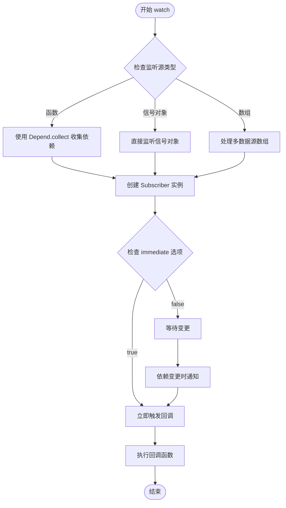
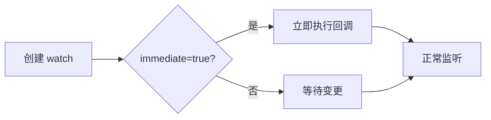
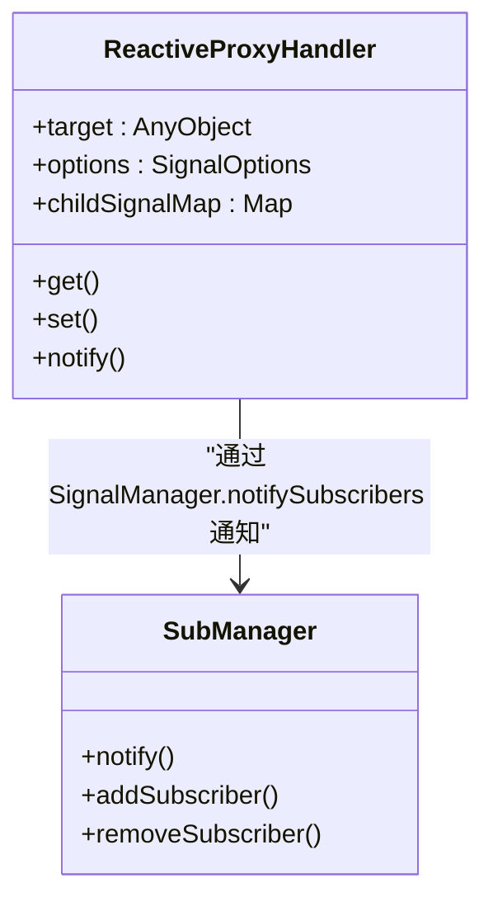
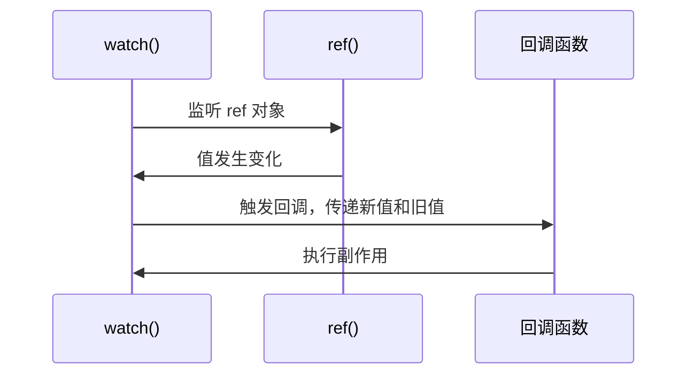
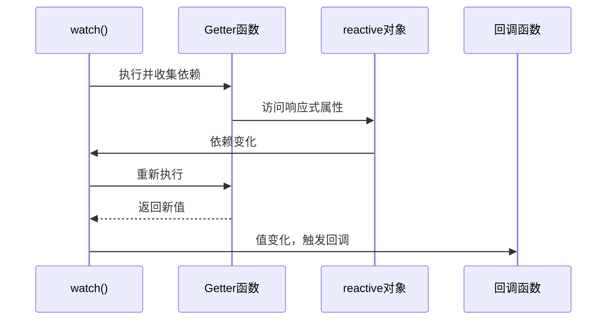
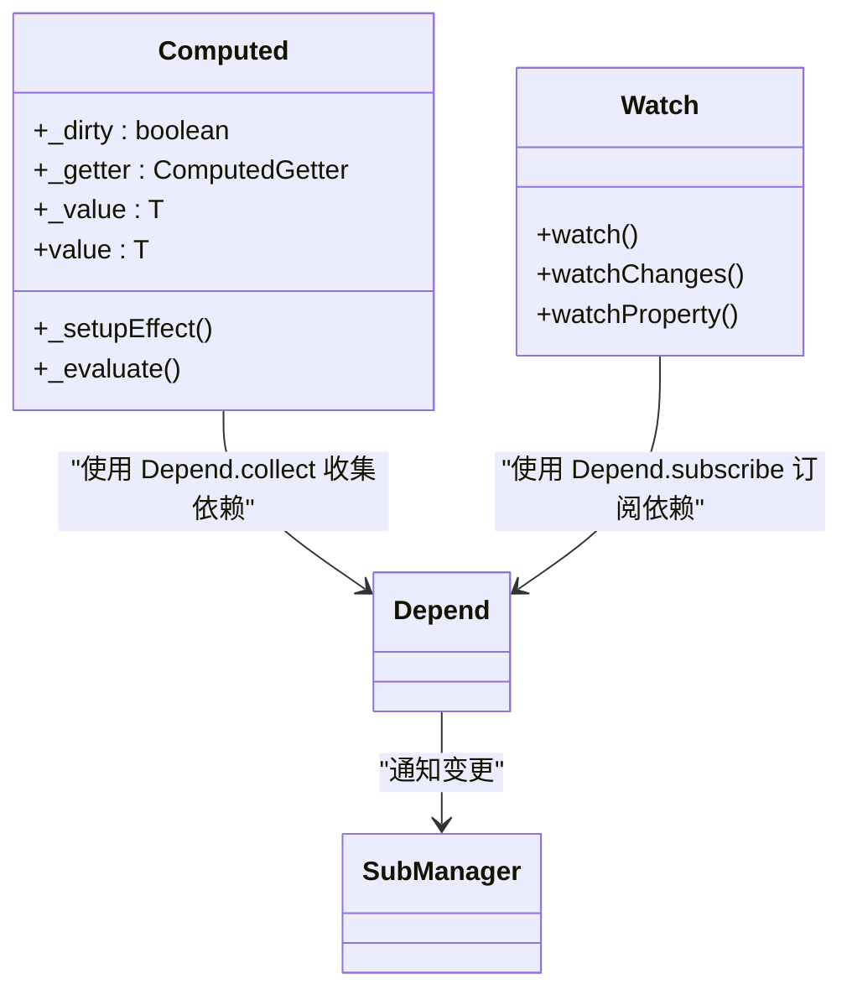
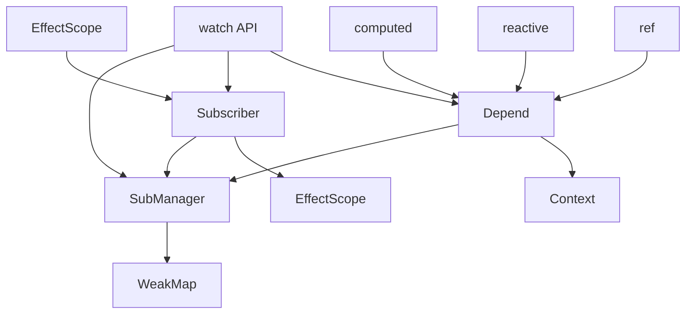

# watch API

<cite>
**本文档引用的文件**
- [watch.ts](file://packages/responsive/src/signal/watch/watch.ts)
- [ref.ts](file://packages/responsive/src/signal/ref/ref.ts)
- [proxy-handler.ts](file://packages/responsive/src/signal/reactive/proxy-handler.ts)
- [depend.ts](file://packages/responsive/src/depend/depend.ts)
- [subscriber.ts](file://packages/responsive/src/observer/subscriber.ts)
- [subManager.ts](file://packages/responsive/src/observer/subManager.ts)
- [computed.ts](file://packages/responsive/src/signal/computed/computed.ts)
- [watch.test.ts](file://packages/responsive/__tests__/signal/watch.test.ts)
</cite>

## 目录
1. [简介](#简介)
2. [核心机制](#核心机制)
3. [WatchOptions 配置项](#watchoptions-配置项)
4. [实际应用示例](#实际应用示例)
5. [与 computed 的区别](#与-computed-的区别)
6. [资源清理与内存泄漏避免](#资源清理与内存泄漏避免)
7. [依赖关系图](#依赖关系图)

## 简介

`watch` API 是 vitarx 框架中用于监听响应式数据变化并执行副作用的核心机制。它提供了一种声明式的方式来观察响应式信号（如 `ref` 和 `reactive` 对象）或 getter 函数的变化，并在值发生变化时自动执行回调函数。`watch` 不仅可以监听单个响应式对象，还可以监听多个数据源的组合，以及通过 getter 函数监听计算值的变化。

`watch` 的主要用途是处理副作用，例如数据持久化、异步操作、DOM 更新等，与用于派生状态的 `computed` 形成互补。通过 `WatchOptions` 配置项，开发者可以精细控制监听行为，如立即执行、深度监听和作用域绑定等。

**Section sources**
- [watch.ts](file://packages/responsive/src/signal/watch/watch.ts#L1-L432)

## 核心机制

`watch` API 的核心机制基于依赖追踪和副作用执行。当调用 `watch` 时，它会创建一个订阅者（`Subscriber`），该订阅者负责追踪监听源的依赖关系，并在依赖变化时触发回调函数。

### 依赖追踪

依赖追踪是通过 `Depend` 类实现的。当 `watch` 监听一个 getter 函数时，它会使用 `Depend.collect` 方法执行该函数，并在此过程中收集所有被访问的响应式对象及其属性。这些依赖关系被记录在一个 `DependencyMap` 中，用于后续的变更通知。



**Diagram sources**
- [watch.ts](file://packages/responsive/src/signal/watch/watch.ts#L192-L295)
- [depend.ts](file://packages/responsive/src/depend/depend.ts#L75-L78)

### 副作用执行

副作用执行由 `Subscriber` 类管理。`Subscriber` 封装了回调函数的执行逻辑，支持不同的触发时机（`flush` 选项），如同步（`sync`）、预更新（`pre`）、后更新（`post`）和默认模式（`default`）。`Subscriber` 还负责管理触发次数限制（`limit`）和作用域绑定（`scope`）。

当依赖发生变化时，`SubManager` 会通知所有相关的 `Subscriber`，`Subscriber` 根据其 `flush` 配置将回调函数加入相应的调度队列。例如，`flush: 'sync'` 会立即执行回调，而 `flush: 'default'` 会将回调加入微任务队列，实现批量处理。

**Section sources**
- [watch.ts](file://packages/responsive/src/signal/watch/watch.ts#L192-L295)
- [subscriber.ts](file://packages/responsive/src/observer/subscriber.ts#L98-L248)
- [subManager.ts](file://packages/responsive/src/observer/subManager.ts#L77-L91)

## WatchOptions 配置项

`WatchOptions` 接口定义了 `watch` 函数的配置选项，允许开发者自定义监听行为。

### immediate（立即执行）

当 `immediate` 设置为 `true` 时，`watch` 会在创建后立即执行一次回调函数，而不需要等待监听源的变化。这对于需要在初始化时执行某些操作的场景非常有用。



**Section sources**
- [watch.ts](file://packages/responsive/src/signal/watch/watch.ts#L197-L198)
- [watch.test.ts](file://packages/responsive/__tests__/signal/watch.test.ts#L46-L54)

### deep（深度监听）

`deep` 选项控制是否对对象进行深度监听。当监听一个 `reactive` 对象时，如果 `deep` 为 `true`，则对象内部任何嵌套属性的变化都会触发回调。`watch` 本身不直接控制 `deep`，而是依赖于 `reactive` 对象的深度代理机制。



**Diagram sources**
- [proxy-handler.ts](file://packages/responsive/src/signal/reactive/proxy-handler.ts#L83-L398)
- [subManager.ts](file://packages/responsive/src/observer/subManager.ts#L77-L91)

### scope（作用域绑定）

`scope` 选项控制 `watch` 是否自动绑定到当前的 `EffectScope`。如果设置为 `true`，当 `EffectScope` 被销毁时，`watch` 会自动停止并清理资源，避免内存泄漏。这为管理组件生命周期内的副作用提供了便利。

**Section sources**
- [watch.ts](file://packages/responsive/src/signal/watch/watch.ts#L197-L198)
- [subscriber.ts](file://packages/responsive/src/observer/subscriber.ts#L147-L150)

## 实际应用示例

### 监听 ref 和 reactive 对象

`watch` 可以直接监听 `ref` 或 `reactive` 对象的变化。当对象的值发生变化时，回调函数会接收到新值和旧值。



**Diagram sources**
- [watch.ts](file://packages/responsive/src/signal/watch/watch.ts#L244-L258)
- [ref.ts](file://packages/responsive/src/signal/ref/ref.ts#L136-L182)

### 监听 getter 函数

`watch` 可以监听一个 getter 函数的返回值。函数内部访问的任何响应式对象都会被自动追踪为依赖，当这些依赖变化时，getter 函数会重新执行，如果返回值不同，则触发回调。



**Diagram sources**
- [watch.ts](file://packages/responsive/src/signal/watch/watch.ts#L217-L239)
- [depend.ts](file://packages/responsive/src/depend/depend.ts#L129-L150)

### 异步操作触发

`watch` 常用于触发异步操作，如 API 调用。通过清理函数，可以确保在下一次回调前取消之前的异步请求，避免竞态条件。

**Section sources**
- [watch.ts](file://packages/responsive/src/signal/watch/watch.ts#L204-L209)

## 与 computed 的区别

`watch` 和 `computed` 虽然都基于依赖追踪，但它们的用途和行为有本质区别。

### 用途区别

- **`computed`**: 用于派生状态。它是一个惰性求值的响应式属性，只有在被访问时才会计算其值。`computed` 的结果可以被其他 `computed` 或 `watch` 依赖。
- **`watch`**: 用于产生副作用。它是一个主动的监听器，当依赖变化时会立即（或根据调度）执行回调函数，用于执行不需要返回值的操作。



**Diagram sources**
- [computed.ts](file://packages/responsive/src/signal/computed/computed.ts#L98-L366)
- [watch.ts](file://packages/responsive/src/signal/watch/watch.ts#L192-L295)

### 执行时机

- **`computed`**: 懒计算，首次访问 `value` 时才执行 getter。
- **`watch`**: 主动监听，依赖变化时立即（或根据 flush 配置）执行回调。

**Section sources**
- [computed.ts](file://packages/responsive/src/signal/computed/computed.ts#L202-L217)
- [watch.ts](file://packages/responsive/src/signal/watch/watch.ts#L257)

## 资源清理与内存泄漏避免

`watch` 提供了强大的资源清理机制，以避免内存泄漏。

### 清理函数

`watch` 的回调函数接收第三个参数 `onCleanup`，这是一个用于注册清理函数的方法。清理函数会在下一次回调执行前或 `watch` 被销毁时自动调用。

```typescript
watch(signal, (newVal, oldVal, onCleanup) => {
  const timer = setTimeout(() => console.log(newVal), 1000)
  onCleanup(() => clearTimeout(timer)) // 自动清理定时器
})
```

**Section sources**
- [watch.ts](file://packages/responsive/src/signal/watch/watch.ts#L204-L215)

### 作用域绑定

通过 `scope` 选项，`watch` 可以自动绑定到当前的 `EffectScope`。当组件或作用域被卸载时，所有绑定的 `watch` 会自动停止，无需手动调用 `dispose`。

**Section sources**
- [watch.ts](file://packages/responsive/src/signal/watch/watch.ts#L197-L198)
- [subscriber.ts](file://packages/responsive/src/observer/subscriber.ts#L147-L150)

## 依赖关系图



**Diagram sources**
- [watch.ts](file://packages/responsive/src/signal/watch/watch.ts#L1-L432)
- [depend.ts](file://packages/responsive/src/depend/depend.ts#L1-L152)
- [subscriber.ts](file://packages/responsive/src/observer/subscriber.ts#L1-L248)
- [subManager.ts](file://packages/responsive/src/observer/subManager.ts#L1-L424)