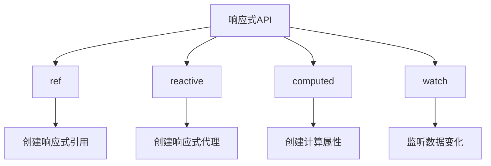
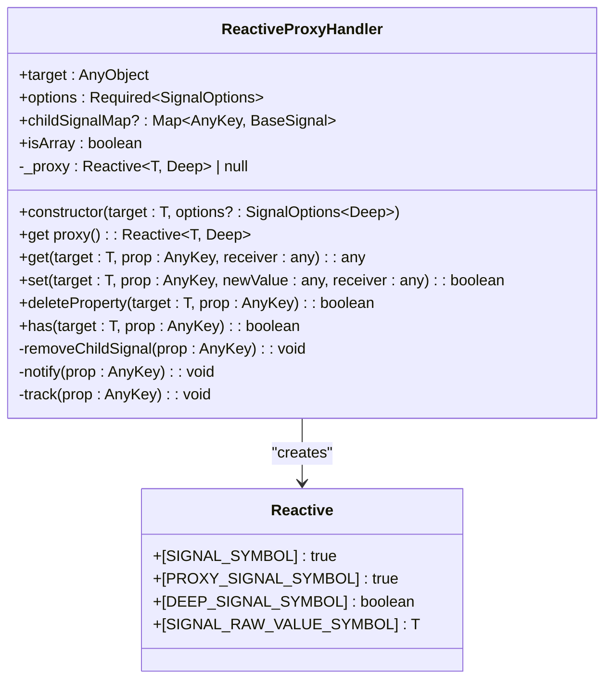
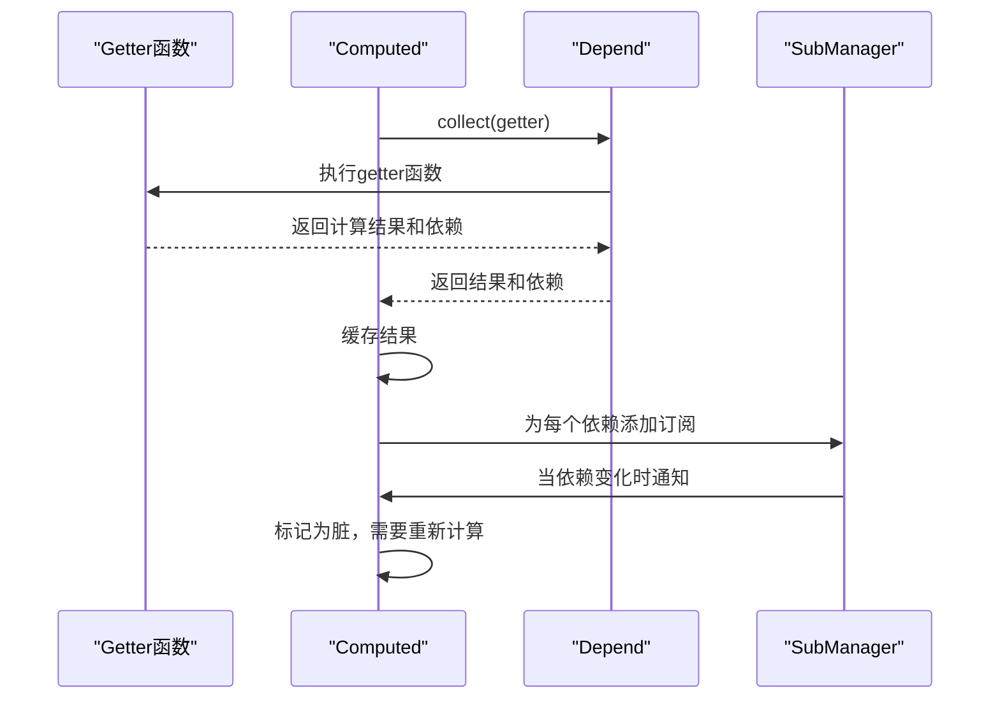
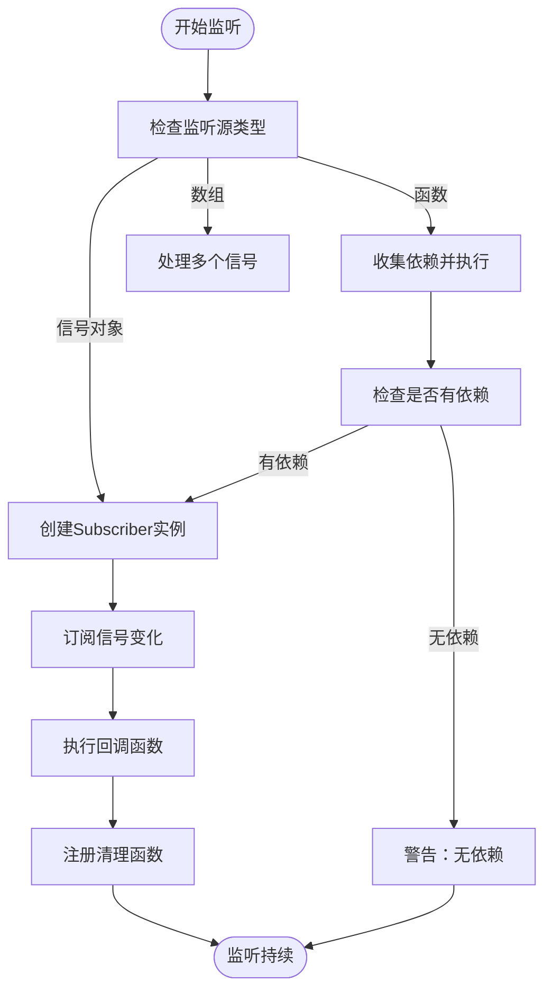
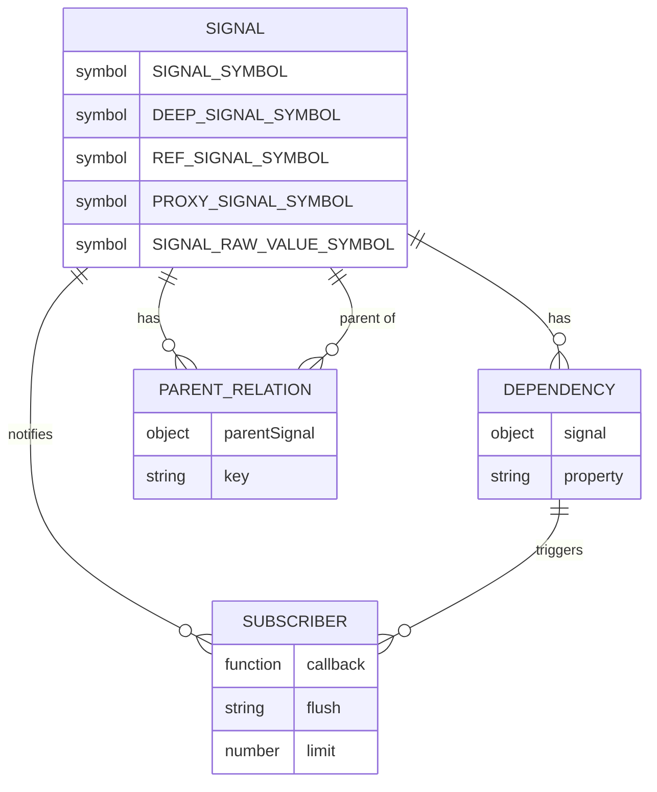

# 响应式API

<cite>
**本文档引用的文件**
- [ref.ts](file://packages/responsive/src/signal/ref/ref.ts)
- [ref/index.ts](file://packages/responsive/src/signal/ref/index.ts)
- [helpers.ts](file://packages/responsive/src/signal/ref/helpers.ts)
- [proxy-handler.ts](file://packages/responsive/src/signal/reactive/proxy-handler.ts)
- [computed.ts](file://packages/responsive/src/signal/computed/computed.ts)
- [watch.ts](file://packages/responsive/src/signal/watch/watch.ts)
- [constants.ts](file://packages/responsive/src/signal/constants.ts)
- [types/index.ts](file://packages/responsive/src/signal/types/index.ts)
- [base.ts](file://packages/responsive/src/signal/types/base.ts)
- [ref.ts](file://packages/responsive/src/signal/types/ref.ts)
- [proxy.ts](file://packages/responsive/src/signal/types/proxy.ts)
- [manager.ts](file://packages/responsive/src/signal/manager.ts)
</cite>

## 目录
1. [简介](#简介)
2. [核心API概览](#核心api概览)
3. [ref API详解](#ref-api详解)
4. [reactive API详解](#reactive-api详解)
5. [computed API详解](#computed-api详解)
6. [watch API详解](#watch-api详解)
7. [API对比与使用场景](#api对比与使用场景)
8. [响应式系统原理](#响应式系统原理)
9. [最佳实践](#最佳实践)

## 简介
vitarx框架的响应式API提供了一套完整的状态管理解决方案，包括`ref`、`reactive`、`computed`和`watch`等核心函数。这些API共同构成了一个高效的响应式系统，能够自动追踪依赖关系并在数据变化时更新视图。

响应式系统基于ES6 Proxy和WeakMap等现代JavaScript特性实现，通过依赖追踪和自动更新机制，开发者可以专注于业务逻辑而无需手动管理状态同步。本文档将详细说明每个API的使用方法、实现原理和最佳实践，帮助开发者深入理解vitarx框架的响应式机制。

**本文档引用的文件**
- [ref.ts](file://packages/responsive/src/signal/ref/ref.ts)
- [ref/index.ts](file://packages/responsive/src/signal/ref/index.ts)
- [proxy-handler.ts](file://packages/responsive/src/signal/reactive/proxy-handler.ts)
- [computed.ts](file://packages/responsive/src/signal/computed/computed.ts)
- [watch.ts](file://packages/responsive/src/signal/watch/watch.ts)

## 核心API概览
vitarx框架的响应式API主要由四个核心函数组成，它们都位于`@vitarx/responsive`模块中：

- `ref`: 创建一个包装对象，使其成为响应式数据源
- `reactive`: 创建一个深层响应式代理对象
- `computed`: 创建一个计算属性，其值由getter函数计算得出
- `watch`: 监听响应式数据的变化并执行回调函数

这些API共同构成了一个完整的响应式系统，通过依赖追踪和自动更新机制，实现了数据与视图的自动同步。



**本文档引用的文件**
- [ref/index.ts](file://packages/responsive/src/signal/ref/index.ts)
- [computed/index.ts](file://packages/responsive/src/signal/computed/index.ts)
- [watch/index.ts](file://packages/responsive/src/signal/watch/index.ts)

## ref API详解
`ref`函数用于创建一个响应式引用对象，使其成为响应式数据源。当引用的值发生变化时，所有依赖于该引用的计算和副作用将自动更新。

### 函数签名
```typescript
function ref(): Ref<any>
function ref<Value>(): Ref<Value | undefined>
function ref<Value, Deep extends boolean = true>(
  value: Value | Ref<Value, Deep>,
  options?: SignalOptions<Deep> | Deep
): Ref<Value, Deep>
```

### 参数类型
- `value`: 要包装的初始值，可以是普通值或已有的引用
- `options`: 信号的选项配置，支持直接传入boolean指定deep配置
  - `deep`: 是否深度代理嵌套对象，默认为true
  - `compare`: 值比较函数，用于决定是否触发更新，默认使用Object.is进行比较

### 返回值类型
返回一个`Ref`对象，实现了`RefSignal`接口，具有以下特性：
- `value`属性是响应式的，当其值发生变化时会触发监听器的回调函数
- 支持深度代理嵌套对象（默认启用）
- 提供`forceUpdate`方法强制触发更新事件

### 使用场景
`ref`适用于以下场景：
- 包装基本类型值（如数字、字符串）使其成为响应式
- 需要明确访问`.value`属性来获取或设置值的场景
- 需要浅层响应式的场景（通过设置`deep: false`）

### 注意事项
- 不能将`Ref`对象设置为另一个`Ref`对象的值
- 使用自定义比较函数时需要注意性能影响
- 浅层`ref`不会代理嵌套对象的属性，需要手动调用`forceUpdate`来触发更新

**本文档引用的文件**
- [ref.ts](file://packages/responsive/src/signal/ref/ref.ts)
- [types/ref.ts](file://packages/responsive/src/signal/types/ref.ts)
- [constants.ts](file://packages/responsive/src/signal/constants.ts)

## reactive API详解
`reactive`函数创建一个深层响应式代理对象，会自动解包对象中的所有响应式信号值。对象的所有属性都将被转换为响应式的，包括嵌套对象。

### 函数签名
```typescript
function reactive<T extends AnyObject>(target: T, options?: SignalOptions): Reactive<T>
```

### 参数类型
- `target`: 要代理的目标对象
- `options`: 代理配置选项
  - `deep`: 是否深度代理，默认为true
  - `compare`: 值比较函数，默认使用Object.is进行比较

### 返回值类型
返回一个`Reactive`对象，实现了`ProxySignal`接口，具有以下特性：
- 所有属性都是响应式的，包括嵌套对象
- 自动解包`ref`信号值
- 支持数组、Set、Map等集合类型的响应式

### 使用场景
`reactive`适用于以下场景：
- 包装复杂对象使其成为响应式
- 需要深度响应式的场景
- 需要自动解包`ref`信号值的场景

### 注意事项
- 不能代理已经代理过的对象
- 不能代理`ref`对象
- 冻结的对象不能被代理
- 对于大型对象，深度代理可能会有性能开销



**本文档引用的文件**
- [proxy-handler.ts](file://packages/responsive/src/signal/reactive/proxy-handler.ts)
- [types/proxy.ts](file://packages/responsive/src/signal/types/proxy.ts)
- [manager.ts](file://packages/responsive/src/signal/manager.ts)

## computed API详解
`computed`函数创建一个计算属性，其值由getter函数计算得出。当依赖的响应式数据发生变化时，计算属性会自动重新计算并更新其值。

### 函数签名
```typescript
class Computed<T> implements RefSignal<T> {
  constructor(
    getter: ComputedGetter<T>,
    options?: ComputedOptions<T>
  )
}
```

### 参数类型
- `getter`: 计算属性的getter函数，接收上一次的计算结果作为参数
- `options`: 计算属性的配置选项
  - `setter`: 计算属性的setter函数，用于处理对计算属性的赋值操作
  - `immediate`: 是否立即计算，默认为false
  - `scope`: 是否自动添加到当前作用域，默认为true

### 返回值类型
返回一个`Computed`对象，实现了`RefSignal`接口，具有以下特性：
- 采用懒计算策略，首次访问时才进行计算
- 自动追踪依赖关系
- 支持缓存机制，避免不必要的重新计算

### 使用场景
`computed`适用于以下场景：
- 基于其他响应式数据计算得出的派生数据
- 需要缓存计算结果的场景
- 需要自动更新的派生状态

### 注意事项
- 计算属性默认是只读的，除非提供了setter函数
- getter函数应该是纯函数，不应该有副作用
- 计算属性的依赖关系在首次计算时确定
- 可以通过`immediate`选项立即执行计算



**本文档引用的文件**
- [computed.ts](file://packages/responsive/src/signal/computed/computed.ts)
- [depend/index.ts](file://packages/responsive/src/depend/index.ts)
- [observer/index.ts](file://packages/responsive/src/observer/index.ts)

## watch API详解
`watch`函数用于监听响应式数据的变化并执行回调函数。它可以监听信号对象或副作用函数，并在值发生变化时执行回调。

### 函数签名
```typescript
function watch<
  T extends AnyObject | AnyFunction,
  C extends WatchCallback<T extends AnyFunction ? ReturnType<T> : T>
>(
  source: T,
  callback: C,
  options?: WatchOptions
): Subscriber<VoidCallback>
```

### 参数类型
- `source`: 监听源对象或函数
  - 当传入信号对象时：直接监听该信号的变化
  - 当传入函数时：监听函数内部依赖的信号变化
- `callback`: 变化时触发的回调函数
  - 接收新值、旧值作为参数
  - 通过第三个参数可注册清理函数
- `options`: 监听器配置选项
  - `flush`: 执行模式，可选值有'default' | 'pre' | 'post' | 'sync'
  - `limit`: 触发次数限制，0表示无限制
  - `scope`: 是否自动添加到当前作用域
  - `clone`: 是否深度克隆新旧值
  - `immediate`: 立即执行一次回调

### 返回值类型
返回一个`Subscriber`实例，可用于手动取消监听。

### 使用场景
`watch`适用于以下场景：
- 需要在数据变化时执行副作用的场景
- 需要清理资源的场景（如定时器、事件监听器）
- 需要异步操作的场景

### 注意事项
- 回调函数中的清理函数会在下次回调触发前或监听被销毁时执行
- 深度克隆操作存在额外的性能开销
- 可以通过`immediate`选项立即执行一次回调
- 支持多种执行模式，可以根据需要选择合适的模式



**本文档引用的文件**
- [watch.ts](file://packages/responsive/src/signal/watch/watch.ts)
- [depend/index.ts](file://packages/responsive/src/depend/index.ts)
- [observer/index.ts](file://packages/responsive/src/observer/index.ts)

## API对比与使用场景
### ref与reactive的区别
`ref`和`reactive`是vitarx框架中最常用的两个响应式API，它们有以下主要区别：

| 特性 | ref | reactive |
|------|-----|----------|
| 数据类型 | 适用于基本类型和对象 | 仅适用于对象 |
| 访问方式 | 需要通过.value访问 | 直接访问属性 |
| 深度代理 | 可配置（默认启用） | 始终深度代理 |
| 解包行为 | 在模板中自动解包 | 自动解包ref信号值 |
| 性能 | 轻量级，适合简单数据 | 重量级，适合复杂对象 |

**使用建议**：
- 使用`ref`包装基本类型值或需要明确访问`.value`的场景
- 使用`reactive`包装复杂对象或需要深度响应式的场景
- 在组合式API中，通常使用`ref`来声明响应式变量

### computed的缓存机制
`computed`采用懒计算和缓存机制来优化性能：

1. **懒计算**：只有在首次访问`.value`时才执行getter函数
2. **依赖追踪**：在getter函数执行过程中收集依赖
3. **缓存机制**：将计算结果缓存，只有当依赖变化时才重新计算
4. **脏标记**：使用_dirty标记来标识是否需要重新计算

这种机制确保了计算属性只在必要时才重新计算，避免了不必要的性能开销。

### watch的依赖追踪原理
`watch`的依赖追踪原理基于以下机制：

1. **依赖收集**：当监听函数执行时，访问的响应式数据会被自动追踪
2. **订阅管理**：为每个依赖创建订阅，当依赖变化时通知watcher
3. **回调执行**：当依赖变化时，执行回调函数并传递新旧值
4. **资源清理**：提供onCleanup函数来注册清理函数，确保资源正确释放

这种机制使得`watch`能够精确地追踪依赖关系，并在数据变化时及时响应。

**本文档引用的文件**
- [ref.ts](file://packages/responsive/src/signal/ref/ref.ts)
- [proxy-handler.ts](file://packages/responsive/src/signal/reactive/proxy-handler.ts)
- [computed.ts](file://packages/responsive/src/signal/computed/computed.ts)
- [watch.ts](file://packages/responsive/src/signal/watch/watch.ts)

## 响应式系统原理
vitarx框架的响应式系统基于以下几个核心概念实现：

### 依赖追踪
依赖追踪是响应式系统的核心机制，通过以下步骤实现：
1. 当访问响应式数据时，Depend.track方法记录当前的依赖关系
2. 当数据变化时，SignalManager.notifySubscribers方法通知所有订阅者
3. 订阅者执行相应的更新操作

### 响应式代理
使用ES6 Proxy实现响应式代理，拦截对象的get、set、deleteProperty等操作：
- get操作：收集依赖并返回值
- set操作：更新值并通知订阅者
- deleteProperty操作：删除属性并通知订阅者

### 信号系统
通过Symbol标识符来标记响应式对象：
- `SIGNAL_SYMBOL`: 标识为响应式信号对象
- `REF_SIGNAL_SYMBOL`: 标识为值引用类型的响应式信号
- `PROXY_SIGNAL_SYMBOL`: 标识为对象信号
- `DEEP_SIGNAL_SYMBOL`: 标识是否深度代理

### 父子关系管理
SignalManager负责管理信号之间的父子关系：
- bindParent: 绑定父子信号关系
- unbindParent: 取消绑定父子信号关系
- notifyParent: 通知父级信号更新



**本文档引用的文件**
- [manager.ts](file://packages/responsive/src/signal/manager.ts)
- [depend/index.ts](file://packages/responsive/src/depend/index.ts)
- [observer/index.ts](file://packages/responsive/src/observer/index.ts)
- [constants.ts](file://packages/responsive/src/signal/constants.ts)

## 最佳实践
### 响应式数据声明
- 使用`ref`声明基本类型响应式数据
- 使用`reactive`声明复杂对象响应式数据
- 避免过度使用响应式，只将需要响应的数据标记为响应式

### 计算属性使用
- 将复杂的计算逻辑封装在`computed`中
- 确保getter函数是纯函数，没有副作用
- 使用`immediate`选项在需要时立即执行计算

### 监听器管理
- 使用`watch`的清理函数来释放资源
- 避免在`watch`回调中创建新的响应式数据
- 使用`flush`选项控制回调执行时机

### 性能优化
- 对于大型对象，考虑使用浅层响应式
- 避免在计算属性中执行耗时操作
- 使用`clone`选项时注意性能影响

### 错误处理
- 处理可能的类型错误，如尝试将`ref`设置为`ref`的值
- 处理冻结对象不能被代理的情况
- 处理循环引用可能导致的问题

**本文档引用的文件**
- [ref.ts](file://packages/responsive/src/signal/ref/ref.ts)
- [proxy-handler.ts](file://packages/responsive/src/signal/reactive/proxy-handler.ts)
- [computed.ts](file://packages/responsive/src/signal/computed/computed.ts)
- [watch.ts](file://packages/responsive/src/signal/watch/watch.ts)