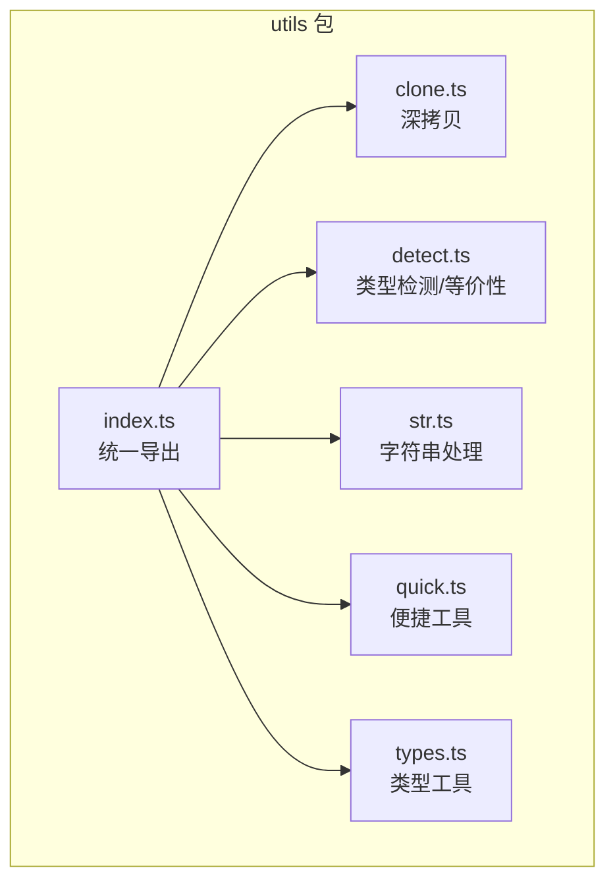
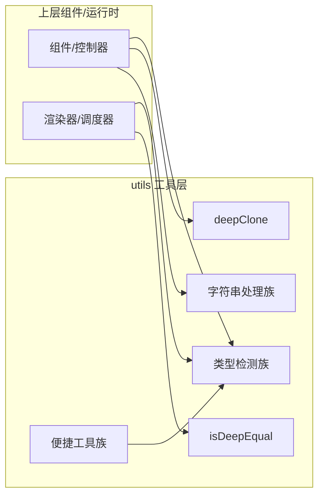
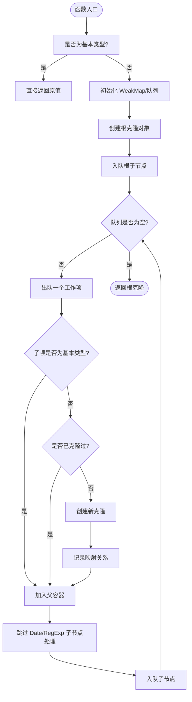
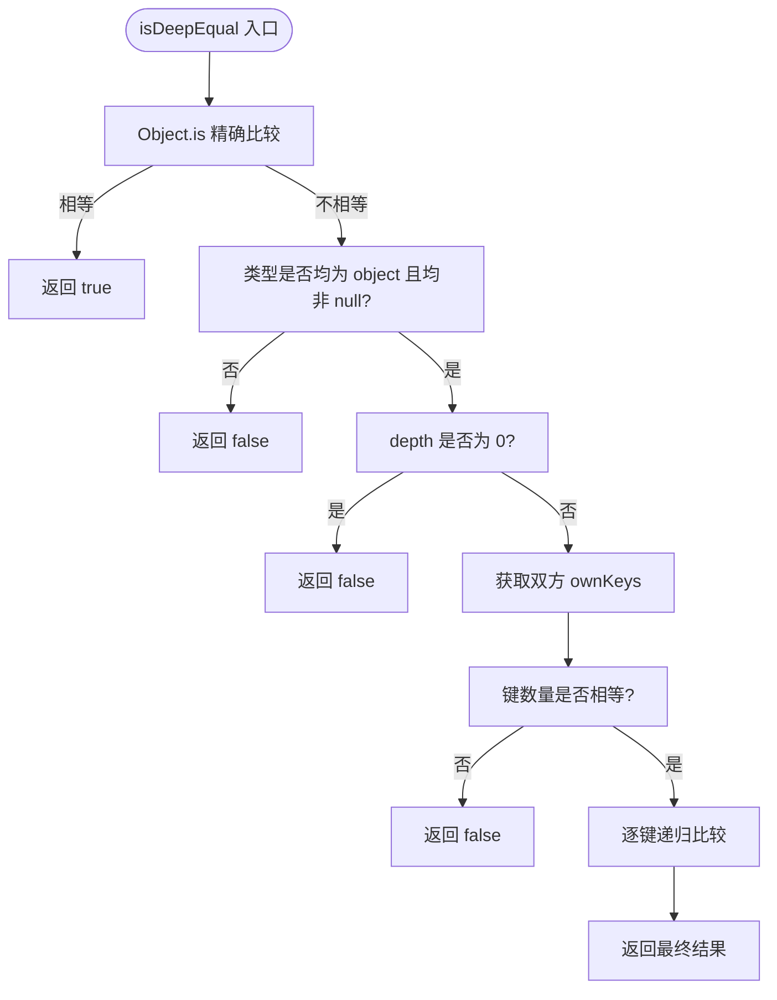
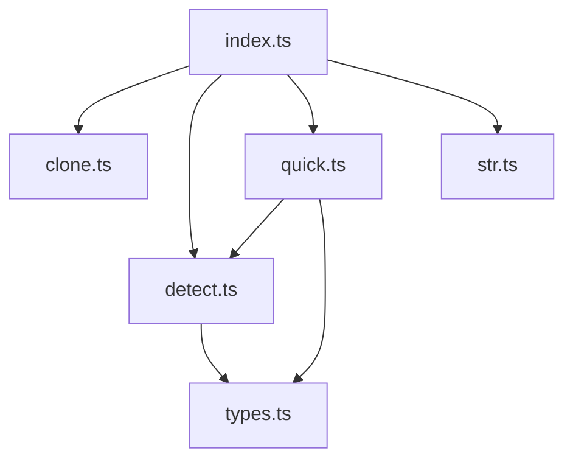

# 工具函数API

<cite>
**本文引用的文件**
- [clone.ts](file://packages/utils/src/clone.ts)
- [detect.ts](file://packages/utils/src/detect.ts)
- [str.ts](file://packages/utils/src/str.ts)
- [index.ts](file://packages/utils/src/index.ts)
- [types.ts](file://packages/utils/src/types.ts)
- [clone.test.ts](file://packages/utils/__tests__/clone.test.ts)
- [detect.test.ts](file://packages/utils/__tests__/detect.test.ts)
- [quick.ts](file://packages/utils/src/quick.ts)
</cite>

## 目录
1. [简介](#简介)
2. [项目结构](#项目结构)
3. [核心组件](#核心组件)
4. [架构总览](#架构总览)
5. [详细组件分析](#详细组件分析)
6. [依赖分析](#依赖分析)
7. [性能考虑](#性能考虑)
8. [故障排查指南](#故障排查指南)
9. [结论](#结论)
10. [附录](#附录)

## 简介
本文件系统化梳理 vitarx 框架提供的公共工具函数，重点覆盖以下模块：
- 深拷贝：deepClone，支持循环引用、日期、正则、集合、数组与普通对象的完整克隆。
- 类型检测：isDeepEqual、isObject、isArray、isString、isNumber、isBool、isEmpty、isFunction、isPromise、isMap、isSet、isWeakMap、isWeakSet、isCollection、isAsyncFunction、isConstructor、isPureFunction、isSimpleGetterFunction、isNumString 等，提供全面的类型判断与等价性比较。
- 字符串处理：toCamelCase、toKebabCase、toCapitalize，便于命名风格转换与 UI 属性命名规范。

同时，结合框架内部使用场景（如 props 比较、状态快照等），给出行为特征、输入输出类型、边界情况与性能建议，帮助开发者安全高效地使用这些底层工具。

## 项目结构
utils 包提供基础工具集，对外统一导出入口位于 index.ts，内部按功能拆分为 clone、detect、str、quick、delay、loggger 等模块，并通过 types.ts 提供通用类型工具。

图表来源
- [index.ts](file://packages/utils/src/index.ts#L1-L8)
- [clone.ts](file://packages/utils/src/clone.ts#L1-L124)
- [detect.ts](file://packages/utils/src/detect.ts#L1-L540)
- [str.ts](file://packages/utils/src/str.ts#L1-L45)
- [quick.ts](file://packages/utils/src/quick.ts#L1-L175)
- [types.ts](file://packages/utils/src/types.ts#L1-L336)

章节来源
- [index.ts](file://packages/utils/src/index.ts#L1-L8)

## 核心组件
- 深拷贝 deepClone
  - 输入：任意类型值
  - 输出：与输入类型相同的全新克隆对象/值
  - 特性：支持循环引用、Date/RegExp/Set/Map/Array/Object；使用广度优先遍历与 WeakMap 哈希表去重；对基本类型直接返回。
  - 场景：props 比较前的快照、状态快照、事件处理器中需要隔离的数据副本。
- 类型检测与等价性
  - isDeepEqual：基于 Object.is 的精确比较，支持指定比较深度，适合 props 等价性判断。
  - isObject/isRecordObject/isArray/isString/isNumber/isBool/isEmpty/isFunction/isPromise/isMap/isSet/isWeakMap/isWeakSet/isCollection/isAsyncFunction/isConstructor/isPureFunction/isSimpleGetterFunction/isNumString：覆盖常见类型与集合判断。
  - 场景：运行时类型校验、UI 属性规范化、事件回调类型识别、集合判空与过滤。
- 字符串处理
  - toCamelCase/toKebabCase/toCapitalize：命名风格转换，便于 CSS 属性、HTML 属性与组件命名一致性。
  - 场景：样式类名生成、DOM 属性命名、国际化文案首字母处理。

章节来源
- [clone.ts](file://packages/utils/src/clone.ts#L70-L124)
- [detect.ts](file://packages/utils/src/detect.ts#L1-L540)
- [str.ts](file://packages/utils/src/str.ts#L1-L45)

## 架构总览
工具函数在框架中的定位是“基础设施层”，服务于上层组件与运行时的类型判断、数据处理与命名规范。其调用关系如下：

图表来源
- [clone.ts](file://packages/utils/src/clone.ts#L70-L124)
- [detect.ts](file://packages/utils/src/detect.ts#L439-L540)
- [str.ts](file://packages/utils/src/str.ts#L1-L45)
- [quick.ts](file://packages/utils/src/quick.ts#L1-L175)

## 详细组件分析

### 深拷贝 deepClone（clone.ts）
- 设计要点
  - 使用 WeakMap 记录已克隆对象，避免循环引用导致的无限递归与重复克隆。
  - 使用队列进行广度优先遍历，逐层克隆子节点，保证复杂结构的正确性。
  - 针对 Date/RegExp/Set/Map/Array/Object 分别采用专用工厂函数创建新实例，再填充内容。
  - 对基本类型（含 Symbol）直接返回，避免不必要的开销。
- 输入输出
  - 输入：任意类型值
  - 输出：与输入类型一致的全新克隆值
- 行为特征
  - 支持循环引用：通过 hash 表映射已克隆对象，遇到环时直接指向克隆结果。
  - 保持原型链：对普通对象使用 Object.getPrototypeOf 与 Object.create 重建原型。
  - 集合类型：Set/Map 递归克隆元素；Date/RegExp 直接复制构造。
  - 基本类型：null/undefined/boolean/string/number/symbol 直接返回。
- 性能与边界
  - 时间复杂度：O(N)，N 为所有节点数（含集合元素）。
  - 空间复杂度：O(N)，WeakMap 与队列占用。
  - 边界：不可克隆的值（如函数、DOM 节点）会被视为不可克隆对象，按基本类型处理或跳过子节点（具体取决于实现细节）。
- 使用场景
  - props 比较前的快照：先 deepClone 旧 props，再与新 props 比较，避免引用相等导致的误判。
  - 状态快照：在副作用或调试时保存状态副本，隔离后续修改。
  - 事件处理器：对传入的复杂对象进行隔离，防止外部修改影响内部状态。

图表来源
- [clone.ts](file://packages/utils/src/clone.ts#L70-L124)

章节来源
- [clone.ts](file://packages/utils/src/clone.ts#L1-L124)
- [clone.test.ts](file://packages/utils/__tests__/clone.test.ts#L1-L98)

### 类型检测与等价性（detect.ts）
- isDeepEqual
  - 输入：两个任意值，可选比较深度 depth（默认无穷大）
  - 输出：布尔值
  - 行为：基于 Object.is 的精确比较；若类型不同或任一为 null，直接返回 false；当 depth 为 0 时仅比较引用；否则递归比较键集合与键值。
  - 使用场景：props 等价性判断、状态变更判定、事件回调参数校验。
- isObject/isRecordObject/isArray/isString/isNumber/isBool/isEmpty
  - 输入：任意值
  - 输出：布尔值
  - 行为：严格区分 null、数组、集合与对象；isEmpty 对数组/集合/对象/字符串/数字/布尔值进行判空。
- isFunction/isPromise/isMap/isSet/isWeakMap/isWeakSet/isCollection
  - 输入：任意值
  - 输出：布尔值
  - 行为：分别判断函数、Promise、集合类型与集合族。
- isAsyncFunction/isConstructor/isPureFunction/isSimpleGetterFunction/isNumString
  - 输入：任意值
  - 输出：布尔值
  - 行为：判断异步函数、类构造函数、纯函数、简单 getter 函数与纯数字字符串（可选允许空格）。

图表来源
- [detect.ts](file://packages/utils/src/detect.ts#L439-L540)

章节来源
- [detect.ts](file://packages/utils/src/detect.ts#L1-L540)
- [detect.test.ts](file://packages/utils/__tests__/detect.test.ts#L1-L152)

### 字符串处理（str.ts）
- toCamelCase：将短横线分隔的字符串转换为驼峰命名。
- toKebabCase：将驼峰命名转换为短横线分隔。
- toCapitalize：将字符串首字母大写。
- 使用场景：CSS 类名、HTML 属性、组件命名一致性、国际化文案格式化。

章节来源
- [str.ts](file://packages/utils/src/str.ts#L1-L45)

### 便捷工具（quick.ts）
- popProperty：从对象弹出指定属性并返回其值，若不存在返回 undefined。
- sleep：基于 Promise 的延时函数。
- deepMergeObject：深度合并两个对象，支持允许 undefined 合并与数组合并策略。
- debounce/throttle：基于 setTimeout 的防抖与节流函数。
- 使用场景：对象属性抽取、异步等待、配置合并、高频事件限流与去抖。

章节来源
- [quick.ts](file://packages/utils/src/quick.ts#L1-L175)

## 依赖分析
- 模块导出
  - index.ts 统一导出 clone、detect、quick、str、loggger、delay 与 types。
- 内部依赖
  - quick.ts 依赖 detect.ts 与 types.ts。
  - detect.ts 依赖 types.ts。
- 外部依赖
  - 无第三方依赖，纯 TypeScript 实现，便于在浏览器与 Node 环境中使用。

图表来源
- [index.ts](file://packages/utils/src/index.ts#L1-L8)
- [quick.ts](file://packages/utils/src/quick.ts#L1-L175)
- [detect.ts](file://packages/utils/src/detect.ts#L1-L540)
- [types.ts](file://packages/utils/src/types.ts#L1-L336)

章节来源
- [index.ts](file://packages/utils/src/index.ts#L1-L8)

## 性能考虑
- deepClone
  - 时间复杂度 O(N)，N 为节点总数；对集合元素逐一克隆，注意大型集合的内存占用。
  - 使用 WeakMap 去重避免重复克隆，循环引用场景性能稳定。
  - 建议：对超大对象或深层嵌套结构，谨慎使用；必要时分段克隆或限制深度。
- isDeepEqual
  - 基于 Object.is 的快速路径，随后按键集合递归比较；深度越大，比较成本越高。
  - 建议：对频繁比较的 props，可结合 shallowEqual 或自定义浅比较策略，减少深度比较频率。
- 字符串处理
  - 正则替换开销与字符串长度成正比，建议在批量处理时复用正则或缓存结果。
- quick 工具
  - debounce/throttle 依赖定时器，注意清理与内存泄漏；sleep 仅用于测试或简单延时。

[本节为通用指导，无需特定文件引用]

## 故障排查指南
- deepClone
  - 症状：循环引用导致栈溢出或性能异常
  - 处理：确认对象存在循环引用；使用 deepClone；如仍异常，检查自定义对象的原型链与 Symbol 键。
  - 参考测试：clone.test.ts 覆盖基本类型、数组、对象、循环引用、内置对象与 Symbol 键。
- isDeepEqual
  - 症状：NaN 比较结果不符合预期
  - 处理：isDeepEqual 已使用 Object.is，NaN 与 NaN 比较为 true；若需严格区分，请在上层逻辑中显式处理。
  - 参考测试：detect.test.ts 覆盖基本类型、数组、对象、嵌套对象、深度参数与特殊值。
- 字符串处理
  - 症状：驼峰/短横线转换不符合预期
  - 处理：检查输入字符串是否包含特殊字符或首尾空白；toCamelCase/toKebabCase 依赖正则，确保输入合法。
- quick 工具
  - 症状：防抖/节流无效或内存泄漏
  - 处理：确保在组件卸载时清理定时器；debounce/throttle 返回的函数需正确绑定 this 与参数。

章节来源
- [clone.test.ts](file://packages/utils/__tests__/clone.test.ts#L1-L98)
- [detect.test.ts](file://packages/utils/__tests__/detect.test.ts#L1-L152)

## 结论
vitarx 的工具函数以“安全、简洁、高性能”为目标，覆盖深拷贝、类型检测与字符串处理三大核心领域。deepClone 与 isDeepEqual 为 props 比较与状态快照提供了可靠基础；类型检测族为运行时类型校验与 UI 属性处理提供保障；字符串处理与便捷工具进一步提升开发效率与代码一致性。建议在实际项目中结合业务场景选择合适的工具，并关注性能与边界情况，确保在复杂数据结构与高频调用场景下的稳定性。

[本节为总结性内容，无需特定文件引用]

## 附录
- 类型工具（types.ts）
  - 提供 AnyFunction、AnyRecord、AnyArray、AnyMap、AnySet、AnyCollection、AnyPrimitive 等通用类型别名，以及 DeepReadonly、UnReadonly、DeepRequired、DeepPartial 等高级类型工具，便于在工具函数与上层组件中统一类型约束。
- 使用建议
  - 在组件 props 比较中，优先使用 isDeepEqual 并结合 shallowEqual 以减少深度比较次数。
  - 在需要隔离数据的场景使用 deepClone，避免副作用传播。
  - 在 UI 属性命名中使用 toCamelCase/toKebabCase，保持命名规范一致。

章节来源
- [types.ts](file://packages/utils/src/types.ts#L1-L336)