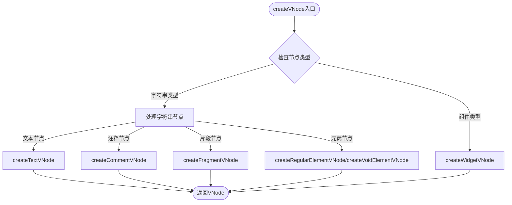
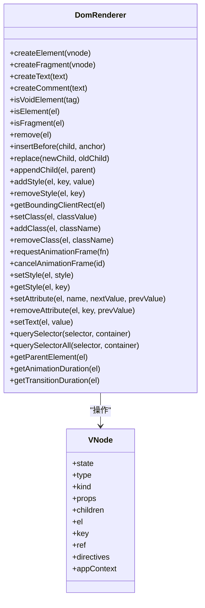
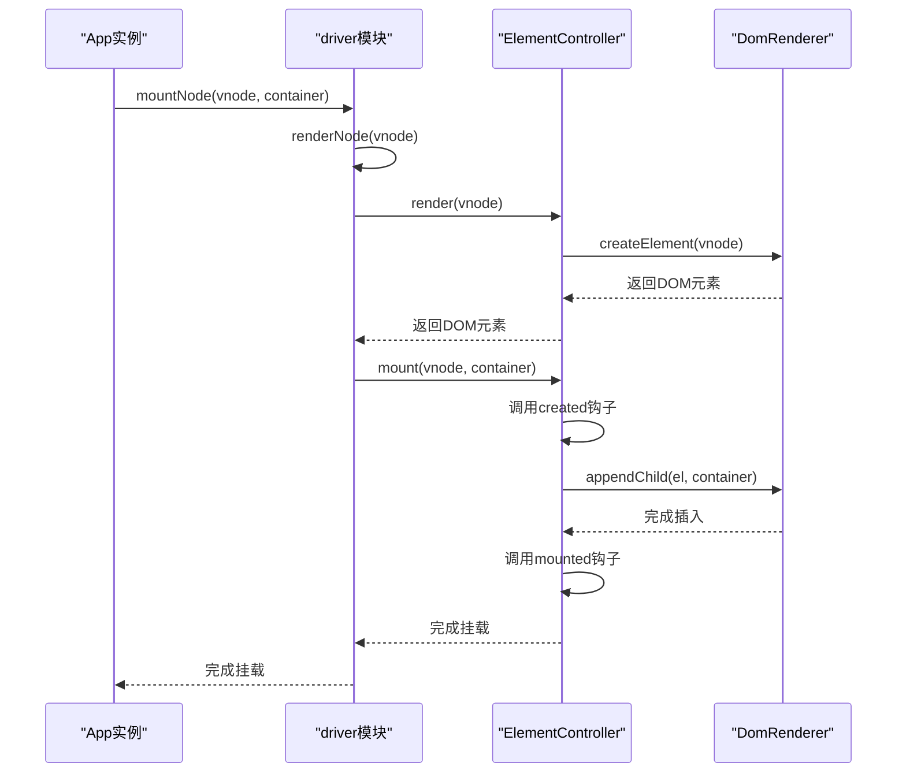
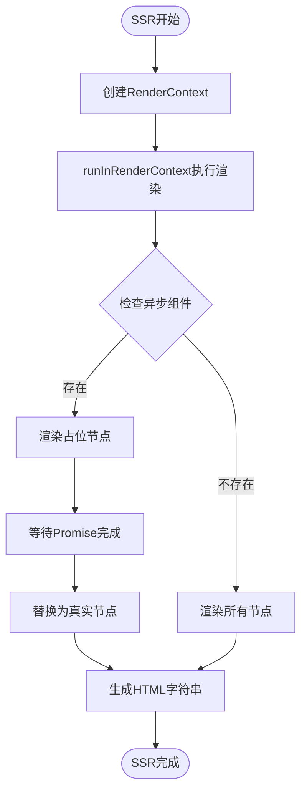

# 渲染API

<cite>
**本文档引用的文件**  
- [DomRenderer.ts](file://packages/runtime-dom/src/client/DomRenderer.ts)
- [factory.ts](file://packages/runtime-dom/src/client/factory.ts)
- [api.ts](file://packages/runtime-core/src/renderer/api.ts)
- [create.ts](file://packages/runtime-core/src/vnode/core/create.ts)
- [base.ts](file://packages/runtime-core/src/vnode/creator/base.ts)
- [element.ts](file://packages/runtime-core/src/vnode/creator/element.ts)
- [fragment.ts](file://packages/runtime-core/src/vnode/creator/fragment.ts)
- [widget.ts](file://packages/runtime-core/src/vnode/creator/widget.ts)
- [driver.ts](file://packages/runtime-core/src/vnode/core/driver.ts)
- [App.ts](file://packages/runtime-core/src/app/App.ts)
- [context.ts](file://packages/runtime-core/src/renderer/context.ts)
</cite>

## 目录
1. [渲染API概述](#渲染api概述)
2. [核心渲染函数](#核心渲染函数)
3. [虚拟DOM创建与映射](#虚拟dom创建与映射)
4. [节点挂载与更新机制](#节点挂载与更新机制)
5. [服务端渲染支持](#服务端渲染支持)
6. [性能优化建议](#性能优化建议)

## 渲染API概述

vitarx框架的渲染系统基于虚拟DOM（Virtual DOM）机制，通过高效的渲染器和节点控制器实现DOM操作。框架提供了`render`、`hydrate`、`createVNode`、`createElement`等核心API，用于创建和管理UI组件。渲染器通过`DomRenderer`类实现，负责将虚拟节点映射到真实DOM元素，并处理节点的挂载、更新和卸载。

**Section sources**
- [DomRenderer.ts](file://packages/runtime-dom/src/client/DomRenderer.ts#L62-L573)
- [App.ts](file://packages/runtime-core/src/app/App.ts#L107-L394)

## 核心渲染函数

vitarx框架提供了多个核心渲染函数，用于创建和管理虚拟节点。`createVNode`函数是创建虚拟节点的主要入口，支持创建元素节点、文本节点、片段节点和组件节点。`createElement`函数是`createVNode`的别名，用于创建HTML元素节点。`render`函数用于将虚拟节点渲染到指定的DOM容器中，而`hydrate`函数用于在服务端渲染后激活客户端的交互功能。

**Diagram sources**
- [create.ts](file://packages/runtime-core/src/vnode/core/create.ts#L90-L147)
- [element.ts](file://packages/runtime-core/src/vnode/creator/element.ts#L26-L69)
- [fragment.ts](file://packages/runtime-core/src/vnode/creator/fragment.ts#L15-L24)
- [widget.ts](file://packages/runtime-core/src/vnode/creator/widget.ts#L90-L174)

**Section sources**
- [create.ts](file://packages/runtime-core/src/vnode/core/create.ts#L90-L147)
- [base.ts](file://packages/runtime-core/src/vnode/creator/base.ts#L22-L118)

## 虚拟DOM创建与映射

虚拟DOM的创建通过`createVNode`函数实现，该函数根据节点类型调用相应的创建函数。对于HTML元素，使用`createRegularElementVNode`或`createVoidElementVNode`创建常规元素或空元素节点。对于组件，使用`createWidgetVNode`创建组件节点。虚拟节点通过`DomRenderer`类映射到真实DOM元素，`createElement`方法根据虚拟节点的类型创建相应的DOM元素。

**Diagram sources**
- [DomRenderer.ts](file://packages/runtime-dom/src/client/DomRenderer.ts#L62-L573)
- [base.ts](file://packages/runtime-core/src/vnode/creator/base.ts#L22-L118)

**Section sources**
- [DomRenderer.ts](file://packages/runtime-dom/src/client/DomRenderer.ts#L62-L573)
- [base.ts](file://packages/runtime-core/src/vnode/creator/base.ts#L22-L118)

## 节点挂载与更新机制

节点的挂载和更新通过`mountNode`和`updateNodeProps`函数实现。`mountNode`函数将虚拟节点挂载到指定的DOM容器中，首先调用`renderNode`创建DOM元素，然后调用控制器的`mount`方法将元素插入DOM。`updateNodeProps`函数更新节点的属性，比较新旧属性值，只更新发生变化的属性。`ElementController`类负责处理元素节点的属性更新，调用`setAttribute`和`removeAttribute`方法更新DOM属性。

**Diagram sources**
- [driver.ts](file://packages/runtime-core/src/vnode/core/driver.ts#L57-L65)
- [ElementController.ts](file://packages/runtime-core/src/controllers/ElementController.ts#L46-L104)
- [DomRenderer.ts](file://packages/runtime-dom/src/client/DomRenderer.ts#L64-L73)

**Section sources**
- [driver.ts](file://packages/runtime-core/src/vnode/core/driver.ts#L57-L65)
- [ElementController.ts](file://packages/runtime-core/src/controllers/ElementController.ts#L46-L104)

## 服务端渲染支持

vitarx框架通过`RenderContext`类支持服务端渲染（SSR）。`runInRenderContext`函数在指定的渲染上下文中执行函数，`useRenderContext`函数获取当前的渲染上下文。在服务端渲染时，应用会创建一个`RenderContext`实例，用于存储渲染过程中的数据。`Suspense`组件支持异步组件的渲染，在服务端渲染时会先渲染占位节点，待Promise完成后替换为真实节点。

**Diagram sources**
- [context.ts](file://packages/runtime-core/src/renderer/context.ts#L11-L57)
- [Suspense.ts](file://packages/runtime-core/src/widget/widgets/Suspense.ts#L147-L181)

**Section sources**
- [context.ts](file://packages/runtime-core/src/renderer/context.ts#L11-L57)
- [hook.ts](file://packages/runtime-core/src/runtime/hook.ts#L216-L229)

## 性能优化建议

为了优化vitarx框架的渲染性能，建议使用`key`属性标识列表中的节点，避免不必要的DOM操作。对于静态内容，可以使用`v-static`指令标记，避免重复渲染。合理使用`ref`引用，避免在每次渲染时创建新的函数引用。在服务端渲染时，尽量减少异步操作的数量，避免阻塞HTML生成。使用`Fragment`节点减少不必要的DOM层级，提高渲染效率。

**Section sources**
- [base.ts](file://packages/runtime-core/src/vnode/creator/base.ts#L63-L64)
- [children.ts](file://packages/runtime-core/src/vnode/normalizer/children.ts#L105-L149)