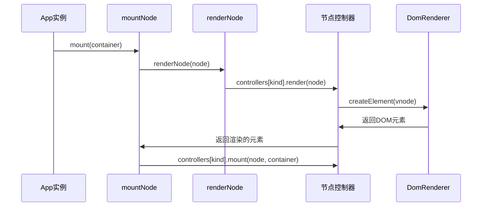
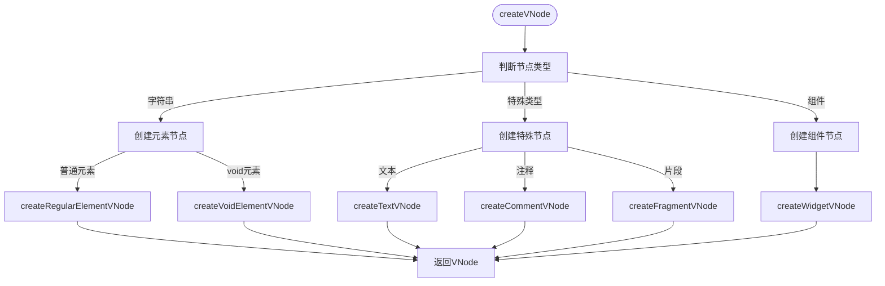
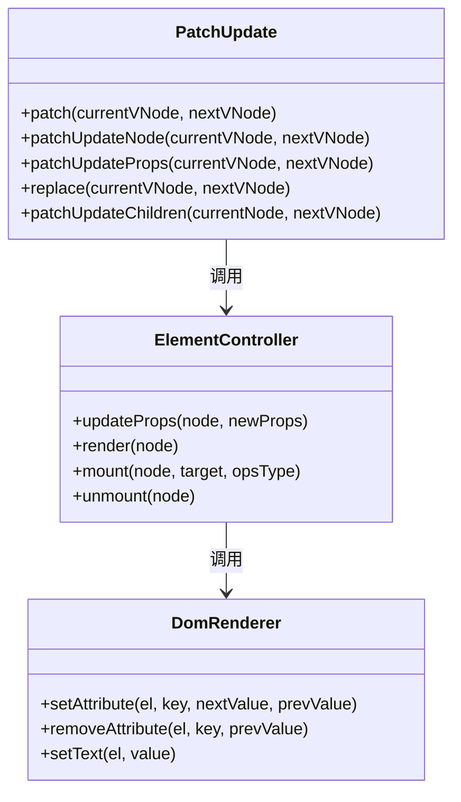
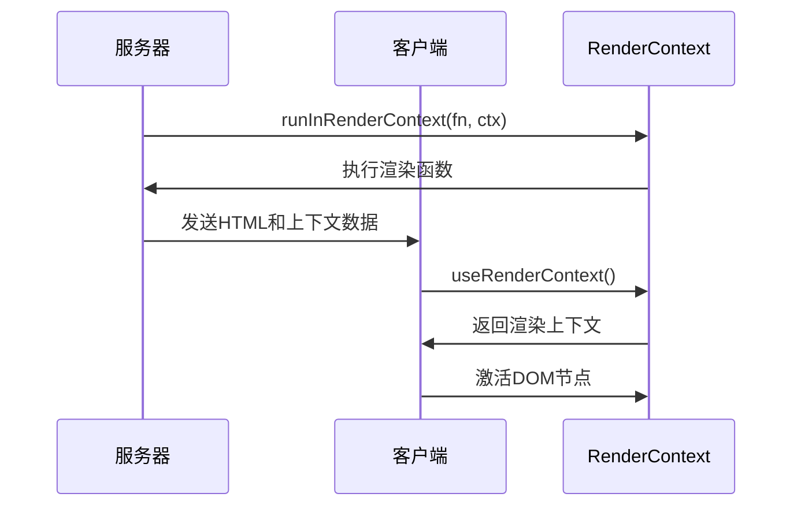
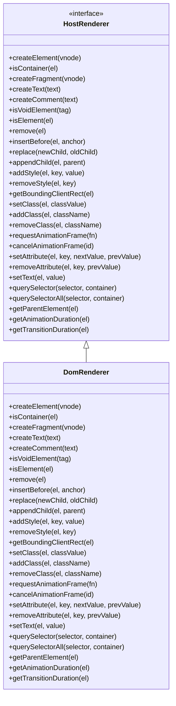

# 渲染API调度

<cite>
**本文档引用的文件**
- [App.ts](file://packages/runtime-core/src/app/App.ts)
- [api.ts](file://packages/runtime-core/src/renderer/api.ts)
- [DomRenderer.ts](file://packages/runtime-dom/src/client/DomRenderer.ts)
- [driver.ts](file://packages/runtime-core/src/vnode/core/driver.ts)
- [create.ts](file://packages/runtime-core/src/vnode/core/create.ts)
- [update.ts](file://packages/runtime-core/src/vnode/core/update.ts)
- [ElementController.ts](file://packages/runtime-core/src/controllers/ElementController.ts)
- [factory.ts](file://packages/runtime-dom/src/client/factory.ts)
</cite>

## 目录
1. [渲染API调度流程概述](#渲染api调度流程概述)
2. [应用实例化与挂载](#应用实例化与挂载)
3. [虚拟DOM树构建](#虚拟dom树构建)
4. [节点更新与属性同步](#节点更新与属性同步)
5. [服务端渲染与注水机制](#服务端渲染与注水机制)
6. [运行时核心与DomRenderer交互](#运行时核心与domrenderer交互)
7. [批量更新与异步渲染](#批量更新与异步渲染)
8. [关键调度决策点分析](#关键调度决策点分析)

## 渲染API调度流程概述

Vitarx框架的渲染API调度流程是一个复杂的系统，从应用实例调用mount开始，经过虚拟DOM树构建、节点更新，最终渲染到真实DOM。该流程通过render、hydrate等API协调运行时核心与DomRenderer之间的交互，实现了高效的UI更新机制。

**Section sources**
- [App.ts](file://packages/runtime-core/src/app/App.ts#L107-L394)
- [driver.ts](file://packages/runtime-core/src/vnode/core/driver.ts#L1-L124)

## 应用实例化与挂载

应用实例化是渲染流程的起点，通过`new App()`创建应用实例，接收根组件或根虚拟节点作为参数。在构造函数中，根据传入的根节点类型创建相应的虚拟节点，并初始化应用配置。

挂载过程通过`mount()`方法实现，该方法接收DOM容器作为参数。如果传入的是选择器字符串，则通过`querySelector`获取对应的DOM元素。挂载的核心是调用`mountNode()`函数，将虚拟节点树挂载到指定的容器中。



**Diagram sources**
- [App.ts](file://packages/runtime-core/src/app/App.ts#L187-L202)
- [driver.ts](file://packages/runtime-core/src/vnode/core/driver.ts#L57-L64)

**Section sources**
- [App.ts](file://packages/runtime-core/src/app/App.ts#L107-L202)
- [driver.ts](file://packages/runtime-core/src/vnode/core/driver.ts#L57-L64)

## 虚拟DOM树构建

虚拟DOM树的构建是通过`createVNode()`函数实现的，该函数是框架的核心API之一。它接收节点类型、属性和子节点作为参数，创建相应的虚拟节点。

虚拟节点的创建过程根据节点类型进行分支处理：
- 对于字符串类型，创建元素节点（包括普通元素和void元素）
- 对于特殊类型（如文本、注释、片段），创建相应的特殊节点
- 对于组件类型，创建组件节点



**Diagram sources**
- [create.ts](file://packages/runtime-core/src/vnode/core/create.ts#L90-L147)
- [create.ts](file://packages/runtime-core/src/vnode/creator/element.ts)
- [create.ts](file://packages/runtime-core/src/vnode/creator/special.ts)
- [create.ts](file://packages/runtime-core/src/vnode/creator/widget.ts)

**Section sources**
- [create.ts](file://packages/runtime-core/src/vnode/core/create.ts#L90-L147)

## 节点更新与属性同步

节点更新是渲染流程中的关键环节，通过`patchUpdate()`函数实现。该函数比较新旧虚拟节点，根据节点类型和key决定是更新还是替换节点。

属性同步通过`updateNodeProps()`函数实现，该函数根据节点类型调用相应的控制器更新属性。对于元素节点，会遍历新旧属性，删除不存在的属性，更新或添加新的属性。



**Diagram sources**
- [update.ts](file://packages/runtime-core/src/vnode/core/update.ts#L42-L390)
- [ElementController.ts](file://packages/runtime-core/src/controllers/ElementController.ts#L46-L104)
- [DomRenderer.ts](file://packages/runtime-dom/src/client/DomRenderer.ts#L258-L349)

**Section sources**
- [update.ts](file://packages/runtime-core/src/vnode/core/update.ts#L42-L390)
- [ElementController.ts](file://packages/runtime-core/src/controllers/ElementController.ts#L50-L71)

## 服务端渲染与注水机制

服务端渲染(SSR)支持通过`RenderContext`类实现，该类提供了在渲染上下文中执行函数的能力。`runInRenderContext()`函数用于在指定的渲染上下文中执行代码，这对于SSR场景下的数据收集和状态管理至关重要。

注水(hydration)机制通过`useRenderContext()`钩子函数实现，该函数获取当前的渲染上下文实例。在SSR场景下，服务器端渲染的HTML会被发送到客户端，然后通过注水机制将其"激活"为可交互的应用。



**Diagram sources**
- [context.ts](file://packages/runtime-core/src/renderer/context.ts#L1-L57)
- [Suspense.ts](file://packages/runtime-core/src/widget/widgets/Suspense.ts#L147-L181)

**Section sources**
- [context.ts](file://packages/runtime-core/src/renderer/context.ts#L1-L57)

## 运行时核心与DomRenderer交互

运行时核心与DomRenderer之间的交互是通过`HostRenderer`接口定义的。`DomRenderer`类实现了这个接口，提供了创建和操作DOM元素的具体实现。

`setRenderer()`函数用于设置平台渲染适配器，将`DomRenderer`实例注册为全局渲染器。`getRenderer()`函数用于获取已注册的渲染器实例，如果尚未注册则会抛出错误。



**Diagram sources**
- [api.ts](file://packages/runtime-core/src/renderer/api.ts#L1-L28)
- [DomRenderer.ts](file://packages/runtime-dom/src/client/DomRenderer.ts#L62-L573)
- [renderer.ts](file://packages/runtime-core/src/types/renderer.ts#L80-L280)

**Section sources**
- [api.ts](file://packages/runtime-core/src/renderer/api.ts#L1-L28)
- [DomRenderer.ts](file://packages/runtime-dom/src/client/DomRenderer.ts#L62-L573)

## 批量更新与异步渲染

批量更新和异步渲染是通过调度器(Scheduler)实现的。当`enableScheduler`为true时，更新操作会被异步批量处理，提高性能。当为false时，更新操作会同步执行。

`queueJob()`函数用于将更新任务加入调度队列，确保多次调用`update()`方法会被合并为一次更新，避免不必要的重复渲染。

```mermaid
flowchart TD
Start([update()调用]) --> CheckScheduler["检查enableScheduler"]
CheckScheduler --> |true| QueueJob["queueJob()加入队列"]
CheckScheduler --> |false| DirectUpdate["直接执行更新"]
QueueJob --> CheckPending["检查hasPendingUpdate"]
CheckPending --> |true| Skip["跳过，已存在待处理更新"]
CheckPending --> |false| MarkPending["标记hasPendingUpdate=true"]
MarkPending --> AddToQueue["加入调度队列"]
AddToQueue --> FlushScheduler["flushScheduler()"]
FlushScheduler --> ExecuteJobs["执行队列中的任务"]
ExecuteJobs --> ResetPending["重置hasPendingUpdate=false"]
ResetPending --> Complete["更新完成"]
DirectUpdate --> ExecuteBuild["执行build()"]
ExecuteBuild --> Complete
```

**Diagram sources**
- [Stateful.test.ts](file://packages/runtime-core/__tests__/widget/runtime/Stateful.test.ts#L285-L326)
- [FnWidget.ts](file://packages/runtime-core/src/widget/base/FnWidget.ts#L74-L121)

**Section sources**
- [Stateful.test.ts](file://packages/runtime-core/__tests__/widget/runtime/Stateful.test.ts#L285-L326)

## 关键调度决策点分析

渲染流程中的关键调度决策点包括：

1. **节点类型判断**：在`createVNode()`中根据类型参数决定创建何种虚拟节点
2. **更新策略选择**：在`patchUpdate()`中根据节点类型和key决定是更新还是替换
3. **属性更新优化**：在`updateProps()`中只更新变化的属性，避免不必要的DOM操作
4. **子节点diff算法**：在`patchUpdateChildren()`中使用key匹配和最长递增子序列优化节点移动
5. **批量更新控制**：通过`hasPendingUpdate`标志确保多次更新调用被合并

这些决策点共同构成了高效的渲染调度系统，确保了UI更新的性能和正确性。

**Section sources**
- [create.ts](file://packages/runtime-core/src/vnode/core/create.ts#L90-L147)
- [update.ts](file://packages/runtime-core/src/vnode/core/update.ts#L42-L390)
- [ElementController.ts](file://packages/runtime-core/src/controllers/ElementController.ts#L50-L71)
- [driver.ts](file://packages/runtime-core/src/vnode/core/driver.ts#L118-L124)