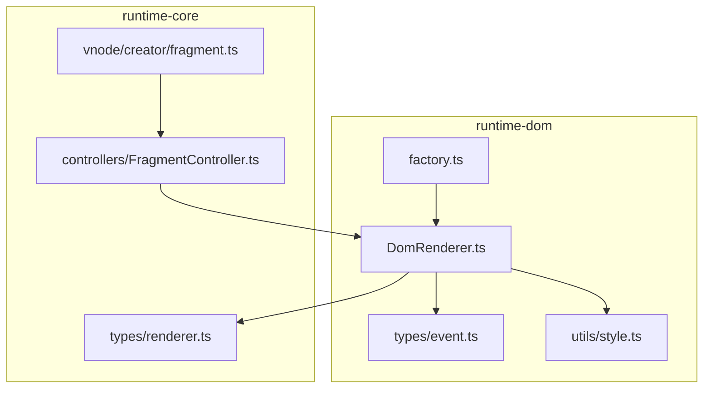
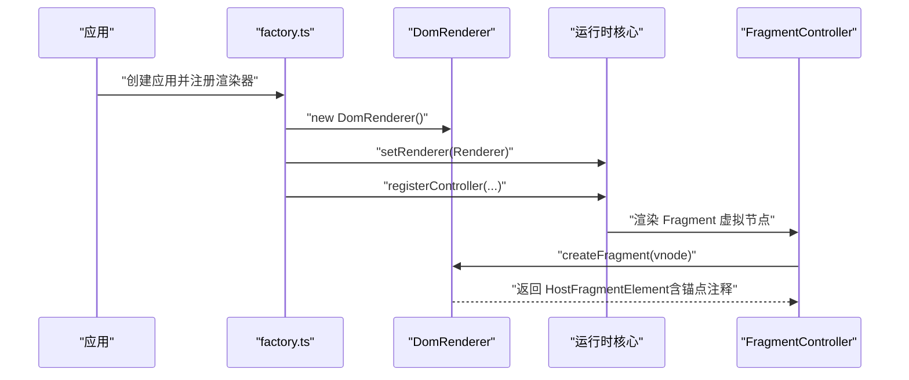
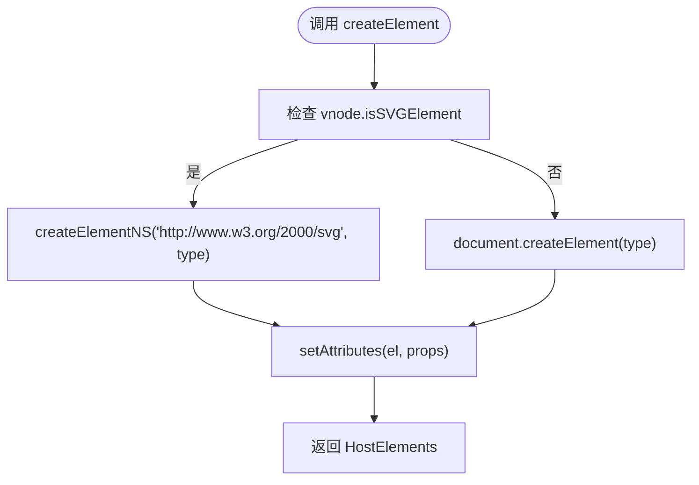
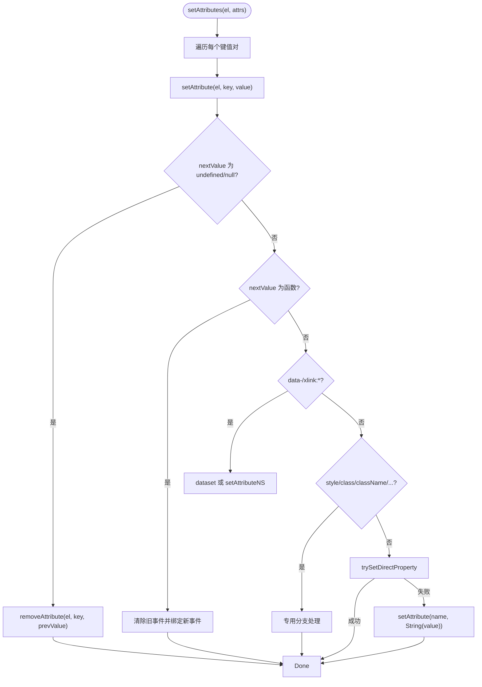
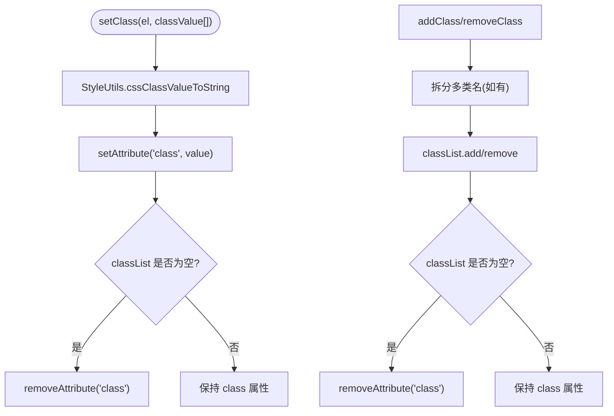
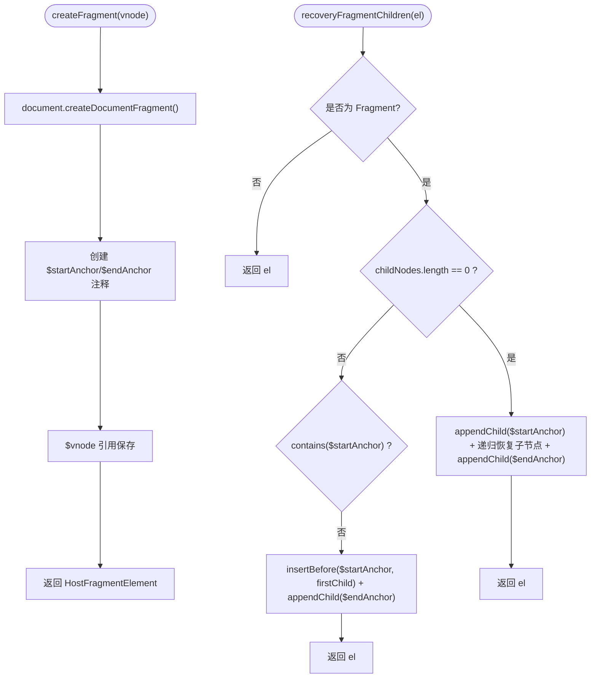
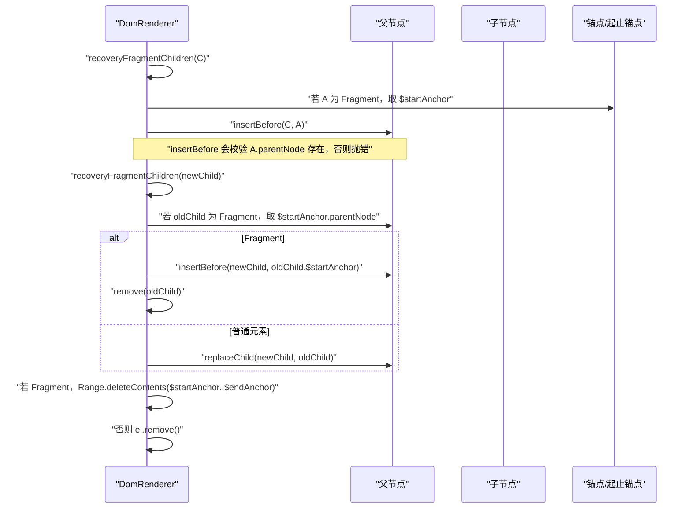
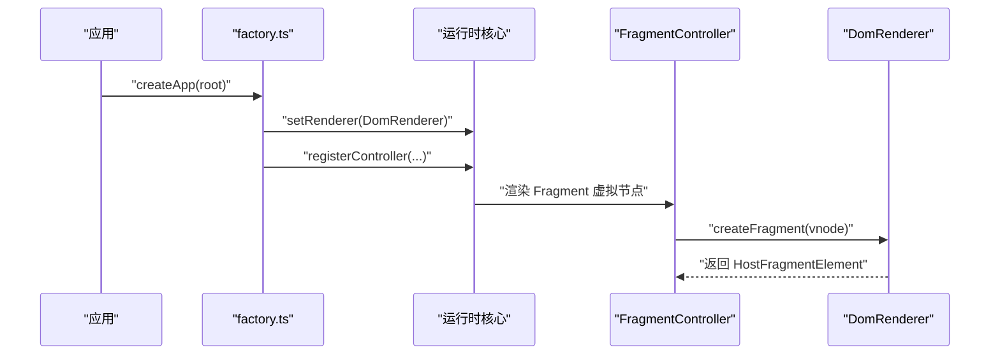
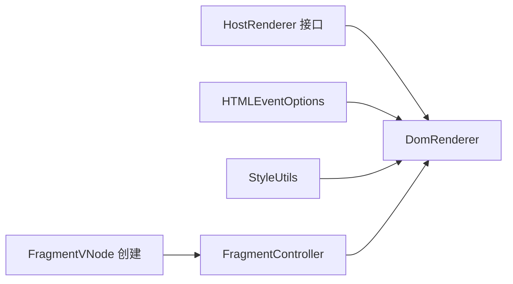

# 渲染器实现

<cite>
**本文引用的文件**
- [DomRenderer.ts](file://packages/runtime-dom/src/client/DomRenderer.ts)
- [factory.ts](file://packages/runtime-dom/src/client/factory.ts)
- [renderer.ts](file://packages/runtime-core/src/types/renderer.ts)
- [event.ts](file://packages/runtime-dom/src/types/event.ts)
- [style.ts](file://packages/runtime-core/src/utils/style.ts)
- [FragmentController.ts](file://packages/runtime-core/src/controllers/FragmentController.ts)
- [DomRenderer.test.ts](file://packages/runtime-dom/__tests__/client/DomRenderer.test.ts)
- [fragment.ts](file://packages/runtime-core/src/vnode/creator/fragment.ts)
</cite>

## 目录
1. [引言](#引言)
2. [项目结构](#项目结构)
3. [核心组件](#核心组件)
4. [架构总览](#架构总览)
5. [详细组件分析](#详细组件分析)
6. [依赖关系分析](#依赖关系分析)
7. [性能考量](#性能考量)
8. [故障排查指南](#故障排查指南)
9. [结论](#结论)
10. [附录](#附录)

## 引言
本文围绕 DomRenderer 类的实现机制进行深入解析，系统阐述其作为 HostRenderer 接口的具体实现，重点覆盖 createElement、setAttributes、insert、remove 等核心 DOM 操作方法；解释 SVG 元素支持、事件监听器的绑定与解绑、CSS 类与样式的处理策略；说明 Fragment 节点的特殊处理机制与其子节点维护方式；并总结渲染器的错误处理机制与性能优化措施（如 DEFAULT_PROPERTIES_CACHE 的应用）。同时给出与运行时核心的交互契约说明，帮助读者理解虚拟 DOM 节点如何映射到真实 DOM 操作。

## 项目结构
DomRenderer 位于 runtime-dom 包中，负责浏览器环境下的 DOM 操作与渲染；其通过工厂函数在应用初始化时注册到运行时核心，成为运行时渲染管线中的具体实现。



图表来源
- [DomRenderer.ts](file://packages/runtime-dom/src/client/DomRenderer.ts#L1-L120)
- [factory.ts](file://packages/runtime-dom/src/client/factory.ts#L1-L39)
- [renderer.ts](file://packages/runtime-core/src/types/renderer.ts#L80-L278)
- [event.ts](file://packages/runtime-dom/src/types/event.ts#L520-L562)
- [style.ts](file://packages/runtime-core/src/utils/style.ts#L1-L173)
- [FragmentController.ts](file://packages/runtime-core/src/controllers/FragmentController.ts#L1-L42)
- [fragment.ts](file://packages/runtime-core/src/vnode/creator/fragment.ts#L1-L23)

章节来源
- [factory.ts](file://packages/runtime-dom/src/client/factory.ts#L1-L39)

## 核心组件
- DomRenderer：实现 HostRenderer 接口，提供浏览器环境下的 DOM 操作能力，包括元素创建、属性设置、事件绑定、样式管理、Fragment 子节点恢复、动画帧调度等。
- HostRenderer 接口：定义了渲染器需要实现的一组统一方法，涵盖元素创建、容器判断、Fragment 管理、文本/注释节点、属性/样式/类管理、查询与布局、动画帧、事件绑定等。
- 事件与样式工具：HTMLEventOptions 定义事件监听器配置；StyleUtils 提供 CSS 类与样式的转换与合并工具。
- Fragment 控制器：FragmentController 通过 useRenderer() 获取 DomRenderer 实例，负责 Fragment 的元素创建与属性更新（Fragment 不做属性更新）。

章节来源
- [renderer.ts](file://packages/runtime-core/src/types/renderer.ts#L80-L278)
- [DomRenderer.ts](file://packages/runtime-dom/src/client/DomRenderer.ts#L62-L120)
- [event.ts](file://packages/runtime-dom/src/types/event.ts#L520-L562)
- [style.ts](file://packages/runtime-core/src/utils/style.ts#L1-L173)
- [FragmentController.ts](file://packages/runtime-core/src/controllers/FragmentController.ts#L1-L42)

## 架构总览
DomRenderer 作为 HostRenderer 的浏览器实现，贯穿以下关键流程：
- 应用启动时，通过 factory.ts 注册 DomRenderer 实例并注册各类控制器。
- 运行时核心通过 useRenderer() 获取渲染器实例，驱动虚拟节点到真实 DOM 的映射。
- 对于 Fragment，运行时核心通过 FragmentController 调用渲染器的 createFragment，DomRenderer 为其附加锚点注释与 vnode 引用，便于后续子节点恢复与范围删除。



图表来源
- [factory.ts](file://packages/runtime-dom/src/client/factory.ts#L1-L39)
- [DomRenderer.ts](file://packages/runtime-dom/src/client/DomRenderer.ts#L88-L104)
- [FragmentController.ts](file://packages/runtime-core/src/controllers/FragmentController.ts#L28-L41)

## 详细组件分析

### DomRenderer 类实现概览
- 实现 HostRenderer 接口，提供浏览器 DOM 操作的统一入口。
- 关键职责：
  - 元素创建：支持 HTML 与 SVG 元素，按 isSVGElement 选择 createElement 或 createElementNS。
  - Fragment 管理：创建文档片段并附加“开始/结束”注释锚点，记录 $vnode 以便恢复子节点。
  - DOM 插入/替换/删除：兼容 Fragment 的锚点语义，保证插入与删除的正确性。
  - 属性与事件：智能处理 data-*、xlink:*、xmlns:xlink、style/class 等；事件名解析与修饰符（capture/once/passive）。
  - 样式与类：通过 StyleUtils 转换样式对象与类名数组；支持 add/remove/setStyle 与 add/remove/setClass。
  - 查询与布局：querySelector/querySelectorAll/getParentElement/getBoundingClientRect。
  - 动画帧：requestAnimationFrame/cancelAnimationFrame。
  - 性能优化：DEFAULT_PROPERTIES_CACHE 缓存元素属性默认值，避免重复探测。

章节来源
- [DomRenderer.ts](file://packages/runtime-dom/src/client/DomRenderer.ts#L62-L120)
- [DomRenderer.ts](file://packages/runtime-dom/src/client/DomRenderer.ts#L121-L182)
- [DomRenderer.ts](file://packages/runtime-dom/src/client/DomRenderer.ts#L183-L251)
- [DomRenderer.ts](file://packages/runtime-dom/src/client/DomRenderer.ts#L252-L350)
- [DomRenderer.ts](file://packages/runtime-dom/src/client/DomRenderer.ts#L351-L416)
- [DomRenderer.ts](file://packages/runtime-dom/src/client/DomRenderer.ts#L417-L571)

### createElement 与 SVG 支持
- createElement 根据 vnode 的 isSVGElement 字段决定使用 createElement 或 createElementNS。
- 创建元素后，调用 setAttributes 批量设置属性，确保初始状态一致。
- 测试覆盖了 HTML 与 SVG 元素的创建，以及命名空间属性的设置。



图表来源
- [DomRenderer.ts](file://packages/runtime-dom/src/client/DomRenderer.ts#L64-L74)
- [DomRenderer.ts](file://packages/runtime-dom/src/client/DomRenderer.ts#L423-L429)
- [DomRenderer.test.ts](file://packages/runtime-dom/__tests__/client/DomRenderer.test.ts#L18-L45)

章节来源
- [DomRenderer.ts](file://packages/runtime-dom/src/client/DomRenderer.ts#L64-L74)
- [DomRenderer.test.ts](file://packages/runtime-dom/__tests__/client/DomRenderer.test.ts#L30-L45)

### setAttributes 与属性处理策略
- setAttributes 遍历属性键值对，逐个调用 setAttribute。
- setAttribute 的处理分支：
  - undefined/null：委托 removeAttribute。
  - 函数值：视为事件处理器，先清理旧事件，再绑定新事件。
  - data-*：写入 dataset。
  - xlink:*：使用命名空间 setAttributeNS。
  - 特殊属性：style/class/className/classname/v-html/autoFocus/xmlns:xlink 等走专用分支。
  - 直接属性尝试：trySetDirectProperty 优先尝试直接赋值，失败回退 setAttribute。
  - 异常兜底：catch 住错误并打印日志，避免中断渲染流程。
- removeAttribute：
  - class/style 特判移除。
  - 事件属性 prevValue 为函数时，调用 removeEventListener。
  - 若 key 在元素上存在 JS property，尝试还原默认值；只读属性（如 innerHTML）回退 removeAttribute。
  - 否则直接 removeAttribute。



图表来源
- [DomRenderer.ts](file://packages/runtime-dom/src/client/DomRenderer.ts#L423-L429)
- [DomRenderer.ts](file://packages/runtime-dom/src/client/DomRenderer.ts#L258-L317)
- [DomRenderer.ts](file://packages/runtime-dom/src/client/DomRenderer.ts#L318-L350)

章节来源
- [DomRenderer.ts](file://packages/runtime-dom/src/client/DomRenderer.ts#L258-L350)
- [DomRenderer.test.ts](file://packages/runtime-dom/__tests__/client/DomRenderer.test.ts#L216-L260)

### 事件监听器的绑定与解绑
- 事件名解析：extractEventOptions 将 onClickCaptureOnce 等转换为标准事件名与选项对象（capture/once/passive）。
- addEventListener/removeEventListener：基于解析结果调用 addEventListener/removeEventListener，支持捕获阶段、一次性与被动模式。
- setAttribute 对函数值的处理：若 prevValue 也为函数，先 removeEventListener，再 addEventListener，确保事件替换正确。
- 测试覆盖了基本事件名、捕获、一次性与被动修饰符，以及事件替换场景。

```mermaid
sequenceDiagram
    participant R as "DomRenderer"
    participant EL as "元素"
    participant OPT as "HTMLEventOptions"
    R->>R: "extractEventOptions(name)"
    R->>OPT: "解析 capture/once/passive"
    R->>EL: "addEventListener(event, handler, options)"
    Note over R,EL: "替换事件时，先 removeEventListener(prev)"
    R->>EL: "removeEventListener(event, prev, useCapture)"
    R->>EL: "addEventListener(event, handler, options)"
```

图表来源
- [DomRenderer.ts](file://packages/runtime-dom/src/client/DomRenderer.ts#L492-L501)
- [DomRenderer.ts](file://packages/runtime-dom/src/client/DomRenderer.ts#L466-L475)
- [DomRenderer.ts](file://packages/runtime-dom/src/client/DomRenderer.ts#L526-L543)
- [event.ts](file://packages/runtime-dom/src/types/event.ts#L520-L562)

章节来源
- [DomRenderer.ts](file://packages/runtime-dom/src/client/DomRenderer.ts#L466-L501)
- [DomRenderer.test.ts](file://packages/runtime-dom/__tests__/client/DomRenderer.test.ts#L380-L443)

### CSS 类与样式的处理策略
- setClass：通过 StyleUtils.cssClassValueToString 合并类名，再通过 setAttribute('class', ...) 设置；当类名为空时移除 class 属性。
- addClass/removeClass：支持空格分隔的多类名，内部拆分为数组逐个调用 classList.add/remove。
- setStyle/getStyle：通过 StyleUtils.cssStyleValueToString 将样式对象转换为 cssText，再设置到 style；getStyle 使用 getPropertyValue。
- addStyle/removeStyle：分别设置/移除单个样式属性；removeStyle 成功后若 style 为空则移除 style 属性。



图表来源
- [DomRenderer.ts](file://packages/runtime-dom/src/client/DomRenderer.ts#L201-L231)
- [DomRenderer.ts](file://packages/runtime-dom/src/client/DomRenderer.ts#L243-L251)
- [style.ts](file://packages/runtime-core/src/utils/style.ts#L112-L173)

章节来源
- [DomRenderer.ts](file://packages/runtime-dom/src/client/DomRenderer.ts#L201-L251)
- [style.ts](file://packages/runtime-core/src/utils/style.ts#L112-L173)
- [DomRenderer.test.ts](file://packages/runtime-dom/__tests__/client/DomRenderer.test.ts#L314-L378)

### Fragment 节点的特殊处理机制
- DomRenderer.createFragment：创建文档片段并附加 $startAnchor/$endAnchor 注释锚点，保存 $vnode 引用，便于后续子节点恢复与范围删除。
- recoveryFragmentChildren：当 Fragment 子节点为空或缺少锚点时，根据 $vnode.children 递归恢复子节点，并重新插入锚点，确保 Fragment 的子树在 DOM 中正确呈现。
- appendChild/insertBefore/replace：在插入/替换前调用 recoveryFragmentChildren，保证 Fragment 的子节点在插入时处于就绪状态；remove 对 Fragment 使用 Range 删除锚点范围内的内容。



图表来源
- [DomRenderer.ts](file://packages/runtime-dom/src/client/DomRenderer.ts#L88-L104)
- [DomRenderer.ts](file://packages/runtime-dom/src/client/DomRenderer.ts#L399-L416)
- [DomRenderer.ts](file://packages/runtime-dom/src/client/DomRenderer.ts#L170-L182)
- [DomRenderer.ts](file://packages/runtime-dom/src/client/DomRenderer.ts#L131-L147)
- [DomRenderer.ts](file://packages/runtime-dom/src/client/DomRenderer.ts#L148-L168)

章节来源
- [DomRenderer.ts](file://packages/runtime-dom/src/client/DomRenderer.ts#L88-L104)
- [DomRenderer.ts](file://packages/runtime-dom/src/client/DomRenderer.ts#L399-L416)
- [DomRenderer.ts](file://packages/runtime-dom/src/client/DomRenderer.ts#L131-L168)
- [DomRenderer.test.ts](file://packages/runtime-dom/__tests__/client/DomRenderer.test.ts#L54-L65)

### DOM 插入、替换与删除
- insertBefore：兼容 Fragment，先恢复 Fragment 子节点；若锚点为 Fragment，则使用其 $startAnchor 作为插入锚点；校验锚点父节点存在，否则抛错。
- replace：兼容 Fragment，使用 oldChild.$startAnchor.parentNode 作为父节点；若为 Fragment，先在 $startAnchor 前插入新子节点，再删除旧 Fragment。
- remove：若为 Fragment，使用 Range 删除从 $startAnchor 到 $endAnchor 的内容；否则直接 remove。



图表来源
- [DomRenderer.ts](file://packages/runtime-dom/src/client/DomRenderer.ts#L131-L168)
- [DomRenderer.ts](file://packages/runtime-dom/src/client/DomRenderer.ts#L121-L130)

章节来源
- [DomRenderer.ts](file://packages/runtime-dom/src/client/DomRenderer.ts#L121-L168)
- [DomRenderer.test.ts](file://packages/runtime-dom/__tests__/client/DomRenderer.test.ts#L136-L214)

### 与运行时核心的交互契约
- 工厂函数在应用初始化时调用 setRenderer(new DomRenderer())，并将各类控制器注册到运行时核心。
- FragmentController 通过 useRenderer() 获取渲染器实例，调用 createFragment 创建 Fragment 元素；updateProps 被重写为不执行任何操作（Fragment 不需要属性更新）。
- 虚拟节点创建与 Fragment 的子节点规范化由运行时核心负责，DomRenderer 专注于底层 DOM 操作。



图表来源
- [factory.ts](file://packages/runtime-dom/src/client/factory.ts#L1-L39)
- [FragmentController.ts](file://packages/runtime-core/src/controllers/FragmentController.ts#L28-L41)

章节来源
- [factory.ts](file://packages/runtime-dom/src/client/factory.ts#L1-L39)
- [FragmentController.ts](file://packages/runtime-core/src/controllers/FragmentController.ts#L28-L41)

## 依赖关系分析
- DomRenderer 依赖 HostRenderer 接口定义的统一方法集，确保运行时核心与渲染器实现解耦。
- 事件系统依赖 HTMLEventOptions 定义的事件监听器配置项，支持捕获、一次性与被动模式。
- 样式系统依赖 StyleUtils，提供类名与样式的双向转换。
- Fragment 控制器依赖 DomRenderer 的 createFragment，实现 Fragment 的生命周期管理。



图表来源
- [renderer.ts](file://packages/runtime-core/src/types/renderer.ts#L80-L278)
- [DomRenderer.ts](file://packages/runtime-dom/src/client/DomRenderer.ts#L492-L501)
- [style.ts](file://packages/runtime-core/src/utils/style.ts#L1-L173)
- [FragmentController.ts](file://packages/runtime-core/src/controllers/FragmentController.ts#L28-L41)
- [fragment.ts](file://packages/runtime-core/src/vnode/creator/fragment.ts#L1-L23)

章节来源
- [renderer.ts](file://packages/runtime-core/src/types/renderer.ts#L80-L278)
- [DomRenderer.ts](file://packages/runtime-dom/src/client/DomRenderer.ts#L492-L501)
- [style.ts](file://packages/runtime-core/src/utils/style.ts#L1-L173)
- [FragmentController.ts](file://packages/runtime-core/src/controllers/FragmentController.ts#L28-L41)
- [fragment.ts](file://packages/runtime-core/src/vnode/creator/fragment.ts#L1-L23)

## 性能考量
- DEFAULT_PROPERTIES_CACHE：在 getDefaultValue 中缓存元素属性默认值，避免每次 removeAttribute 时反复创建元素探测默认值，降低开销。
- 样式与类的批量设置：setStyle 通过 cssText 一次性设置，减少多次 style 属性访问；addClass/removeClass 使用 classList，避免频繁 DOM 访问。
- 事件替换的最小化变更：setAttribute 对函数值的事件替换先移除旧事件再绑定新事件，避免重复绑定导致的内存泄漏与性能问题。
- Fragment 子节点恢复：recoveryFragmentChildren 在需要时才恢复子节点，避免不必要的 DOM 操作。

章节来源
- [DomRenderer.ts](file://packages/runtime-dom/src/client/DomRenderer.ts#L544-L571)
- [DomRenderer.ts](file://packages/runtime-dom/src/client/DomRenderer.ts#L243-L251)
- [DomRenderer.ts](file://packages/runtime-dom/src/client/DomRenderer.ts#L210-L231)

## 故障排查指南
- 无父节点错误：
  - insertBefore：当锚点元素无父节点时抛错，需确保插入前锚点已挂载到父节点。
  - replace：当旧元素无父节点时抛错，需确保被替换元素已挂载。
- 属性设置异常：
  - setAttribute 对异常进行 try/catch 并输出错误日志，避免中断渲染；对于只读属性（如 innerHTML），回退 removeAttribute。
- 事件替换：
  - 若 prevValue 与 nextValue 相同，跳过事件绑定；若 prevValue 为函数，先移除旧事件再绑定新事件。
- Fragment 删除：
  - 使用 Range 删除从 $startAnchor 到 $endAnchor 的范围内容，确保 Fragment 子树整体移除。

章节来源
- [DomRenderer.ts](file://packages/runtime-dom/src/client/DomRenderer.ts#L139-L146)
- [DomRenderer.ts](file://packages/runtime-dom/src/client/DomRenderer.ts#L152-L167)
- [DomRenderer.ts](file://packages/runtime-dom/src/client/DomRenderer.ts#L308-L317)
- [DomRenderer.test.ts](file://packages/runtime-dom/__tests__/client/DomRenderer.test.ts#L532-L563)

## 结论
DomRenderer 通过实现 HostRenderer 接口，提供了浏览器环境下统一、健壮且高性能的 DOM 操作能力。其对 SVG 元素、事件系统、样式与类、Fragment 子节点恢复等关键特性的处理，体现了良好的工程实践与可扩展性。配合运行时核心的控制器体系与虚拟节点规范化流程，DomRenderer 成为连接虚拟 DOM 与真实 DOM 的桥梁，既满足开发易用性，也兼顾性能与稳定性。

## 附录
- 与运行时核心的交互契约：
  - 工厂函数负责注册渲染器与控制器，FragmentController 通过 useRenderer() 获取 DomRenderer 实例，完成 Fragment 的创建与生命周期管理。
  - 虚拟节点的 SVG 命名空间传播由运行时核心处理，DomRenderer 仅负责按 isSVGElement 选择正确的创建 API。

章节来源
- [factory.ts](file://packages/runtime-dom/src/client/factory.ts#L1-L39)
- [FragmentController.ts](file://packages/runtime-core/src/controllers/FragmentController.ts#L28-L41)
- [fragment.ts](file://packages/runtime-core/src/vnode/creator/fragment.ts#L1-L23)