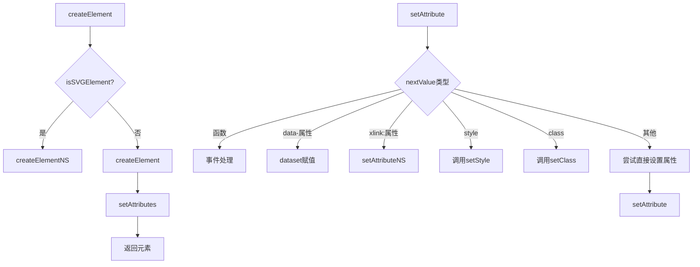
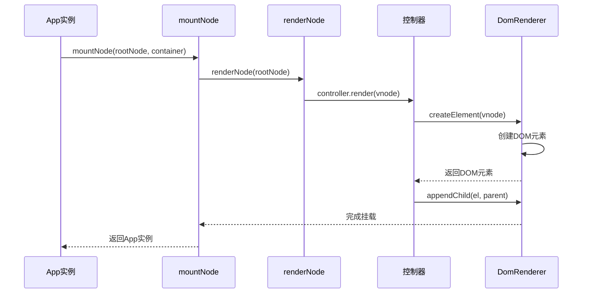
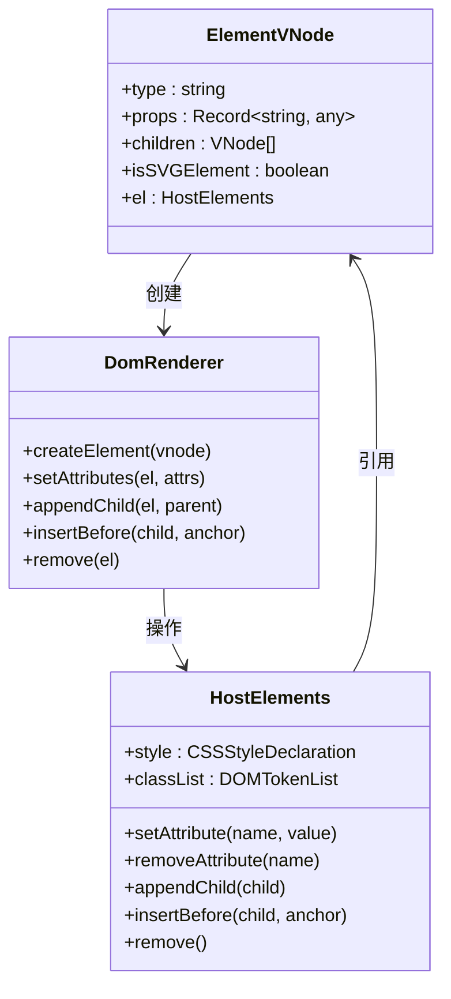
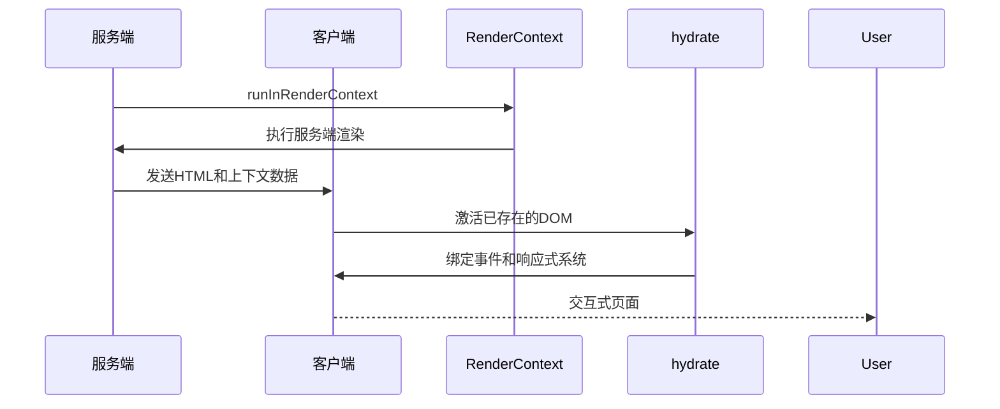
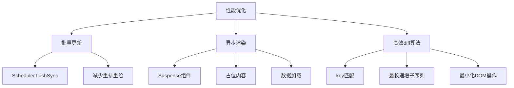

# 渲染控制

<cite>
**本文档引用的文件**  
- [DomRenderer.ts](file://packages/runtime-dom/src/client/DomRenderer.ts)
- [factory.ts](file://packages/runtime-dom/src/client/factory.ts)
- [renderer.ts](file://packages/runtime-core/src/types/renderer.ts)
- [api.ts](file://packages/runtime-core/src/renderer/api.ts)
- [App.ts](file://packages/runtime-core/src/app/App.ts)
- [ElementController.ts](file://packages/runtime-core/src/controllers/ElementController.ts)
- [update.ts](file://packages/runtime-core/src/vnode/core/update.ts)
- [context.ts](file://packages/runtime-core/src/renderer/context.ts)
</cite>

## 目录
1. [引言](#引言)
2. [渲染器接口契约](#渲染器接口契约)
3. [DomRenderer实现原理](#domrenderer实现原理)
4. [渲染API工作流程](#渲染api工作流程)
5. [虚拟DOM到真实DOM的映射](#虚拟dom到真实dom的映射)
6. [服务端渲染支持](#服务端渲染支持)
7. [渲染性能优化](#渲染性能优化)
8. [结论](#结论)

## 引言

vitarx框架的渲染控制机制是其核心功能之一，负责将虚拟DOM树高效地映射到真实的DOM操作。本文档将深入解析DomRenderer类的实现原理，详细说明render、hydrate等渲染API的工作流程，以及挂载、更新和卸载操作的实现细节。通过分析框架的渲染器接口契约及其实现，我们将全面理解vitarx如何处理SVG元素、事件监听器、CSS类和样式等关键渲染任务。

**Section sources**
- [DomRenderer.ts](file://packages/runtime-dom/src/client/DomRenderer.ts#L1-L573)
- [App.ts](file://packages/runtime-core/src/app/App.ts#L1-L394)

## 渲染器接口契约

vitarx框架通过HostRenderer接口定义了渲染器的契约，该接口规定了所有渲染操作的基本方法。这个接口是平台无关的，允许框架在不同环境中实现不同的渲染器，如浏览器环境的DomRenderer和可能的原生环境渲染器。

```mermaid
classDiagram
class HostRenderer {
<<interface>>
+createElement(vnode) HostElements
+isContainer(el) boolean
+createFragment(vnode) HostFragmentElement
+createText(text) HostTextElement
+createComment(text) HostCommentElement
+isVoidElement(tag) boolean
+isElement(el) boolean
+isFragment(el) boolean
+remove(el) void
+insertBefore(child, anchor) void
+replace(newChild, oldChild) void
+appendChild(el, parent) void
+addStyle(el, key, value) void
+removeStyle(el, key) void
+getBoundingClientRect(el) DOMRect
+setClass(el, classValue) void
+addClass(el, className) void
+removeClass(el, className) void
+requestAnimationFrame(fn) number
+cancelAnimationFrame(id) void
+setAttribute(el, key, nextValue, prevValue) void
+removeAttribute(el, key, prevValue) void
+setText(el, value) void
+querySelector(selector, container) HostElements
+querySelectorAll(selector, container) Iterable~HostElements~
+getParentElement(el) HostParentElement
+getAnimationDuration(el) number
+getTransitionDuration(el) number
}
class DomRenderer {
-VOID_ELEMENTS Set~string~
-XMLNS_NAMESPACE string
-XLINK_NAMESPACE string
-DEFAULT_PROPERTIES_CACHE Map~string, Record~string, any~~
+createElement(vnode) HostElements
+isContainer(el) boolean
+createFragment(vnode) HostFragmentElement
+createText(text) HostTextElement
+createComment(text) HostCommentElement
+isVoidElement(tag) boolean
+isElement(el) boolean
+isFragment(el) boolean
+remove(el) void
+insertBefore(child, anchor) void
+replace(newChild, oldChild) void
+appendChild(el, parent) void
+addStyle(el, key, value) void
+removeStyle(el, key) void
+getBoundingClientRect(el) DOMRect
+setClass(el, classValue) void
+addClass(el, className) void
+removeClass(el, className) void
+requestAnimationFrame(fn) number
+cancelAnimationFrame(id) void
+setAttribute(el, key, nextValue, prevValue) void
+removeAttribute(el, key, prevValue) void
+setText(el, value) void
+querySelector(selector, container) HostElements
+querySelectorAll(selector, container) Iterable~HostElements~
+getParentElement(el) HostParentElement
+getAnimationDuration(el) number
+getTransitionDuration(el) number
-recoveryFragmentChildren(el) T
-setAttributes(el, attrs) void
-trySetDirectProperty(el, name, value) boolean
-removeEventListener(el, name, handler, useCapture) void
-addEventListener(el, name, handler, options) void
-parseTime(time) number
-extractEventOptions(name) {event, options}
-getDefaultValue(tag, prop) any
}
DomRenderer ..|> HostRenderer : 实现
```

**Diagram sources**
- [renderer.ts](file://packages/runtime-core/src/types/renderer.ts#L76-L280)
- [DomRenderer.ts](file://packages/runtime-dom/src/client/DomRenderer.ts#L62-L573)

**Section sources**
- [renderer.ts](file://packages/runtime-core/src/types/renderer.ts#L76-L280)
- [DomRenderer.ts](file://packages/runtime-dom/src/client/DomRenderer.ts#L46-L61)

## DomRenderer实现原理

DomRenderer类是vitarx框架在浏览器环境中的具体渲染实现，它实现了HostRenderer接口，负责所有DOM操作。该类专门用于浏览器环境，依赖于浏览器的DOM API，提供了创建和管理DOM元素、文本节点、注释节点和文档片段的能力。

DomRenderer的实现包含多个关键特性：首先，它支持SVG元素的创建和操作，通过createElement方法中的isSVGElement标志来区分普通HTML元素和SVG元素；其次，它对Fragment节点进行了特殊处理，确保正确维护其子节点；最后，它提供了完善的错误处理机制，保证渲染过程的稳定性。



**Diagram sources**
- [DomRenderer.ts](file://packages/runtime-dom/src/client/DomRenderer.ts#L64-L74)
- [DomRenderer.ts](file://packages/runtime-dom/src/client/DomRenderer.ts#L258-L317)

**Section sources**
- [DomRenderer.ts](file://packages/runtime-dom/src/client/DomRenderer.ts#L62-L573)

## 渲染API工作流程

vitarx框架的渲染API工作流程包括挂载（mount）、更新（update）和卸载（unmount）三个核心操作。这些操作通过App类的mount方法和内部的渲染驱动器协同工作，实现了高效的DOM更新。

挂载操作从App.mount方法开始，该方法接收一个容器元素或选择器字符串，然后调用mountNode函数将根节点挂载到指定容器中。更新操作由PatchUpdate类的patch方法驱动，它通过比较新旧虚拟节点来决定是更新还是替换节点。卸载操作则通过unmountNode函数实现，它会递归地卸载节点及其子节点。



**Diagram sources**
- [App.ts](file://packages/runtime-core/src/app/App.ts#L187-L202)
- [update.ts](file://packages/runtime-core/src/vnode/core/update.ts#L53-L64)
- [ElementController.ts](file://packages/runtime-core/src/controllers/ElementController.ts#L75-L79)

**Section sources**
- [App.ts](file://packages/runtime-core/src/app/App.ts#L187-L202)
- [update.ts](file://packages/runtime-core/src/vnode/core/update.ts#L53-L64)

## 虚拟DOM到真实DOM的映射

vitarx框架通过DomRenderer类中的createElement、setAttributes、insert、remove等方法，实现了虚拟DOM到真实DOM的映射。这一过程是框架渲染机制的核心，确保了虚拟DOM树能够高效地转换为实际的DOM操作。

createElement方法负责创建DOM元素，根据虚拟节点的类型和isSVGElement标志决定是创建普通HTML元素还是SVG元素。setAttributes方法遍历属性对象的所有键值对，为元素设置相应的属性。insert和remove方法则处理DOM节点的插入和删除操作，其中对Fragment节点有特殊处理逻辑。



**Diagram sources**
- [DomRenderer.ts](file://packages/runtime-dom/src/client/DomRenderer.ts#L64-L74)
- [DomRenderer.ts](file://packages/runtime-dom/src/client/DomRenderer.ts#L423-L429)
- [DomRenderer.ts](file://packages/runtime-dom/src/client/DomRenderer.ts#L170-L182)

**Section sources**
- [DomRenderer.ts](file://packages/runtime-dom/src/client/DomRenderer.ts#L64-L74)
- [DomRenderer.ts](file://packages/runtime-dom/src/client/DomRenderer.ts#L423-L429)

## 服务端渲染支持

vitarx框架通过渲染上下文和hydrate机制支持服务端渲染（SSR）。渲染上下文使用Symbol.for('__v_render_context')作为唯一标识，通过runInRenderContext函数在指定上下文中执行渲染逻辑，确保SSR过程中的数据隔离。

hydrate机制允许客户端在服务端渲染的HTML基础上进行激活，而不是重新渲染整个应用。这通过在客户端使用相同的根节点和容器来实现，框架会复用已存在的DOM节点，只绑定事件监听器和响应式系统，大大提高了首屏加载性能。



**Diagram sources**
- [context.ts](file://packages/runtime-core/src/renderer/context.ts#L6-L57)
- [factory.ts](file://packages/runtime-dom/src/client/factory.ts#L20-L28)

**Section sources**
- [context.ts](file://packages/runtime-core/src/renderer/context.ts#L6-L57)
- [factory.ts](file://packages/runtime-dom/src/client/factory.ts#L20-L28)

## 渲染性能优化

vitarx框架在渲染性能优化方面采用了多种高级特性，包括批量更新、异步渲染和高效的diff算法。批量更新通过Scheduler.flushSync实现，确保在一次事件循环中完成所有DOM更新，减少重排和重绘次数。

异步渲染支持通过Suspense组件实现，允许组件在数据加载完成前显示占位内容，避免阻塞整个应用的渲染。高效的diff算法在PatchUpdate类中实现，通过key匹配和最长递增子序列（LIS）优化，最小化DOM操作，提高更新性能。



**Diagram sources**
- [update.ts](file://packages/runtime-core/src/vnode/core/update.ts#L170-L248)
- [App.ts](file://packages/runtime-core/src/app/App.ts#L232-L234)

**Section sources**
- [update.ts](file://packages/runtime-core/src/vnode/core/update.ts#L170-L248)
- [App.ts](file://packages/runtime-core/src/app/App.ts#L232-L234)

## 结论

vitarx框架的渲染控制机制通过精心设计的DomRenderer类和HostRenderer接口契约，实现了高效、灵活的DOM操作。框架不仅支持基本的挂载、更新和卸载操作，还提供了对SVG元素、事件监听器、CSS类和样式的完整支持。通过服务端渲染支持和hydrate机制，vitarx能够实现优秀的首屏性能。性能优化方面，批量更新、异步渲染和高效的diff算法确保了应用在复杂场景下的流畅运行。这些特性共同构成了vitarx强大而灵活的渲染系统，为开发者提供了构建高性能Web应用的基础。