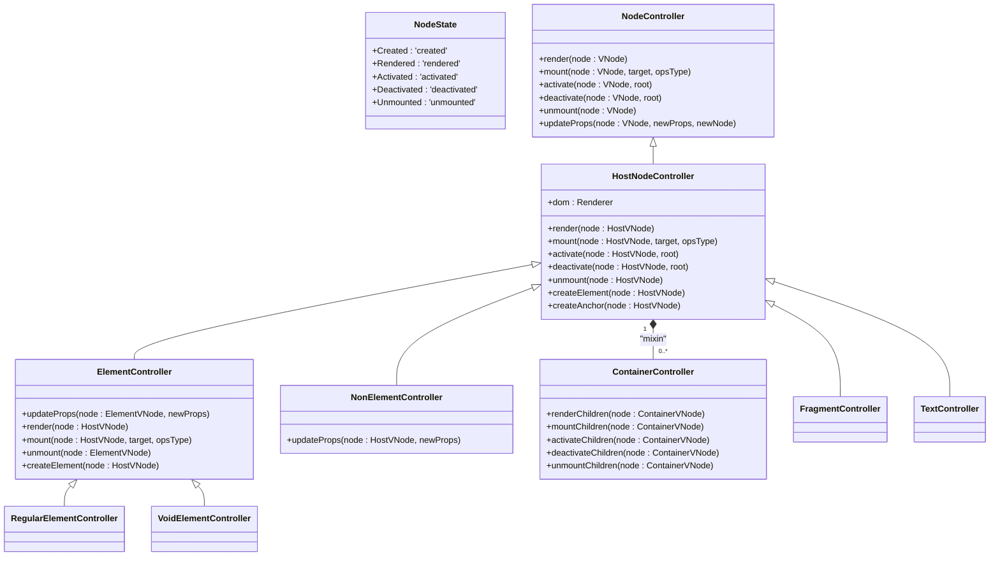
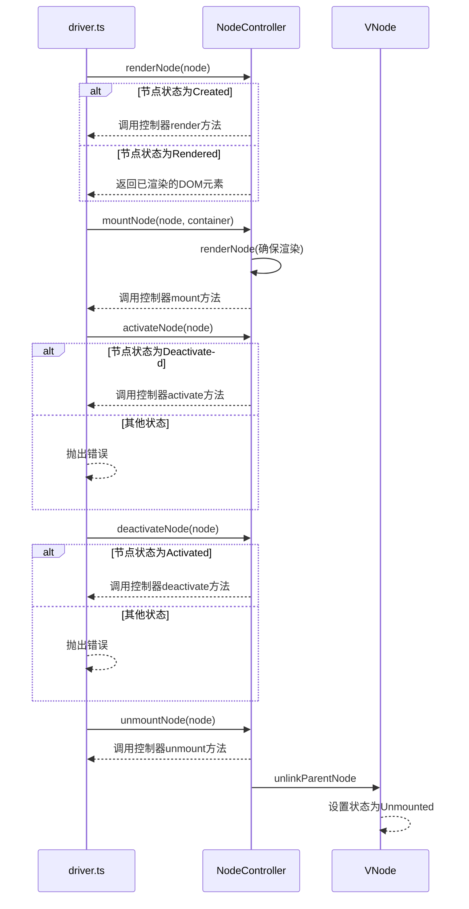
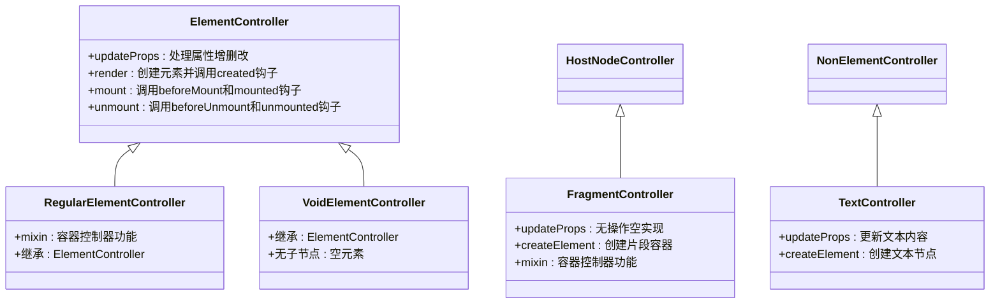
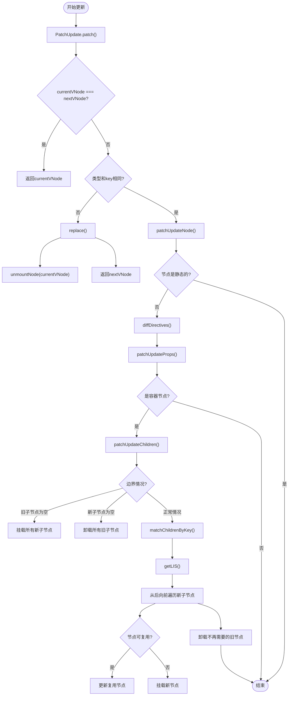
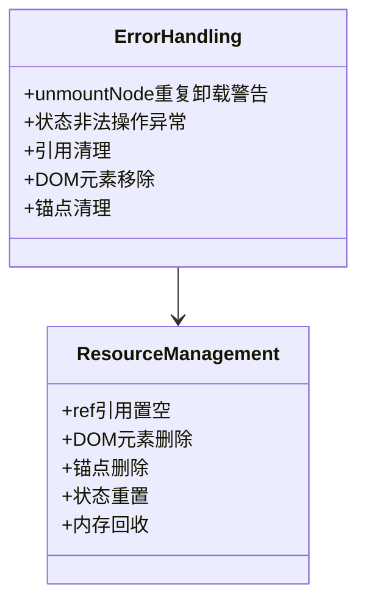

# 节点操作

<cite>
**本文档引用文件**  
- [driver.ts](file://packages/runtime-core/src/vnode/core/driver.ts)
- [update.ts](file://packages/runtime-core/src/vnode/core/update.ts)
- [nodeState.ts](file://packages/runtime-core/src/constants/nodeState.ts)
- [HostNodeController.ts](file://packages/runtime-core/src/controllers/HostNodeController.ts)
- [ElementController.ts](file://packages/runtime-core/src/controllers/ElementController.ts)
- [FragmentController.ts](file://packages/runtime-core/src/controllers/FragmentController.ts)
- [TextController.ts](file://packages/runtime-core/src/controllers/TextController.ts)
- [RegularElementController.ts](file://packages/runtime-core/src/controllers/RegularElementController.ts)
- [VoidElementController.ts](file://packages/runtime-core/src/controllers/VoidElementController.ts)
- [ContainerController.ts](file://packages/runtime-core/src/controllers/ContainerController.ts)
- [NonElementController.ts](file://packages/runtime-core/src/controllers/NonElementController.ts)
- [BaseNode.ts](file://packages/runtime-core/src/types/nodes/BaseNode.ts)
</cite>

## 目录
1. [引言](#引言)
2. [节点状态机与控制器架构](#节点状态机与控制器架构)
3. [核心节点操作机制](#核心节点操作机制)
4. [节点类型差异化行为](#节点类型差异化行为)
5. [更新算法与补丁应用](#更新算法与补丁应用)
6. [错误处理与资源管理](#错误处理与资源管理)
7. [常见问题排查指南](#常见问题排查指南)
8. [结论](#结论)

## 引言
vitarx框架通过虚拟DOM机制实现高效的UI更新。本文档深入解析虚拟DOM节点的运行时操作机制，重点分析节点的激活、停用、卸载和属性更新等核心操作。基于driver.ts中的deactivateNode、unmountNode、updateNodeProps等函数，详细说明节点状态机（NodeState）的转换逻辑和控制器（Controller）的调度机制。同时，结合update.ts中的更新算法，描述节点比对（diffing）和补丁应用（patching）的过程。

**节点状态机与控制器架构**  
- 节点状态机定义了节点的生命周期状态，包括创建、渲染、激活、停用和卸载。
- 控制器模式通过多态操作实现对不同节点类型的统一管理。

**核心节点操作机制**  
- 节点的激活、停用、卸载和属性更新等操作通过控制器模式实现。
- 不同节点类型在更新时的具体行为差异通过控制器的继承和多态实现。

**更新算法与补丁应用**  
- 更新算法通过节点比对（diffing）和补丁应用（patching）实现高效的UI更新。
- 补丁应用过程包括属性更新、子节点更新和节点替换。

## 节点状态机与控制器架构

**图示来源**  
- [nodeState.ts](file://packages/runtime-core/src/constants/nodeState.ts#L12-L18)
- [HostNodeController.ts](file://packages/runtime-core/src/controllers/HostNodeController.ts#L21-L127)
- [ElementController.ts](file://packages/runtime-core/src/controllers/ElementController.ts#L46-L104)
- [NonElementController.ts](file://packages/runtime-core/src/controllers/NonElementController.ts#L28-L39)
- [ContainerController.ts](file://packages/runtime-core/src/controllers/ContainerController.ts#L10-L59)

**节点状态机与控制器架构**  
vitarx框架通过节点状态机和控制器模式实现虚拟DOM节点的生命周期管理。节点状态机定义了节点的生命周期状态，包括创建（Created）、渲染（Rendered）、激活（Activated）、停用（Deactivated）和卸载（Unmounted）。控制器模式通过多态操作实现对不同节点类型的统一管理，每个节点类型都有对应的控制器实现。

## 核心节点操作机制

**图示来源**  
- [driver.ts](file://packages/runtime-core/src/vnode/core/driver.ts#L41-L123)
- [HostNodeController.ts](file://packages/runtime-core/src/controllers/HostNodeController.ts#L36-L93)

**核心节点操作机制**  
vitarx框架的核心节点操作机制通过driver.ts中的函数实现。这些函数根据节点的当前状态调用对应控制器的方法，实现节点的渲染、挂载、激活、停用和卸载等操作。每个操作都有严格的状态检查，确保操作的正确性和安全性。

## 节点类型差异化行为

**图示来源**  
- [ElementController.ts](file://packages/runtime-core/src/controllers/ElementController.ts#L46-L104)
- [FragmentController.ts](file://packages/runtime-core/src/controllers/FragmentController.ts#L28-L42)
- [TextController.ts](file://packages/runtime-core/src/controllers/TextController.ts#L26-L31)
- [RegularElementController.ts](file://packages/runtime-core/src/controllers/RegularElementController.ts#L27-L33)
- [VoidElementController.ts](file://packages/runtime-core/src/controllers/VoidElementController.ts#L30-L31)

**节点类型差异化行为**  
不同类型的节点在操作时表现出不同的行为特征。元素节点（Element）需要处理属性更新、生命周期钩子调用等复杂逻辑；片段节点（Fragment）不渲染实际DOM元素，其updateProps方法为空实现；文本节点（Text）主要处理文本内容的更新；常规元素节点（RegularElement）和空元素节点（VoidElement）都继承自ElementController，但前者支持子节点，后者不支持。

## 更新算法与补丁应用

**图示来源**  
- [update.ts](file://packages/runtime-core/src/vnode/core/update.ts#L42-L390)

**更新算法与补丁应用**  
vitarx框架的更新算法通过PatchUpdate类实现。算法首先比较新旧节点的引用、类型和key，决定是更新还是替换节点。对于需要更新的节点，算法会更新属性和子节点。子节点更新采用高效的diff算法，通过key匹配和最长递增子序列（LIS）优化，最小化DOM操作。

## 错误处理与资源管理

**图示来源**  
- [driver.ts](file://packages/runtime-core/src/vnode/core/driver.ts#L100-L110)
- [HostNodeController.ts](file://packages/runtime-core/src/controllers/HostNodeController.ts#L79-L93)

**错误处理与资源管理**  
vitarx框架在节点操作中实现了完善的错误处理和资源管理机制。在开发模式下，重复卸载节点会发出警告；非法状态转换会抛出异常。资源管理方面，卸载节点时会清理ref引用、移除DOM元素、删除锚点并重置节点状态，确保内存的正确回收。

## 常见问题排查指南

**节点无法激活或停用**  
- 检查节点当前状态是否符合操作要求
- 确认节点是否已正确挂载
- 验证操作是否在正确的上下文中执行

**属性更新未生效**  
- 检查新旧属性值是否真正发生变化
- 确认节点类型对应的控制器是否正确实现了updateProps方法
- 验证属性名是否正确

**子节点更新性能问题**  
- 为列表项添加唯一的key属性
- 使用静态标记优化静态内容
- 避免在渲染函数中创建新的函数或对象

**内存泄漏**  
- 检查组件是否正确实现了销毁逻辑
- 验证事件监听器是否被正确移除
- 确认定时器等资源是否被正确清理

**节点状态异常**  
- 检查状态转换是否符合预期流程
- 验证异步操作是否正确处理了节点状态
- 确认并发操作是否可能导致状态竞争

## 结论
vitarx框架通过精心设计的节点状态机和控制器模式，实现了高效、可靠的虚拟DOM操作机制。节点的激活、停用、卸载和属性更新等操作都遵循严格的状态转换规则，确保了操作的安全性和正确性。通过多态控制器模式，框架能够统一处理不同类型的节点，同时保持各类型节点的特异性。更新算法采用高效的diff策略，最小化DOM操作，提升性能。完善的错误处理和资源管理机制保证了框架的稳定性和内存安全性。