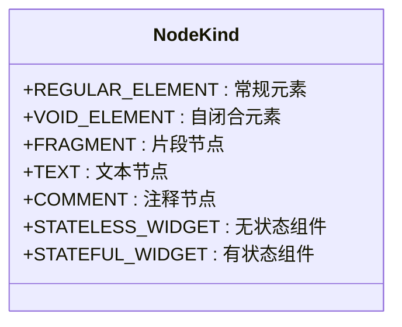
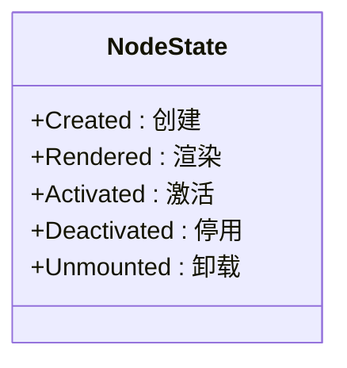
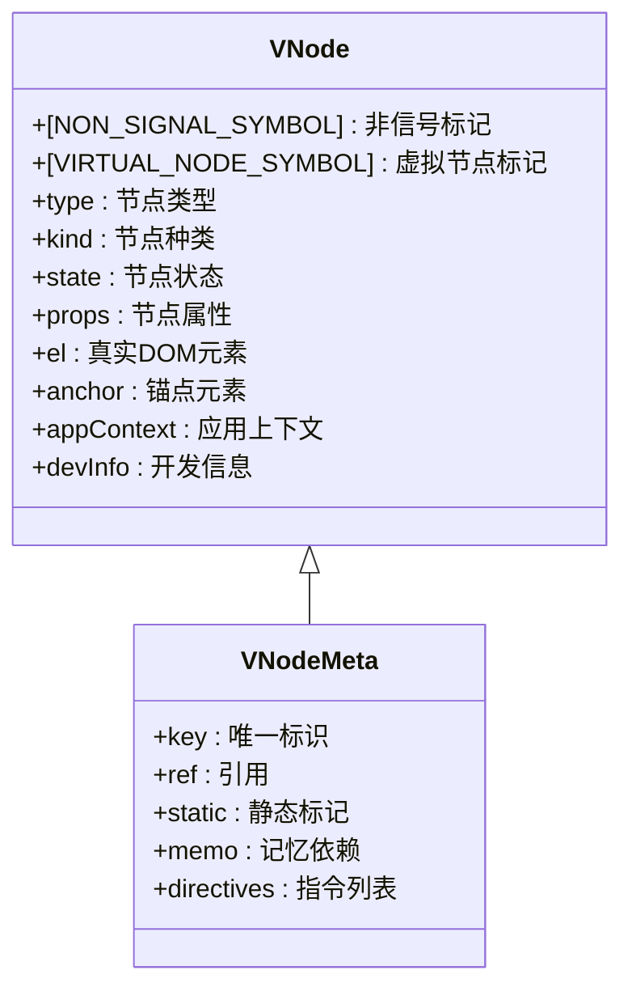
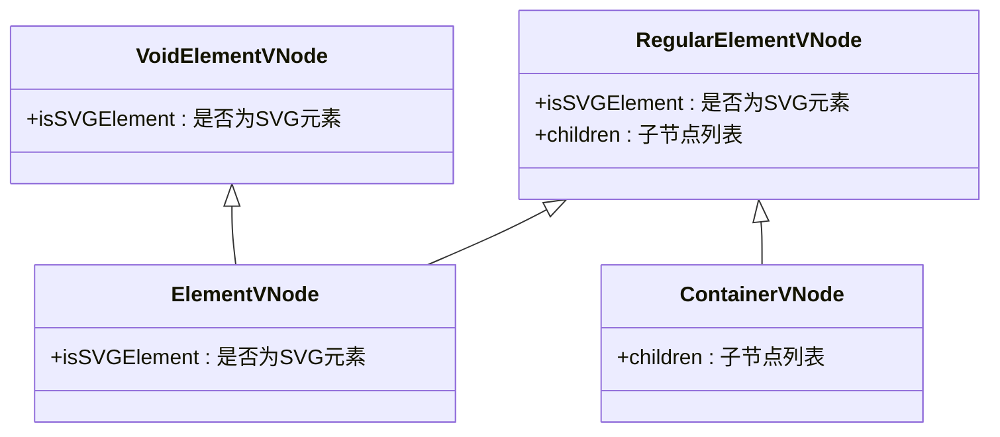
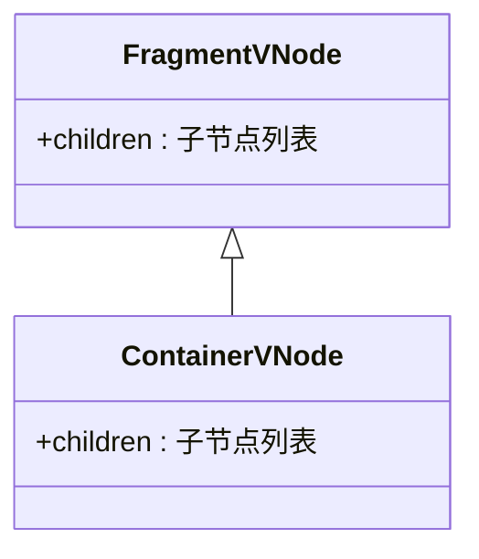
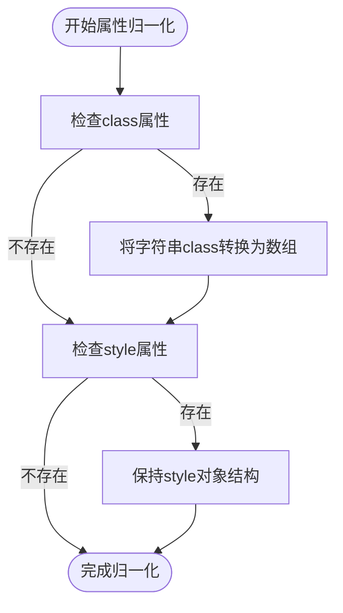
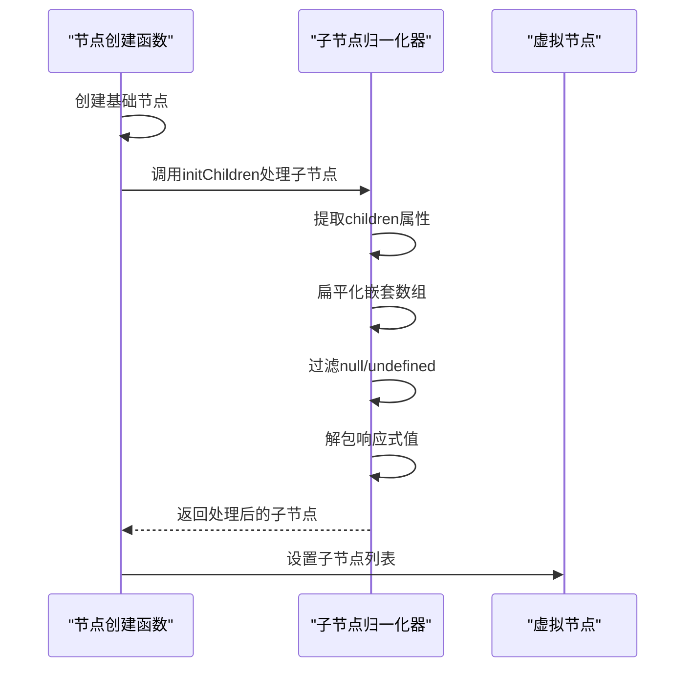
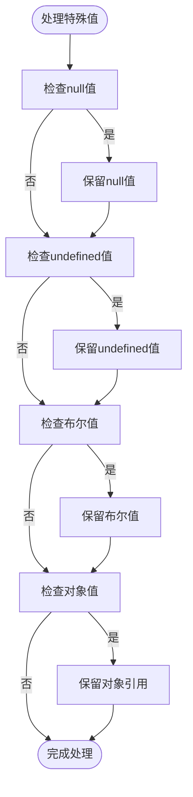
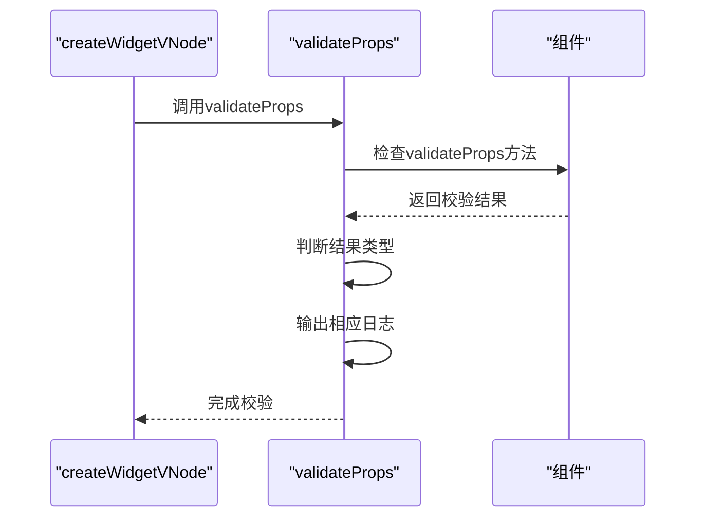
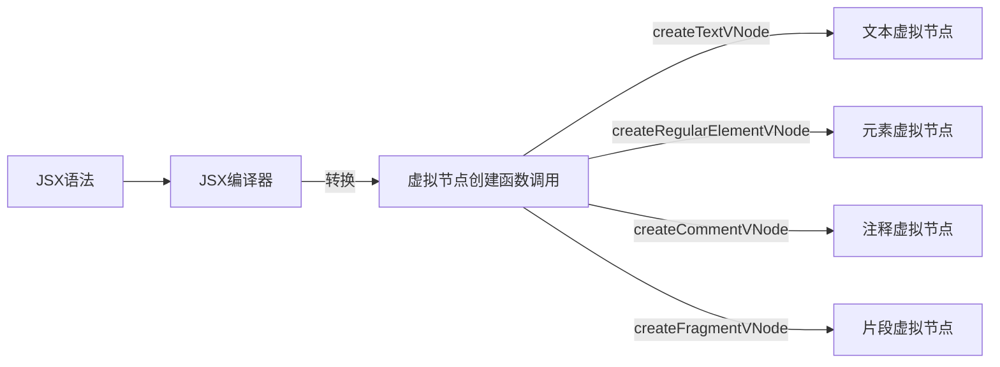

# 虚拟DOM创建

<cite>
**本文档引用文件**  
- [element.ts](file://packages/runtime-core/src/vnode/creator/element.ts)
- [special.ts](file://packages/runtime-core/src/vnode/creator/special.ts)
- [base.ts](file://packages/runtime-core/src/vnode/creator/base.ts)
- [BaseNode.ts](file://packages/runtime-core/src/types/nodes/BaseNode.ts)
- [nodeKind.ts](file://packages/runtime-core/src/constants/nodeKind.ts)
- [nodeState.ts](file://packages/runtime-core/src/constants/nodeState.ts)
- [special.test.ts](file://packages/runtime-core/__tests__/vnode/creator/special.test.ts)
- [element.test.ts](file://packages/runtime-core/__tests__/vnode/creator/element.test.ts)
- [fragment.test.ts](file://packages/runtime-core/__tests__/vnode/creator/fragment.test.ts)
- [widget.ts](file://packages/runtime-core/src/vnode/creator/widget.ts)
</cite>

## 目录
1. [虚拟节点创建机制](#虚拟节点创建机制)
2. [VNode数据结构设计](#vnode数据结构设计)
3. [不同类型虚拟节点的创建](#不同类型虚拟节点的创建)
4. [属性归一化与子节点处理](#属性归一化与子节点处理)
5. [边界情况处理](#边界情况处理)
6. [JSX编译中的API调用](#jsx编译中的api调用)

## 虚拟节点创建机制

vitarx框架通过一系列工厂函数实现虚拟DOM节点的创建，核心函数包括`createVNode`、`createElement`、`createTextVNode`、`createCommentVNode`等。这些函数最终都依赖于`createBaseVNode`作为底层实现，通过统一的创建流程确保虚拟节点的一致性和完整性。

**Section sources**
- [base.ts](file://packages/runtime-core/src/vnode/creator/base.ts#L22-L117)
- [element.ts](file://packages/runtime-core/src/vnode/creator/element.ts#L26-L68)
- [special.ts](file://packages/runtime-core/src/vnode/creator/special.ts#L19-L35)

## VNode数据结构设计

虚拟节点（VNode）是vitarx框架中描述UI结构的核心数据结构，其设计遵循轻量、高效和可扩展的原则。VNode通过接口继承的方式实现类型安全和功能扩展。

### 节点类型（NodeKind）

节点类型枚举`NodeKind`定义了虚拟DOM中所有可能的节点种类，用于快速识别和处理不同类型的节点。



**Diagram sources**
- [nodeKind.ts](file://packages/runtime-core/src/constants/nodeKind.ts#L4-L18)

### 节点状态（NodeState）

节点状态枚举`NodeState`描述了虚拟节点在其生命周期中的不同阶段，用于框架内部的状态管理和渲染控制。



**Diagram sources**
- [nodeState.ts](file://packages/runtime-core/src/constants/nodeState.ts#L12-L17)

### VNode核心字段

VNode接口定义了虚拟节点的核心字段，包括元数据、类型信息、状态和属性等。



**Diagram sources**
- [BaseNode.ts](file://packages/runtime-core/src/types/nodes/BaseNode.ts#L76-L148)

## 不同类型虚拟节点的创建

vitarx框架支持多种类型的虚拟节点创建，每种节点类型都有专门的创建函数和相应的数据结构定义。

### 元素节点创建

元素节点分为常规元素节点和自闭合元素节点，分别由`createRegularElementVNode`和`createVoidElementVNode`函数创建。



**Diagram sources**
- [RegularElementVNode.ts](file://packages/runtime-core/src/types/nodes/RegularElementVNode.ts#L16-L18)
- [VoidElementVNode.ts](file://packages/runtime-core/src/types/nodes/VoidElementVNode.ts#L16-L17)
- [element.ts](file://packages/runtime-core/src/vnode/creator/element.ts#L47-L68)

### 特殊节点创建

文本节点和注释节点作为特殊的非元素节点，由`createTextVNode`和`createCommentVNode`函数创建。

```mermaid
classDiagram
class TextVNode {
+props : {value : string}
}
class CommentVNode {
+props : {value : string}
}
class NonElementVNode {
+props : {value : string}
}
TextVNode <|-- NonElementVNode
CommentVNode <|-- NonElementVNode
```

**Diagram sources**
- [TextVNode.ts](file://packages/runtime-core/src/types/nodes/TextVNode.ts#L16)
- [CommentVNode.ts](file://packages/runtime-core/src/types/nodes/CommentVNode.ts#L14)
- [special.ts](file://packages/runtime-core/src/vnode/creator/special.ts#L19-L35)

### 片段节点创建

片段节点（Fragment）用于包装多个子节点而不创建额外的DOM元素，由`createFragmentVNode`函数创建。



**Diagram sources**
- [FragmentVNode.ts](file://packages/runtime-core/src/types/nodes/FragmentVNode.ts#L16)
- [fragment.test.ts](file://packages/runtime-core/__tests__/vnode/creator/fragment.test.ts#L8-L15)

## 属性归一化与子节点处理

vitarx框架在创建虚拟节点时会对属性和子节点进行标准化处理，确保数据的一致性和正确性。

### 属性归一化

属性归一化主要处理class和style属性，将其转换为统一的数据结构。



**Diagram sources**
- [element.ts](file://packages/runtime-core/src/vnode/creator/element.ts#L32-L33)
- [element.ts](file://packages/runtime-core/src/vnode/creator/element.ts#L54-L55)

### 子节点处理

子节点处理包括子节点的提取、扁平化和响应式值的解包。



**Diagram sources**
- [element.ts](file://packages/runtime-core/src/vnode/creator/element.ts#L58-L65)
- [children.ts](file://packages/runtime-core/src/vnode/normalizer/children.ts)

## 边界情况处理

vitarx框架通过全面的测试用例确保各种边界情况的正确处理。

### 特殊值处理

框架对null、undefined、布尔值等特殊值进行了专门的处理。



**Diagram sources**
- [special.test.ts](file://packages/runtime-core/__tests__/vnode/creator/special.test.ts#L183-L210)

### 组件属性校验

在开发模式下，框架会对组件属性进行校验，确保传入的属性符合组件定义的约束。



**Diagram sources**
- [widget.ts](file://packages/runtime-core/src/vnode/creator/widget.ts#L45-L68)

## JSX编译中的API调用

在JSX编译过程中，vitarx框架的虚拟节点创建API会被自动调用，将JSX语法转换为相应的虚拟节点创建函数调用。



**Diagram sources**
- [jsx-runtime.ts](file://packages/vitarx/src/jsx-runtime.ts)
- [create.test.ts](file://packages/runtime-core/__tests__/vnode/core/create.test.ts)

**Section sources**
- [special.test.ts](file://packages/runtime-core/__tests__/vnode/creator/special.test.ts#L13-L87)
- [element.test.ts](file://packages/runtime-core/__tests__/vnode/creator/element.test.ts#L12-L233)
- [fragment.test.ts](file://packages/runtime-core/__tests__/vnode/creator/fragment.test.ts#L8-L197)