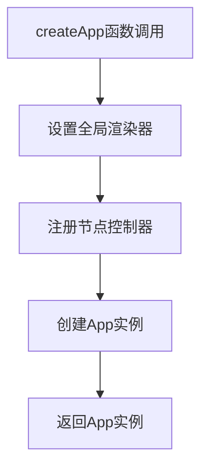
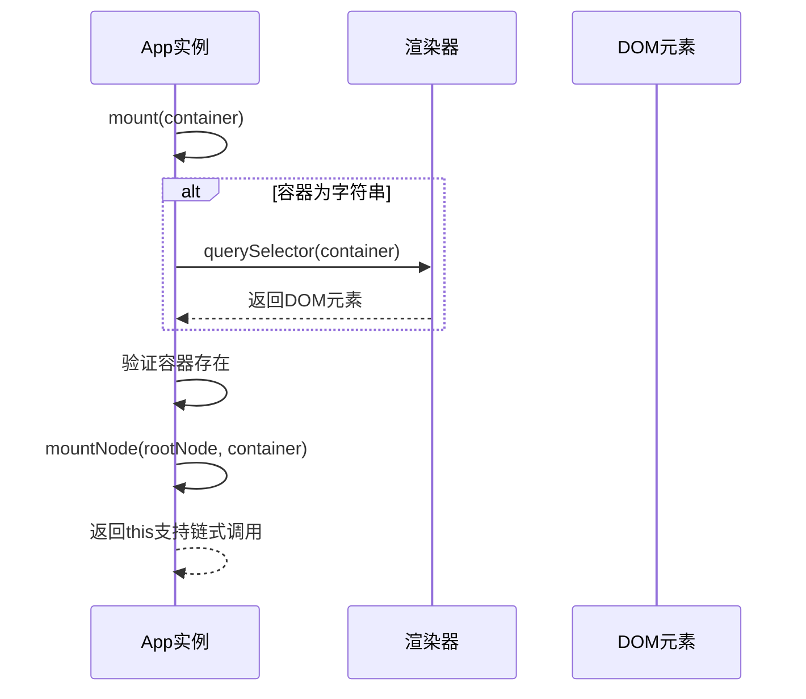
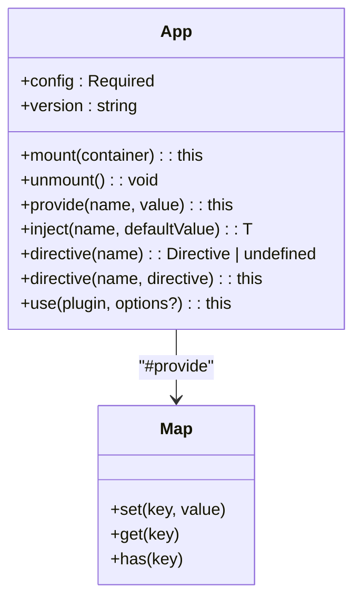
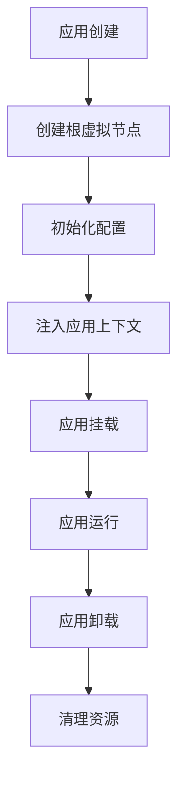
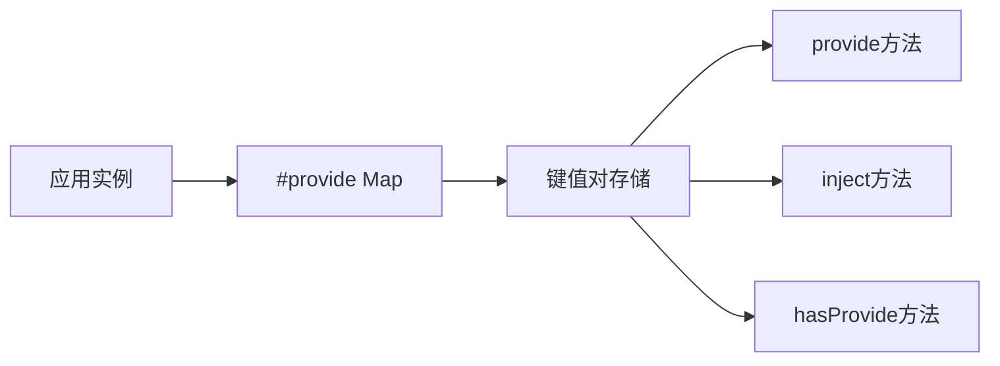
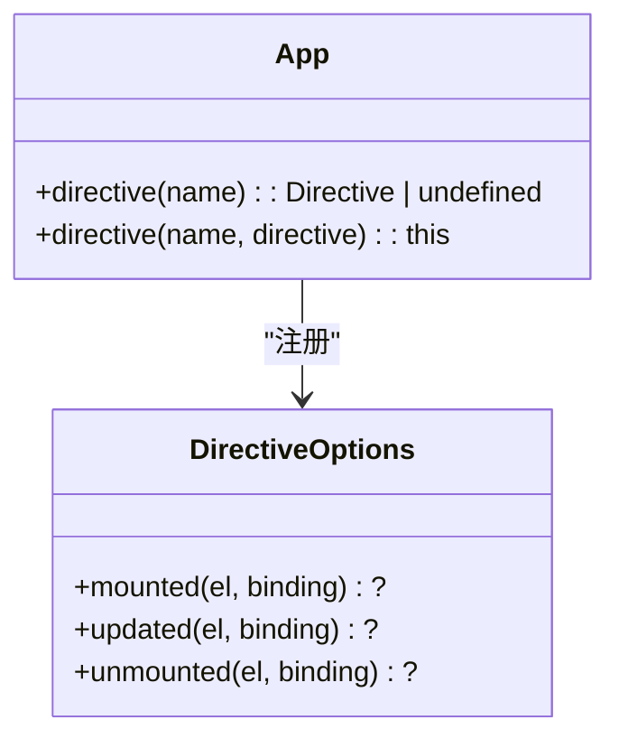
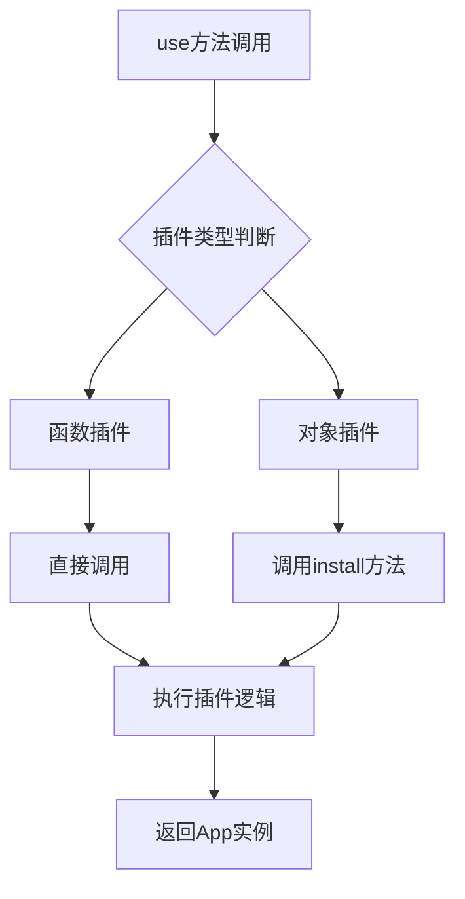
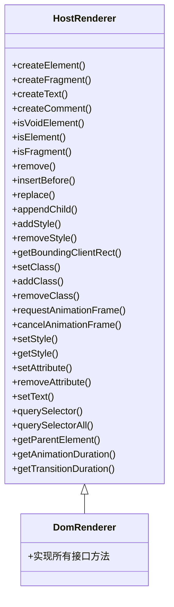
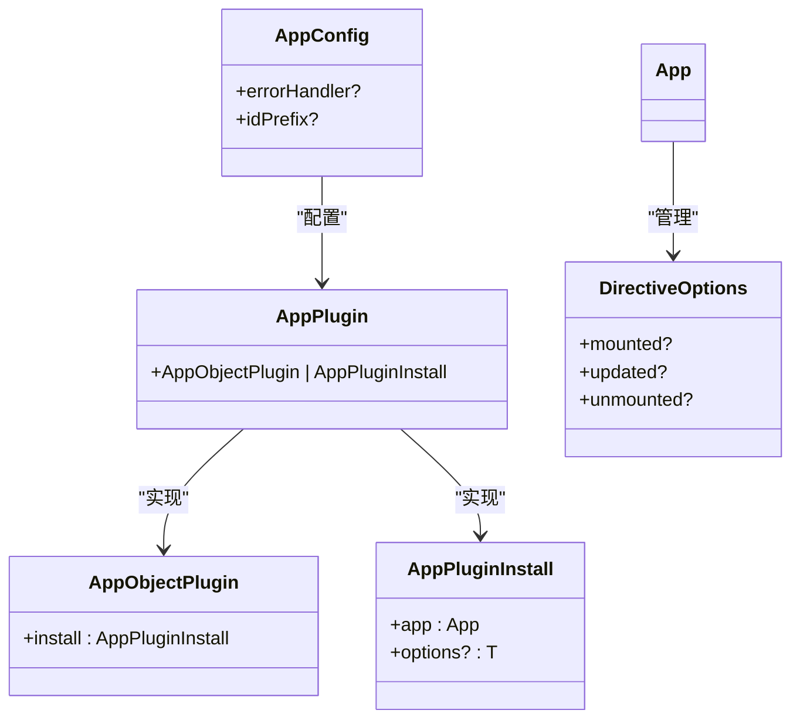
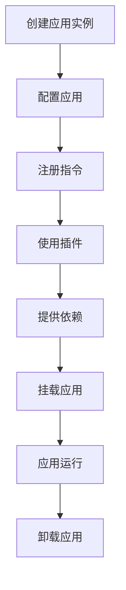

# 应用API

<cite>
**本文档中引用的文件**  
- [factory.ts](file://packages/runtime-dom/src/client/factory.ts)
- [App.ts](file://packages/runtime-core/src/app/App.ts)
- [DomRenderer.ts](file://packages/runtime-dom/src/client/DomRenderer.ts)
- [api.ts](file://packages/runtime-core/src/renderer/api.ts)
- [ElementController.ts](file://packages/runtime-core/src/controllers/ElementController.ts)
- [RegularElementController.ts](file://packages/runtime-core/src/controllers/RegularElementController.ts)
- [create.ts](file://packages/runtime-core/src/vnode/core/create.ts)
</cite>

## 目录
1. [应用创建与管理概述](#应用创建与管理概述)
2. [createApp函数实现机制](#createapp函数实现机制)
3. [App类核心方法解析](#app类核心方法解析)
4. [应用生命周期管理](#应用生命周期管理)
5. [依赖注入系统](#依赖注入系统)
6. [指令与插件系统](#指令与插件系统)
7. [跨平台适配策略](#跨平台适配策略)
8. [类型定义与参数说明](#类型定义与参数说明)
9. [使用示例](#使用示例)

## 应用创建与管理概述

vitarx框架通过`createApp`函数提供应用实例的创建与管理功能，该函数是应用入口的核心API。它封装了应用实例的初始化、配置、挂载和卸载等完整生命周期管理功能。框架采用分层架构设计，将应用逻辑与平台特定的渲染逻辑分离，通过`runtime-core`包提供核心功能，`runtime-dom`包提供DOM环境下的具体实现。

应用实例的创建过程涉及多个关键组件的协同工作：`createApp`函数负责创建`App`实例，`DomRenderer`负责DOM操作，各种节点控制器负责管理不同类型的虚拟节点。这种设计实现了关注点分离，使得框架既能保持核心逻辑的简洁性，又能灵活适应不同运行环境。

**Section sources**
- [App.ts](file://packages/runtime-core/src/app/App.ts#L70-L81)
- [factory.ts](file://packages/runtime-dom/src/client/factory.ts#L29-L38)

## createApp函数实现机制

`createApp`函数是vitarx框架中创建应用实例的工厂函数，位于`runtime-dom`包的`factory.ts`文件中。该函数的实现机制体现了框架的初始化流程和平台适配策略。

在函数执行前，会先设置全局渲染器并注册各种节点控制器。通过`setRenderer(new DomRenderer())`设置DOM渲染器，然后使用`registerController`函数注册`RegularElementController`、`VoidElementController`、`FragmentController`等控制器，这些控制器分别处理常规元素、自闭合元素和片段等不同类型的节点。

**Diagram sources**
- [factory.ts](file://packages/runtime-dom/src/client/factory.ts#L19-L28)
- [api.ts](file://packages/runtime-core/src/renderer/api.ts#L10-L12)

**Section sources**
- [factory.ts](file://packages/runtime-dom/src/client/factory.ts#L19-L38)
- [api.ts](file://packages/runtime-core/src/renderer/api.ts#L10-L28)

## App类核心方法解析

`App`类是vitarx框架中应用实例的核心实现，封装了应用的生命周期管理和核心功能。该类提供了多个关键方法，包括`mount`、`unmount`、`provide`、`use`等，这些方法共同构成了应用API的主要接口。

### mount方法

`mount`方法负责将应用挂载到指定的DOM容器中。当传入字符串选择器时，会通过`querySelector`查找对应的DOM元素；如果找不到元素则抛出错误。挂载过程通过`mountNode`函数实现，将根节点的虚拟DOM树渲染到目标容器中。

**Diagram sources**
- [App.ts](file://packages/runtime-core/src/app/App.ts#L187-L202)
- [DomRenderer.ts](file://packages/runtime-dom/src/client/DomRenderer.ts#L358-L361)

### unmount方法

`unmount`方法负责卸载应用并清理相关资源。该方法调用`unmountNode`函数，递归地卸载根节点及其所有子节点，确保正确执行组件的销毁逻辑和清理操作。

### provide与inject方法

`provide`和`inject`方法实现了应用级别的依赖注入机制。`provide`方法将数据存储在私有的`#provide` Map中，`inject`方法从该Map中获取数据，支持提供默认值。这种机制允许在应用层级提供全局数据，供组件树中的任何组件使用。

**Diagram sources**
- [App.ts](file://packages/runtime-core/src/app/App.ts#L107-L394)
- [App.ts](file://packages/runtime-core/src/app/App.ts#L313-L336)

**Section sources**
- [App.ts](file://packages/runtime-core/src/app/App.ts#L179-L209)
- [App.ts](file://packages/runtime-core/src/app/App.ts#L308-L336)

## 应用生命周期管理

vitarx框架的应用生命周期管理涵盖了从创建到销毁的完整过程。应用实例的生命周期始于`createApp`函数的调用，终于`unmount`方法的执行。

在`App`类的构造函数中，首先根据传入的根节点类型（组件函数或虚拟节点）创建根虚拟节点，然后初始化应用配置，最后为根节点及其子树注入应用上下文。这个过程确保了整个组件树都能访问到应用实例和相关配置。

挂载阶段通过`mount`方法将虚拟DOM树渲染到指定的DOM容器中，触发组件的创建和渲染。卸载阶段则通过`unmount`方法清理所有资源，确保没有内存泄漏。

**Section sources**
- [App.ts](file://packages/runtime-core/src/app/App.ts#L132-L141)
- [App.ts](file://packages/runtime-core/src/app/App.ts#L179-L209)

## 依赖注入系统

vitarx框架提供了强大的依赖注入系统，通过`provide`和`inject`方法实现。该系统允许在应用层级提供数据，并在组件树中的任何位置注入这些数据，实现了跨层级的组件通信。

依赖注入系统基于私有的`#provide` Map实现，`provide`方法将键值对存储在Map中，`inject`方法根据键名查找对应的值。系统还提供了`hasProvide`方法用于检查特定键是否已提供数据。

这种设计模式避免了传统props层层传递的繁琐，特别适合主题配置、国际化、用户认证等全局状态的管理。

**Section sources**
- [App.ts](file://packages/runtime-core/src/app/App.ts#L308-L336)

## 指令与插件系统

vitarx框架提供了灵活的指令和插件系统，扩展了框架的功能和可定制性。

### 指令系统

指令系统通过`directive`方法实现，支持方法重载：当只传入指令名称时返回已注册的指令；当同时传入名称和指令定义时注册新指令。指令可以是对象形式（包含mounted、updated等钩子函数）或函数形式（等同于mounted钩子）。

### 插件系统

插件系统通过`use`方法实现，支持多种插件形式：无配置的函数插件、有必填配置的对象插件、有可选配置的函数插件等。插件安装时会自动调用其`install`方法，并传入应用实例和配置选项。

**Diagram sources**
- [App.ts](file://packages/runtime-core/src/app/App.ts#L249-L306)
- [App.ts](file://packages/runtime-core/src/app/App.ts#L343-L394)

**Section sources**
- [App.ts](file://packages/runtime-core/src/app/App.ts#L249-L306)
- [App.ts](file://packages/runtime-core/src/app/App.ts#L343-L394)

## 跨平台适配策略

vitarx框架通过抽象渲染器接口和节点控制器机制实现了跨平台适配。`HostRenderer`接口定义了所有平台相关的DOM操作方法，`DomRenderer`类实现了浏览器环境下的具体操作。

框架采用依赖注入的方式管理渲染器，通过`setRenderer`函数设置全局渲染器，`useRenderer`函数获取当前渲染器。这种设计使得框架可以轻松支持不同平台，只需实现对应平台的渲染器即可。

节点控制器系统进一步增强了平台适配能力，不同类型的节点由专门的控制器管理，如`RegularElementController`处理常规元素，`FragmentController`处理片段节点等。这种分而治之的设计提高了代码的可维护性和扩展性。

**Diagram sources**
- [DomRenderer.ts](file://packages/runtime-dom/src/client/DomRenderer.ts#L62-L572)
- [api.ts](file://packages/runtime-core/src/renderer/api.ts#L10-L28)

**Section sources**
- [DomRenderer.ts](file://packages/runtime-dom/src/client/DomRenderer.ts#L62-L572)
- [api.ts](file://packages/runtime-core/src/renderer/api.ts#L10-L28)

## 类型定义与参数说明

vitarx框架提供了完善的类型定义，确保API的类型安全。核心类型包括`AppConfig`、`AppPlugin`、`Directive`等。

`AppConfig`接口定义了应用配置选项，包含`errorHandler`和`idPrefix`等属性。`AppPlugin`类型支持多种插件形式，包括函数插件和对象插件。`Directive`类型定义了指令的结构，支持多种生命周期钩子。

这些类型定义不仅提供了代码提示和错误检查，还清晰地表达了API的设计意图和使用方式。

**Diagram sources**
- [App.ts](file://packages/runtime-core/src/app/App.ts#L19-L36)
- [App.ts](file://packages/runtime-core/src/app/App.ts#L45-L59)

**Section sources**
- [App.ts](file://packages/runtime-core/src/app/App.ts#L19-L59)

## 使用示例

以下示例展示了vitarx框架应用API的完整使用流程：

实际代码示例：
- 使用`createApp`创建应用实例
- 通过`directive`注册自定义指令
- 使用`use`安装插件
- 通过`provide`提供全局数据
- 调用`mount`方法挂载到DOM
- 需要时调用`unmount`卸载应用

这些API共同构成了vitarx框架应用开发的基础，提供了从创建到管理的完整解决方案。

**Section sources**
- [App.ts](file://packages/runtime-core/src/app/App.ts#L82-L102)
- [factory.test.ts](file://packages/runtime-dom/__tests__/client/factory.test.ts#L20-L68)