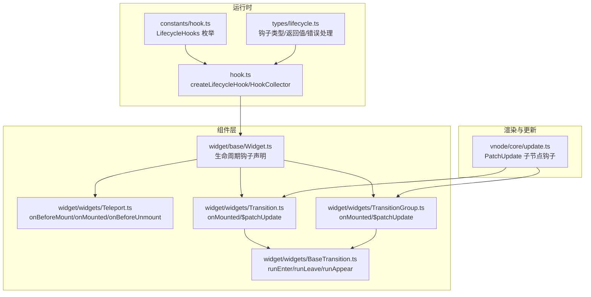
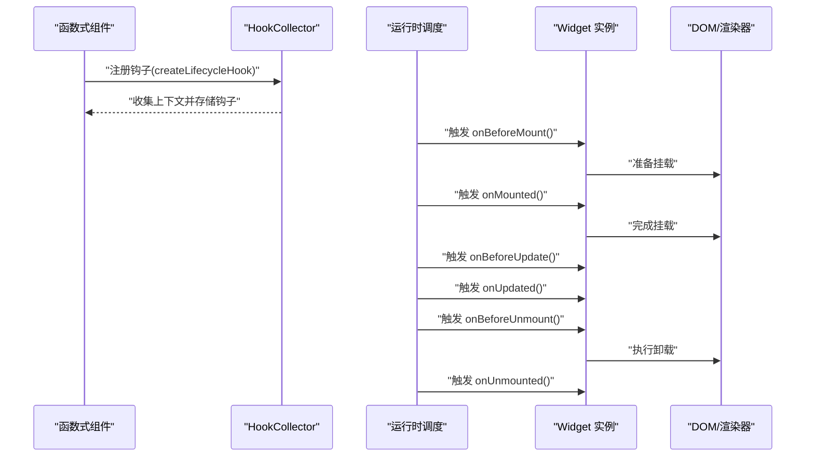
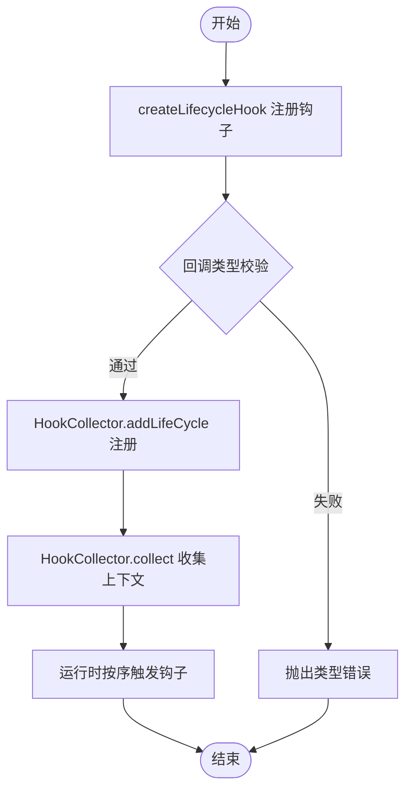
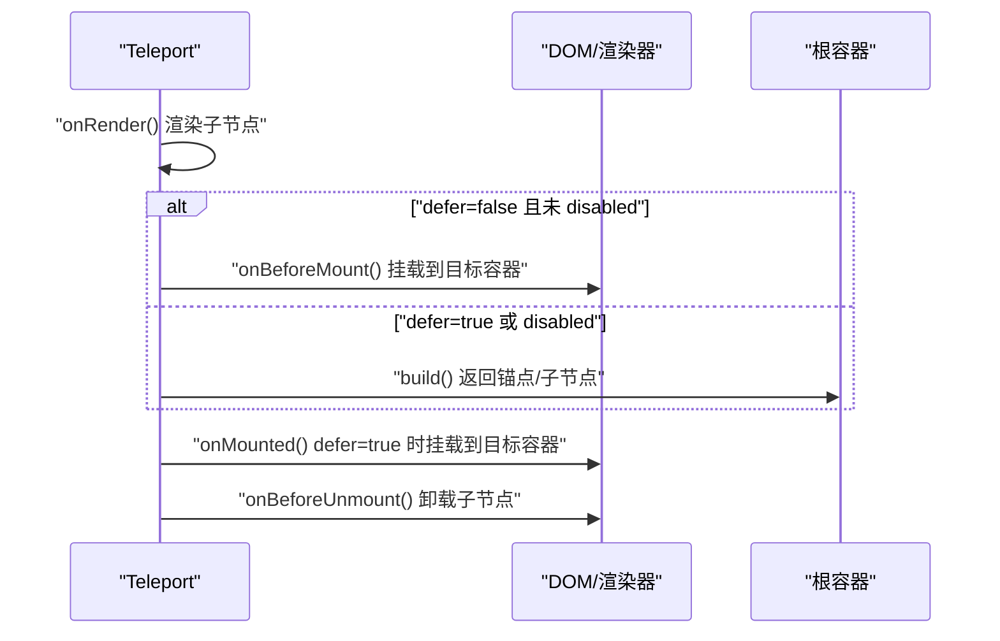
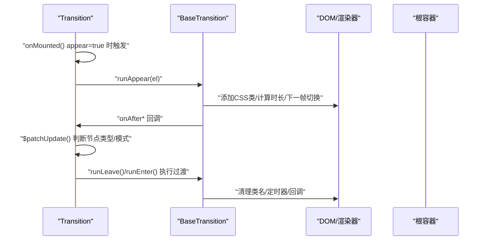
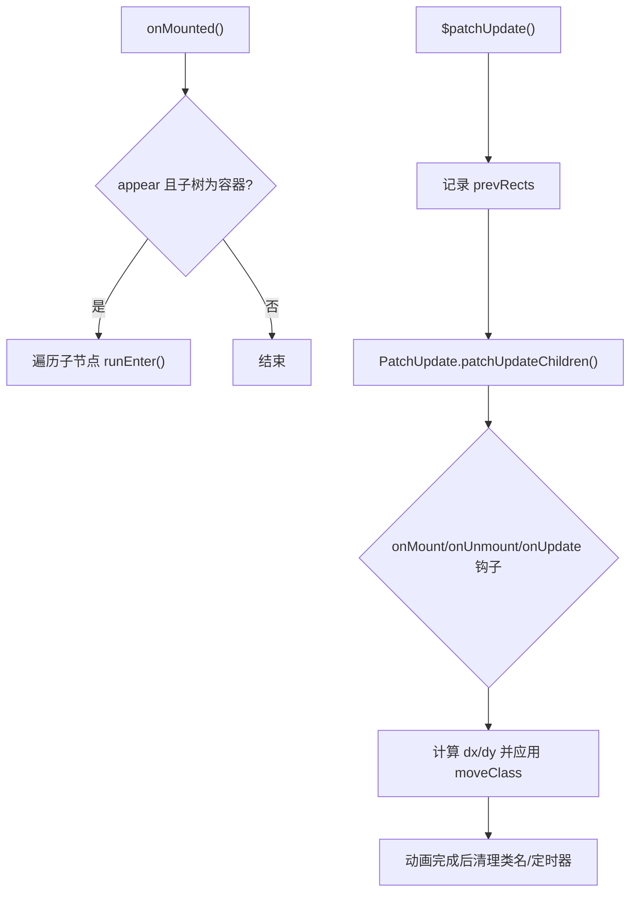
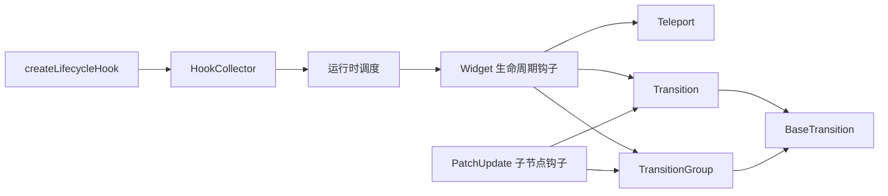

# 生命周期钩子

<cite>
**本文引用的文件**
- [packages/runtime-core/src/constants/hook.ts](file://packages/runtime-core/src/constants/hook.ts)
- [packages/runtime-core/src/runtime/hook.ts](file://packages/runtime-core/src/runtime/hook.ts)
- [packages/runtime-core/src/types/lifecycle.ts](file://packages/runtime-core/src/types/lifecycle.ts)
- [packages/runtime-core/src/widget/base/Widget.ts](file://packages/runtime-core/src/widget/base/Widget.ts)
- [packages/runtime-core/src/widget/widgets/Teleport.ts](file://packages/runtime-core/src/widget/widgets/Teleport.ts)
- [packages/runtime-core/src/widget/widgets/Transition.ts](file://packages/runtime-core/src/widget/widgets/Transition.ts)
- [packages/runtime-core/src/widget/widgets/TransitionGroup.ts](file://packages/runtime-core/src/widget/widgets/TransitionGroup.ts)
- [packages/runtime-core/src/widget/widgets/BaseTransition.ts](file://packages/runtime-core/src/widget/widgets/BaseTransition.ts)
- [packages/runtime-core/src/vnode/core/update.ts](file://packages/runtime-core/src/vnode/core/update.ts)
- [packages/runtime-core/src/vnode/index.ts](file://packages/runtime-core/src/vnode/index.ts)
- [packages/runtime-core/__tests__/runtime/hook.test.ts](file://packages/runtime-core/__tests__/runtime/hook.test.ts)
- [packages/runtime-core/__tests__/widget/widgets/Teleport.test.ts](file://packages/runtime-core/__tests__/widget/widgets/Teleport.test.ts)
- [packages/runtime-core/__tests__/widget/widgets/Transition.test.ts](file://packages/runtime-core/__tests__/widget/widgets/Transition.test.ts)
</cite>

## 目录
1. [简介](#简介)
2. [项目结构](#项目结构)
3. [核心组件](#核心组件)
4. [架构总览](#架构总览)
5. [详细组件分析](#详细组件分析)
6. [依赖分析](#依赖分析)
7. [性能考量](#性能考量)
8. [故障排查指南](#故障排查指南)
9. [结论](#结论)
10. [附录](#附录)

## 简介
本篇文档系统梳理 vitarx 框架提供的组件生命周期钩子体系，围绕 onMounted、onUnmounted、onUpdated 等核心钩子的触发时机与执行机制展开，重点解析 hook.ts 中 createLifecycleHook 的注册、调度与执行流程，并结合 Teleport、Transition、TransitionGroup 等内置组件的实际实现，展示生命周期钩子在真实组件中的应用模式。文档还提供完整的类型定义说明与实战示例指引，帮助开发者在正确的生命周期阶段执行 DOM 操作、资源清理与状态更新等任务。

## 项目结构
vitarx 的生命周期钩子相关代码主要分布在 runtime-core 包中：
- 常量与类型：生命周期钩子枚举、钩子参数与返回值类型定义
- 运行时钩子：钩子注册工厂 createLifecycleHook、HookCollector 上下文收集器、defineExpose 暴露机制
- 组件基类：Widget 抽象类定义各生命周期钩子的声明与语义
- 内置组件：Teleport、Transition、TransitionGroup 对生命周期钩子的具体使用
- VNode 更新：PatchUpdate 子节点更新钩子，驱动 Transition/TransitionGroup 的进入/离开/移动动画

**图表来源**
- [packages/runtime-core/src/constants/hook.ts](file://packages/runtime-core/src/constants/hook.ts#L1-L15)
- [packages/runtime-core/src/runtime/hook.ts](file://packages/runtime-core/src/runtime/hook.ts#L1-L266)
- [packages/runtime-core/src/types/lifecycle.ts](file://packages/runtime-core/src/types/lifecycle.ts#L1-L139)
- [packages/runtime-core/src/widget/base/Widget.ts](file://packages/runtime-core/src/widget/base/Widget.ts#L1-L371)
- [packages/runtime-core/src/widget/widgets/Teleport.ts](file://packages/runtime-core/src/widget/widgets/Teleport.ts#L1-L165)
- [packages/runtime-core/src/widget/widgets/Transition.ts](file://packages/runtime-core/src/widget/widgets/Transition.ts#L1-L246)
- [packages/runtime-core/src/widget/widgets/TransitionGroup.ts](file://packages/runtime-core/src/widget/widgets/TransitionGroup.ts#L1-L283)
- [packages/runtime-core/src/widget/widgets/BaseTransition.ts](file://packages/runtime-core/src/widget/widgets/BaseTransition.ts#L1-L411)
- [packages/runtime-core/src/vnode/core/update.ts](file://packages/runtime-core/src/vnode/core/update.ts#L1-L390)

**章节来源**
- [packages/runtime-core/src/constants/hook.ts](file://packages/runtime-core/src/constants/hook.ts#L1-L15)
- [packages/runtime-core/src/runtime/hook.ts](file://packages/runtime-core/src/runtime/hook.ts#L1-L266)
- [packages/runtime-core/src/types/lifecycle.ts](file://packages/runtime-core/src/types/lifecycle.ts#L1-L139)
- [packages/runtime-core/src/widget/base/Widget.ts](file://packages/runtime-core/src/widget/base/Widget.ts#L1-L371)
- [packages/runtime-core/src/vnode/core/update.ts](file://packages/runtime-core/src/vnode/core/update.ts#L1-L390)

## 核心组件
- 生命周期钩子枚举：LifecycleHooks 定义了框架内所有可用的钩子名称，包括 onCreate、onBeforeMount、onMounted、onActivated、onDeactivated、onBeforeUpdate、onUpdated、onBeforeUnmount、onUnmounted、onError、onRender。
- 钩子工厂与收集器：createLifecycleHook 通过工厂函数包装具体钩子注册逻辑，HookCollector 在函数式组件渲染上下文中收集钩子与暴露数据，确保在正确的时机执行。
- 类组件钩子声明：Widget 抽象类声明了各生命周期钩子的可选方法签名，明确各钩子的触发时机与语义，例如 onBeforeMount 在真实 DOM 元素尚未创建时调用，onMounted 在挂载完成后调用。
- 类型系统：lifecycle.ts 定义了钩子参数类型、返回值类型与错误处理类型，确保类型安全与一致的钩子行为。

**章节来源**
- [packages/runtime-core/src/constants/hook.ts](file://packages/runtime-core/src/constants/hook.ts#L1-L15)
- [packages/runtime-core/src/runtime/hook.ts](file://packages/runtime-core/src/runtime/hook.ts#L120-L230)
- [packages/runtime-core/src/types/lifecycle.ts](file://packages/runtime-core/src/types/lifecycle.ts#L1-L139)
- [packages/runtime-core/src/widget/base/Widget.ts](file://packages/runtime-core/src/widget/base/Widget.ts#L115-L322)

## 架构总览
生命周期钩子的执行链路如下：
- 注册阶段：createLifecycleHook 接收钩子名与回调，校验回调类型后委托 HookCollector.addLifeCycle 注册到当前上下文。
- 收集阶段：HookCollector.collect 在函数式组件渲染期间，通过 runInContext 将上下文注入，使组件内的钩子注册得以收集。
- 触发阶段：在组件渲染、挂载、更新、卸载等关键节点，框架按约定顺序调用对应钩子，如 onBeforeMount、onMounted、onBeforeUpdate、onUpdated、onBeforeUnmount、onUnmounted。
- 内置组件应用：Teleport 在 onBeforeMount/onMounted/onBeforeUnmount 中执行 DOM 传送与卸载；Transition/TransitionGroup 在构建与更新时利用 BaseTransition 的 runEnter/runLeave/runAppear 与 PatchUpdate 的子节点钩子，驱动进入/离开/移动动画。

**图表来源**
- [packages/runtime-core/src/runtime/hook.ts](file://packages/runtime-core/src/runtime/hook.ts#L120-L230)
- [packages/runtime-core/src/widget/base/Widget.ts](file://packages/runtime-core/src/widget/base/Widget.ts#L115-L322)

## 详细组件分析

### 生命周期钩子注册与执行流程（createLifecycleHook/HookCollector）
- createLifecycleHook：为每个钩子名生成专用注册函数，内部校验回调类型，若非法则抛出类型错误；通过 HookCollector.addLifeCycle 将钩子注册到当前上下文。
- HookCollector：提供 context 访问、addExposed 暴露数据、collect 收集函数式组件渲染期间注册的钩子与暴露项。collect 在 runInContext 上下文中执行组件函数，确保钩子注册与组件渲染在同一上下文中完成。
- 类型约束：lifecycle.ts 定义了钩子参数与返回值类型，onError 接收错误与错误信息，onRender 可返回 Promise 以支持 SSR 延迟替换占位节点。

**图表来源**
- [packages/runtime-core/src/runtime/hook.ts](file://packages/runtime-core/src/runtime/hook.ts#L120-L230)
- [packages/runtime-core/src/types/lifecycle.ts](file://packages/runtime-core/src/types/lifecycle.ts#L89-L139)

**章节来源**
- [packages/runtime-core/src/runtime/hook.ts](file://packages/runtime-core/src/runtime/hook.ts#L1-L266)
- [packages/runtime-core/src/types/lifecycle.ts](file://packages/runtime-core/src/types/lifecycle.ts#L1-L139)

### Teleport 组件的生命周期钩子应用
- onRender：在非 disabled 模式下，渲染子节点到目标容器；disabled 模式下，子节点在原地渲染。
- onBeforeMount：在 defer=false 时，于挂载前将子节点挂载到目标容器；defer=true 时跳过此阶段。
- onMounted：在 defer=true 时，于挂载完成后将子节点挂载到目标容器。
- onBeforeUnmount：在卸载前，若已传送则卸载子节点。
- build：disabled 模式返回子节点本身，非 disabled 模式返回注释节点作为锚点。

**图表来源**
- [packages/runtime-core/src/widget/widgets/Teleport.ts](file://packages/runtime-core/src/widget/widgets/Teleport.ts#L118-L165)

**章节来源**
- [packages/runtime-core/src/widget/widgets/Teleport.ts](file://packages/runtime-core/src/widget/widgets/Teleport.ts#L1-L165)
- [packages/runtime-core/__tests__/widget/widgets/Teleport.test.ts](file://packages/runtime-core/__tests__/widget/widgets/Teleport.test.ts#L197-L234)

### Transition 组件的生命周期钩子应用
- onMounted：当 appear=true 时，在组件首次挂载时触发出现动画 runAppear。
- $patchUpdate：根据新旧子节点类型与 key 判断是否执行过渡动画；支持 out-in/in-out/default 三种模式；兼容 v-show 切换时的过渡。
- BaseTransition.runEnter/runLeave/runAppear：根据 css/js 钩子模式，统一处理进入/离开/出现动画，支持取消、计时与清理。

**图表来源**
- [packages/runtime-core/src/widget/widgets/Transition.ts](file://packages/runtime-core/src/widget/widgets/Transition.ts#L150-L246)
- [packages/runtime-core/src/widget/widgets/BaseTransition.ts](file://packages/runtime-core/src/widget/widgets/BaseTransition.ts#L210-L411)

**章节来源**
- [packages/runtime-core/src/widget/widgets/Transition.ts](file://packages/runtime-core/src/widget/widgets/Transition.ts#L1-L246)
- [packages/runtime-core/src/widget/widgets/BaseTransition.ts](file://packages/runtime-core/src/widget/widgets/BaseTransition.ts#L1-L411)
- [packages/runtime-core/__tests__/widget/widgets/Transition.test.ts](file://packages/runtime-core/__tests__/widget/widgets/Transition.test.ts#L182-L196)

### TransitionGroup 组件的生命周期钩子应用
- onMounted：当 appear=true 且子树为容器节点时，为所有子元素触发进入动画。
- $patchUpdate：记录更新前位置，更新子节点并触发 onMount/onUnmount/onUpdate 钩子；计算移动距离并应用 moveClass 动画；支持取消与清理。
- BaseTransition：复用 Transition 的进入/离开/出现动画能力。

**图表来源**
- [packages/runtime-core/src/widget/widgets/TransitionGroup.ts](file://packages/runtime-core/src/widget/widgets/TransitionGroup.ts#L114-L283)
- [packages/runtime-core/src/vnode/core/update.ts](file://packages/runtime-core/src/vnode/core/update.ts#L170-L248)
- [packages/runtime-core/src/widget/widgets/BaseTransition.ts](file://packages/runtime-core/src/widget/widgets/BaseTransition.ts#L210-L411)

**章节来源**
- [packages/runtime-core/src/widget/widgets/TransitionGroup.ts](file://packages/runtime-core/src/widget/widgets/TransitionGroup.ts#L1-L283)
- [packages/runtime-core/src/vnode/core/update.ts](file://packages/runtime-core/src/vnode/core/update.ts#L170-L248)

### 生命周期钩子的调用顺序与适用场景
- onCreate：函数式组件被调用前实例已创建，注册的回调会立即执行，适合初始化一次性逻辑。
- onBeforeMount：组件即将挂载，尚未创建真实 DOM，不可访问 $el；适合准备挂载目标、初始化非 DOM 资源。
- onMounted：组件已挂载到 DOM，可访问 $el；适合执行 DOM 操作、第三方库初始化、事件监听器绑定。
- onBeforeUpdate：组件即将更新，适合保存滚动位置、表单未提交数据等。
- onUpdated：组件更新完成，适合恢复滚动位置、更新图表或重新计算布局。
- onBeforeUnmount：组件即将卸载，功能仍可用；适合清理事件监听器、定时器、销毁第三方实例。
- onUnmounted：组件卸载完成；适合最后的资源回收与日志记录。
- onActivated/onDeactivated：配合 KeepAlive 缓存，激活时重建连接/恢复轮询，停用时断开连接/停止轮询。
- onError：捕获构建、渲染、更新阶段的错误，可返回备用 UI。
- onRender：客户端等同于 onBeforeMount；SSR 下可返回 Promise 延迟替换占位节点。

**章节来源**
- [packages/runtime-core/src/widget/base/Widget.ts](file://packages/runtime-core/src/widget/base/Widget.ts#L115-L322)
- [packages/runtime-core/src/runtime/hook.ts](file://packages/runtime-core/src/runtime/hook.ts#L144-L229)

### 常见使用误区
- 在 onBeforeMount 访问 $el 导致无限循环或错误：该阶段尚未创建真实 DOM。
- 在 onMounted 之后才进行 DOM 初始化导致闪烁：应尽量在 onBeforeMount 准备好挂载目标。
- 在 onBeforeUnmount 中执行大量同步阻塞操作：应尽快释放资源，避免影响卸载流程。
- 过度依赖钩子顺序：onBeforeMount 与 onRender 的时机差异在 SSR 场景不同，需区分处理。
- 在 Transition/TransitionGroup 中忘记为子元素提供稳定 key：可能导致动画错乱或无法正确过渡。

**章节来源**
- [packages/runtime-core/src/widget/base/Widget.ts](file://packages/runtime-core/src/widget/base/Widget.ts#L122-L133)
- [packages/runtime-core/src/widget/widgets/Transition.ts](file://packages/runtime-core/src/widget/widgets/Transition.ts#L150-L246)
- [packages/runtime-core/src/widget/widgets/TransitionGroup.ts](file://packages/runtime-core/src/widget/widgets/TransitionGroup.ts#L145-L283)

## 依赖分析
- 钩子注册依赖：createLifecycleHook 依赖 HookCollector，后者依赖运行时上下文与回调类型校验。
- 组件依赖：Teleport/Transition/TransitionGroup 依赖 Widget 抽象类的生命周期钩子声明与 BaseTransition 的动画执行逻辑。
- 更新依赖：PatchUpdate 的子节点钩子（onMount/onUnmount/onUpdate）驱动 Transition/TransitionGroup 的动画与移动逻辑。

**图表来源**
- [packages/runtime-core/src/runtime/hook.ts](file://packages/runtime-core/src/runtime/hook.ts#L120-L230)
- [packages/runtime-core/src/widget/base/Widget.ts](file://packages/runtime-core/src/widget/base/Widget.ts#L115-L322)
- [packages/runtime-core/src/widget/widgets/Teleport.ts](file://packages/runtime-core/src/widget/widgets/Teleport.ts#L118-L165)
- [packages/runtime-core/src/widget/widgets/Transition.ts](file://packages/runtime-core/src/widget/widgets/Transition.ts#L150-L246)
- [packages/runtime-core/src/widget/widgets/TransitionGroup.ts](file://packages/runtime-core/src/widget/widgets/TransitionGroup.ts#L145-L283)
- [packages/runtime-core/src/vnode/core/update.ts](file://packages/runtime-core/src/vnode/core/update.ts#L170-L248)

**章节来源**
- [packages/runtime-core/src/runtime/hook.ts](file://packages/runtime-core/src/runtime/hook.ts#L1-L266)
- [packages/runtime-core/src/vnode/core/update.ts](file://packages/runtime-core/src/vnode/core/update.ts#L1-L390)

## 性能考量
- 过渡动画的 CSS 时长与类型：BaseTransition.getDuration 支持数字、对象与自动计算，合理设置可减少不必要的重排与重绘。
- 动画取消与清理：BaseTransition.cancelTransition 与 PatchUpdate 的钩子回调确保动画取消时及时清理类名与定时器，避免内存泄漏。
- 子节点更新优化：PatchUpdate.patchUpdateChildren 使用最长递增子序列（LIS）优化移动操作，降低 DOM 操作次数。
- SSR 延迟替换：onRender 返回 Promise 不阻塞客户端渲染，依赖响应式更新机制自动触发视图更新。

[本节为通用性能讨论，不直接分析具体文件]

## 故障排查指南
- 钩子类型错误：传入非函数将抛出 TypeError，检查回调是否为函数。
- onCreate 回调抛错：onCreate 会同步执行回调，错误会向上冒泡，需在回调内部捕获或修复。
- defineExpose 保留关键词：传入包含保留关键词的键会被过滤并发出警告，避免与组件固有属性冲突。
- Teleport 目标容器无效：目标选择器不存在或非容器元素时会发出警告，检查 to 属性与目标元素类型。
- Transition/TransitionGroup 子元素缺少 key：可能导致动画错乱，确保每个子元素都有稳定 key。

**章节来源**
- [packages/runtime-core/__tests__/runtime/hook.test.ts](file://packages/runtime-core/__tests__/runtime/hook.test.ts#L90-L111)
- [packages/runtime-core/__tests__/runtime/hook.test.ts](file://packages/runtime-core/__tests__/runtime/hook.test.ts#L134-L156)
- [packages/runtime-core/__tests__/widget/widgets/Teleport.test.ts](file://packages/runtime-core/__tests__/widget/widgets/Teleport.test.ts#L271-L300)
- [packages/runtime-core/__tests__/widget/widgets/Transition.test.ts](file://packages/runtime-core/__tests__/widget/widgets/Transition.test.ts#L199-L239)

## 结论
vitarx 的生命周期钩子体系通过 createLifecycleHook 与 HookCollector 实现了清晰的注册与收集机制，结合 Widget 抽象类的钩子声明与内置组件的具体实现，形成了从注册到触发再到动画驱动的完整闭环。开发者应在合适的生命周期阶段执行相应操作，遵循类型约束与常见误区规避，以获得稳定、高性能的交互体验。

[本节为总结性内容，不直接分析具体文件]

## 附录

### 类型定义概览
- 钩子名与方法名：LifecycleHookNames/LifecycleHookMethods 对应枚举键与字符串字面量形式。
- 参数与返回值：onError 接收错误与错误信息，返回值可为任意；onRender 可返回 Promise；其余钩子返回 void。
- 错误来源：ErrorSource 支持 build/render/update/effect.* 与 hook:* 形式的来源标识，便于定位错误发生阶段。

**章节来源**
- [packages/runtime-core/src/types/lifecycle.ts](file://packages/runtime-core/src/types/lifecycle.ts#L1-L139)

### 实战示例指引
- DOM 操作：在 onMounted 中访问 $el 并绑定事件监听器，初始化第三方库。
- 资源清理：在 onBeforeUnmount 中移除事件监听器、清理定时器、销毁实例。
- 状态恢复：在 onUpdated 中恢复滚动位置、更新图表或重新计算布局。
- 错误处理：在 onError 中记录错误并返回备用 UI。
- SSR 延迟：在 onRender 中返回 Promise，延迟替换占位节点。

[本节为实践指导，不直接分析具体文件]