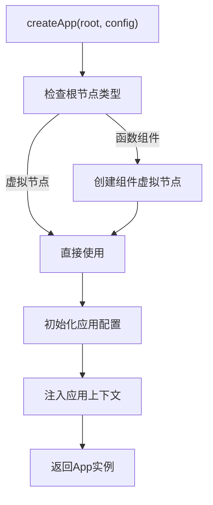
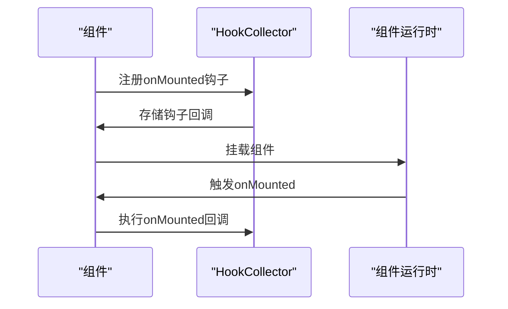
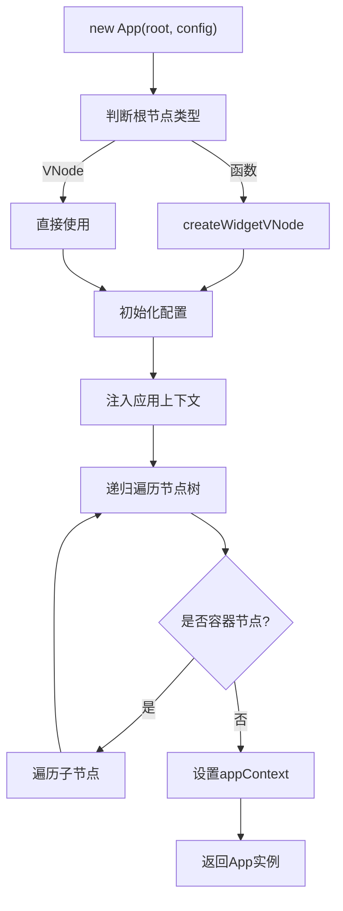
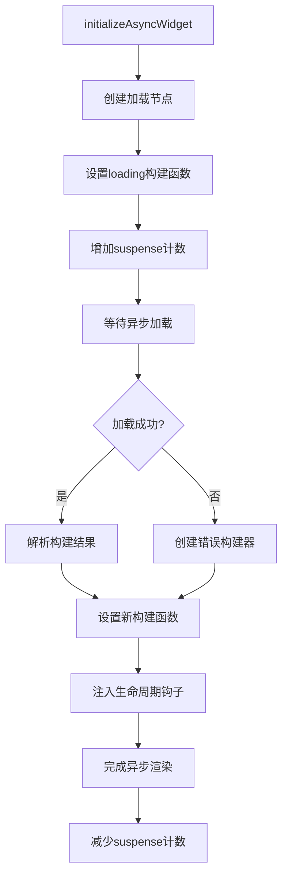
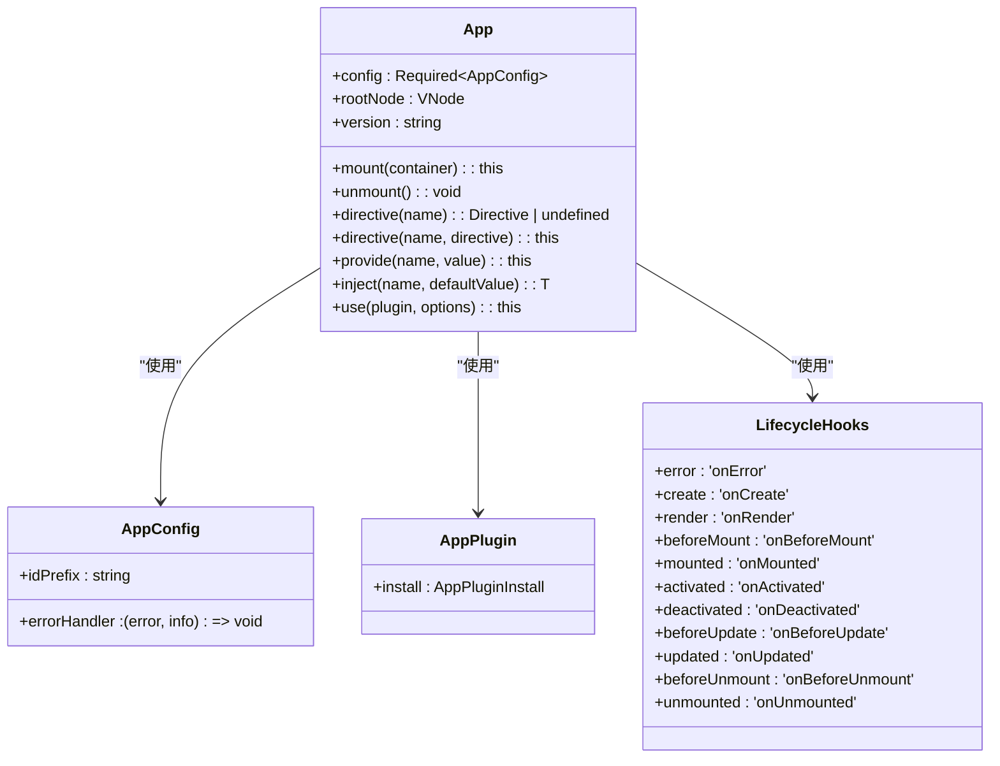

# 组件API

<cite>
**本文档引用的文件**
- [App.ts](file://packages/runtime-core/src/app/App.ts)
- [hook.ts](file://packages/runtime-core/src/runtime/hook.ts)
- [FnWidget.ts](file://packages/runtime-core/src/widget/base/FnWidget.ts)
- [factory.ts](file://packages/runtime-dom/src/client/factory.ts)
- [Lazy.ts](file://packages/runtime-core/src/widget/widgets/Lazy.ts)
- [hook.test.ts](file://packages/runtime-core/__tests__/runtime/hook.test.ts)
- [App.test.ts](file://packages/runtime-core/__tests__/app/App.test.ts)
</cite>

## 目录
1. [应用与组件定义接口](#应用与组件定义接口)
2. [生命周期钩子函数](#生命周期钩子函数)
3. [组件初始化流程](#组件初始化流程)
4. [异步组件实现机制](#异步组件实现机制)
5. [类型定义与使用示例](#类型定义与使用示例)

## 应用与组件定义接口

vitarx框架提供了`createApp`、`defineComponent`和`defineAsyncComponent`等核心API用于应用和组件的定义。这些接口构成了框架的入口点和组件系统的基础。

`createApp`函数是创建应用实例的主要方式，它封装了`App`类的实例化过程，并在运行时环境中注册了必要的渲染器和节点控制器。该函数接受根组件或虚拟节点作为参数，并可选地接收应用配置对象。

**Diagram sources**
- [factory.ts](file://packages/runtime-dom/src/client/factory.ts#L36-L38)
- [App.ts](file://packages/runtime-core/src/app/App.ts#L132-L141)

**Section sources**
- [factory.ts](file://packages/runtime-dom/src/client/factory.ts#L1-L38)
- [App.ts](file://packages/runtime-core/src/app/App.ts#L107-L141)

## 生命周期钩子函数

vitarx框架提供了一系列生命周期钩子函数，允许开发者在组件生命周期的关键时刻执行自定义逻辑。这些钩子函数包括`onMounted`、`onUnmounted`、`onUpdated`等，它们通过`HookCollector`类进行管理和调度。

生命周期钩子的执行机制基于`LifecycleHooks`枚举和`createLifecycleHook`工厂函数。每个钩子函数在注册时都会被添加到当前组件实例的上下文中，并在相应的生命周期阶段被调用。

**Diagram sources**
- [hook.ts](file://packages/runtime-core/src/runtime/hook.ts#L123-L134)
- [hook.ts](file://packages/runtime-core/src/runtime/hook.ts#L152-L184)

**Section sources**
- [hook.ts](file://packages/runtime-core/src/runtime/hook.ts#L1-L266)
- [hook.test.ts](file://packages/runtime-core/__tests__/runtime/hook.test.ts#L1-L106)

## 组件初始化流程

组件的初始化流程从`createApp`调用开始，经过应用实例的创建、配置初始化、上下文注入，最终完成组件的挂载。整个流程确保了组件树的正确构建和生命周期的有序执行。

应用实例的构造函数首先根据传入的根节点类型创建相应的虚拟节点，然后初始化应用配置，最后为虚拟节点树注入应用上下文。上下文注入是一个递归过程，确保每个节点都能访问到其所属的应用实例。

**Diagram sources**
- [App.ts](file://packages/runtime-core/src/app/App.ts#L132-L168)
- [App.ts](file://packages/runtime-core/src/app/App.ts#L216-L223)

**Section sources**
- [App.ts](file://packages/runtime-core/src/app/App.ts#L107-L234)
- [App.test.ts](file://packages/runtime-core/__tests__/app/App.test.ts#L81-L228)

## 异步组件实现机制

异步组件通过`defineAsyncComponent`实现，其核心机制在`Lazy`组件和`FnWidget`类中完成。异步组件支持延迟加载、超时处理和错误回退，提供了完整的异步加载解决方案。

`initializeAsyncWidget`函数负责处理异步组件的初始化过程。它首先显示加载状态，然后等待异步加载完成，最后更新组件的构建函数。在整个过程中，还集成了`suspense`机制，确保加载状态的正确管理。

**Diagram sources**
- [FnWidget.ts](file://packages/runtime-core/src/widget/base/FnWidget.ts#L215-L256)
- [Lazy.ts](file://packages/runtime-core/src/widget/widgets/Lazy.ts#L152-L185)

**Section sources**
- [FnWidget.ts](file://packages/runtime-core/src/widget/base/FnWidget.ts#L203-L281)
- [Lazy.ts](file://packages/runtime-core/src/widget/widgets/Lazy.ts#L1-L185)

## 类型定义与使用示例

vitarx框架提供了完整的类型定义，确保了API使用的类型安全。核心类型包括`AppConfig`、`AppPlugin`、`LifecycleHooks`等，它们定义了应用配置、插件系统和生命周期钩子的结构。

**Diagram sources**
- [App.ts](file://packages/runtime-core/src/app/App.ts#L20-L36)
- [hook.ts](file://packages/runtime-core/src/runtime/hook.ts#L123-L134)
- [hook.ts](file://packages/runtime-core/src/constants/hook.ts#L2-L14)

**Section sources**
- [App.ts](file://packages/runtime-core/src/app/App.ts#L1-L394)
- [hook.ts](file://packages/runtime-core/src/runtime/hook.ts#L1-L266)
- [types/lifecycle.ts](file://packages/runtime-core/src/types/lifecycle.ts#L1-L139)