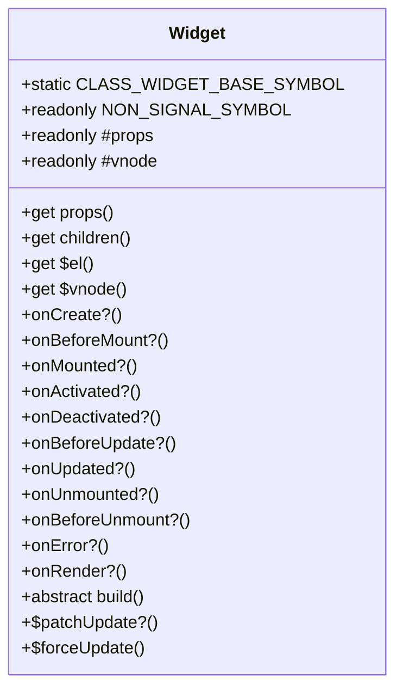
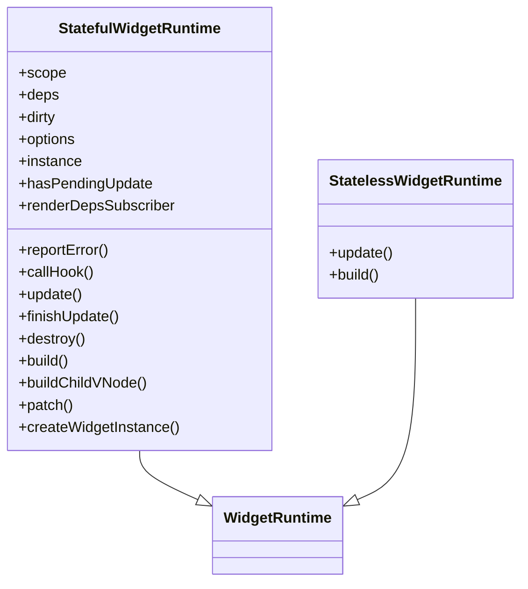
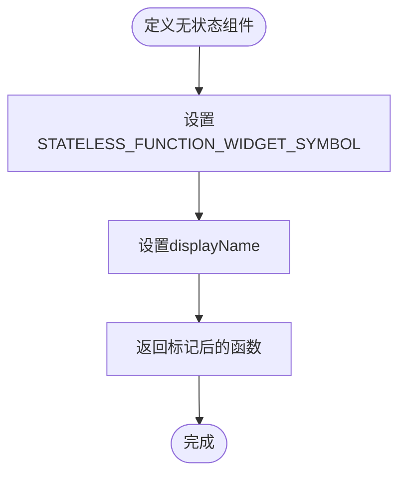
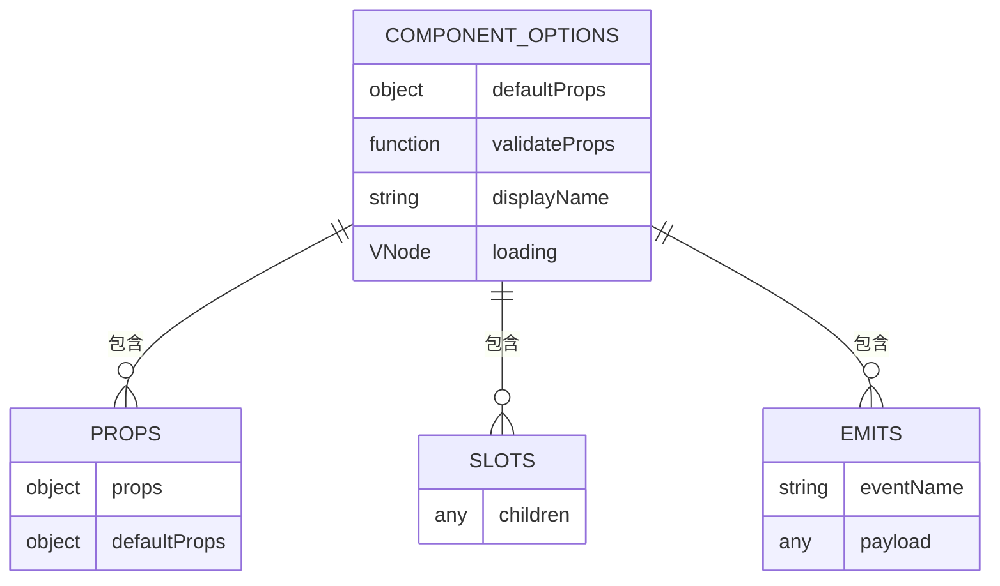
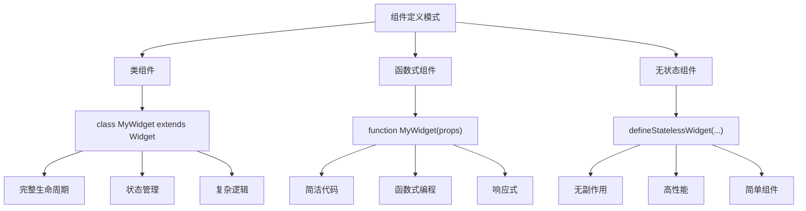
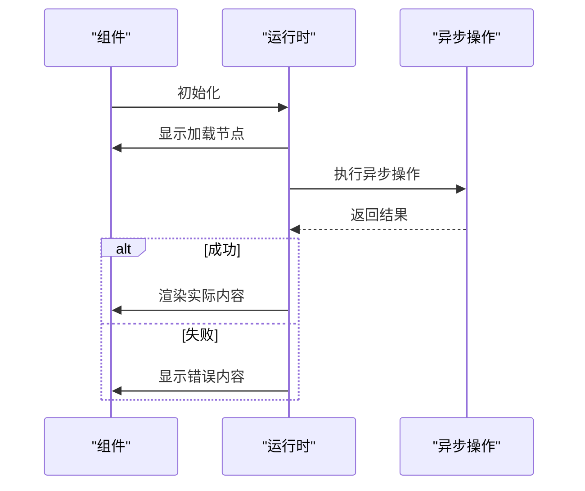

# 组件定义

<cite>
**本文档引用的文件**  
- [Widget.ts](file://packages/runtime-core/src/widget/base/Widget.ts)
- [FnWidget.ts](file://packages/runtime-core/src/widget/base/FnWidget.ts)
- [Stateful.ts](file://packages/runtime-core/src/widget/runtime/Stateful.ts)
- [Stateless.ts](file://packages/runtime-core/src/widget/runtime/Stateless.ts)
- [widget.ts](file://packages/runtime-core/src/types/widget.ts)
- [utils.ts](file://packages/runtime-core/src/utils/widget.ts)
- [widget.ts](file://packages/runtime-core/src/constants/widget.ts)
</cite>

## 目录
1. [引言](#引言)
2. [组件定义方式](#组件定义方式)
3. [Widget基类设计原理](#widget基类设计原理)
4. [组件渲染机制](#组件渲染机制)
5. [defineComponent辅助函数](#definecomponent辅助函数)
6. [组件选项处理](#组件选项处理)
7. [组件定义模式](#组件定义模式)
8. [异步组件](#异步组件)
9. [最佳实践](#最佳实践)

## 引言
vitarx框架提供了一套完整的组件系统，支持类组件和函数式组件两种定义方式。本文档将深入分析框架中组件的定义机制，包括基类设计、渲染流程、类型推导等核心概念，帮助开发者更好地理解和使用vitarx的组件系统。

## 组件定义方式
vitarx框架支持多种组件定义方式，主要包括类组件和函数式组件。类组件通过继承Widget基类实现，而函数式组件则通过函数定义。框架还提供了defineStatelessWidget等辅助函数来定义无状态组件。

**Section sources**
- [Widget.ts](file://packages/runtime-core/src/widget/base/Widget.ts#L45-L371)
- [utils.ts](file://packages/runtime-core/src/utils/widget.ts#L38-L47)

## Widget基类设计原理
Widget基类是所有有状态组件的基类，采用泛型设计来支持类型推导。基类通过InputProps和DefaultProps两个泛型参数来处理组件属性的类型定义，解决了TypeScript类型推导中的常见问题。

基类设计中包含了多个关键特性：
- 使用只读属性存储组件传入的属性
- 提供虚拟节点和DOM元素的访问接口
- 定义了完整的生命周期钩子
- 支持强制更新机制

**Diagram sources**
- [Widget.ts](file://packages/runtime-core/src/widget/base/Widget.ts#L45-L371)

**Section sources**
- [Widget.ts](file://packages/runtime-core/src/widget/base/Widget.ts#L45-L371)

## 组件渲染机制
vitarx框架的组件渲染机制基于虚拟DOM和响应式系统。组件通过build方法生成虚拟DOM，框架会根据虚拟DOM的差异进行高效的DOM更新。

有状态组件使用StatefulWidgetRuntime管理器来处理渲染，该管理器负责：
- 生命周期钩子的调用
- 依赖追踪和自动更新
- 错误处理和报告
- 视图更新调度

无状态组件则使用StatelessWidgetRuntime管理器，其渲染机制更为简单直接。

**Diagram sources**
- [Stateful.ts](file://packages/runtime-core/src/widget/runtime/Stateful.ts#L61-L361)
- [Stateless.ts](file://packages/runtime-core/src/widget/runtime/Stateless.ts#L24-L66)

**Section sources**
- [Stateful.ts](file://packages/runtime-core/src/widget/runtime/Stateful.ts#L61-L361)
- [Stateless.ts](file://packages/runtime-core/src/widget/runtime/Stateless.ts#L24-L66)

## defineComponent辅助函数
框架提供了defineStatelessWidget辅助函数来定义无状态组件。该函数通过在函数对象上设置特殊符号来标记组件类型，同时支持设置组件名称。

defineStatelessWidget函数的主要功能包括：
- 标记函数为无状态组件
- 设置组件显示名称
- 保持函数的原始类型签名

**Diagram sources**
- [utils.ts](file://packages/runtime-core/src/utils/widget.ts#L38-L47)

**Section sources**
- [utils.ts](file://packages/runtime-core/src/utils/widget.ts#L38-L47)

## 组件选项处理
vitarx框架通过WidgetOptions接口定义组件的可选配置项，包括默认属性、属性验证、显示名称和加载状态节点等。

props属性通过只读代理实现，支持默认值的动态注入。框架在开发模式下会执行属性验证，确保组件使用的正确性。

slots机制通过children属性实现，组件可以通过this.children访问插槽内容。emits机制则通过事件系统实现，组件可以触发自定义事件。

**Diagram sources**
- [widget.ts](file://packages/runtime-core/src/types/widget.ts#L20-L89)

**Section sources**
- [widget.ts](file://packages/runtime-core/src/types/widget.ts#L20-L89)

## 组件定义模式
vitarx框架支持多种组件定义模式，开发者可以根据具体需求选择合适的模式。

类组件模式适合复杂的有状态组件，提供完整的面向对象特性。函数式组件模式适合简单的展示组件，代码更加简洁。无状态组件模式则用于纯函数式的组件，不包含任何副作用。

**Diagram sources**
- [Widget.ts](file://packages/runtime-core/src/widget/base/Widget.ts#L45-L371)
- [utils.ts](file://packages/runtime-core/src/utils/widget.ts#L38-L47)

**Section sources**
- [Widget.ts](file://packages/runtime-core/src/widget/base/Widget.ts#L45-L371)
- [utils.ts](file://packages/runtime-core/src/utils/widget.ts#L38-L47)

## 异步组件
vitarx框架通过FnWidget类支持异步组件。异步组件在初始化时会显示加载状态，待异步操作完成后才渲染实际内容。

异步组件的实现机制包括：
- 使用Promise处理异步操作
- 显示加载节点作为占位符
- 完成后替换为实际内容
- 支持错误处理和重试

**Diagram sources**
- [FnWidget.ts](file://packages/runtime-core/src/widget/base/FnWidget.ts#L44-L281)

**Section sources**
- [FnWidget.ts](file://packages/runtime-core/src/widget/base/FnWidget.ts#L44-L281)

## 最佳实践
在使用vitarx框架定义组件时，建议遵循以下最佳实践：

1. **选择合适的组件类型**：根据组件的复杂度和需求选择类组件或函数式组件
2. **合理使用生命周期钩子**：在适当的时机执行相应的操作
3. **优化性能**：避免不必要的重新渲染，合理使用无状态组件
4. **类型安全**：充分利用TypeScript的类型系统，确保类型安全
5. **错误处理**：实现onError钩子，提供优雅的错误处理机制

通过遵循这些最佳实践，可以构建出可复用、高性能的UI组件。

**Section sources**
- [Widget.ts](file://packages/runtime-core/src/widget/base/Widget.ts#L45-L371)
- [FnWidget.ts](file://packages/runtime-core/src/widget/base/FnWidget.ts#L44-L281)
- [Stateful.ts](file://packages/runtime-core/src/widget/runtime/Stateful.ts#L61-L361)
- [Stateless.ts](file://packages/runtime-core/src/widget/runtime/Stateless.ts#L24-L66)