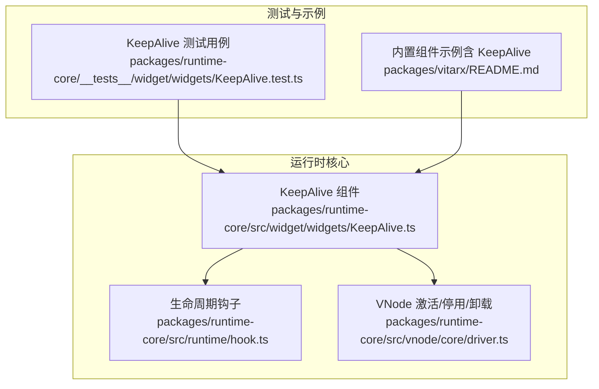
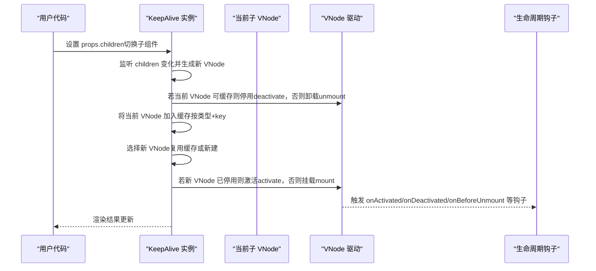
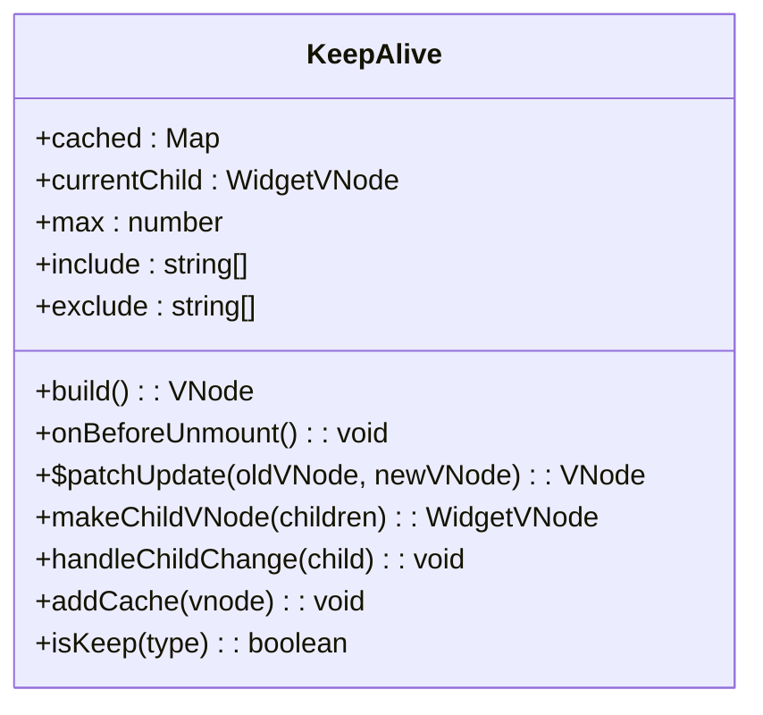
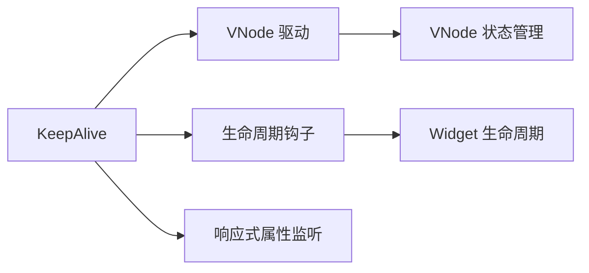
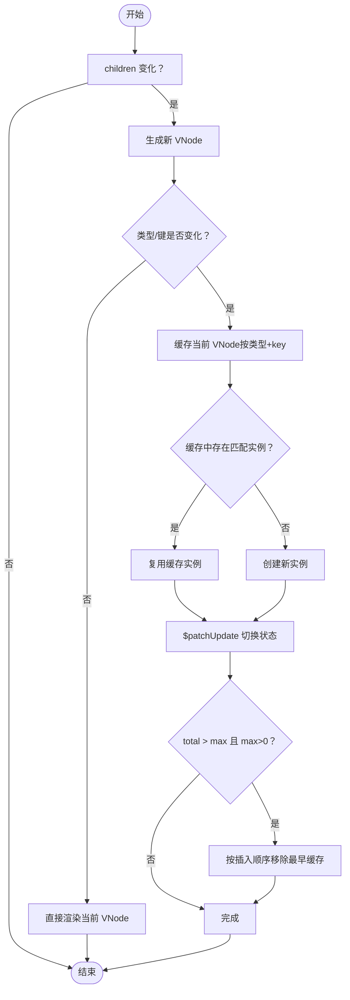

# KeepAlive

<cite>
**本文引用的文件**
- [KeepAlive.ts](file://packages/runtime-core/src/widget/widgets/KeepAlive.ts)
- [driver.ts](file://packages/runtime-core/src/vnode/core/driver.ts)
- [hook.ts](file://packages/runtime-core/src/runtime/hook.ts)
- [KeepAlive.test.ts](file://packages/runtime-core/__tests__/widget/widgets/KeepAlive.test.ts)
- [README.md](file://packages/vitarx/README.md)
</cite>

## 目录
1. [简介](#简介)
2. [项目结构](#项目结构)
3. [核心组件](#核心组件)
4. [架构概览](#架构概览)
5. [详细组件分析](#详细组件分析)
6. [依赖分析](#依赖分析)
7. [性能考量](#性能考量)
8. [故障排查指南](#故障排查指南)
9. [结论](#结论)
10. [附录](#附录)

## 简介
KeepAlive 是 Vitarx 框架提供的缓存组件实例的内置组件，旨在减少频繁切换时的创建/销毁开销，提升交互性能。它通过监听 props.children 的变化，在组件切换时对“可缓存”的子组件进行停用而非卸载，从而在后续切换回该组件时可直接复用，避免重建带来的性能损耗。同时，KeepAlive 支持基于 include/exclude 的精细化缓存控制，以及基于 max 的 LRU 风格容量限制，确保缓存规模可控。

## 项目结构
KeepAlive 位于运行时核心包中，属于小部件（Widget）体系的一部分；其生命周期钩子与节点激活/停用/卸载由运行时 VNode 驱动层提供支持。

图表来源
- [KeepAlive.ts](file://packages/runtime-core/src/widget/widgets/KeepAlive.ts#L1-L334)
- [driver.ts](file://packages/runtime-core/src/vnode/core/driver.ts#L86-L129)
- [hook.ts](file://packages/runtime-core/src/runtime/hook.ts#L136-L179)
- [KeepAlive.test.ts](file://packages/runtime-core/__tests__/widget/widgets/KeepAlive.test.ts#L1-L549)
- [README.md](file://packages/vitarx/README.md#L497-L547)

章节来源
- [KeepAlive.ts](file://packages/runtime-core/src/widget/widgets/KeepAlive.ts#L1-L334)
- [driver.ts](file://packages/runtime-core/src/vnode/core/driver.ts#L86-L129)
- [hook.ts](file://packages/runtime-core/src/runtime/hook.ts#L136-L179)
- [KeepAlive.test.ts](file://packages/runtime-core/__tests__/widget/widgets/KeepAlive.test.ts#L1-L549)
- [README.md](file://packages/vitarx/README.md#L497-L547)

## 核心组件
- KeepAlive 类：负责缓存子组件实例、监听 children 变化、按规则决定缓存/复用/卸载，并在切换时触发激活/停用。
- VNode 驱动：提供 activateNode/deactivateNode/unmountNode 等底层操作，配合 KeepAlive 完成节点状态转换。
- 生命周期钩子：onActivated/onDeactivated/onBeforeUnmount 等，供被缓存组件在停用/激活/卸载时感知。

章节来源
- [KeepAlive.ts](file://packages/runtime-core/src/widget/widgets/KeepAlive.ts#L119-L334)
- [driver.ts](file://packages/runtime-core/src/vnode/core/driver.ts#L86-L129)
- [hook.ts](file://packages/runtime-core/src/runtime/hook.ts#L136-L179)

## 架构概览
KeepAlive 的工作流围绕“监听 children 变化 -> 切换组件 -> 缓存/复用/卸载 -> 触发生命周期钩子”展开。下图展示了关键调用序列：

图表来源
- [KeepAlive.ts](file://packages/runtime-core/src/widget/widgets/KeepAlive.ts#L214-L237)
- [driver.ts](file://packages/runtime-core/src/vnode/core/driver.ts#L86-L129)
- [hook.ts](file://packages/runtime-core/src/runtime/hook.ts#L136-L179)

## 详细组件分析

### KeepAlive 类与缓存机制
- 缓存结构：以 Map<组件类型, Map<唯一键, VNode>> 维护缓存，支持同一类型下多实例缓存（按 key 区分）。
- 切换逻辑：当 children 变化且类型或 key 不同时，先将当前 VNode 缓存，再尝试从缓存中复用；若无缓存则新建。
- LRU 容量控制：当 total 缓存数量超过 max（max>0 时生效）时，按插入顺序移除最早缓存项，直到满足上限。
- 缓存判定：优先检查 exclude（命中即不缓存），其次 include（空列表表示全部缓存，否则仅缓存 include 列表中的类型）。
- 卸载清理：组件卸载时遍历缓存并卸载所有非当前 VNode 的缓存实例，随后清空缓存。

章节来源
- [KeepAlive.ts](file://packages/runtime-core/src/widget/widgets/KeepAlive.ts#L119-L334)

### 属性与默认值
- children：必填，支持 Widget 类型或 WidgetVNode；用于指定当前展示的子组件。
- include：数组，指定需要缓存的组件类型列表；空数组表示全部缓存。
- exclude：数组，指定排除缓存的组件类型列表；优先级高于 include。
- max：数值，最大缓存数量；小于 1 表示不限制。

章节来源
- [KeepAlive.ts](file://packages/runtime-core/src/widget/widgets/KeepAlive.ts#L25-L73)

### 生命周期钩子与状态流转
- onActivated：组件从停用状态恢复时触发，用于恢复状态或重新订阅副作用。
- onDeactivated：组件被停用时触发，用于暂停副作用、释放资源。
- onBeforeUnmount：组件实例销毁前触发，用于清理资源。
- KeepAlive 在切换时会调用 VNode 驱动的 activateNode/deactivateNode/unmountNode，从而触发上述钩子。

章节来源
- [hook.ts](file://packages/runtime-core/src/runtime/hook.ts#L136-L179)
- [driver.ts](file://packages/runtime-core/src/vnode/core/driver.ts#L86-L129)
- [KeepAlive.ts](file://packages/runtime-core/src/widget/widgets/KeepAlive.ts#L214-L237)

### 监听 props.children 的变化
- KeepAlive 在构造时将当前 children 转换为 VNode，并通过属性变更监听机制（onPropChange）监听 children 的变化。
- 当 children 变化时，生成新 VNode，对比类型与 key，决定缓存/复用/卸载与激活/挂载。

章节来源
- [KeepAlive.ts](file://packages/runtime-core/src/widget/widgets/KeepAlive.ts#L135-L141)
- [KeepAlive.ts](file://packages/runtime-core/src/widget/widgets/KeepAlive.ts#L256-L282)

### include/exclude 优先级与缓存判定
- 优先级：exclude 优先于 include；即若某类型被 include 也出现在 exclude，则不缓存。
- 空 include：表示允许缓存所有类型。
- isKeep 判定：先检查 exclude，再检查 include（空列表视为允许）。

章节来源
- [KeepAlive.ts](file://packages/runtime-core/src/widget/widgets/KeepAlive.ts#L178-L186)

### LRU 容量控制与 FIFO 移除
- 当 total 缓存数量超过 max（max>0）时，按插入顺序移除最早缓存项；若该类型缓存清空则移除该类型映射。
- 该策略确保缓存规模可控，避免无限增长。

章节来源
- [KeepAlive.ts](file://packages/runtime-core/src/widget/widgets/KeepAlive.ts#L309-L331)

### $patchUpdate 与节点状态转换
- 当新旧 VNode 状态不一致时，$patchUpdate 会：
  - 若旧 VNode 处于激活状态，先停用（deactivate）；
  - 若新 VNode 处于停用状态，直接激活（activate）；
  - 否则进行挂载（mount）。
- 该流程保证切换时的节点状态一致性与生命周期钩子的正确触发。

章节来源
- [KeepAlive.ts](file://packages/runtime-core/src/widget/widgets/KeepAlive.ts#L214-L237)
- [driver.ts](file://packages/runtime-core/src/vnode/core/driver.ts#L86-L129)

### 类图（KeepAlive 与相关类型）

图表来源
- [KeepAlive.ts](file://packages/runtime-core/src/widget/widgets/KeepAlive.ts#L119-L334)

## 依赖分析
- 与 VNode 驱动的耦合：通过 activateNode/deactivateNode/mountNode/unmountNode 控制节点状态与生命周期。
- 与生命周期钩子的耦合：通过 onActivated/onDeactivated/onBeforeUnmount 触发组件内部逻辑。
- 与响应式系统的耦合：通过 onPropChange 监听 children 变化，结合调度器 flushSync 确保更新顺序。

图表来源
- [KeepAlive.ts](file://packages/runtime-core/src/widget/widgets/KeepAlive.ts#L135-L141)
- [driver.ts](file://packages/runtime-core/src/vnode/core/driver.ts#L86-L129)
- [hook.ts](file://packages/runtime-core/src/runtime/hook.ts#L136-L179)

章节来源
- [KeepAlive.ts](file://packages/runtime-core/src/widget/widgets/KeepAlive.ts#L119-L334)
- [driver.ts](file://packages/runtime-core/src/vnode/core/driver.ts#L86-L129)
- [hook.ts](file://packages/runtime-core/src/runtime/hook.ts#L136-L179)

## 性能考量
- 缓存命中率：通过 include/exclude 精细化控制，避免缓存昂贵或无状态组件，提升命中率。
- LRU 限制：max 控制缓存规模，防止内存膨胀；FIFO 移除策略简单高效。
- 切换成本：停用/激活比卸载/重建更轻量，适合频繁切换的场景（如标签页、路由）。
- 建议：
  - 对频繁切换且状态重要的组件启用缓存。
  - 对高内存占用组件谨慎使用 include，必要时设置较小的 max。
  - 对仅一次性使用的组件使用 exclude，避免无谓缓存。

[本节为通用指导，无需列出章节来源]

## 故障排查指南
- children 必填：若未提供 children，将抛出类型错误；请确保传入有效组件或 VNode。
- children 类型：必须为 Widget 或 WidgetVNode；否则抛出类型错误。
- 缓存未生效：检查 include/exclude 是否覆盖目标组件类型；确认 max 是否过小导致被移除。
- 切换后状态异常：确认组件是否正确实现 onActivated/onDeactivated/onBeforeUnmount，并在停用时暂停副作用、在激活时恢复。
- 卸载后仍有残留：确认 onBeforeUnmount 是否被触发，以及缓存是否被清空。

章节来源
- [KeepAlive.ts](file://packages/runtime-core/src/widget/widgets/KeepAlive.ts#L170-L177)
- [KeepAlive.test.ts](file://packages/runtime-core/__tests__/widget/widgets/KeepAlive.test.ts#L17-L35)
- [KeepAlive.test.ts](file://packages/runtime-core/__tests__/widget/widgets/KeepAlive.test.ts#L360-L395)

## 结论
KeepAlive 通过“停用而非卸载 + LRU 缓存 + 精细化 include/exclude + max 限制”的组合，显著降低了频繁切换组件时的性能开销。配合 onActivated/onDeactivated 等生命周期钩子，可实现组件状态的平滑恢复与清理。合理配置 include/exclude 与 max，可在性能与内存之间取得平衡。

[本节为总结，无需列出章节来源]

## 附录

### 属性与默认值一览
- children：必填，Widget 或 WidgetVNode
- include：string[]，默认 []
- exclude：string[]，默认 []
- max：number，默认 10

章节来源
- [KeepAlive.ts](file://packages/runtime-core/src/widget/widgets/KeepAlive.ts#L25-L73)

### 插槽使用方式
- KeepAlive 支持通过 children 属性传入子组件，也支持通过插槽传入子组件；两种方式等价。

章节来源
- [KeepAlive.ts](file://packages/runtime-core/src/widget/widgets/KeepAlive.ts#L25-L47)

### 典型应用场景与示例路径
- 标签页切换：在多个面板间切换时缓存面板组件，避免重复创建。
- 路由组件缓存：在路由切换时缓存页面组件，提升切换体验。
- 示例参考路径：
  - 内置组件示例（含 KeepAlive）：[示例路径](file://packages/vitarx/README.md#L497-L547)
  - KeepAlive 行为测试（含 include/exclude/max/生命周期钩子）：[测试路径](file://packages/runtime-core/__tests__/widget/widgets/KeepAlive.test.ts#L1-L549)

章节来源
- [README.md](file://packages/vitarx/README.md#L497-L547)
- [KeepAlive.test.ts](file://packages/runtime-core/__tests__/widget/widgets/KeepAlive.test.ts#L1-L549)

### 关键流程图（切换与缓存）

图表来源
- [KeepAlive.ts](file://packages/runtime-core/src/widget/widgets/KeepAlive.ts#L256-L331)