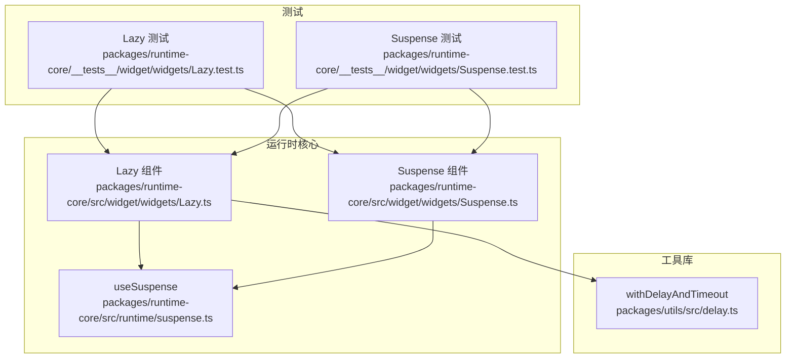
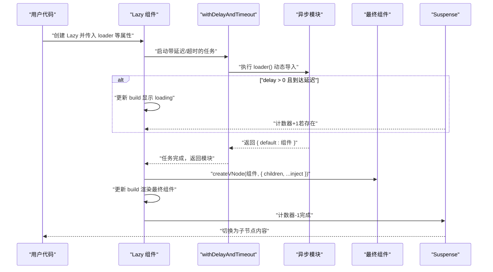
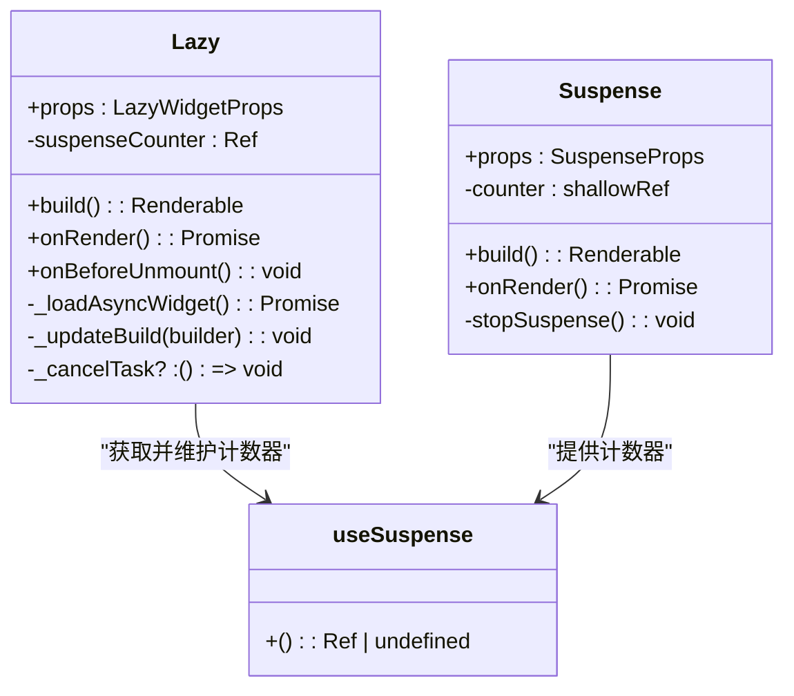
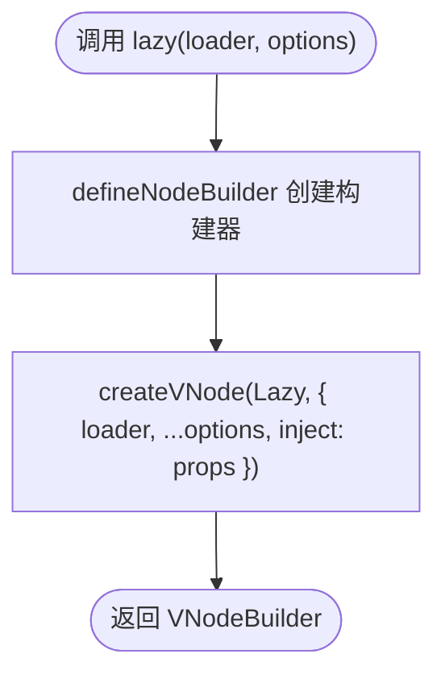
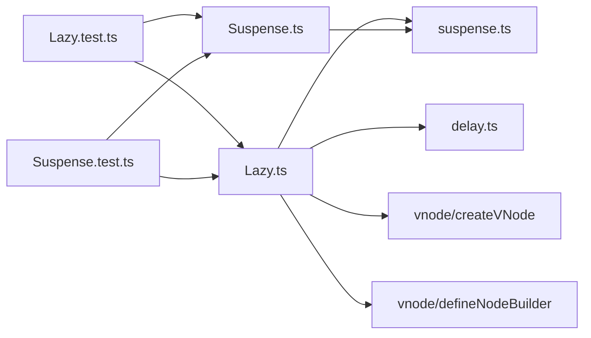

# Lazy

<cite>
**本文引用的文件列表**
- [Lazy.ts](file://packages/runtime-core/src/widget/widgets/Lazy.ts)
- [Suspense.ts](file://packages/runtime-core/src/widget/widgets/Suspense.ts)
- [suspense.ts](file://packages/runtime-core/src/runtime/suspense.ts)
- [delay.ts](file://packages/utils/src/delay.ts)
- [Lazy.test.ts](file://packages/runtime-core/__tests__/widget/widgets/Lazy.test.ts)
- [Suspense.test.ts](file://packages/runtime-core/__tests__/widget/widgets/Suspense.test.ts)
- [index.ts](file://packages/runtime-core/src/index.ts)
- [widget/index.ts](file://packages/runtime-core/src/widget/index.ts)
</cite>

## 目录
1. [简介](#简介)
2. [项目结构](#项目结构)
3. [核心组件](#核心组件)
4. [架构总览](#架构总览)
5. [组件详解](#组件详解)
6. [依赖关系分析](#依赖关系分析)
7. [性能考量](#性能考量)
8. [故障排查指南](#故障排查指南)
9. [结论](#结论)
10. [附录](#附录)

## 简介
本篇文档系统性介绍 Vitarx 中的 Lazy 惰性加载组件及其辅助函数 lazy()。Lazy 通过动态导入（dynamic import）与代码分包（code-splitting）实现按需加载，显著优化首屏性能；同时提供 loading、delay、timeout、onError 等能力，支持与 Suspense 协作，实现优雅的异步组件加载体验。便捷的 lazy() 工具函数可将异步模块以更简洁的语法定义为可复用的惰性组件，并自动透传 props。

## 项目结构
- Lazy 组件位于运行时核心包的 widget/widgets 下，提供类组件形式的惰性加载能力；
- lazy() 工具函数同样位于同一文件，用于快速生成惰性组件；
- Suspense 组件负责在异步子树加载期间展示回退内容，并与 Lazy 的 Suspense 计数器协作；
- withDelayAndTimeout 由工具库提供，为 Lazy 的延迟与超时控制提供底层支持；
- 测试覆盖了 Lazy 的加载、延迟、超时、错误处理、与 Suspense 的集成等关键行为。

图表来源
- [Lazy.ts](file://packages/runtime-core/src/widget/widgets/Lazy.ts#L1-L235)
- [Suspense.ts](file://packages/runtime-core/src/widget/widgets/Suspense.ts#L1-L184)
- [suspense.ts](file://packages/runtime-core/src/runtime/suspense.ts#L1-L13)
- [delay.ts](file://packages/utils/src/delay.ts#L1-L144)
- [Lazy.test.ts](file://packages/runtime-core/__tests__/widget/widgets/Lazy.test.ts#L1-L415)
- [Suspense.test.ts](file://packages/runtime-core/__tests__/widget/widgets/Suspense.test.ts#L1-L300)

章节来源
- [Lazy.ts](file://packages/runtime-core/src/widget/widgets/Lazy.ts#L1-L235)
- [Suspense.ts](file://packages/runtime-core/src/widget/widgets/Suspense.ts#L1-L184)
- [suspense.ts](file://packages/runtime-core/src/runtime/suspense.ts#L1-L13)
- [delay.ts](file://packages/utils/src/delay.ts#L1-L144)
- [Lazy.test.ts](file://packages/runtime-core/__tests__/widget/widgets/Lazy.test.ts#L1-L415)
- [Suspense.test.ts](file://packages/runtime-core/__tests__/widget/widgets/Suspense.test.ts#L1-L300)

## 核心组件
- Lazy 组件：接收 loader（返回 Promise<{ default: Widget }> 的异步函数）、loading、delay、timeout、onError 等属性，内部通过 withDelayAndTimeout 实现延迟与超时控制，并在加载完成后将 children 与 inject 的 props 透传给最终组件。
- lazy() 工具函数：对 Lazy 进行封装，以更简洁的语法定义惰性组件，例如 const MyWidget = lazy(() => import('./MyWidget'))，并自动透传所有 props。
- Suspense 组件：在异步子树加载期间展示 fallback，与 Lazy 的 Suspense 计数器协同工作，实现优雅的加载过渡。

章节来源
- [Lazy.ts](file://packages/runtime-core/src/widget/widgets/Lazy.ts#L22-L78)
- [Lazy.ts](file://packages/runtime-core/src/widget/widgets/Lazy.ts#L99-L206)
- [Lazy.ts](file://packages/runtime-core/src/widget/widgets/Lazy.ts#L227-L234)
- [Suspense.ts](file://packages/runtime-core/src/widget/widgets/Suspense.ts#L1-L184)

## 架构总览
Lazy 与 Suspense 的协作流程如下：Lazy 在 onRender 中启动异步加载任务，若存在 loading 或 delay，则在延迟后显示 loading；当加载成功后，Lazy 将最终组件与 children、inject 的 props 一并渲染；同时，Lazy 通过 useSuspense 获取并维护 Suspense 计数器，确保 Suspense 能感知异步子树的加载状态并在完成时切换回退内容。

图表来源
- [Lazy.ts](file://packages/runtime-core/src/widget/widgets/Lazy.ts#L146-L194)
- [Lazy.ts](file://packages/runtime-core/src/widget/widgets/Lazy.ts#L160-L179)
- [delay.ts](file://packages/utils/src/delay.ts#L72-L144)
- [suspense.ts](file://packages/runtime-core/src/runtime/suspense.ts#L1-L13)
- [Suspense.ts](file://packages/runtime-core/src/widget/widgets/Suspense.ts#L84-L184)

## 组件详解

### Lazy 组件
- 属性与行为
  - loader：必须为返回 Promise<{ default: Widget }> 的异步函数，用于动态导入目标组件。
  - loading：可选的加载占位节点，仅在 delay 到达后显示。
  - delay：延迟显示 loading 的毫秒数，默认 200。
  - timeout：超时毫秒数，<=0 表示不限制；超时将触发 onError。
  - onError：错误处理钩子，可返回备用 UI 或返回 false 以继续抛出错误。
  - inject：需要透传给最终组件的属性集合。
  - children：原样透传给最终组件。
- 生命周期与渲染
  - onRender：启动异步加载任务。
  - build：初始渲染返回注释节点，表示“正在加载”。
  - _loadAsyncWidget：使用 withDelayAndTimeout 包装 loader，处理延迟、超时、错误与最终渲染。
  - _updateBuild：替换 build 并强制刷新，同时维护 Suspense 计数器。
  - onBeforeUnmount：取消未完成的加载任务。
- 与 Suspense 的协作
  - 构造函数中通过 useSuspense 获取计数器并自增，加载完成后自减，使 Suspense 能感知异步子树的完成状态。

图表来源
- [Lazy.ts](file://packages/runtime-core/src/widget/widgets/Lazy.ts#L99-L206)
- [Suspense.ts](file://packages/runtime-core/src/widget/widgets/Suspense.ts#L84-L184)
- [suspense.ts](file://packages/runtime-core/src/runtime/suspense.ts#L1-L13)

章节来源
- [Lazy.ts](file://packages/runtime-core/src/widget/widgets/Lazy.ts#L22-L78)
- [Lazy.ts](file://packages/runtime-core/src/widget/widgets/Lazy.ts#L99-L206)

### lazy() 工具函数
- 作用：将异步模块以简洁语法定义为惰性组件，自动透传所有 props。
- 用法要点
  - const MyWidget = lazy(() => import('./MyWidget'))。
  - 之后可直接以 JSX 标签使用，如 <MyWidget color="red">按钮</MyWidget>，color 与 children 会透传至最终组件。
- 内部实现
  - 通过 defineNodeBuilder 创建 VNodeBuilder，内部以 Lazy 渲染，将 loader 与 options 透传，并将外部传入的 props 合并到 inject 中。

图表来源
- [Lazy.ts](file://packages/runtime-core/src/widget/widgets/Lazy.ts#L227-L234)

章节来源
- [Lazy.ts](file://packages/runtime-core/src/widget/widgets/Lazy.ts#L227-L234)

### withDelayAndTimeout（延迟与超时控制）
- 作用：为任意 Promise 任务添加延迟显示与超时控制，支持取消。
- 关键特性
  - delay：延迟触发 onDelay 回调（通常用于显示 loading）。
  - timeout：超时触发 onTimeout 回调并拒绝任务。
  - cancel：返回的 Promise 具有 cancel 方法，可在组件卸载时安全取消任务。
- Lazy 的使用方式
  - Lazy 将 loader 作为任务传入，配置 delay 与 onDelay 用于延迟显示 loading，timeout 用于超时处理。

章节来源
- [delay.ts](file://packages/utils/src/delay.ts#L1-L144)
- [Lazy.ts](file://packages/runtime-core/src/widget/widgets/Lazy.ts#L159-L179)

### Suspense 集成
- Lazy 在构造函数中通过 useSuspense 获取计数器并自增；在加载完成后自减，从而驱动 Suspense 的回退内容切换。
- Suspense 提供 fallback、onResolved、onError 等能力，与 Lazy 协同实现优雅的加载体验。

章节来源
- [suspense.ts](file://packages/runtime-core/src/runtime/suspense.ts#L1-L13)
- [Suspense.ts](file://packages/runtime-core/src/widget/widgets/Suspense.ts#L1-L184)
- [Lazy.test.ts](file://packages/runtime-core/__tests__/widget/widgets/Lazy.test.ts#L199-L265)

## 依赖关系分析
- Lazy 依赖
  - 运行时工具：useSuspense（来自 runtime/suspense.ts）。
  - 工具库：withDelayAndTimeout（来自 utils/delay.ts）。
  - VNode 工具：createVNode、createCommentVNode、defineNodeBuilder（来自 runtime-core/vnode 与 types）。
- Lazy 与 Suspense 的耦合
  - 通过 provide/inject 机制共享 Suspense 计数器，实现异步子树状态的统一管理。
- lazy() 与 Lazy 的关系
  - lazy() 是 Lazy 的语法糖封装，二者在语义上完全等价，但 lazy() 更简洁易用。

图表来源
- [Lazy.ts](file://packages/runtime-core/src/widget/widgets/Lazy.ts#L1-L235)
- [Suspense.ts](file://packages/runtime-core/src/widget/widgets/Suspense.ts#L1-L184)
- [suspense.ts](file://packages/runtime-core/src/runtime/suspense.ts#L1-L13)
- [delay.ts](file://packages/utils/src/delay.ts#L1-L144)
- [Lazy.test.ts](file://packages/runtime-core/__tests__/widget/widgets/Lazy.test.ts#L1-L415)
- [Suspense.test.ts](file://packages/runtime-core/__tests__/widget/widgets/Suspense.test.ts#L1-L300)

章节来源
- [Lazy.ts](file://packages/runtime-core/src/widget/widgets/Lazy.ts#L1-L235)
- [Suspense.ts](file://packages/runtime-core/src/widget/widgets/Suspense.ts#L1-L184)
- [suspense.ts](file://packages/runtime-core/src/runtime/suspense.ts#L1-L13)
- [delay.ts](file://packages/utils/src/delay.ts#L1-L144)
- [Lazy.test.ts](file://packages/runtime-core/__tests__/widget/widgets/Lazy.test.ts#L1-L415)
- [Suspense.test.ts](file://packages/runtime-core/__tests__/widget/widgets/Suspense.test.ts#L1-L300)

## 性能考量
- 代码分包与按需加载：通过动态导入实现按需加载，减少首屏体积，提升首屏渲染速度。
- 延迟显示 loading：delay 可避免瞬时网络抖动导致的闪烁，改善用户体验。
- 超时控制：timeout 防止长时间阻塞，结合 onError 可降级为错误提示或重试策略。
- 取消未完成任务：onBeforeUnmount 中取消未完成的加载任务，避免内存泄漏与无效渲染。
- Suspense 与计数器：通过计数器精确跟踪异步子树状态，避免重复渲染与竞态问题。

章节来源
- [Lazy.ts](file://packages/runtime-core/src/widget/widgets/Lazy.ts#L141-L148)
- [Lazy.ts](file://packages/runtime-core/src/widget/widgets/Lazy.ts#L160-L179)
- [Suspense.ts](file://packages/runtime-core/src/widget/widgets/Suspense.ts#L84-L184)

## 故障排查指南
- loader 必须返回标准 ES Module 且包含 default 导出
  - 若模块未按规范导出 default，将触发错误并中断渲染。
- loading 必须为 VNode 对象
  - 传入非 VNode 会触发属性校验错误。
- delay 与 timeout 的取值
  - delay=0 时立即显示 loading；timeout<=0 表示不限制超时。
- onError 的返回值
  - 返回备用 UI 将替代错误堆栈；返回 false 将继续抛出错误。
- 卸载时的行为
  - 组件卸载会取消未完成的加载任务，避免后续更新。
- 与 Suspense 的集成
  - 若未包裹在 Suspense 中，Lazy 仍可工作；但无法利用回退内容与计数器联动。

章节来源
- [Lazy.ts](file://packages/runtime-core/src/widget/widgets/Lazy.ts#L124-L139)
- [Lazy.test.ts](file://packages/runtime-core/__tests__/widget/widgets/Lazy.test.ts#L30-L63)
- [Lazy.test.ts](file://packages/runtime-core/__tests__/widget/widgets/Lazy.test.ts#L176-L196)
- [Lazy.test.ts](file://packages/runtime-core/__tests__/widget/widgets/Lazy.test.ts#L267-L321)
- [Lazy.test.ts](file://packages/runtime-core/__tests__/widget/widgets/Lazy.test.ts#L323-L340)

## 结论
Lazy 与 lazy() 为 Vitarx 提供了完善的惰性加载与代码分包能力。通过 withDelayAndTimeout 的延迟与超时控制、useSuspense 的计数器协作，以及 Suspense 的回退内容展示，实现了从加载到渲染的完整、优雅的异步体验。lazy() 则进一步简化了开发者的使用成本，使惰性组件的定义与复用更加直观。

## 附录

### API 参考

- Lazy 组件
  - 属性
    - loader: () => Promise<{ default: Widget }>
    - loading?: VNode
    - delay?: number（默认 200）
    - timeout?: number（默认 0）
    - onError?: (error, info) => VNode | false
    - inject?: Record<string, any>
    - children?: any
  - 默认属性
    - delay: 200
    - timeout: 0
  - 生命周期
    - onRender(): 启动异步加载
    - build(): 初始返回注释节点
    - onBeforeUnmount(): 取消未完成任务
    - _loadAsyncWidget(): 执行加载与渲染
    - _updateBuild(builder): 替换构建函数并刷新

- lazy() 工具函数
  - 参数
    - loader: () => Promise<{ default: Widget }>
    - options?: LazyLoadOptions
  - 返回
    - VNodeBuilder<VNodeInputProps<T>, StatefulWidgetVNode<typeof Lazy<T>>>

- Suspense 组件
  - 属性
    - fallback?: VNode
    - children: VNode
    - onError?: (error, info) => VNode | false
    - onResolved?: () => void
  - 行为
    - 在异步子树加载期间显示 fallback
    - 子树完成后切换为子节点内容
    - 通过计数器与 Lazy 协作

章节来源
- [Lazy.ts](file://packages/runtime-core/src/widget/widgets/Lazy.ts#L22-L78)
- [Lazy.ts](file://packages/runtime-core/src/widget/widgets/Lazy.ts#L99-L206)
- [Lazy.ts](file://packages/runtime-core/src/widget/widgets/Lazy.ts#L227-L234)
- [Suspense.ts](file://packages/runtime-core/src/widget/widgets/Suspense.ts#L1-L184)

### 使用示例（路径指引）
- 基础用法（Lazy）
  - 参见测试文件中的基础加载与渲染示例路径：[Lazy.test.ts](file://packages/runtime-core/__tests__/widget/widgets/Lazy.test.ts#L65-L104)
- 透传 props（inject 与 children）
  - 参见测试文件中的透传示例路径：[Lazy.test.ts](file://packages/runtime-core/__tests__/widget/widgets/Lazy.test.ts#L106-L124)
- 延迟显示 loading
  - 参见测试文件中的延迟与 loading 显示示例路径：[Lazy.test.ts](file://packages/runtime-core/__tests__/widget/widgets/Lazy.test.ts#L126-L174)
- 超时与 onError
  - 参见测试文件中的超时与错误处理示例路径：[Lazy.test.ts](file://packages/runtime-core/__tests__/widget/widgets/Lazy.test.ts#L176-L196)、[Lazy.test.ts](file://packages/runtime-core/__tests__/widget/widgets/Lazy.test.ts#L267-L321)
- 与 Suspense 集成
  - 参见测试文件中的 Suspense 集成示例路径：[Lazy.test.ts](file://packages/runtime-core/__tests__/widget/widgets/Lazy.test.ts#L199-L265)、[Suspense.test.ts](file://packages/runtime-core/__tests__/widget/widgets/Suspense.test.ts#L233-L268)
- lazy() 便捷用法
  - 参见源码中的 lazy() 定义与注释示例路径：[Lazy.ts](file://packages/runtime-core/src/widget/widgets/Lazy.ts#L210-L234)