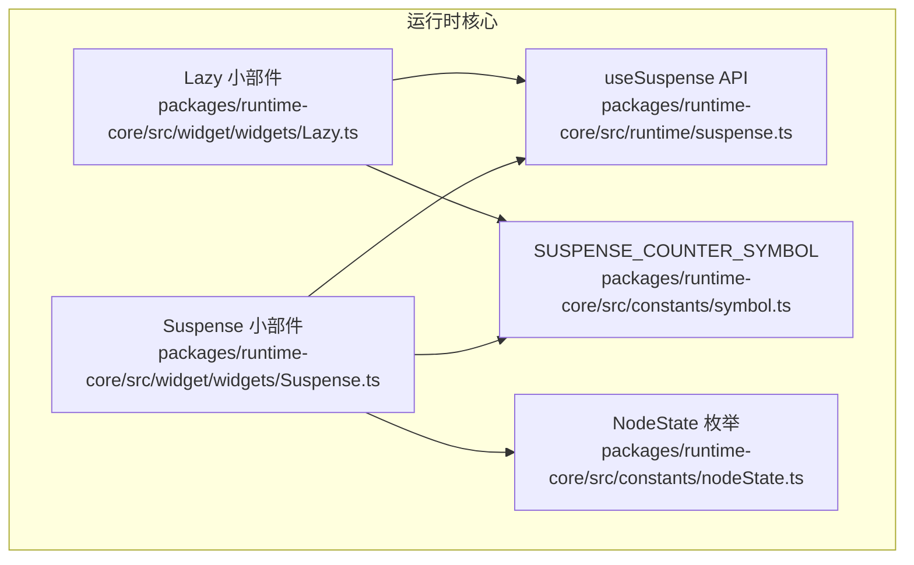
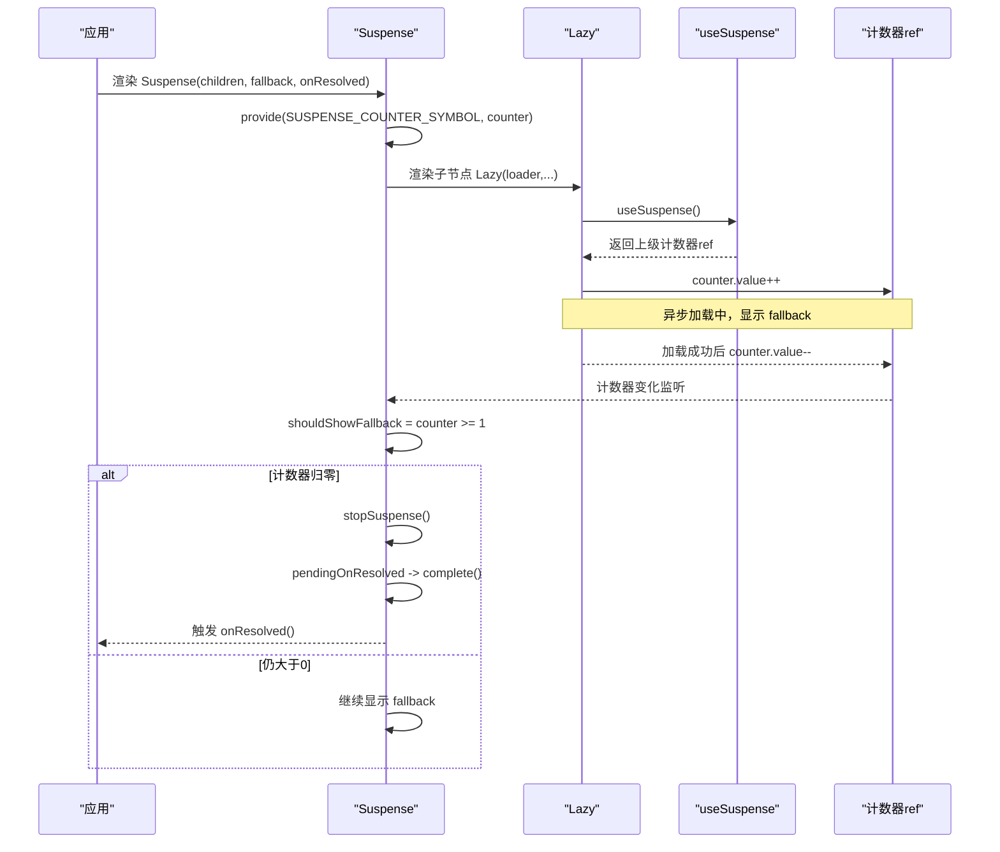
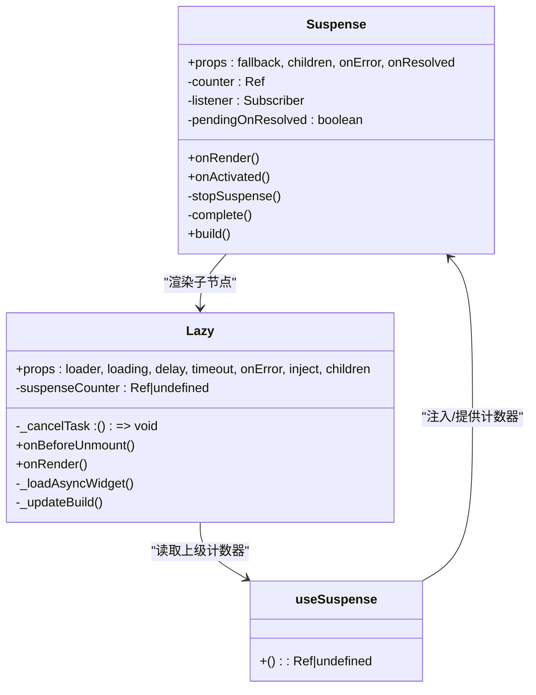

# Suspense

<cite>
**本文引用的文件**
- [packages/runtime-core/src/widget/widgets/Suspense.ts](file://packages/runtime-core/src/widget/widgets/Suspense.ts)
- [packages/runtime-core/src/runtime/suspense.ts](file://packages/runtime-core/src/runtime/suspense.ts)
- [packages/runtime-core/src/constants/symbol.ts](file://packages/runtime-core/src/constants/symbol.ts)
- [packages/runtime-core/src/widget/widgets/Lazy.ts](file://packages/runtime-core/src/widget/widgets/Lazy.ts)
- [packages/runtime-core/src/constants/nodeState.ts](file://packages/runtime-core/src/constants/nodeState.ts)
- [packages/runtime-core/__tests__/widget/widgets/Suspense.test.ts](file://packages/runtime-core/__tests__/widget/widgets/Suspense.test.ts)
</cite>

## 目录
1. [简介](#简介)
2. [项目结构](#项目结构)
3. [核心组件](#核心组件)
4. [架构总览](#架构总览)
5. [组件详解](#组件详解)
6. [依赖关系分析](#依赖关系分析)
7. [性能考量](#性能考量)
8. [故障排查指南](#故障排查指南)
9. [结论](#结论)
10. [附录](#附录)

## 简介
本篇文档系统化介绍 Vitarx 的 Suspense 组件，重点阐述其在异步组件加载期间显示 fallback 内容的机制、onResolved 回调在子节点首次渲染完成后触发的行为，以及在嵌套 Suspense 场景下基于 ref 计数器（SUSPENSE_COUNTER_SYMBOL）的协调管理。文档还覆盖与 Lazy 组件的集成、useSuspense API 的使用、卸载状态下的安全更新注意事项，以及在开发中处理异步数据加载的典型实践。

## 项目结构
Suspense 位于运行时核心包的 widget 层，配合 runtime 提供的 useSuspense API 与 Lazy 组件共同工作；计数器符号定义在 constants 中，节点状态定义在 constants/nodeState 中。

图表来源
- [packages/runtime-core/src/widget/widgets/Suspense.ts](file://packages/runtime-core/src/widget/widgets/Suspense.ts#L1-L184)
- [packages/runtime-core/src/runtime/suspense.ts](file://packages/runtime-core/src/runtime/suspense.ts#L1-L13)
- [packages/runtime-core/src/constants/symbol.ts](file://packages/runtime-core/src/constants/symbol.ts#L1-L39)
- [packages/runtime-core/src/widget/widgets/Lazy.ts](file://packages/runtime-core/src/widget/widgets/Lazy.ts#L1-L235)
- [packages/runtime-core/src/constants/nodeState.ts](file://packages/runtime-core/src/constants/nodeState.ts#L1-L19)

章节来源
- [packages/runtime-core/src/widget/widgets/Suspense.ts](file://packages/runtime-core/src/widget/widgets/Suspense.ts#L1-L184)
- [packages/runtime-core/src/runtime/suspense.ts](file://packages/runtime-core/src/runtime/suspense.ts#L1-L13)
- [packages/runtime-core/src/constants/symbol.ts](file://packages/runtime-core/src/constants/symbol.ts#L1-L39)
- [packages/runtime-core/src/widget/widgets/Lazy.ts](file://packages/runtime-core/src/widget/widgets/Lazy.ts#L1-L235)
- [packages/runtime-core/src/constants/nodeState.ts](file://packages/runtime-core/src/constants/nodeState.ts#L1-L19)

## 核心组件
- Suspense：在异步子节点加载期间显示 fallback，完成后切换为子节点；支持一次性 onResolved 回调；内部通过 ref 计数器协调嵌套 Suspense。
- useSuspense：在子组件中访问上级 Suspense 的计数器 ref，实现跨层级的挂起状态同步。
- Lazy：异步加载组件，自动与 Suspense 协作，通过计数器增减控制 fallback 显示。

章节来源
- [packages/runtime-core/src/widget/widgets/Suspense.ts](file://packages/runtime-core/src/widget/widgets/Suspense.ts#L1-L184)
- [packages/runtime-core/src/runtime/suspense.ts](file://packages/runtime-core/src/runtime/suspense.ts#L1-L13)
- [packages/runtime-core/src/widget/widgets/Lazy.ts](file://packages/runtime-core/src/widget/widgets/Lazy.ts#L1-L235)

## 架构总览
Suspense 通过 provide/inject 将计数器 ref 注入到子树，Lazy 在构造时读取并递增计数器，加载完成后递减计数器。当计数器归零时，Suspense 停止显示 fallback 并触发 onResolved（若存在）。同时，Suspense 在 onActivated 生命周期中也会尝试完成一次 pending 的回调。

图表来源
- [packages/runtime-core/src/widget/widgets/Suspense.ts](file://packages/runtime-core/src/widget/widgets/Suspense.ts#L84-L184)
- [packages/runtime-core/src/runtime/suspense.ts](file://packages/runtime-core/src/runtime/suspense.ts#L1-L13)
- [packages/runtime-core/src/widget/widgets/Lazy.ts](file://packages/runtime-core/src/widget/widgets/Lazy.ts#L100-L208)
- [packages/runtime-core/src/constants/symbol.ts](file://packages/runtime-core/src/constants/symbol.ts#L30-L39)

## 组件详解

### Suspense 组件
- 功能要点
  - 在异步子节点加载期间显示 fallback，完成后切换为子节点。
  - 支持一次性 onResolved 回调，仅在子节点首次渲染完成后触发。
  - 内部使用浅响应 ref 计数器与 watch 监听，避免不必要的视图更新。
  - 在 onActivated 时尝试完成 pending 的回调，确保组件激活时机的回调触发。
  - 在 stopSuspense 中对卸载状态进行保护，避免已卸载组件更新。
- 关键属性
  - fallback：回退内容（VNode），未传入时使用注释节点占位。
  - children：子节点（VNode），必填。
  - onError：异常处理钩子，可接管子节点错误。
  - onResolved：一次性回调，子节点首次渲染完成后触发。
- 内部机制
  - provide SUSPENSE_COUNTER_SYMBOL，向子树暴露计数器 ref。
  - watch 计数器变化，当计数器从大于等于 1 变为 0 时，停止 fallback 并完成回调。
  - onRender 链接父子关系并渲染子节点；若计数器初始为 0，直接显示子节点。
  - stopSuspense 中检查节点状态，避免在卸载或停用状态下执行更新。
- 插槽使用
  - children 作为默认插槽传入；fallback 可通过属性传入，也可省略使用注释节点占位。
- 与 Lazy 的集成
  - Lazy 在构造时读取上级计数器并递增；加载完成后递减；当所有异步子节点完成时，计数器归零，Suspense 停止 fallback 并触发 onResolved。
- 开发建议
  - 对于需要“每次从 fallback 切换完成”的场景，可在 onResolved 中执行必要的副作用初始化逻辑。
  - 若存在多处异步子节点，Suspense 会持续显示 fallback 直到所有计数器归零。

章节来源
- [packages/runtime-core/src/widget/widgets/Suspense.ts](file://packages/runtime-core/src/widget/widgets/Suspense.ts#L1-L184)
- [packages/runtime-core/src/constants/nodeState.ts](file://packages/runtime-core/src/constants/nodeState.ts#L1-L19)

### useSuspense API
- 作用
  - 在子组件中注入并获取上级 Suspense 的计数器 ref，用于与 Suspense 协同管理挂起状态。
- 行为
  - 若存在上级 Suspense，返回 ref<number>；否则返回 undefined。
- 典型用法
  - Lazy 在构造时调用 useSuspense 获取计数器，加载前递增，加载完成后递减。
  - 自定义组件可通过 useSuspense 实现更细粒度的异步状态管理。

章节来源
- [packages/runtime-core/src/runtime/suspense.ts](file://packages/runtime-core/src/runtime/suspense.ts#L1-L13)
- [packages/runtime-core/src/widget/widgets/Lazy.ts](file://packages/runtime-core/src/widget/widgets/Lazy.ts#L100-L208)

### Lazy 组件
- 作用
  - 异步加载目标小部件，加载成功后自动渲染到视图；在加载期间可显示 loading 节点或由 Suspense 提供 fallback。
- 与 Suspense 的协作
  - 构造时读取上级计数器并递增；加载完成后递减；当计数器归零时，Suspense 停止 fallback。
- 关键属性
  - loader：异步加载器，返回包含默认导出的模块。
  - loading：加载前显示的节点。
  - delay/timeout：延迟与超时控制。
  - onError：异常处理钩子。
  - inject/children：透传给最终渲染组件的属性与子节点。
- 生命周期
  - onBeforeUnmount：取消异步加载任务，避免内存泄漏与无效更新。
  - onRender：启动异步加载流程。
  - build：默认返回注释节点，加载完成后替换为最终组件。

章节来源
- [packages/runtime-core/src/widget/widgets/Lazy.ts](file://packages/runtime-core/src/widget/widgets/Lazy.ts#L1-L235)

### 计数器与嵌套 Suspense
- 计数器符号
  - SUSPENSE_COUNTER_SYMBOL：用于在 provide/inject 中标识 Suspense 计数器 ref。
- 协调机制
  - 上层 Suspense provide 计数器 ref；子树中任意组件（如 Lazy）均可通过 useSuspense 获取并操作计数器。
  - 多个异步子节点会累加计数器；任一完成则递减；计数器归零时上层 Suspense 停止 fallback。
- 嵌套场景
  - 外层 Suspense 提供计数器；内层 Lazy 读取并操作计数器；外层在计数器归零时统一完成回调。

章节来源
- [packages/runtime-core/src/constants/symbol.ts](file://packages/runtime-core/src/constants/symbol.ts#L30-L39)
- [packages/runtime-core/src/widget/widgets/Lazy.ts](file://packages/runtime-core/src/widget/widgets/Lazy.ts#L100-L208)
- [packages/runtime-core/src/widget/widgets/Suspense.ts](file://packages/runtime-core/src/widget/widgets/Suspense.ts#L84-L184)

### onResolved 回调与持久模式
- 一次性回调
  - onResolved 仅在子节点首次渲染完成后触发一次，用于初始化副作用或资源。
- 持久模式
  - 文档未提供名为 persistent 的布尔属性；Suspense 的行为由计数器驱动：只要计数器仍大于等于 1，就保持 fallback；计数器归零后停止 fallback 并触发回调。若需“每次切换完成都触发”，可在 onResolved 中自行扩展逻辑或在子组件中使用 useSuspense 管理更细粒度的状态。

章节来源
- [packages/runtime-core/src/widget/widgets/Suspense.ts](file://packages/runtime-core/src/widget/widgets/Suspense.ts#L84-L184)

### 错误处理与卸载安全
- 错误处理
  - onError 可捕获子节点（如 Lazy）加载过程中的异常；若 onError 返回一个 VNode，Suspense 将显示该节点替代 fallback。
  - 即使发生错误，onResolved 仍会在完成时触发，便于清理或记录。
- 卸载安全
  - stopSuspense 中检查节点状态，避免在卸载或停用状态下执行更新。
  - Lazy 在 onBeforeUnmount 中取消异步任务，防止卸载后更新。

章节来源
- [packages/runtime-core/src/widget/widgets/Suspense.ts](file://packages/runtime-core/src/widget/widgets/Suspense.ts#L140-L184)
- [packages/runtime-core/src/widget/widgets/Lazy.ts](file://packages/runtime-core/src/widget/widgets/Lazy.ts#L142-L208)
- [packages/runtime-core/__tests__/widget/widgets/Suspense.test.ts](file://packages/runtime-core/__tests__/widget/widgets/Suspense.test.ts#L226-L269)

## 依赖关系分析
- 组件耦合
  - Suspense 与 Lazy 通过 useSuspense 与 SUSPENSE_COUNTER_SYMBOL 解耦协作，形成松耦合的异步加载生态。
  - useSuspense 仅依赖 provide/inject 机制与符号标识，不直接依赖具体组件类型。
- 外部依赖
  - responsive 的 Ref/shallowRef/watch：用于计数器的响应式管理与监听。
  - vnode 工具：创建注释节点、渲染子节点、链接父子关系。
- 循环依赖
  - Suspense 与 Lazy 之间通过 useSuspense 协作，但不形成循环依赖；计数器 ref 仅单向传递。

图表来源
- [packages/runtime-core/src/widget/widgets/Suspense.ts](file://packages/runtime-core/src/widget/widgets/Suspense.ts#L84-L184)
- [packages/runtime-core/src/widget/widgets/Lazy.ts](file://packages/runtime-core/src/widget/widgets/Lazy.ts#L100-L208)
- [packages/runtime-core/src/runtime/suspense.ts](file://packages/runtime-core/src/runtime/suspense.ts#L1-L13)

章节来源
- [packages/runtime-core/src/widget/widgets/Suspense.ts](file://packages/runtime-core/src/widget/widgets/Suspense.ts#L84-L184)
- [packages/runtime-core/src/widget/widgets/Lazy.ts](file://packages/runtime-core/src/widget/widgets/Lazy.ts#L100-L208)
- [packages/runtime-core/src/runtime/suspense.ts](file://packages/runtime-core/src/runtime/suspense.ts#L1-L13)

## 性能考量
- 计数器监听优化
  - 通过 watch 计数器变化并在计数器归零时释放监听，避免不必要的视图更新。
- 视图切换策略
  - 仅在计数器从大于等于 1 变为 0 时才停止 fallback，减少切换次数。
- 延迟与超时
  - Lazy 的 delay/timeout 可避免短暂闪烁，提升用户体验；超时错误可由 onError 捕获并降级展示。

章节来源
- [packages/runtime-core/src/widget/widgets/Suspense.ts](file://packages/runtime-core/src/widget/widgets/Suspense.ts#L96-L109)
- [packages/runtime-core/src/widget/widgets/Lazy.ts](file://packages/runtime-core/src/widget/widgets/Lazy.ts#L146-L194)

## 故障排查指南
- 问题：onResolved 未触发
  - 检查 children 是否存在异步子节点；若无异步，计数器不会增加，onResolved 不会触发。
  - 确认 Suspense 的 onActivated 生命周期是否被触发（组件激活时才会尝试完成回调）。
- 问题：fallback 一直显示
  - 确认所有异步子节点均已加载完成，计数器归零；若仍有异步未完成，fallback 将持续显示。
  - 检查 onError 是否返回了新的 VNode 导致显示错误界面而非 fallback。
- 问题：卸载后仍出现更新
  - 确认 Lazy 的 onBeforeUnmount 是否被调用并取消了异步任务。
  - Suspense 的 stopSuspense 已对卸载状态进行保护，避免在卸载状态下执行更新。
- 问题：嵌套 Suspense 协调异常
  - 确保每个层级的 Suspense 都正确提供计数器 ref，子组件通过 useSuspense 正确读取并操作计数器。

章节来源
- [packages/runtime-core/src/widget/widgets/Suspense.ts](file://packages/runtime-core/src/widget/widgets/Suspense.ts#L140-L184)
- [packages/runtime-core/src/widget/widgets/Lazy.ts](file://packages/runtime-core/src/widget/widgets/Lazy.ts#L142-L208)
- [packages/runtime-core/__tests__/widget/widgets/Suspense.test.ts](file://packages/runtime-core/__tests__/widget/widgets/Suspense.test.ts#L226-L331)

## 结论
Suspense 通过 ref 计数器与 useSuspense 协作，实现了对异步子树的精细化挂起管理。Lazy 与 Suspense 的组合为异步组件加载提供了简洁而强大的体验：fallback 自动显示与隐藏，onResolved 仅在首次渲染完成后触发，且具备完善的错误处理与卸载安全机制。对于复杂嵌套场景，计数器机制确保各层级协同一致，避免重复渲染与状态错乱。

## 附录

### API 与属性速览
- Suspense
  - 属性
    - fallback：VNode | undefined
    - children：VNode（必填）
    - onError：(error, info) => VNode | boolean | void
    - onResolved：() => void
  - 插槽
    - 默认插槽：children
- useSuspense
  - 返回：Ref<number> | undefined
- Lazy
  - 属性
    - loader：() => Promise<{ default: WidgetType }>
    - loading：VNode | undefined
    - delay：number（毫秒）
    - timeout：number（毫秒）
    - onError：(error, info) => VNode | boolean | void
    - inject：透传给最终组件的属性
    - children：透传给最终组件的子节点

章节来源
- [packages/runtime-core/src/widget/widgets/Suspense.ts](file://packages/runtime-core/src/widget/widgets/Suspense.ts#L17-L39)
- [packages/runtime-core/src/runtime/suspense.ts](file://packages/runtime-core/src/runtime/suspense.ts#L1-L13)
- [packages/runtime-core/src/widget/widgets/Lazy.ts](file://packages/runtime-core/src/widget/widgets/Lazy.ts#L23-L78)

### 典型使用场景
- 基础异步组件加载
  - 在 Suspense 中包裹 Lazy，设置 fallback，等待加载完成后自动切换。
- 错误降级
  - 在 onError 中返回错误界面，或继续显示 fallback。
- 初始化副作用
  - 在 onResolved 中执行一次性初始化逻辑，如请求数据、绑定事件等。
- 多异步子节点
  - 同时加载多个 Lazy，Suspense 会持续显示 fallback 直到所有完成。

章节来源
- [packages/runtime-core/__tests__/widget/widgets/Suspense.test.ts](file://packages/runtime-core/__tests__/widget/widgets/Suspense.test.ts#L72-L139)
- [packages/runtime-core/src/widget/widgets/Lazy.ts](file://packages/runtime-core/src/widget/widgets/Lazy.ts#L146-L208)