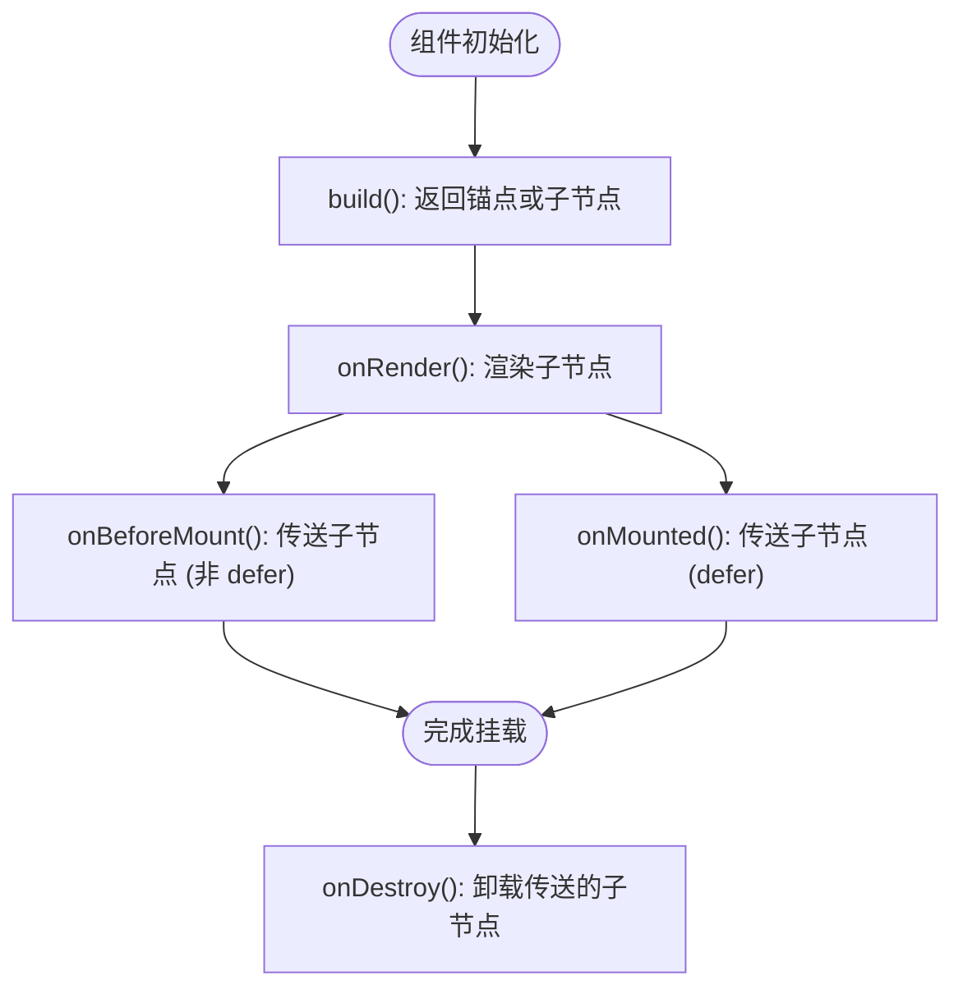

# Teleport

<cite>
**本文档中引用的文件**  
- [Teleport.ts](file://packages/runtime-core/src/widget/widgets/Teleport.ts#L1-L165)
- [Teleport.test.ts](file://packages/runtime-core/__tests__/widget/widgets/Teleport.test.ts#L1-L327)
- [special.ts](file://packages/runtime-core/src/vnode/creator/special.ts#L1-L36)
- [api.ts](file://packages/runtime-core/src/renderer/api.ts#L1-L26)
- [create.ts](file://packages/runtime-core/src/vnode/core/create.ts#L1-L159)
</cite>

## 目录
1. [简介](#简介)
2. [核心功能](#核心功能)
3. [属性详解](#属性详解)
4. [生命周期与渲染机制](#生命周期与渲染机制)
5. [事件与更新机制](#事件与更新机制)
6. [使用示例](#使用示例)
7. [边界情况与警告处理](#边界情况与警告处理)
8. [架构图解](#架构图解)

## 简介

Teleport 组件是 Vitarx 框架中的内置功能组件，用于将子节点渲染到 DOM 树中任意指定位置，实现“传送”效果。该功能特别适用于模态框、通知、Tooltip 等需要脱离当前组件层级结构的 UI 元素。通过 `to` 属性指定目标容器，Teleport 可以将内容插入到 `body` 或其他任意 DOM 节点中，避免样式污染和层级限制。

**Section sources**  
- [Teleport.ts](file://packages/runtime-core/src/widget/widgets/Teleport.ts#L43-L75)

## 核心功能

Teleport 的核心功能是将子节点从当前组件树中“传送”到目标 DOM 容器中进行渲染。其工作原理如下：
- 在非 `disabled` 模式下，Teleport 不直接渲染子节点，而是创建一个注释节点作为锚点。
- 通过 `to` 属性解析目标容器（支持 CSS 选择器或 DOM 元素引用）。
- 在适当的生命周期阶段（`onBeforeMount` 或 `onMounted`）将子节点挂载到目标容器中。
- 当组件卸载时，自动清理传送的子节点。

此机制确保了 UI 结构的灵活性，同时保持了组件逻辑的封装性。

**Section sources**  
- [Teleport.ts](file://packages/runtime-core/src/widget/widgets/Teleport.ts#L83-L164)

## 属性详解

Teleport 组件支持以下属性：

| 属性 | 类型 | 默认值 | 说明 |
|------|------|--------|------|
| `to` | `string \| HostParentElement` | 必需 | 指定传送目标。支持 CSS 选择器字符串或直接的 DOM 元素引用。目标必须是可容纳子元素的容器元素。 |
| `disabled` | `boolean` | `false` | 控制是否禁用传送功能。当为 `true` 时，子节点将在原位置渲染，不进行传送。 |
| `defer` | `boolean` | `false` | 控制是否延迟挂载。当为 `true` 时，子节点在 `onMounted` 阶段挂载；否则在 `onBeforeMount` 阶段挂载。 |
| `children` | `VNode` | 必需 | 要传送的子节点。必须是有效的虚拟节点对象，不支持动态修改。 |

**注意**：`to`、`disabled` 和 `defer` 属性不支持动态修改。

**Section sources**  
- [Teleport.ts](file://packages/runtime-core/src/widget/widgets/Teleport.ts#L9-L40)

## 生命周期与渲染机制

Teleport 组件的生命周期方法决定了其传送行为的时机：



**Diagram sources**  
- [Teleport.ts](file://packages/runtime-core/src/widget/widgets/Teleport.ts#L118-L144)

- **`build()`**：构建阶段返回注释节点（作为传送锚点）或直接返回子节点（当 `disabled` 为 `true` 时）。
- **`onRender()`**：在渲染阶段处理子节点的渲染逻辑。
- **`onBeforeMount()`**：若未启用 `defer`，在此阶段将子节点挂载到目标容器。
- **`onMounted()`**：若启用 `defer`，在此阶段执行挂载操作。
- **`onDestroy()`**：组件销毁时，负责卸载已传送的子节点。

**Section sources**  
- [Teleport.ts](file://packages/runtime-core/src/widget/widgets/Teleport.ts#L118-L144)

## 事件与更新机制

Teleport 组件通过响应式系统监听 `children` 属性的变化。当子节点内容更新时，框架会自动调用 `patchUpdate` 方法进行高效更新，确保只修改变化的部分，提升性能。

在 `disabled` 模式下，Teleport 不会监听 `children` 变化，子节点的更新由常规渲染流程处理。

**Section sources**  
- [Teleport.ts](file://packages/runtime-core/src/widget/widgets/Teleport.ts#L92-L101)

## 使用示例

以下示例展示如何使用 Teleport 将模态框内容传送到 `body` 标签下：

```tsx
<Teleport to="body">
  <div class="modal">模态框内容</div>
</Teleport>
```

也可使用 CSS 选择器或直接传入 DOM 元素：

```tsx
// 使用选择器
<Teleport to="#modal-container">
  <div>弹窗内容</div>
</Teleport>

// 使用 DOM 元素引用
const container = document.getElementById('container')
<Teleport to={container}>
  <div>内容</div>
</Teleport>
```

启用延迟挂载：

```tsx
<Teleport to="body" defer>
  <div>延迟渲染的内容</div>
</Teleport>
```

禁用传送（原地渲染）：

```tsx
<Teleport to="body" disabled>
  <div>不会被传送的内容</div>
</Teleport>
```

**Section sources**  
- [Teleport.ts](file://packages/runtime-core/src/widget/widgets/Teleport.ts#L50-L74)

## 边界情况与警告处理

Teleport 组件在以下情况下会触发警告或特殊处理：

- **目标选择器不存在**：在开发模式下，若 `to` 指定的选择器无法匹配任何元素，会通过 `logger.warn` 发出警告：“Teleport.to parse failed, it may not be a valid parent element or does not exist at all”。
- **目标非容器元素**：若目标元素不支持插入子节点（如文本节点），则传送操作会被忽略。
- **属性验证失败**：若 `children` 不是有效的 `VNode`，或在 `disabled=false` 时未提供 `to` 属性，会抛出 `TypeError`。

这些机制确保了组件的健壮性和开发体验。

**Section sources**  
- [Teleport.ts](file://packages/runtime-core/src/widget/widgets/Teleport.ts#L154-L162)
- [Teleport.test.ts](file://packages/runtime-core/__tests__/widget/widgets/Teleport.test.ts#L271-L283)

## 架构图解

以下是 Teleport 组件的整体架构与数据流：

```mermaid
graph TD
A[Teleport 组件] --> B{disabled?}
B --> |是| C[原地渲染 children]
B --> |否| D{defer?}
D --> |否| E[onBeforeMount 传送]
D --> |是| F[onMounted 传送]
E --> G[挂载到目标容器]
F --> G
G --> H[目标容器 (to)]
I[children 变化] --> J[patchUpdate 更新]
K[组件销毁] --> L[unmountNode 卸载]
```

**Diagram sources**  
- [Teleport.ts](file://packages/runtime-core/src/widget/widgets/Teleport.ts#L83-L164)
- [create.ts](file://packages/runtime-core/src/vnode/core/create.ts#L87-L136)