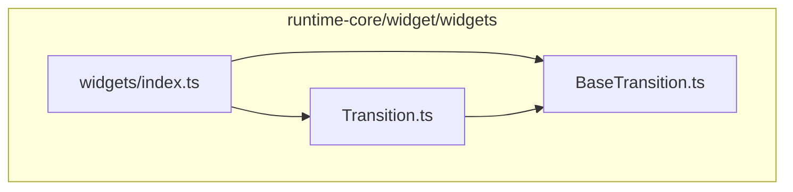
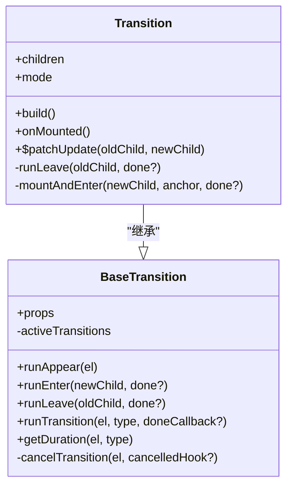
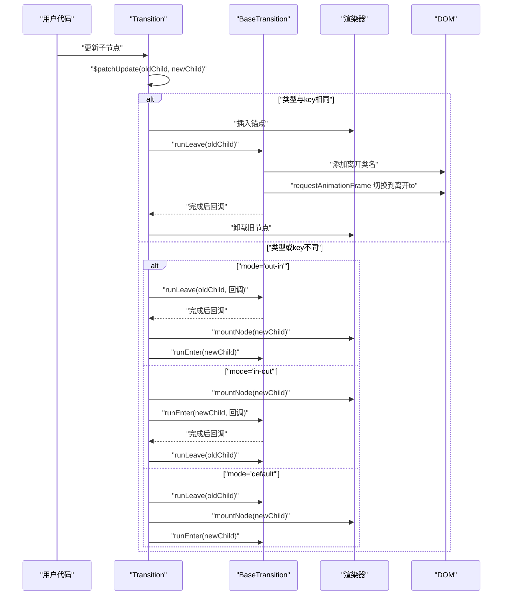
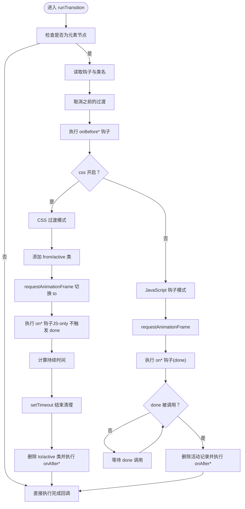
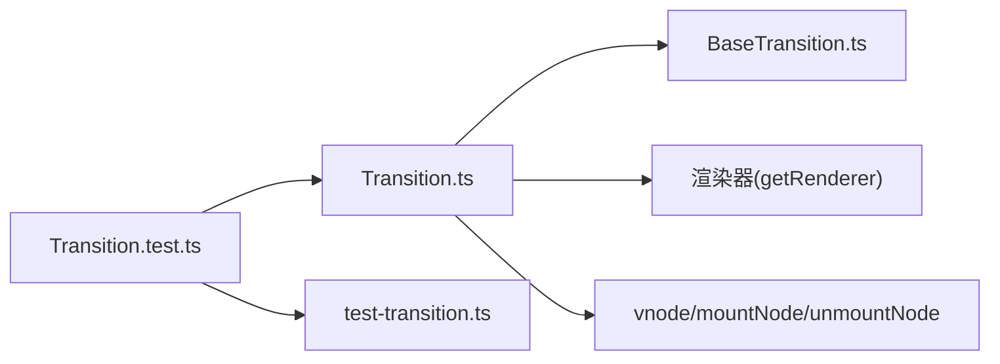

# Transition

<cite>
**本文引用的文件**
- [Transition.ts](file://packages/runtime-core/src/widget/widgets/Transition.ts)
- [BaseTransition.ts](file://packages/runtime-core/src/widget/widgets/BaseTransition.ts)
- [index.ts（widgets 导出）](file://packages/runtime-core/src/widget/widgets/index.ts)
- [Transition.test.ts](file://packages/runtime-core/__tests__/widget/widgets/Transition.test.ts)
- [test-transition.ts](file://packages/runtime-core/__tests__/helpers/test-transition.ts)
- [index.ts（runtime-core 导出）](file://packages/runtime-core/src/index.ts)
</cite>

## 目录
1. [简介](#简介)
2. [项目结构](#项目结构)
3. [核心组件](#核心组件)
4. [架构总览](#架构总览)
5. [详细组件分析](#详细组件分析)
6. [依赖关系分析](#依赖关系分析)
7. [性能考量](#性能考量)
8. [故障排查指南](#故障排查指南)
9. [结论](#结论)
10. [附录](#附录)

## 简介
本文件面向 Vitarx 的 Transition 组件，系统性阐述其为单个元素或组件提供进入/离开动画的实现原理，涵盖：
- 自动应用 CSS 过渡类名（如 fade-enter-active）与 JavaScript 钩子（onBeforeEnter、onEnter、onAfterLeave 等）两种控制方式
- 支持的三种过渡模式：default（同时进行）、out-in（先离开后进入）、in-out（先进入后离开）的行为差异与适用场景
- 继承自 BaseTransition 的核心能力：动画生命周期管理、持续时间控制、动画取消机制
- 完整的属性列表、事件钩子、CSS 类名生成规则
- 通过测试用例路径展示基础淡入淡出效果与使用 JavaScript 钩子实现的复杂动画

## 项目结构
Transition 位于 runtime-core 的 widget/widgets 目录中，作为具体过渡组件，继承自 BaseTransition 抽象基类。widgets 的导出入口统一导出了 Transition 与 BaseTransition，便于外部按需引入。

图表来源
- [Transition.ts](file://packages/runtime-core/src/widget/widgets/Transition.ts#L1-L150)
- [BaseTransition.ts](file://packages/runtime-core/src/widget/widgets/BaseTransition.ts#L1-L120)
- [index.ts（widgets 导出）](file://packages/runtime-core/src/widget/widgets/index.ts#L1-L11)

章节来源
- [Transition.ts](file://packages/runtime-core/src/widget/widgets/Transition.ts#L1-L150)
- [BaseTransition.ts](file://packages/runtime-core/src/widget/widgets/BaseTransition.ts#L1-L120)
- [index.ts（widgets 导出）](file://packages/runtime-core/src/widget/widgets/index.ts#L1-L11)

## 核心组件
- Transition：具体过渡组件，负责在子节点变更时执行进入/离开动画，支持三种模式与生命周期钩子。
- BaseTransition：抽象基类，提供统一的过渡生命周期、CSS 类名生成、持续时间计算、动画取消等通用能力。

章节来源
- [Transition.ts](file://packages/runtime-core/src/widget/widgets/Transition.ts#L150-L246)
- [BaseTransition.ts](file://packages/runtime-core/src/widget/widgets/BaseTransition.ts#L192-L411)

## 架构总览
Transition 通过继承 BaseTransition，复用其 runTransition 核心流程，结合自身 $patchUpdate 逻辑，实现对单个子节点的进入/离开动画控制。运行时通过渲染器获取 DOM 操作能力，配合 requestAnimationFrame 触发 CSS 过渡状态切换，并在完成后清理类名与回调。

图表来源
- [BaseTransition.ts](file://packages/runtime-core/src/widget/widgets/BaseTransition.ts#L192-L411)
- [Transition.ts](file://packages/runtime-core/src/widget/widgets/Transition.ts#L150-L246)

## 详细组件分析

### Transition 组件
- 角色定位：为单个子节点提供进入/离开动画，支持三种模式与生命周期钩子。
- 关键行为：
  - build：返回当前 children 作为渲染内容
  - onMounted：若设置 appear，则在首次挂载时触发出现动画
  - $patchUpdate：根据新旧子节点类型与 key 决定是否执行过渡，依据 mode 执行不同顺序的进入/离开动画
  - runLeave：在离开动画完成后卸载旧节点
  - mountAndEnter：先挂载新节点，再执行进入动画

图表来源
- [Transition.ts](file://packages/runtime-core/src/widget/widgets/Transition.ts#L173-L245)
- [BaseTransition.ts](file://packages/runtime-core/src/widget/widgets/BaseTransition.ts#L234-L353)

章节来源
- [Transition.ts](file://packages/runtime-core/src/widget/widgets/Transition.ts#L150-L246)

### BaseTransition 核心能力
- 生命周期钩子：onBeforeEnter/onEnter/onAfterEnter、onBeforeLeave/onLeave/onAfterLeave、onBeforeAppear/onAppear/onAfterAppear、onEnterCancelled/onLeaveCancelled/onAppearCancelled
- CSS 类名生成：name-type-from/active/to，支持自定义各阶段类名
- 过渡类型与持续时间：支持 'transition'/'animation'/'default'，优先使用显式 duration，其次 CSS 计算
- 动画取消：WeakMap 记录活动过渡，支持取消并触发对应取消钩子
- runTransition：统一处理 enter/leave/appear，支持 CSS 过渡与 JS 钩子两种模式

图表来源
- [BaseTransition.ts](file://packages/runtime-core/src/widget/widgets/BaseTransition.ts#L234-L353)
- [BaseTransition.ts](file://packages/runtime-core/src/widget/widgets/BaseTransition.ts#L355-L411)

章节来源
- [BaseTransition.ts](file://packages/runtime-core/src/widget/widgets/BaseTransition.ts#L1-L411)

### 过渡模式详解
- default（同时进行）：离开与进入并行执行，适合无遮挡的淡入淡出
- out-in（先离开后进入）：旧元素先离开，新元素随后进入，适合需要保持容器尺寸稳定的场景
- in-out（先进入后离开）：新元素先进入，旧元素随后离开，适合需要新内容先可见的场景

章节来源
- [Transition.ts](file://packages/runtime-core/src/widget/widgets/Transition.ts#L173-L245)
- [Transition.test.ts](file://packages/runtime-core/__tests__/widget/widgets/Transition.test.ts#L119-L179)

### CSS 类名生成规则
- 基于 name 与类型生成：name-type-from/active/to
- 默认 name 为 "v"，appear 对应 appear-from/active/to
- 支持自定义各阶段类名（enterFromClass/enterActiveClass/enterToClass 等）

章节来源
- [BaseTransition.ts](file://packages/runtime-core/src/widget/widgets/BaseTransition.ts#L42-L93)
- [BaseTransition.ts](file://packages/runtime-core/src/widget/widgets/BaseTransition.ts#L170-L191)

### JavaScript 钩子与完成回调
- onBeforeEnter/onBeforeLeave/onBeforeAppear：动画开始前
- onEnter/onLeave/onAppear：动画进行中，JS-only 模式需手动调用 done
- onAfterEnter/onAfterLeave/onAfterAppear：动画完成后
- onEnterCancelled/onLeaveCancelled/onAppearCancelled：动画被取消时

章节来源
- [BaseTransition.ts](file://packages/runtime-core/src/widget/widgets/BaseTransition.ts#L12-L40)

### 持续时间控制与取消机制
- 显式 duration：数字或 { enter, leave } 对象
- CSS 计算：根据 type 选择 transitionDuration 或 animationDuration，或取较大者
- 取消：同一元素的活动过渡会被新过渡覆盖，触发取消钩子并清理

章节来源
- [BaseTransition.ts](file://packages/runtime-core/src/widget/widgets/BaseTransition.ts#L355-L411)

## 依赖关系分析
- Transition 依赖 BaseTransition 的 runTransition、runEnter、runLeave、getDuration 等能力
- 运行时通过渲染器获取 DOM 能力（添加/移除类名、requestAnimationFrame、元素检测等）
- 测试通过 helpers 提供的 mock 工具模拟 CSS 持续时间与 rAF 行为

图表来源
- [Transition.ts](file://packages/runtime-core/src/widget/widgets/Transition.ts#L1-L20)
- [BaseTransition.ts](file://packages/runtime-core/src/widget/widgets/BaseTransition.ts#L1-L10)
- [Transition.test.ts](file://packages/runtime-core/__tests__/widget/widgets/Transition.test.ts#L1-L20)
- [test-transition.ts](file://packages/runtime-core/__tests__/helpers/test-transition.ts#L1-L40)

章节来源
- [Transition.ts](file://packages/runtime-core/src/widget/widgets/Transition.ts#L1-L20)
- [BaseTransition.ts](file://packages/runtime-core/src/widget/widgets/BaseTransition.ts#L1-L10)
- [Transition.test.ts](file://packages/runtime-core/__tests__/widget/widgets/Transition.test.ts#L1-L20)
- [test-transition.ts](file://packages/runtime-core/__tests__/helpers/test-transition.ts#L1-L40)

## 性能考量
- v-show 切换优化：当仅显示/隐藏状态变化时，直接复用旧节点并触发过渡，避免不必要的挂载/卸载
- 静态节点跳过：静态节点不会因文本变化而触发过渡，减少无效更新
- rAF 强制重排：在 CSS 模式下通过 requestAnimationFrame 切换 to 状态，确保动画正确触发
- 取消策略：同一元素的活动过渡会被覆盖，避免叠加动画导致的资源浪费

章节来源
- [Transition.ts](file://packages/runtime-core/src/widget/widgets/Transition.ts#L183-L200)
- [Transition.ts](file://packages/runtime-core/src/widget/widgets/Transition.ts#L191-L200)
- [BaseTransition.ts](file://packages/runtime-core/src/widget/widgets/BaseTransition.ts#L285-L320)

## 故障排查指南
- 未触发动画
  - 确认子节点为单个元素或组件，且 key 发生变化或类型不同
  - 若使用 CSS 过渡，确认 name 与类名匹配，且 CSS 中定义了过渡属性
  - 若使用 JS 钩子，确保在 onEnter/onLeave/onAppear 中调用 done
- 动画卡住或重复
  - 检查是否存在频繁快速切换，导致旧动画被取消但仍残留类名
  - 确保同一元素在同一时刻只有一个活动过渡
- 持续时间异常
  - 显式设置 duration 以覆盖 CSS 计算
  - 检查 type 选择是否与 CSS 属性匹配（transition vs animation）

章节来源
- [Transition.test.ts](file://packages/runtime-core/__tests__/widget/widgets/Transition.test.ts#L198-L241)
- [BaseTransition.ts](file://packages/runtime-core/src/widget/widgets/BaseTransition.ts#L355-L411)

## 结论
Transition 通过继承 BaseTransition，将进入/离开动画的生命周期、类名管理、持续时间与取消机制标准化，既支持基于 CSS 的简单过渡，也支持通过 JavaScript 钩子实现复杂动画。三种过渡模式满足不同布局与交互需求，配合 v-show 与静态节点优化，可在保证体验的同时兼顾性能。

## 附录

### 属性与事件钩子清单
- 属性
  - name：过渡名称前缀，默认 "v"
  - appear：初始渲染是否触发动画，默认 false
  - css：是否启用 CSS 过渡类，默认 true
  - duration：过渡持续时间，数字或 { enter, leave }
  - type：过渡类型，'transition' | 'animation' | 'default'
  - mode：过渡模式，'default' | 'out-in' | 'in-out'
  - children：单个子节点
- 事件钩子（JS-only 模式需手动调用 done）
  - onBeforeEnter/onBeforeLeave/onBeforeAppear
  - onEnter/onLeave/onAppear（done）
  - onAfterEnter/onAfterLeave/onAfterAppear
  - onEnterCancelled/onLeaveCancelled/onAppearCancelled

章节来源
- [BaseTransition.ts](file://packages/runtime-core/src/widget/widgets/BaseTransition.ts#L70-L93)
- [Transition.ts](file://packages/runtime-core/src/widget/widgets/Transition.ts#L9-L45)

### 使用示例（参考测试用例路径）
- 基础淡入淡出（CSS 过渡）
  - 参考路径：[Transition.test.ts](file://packages/runtime-core/__tests__/widget/widgets/Transition.test.ts#L45-L73)
- 使用 JavaScript 钩子（onEnter/onLeave 等）
  - 参考路径：[Transition.test.ts](file://packages/runtime-core/__tests__/widget/widgets/Transition.test.ts#L1-L20)
- 指定过渡模式（out-in/in-out/default）
  - 参考路径：[Transition.test.ts](file://packages/runtime-core/__tests__/widget/widgets/Transition.test.ts#L119-L179)
- 自定义持续时间
  - 参考路径：[Transition.test.ts](file://packages/runtime-core/__tests__/widget/widgets/Transition.test.ts#L1-L20)
- 首次出现动画（appear）
  - 参考路径：[Transition.test.ts](file://packages/runtime-core/__tests__/widget/widgets/Transition.test.ts#L74-L87)