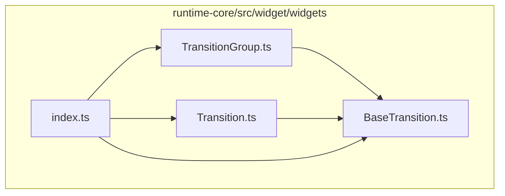
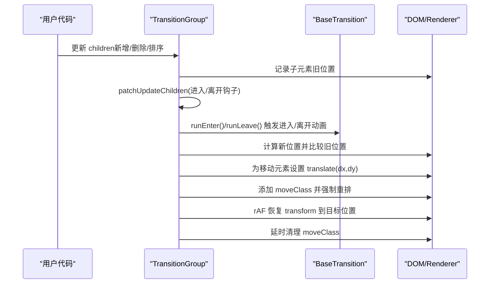
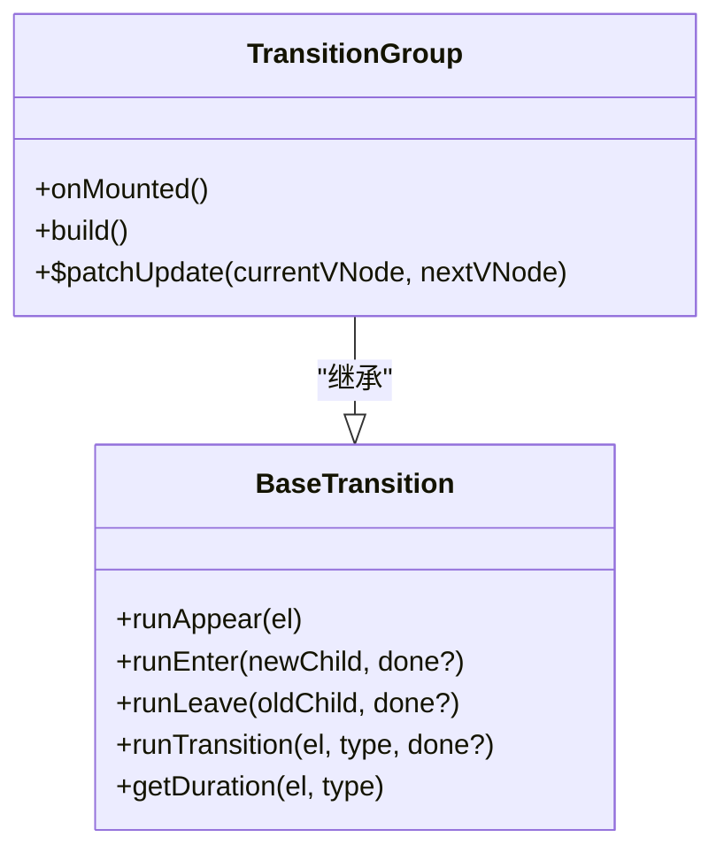
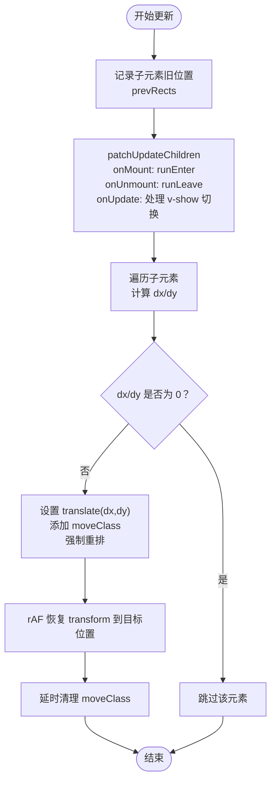
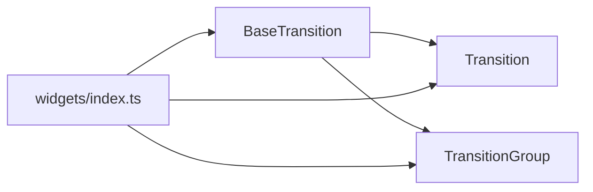

# TransitionGroup

<cite>
**本文引用的文件**
- [TransitionGroup.ts](file://packages/runtime-core/src/widget/widgets/TransitionGroup.ts)
- [Transition.ts](file://packages/runtime-core/src/widget/widgets/Transition.ts)
- [BaseTransition.ts](file://packages/runtime-core/src/widget/widgets/BaseTransition.ts)
- [index.ts](file://packages/runtime-core/src/widget/widgets/index.ts)
- [TransitionGroup.test.ts](file://packages/runtime-core/__tests__/widget/widgets/TransitionGroup.test.ts)
</cite>

## 目录
1. [简介](#简介)
2. [项目结构](#项目结构)
3. [核心组件](#核心组件)
4. [架构总览](#架构总览)
5. [详细组件分析](#详细组件分析)
6. [依赖关系分析](#依赖关系分析)
7. [性能考量](#性能考量)
8. [故障排查指南](#故障排查指南)
9. [结论](#结论)
10. [附录](#附录)

## 简介
TransitionGroup 是 Vitarx 中用于处理多个子元素列表过渡动画的组件，支持进入（enter）、离开（leave）和移动（move）三类动画。与单元素过渡的 Transition 组件不同，TransitionGroup 可以同时管理一组子元素的过渡状态，并通过 key 值追踪元素变化，从而在元素顺序改变时触发移动动画。它继承自 BaseTransition，复用统一的过渡生命周期与 CSS/JS 钩子机制，同时扩展了多子元素的更新策略与移动动画实现。

## 项目结构
TransitionGroup 位于运行时核心包的 widgets 层，与 Transition、BaseTransition 等共同构成过渡动画体系。对外通过导出入口统一暴露。

图表来源
- [TransitionGroup.ts](file://packages/runtime-core/src/widget/widgets/TransitionGroup.ts#L1-L120)
- [Transition.ts](file://packages/runtime-core/src/widget/widgets/Transition.ts#L1-L120)
- [BaseTransition.ts](file://packages/runtime-core/src/widget/widgets/BaseTransition.ts#L1-L120)
- [index.ts](file://packages/runtime-core/src/widget/widgets/index.ts#L1-L11)

章节来源
- [index.ts](file://packages/runtime-core/src/widget/widgets/index.ts#L1-L11)

## 核心组件
- TransitionGroup：多子元素过渡容器，负责构建包裹节点、处理进入/离开/移动动画、计算元素位移并应用移动类名。
- Transition：单元素过渡组件，提供进入/离开/首次出现的过渡能力，支持多种过渡模式。
- BaseTransition：过渡动画基类，统一管理 CSS 类名、JavaScript 钩子、持续时间计算与取消逻辑。

章节来源
- [TransitionGroup.ts](file://packages/runtime-core/src/widget/widgets/TransitionGroup.ts#L115-L283)
- [Transition.ts](file://packages/runtime-core/src/widget/widgets/Transition.ts#L150-L246)
- [BaseTransition.ts](file://packages/runtime-core/src/widget/widgets/BaseTransition.ts#L192-L411)

## 架构总览
TransitionGroup 在更新时记录子元素旧位置，执行子节点的进入/离开动画，再计算新旧位置差异，对发生位移的元素应用移动类名并触发平滑过渡。该流程与 BaseTransition 的 runTransition 保持一致的类名与钩子语义，确保 CSS 过渡与 JS 钩子的兼容性。

图表来源
- [TransitionGroup.ts](file://packages/runtime-core/src/widget/widgets/TransitionGroup.ts#L164-L283)
- [BaseTransition.ts](file://packages/runtime-core/src/widget/widgets/BaseTransition.ts#L234-L354)

## 详细组件分析

### TransitionGroup 组件
- 继承关系：继承自 BaseTransition，复用过渡生命周期与钩子。
- 主要职责：
  - 构建包裹节点：默认使用 Fragment，可通过 tag 自定义为任意宿主元素或 Fragment。
  - 初始渲染：若 appear 为真，首次挂载时对所有子元素触发进入动画。
  - 更新策略：记录旧位置，执行子节点进入/离开动画，随后计算位移并触发移动动画。
  - 移动动画：基于旧/新 DOMRect 计算 dx/dy，临时设置 transform 并添加 moveClass，下一帧恢复 transform，最后按持续时间清理类名。
  - 可取消：同一元素的移动动画在再次触发时会取消前一次动画，避免叠加。
- 关键属性与行为
  - name：过渡类名前缀，影响进入/离开/移动类名生成。
  - tag：包裹元素标签，默认 Fragment；可传入宿主元素名或 Fragment。
  - moveClass：移动动画类名，默认 `${name}-move`。
  - bindProps：透传给包裹元素的属性。
  - appear：初始渲染时是否对所有子元素触发进入动画。
  - 其他继承自 BaseTransition 的属性：css、duration、type、各类钩子等。

图表来源
- [TransitionGroup.ts](file://packages/runtime-core/src/widget/widgets/TransitionGroup.ts#L115-L283)
- [BaseTransition.ts](file://packages/runtime-core/src/widget/widgets/BaseTransition.ts#L192-L411)

章节来源
- [TransitionGroup.ts](file://packages/runtime-core/src/widget/widgets/TransitionGroup.ts#L34-L114)
- [TransitionGroup.ts](file://packages/runtime-core/src/widget/widgets/TransitionGroup.ts#L122-L144)
- [TransitionGroup.ts](file://packages/runtime-core/src/widget/widgets/TransitionGroup.ts#L164-L283)

### 与 Transition 的区别
- 适用场景
  - Transition：单元素/单组件过渡，适合模态框、标签页切换等场景。
  - TransitionGroup：多子元素列表过渡，适合动态列表的增删与排序。
- 动画类型
  - Transition：enter/leave/appear。
  - TransitionGroup：在上述基础上增加 move（元素位置变化时触发）。
- 更新策略
  - Transition：根据新旧子节点类型与 key 决定是否执行过渡，支持 out-in/in-out/default 三种模式。
  - TransitionGroup：遍历子节点，分别触发进入/离开动画，再统一计算移动并应用 moveClass。
- key 与移动
  - Transition：不涉及多子元素的相对位置变化。
  - TransitionGroup：通过 key 识别元素，比较旧/新位置差异，触发 move 动画。

章节来源
- [Transition.ts](file://packages/runtime-core/src/widget/widgets/Transition.ts#L150-L246)
- [TransitionGroup.ts](file://packages/runtime-core/src/widget/widgets/TransitionGroup.ts#L164-L283)

### 移动动画实现流程

图表来源
- [TransitionGroup.ts](file://packages/runtime-core/src/widget/widgets/TransitionGroup.ts#L176-L283)

章节来源
- [TransitionGroup.ts](file://packages/runtime-core/src/widget/widgets/TransitionGroup.ts#L176-L283)

### 属性与事件钩子
- 属性（来自 BaseTransition 与 TransitionGroup 的组合）
  - name：过渡类名前缀，默认 "v"。
  - appear：初始渲染时是否触发动画，默认 false。
  - css：是否使用 CSS 过渡类，默认 true。
  - duration/type：过渡持续时间与类型（transition/animation/default）。
  - tag：包裹元素标签，默认 Fragment。
  - moveClass：移动类名，默认 `${name}-move`。
  - bindProps：透传给包裹元素的属性。
  - 各类过渡钩子：onBeforeEnter/onEnter/onAfterEnter、onBeforeLeave/onLeave/onAfterLeave、onBeforeAppear/onAppear/onAfterAppear、onEnterCancelled/onLeaveCancelled/onAppearCancelled。
- 事件钩子（来自 BaseTransition）
  - onBeforeEnter/onEnter/onAfterEnter：进入动画阶段钩子。
  - onBeforeLeave/onLeave/onAfterLeave：离开动画阶段钩子。
  - onBeforeAppear/onAppear/onAfterAppear：首次出现动画阶段钩子。
  - onEnterCancelled/onLeaveCancelled/onAppearCancelled：动画被取消时钩子。

章节来源
- [BaseTransition.ts](file://packages/runtime-core/src/widget/widgets/BaseTransition.ts#L75-L110)
- [BaseTransition.ts](file://packages/runtime-core/src/widget/widgets/BaseTransition.ts#L12-L40)
- [TransitionGroup.ts](file://packages/runtime-core/src/widget/widgets/TransitionGroup.ts#L34-L50)

### CSS 过渡规则建议
- 进入/离开通用类名：`${name}-enter-active`、`${name}-leave-active`。
- 进入/离开起止状态：`${name}-enter-from`、`${name}-leave-to`。
- 移动类名：`${name}-move`（或自定义 moveClass）。
- 建议使用 transform 实现移动，避免与元素自身 transform 冲突；必要时在 move 类中声明 transition。

章节来源
- [TransitionGroup.ts](file://packages/runtime-core/src/widget/widgets/TransitionGroup.ts#L86-L101)
- [BaseTransition.ts](file://packages/runtime-core/src/widget/widgets/BaseTransition.ts#L170-L191)

### 使用示例与最佳实践
- 动态列表添加/删除/排序动画
  - 添加：向 children 追加带 key 的子节点，TransitionGroup 会自动触发进入动画。
  - 删除：从 children 移除子节点，TransitionGroup 会自动触发离开动画。
  - 排序：改变子节点数组顺序，TransitionGroup 会计算位移并触发 move 动画。
- 自定义包裹元素与属性
  - 使用 tag 指定包裹元素（如 ul/li），使用 bindProps 传递类名/ID 等属性。
- 移动类名定制
  - 通过 moveClass 自定义移动类名，便于与现有样式体系对齐。
- 初始渲染动画
  - 设置 appear 为 true，使初始渲染时对所有子元素触发进入动画。

章节来源
- [TransitionGroup.ts](file://packages/runtime-core/src/widget/widgets/TransitionGroup.ts#L66-L114)
- [TransitionGroup.test.ts](file://packages/runtime-core/__tests__/widget/widgets/TransitionGroup.test.ts#L68-L98)
- [TransitionGroup.test.ts](file://packages/runtime-core/__tests__/widget/widgets/TransitionGroup.test.ts#L100-L128)
- [TransitionGroup.test.ts](file://packages/runtime-core/__tests__/widget/widgets/TransitionGroup.test.ts#L130-L146)
- [TransitionGroup.test.ts](file://packages/runtime-core/__tests__/widget/widgets/TransitionGroup.test.ts#L215-L236)

## 依赖关系分析
- TransitionGroup 依赖 BaseTransition 提供的统一过渡机制（类名、钩子、持续时间计算、取消）。
- Transition 与 TransitionGroup 共同依赖 BaseTransition 的 runTransition 流程，保证 CSS/JS 钩子的一致性。
- 导出入口统一导出 TransitionGroup、Transition、BaseTransition，便于外部使用。

图表来源
- [TransitionGroup.ts](file://packages/runtime-core/src/widget/widgets/TransitionGroup.ts#L1-L33)
- [Transition.ts](file://packages/runtime-core/src/widget/widgets/Transition.ts#L1-L12)
- [BaseTransition.ts](file://packages/runtime-core/src/widget/widgets/BaseTransition.ts#L1-L20)
- [index.ts](file://packages/runtime-core/src/widget/widgets/index.ts#L1-L11)

章节来源
- [index.ts](file://packages/runtime-core/src/widget/widgets/index.ts#L1-L11)

## 性能考量
- 重排与重绘
  - 移动动画中通过强制重排确保 translate 生效，随后在下一帧恢复 transform，减少视觉抖动。
- 动画时长与清理
  - 基于 getDuration 计算动画时长，延时清理 moveClass，避免残留样式影响布局。
- 取消与去抖
  - 同一元素在短时间内多次触发移动动画时，会取消前一次动画，避免叠加与资源浪费。
- v-show 集成
  - 通过指令切换触发进入/离开动画，减少不必要的节点替换。

章节来源
- [TransitionGroup.ts](file://packages/runtime-core/src/widget/widgets/TransitionGroup.ts#L235-L283)
- [BaseTransition.ts](file://packages/runtime-core/src/widget/widgets/BaseTransition.ts#L355-L411)
- [TransitionGroup.test.ts](file://packages/runtime-core/__tests__/widget/widgets/TransitionGroup.test.ts#L281-L305)

## 故障排查指南
- 子元素未添加 key
  - 现象：无法正确识别元素变化，移动动画可能不触发。
  - 处理：为每个子元素提供稳定且唯一的 key。
- 移动动画无效
  - 现象：元素位置变化但无平移动画。
  - 处理：确认元素存在 transform 样式冲突；确保 moveClass 正确应用并声明 transition；检查 getTransitionDuration 返回值。
- 初始渲染未触发动画
  - 现象：首次挂载未触发进入动画。
  - 处理：设置 appear 为 true；确认子树为容器节点。
- 快速连续移动导致动画叠加
  - 现象：频繁排序导致动画冲突。
  - 处理：利用内部取消机制，避免在同一元素上叠加移动动画；必要时降低更新频率。
- 非元素节点跳过
  - 现象：文本/注释等非元素节点不会触发动画。
  - 处理：这是预期行为，确保子元素为可挂载的宿主元素。

章节来源
- [TransitionGroup.ts](file://packages/runtime-core/src/widget/widgets/TransitionGroup.ts#L110-L114)
- [TransitionGroup.ts](file://packages/runtime-core/src/widget/widgets/TransitionGroup.ts#L235-L283)
- [TransitionGroup.test.ts](file://packages/runtime-core/__tests__/widget/widgets/TransitionGroup.test.ts#L351-L393)

## 结论
TransitionGroup 将多子元素的过渡需求与 BaseTransition 的统一机制结合，提供了进入、离开与移动三类动画的完整能力。通过 key 值追踪与位置计算，它能够在列表排序时自然地触发移动动画；通过可配置的包裹元素与移动类名，满足多样化的布局与样式需求。配合 CSS 过渡与 JavaScript 钩子，开发者可以轻松实现丰富的动态列表交互体验。

## 附录
- 相关测试用例参考路径
  - [基础功能与属性验证](file://packages/runtime-core/__tests__/widget/widgets/TransitionGroup.test.ts#L36-L146)
  - [移动动画场景](file://packages/runtime-core/__tests__/widget/widgets/TransitionGroup.test.ts#L149-L305)
  - [v-show 集成](file://packages/runtime-core/__tests__/widget/widgets/TransitionGroup.test.ts#L307-L349)
  - [边界场景](file://packages/runtime-core/__tests__/widget/widgets/TransitionGroup.test.ts#L351-L393)