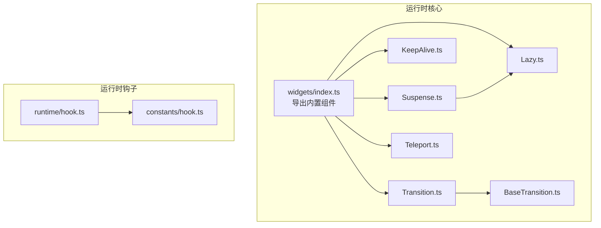
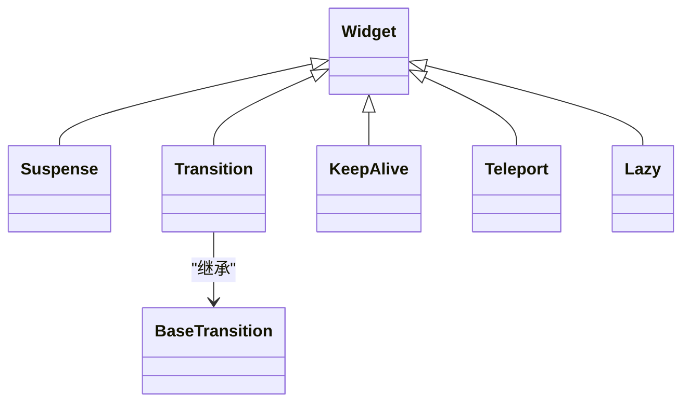
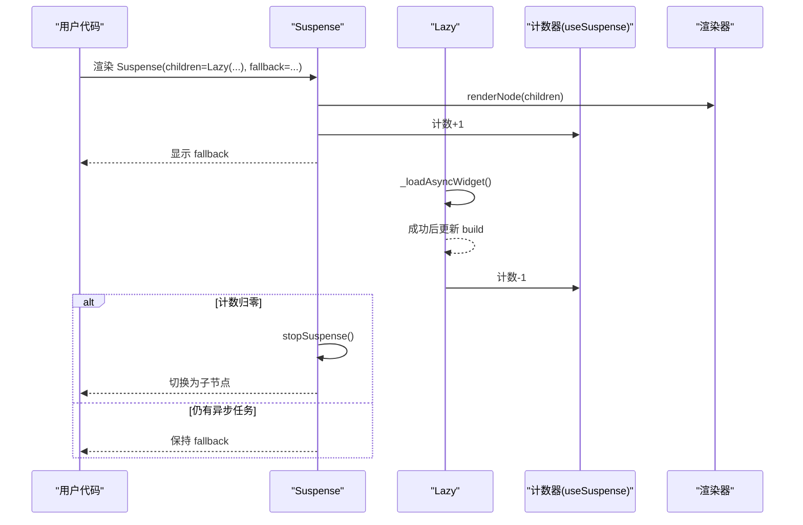
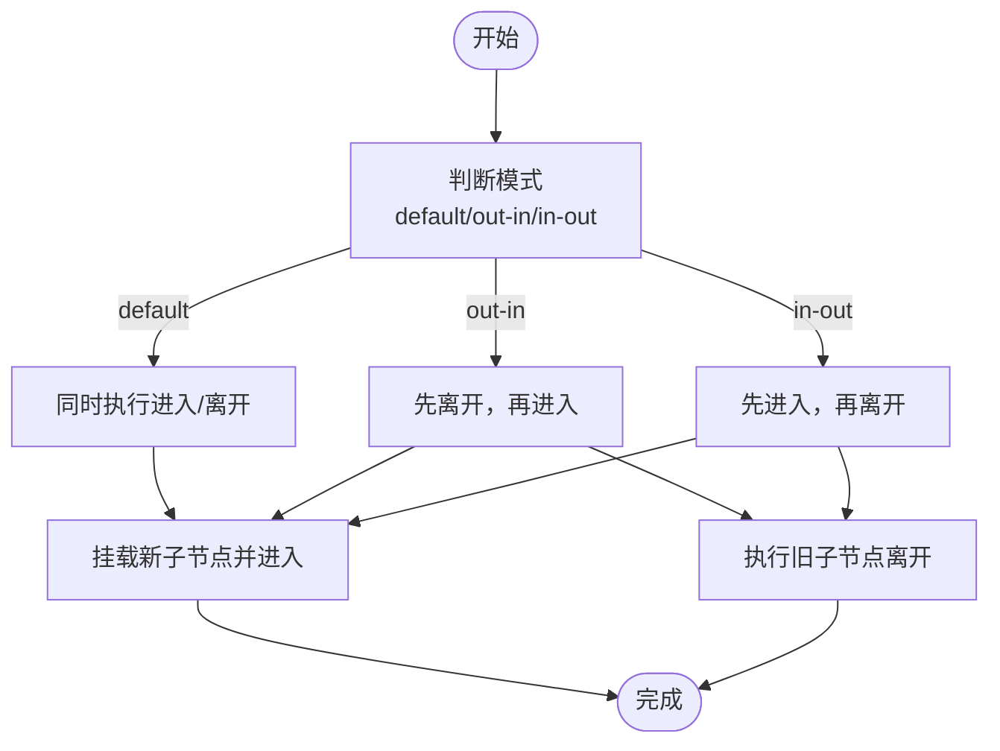
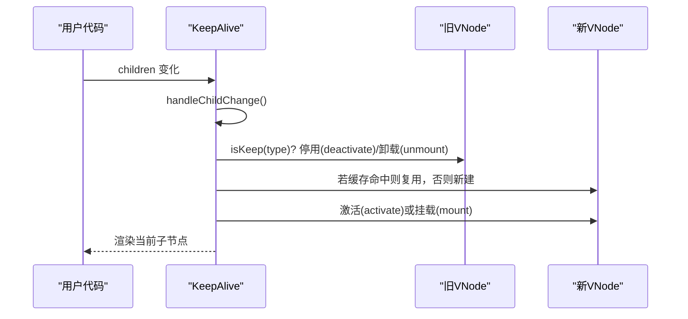
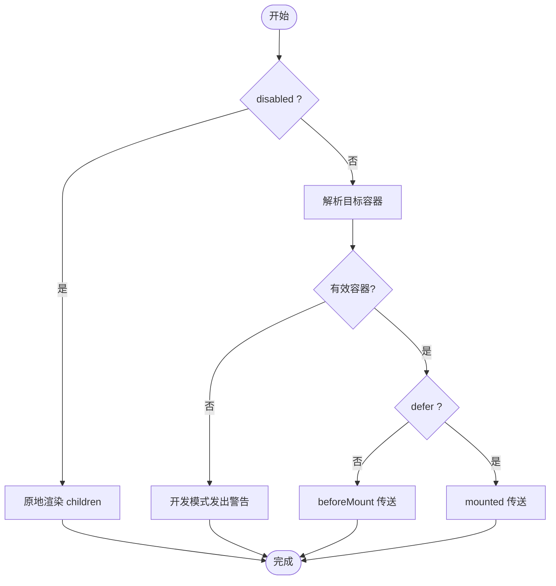
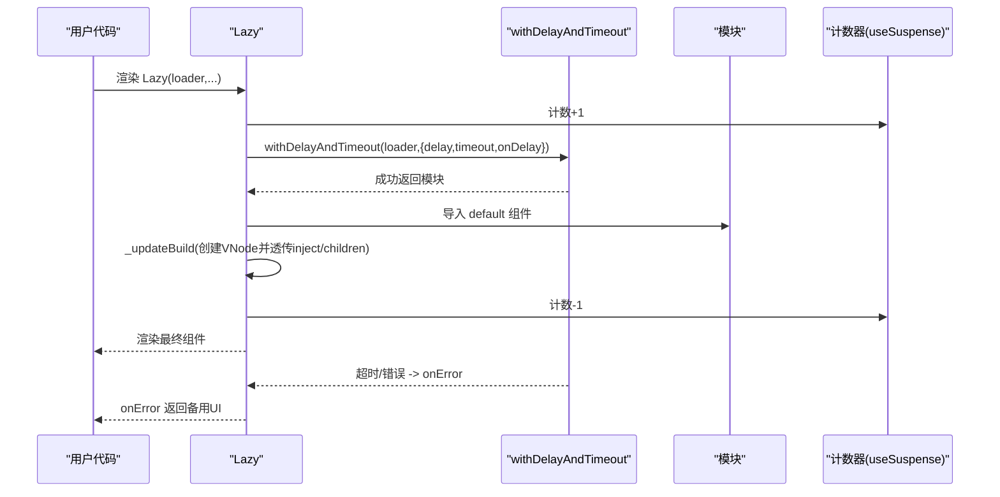
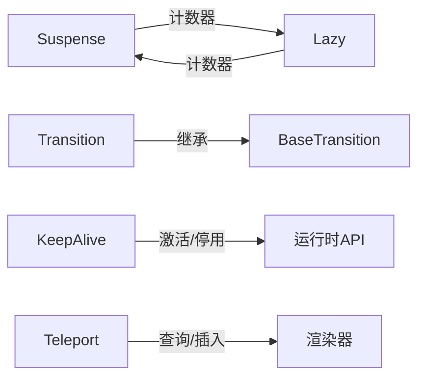

# 内置组件

<cite>
**本文档引用的文件**
- [Suspense.ts](file://packages/runtime-core/src/widget/widgets/Suspense.ts)
- [Transition.ts](file://packages/runtime-core/src/widget/widgets/Transition.ts)
- [BaseTransition.ts](file://packages/runtime-core/src/widget/widgets/BaseTransition.ts)
- [KeepAlive.ts](file://packages/runtime-core/src/widget/widgets/KeepAlive.ts)
- [Teleport.ts](file://packages/runtime-core/src/widget/widgets/Teleport.ts)
- [Lazy.ts](file://packages/runtime-core/src/widget/widgets/Lazy.ts)
- [index.ts](file://packages/runtime-core/src/widget/widgets/index.ts)
- [hook.ts](file://packages/runtime-core/src/runtime/hook.ts)
- [hook.ts](file://packages/runtime-core/src/constants/hook.ts)
- [Suspense.test.ts](file://packages/runtime-core/__tests__/widget/widgets/Suspense.test.ts)
- [KeepAlive.test.ts](file://packages/runtime-core/__tests__/widget/widgets/KeepAlive.test.ts)
- [Teleport.test.ts](file://packages/runtime-core/__tests__/widget/widgets/Teleport.test.ts)
- [Lazy.test.ts](file://packages/runtime-core/__tests__/widget/widgets/Lazy.test.ts)
- [Transition.test.ts](file://packages/runtime-core/__tests__/widget/widgets/Transition.test.ts)
</cite>

## 目录
1. [简介](#简介)
2. [项目结构](#项目结构)
3. [核心组件](#核心组件)
4. [架构概览](#架构概览)
5. [详细组件分析](#详细组件分析)
6. [依赖分析](#依赖分析)
7. [性能考量](#性能考量)
8. [故障排查指南](#故障排查指南)
9. [结论](#结论)
10. [附录](#附录)

## 简介
本文件系统性梳理 Vitarx 提供的内置组件：Suspense、Transition、KeepAlive、Teleport、Lazy。围绕异步加载与 fallback、进入/离开动画、缓存策略与激活/停用钩子、DOM 传送与目标容器选择、懒加载与动态导入集成等主题，逐项说明各组件的职责、属性、插槽、事件与典型使用场景，并给出可视化流程图与最佳实践建议，帮助开发者高效利用这些高级功能。

## 项目结构
- 内置组件位于运行时核心包的 widgets 目录，统一导出于 widgets/index.ts。
- 组件间共享的过渡基类 BaseTransition 抽象出 CSS/JS 钩子、类名、持续时间、取消等通用能力。
- 生命周期钩子在 runtime/hook.ts 中集中定义，组件通过 Widget 基类继承并在渲染器驱动下执行。

图表来源
- [index.ts](file://packages/runtime-core/src/widget/widgets/index.ts#L1-L11)
- [Suspense.ts](file://packages/runtime-core/src/widget/widgets/Suspense.ts#L1-L184)
- [KeepAlive.ts](file://packages/runtime-core/src/widget/widgets/KeepAlive.ts#L1-L334)
- [Lazy.ts](file://packages/runtime-core/src/widget/widgets/Lazy.ts#L1-L235)
- [Transition.ts](file://packages/runtime-core/src/widget/widgets/Transition.ts#L1-L246)
- [BaseTransition.ts](file://packages/runtime-core/src/widget/widgets/BaseTransition.ts#L1-L411)
- [Teleport.ts](file://packages/runtime-core/src/widget/widgets/Teleport.ts#L1-L165)
- [hook.ts](file://packages/runtime-core/src/runtime/hook.ts#L136-L179)
- [hook.ts](file://packages/runtime-core/src/constants/hook.ts#L1-L15)

章节来源
- [index.ts](file://packages/runtime-core/src/widget/widgets/index.ts#L1-L11)

## 核心组件
- Suspense：在异步子节点加载期间显示 fallback，完成后自动切换；支持一次性 onResolved 回调与计数器联动。
- Transition：为单个元素或组件提供进入/离开过渡，支持 CSS 过渡与 JS 钩子、三种模式（default/out-in/in-out）。
- KeepAlive：缓存小部件实例，减少创建/销毁成本；支持 include/exclude/max 策略与 activated/deactivated 钩子。
- Teleport：将子节点渲染到 DOM 树中其他位置；支持延迟渲染、禁用传送与目标容器校验。
- Lazy：异步加载小部件，支持 loading 态、delay/timeout、onError、与 Suspense 计数器联动；提供 lazy 辅助工厂。

章节来源
- [Suspense.ts](file://packages/runtime-core/src/widget/widgets/Suspense.ts#L1-L184)
- [Transition.ts](file://packages/runtime-core/src/widget/widgets/Transition.ts#L1-L246)
- [BaseTransition.ts](file://packages/runtime-core/src/widget/widgets/BaseTransition.ts#L1-L411)
- [KeepAlive.ts](file://packages/runtime-core/src/widget/widgets/KeepAlive.ts#L1-L334)
- [Teleport.ts](file://packages/runtime-core/src/widget/widgets/Teleport.ts#L1-L165)
- [Lazy.ts](file://packages/runtime-core/src/widget/widgets/Lazy.ts#L1-L235)

## 架构概览
- 组件均基于 Widget 基类，遵循统一的生命周期与渲染管线。
- Transition 通过 BaseTransition 抽象过渡核心，具体行为由 Transition/$patchUpdate 决定。
- Suspense 与 Lazy 通过 useSuspense 提供计数器，协同控制 fallback 显示与隐藏。
- KeepAlive 通过缓存 Map 与激活/停用节点，实现复用与状态保持。
- Teleport 通过渲染锚点与目标容器校验，实现跨容器渲染与卸载。

图表来源
- [Suspense.ts](file://packages/runtime-core/src/widget/widgets/Suspense.ts#L84-L184)
- [Transition.ts](file://packages/runtime-core/src/widget/widgets/Transition.ts#L150-L246)
- [BaseTransition.ts](file://packages/runtime-core/src/widget/widgets/BaseTransition.ts#L192-L411)
- [KeepAlive.ts](file://packages/runtime-core/src/widget/widgets/KeepAlive.ts#L119-L334)
- [Teleport.ts](file://packages/runtime-core/src/widget/widgets/Teleport.ts#L83-L165)
- [Lazy.ts](file://packages/runtime-core/src/widget/widgets/Lazy.ts#L100-L235)

## 详细组件分析

### Suspense 组件
- 作用：在异步子节点加载期间显示 fallback，完成后自动切换；支持一次性 onResolved 回调。
- 关键机制：
  - 计数器：useSuspense 提供浅层响应式计数器，子组件每有一个异步任务，计数+1；加载完成计数-1。
  - fallback 切换：计数器≥1 显示 fallback；计数器归零停止 fallback 并触发 onResolved。
  - 安全更新：在卸载/停用状态下避免更新。
- 属性
  - children：必填，VNode
  - fallback：可选，VNode
  - onError：可选，错误处理回调
  - onResolved：可选，首次渲染完成回调
- 插槽：无（children 作为属性传入）
- 事件：无（通过回调钩子触发）
- 典型使用
  - 与 Lazy 搭配：Lazy 增加计数，Suspense 显示 fallback；加载完成后计数归零，切换为子节点。
  - persistent 模式：onResolved 每次从 fallback 切换完成时触发（测试中体现）。
- 生命周期
  - onRender：链接父子关系并渲染子节点；若计数为0，直接显示子节点。
  - onActivated：触发 complete，可能执行 onResolved。
- 错误处理
  - onError 捕获子节点错误；即使错误也会触发 onResolved（测试覆盖）。

图表来源
- [Suspense.ts](file://packages/runtime-core/src/widget/widgets/Suspense.ts#L131-L183)
- [Lazy.ts](file://packages/runtime-core/src/widget/widgets/Lazy.ts#L146-L207)

章节来源
- [Suspense.ts](file://packages/runtime-core/src/widget/widgets/Suspense.ts#L1-L184)
- [Suspense.test.ts](file://packages/runtime-core/__tests__/widget/widgets/Suspense.test.ts#L1-L331)

### Transition 组件
- 作用：为单个子节点提供进入/离开过渡，支持 CSS 过渡与 JS 钩子。
- 关键机制
  - 模式：default（同时）、out-in（先离后入）、in-out（先入后离）。
  - 类名：name-prop + enter/leave/appear + from/active/to。
  - 持续时间：duration 数字或 {enter, leave}；type='transition'|'animation'|'default'。
  - 取消：同一元素正在过渡时，快速切换会取消旧动画并启动新动画。
- 属性
  - children：必填，单个子节点
  - mode：'default' | 'out-in' | 'in-out'（默认 default）
  - name：过渡名前缀（默认 'v'）
  - appear：首次挂载是否触发动画（默认 false）
  - css：是否使用 CSS 类（默认 true）
  - duration/type：持续时间与类型推断
  - JS 钩子：onBeforeEnter/onEnter/onAfterEnter、onBeforeLeave/onLeave/onAfterLeave、onBeforeAppear/onAppear/onAfterAppear
  - CSS 类名：enter/leave/appear 的 from/active/to 自定义类名
- 插槽：无（children 作为属性传入）
- 事件：无（通过钩子触发）
- 典型使用
  - CSS 过渡：定义 name-* 类名，自动添加/移除类名并触发过渡。
  - JS 钩子：在 onEnter/onLeave 中执行自定义动画，完成后调用 done()。
  - 模式切换：根据业务需求选择 out-in/in-out/default。
- 生命周期
  - onMounted：appear=true 时在首次挂载触发 appear 动画。
  - $patchUpdate：根据新旧子节点类型与 key 判断是否执行过渡；v-show 切换兼容。
- 错误处理
  - 未提供 JS 钩子时，自动完成过渡；提供钩子需手动调用 done()。

图表来源
- [Transition.ts](file://packages/runtime-core/src/widget/widgets/Transition.ts#L183-L245)
- [BaseTransition.ts](file://packages/runtime-core/src/widget/widgets/BaseTransition.ts#L234-L353)

章节来源
- [Transition.ts](file://packages/runtime-core/src/widget/widgets/Transition.ts#L1-L246)
- [BaseTransition.ts](file://packages/runtime-core/src/widget/widgets/BaseTransition.ts#L1-L411)
- [Transition.test.ts](file://packages/runtime-core/__tests__/widget/widgets/Transition.test.ts#L1-L241)

### KeepAlive 组件
- 作用：缓存小部件实例，减少频繁创建/销毁带来的性能损耗。
- 关键机制
  - 缓存策略：Map<WidgetType, Map<key, VNode>>；支持 include/exclude/max。
  - 切换逻辑：当前子节点停用（deactivate）或卸载；新子节点若命中缓存则复用，否则新建。
  - 激活/停用：$patchUpdate 中对旧节点执行停用/卸载，对新节点执行激活/挂载。
  - 生命周期：onBeforeUnmount 清理所有缓存实例。
- 属性
  - children：必填，WidgetTypes 或 VNode
  - include：缓存白名单（默认 [] 表示缓存所有）
  - exclude：缓存黑名单（优先级高于 include，默认 []）
  - max：最大缓存数量（≤0 表示不限制，默认 10）
- 插槽：无（children 作为属性传入）
- 事件：无（通过 activated/deactivated 钩子触发）
- 典型使用
  - 切换频繁的列表页、Tab 切换等场景。
  - 结合响应式 ref/shallowRef 动态切换 children。
- 生命周期
  - onBeforeUnmount：遍历缓存并卸载，随后清空缓存。
  - $patchUpdate：统一处理旧节点停用/卸载与新节点激活/挂载。
- 钩子
  - onActivated/onDeactivated：由运行时在 KeepAlive 内部触发。

图表来源
- [KeepAlive.ts](file://packages/runtime-core/src/widget/widgets/KeepAlive.ts#L214-L237)
- [KeepAlive.ts](file://packages/runtime-core/src/widget/widgets/KeepAlive.ts#L256-L282)
- [KeepAlive.ts](file://packages/runtime-core/src/widget/widgets/KeepAlive.ts#L289-L332)

章节来源
- [KeepAlive.ts](file://packages/runtime-core/src/widget/widgets/KeepAlive.ts#L1-L334)
- [hook.ts](file://packages/runtime-core/src/runtime/hook.ts#L136-L179)
- [hook.ts](file://packages/runtime-core/src/constants/hook.ts#L1-L15)
- [KeepAlive.test.ts](file://packages/runtime-core/__tests__/widget/widgets/KeepAlive.test.ts#L1-L549)

### Teleport 组件
- 作用：将子节点渲染到 DOM 树中的其他位置（如 body 或指定容器），常用于模态框、弹窗等。
- 关键机制
  - 目标容器：支持选择器字符串或 HostParentElement；必须是容器元素。
  - 传送时机：defer=false 时在 beforeMount 阶段传送；defer=true 时在 mounted 后传送。
  - 禁用：disabled=true 时子节点在原地渲染。
  - 动态更新：children 变化时通过 patchUpdate 同步更新目标容器内容。
- 属性
  - children：必填，VNode
  - to：必填（disabled=false），字符串选择器或宿主父元素
  - defer：是否延迟渲染（默认 false）
  - disabled：是否禁用传送（默认 false）
- 插槽：无（children 作为属性传入）
- 事件：无
- 典型使用
  - 传送到 body 或指定容器，实现脱离层级的 UI。
  - defer 用于避免首屏阻塞或等待资源准备完成。
- 生命周期
  - onBeforeMount：非 defer 时在 beforeMount 阶段传送。
  - onMounted：defer=true 时在 mounted 后传送。
  - onDestroy：卸载时从目标容器移除。
  - build：disabled=true 返回子节点；否则返回注释节点作为锚点。
- 边界处理
  - 目标不存在或非容器元素时发出警告并跳过传送。

图表来源
- [Teleport.ts](file://packages/runtime-core/src/widget/widgets/Teleport.ts#L118-L164)

章节来源
- [Teleport.ts](file://packages/runtime-core/src/widget/widgets/Teleport.ts#L1-L165)
- [Teleport.test.ts](file://packages/runtime-core/__tests__/widget/widgets/Teleport.test.ts#L1-L327)

### Lazy 组件
- 作用：异步加载小部件，支持 loading 态、delay/timeout、onError、与 Suspense 计数器联动。
- 关键机制
  - 加载器：loader() 返回 Promise<{ default: WidgetType }>。
  - delay：延迟显示 loading；timeout：超时抛错或回调。
  - onError：捕获加载错误或超时，可返回备用 UI。
  - 注入属性：inject 透传给最终渲染的组件；children 作为子节点传入。
  - 计数器：useSuspense 计数+1；加载完成后计数-1。
- 属性
  - loader：必填，异步加载器
  - loading：可选，加载中 UI
  - delay：可选，延迟（默认 200ms）
  - timeout：可选，超时（<=0 不限制，默认 0）
  - onError：可选，错误处理回调
  - inject：可选，透传给最终组件的属性
  - children：可选，作为最终组件的子节点
- 插槽：children 作为属性传入；也可通过插槽传入 loader。
- 事件：无（通过 onError 钩子触发）
- 典型使用
  - 与 Suspense 搭配：Lazy 增加计数，Suspense 显示 fallback；加载完成后计数归零。
  - 自定义 loading：传入 loading 节点或使用 delay 触发。
  - 错误兜底：onError 返回备用 UI。
- 生命周期
  - onBeforeUnmount：取消加载任务。
  - onRender：触发异步加载。
  - build：默认返回注释节点，加载完成后替换为最终组件。
- 辅助工厂
  - lazy(loader, options)：返回一个 VNodeBuilder，便于直接渲染异步模块。

图表来源
- [Lazy.ts](file://packages/runtime-core/src/widget/widgets/Lazy.ts#L146-L207)
- [Suspense.ts](file://packages/runtime-core/src/widget/widgets/Suspense.ts#L110-L116)

章节来源
- [Lazy.ts](file://packages/runtime-core/src/widget/widgets/Lazy.ts#L1-L235)
- [Lazy.test.ts](file://packages/runtime-core/__tests__/widget/widgets/Lazy.test.ts#L1-L415)

## 依赖分析
- 组件耦合
  - Transition 依赖 BaseTransition 提供的过渡核心能力。
  - Suspense 与 Lazy 通过 useSuspense 共享计数器，形成“异步任务计数-显示 fallback”的协作。
  - KeepAlive 依赖运行时的激活/停用与挂载/卸载 API，实现缓存与复用。
  - Teleport 依赖渲染器的 DOM 查询与插入能力，以及目标容器校验。
- 外部依赖
  - responsive：浅层响应式 ref、watch、onPropChange 等。
  - utils：withDelayAndTimeout、logger、工具函数等。
  - runtime：provide/inject、linkParentNode、useSuspense 等。

图表来源
- [Suspense.ts](file://packages/runtime-core/src/widget/widgets/Suspense.ts#L90-L109)
- [Lazy.ts](file://packages/runtime-core/src/widget/widgets/Lazy.ts#L106-L117)
- [Transition.ts](file://packages/runtime-core/src/widget/widgets/Transition.ts#L150-L160)
- [BaseTransition.ts](file://packages/runtime-core/src/widget/widgets/BaseTransition.ts#L234-L353)
- [KeepAlive.ts](file://packages/runtime-core/src/widget/widgets/KeepAlive.ts#L214-L237)
- [Teleport.ts](file://packages/runtime-core/src/widget/widgets/Teleport.ts#L150-L163)

章节来源
- [Suspense.ts](file://packages/runtime-core/src/widget/widgets/Suspense.ts#L1-L184)
- [Lazy.ts](file://packages/runtime-core/src/widget/widgets/Lazy.ts#L1-L235)
- [Transition.ts](file://packages/runtime-core/src/widget/widgets/Transition.ts#L1-L246)
- [BaseTransition.ts](file://packages/runtime-core/src/widget/widgets/BaseTransition.ts#L1-L411)
- [KeepAlive.ts](file://packages/runtime-core/src/widget/widgets/KeepAlive.ts#L1-L334)
- [Teleport.ts](file://packages/runtime-core/src/widget/widgets/Teleport.ts#L1-L165)

## 性能考量
- Suspense
  - 通过计数器避免不必要的 fallback 显示；计数归零后及时停止 fallback。
  - onResolved 仅在首次渲染完成后触发，避免重复回调。
- Transition
  - 快速切换时取消旧动画，减少无效 DOM 操作。
  - duration/type 自动推断，避免过度等待。
- KeepAlive
  - include/exclude/max 控制缓存规模，避免内存膨胀。
  - FIFO 移除最早缓存，保证上限。
- Teleport
  - 目标容器校验避免无效插入；defer 降低首屏阻塞。
- Lazy
  - delay/timeout 避免闪烁与浪费；onError 可快速降级。

[本节为通用指导，无需列出章节来源]

## 故障排查指南
- Suspense
  - 症状：fallback 一直显示
  - 排查：确认所有异步任务均已完成（计数归零）；检查 onError 是否吞掉错误导致未触发 onResolved。
  - 参考测试：计数累加、计数归零停止 fallback、onError 场景。
- Transition
  - 症状：过渡不生效
  - 排查：确认 CSS 类名与 name-prop 匹配；检查 duration/type 是否正确；确认元素为有效 DOM 元素。
  - 参考测试：appear、mode、快速切换取消动画。
- KeepAlive
  - 症状：缓存过多或不生效
  - 排查：检查 include/exclude/max 配置；确认 children 的 key 是否变化导致复用失败。
  - 参考测试：include/exclude 优先级、max FIFO、key 复用。
- Teleport
  - 症状：传送失败或警告
  - 排查：确认 to 为目标容器；disabled=true 时子节点应在原地渲染；defer 时机是否正确。
  - 参考测试：目标容器校验、defer 行为、disabled 行为。
- Lazy
  - 症状：loading 未显示或超时未触发
  - 排查：delay/timeout 参数；onError 返回值；组件卸载后不再更新。
  - 参考测试：delay、timeout、onError、卸载取消。

章节来源
- [Suspense.test.ts](file://packages/runtime-core/__tests__/widget/widgets/Suspense.test.ts#L1-L331)
- [Transition.test.ts](file://packages/runtime-core/__tests__/widget/widgets/Transition.test.ts#L1-L241)
- [KeepAlive.test.ts](file://packages/runtime-core/__tests__/widget/widgets/KeepAlive.test.ts#L1-L549)
- [Teleport.test.ts](file://packages/runtime-core/__tests__/widget/widgets/Teleport.test.ts#L1-L327)
- [Lazy.test.ts](file://packages/runtime-core/__tests__/widget/widgets/Lazy.test.ts#L1-L415)

## 结论
- Suspense、Transition、KeepAlive、Teleport、Lazy 构成了 Vitarx 的高级渲染与交互能力矩阵：前者负责异步与 fallback，后者负责过渡与动画，中间负责缓存与复用，最后负责跨容器渲染与懒加载。
- 通过统一的生命周期与渲染器驱动，这些组件在性能、可维护性与易用性之间取得良好平衡。
- 建议在复杂页面中组合使用：Lazy + Suspense 提升首屏体验；Transition 提升交互质感；KeepAlive 降低频繁切换的成本；Teleport 解决层级与定位问题。

[本节为总结性内容，无需列出章节来源]

## 附录
- 生命周期钩子一览（来自运行时）
  - onCreate/onBeforeMount/onMounted/onBeforeUnmount/onUnmounted/onActivated/onDeactivated 等
- 常见属性对照
  - Suspense：children/fallback/onError/onResolved
  - Transition：children/mode/name/appear/css/duration/type + JS 钩子/CSS 类名
  - KeepAlive：children/include/exclude/max
  - Teleport：children/to/defer/disabled
  - Lazy：loader/loading/delay/timeout/onError/inject/children + lazy 工厂

章节来源
- [hook.ts](file://packages/runtime-core/src/runtime/hook.ts#L136-L179)
- [hook.ts](file://packages/runtime-core/src/constants/hook.ts#L1-L15)
- [Suspense.ts](file://packages/runtime-core/src/widget/widgets/Suspense.ts#L17-L39)
- [Transition.ts](file://packages/runtime-core/src/widget/widgets/Transition.ts#L9-L45)
- [BaseTransition.ts](file://packages/runtime-core/src/widget/widgets/BaseTransition.ts#L75-L92)
- [KeepAlive.ts](file://packages/runtime-core/src/widget/widgets/KeepAlive.ts#L25-L73)
- [Teleport.ts](file://packages/runtime-core/src/widget/widgets/Teleport.ts#L9-L40)
- [Lazy.ts](file://packages/runtime-core/src/widget/widgets/Lazy.ts#L23-L78)
- [Lazy.ts](file://packages/runtime-core/src/widget/widgets/Lazy.ts#L227-L235)