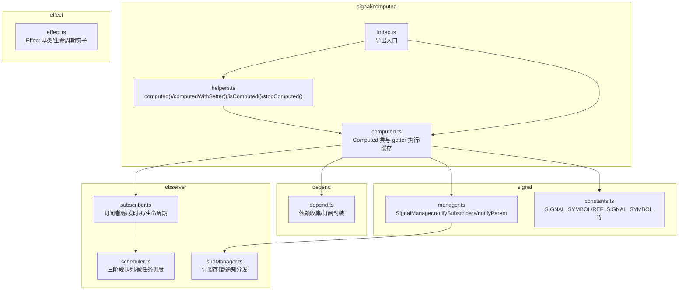
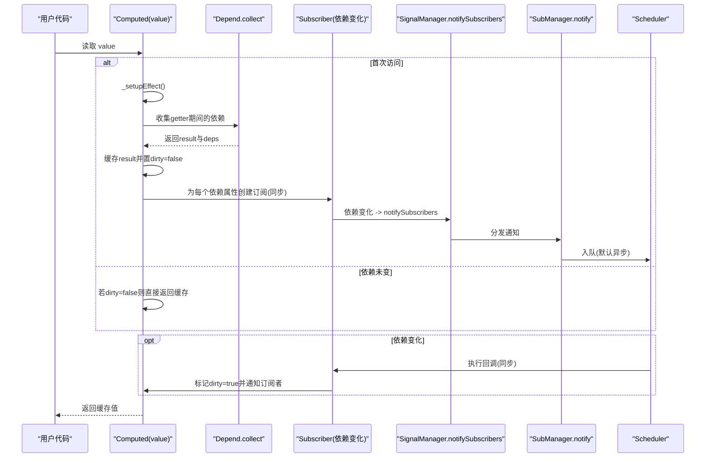
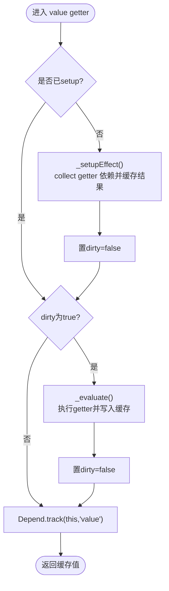
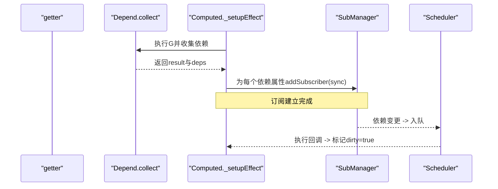
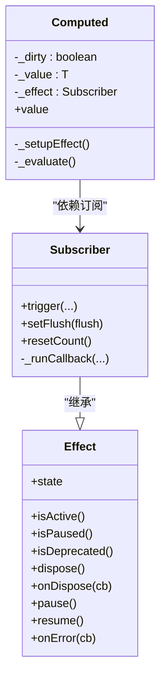
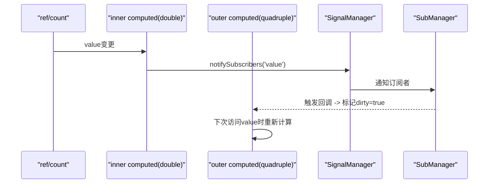
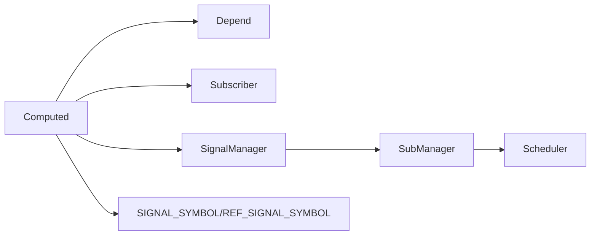

# Computed API

<cite>
**本文引用的文件**
- [packages/responsive/src/signal/computed/computed.ts](file://packages/responsive/src/signal/computed/computed.ts)
- [packages/responsive/src/signal/computed/helpers.ts](file://packages/responsive/src/signal/computed/helpers.ts)
- [packages/responsive/src/signal/computed/index.ts](file://packages/responsive/src/signal/computed/index.ts)
- [packages/responsive/src/depend/depend.ts](file://packages/responsive/src/depend/depend.ts)
- [packages/responsive/src/observer/subscriber.ts](file://packages/responsive/src/observer/subscriber.ts)
- [packages/responsive/src/observer/scheduler.ts](file://packages/responsive/src/observer/scheduler.ts)
- [packages/responsive/src/observer/subManager.ts](file://packages/responsive/src/observer/subManager.ts)
- [packages/responsive/src/signal/manager.ts](file://packages/responsive/src/signal/manager.ts)
- [packages/responsive/src/signal/constants.ts](file://packages/responsive/src/signal/constants.ts)
- [packages/responsive/src/effect/effect.ts](file://packages/responsive/src/effect/effect.ts)
- [packages/responsive/__tests__/signal/computed.test.ts](file://packages/responsive/__tests__/signal/computed.test.ts)
- [packages/responsive/__tests__/performance/computed.ts](file://packages/responsive/__tests__/performance/computed.ts)
</cite>

## 目录
1. [简介](#简介)
2. [项目结构](#项目结构)
3. [核心组件](#核心组件)
4. [架构总览](#架构总览)
5. [详细组件分析](#详细组件分析)
6. [依赖关系分析](#依赖关系分析)
7. [性能考量](#性能考量)
8. [故障排查指南](#故障排查指南)
9. [结论](#结论)
10. [附录](#附录)

## 简介
本篇文档围绕 vitarx 中的 Computed API，系统讲解其惰性求值与缓存机制，重点剖析 ComputedRefImpl（对应源码中的 Computed 类）如何基于依赖变化决定是否重新计算，getter 的执行时机与缓存失效策略，以及 dirty 标志位如何实现高效更新。文档还结合测试用例与性能脚本，给出派生状态计算（如列表过滤、数值汇总）的应用范式，解释 computed 与 effect 的内部统一调度机制，讨论嵌套 computed 的依赖追踪链路，并总结在性能优化中的价值与避免过度使用的注意事项。

## 项目结构
Computed API 位于 responsive 包的 signal/computed 目录，配合依赖收集、订阅者、调度器与信号管理器共同工作，形成“惰性求值 + 依赖追踪 + 统一调度”的响应式体系。

图表来源
- [packages/responsive/src/signal/computed/computed.ts](file://packages/responsive/src/signal/computed/computed.ts#L1-L367)
- [packages/responsive/src/signal/computed/helpers.ts](file://packages/responsive/src/signal/computed/helpers.ts#L1-L131)
- [packages/responsive/src/signal/computed/index.ts](file://packages/responsive/src/signal/computed/index.ts#L1-L3)
- [packages/responsive/src/depend/depend.ts](file://packages/responsive/src/depend/depend.ts#L1-L152)
- [packages/responsive/src/observer/subscriber.ts](file://packages/responsive/src/observer/subscriber.ts#L1-L248)
- [packages/responsive/src/observer/scheduler.ts](file://packages/responsive/src/observer/scheduler.ts#L1-L326)
- [packages/responsive/src/observer/subManager.ts](file://packages/responsive/src/observer/subManager.ts#L1-L424)
- [packages/responsive/src/signal/manager.ts](file://packages/responsive/src/signal/manager.ts#L1-L153)
- [packages/responsive/src/signal/constants.ts](file://packages/responsive/src/signal/constants.ts#L1-L25)
- [packages/responsive/src/effect/effect.ts](file://packages/responsive/src/effect/effect.ts#L1-L261)

章节来源
- [packages/responsive/src/signal/computed/index.ts](file://packages/responsive/src/signal/computed/index.ts#L1-L3)

## 核心组件
- Computed：惰性求值的计算属性实现，包含 getter 执行、缓存、dirty 标志、依赖订阅与作用域集成。
- Depend：依赖收集与订阅封装，负责在 getter 执行期间记录访问的响应式对象与属性。
- Subscriber：订阅者基类，提供触发时机（sync/default/pre/post）、限制触发次数、作用域管理与生命周期钩子。
- Scheduler：三阶段任务队列（preFlush/main/postFlush），基于微任务的批处理调度。
- SubManager：订阅存储与通知分发，支持属性级订阅、批量订阅、即时模式等。
- SignalManager：信号父子关系管理与通知传播，向上游父级传播变更。
- helpers：computed()/computedWithSetter()/isComputed()/stopComputed() 等工具函数。

章节来源
- [packages/responsive/src/signal/computed/computed.ts](file://packages/responsive/src/signal/computed/computed.ts#L98-L366)
- [packages/responsive/src/depend/depend.ts](file://packages/responsive/src/depend/depend.ts#L1-L152)
- [packages/responsive/src/observer/subscriber.ts](file://packages/responsive/src/observer/subscriber.ts#L1-L248)
- [packages/responsive/src/observer/scheduler.ts](file://packages/responsive/src/observer/scheduler.ts#L1-L326)
- [packages/responsive/src/observer/subManager.ts](file://packages/responsive/src/observer/subManager.ts#L1-L424)
- [packages/responsive/src/signal/manager.ts](file://packages/responsive/src/signal/manager.ts#L1-L153)
- [packages/responsive/src/signal/computed/helpers.ts](file://packages/responsive/src/signal/computed/helpers.ts#L1-L131)

## 架构总览
Computed 的核心流程如下：
- 首次访问 value 时，若未 setup，则调用 _setupEffect 建立依赖收集与订阅。
- 依赖收集阶段通过 Depend.collect 包裹 getter，记录访问过的响应式对象与属性。
- 为每个依赖属性创建 Subscriber，设置 flush 为 'sync'，以便依赖变化时立即触发。
- 计算阶段：当 dirty 为 true 时，执行 _evaluate 调用 getter 并写入缓存，同时清除 dirty。
- 访问 value 时，先判断 dirty，再追踪对该属性的访问，最后返回缓存值。

图表来源
- [packages/responsive/src/signal/computed/computed.ts](file://packages/responsive/src/signal/computed/computed.ts#L192-L366)
- [packages/responsive/src/depend/depend.ts](file://packages/responsive/src/depend/depend.ts#L66-L115)
- [packages/responsive/src/observer/subscriber.ts](file://packages/responsive/src/observer/subscriber.ts#L135-L206)
- [packages/responsive/src/observer/scheduler.ts](file://packages/responsive/src/observer/scheduler.ts#L81-L127)
- [packages/responsive/src/observer/subManager.ts](file://packages/responsive/src/observer/subManager.ts#L77-L121)
- [packages/responsive/src/signal/manager.ts](file://packages/responsive/src/signal/manager.ts#L115-L123)

## 详细组件分析

### Computed 类与惰性求值/缓存
- getter 执行时机
  - 首次访问 value 时，若未 setup，调用 _setupEffect。
  - _setupEffect 内部通过 Depend.collect 执行 getter，一次性收集依赖并缓存结果，同时将 dirty 置 false。
  - 后续访问 value 时，若 dirty 为 true，则执行 _evaluate 重新计算；否则直接返回缓存。
- dirty 标志位
  - 依赖变化时，onDependencyChange 将 dirty 置 true，并通过 SignalManager.notifySubscribers 通知订阅者。
  - 订阅者使用同步触发（flush='sync'），确保依赖变化立即生效。
- 缓存失效策略
  - 依赖属性变更 -> 订阅者触发 -> 标记 dirty=true -> 下次访问 value 时重新计算。
  - 若 getter 内未访问任何响应式属性，会发出警告，提示无依赖。
- setter 与 immediate
  - 支持自定义 setter，未提供时直接赋值会发出警告。
  - immediate=true 时在构造阶段即执行 getter 并缓存，无需首次访问。

图表来源
- [packages/responsive/src/signal/computed/computed.ts](file://packages/responsive/src/signal/computed/computed.ts#L192-L301)

章节来源
- [packages/responsive/src/signal/computed/computed.ts](file://packages/responsive/src/signal/computed/computed.ts#L192-L366)

### 依赖收集与订阅链路
- 依赖收集
  - Depend.collect 在上下文中执行函数，记录访问的响应式对象与属性，返回 result 与 deps。
- 订阅建立
  - Computed._setupEffect 为每个依赖属性创建 Subscriber，flush='sync'，立即响应依赖变化。
  - SubManager.addSubscriber 将订阅者注册到属性映射，支持批量订阅与清理。
- 通知传播
  - SignalManager.notifySubscribers -> SubManager.notify -> Scheduler 队列化执行。
  - 订阅者触发回调后，可能再次标记 dirty=true 并通知下游（如嵌套 computed）。

图表来源
- [packages/responsive/src/depend/depend.ts](file://packages/responsive/src/depend/depend.ts#L66-L115)
- [packages/responsive/src/observer/subManager.ts](file://packages/responsive/src/observer/subManager.ts#L149-L206)
- [packages/responsive/src/observer/scheduler.ts](file://packages/responsive/src/observer/scheduler.ts#L81-L127)
- [packages/responsive/src/signal/computed/computed.ts](file://packages/responsive/src/signal/computed/computed.ts#L313-L366)

章节来源
- [packages/responsive/src/depend/depend.ts](file://packages/responsive/src/depend/depend.ts#L1-L152)
- [packages/responsive/src/observer/subManager.ts](file://packages/responsive/src/observer/subManager.ts#L1-L424)
- [packages/responsive/src/signal/computed/computed.ts](file://packages/responsive/src/signal/computed/computed.ts#L313-L366)

### 与 effect 的统一调度机制
- Computed 内部使用 Subscriber 继承自 Effect，具备统一的生命周期与错误处理能力。
- 订阅者触发时，若 flush='sync'，则立即执行；否则通过 Scheduler 的队列机制进行批处理。
- SignalManager.notifySubscribers 既可通知当前信号，也可选择向上游通知父级信号，形成“自底向上”的传播链。

图表来源
- [packages/responsive/src/effect/effect.ts](file://packages/responsive/src/effect/effect.ts#L1-L261)
- [packages/responsive/src/observer/subscriber.ts](file://packages/responsive/src/observer/subscriber.ts#L1-L248)
- [packages/responsive/src/signal/computed/computed.ts](file://packages/responsive/src/signal/computed/computed.ts#L147-L366)

章节来源
- [packages/responsive/src/effect/effect.ts](file://packages/responsive/src/effect/effect.ts#L1-L261)
- [packages/responsive/src/observer/subscriber.ts](file://packages/responsive/src/observer/subscriber.ts#L1-L248)
- [packages/responsive/src/signal/computed/computed.ts](file://packages/responsive/src/signal/computed/computed.ts#L147-L366)

### 嵌套 computed 的依赖追踪链路
- 嵌套场景：外层 computed 依赖内层 computed 的 value；内层 computed 的依赖变化会通过 SignalManager.notifyParent 逐级向上通知。
- 依赖链：内层 computed -> 外层 computed -> 触发 UI 更新。
- 测试覆盖：嵌套 computed 场景在单元测试中得到验证。

图表来源
- [packages/responsive/__tests__/signal/computed.test.ts](file://packages/responsive/__tests__/signal/computed.test.ts#L96-L108)
- [packages/responsive/src/signal/manager.ts](file://packages/responsive/src/signal/manager.ts#L87-L123)
- [packages/responsive/src/signal/computed/computed.ts](file://packages/responsive/src/signal/computed/computed.ts#L313-L366)

章节来源
- [packages/responsive/__tests__/signal/computed.test.ts](file://packages/responsive/__tests__/signal/computed.test.ts#L96-L108)
- [packages/responsive/src/signal/manager.ts](file://packages/responsive/src/signal/manager.ts#L87-L123)

### 应用范式：派生状态计算
- 列表过滤：getter 内访问过滤条件与数据源，依赖变化时重新计算过滤结果。
- 数值汇总：getter 内聚合多个 ref 或 computed 的值，依赖变化时一次性更新。
- 性能要点：利用惰性求值与缓存，避免在 getter 中进行昂贵计算；必要时使用 immediate=true 预热。

章节来源
- [packages/responsive/__tests__/signal/computed.test.ts](file://packages/responsive/__tests__/signal/computed.test.ts#L1-L119)

## 依赖关系分析
- Computed 依赖
  - 依赖收集：Depend.collect
  - 订阅建立：SubManager.addSubscriber + Subscriber
  - 通知传播：SignalManager.notifySubscribers -> SubManager.notify -> Scheduler
  - 标识常量：SIGNAL_SYMBOL/REF_SIGNAL_SYMBOL/SIGNAL_RAW_VALUE_SYMBOL
- 辅助函数
  - computed()/computedWithSetter()/isComputed()/stopComputed() 提供易用 API 与生命周期控制。

图表来源
- [packages/responsive/src/signal/computed/computed.ts](file://packages/responsive/src/signal/computed/computed.ts#L1-L367)
- [packages/responsive/src/depend/depend.ts](file://packages/responsive/src/depend/depend.ts#L1-L152)
- [packages/responsive/src/observer/subscriber.ts](file://packages/responsive/src/observer/subscriber.ts#L1-L248)
- [packages/responsive/src/observer/subManager.ts](file://packages/responsive/src/observer/subManager.ts#L1-L424)
- [packages/responsive/src/observer/scheduler.ts](file://packages/responsive/src/observer/scheduler.ts#L1-L326)
- [packages/responsive/src/signal/manager.ts](file://packages/responsive/src/signal/manager.ts#L1-L153)
- [packages/responsive/src/signal/constants.ts](file://packages/responsive/src/signal/constants.ts#L1-L25)

章节来源
- [packages/responsive/src/signal/computed/helpers.ts](file://packages/responsive/src/signal/computed/helpers.ts#L1-L131)
- [packages/responsive/src/signal/computed/index.ts](file://packages/responsive/src/signal/computed/index.ts#L1-L3)

## 性能考量
- 惰性求值与缓存
  - 首次访问才计算，后续访问直接返回缓存；依赖未变时不重复计算。
  - 单次依赖变更，多次访问 value 时只在 dirty=true 时重新计算。
- 批处理与同步
  - 默认通过 Scheduler 进行微任务批处理，减少重复渲染；依赖变化使用 Subscriber 的 sync 模式确保即时响应。
- 性能测试
  - 性能脚本创建大量 computed 并绑定 watch，修改 ref 后统计执行时间与内存增量，验证在高频创建下的稳定性与开销可控。

章节来源
- [packages/responsive/__tests__/performance/computed.ts](file://packages/responsive/__tests__/performance/computed.ts#L1-L27)
- [packages/responsive/src/observer/scheduler.ts](file://packages/responsive/src/observer/scheduler.ts#L81-L127)
- [packages/responsive/src/observer/subscriber.ts](file://packages/responsive/src/observer/subscriber.ts#L175-L206)

## 故障排查指南
- 无依赖警告
  - 若 getter 内未访问任何响应式属性，会发出“未检测到依赖”的警告，需检查 getter 是否正确访问信号属性。
- 直接修改计算属性
  - 未提供 setter 时直接赋值会发出警告；如需修改，应提供 setter 或通过 setter 改写底层 ref。
- 停止监听
  - stopComputed 可停止对依赖的监听并返回最终缓存值，适合需要固定值的场景。

章节来源
- [packages/responsive/src/signal/computed/computed.ts](file://packages/responsive/src/signal/computed/computed.ts#L227-L235)
- [packages/responsive/src/signal/computed/computed.ts](file://packages/responsive/src/signal/computed/computed.ts#L361-L364)
- [packages/responsive/src/signal/computed/helpers.ts](file://packages/responsive/src/signal/computed/helpers.ts#L101-L131)

## 结论
Computed API 通过“惰性求值 + 依赖收集 + 同步订阅 + 统一调度”的组合，实现了高效且可控的派生状态计算。dirty 标志位与缓存机制确保在依赖未变化时避免重复计算；sync 订阅模式保证依赖变化的即时响应；SignalManager 的通知链路使嵌套 computed 的更新路径清晰可靠。合理使用 immediate 与 stopComputed 可进一步提升性能与灵活性。

## 附录
- API 快速参考
  - computed(getter, options?)：创建惰性计算属性
  - computedWithSetter(getter, setter, options?)：带 setter 的计算属性
  - isComputed(val)：判断是否为计算属性
  - stopComputed(valOrComputed)：停止监听并返回最终值
- 常见误区
  - 在 getter 中进行昂贵计算：应拆分为多个小的 computed，按需组合
  - 过度嵌套：注意依赖链长度与通知传播成本
  - 忽视 immediate：在需要预热或首屏渲染时可开启立即计算

章节来源
- [packages/responsive/src/signal/computed/helpers.ts](file://packages/responsive/src/signal/computed/helpers.ts#L1-L131)
- [packages/responsive/src/signal/computed/computed.ts](file://packages/responsive/src/signal/computed/computed.ts#L156-L174)