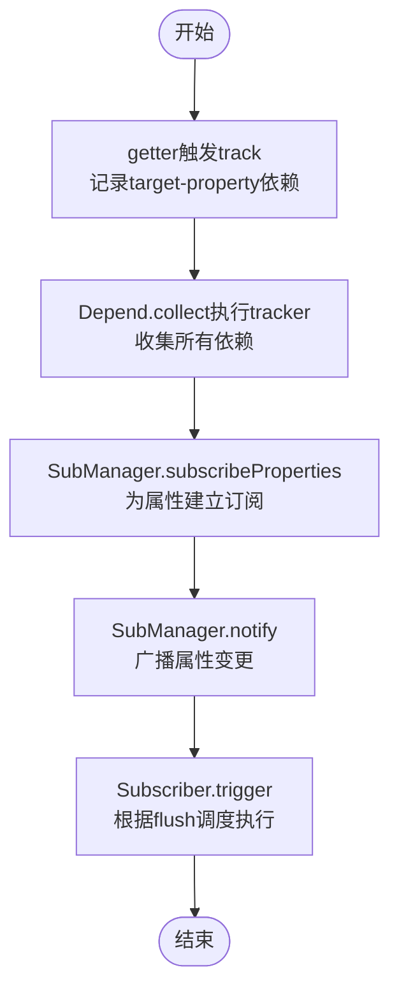

# Effect系统

<cite>
**本文引用的文件**
- [effect.ts](file://packages/responsive/src/effect/effect.ts)
- [effect-scope.ts](file://packages/responsive/src/effect/effect-scope.ts)
- [effect-interface.ts](file://packages/responsive/src/effect/effect-interface.ts)
- [helpers.ts](file://packages/responsive/src/effect/helpers.ts)
- [index.ts](file://packages/responsive/src/effect/index.ts)
- [context.ts](file://packages/responsive/src/context/context.ts)
- [depend.ts](file://packages/responsive/src/depend/depend.ts)
- [scheduler.ts](file://packages/responsive/src/observer/scheduler.ts)
- [subscriber.ts](file://packages/responsive/src/observer/subscriber.ts)
- [subManager.ts](file://packages/responsive/src/observer/subManager.ts)
- [effect.test.ts](file://packages/responsive/__tests__/effect/effect.test.ts)
- [effect-scope.test.ts](file://packages/responsive/__tests__/effect/effect-scope.test.ts)
- [README.md](file://packages/responsive/README.md)
</cite>

## 目录
1. [简介](#简介)
2. [项目结构](#项目结构)
3. [核心组件](#核心组件)
4. [架构总览](#架构总览)
5. [详细组件分析](#详细组件分析)
6. [依赖分析](#依赖分析)
7. [性能考虑](#性能考虑)
8. [故障排查指南](#故障排查指南)
9. [结论](#结论)
10. [附录](#附录)

## 简介
本篇文档聚焦于 vitarx 响应式系统中的 Effect 系统，系统性剖析 ReactiveEffect 的职责边界与生命周期管理，详解 EffectScope 如何实现副作用作用域的批量管理与清理，以及依赖收集（Depend）与副作用触发的完整生命周期：从 getter 触发 track 到 scheduler 调度 run 的全过程。同时，结合 sync、pre、post 等调度优先级在渲染更新中的意义，给出在实际场景中如何正确使用 effect 进行副作用控制的最佳实践。

## 项目结构
Effect 系统位于响应式核心包中，围绕“副作用生命周期管理 + 作用域 + 依赖收集 + 调度执行”四要素展开：
- effect 层：定义副作用接口与具体实现，提供状态机与错误处理能力
- effect-scope 层：在上下文环境中统一管理多个副作用的生命周期
- depend 层：负责依赖收集与订阅建立，贯穿 getter 触发与属性访问
- observer 层：订阅者与调度器，将依赖变更转化为可调度的任务执行
- context 层：提供上下文隔离与异步上下文维护，确保作用域与依赖收集的正确性

图表来源
- [effect-interface.ts](file://packages/responsive/src/effect/effect-interface.ts#L1-L224)
- [effect.ts](file://packages/responsive/src/effect/effect.ts#L1-L261)
- [effect-scope.ts](file://packages/responsive/src/effect/effect-scope.ts#L1-L212)
- [helpers.ts](file://packages/responsive/src/effect/helpers.ts#L1-L57)
- [context.ts](file://packages/responsive/src/context/context.ts#L1-L138)
- [depend.ts](file://packages/responsive/src/depend/depend.ts#L1-L152)
- [subscriber.ts](file://packages/responsive/src/observer/subscriber.ts#L1-L248)
- [subManager.ts](file://packages/responsive/src/observer/subManager.ts#L1-L424)
- [scheduler.ts](file://packages/responsive/src/observer/scheduler.ts#L1-L326)

章节来源
- [index.ts](file://packages/responsive/src/effect/index.ts#L1-L5)
- [README.md](file://packages/responsive/README.md#L957-L1046)

## 核心组件
- Effect 接口与实现：提供副作用的生命周期管理（active/paused/deprecated）、事件监听（dispose/pause/resume/onError）与错误处理机制
- EffectScope：在上下文中统一管理多个副作用，支持批量销毁、暂停/恢复与错误聚合处理
- Depend：在 getter 触发时进行依赖收集，建立 target-property 的依赖映射，并可订阅属性变化
- Subscriber/SubManager/Scheduler：将依赖变更转化为可调度的任务，支持 pre/default/post/sync 等调度优先级

章节来源
- [effect-interface.ts](file://packages/responsive/src/effect/effect-interface.ts#L1-L224)
- [effect.ts](file://packages/responsive/src/effect/effect.ts#L1-L261)
- [effect-scope.ts](file://packages/responsive/src/effect/effect-scope.ts#L1-L212)
- [depend.ts](file://packages/responsive/src/depend/depend.ts#L1-L152)
- [subscriber.ts](file://packages/responsive/src/observer/subscriber.ts#L1-L248)
- [subManager.ts](file://packages/responsive/src/observer/subManager.ts#L1-L424)
- [scheduler.ts](file://packages/responsive/src/observer/scheduler.ts#L1-L326)

## 架构总览
下面的序列图展示了从 getter 触发 track 到 scheduler 调度 run 的完整生命周期：

图表来源
- [depend.ts](file://packages/responsive/src/depend/depend.ts#L59-L151)
- [context.ts](file://packages/responsive/src/context/context.ts#L1-L138)
- [subManager.ts](file://packages/responsive/src/observer/subManager.ts#L77-L91)
- [subscriber.ts](file://packages/responsive/src/observer/subscriber.ts#L175-L205)
- [scheduler.ts](file://packages/responsive/src/observer/scheduler.ts#L250-L326)

## 详细组件分析

### Effect 类：副作用生命周期与错误处理
- 状态机：active/paused/deprecated，提供 isActive/isPaused/isDeprecated/state/getState 等便捷访问
- 生命周期钩子：onDispose/onPause/onResume/onError，支持在销毁、暂停、恢复与错误时执行回调
- 错误处理：reportError 会兜底处理回调抛错，避免中断整体流程；禁止在 onError 中继续抛错
- 资源清理：dispose 会触发 dispose 回调并清空回调集合；pause/resume 严格校验状态

图表来源
- [effect.ts](file://packages/responsive/src/effect/effect.ts#L96-L133)
- [effect.ts](file://packages/responsive/src/effect/effect.ts#L165-L215)
- [README.md](file://packages/responsive/README.md#L957-L982)

章节来源
- [effect.ts](file://packages/responsive/src/effect/effect.ts#L1-L261)
- [effect-interface.ts](file://packages/responsive/src/effect/effect-interface.ts#L1-L224)
- [effect.test.ts](file://packages/responsive/__tests__/effect/effect.test.ts#L1-L133)

### EffectScope：作用域的批量管理与清理
- 上下文绑定：通过 Context.run 将 EffectScope 作为上下文标签注入，使依赖收集与副作用创建在正确作用域内进行
- 副作用管理：addEffect 自动将副作用加入 Set，并在副作用 dispose 时自动移除；支持批量 dispose/pause/resume
- 错误聚合：可配置 errorHandler，作用域内副作用 onError 时统一由 errorHandler 处理
- 作用域附加：attachToCurrentScope 选项可将新建作用域自动附加到当前作用域，便于层级管理

图表来源
- [effect.ts](file://packages/responsive/src/effect/effect.ts#L1-L261)
- [effect-scope.ts](file://packages/responsive/src/effect/effect-scope.ts#L1-L212)
- [context.ts](file://packages/responsive/src/context/context.ts#L1-L138)

章节来源
- [effect-scope.ts](file://packages/responsive/src/effect/effect-scope.ts#L1-L212)
- [helpers.ts](file://packages/responsive/src/effect/helpers.ts#L1-L57)
- [effect-scope.test.ts](file://packages/responsive/__tests__/effect/effect-scope.test.ts#L1-L155)

### 依赖收集（Depend）与订阅（SubManager/Subscriber）
- 依赖收集：Depend.track 在 getter 中被调用，借助 Context 上下文收集 target-property 映射
- 订阅建立：Depend.subscribe 收集 tracker 中访问的依赖，为每个属性建立 Subscriber，并通过 SubManager.subscribeProperties 将订阅注册到目标对象
- 通知触发：SubManager.notify 将变更广播给订阅者；Subscriber.trigger 根据 flush 选择同步或异步执行，并在 limit 到达时自动销毁

图表来源
- [depend.ts](file://packages/responsive/src/depend/depend.ts#L59-L151)
- [subManager.ts](file://packages/responsive/src/observer/subManager.ts#L123-L206)
- [subscriber.ts](file://packages/responsive/src/observer/subscriber.ts#L175-L205)

章节来源
- [depend.ts](file://packages/responsive/src/depend/depend.ts#L1-L152)
- [subManager.ts](file://packages/responsive/src/observer/subManager.ts#L1-L424)
- [subscriber.ts](file://packages/responsive/src/observer/subscriber.ts#L1-L248)

### 调度优先级：sync、pre、post 在渲染更新中的意义
- sync：立即执行，不进入微任务队列，适合需要“立刻可见”的关键路径（如强制同步刷新）
- pre：在主任务队列之前执行，适合前置清理或准备逻辑（如清理上次渲染残留）
- default：常规渲染更新，按微任务批处理执行，减少重复渲染
- post：在主任务队列之后执行，适合后置收尾（如日志上报、统计）

图表来源
- [scheduler.ts](file://packages/responsive/src/observer/scheduler.ts#L250-L326)
- [subscriber.ts](file://packages/responsive/src/observer/subscriber.ts#L180-L205)

章节来源
- [scheduler.ts](file://packages/responsive/src/observer/scheduler.ts#L1-L326)
- [subscriber.ts](file://packages/responsive/src/observer/subscriber.ts#L1-L248)

### 实战建议与最佳实践
- 使用 EffectScope 管理组件/页面级副作用，确保在组件卸载时统一销毁，避免内存泄漏
- 在需要“立刻可见”的场景使用 flush='sync' 或者 Scheduler.flushSync，但注意避免阻塞主线程
- 使用 pre 阶段进行必要的前置清理，post 阶段进行后置收尾，避免渲染抖动
- 对于高频变更，尽量使用 default 或 post，让调度器自动合并多次变更
- 通过 SubManager.subscribeProperties 一次性订阅多个属性，减少重复订阅开销

章节来源
- [README.md](file://packages/responsive/README.md#L957-L1046)
- [scheduler.ts](file://packages/responsive/src/observer/scheduler.ts#L183-L202)
- [subManager.ts](file://packages/responsive/src/observer/subManager.ts#L177-L206)

## 依赖分析
Effect 系统内部模块耦合关系如下：
- Effect 与 EffectScope：继承关系，作用域扩展副作用能力
- Depend 与 Context：依赖收集依赖上下文隔离
- SubManager 与 Subscriber：订阅管理与执行分离
- Subscriber 与 Scheduler：订阅触发与调度解耦
- helpers：对外导出 createScope/getCurrentScope/addEffect 等便捷工具

图表来源
- [effect.ts](file://packages/responsive/src/effect/effect.ts#L1-L261)
- [effect-scope.ts](file://packages/responsive/src/effect/effect-scope.ts#L1-L212)
- [helpers.ts](file://packages/responsive/src/effect/helpers.ts#L1-L57)
- [context.ts](file://packages/responsive/src/context/context.ts#L1-L138)
- [depend.ts](file://packages/responsive/src/depend/depend.ts#L1-L152)
- [subManager.ts](file://packages/responsive/src/observer/subManager.ts#L1-L424)
- [subscriber.ts](file://packages/responsive/src/observer/subscriber.ts#L1-L248)
- [scheduler.ts](file://packages/responsive/src/observer/scheduler.ts#L1-L326)

章节来源
- [index.ts](file://packages/responsive/src/effect/index.ts#L1-L5)

## 性能考虑
- 任务批处理：Scheduler 通过三阶段队列与微任务合并，降低频繁更新带来的性能损耗
- 参数合并：queueJob 支持参数处理器，同一批次内合并新旧参数，减少重复计算
- 依赖收集最小化：Depend.collect 仅在上下文中进行，避免全局污染
- 订阅去重：SubManager 对属性订阅进行集合管理，自动清理空集合，释放内存

章节来源
- [scheduler.ts](file://packages/responsive/src/observer/scheduler.ts#L205-L326)
- [subManager.ts](file://packages/responsive/src/observer/subManager.ts#L330-L424)
- [depend.ts](file://packages/responsive/src/depend/depend.ts#L75-L80)

## 故障排查指南
- 副作用未销毁：确认是否在 EffectScope 中注册，或是否在作用域 dispose 后仍持有引用
- 依赖未触发：检查 getter 是否在 Context.run 中执行，确保上下文一致
- 调度顺序异常：核对 flush 配置，必要时使用 flushSync 或调整 pre/default/post
- 错误未被捕获：确保在副作用上注册 onError，或在 EffectScope 上配置 errorHandler

章节来源
- [effect.test.ts](file://packages/responsive/__tests__/effect/effect.test.ts#L1-L133)
- [effect-scope.test.ts](file://packages/responsive/__tests__/effect/effect-scope.test.ts#L1-L155)
- [effect.ts](file://packages/responsive/src/effect/effect.ts#L165-L215)
- [scheduler.ts](file://packages/responsive/src/observer/scheduler.ts#L305-L326)

## 结论
Effect 系统通过“接口抽象 + 作用域 + 依赖收集 + 调度执行”的组合，为响应式更新提供了稳定、可控且高性能的执行引擎。Effect 提供了完善的生命周期与错误处理，EffectScope 实现了副作用的批量管理与清理，Depend/SubManager/Subscriber/Scheduler 将依赖变更转化为可调度的任务执行，并通过 sync/pre/post 等优先级满足不同渲染场景的需求。在实际开发中，合理使用作用域与调度优先级，可显著提升资源管理效率与渲染性能。

## 附录
- API 导出入口：effect/index.ts 汇总导出接口、实现与工具函数
- 使用示例与生命周期说明：见响应式包 README 的 Effect/EffectScope 章节

章节来源
- [index.ts](file://packages/responsive/src/effect/index.ts#L1-L5)
- [README.md](file://packages/responsive/README.md#L957-L1046)