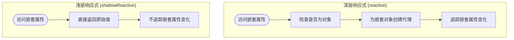

# Reactive API

<cite>
**本文档引用的文件**
- [proxy-handler.ts](file://packages/responsive/src/signal/reactive/proxy-handler.ts)
- [helpers.ts](file://packages/responsive/src/signal/reactive/helpers.ts)
- [ref.ts](file://packages/responsive/src/signal/ref/ref.ts)
- [readonly.ts](file://packages/responsive/src/signal/readonly/readonly.ts)
- [readonly-helpers.ts](file://packages/responsive/src/signal/readonly/helpers.ts)
- [proxy.ts](file://packages/responsive/src/signal/types/proxy.ts)
- [base.ts](file://packages/responsive/src/signal/types/base.ts)
- [depend.ts](file://packages/responsive/src/depend/depend.ts)
- [constants.ts](file://packages/responsive/src/signal/constants.ts)
</cite>

## 目录
1. [引言](#引言)
2. [Reactive API 核心架构](#reactive-api-核心架构)
3. [深层响应式追踪实现原理](#深层响应式追踪实现原理)
4. [Proxy处理器陷阱函数实现](#proxy处理器陷阱函数实现)
5. [readonly与shallowReactive行为差异](#readonly与shallowreactive行为差异)
6. [状态管理中的典型用法](#状态管理中的典型用法)
7. [与ref的互操作性](#与ref的互操作性)
8. [Proxy局限性及特殊处理策略](#proxy局限性及特殊处理策略)

## 引言
Reactive API是vitarx框架中实现响应式系统的核心机制，通过ES6 Proxy代理对象实现深层响应式追踪。该系统能够自动追踪对象属性的访问和修改，当数据发生变化时自动通知依赖的观察者进行更新。本文档将深入解析其内部实现原理，重点说明如何利用Proxy实现深层响应式追踪，以及不同响应式深度场景下的行为差异。

## Reactive API 核心架构


**图示来源**
- [proxy-handler.ts](file://packages/responsive/src/signal/reactive/proxy-handler.ts#L83-L156)
- [ref.ts](file://packages/responsive/src/signal/ref/ref.ts#L70-L287)
- [readonly.ts](file://packages/responsive/src/signal/readonly/readonly.ts#L39-L109)
- [depend.ts](file://packages/responsive/src/depend/depend.ts#L41-L152)

## 深层响应式追踪实现原理

Reactive API通过`ReactiveProxyHandler`类实现深层响应式追踪，其核心机制是利用ES6 Proxy拦截对象的属性访问和修改操作。当创建一个响应式对象时，系统会递归地为嵌套对象创建代理，从而实现深层响应式追踪。

深层响应式追踪的关键在于惰性代理机制：只有当访问某个嵌套属性时，才会为其创建代理对象。这种延迟创建的方式既保证了响应式能力，又避免了不必要的性能开销。


**图示来源**
- [proxy-handler.ts](file://packages/responsive/src/signal/reactive/proxy-handler.ts#L83-L300)
- [manager.ts](file://packages/responsive/src/signal/manager.ts)
- [depend.ts](file://packages/responsive/src/depend/depend.ts#L41-L152)

**本节来源**
- [proxy-handler.ts](file://packages/responsive/src/signal/reactive/proxy-handler.ts#L83-L300)
- [helpers.ts](file://packages/responsive/src/signal/reactive/helpers.ts#L35-L43)

## Proxy处理器陷阱函数实现

### get陷阱函数实现

`get`陷阱函数是实现响应式追踪的核心，它负责拦截属性访问操作并收集依赖。当访问一个属性时，系统会记录这个访问行为，建立属性与观察者之间的依赖关系。


**图示来源**
- [proxy-handler.ts](file://packages/responsive/src/signal/reactive/proxy-handler.ts#L171-L214)

### set陷阱函数实现

`set`陷阱函数负责拦截属性设置操作，当属性值发生变化时通知所有依赖的观察者。系统会先比较新旧值，只有当值真正发生变化时才会触发更新。


**图示来源**
- [proxy-handler.ts](file://packages/responsive/src/signal/reactive/proxy-handler.ts#L251-L263)

### has和ownKeys陷阱函数实现

`has`陷阱函数用于拦截`in`操作符和`hasOwnProperty`方法调用，而`ownKeys`陷阱函数拦截`Object.keys`、`Object.getOwnPropertyNames`等操作。这些陷阱函数确保在访问对象元信息时也能正确收集依赖。


**图示来源**
- [proxy-handler.ts](file://packages/responsive/src/signal/reactive/proxy-handler.ts#L237-L240)
- [proxy-handler.ts](file://packages/responsive/src/signal/reactive/proxy-handler.ts#L251-L263)

**本节来源**
- [proxy-handler.ts](file://packages/responsive/src/signal/reactive/proxy-handler.ts#L171-L263)

## readonly与shallowReactive行为差异

### readonly实现原理

`readonly`函数创建一个只读的代理对象，阻止对对象属性的修改和删除操作。它通过`ReadonlyHandler`类实现，该类拦截`set`和`deleteProperty`操作并根据配置采取不同的处理策略。

```mermaid
classDiagram
class ReadonlyHandler {
+create<T>(target : T, options? : ReadonlyOptions) : DeepReadonly<T>
+set(target : any, prop : any, value : any) : boolean
+deleteProperty(target : any, prop : any) : boolean
+get(target : T, prop : any, receiver : any) : any
-createMessage(prop : any) : string
}
class ReadonlyOptions {
+deep : boolean
+write : WriteHandleMode
+message : string
}
enum WriteHandleMode {
error
warning
warningAndWrite
}
ReadonlyHandler --> ReadonlyOptions
ReadonlyHandler --> WriteHandleMode
```

**图示来源**
- [readonly.ts](file://packages/responsive/src/signal/readonly/readonly.ts#L39-L109)
- [helpers.ts](file://packages/responsive/src/signal/readonly/helpers.ts#L28-L36)

### shallowReactive实现原理

`shallowReactive`函数创建一个浅层响应式对象，只对对象的直接属性进行响应式处理，而不递归处理嵌套对象。这与`reactive`函数的深层响应式形成对比。



**图示来源**
- [helpers.ts](file://packages/responsive/src/signal/reactive/helpers.ts#L56-L61)
- [helpers.ts](file://packages/responsive/src/signal/readonly/helpers.ts#L61-L66)

**本节来源**
- [readonly.ts](file://packages/responsive/src/signal/readonly/readonly.ts#L39-L136)
- [helpers.ts](file://packages/responsive/src/signal/readonly/helpers.ts#L28-L67)
- [helpers.ts](file://packages/responsive/src/signal/reactive/helpers.ts#L56-L61)

## 状态管理中的典型用法

### 基本响应式对象创建

使用`reactive`函数可以创建一个深层响应式对象，所有嵌套属性都会被自动转换为响应式。


**图示来源**
- [helpers.ts](file://packages/responsive/src/signal/reactive/helpers.ts#L35-L43)
- [proxy-handler.ts](file://packages/responsive/src/signal/reactive/proxy-handler.ts#L378-L397)

### 数组响应式处理

对于数组类型，Reactive API有特殊的处理策略，特别是对`length`属性的追踪和数组方法的代理。


**图示来源**
- [proxy-handler.ts](file://packages/responsive/src/signal/reactive/proxy-handler.ts#L119-L138)

**本节来源**
- [helpers.ts](file://packages/responsive/src/signal/reactive/helpers.ts#L35-L43)
- [proxy-handler.ts](file://packages/responsive/src/signal/reactive/proxy-handler.ts#L119-L138)

## 与ref的互操作性

### ref与reactive的集成

`ref`和`reactive`是Reactive API的两个核心函数，它们可以无缝集成使用。当`ref`包装一个对象时，如果配置为深度响应式，该对象会被自动转换为`reactive`对象。


**图示来源**
- [ref.ts](file://packages/responsive/src/signal/ref/ref.ts#L70-L287)
- [proxy-handler.ts](file://packages/responsive/src/signal/reactive/proxy-handler.ts#L83-L156)

### 自动解包机制

Reactive API实现了自动解包机制，当`reactive`对象包含`ref`时，访问这些属性会自动解包`ref`的`value`。


**图示来源**
- [proxy-handler.ts](file://packages/responsive/src/signal/reactive/proxy-handler.ts#L193-L197)
- [proxy-handler.ts](file://packages/responsive/src/signal/reactive/proxy-handler.ts#L256-L258)

**本节来源**
- [ref.ts](file://packages/responsive/src/signal/ref/ref.ts#L70-L287)
- [proxy-handler.ts](file://packages/responsive/src/signal/reactive/proxy-handler.ts#L193-L197)

## Proxy局限性及特殊处理策略

### 数组特殊处理

由于Proxy无法直接监听数组索引的变化，Reactive API采用了特殊的策略来处理数组响应式。


**图示来源**
- [proxy-handler.ts](file://packages/responsive/src/signal/reactive/proxy-handler.ts#L119-L138)

### 集合类型处理

对于Set和Map等集合类型，Reactive API通过创建特殊的代理来处理`size`属性的响应式追踪。


**图示来源**
- [proxy-handler.ts](file://packages/responsive/src/signal/reactive/proxy-handler.ts#L307-L343)

### 性能优化策略

Reactive API采用了多种性能优化策略，包括惰性代理、缓存机制和避免重复代理。


**图示来源**
- [proxy-handler.ts](file://packages/responsive/src/signal/reactive/proxy-handler.ts#L388-L392)
- [readonly.ts](file://packages/responsive/src/signal/readonly/readonly.ts#L61-L64)

**本节来源**
- [proxy-handler.ts](file://packages/responsive/src/signal/reactive/proxy-handler.ts#L307-L397)
- [readonly.ts](file://packages/responsive/src/signal/readonly/readonly.ts#L61-L64)