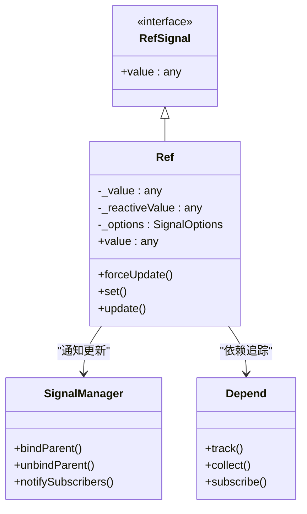
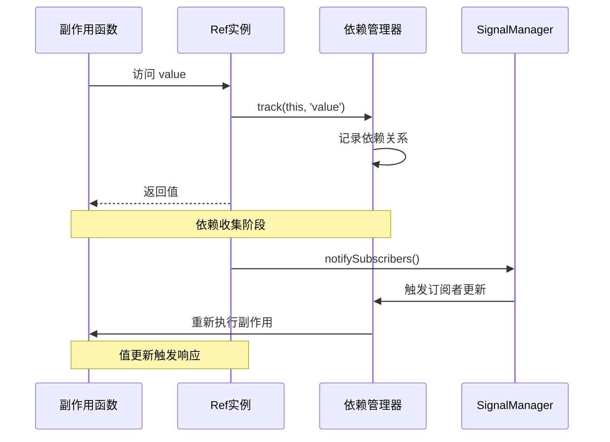
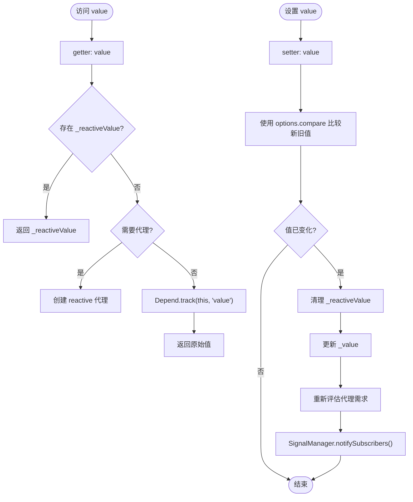
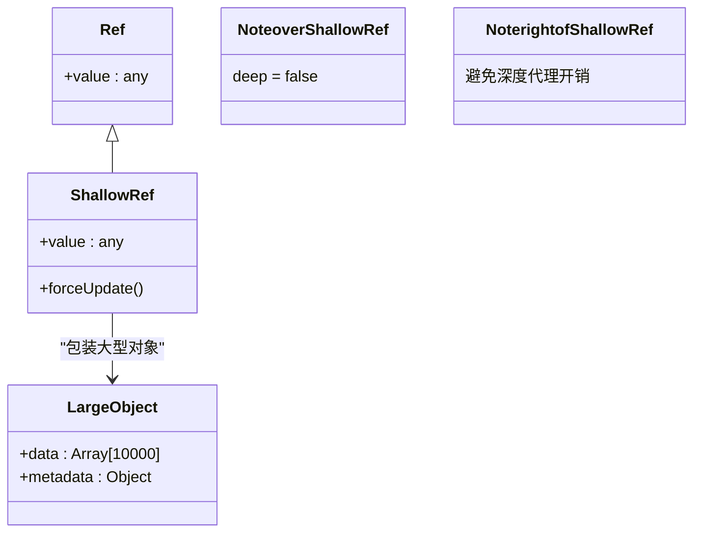
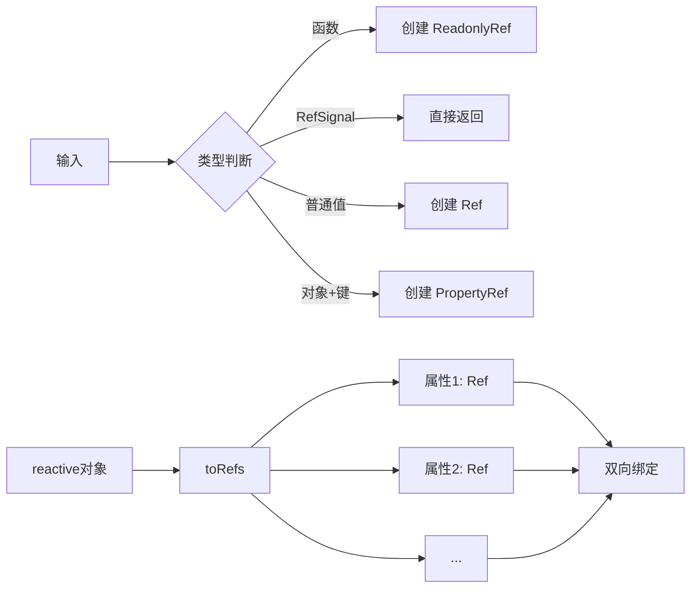
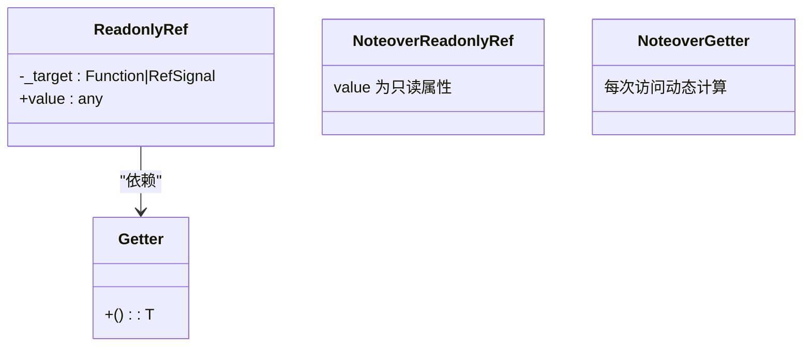
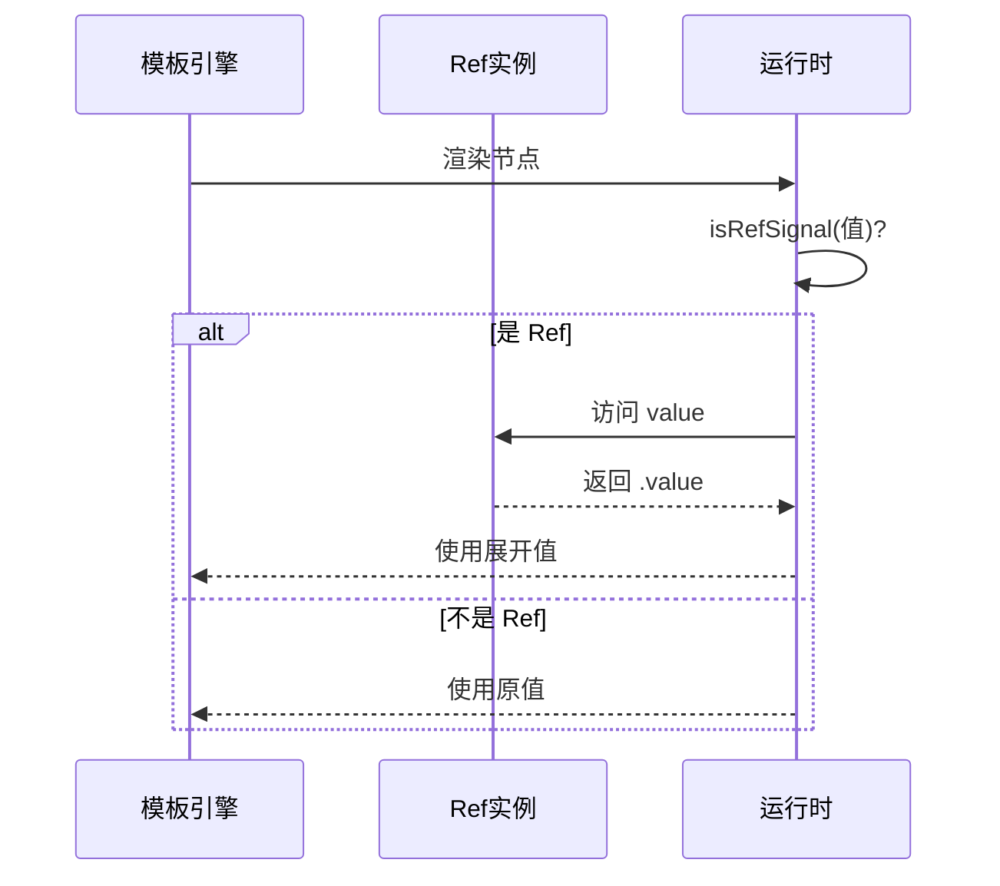

# Ref API

<cite>
**本文档中引用的文件**  
- [ref.ts](file://packages/responsive/src/signal/ref/ref.ts)
- [helpers.ts](file://packages/responsive/src/signal/ref/helpers.ts)
- [property.ts](file://packages/responsive/src/signal/ref/property.ts)
- [readonly.ts](file://packages/responsive/src/signal/ref/readonly.ts)
- [types/ref.ts](file://packages/responsive/src/signal/types/ref.ts)
- [ref.test.ts](file://packages/responsive/__tests__/signal/ref.test.ts)
- [depend.ts](file://packages/responsive/src/depend/depend.ts)
- [manager.ts](file://packages/responsive/src/signal/manager.ts)
- [verify.ts](file://packages/responsive/src/signal/utils/verify.ts)
- [mark.ts](file://packages/responsive/src/signal/utils/mark.ts)
- [constants.ts](file://packages/responsive/src/signal/constants.ts)
- [ref.ts](file://packages/runtime-core/src/utils/ref.ts)
</cite>

## 目录
1. [引言](#引言)
2. [Ref API 设计与实现机制](#ref-api-设计与实现机制)
3. [RefSignal 类的响应式追踪机制](#refsignal-类的响应式追踪机制)
4. [.value 属性的依赖收集与副作用更新](#value-属性的依赖收集与副作用更新)
5. [shallowRef 的性能优化场景](#shallowref-的性能优化场景)
6. [toRef/toRefs 的响应式解构用法](#toreftorefs-的响应式解构用法)
7. [readonlyRef 的只读实现原理](#readonlyref-的只读实现原理)
8. [ref 与 reactive 的自动深层解包行为](#ref-与-reactive-对象的自动深层解包行为)
9. [模板中 ref 自动展开机制](#模板中-ref-自动展开机制)
10. [结论](#结论)

## 引言
Ref API 是 vitarx 响应式系统的核心组成部分，提供了一种灵活且类型安全的方式来创建和管理响应式数据。通过 `ref` 函数创建的 `RefSignal` 对象，能够包装任意类型的值并使其具备响应式能力。该机制不仅支持基本类型，还能处理复杂对象、嵌套结构以及函数式引用，为开发者提供了统一的响应式编程接口。

**Section sources**
- [ref.ts](file://packages/responsive/src/signal/ref/ref.ts#L1-L473)

## Ref API 设计与实现机制
Ref API 的核心是 `Ref` 类，它实现了 `RefSignal` 接口，通过 `value` 属性提供响应式访问。`Ref` 类使用符号（Symbol）作为内部标识，确保类型安全和运行时识别。其设计遵循单一职责原则，专注于值的包装与响应式追踪，同时通过配置选项支持深度代理和自定义比较函数。



**Diagram sources**
- [ref.ts](file://packages/responsive/src/signal/ref/ref.ts#L70-L287)
- [types/ref.ts](file://packages/responsive/src/signal/types/ref.ts#L10-L22)
- [manager.ts](file://packages/responsive/src/signal/manager.ts#L17-L123)
- [depend.ts](file://packages/responsive/src/depend/depend.ts#L41-L152)

**Section sources**
- [ref.ts](file://packages/responsive/src/signal/ref/ref.ts#L70-L287)
- [types/ref.ts](file://packages/responsive/src/signal/types/ref.ts#L10-L22)

## RefSignal 类的响应式追踪机制
`RefSignal` 类通过 `SIGNAL_SYMBOL` 和 `REF_SIGNAL_SYMBOL` 两个符号标记其响应式身份。当 `value` 属性被访问时，`Depend.track()` 方法被调用，将当前 `Ref` 实例注册为依赖。这种机制使得任何读取 `value` 的副作用函数都能被正确追踪，并在值变化时重新执行。



**Diagram sources**
- [ref.ts](file://packages/responsive/src/signal/ref/ref.ts#L136-L147)
- [depend.ts](file://packages/responsive/src/depend/depend.ts#L59-L64)
- [manager.ts](file://packages/responsive/src/signal/manager.ts#L115-L122)

**Section sources**
- [ref.ts](file://packages/responsive/src/signal/ref/ref.ts#L136-L147)
- [depend.ts](file://packages/responsive/src/depend/depend.ts#L59-L64)

## .value 属性的依赖收集与副作用更新
`.value` 属性的 getter 和 setter 是响应式系统的核心。getter 调用 `Depend.track()` 收集依赖，而 setter 在值变化时通过 `SignalManager.notifySubscribers()` 通知所有订阅者。值比较使用 `Object.is` 语义，确保精确的变更检测。



**Diagram sources**
- [ref.ts](file://packages/responsive/src/signal/ref/ref.ts#L136-L182)
- [manager.ts](file://packages/responsive/src/signal/manager.ts#L115-L122)

**Section sources**
- [ref.ts](file://packages/responsive/src/signal/ref/ref.ts#L136-L182)

## shallowRef 的性能优化场景
`shallowRef` 创建浅层响应式引用，仅对顶层 `value` 变化进行追踪，不对嵌套对象进行深度代理。这在处理大型对象或性能敏感场景时能显著减少代理开销。当需要更新嵌套属性时，可调用 `forceUpdate()` 手动触发通知。



**Diagram sources**
- [ref.ts](file://packages/responsive/src/signal/ref/ref.ts#L413-L472)
- [ref.test.ts](file://packages/responsive/__tests__/signal/ref.test.ts#L64-L70)

**Section sources**
- [ref.ts](file://packages/responsive/src/signal/ref/ref.ts#L413-L472)

## toRef/toRefs 的响应式解构用法
`toRef` 函数提供多种重载：可将普通值转换为 `Ref`，直接返回已有 `Ref`，将 getter 函数转换为只读 `Ref`，或将对象属性转换为双向绑定的 `PropertyRef`。`toRefs` 则用于将 `reactive` 对象的所有属性转换为 `Ref`，实现安全的解构。



**Diagram sources**
- [helpers.ts](file://packages/responsive/src/signal/ref/helpers.ts#L57-L164)
- [property.ts](file://packages/responsive/src/signal/ref/property.ts#L36-L54)
- [readonly.ts](file://packages/responsive/src/signal/ref/readonly.ts#L33-L72)

**Section sources**
- [helpers.ts](file://packages/responsive/src/signal/ref/helpers.ts#L57-L164)
- [property.ts](file://packages/responsive/src/signal/ref/property.ts#L36-L54)

## readonlyRef 的只读实现原理
`ReadonlyRef` 类通过构造函数接收 getter 函数或 `RefSignal`，并在 `value` 属性上使用 `Object.defineProperty` 定义只读 getter。这确保了值的动态获取和只读特性，适用于计算属性或外部数据源的包装。



**Diagram sources**
- [readonly.ts](file://packages/responsive/src/signal/ref/readonly.ts#L33-L72)

**Section sources**
- [readonly.ts](file://packages/responsive/src/signal/ref/readonly.ts#L33-L72)

## ref 与 reactive 对象的自动深层解包行为
`ref` 系统通过 `UnwrapNestedRefs` 类型实现自动深层解包。当 `ref` 包装的对象包含嵌套的 `Ref` 时，在类型层面会自动解包其 `.value`，但在运行时仍保持 `Ref` 结构。这种设计平衡了类型安全和运行时行为。

```mermaid
erDiagram
REF ||--o{ REACTIVE : "包装"
REACTIVE }|--o{ NESTED_REF : "包含"
NESTED_REF }|--o{ DEEP_VALUE : "存储"
class REF {
+value: T
}
class REACTIVE {
+属性: Ref<T>
}
class NESTED_REF {
+value: T
}
Note over REF,REACTIVE: 类型系统自动解包
Note over NESTED_REF: 运行时保持 Ref 结构
```

**Diagram sources**
- [ref.ts](file://packages/responsive/src/signal/ref/ref.ts#L39-L41)
- [helpers.ts](file://packages/responsive/src/signal/ref/helpers.ts#L22-L23)

**Section sources**
- [ref.ts](file://packages/responsive/src/signal/ref/ref.ts#L39-L41)

## 模板中 ref 自动展开机制
在模板中，`ref` 会被自动展开，直接使用其 `.value` 而非 `Ref` 对象本身。这一机制通过运行时的 `isRefSignal` 检查实现，确保在渲染上下文中无需手动访问 `.value`，简化了模板语法。



**Diagram sources**
- [ref.ts](file://packages/responsive/src/signal/ref/ref.ts#L320-L322)
- [verify.ts](file://packages/responsive/src/signal/utils/verify.ts#L41-L43)
- [ref.ts](file://packages/runtime-core/src/utils/ref.ts#L57-L59)

**Section sources**
- [ref.ts](file://packages/responsive/src/signal/ref/ref.ts#L320-L322)
- [verify.ts](file://packages/responsive/src/signal/utils/verify.ts#L41-L43)

## 结论
vitarx 的 Ref API 通过精心设计的类层次结构和符号标记系统，实现了高效且类型安全的响应式编程模型。`RefSignal` 的 getter/setter 机制与依赖追踪系统紧密结合，确保了精确的变更通知。`shallowRef` 提供了性能优化路径，而 `toRef/toRefs` 支持灵活的响应式解构。`readonlyRef` 满足只读场景需求，自动解包和模板展开机制则提升了开发体验。整个系统在保持运行时效率的同时，充分利用 TypeScript 的类型系统提供编译时安全保障。