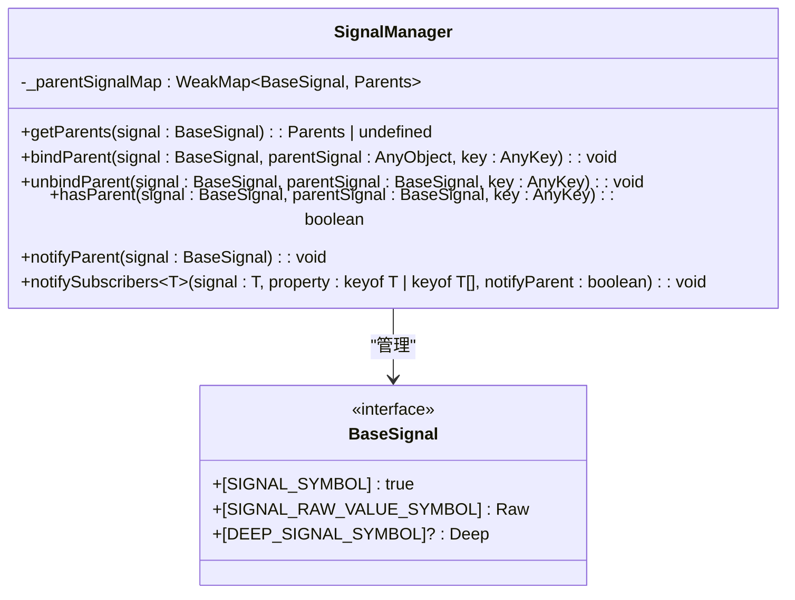
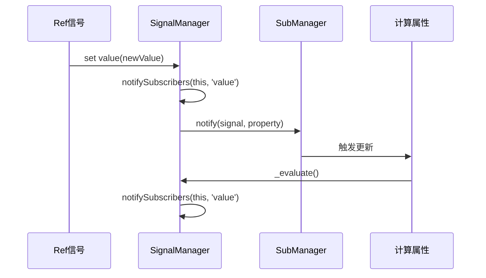
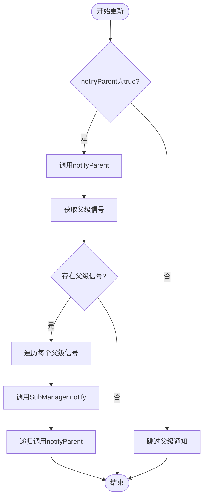

# Signal管理器

<cite>
**本文档中引用的文件**   
- [manager.ts](file://packages/responsive/src/signal/manager.ts)
- [subManager.ts](file://packages/responsive/src/observer/subManager.ts)
- [ref.ts](file://packages/responsive/src/signal/ref/ref.ts)
- [computed.ts](file://packages/responsive/src/signal/computed/computed.ts)
- [depend.ts](file://packages/responsive/src/depend/depend.ts)
- [scheduler.ts](file://packages/responsive/src/observer/scheduler.ts)
</cite>

## 目录
1. [引言](#引言)
2. [核心职责](#核心职责)
3. [与Effect系统的协同工作](#与effect系统的协同工作)
4. [关键流程分析](#关键流程分析)
5. [单例模式的必要性](#单例模式的必要性)
6. [初始化过程解析](#初始化过程解析)
7. [性能影响分析](#性能影响分析)
8. [总结](#总结)

## 引言

SignalManager作为响应式系统的核心协调者，负责统一管理所有Signal实例的创建、依赖追踪和更新调度。它通过维护信号间的父子关系，确保依赖关系的准确建立与清理，是整个响应式框架稳定运行的基础。本文将深入解析SignalManager的内部机制，探讨其在框架中的关键作用。

**Section sources**
- [manager.ts](file://packages/responsive/src/signal/manager.ts)

## 核心职责

SignalManager的核心职责是作为全局响应式信号的协调中心，统一管理所有Signal实例的生命周期和依赖关系。它通过`_parentSignalMap`这个WeakMap来存储信号间的父子关系，其中键为子信号，值为包含父信号及其关联键的映射。

其主要功能包括：
1. **父子关系管理**：通过`bindParent`和`unbindParent`方法建立和解除信号间的父子关系
2. **依赖追踪**：利用`getParents`和`hasParent`方法查询信号的依赖关系
3. **更新调度**：通过`notifySubscribers`和`notifyParent`方法触发订阅者的更新

这种设计使得SignalManager能够精确地追踪每个信号的依赖链，确保在信号值变化时能够正确地通知所有相关的订阅者。



**Diagram sources**
- [manager.ts](file://packages/responsive/src/signal/manager.ts#L17-L123)

**Section sources**
- [manager.ts](file://packages/responsive/src/signal/manager.ts#L17-L123)

## 与Effect系统的协同工作

SignalManager与Effect系统紧密协作，共同构建了完整的响应式体系。当信号值发生变化时，SignalManager会通过`notifySubscribers`方法通知所有订阅者，并递归通知父级信号，形成一个完整的更新链。

在`ref.ts`文件中，我们可以看到SignalManager如何与响应式系统集成。当`ref`的`value`属性被设置时，会调用`SignalManager.notifySubscribers(this, 'value')`来触发更新。同时，在`computed.ts`文件中，计算属性通过`Depend.collect`方法收集依赖，并在依赖变化时通过`SignalManager.notifySubscribers`通知订阅者。

这种协同工作机制确保了依赖关系的准确建立与清理。当一个信号不再被任何订阅者引用时，相关的依赖关系会被自动清理，避免了内存泄漏。



**Diagram sources**
- [manager.ts](file://packages/responsive/src/signal/manager.ts#L115-L122)
- [ref.ts](file://packages/responsive/src/signal/ref/ref.ts#L181)
- [computed.ts](file://packages/responsive/src/signal/computed/computed.ts#L329)

**Section sources**
- [manager.ts](file://packages/responsive/src/signal/manager.ts#L115-L122)
- [ref.ts](file://packages/responsive/src/signal/ref/ref.ts#L181)
- [computed.ts](file://packages/responsive/src/signal/computed/computed.ts#L329)

## 关键流程分析

### 初始化流程

SignalManager的初始化是一个隐式过程，它作为静态类在首次使用时自动初始化。其核心数据结构`_parentSignalMap`在类定义时就被创建，无需显式的初始化方法。

### 信号注册流程

信号注册主要通过`bindParent`方法实现。当一个信号需要依赖另一个信号时，会调用此方法建立父子关系。例如，在`ref.ts`中，当`ref`的`value`属性需要代理为响应式对象时，会调用`SignalManager.bindParent(this._reactiveValue as BaseSignal, this, 'value')`来建立关系。

### 批量更新流程

批量更新是SignalManager的重要特性。通过`notifySubscribers`方法，SignalManager能够协调多个订阅者的更新。当`notifyParent`参数为true时，会递归通知所有父级信号，确保整个依赖链的完整性。



**Diagram sources**
- [manager.ts](file://packages/responsive/src/signal/manager.ts#L95-L103)
- [manager.ts](file://packages/responsive/src/signal/manager.ts#L115-L122)

**Section sources**
- [manager.ts](file://packages/responsive/src/signal/manager.ts#L95-L122)

## 单例模式的必要性

SignalManager采用静态类的形式实现单例模式，这是其作为全局协调者的必要设计。单例模式确保了：

1. **全局状态一致性**：所有模块访问的是同一个SignalManager实例，保证了信号关系的一致性
2. **内存效率**：避免了多个实例造成的内存浪费
3. **依赖追踪准确性**：确保依赖关系的建立和清理都在同一个上下文中进行

在大型应用中，跨模块访问SignalManager时，单例模式保证了所有模块都能访问到相同的信号关系映射，这对于维护复杂的依赖网络至关重要。

**Section sources**
- [manager.ts](file://packages/responsive/src/signal/manager.ts#L17-L123)

## 初始化过程解析

SignalManager的初始化过程是隐式的，其核心在于静态属性的初始化。在`manager.ts`文件中，`_parentSignalMap`在类定义时就被初始化为一个新的WeakMap：

```typescript
private static _parentSignalMap = new WeakMap<BaseSignal, Parents>()
```

这种设计利用了JavaScript的类加载机制，确保在模块首次被导入时就完成初始化。WeakMap的选择也体现了设计的精巧性，它允许垃圾回收机制自动清理不再被引用的信号，避免了内存泄漏。

初始化过程不需要显式的调用，当任何代码首次访问SignalManager的静态方法时，类就会被加载和初始化。这种惰性初始化的方式既保证了及时性，又避免了不必要的资源消耗。

**Section sources**
- [manager.ts](file://packages/responsive/src/signal/manager.ts#L19)

## 性能影响分析

SignalManager的设计对整体响应式性能有着重要影响。其性能特征主要体现在以下几个方面：

1. **时间复杂度**：`bindParent`、`unbindParent`和`hasParent`方法的时间复杂度均为O(1)，得益于WeakMap和Map的高效查找性能
2. **空间复杂度**：使用WeakMap存储信号关系，允许垃圾回收机制自动清理不再使用的信号，降低了内存占用
3. **更新传播效率**：通过递归通知机制，确保依赖链的完整更新，但需要注意深度嵌套可能带来的性能开销

在`scheduler.ts`中，我们可以看到更新调度的优化策略。SignalManager与Scheduler协同工作，将更新操作安排在微任务队列中执行，避免了重复触发和性能瓶颈。

**Section sources**
- [manager.ts](file://packages/responsive/src/signal/manager.ts)
- [scheduler.ts](file://packages/responsive/src/observer/scheduler.ts)

## 总结

SignalManager作为响应式系统的核心协调者，通过精心设计的API和数据结构，实现了信号间依赖关系的高效管理。其单例模式确保了全局状态的一致性，而与Effect系统的紧密协作则构建了完整的响应式体系。通过对初始化、信号注册和批量更新等关键流程的优化，SignalManager在保证功能完整性的同时，也兼顾了性能效率，是整个框架稳定运行的基石。