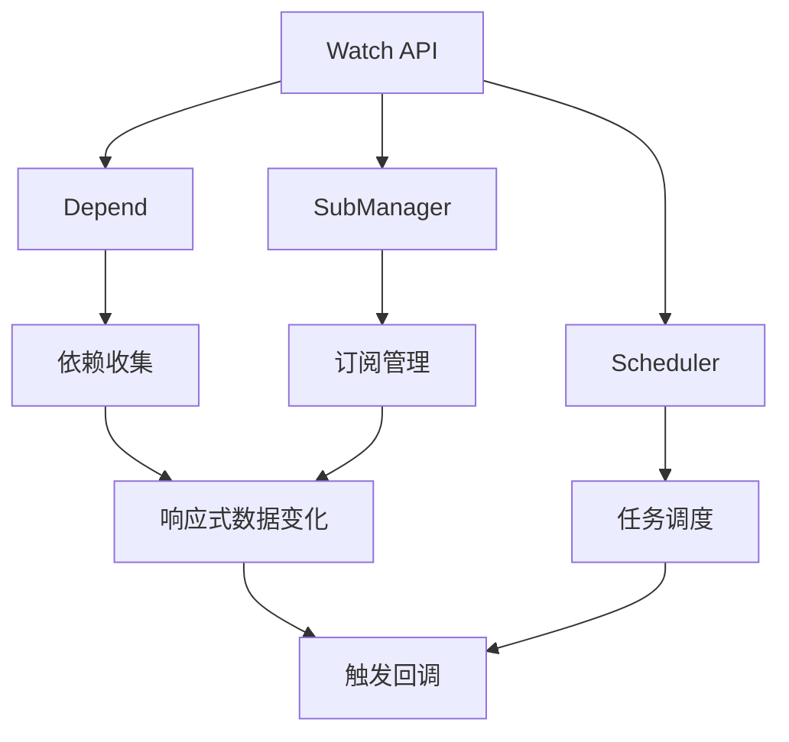
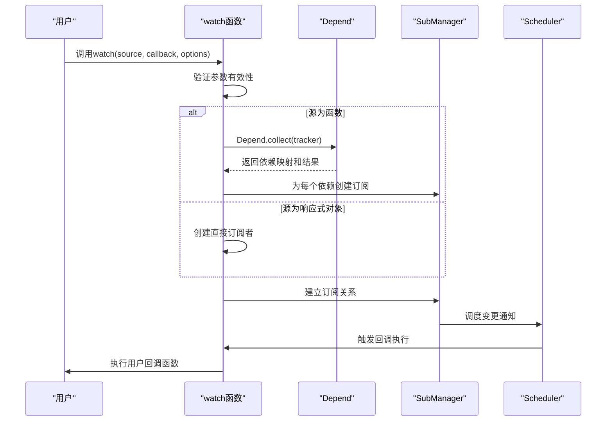

# Watch API

<cite>
**本文档引用文件**  
- [watch.ts](file://packages/responsive/src/signal/watch/watch.ts)
- [depend.ts](file://packages/responsive/src/depend/depend.ts)
- [subscriber.ts](file://packages/responsive/src/observer/subscriber.ts)
- [subManager.ts](file://packages/responsive/src/observer/subManager.ts)
- [scheduler.ts](file://packages/responsive/src/observer/scheduler.ts)
- [ref.ts](file://packages/responsive/src/signal/ref/ref.ts)
- [computed.ts](file://packages/responsive/src/signal/computed/computed.ts)
- [effect.ts](file://packages/responsive/src/effect/effect.ts)
- [watch.test.ts](file://packages/responsive/__tests__/signal/watch.test.ts)
</cite>

## 目录
1. [引言](#引言)
2. [Watch API 核心机制](#watch-api-核心机制)
3. [watch 函数实现原理](#watch-函数实现原理)
4. [source、callback 与 options 的工作关系](#sourcecallback-与-options-的工作关系)
5. [lazy 与 immediate 配置项行为差异](#lazy-与-immediate-配置项行为差异)
6. [watchEffect 实现原理](#watcheffect-实现原理)
7. [监听不同类型数据的实践](#监听不同类型数据的实践)
8. [高级控制能力](#高级控制能力)
9. [与 computed 的异同及副作用管理定位](#与-computed-的异同及副作用管理定位)
10. [总结](#总结)

## 引言

Watch API 是 vitarx 响应式系统中的核心功能之一，用于监听响应式数据的变化并执行相应的副作用操作。该机制基于底层的 effect 系统构建，通过依赖追踪和订阅-发布模式实现高效的响应式更新。Watch API 提供了灵活的配置选项，支持监听 ref、reactive 对象、computed 值以及复杂表达式，并具备清理资源、控制执行时机等高级功能。

**Section sources**
- [watch.ts](file://packages/responsive/src/signal/watch/watch.ts)
- [watch.test.ts](file://packages/responsive/__tests__/signal/watch.test.ts)

## Watch API 核心机制

vitarx 的 Watch API 建立在 effect 系统之上，其核心机制依赖于依赖收集（Depend）、订阅管理（SubManager）和任务调度（Scheduler）三个关键组件。当监听器被创建时，系统会自动追踪其依赖的响应式数据，建立依赖关系图。当数据发生变化时，通过观察者模式通知所有订阅者，并由调度器统一管理副作用的执行时机。

**Diagram sources**
- [watch.ts](file://packages/responsive/src/signal/watch/watch.ts)
- [depend.ts](file://packages/responsive/src/depend/depend.ts)
- [subManager.ts](file://packages/responsive/src/observer/subManager.ts)
- [scheduler.ts](file://packages/responsive/src/observer/scheduler.ts)

## watch 函数实现原理

`watch` 函数是 Watch API 的主要入口，其核心逻辑位于 `watch.ts` 文件中。函数通过泛型参数 `T` 和 `C` 分别定义监听源类型和回调函数类型，支持监听对象、函数或数组类型的源。

当调用 `watch` 时，系统首先检查回调函数的有效性，然后根据源类型的不同进行差异化处理：
- 若源为函数，则通过 `Depend.collect` 收集其依赖的响应式数据，并创建订阅者监听这些依赖的变化
- 若源为响应式信号（如 ref 或 reactive 对象），则直接创建订阅者监听该信号
- 若源为数组，则遍历数组中的每个响应式对象并建立监听关系

订阅者（Subscriber）继承自 Effect 类，具备完整的生命周期管理能力，包括暂停、恢复和销毁。通过 `SubManager` 将订阅者与具体的响应式对象和属性关联起来，形成订阅关系。

**Diagram sources**
- [watch.ts](file://packages/responsive/src/signal/watch/watch.ts)
- [depend.ts](file://packages/responsive/src/depend/depend.ts)
- [subManager.ts](file://packages/responsive/src/observer/subManager.ts)
- [scheduler.ts](file://packages/responsive/src/observer/scheduler.ts)

**Section sources**
- [watch.ts](file://packages/responsive/src/signal/watch/watch.ts)

## source、callback 与 options 的工作关系

Watch API 的三个核心参数 `source`、`callback` 和 `options` 共同构成了监听器的完整配置。

`source` 参数定义了监听的目标，可以是：
- 响应式对象（ref、reactive）
- 计算函数（返回响应式值的函数）
- 响应式对象数组

`callback` 参数是变化时执行的回调函数，接收新值、旧值和清理函数注册器三个参数。通过 `onCleanup` 方法可以注册清理函数，用于释放定时器、事件监听器等资源。

`options` 参数提供了丰富的配置选项：
- `flush`：指定执行模式（'default' | 'pre' | 'post' | 'sync'）
- `limit`：限制触发次数
- `scope`：是否自动添加到当前作用域
- `clone`：是否深度克隆新旧值
- `immediate`：是否立即执行一次回调

三者通过 `watch` 函数的类型系统紧密关联，确保类型安全和功能完整性。

**Section sources**
- [watch.ts](file://packages/responsive/src/signal/watch/watch.ts)

## lazy 与 immediate 配置项行为差异

`immediate` 配置项控制监听器的初始执行行为。当设置为 `true` 时，监听器会在创建后立即执行一次回调函数，此时新值为当前值，旧值为 `undefined`。这在需要初始化操作的场景中非常有用。

`lazy` 并非直接的配置项，而是 Watch API 的默认行为特征。与 `computed` 不同，`watch` 的回调函数不会在创建时立即执行（除非设置 `immediate: true`），而是等待依赖的数据发生变化时才触发。这种懒执行策略避免了不必要的计算开销。

测试用例验证了 `immediate` 选项的行为：当设置 `immediate: true` 时，回调函数会在监听器创建后立即执行一次，而默认情况下则不会立即执行。

**Section sources**
- [watch.ts](file://packages/responsive/src/signal/watch/watch.ts)
- [watch.test.ts](file://packages/responsive/__tests__/signal/watch.test.ts)

## watchEffect 实现原理

`watchEffect` 是 `watch` 的简化版本，其实现基于相同的底层机制。它不需要显式指定监听源，而是自动追踪回调函数内部访问的所有响应式数据。

`watchEffect` 的核心优势在于其自动依赖追踪能力。当传入一个副作用函数时，系统会执行该函数并收集其中访问的所有响应式属性，然后为这些属性建立监听关系。这种方式简化了使用，但代价是粒度较粗，任何依赖的变化都会触发回调。

在实现上，`watchEffect` 可以看作是 `watch(() => effectFn(), callback)` 的语法糖，但进行了优化处理，直接将副作用函数作为依赖追踪的目标。

**Section sources**
- [watch.ts](file://packages/responsive/src/signal/watch/watch.ts)
- [watch.test.ts](file://packages/responsive/__tests__/signal/watch.test.ts)

## 监听不同类型数据的实践

Watch API 支持监听多种类型的数据源，每种类型都有其特定的处理方式。

### 监听 ref
监听 ref 对象时，系统会自动追踪其 `value` 属性的变化。当 `ref.value` 被修改时，会触发相应的回调函数。

### 监听 reactive 对象
对于 reactive 对象，系统会监听对象所有属性的变化。当对象的任何属性被修改时，都会触发监听器。对于嵌套对象，由于深度代理的存在，深层属性的变化也会被追踪。

### 监听复杂表达式
通过传入一个返回复杂表达式的函数作为源，可以监听计算结果的变化。系统会自动分析函数内部的依赖关系，并建立相应的监听。

### 监听多个数据源
可以通过传递数组的方式同时监听多个响应式对象。当数组中任何一个对象发生变化时，都会触发回调函数。

**Section sources**
- [watch.ts](file://packages/responsive/src/signal/watch/watch.ts)
- [ref.ts](file://packages/responsive/src/signal/ref/ref.ts)
- [watch.test.ts](file://packages/responsive/__tests__/signal/watch.test.ts)

## 高级控制能力

Watch API 提供了多种高级控制能力，增强了其灵活性和实用性。

### stop 停止监听
`watch` 函数返回一个 `Subscriber` 实例，调用其 `dispose()` 方法可以停止监听并清理相关资源。这是控制监听生命周期的主要方式。

### flush 调度时机
通过 `flush` 选项可以精确控制回调函数的执行时机：
- `'sync'`：同步执行，立即响应变化
- `'pre'`：在下一次更新周期开始时执行
- `'default'`：默认模式，合并多次触发
- `'post'`：在下一次更新周期结束时执行

### 清理函数
通过 `onCleanup` 注册的清理函数会在下次回调触发前或监听被销毁时执行，用于释放定时器、取消订阅等资源。

### 作用域管理
通过 `scope` 选项可以将监听器自动添加到当前作用域中，当作用域销毁时，所有相关的监听器会自动被清理。

**Section sources**
- [watch.ts](file://packages/responsive/src/signal/watch/watch.ts)
- [subscriber.ts](file://packages/responsive/src/observer/subscriber.ts)
- [effect.ts](file://packages/responsive/src/effect/effect.ts)

## 与 computed 的异同及副作用管理定位

`watch` 和 `computed` 都是基于 effect 系统构建的响应式工具，但它们在用途和行为上有显著差异。

### 相同点
- 都基于相同的依赖追踪机制
- 都使用 `Depend` 进行依赖收集
- 都通过 `SubManager` 管理订阅关系
- 都受 `Scheduler` 统一调度

### 不同点
| 特性 | watch | computed |
|------|-------|----------|
| 主要用途 | 执行副作用 | 计算派生值 |
| 执行时机 | 变化时触发 | 懒计算，访问时计算 |
| 返回值 | 订阅者实例 | 计算结果 |
| 资源清理 | 需手动管理 | 自动管理 |
| 依赖追踪 | 显式或隐式 | 隐式 |

在副作用管理中，`watch` 定位于执行具有外部影响的操作，如数据持久化、API 调用、DOM 更新等。而 `computed` 则专注于计算派生状态，保持数据的一致性和可预测性。两者协同工作，构成了完整的响应式编程模型。

**Section sources**
- [watch.ts](file://packages/responsive/src/signal/watch/watch.ts)
- [computed.ts](file://packages/responsive/src/signal/computed/computed.ts)
- [depend.ts](file://packages/responsive/src/depend/depend.ts)

## 总结

vitarx 的 Watch API 通过精巧的设计和强大的底层机制，提供了一套完整且灵活的响应式监听解决方案。它基于 effect 系统构建，利用依赖收集、订阅管理和任务调度等组件，实现了高效的数据变化响应。通过 `source`、`callback` 和 `options` 的合理配合，开发者可以精确控制监听行为。`watchEffect` 作为简化版本，提供了更便捷的自动依赖追踪能力。与 `computed` 相比，`watch` 更侧重于副作用执行，两者共同构成了响应式系统的核心支柱。