# 响应式系统

<cite>
**本文档引用文件**  
- [manager.ts](file://packages/responsive/src/signal/manager.ts)
- [depend.ts](file://packages/responsive/src/depend/depend.ts)
- [scheduler.ts](file://packages/responsive/src/observer/scheduler.ts)
- [ref.ts](file://packages/responsive/src/signal/ref/ref.ts)
- [computed.ts](file://packages/responsive/src/signal/computed/computed.ts)
- [effect.ts](file://packages/responsive/src/effect/effect.ts)
- [proxy-handler.ts](file://packages/responsive/src/signal/reactive/proxy-handler.ts)
</cite>

## 目录
1. [引言](#引言)
2. [核心API设计与实现](#核心api设计与实现)
3. [响应式对象创建机制](#响应式对象创建机制)
4. [RefSignal值包装机制](#refsignal值包装机制)
5. [计算属性实现原理](#计算属性实现原理)
6. [依赖收集与副作用触发](#依赖收集与副作用触发)
7. [更新调度策略](#更新调度策略)
8. [高级使用模式](#高级使用模式)
9. [信号管理器角色分析](#信号管理器角色分析)
10. [结论](#结论)

## 引言
vitarx响应式系统提供了一套完整的响应式编程解决方案，通过ref、reactive、computed和watch等核心API实现了数据驱动的编程范式。该系统基于Proxy实现深层/浅层响应式对象，采用依赖收集和副作用触发机制来实现自动更新。本文将深入解析该系统的设计与实现原理。

## 核心API设计与实现

### ref API
`ref` API用于创建响应式引用对象，将普通值包装为响应式信号。当引用的值发生变化时，所有依赖于该引用的计算和副作用将自动更新。

**中文(中文)**
- [ref.ts](file://packages/responsive/src/signal/ref/ref.ts#L355-L406)

### reactive API
`reactive` API用于创建深层响应式对象，通过Proxy代理对象的所有属性访问和修改操作，实现嵌套对象的完全响应式。

**中文(中文)**
- [proxy-handler.ts](file://packages/responsive/src/signal/reactive/proxy-handler.ts)

### computed API
`computed` API用于创建计算属性，实现懒求值和缓存机制。只有当依赖的响应式数据发生变化时，才会重新计算值。

**中文(中文)**
- [computed.ts](file://packages/responsive/src/signal/computed/computed.ts)

### watch API
`watch` API用于监听响应式数据的变化，当数据发生变化时执行指定的回调函数，支持同步、预和后置等调度策略。

**中文(中文)**
- [effect.ts](file://packages/responsive/src/effect/effect.ts)

## 响应式对象创建机制

### 深层响应式对象
深层响应式对象通过Proxy递归代理所有嵌套属性，确保任何层级的数据变化都能被正确追踪。系统使用`DEEP_SIGNAL_SYMBOL`标识深度代理配置。

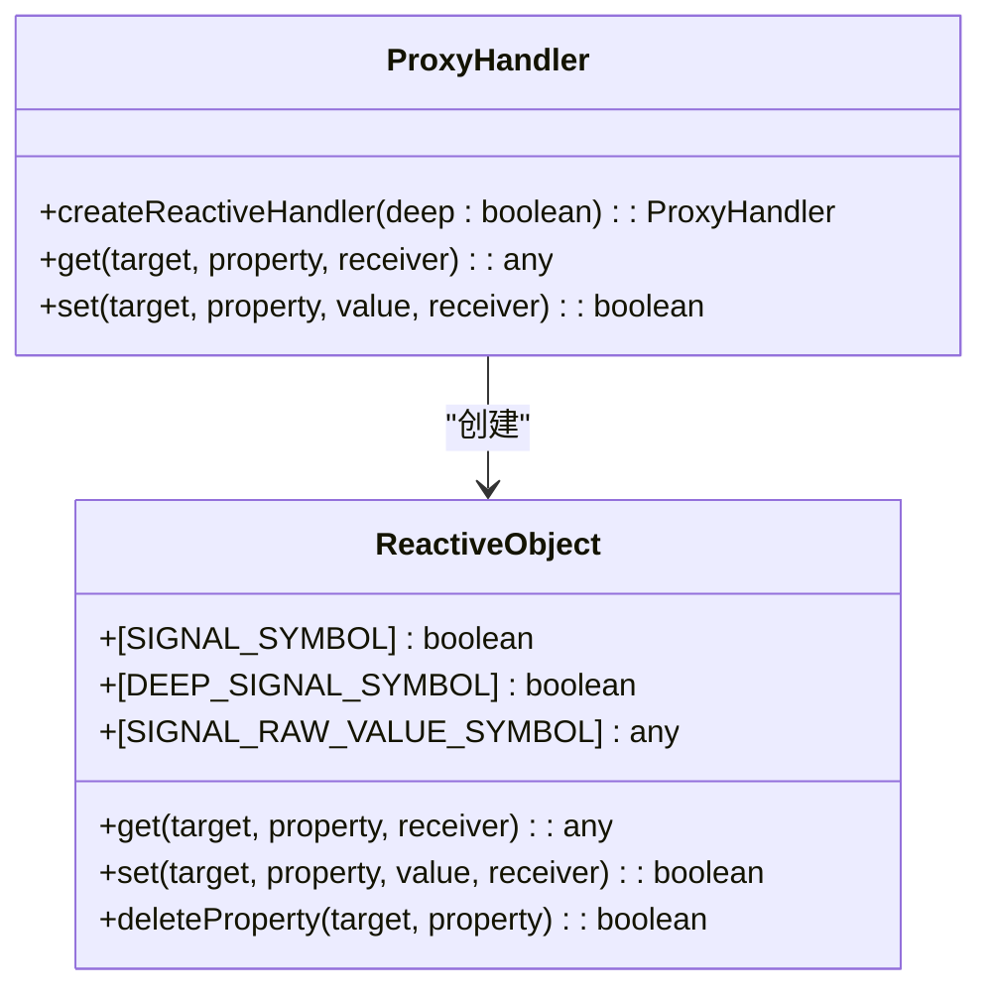

**中文(中文)**
- [proxy-handler.ts](file://packages/responsive/src/signal/reactive/proxy-handler.ts)
- [ref.ts](file://packages/responsive/src/signal/ref/ref.ts#L241-L247)

### 浅层响应式对象
浅层响应式对象仅代理对象本身，不递归代理嵌套属性。这种模式适用于性能敏感的场景，避免不必要的代理开销。

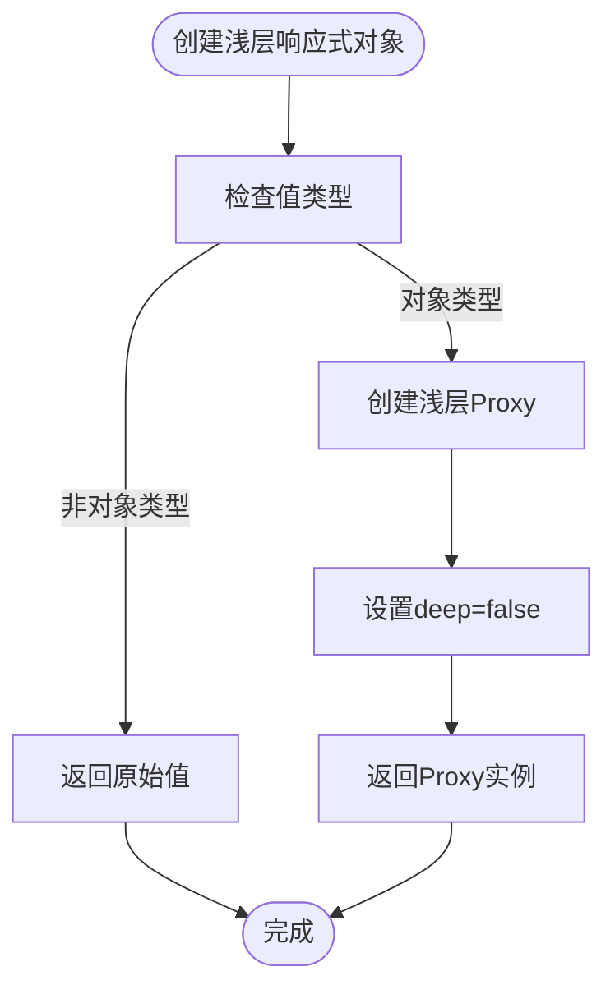

**中文(中文)**
- [ref.ts](file://packages/responsive/src/signal/ref/ref.ts#L466-L472)

## RefSignal值包装机制

### Ref类结构
`Ref`类实现了`RefSignal`接口，通过`value`属性提供响应式访问。内部使用`_value`存储原始值，并根据配置决定是否需要代理。

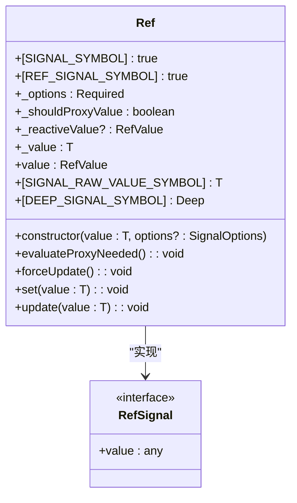

**中文(中文)**
- [ref.ts](file://packages/responsive/src/signal/ref/ref.ts#L70-L287)

### 值访问与更新流程
当访问`value`属性时，系统会根据当前状态决定返回原始值、已创建的响应式代理或创建新的响应式代理。更新值时会进行比较，只有当新旧值不同时才触发更新。

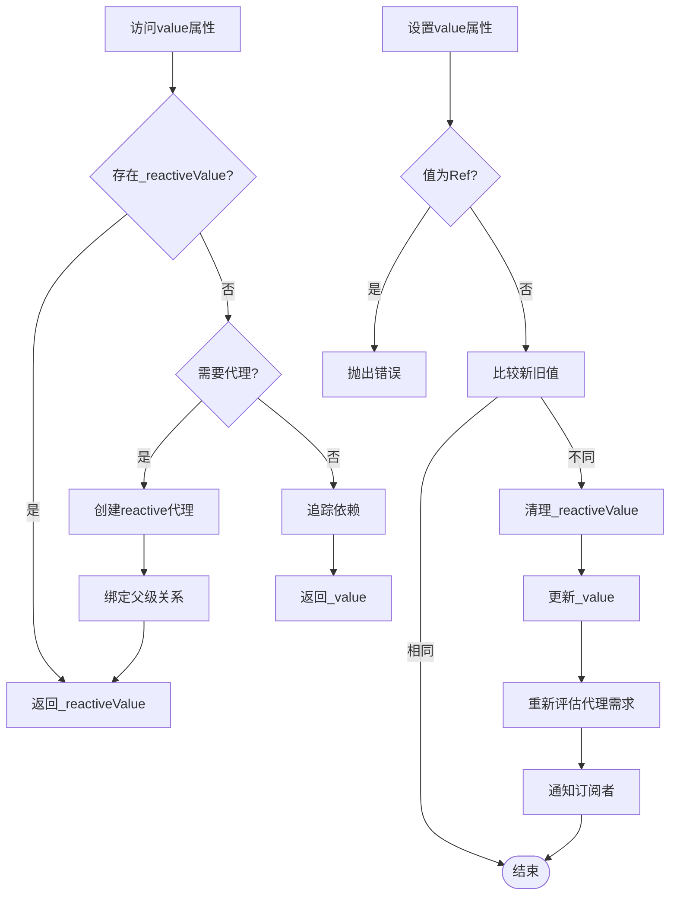

**中文(中文)**
- [ref.ts](file://packages/responsive/src/signal/ref/ref.ts#L136-L182)

## 计算属性实现原理

### 懒求值机制
计算属性采用懒求值策略，只有在被访问时才会执行计算函数。系统通过`Depend.collect`收集依赖，并在依赖变化时标记为脏状态。

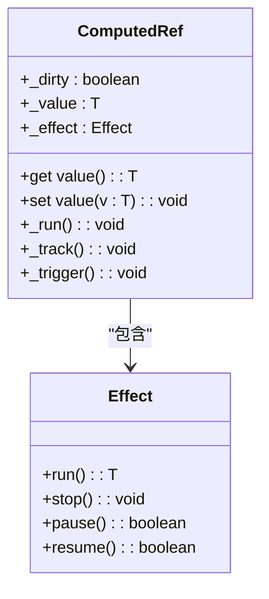

**中文(中文)**
- [computed.ts](file://packages/responsive/src/signal/computed/computed.ts)

### 缓存机制
计算属性通过`_dirty`标志位实现缓存，只有当依赖发生变化时才重新计算值，否则直接返回缓存的结果。

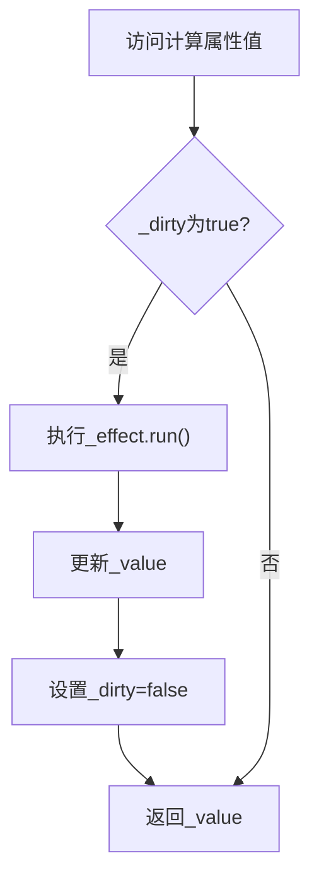

**中文(中文)**
- [computed.ts](file://packages/responsive/src/signal/computed/computed.ts)

## 依赖收集与副作用触发

### 依赖收集流程
依赖收集通过`Depend.track`和`Depend.collect`实现。当响应式数据被访问时，`track`方法记录依赖关系；当执行副作用函数时，`collect`方法收集所有依赖。

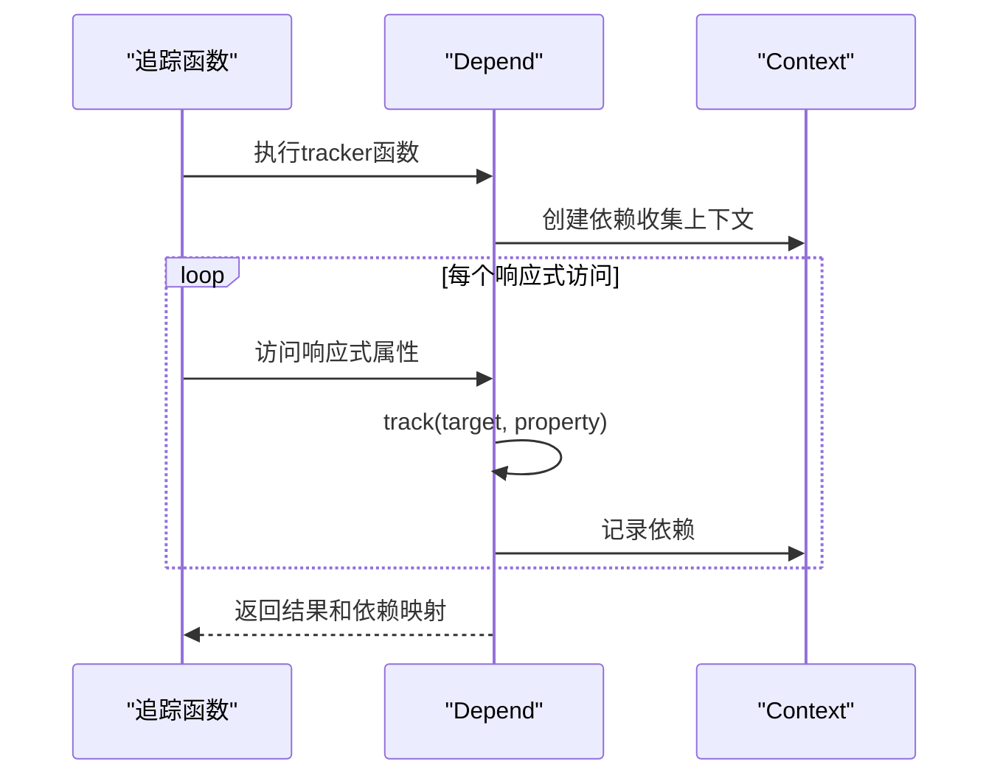

**中文(中文)**
- [depend.ts](file://packages/responsive/src/depend/depend.ts#L59-L78)

### 副作用触发机制
副作用通过`Depend.subscribe`创建订阅者，当依赖的数据发生变化时，通知订阅者执行回调函数。

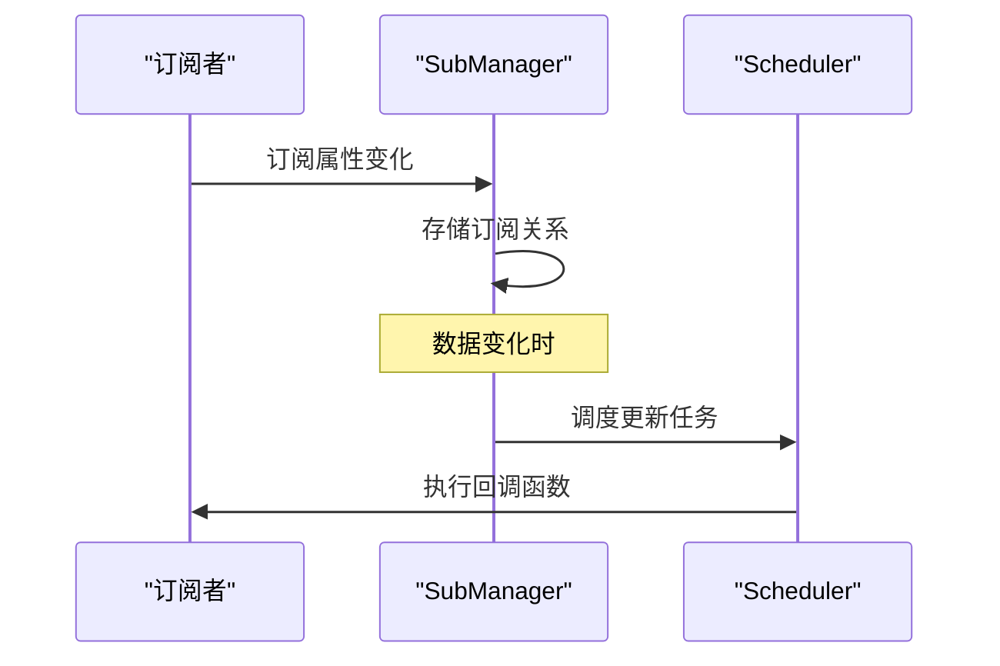

**中文(中文)**
- [depend.ts](file://packages/responsive/src/depend/depend.ts#L129-L149)

## 更新调度策略

### 三阶段调度队列
调度器采用三阶段队列：preFlush（准备阶段）、main（执行阶段）和postFlush（清理阶段），确保任务按正确顺序执行。

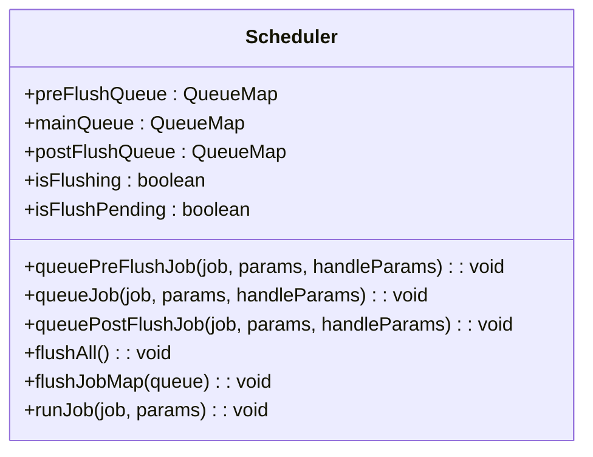

**中文(中文)**
- [scheduler.ts](file://packages/responsive/src/observer/scheduler.ts#L54-L61)

### 调度流程
调度器使用微任务机制，确保所有任务在下一个事件循环中执行，避免重复刷新。

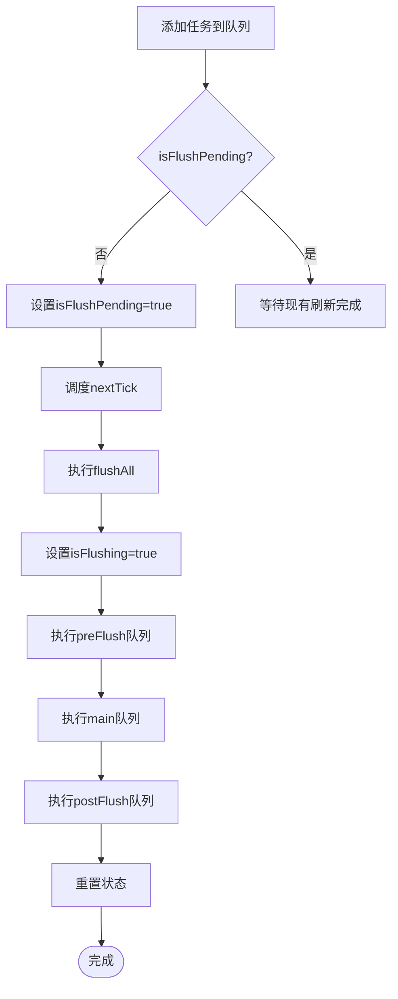

**中文(中文)**
- [scheduler.ts](file://packages/responsive/src/observer/scheduler.ts#L243-L247)

## 高级使用模式

### toRefs解构
`toRefs`模式允许将响应式对象的属性解构为独立的ref，保持响应式连接。

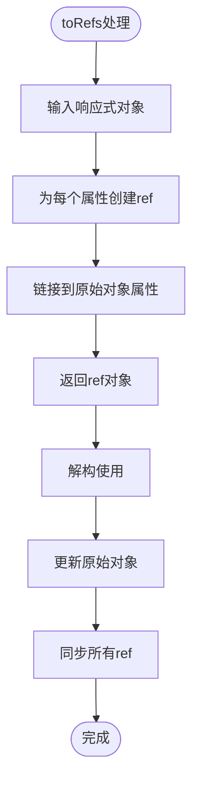

**中文(中文)**
- [ref.ts](file://packages/responsive/src/signal/ref/ref.ts)

### shallowRef性能优化
`shallowRef`用于创建浅层响应式引用，避免对大型对象或性能敏感数据进行深度代理，提高性能。

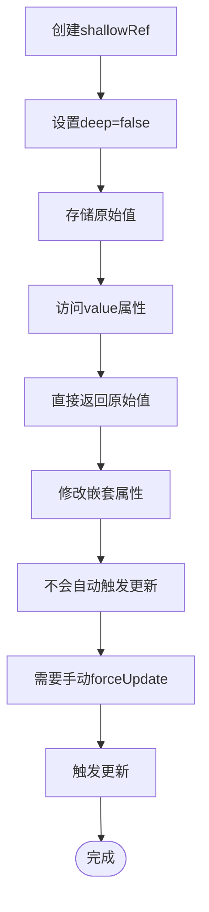

**中文(中文)**
- [ref.ts](file://packages/responsive/src/signal/ref/ref.ts#L466-L472)

## 信号管理器角色分析

### 父子关系管理
`SignalManager`负责管理信号之间的父子关系，通过`WeakMap`存储父子映射，支持递归通知。

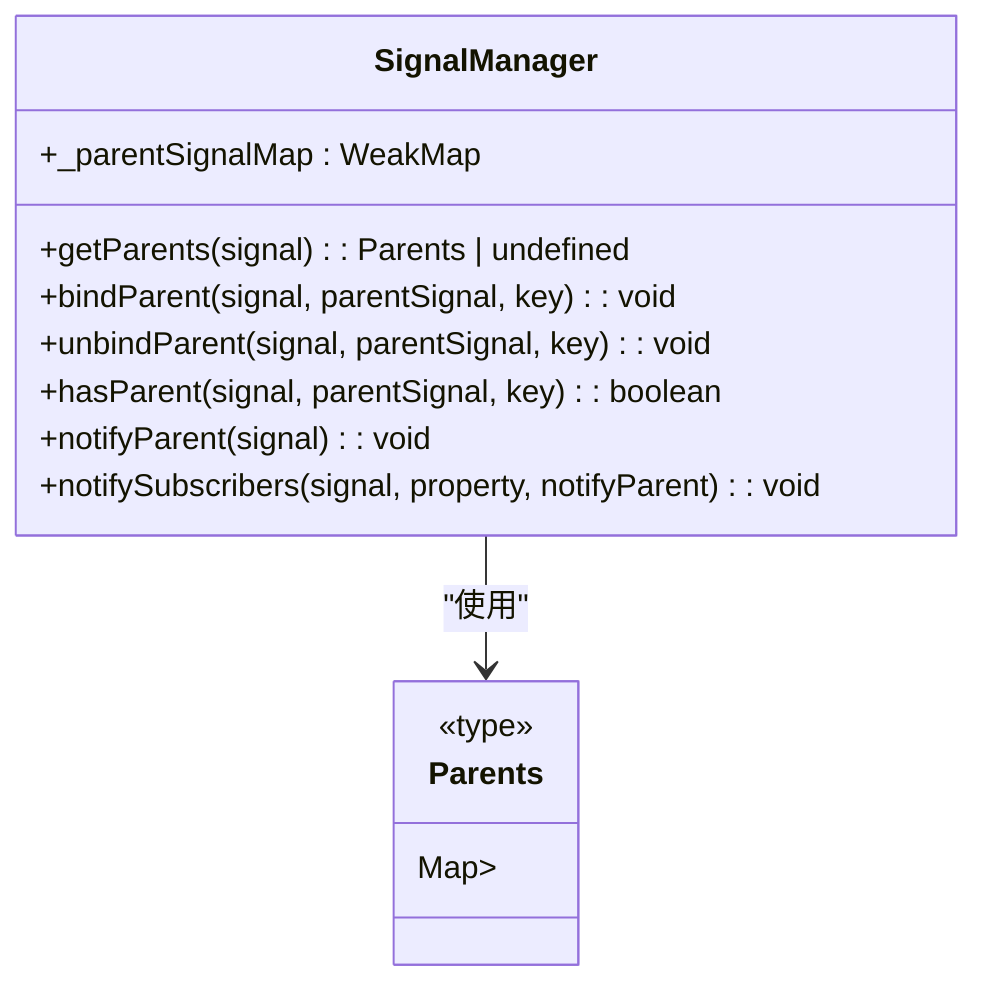

**中文(中文)**
- [manager.ts](file://packages/responsive/src/signal/manager.ts#L17-L123)

### 通知传播机制
信号管理器实现递归通知机制，当子信号更新时，不仅通知其订阅者，还递归通知所有父级信号。

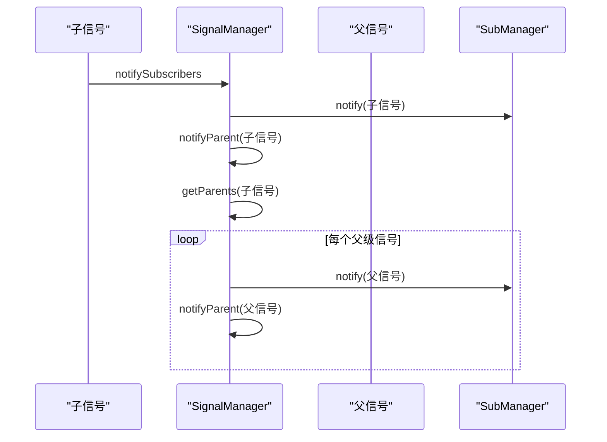

**中文(中文)**
- [manager.ts](file://packages/responsive/src/signal/manager.ts#L95-L103)

## 结论
vitarx响应式系统通过精心设计的API和底层机制，实现了高效、灵活的响应式编程模型。系统采用Proxy实现深层响应式，通过依赖收集和副作用触发机制实现自动更新，利用三阶段调度器优化更新性能。`SignalManager`作为全局协调者，有效管理信号间的父子关系和通知传播。该系统不仅提供了基本的响应式功能，还支持浅层响应式、自定义比较函数等高级特性，满足不同场景的需求。