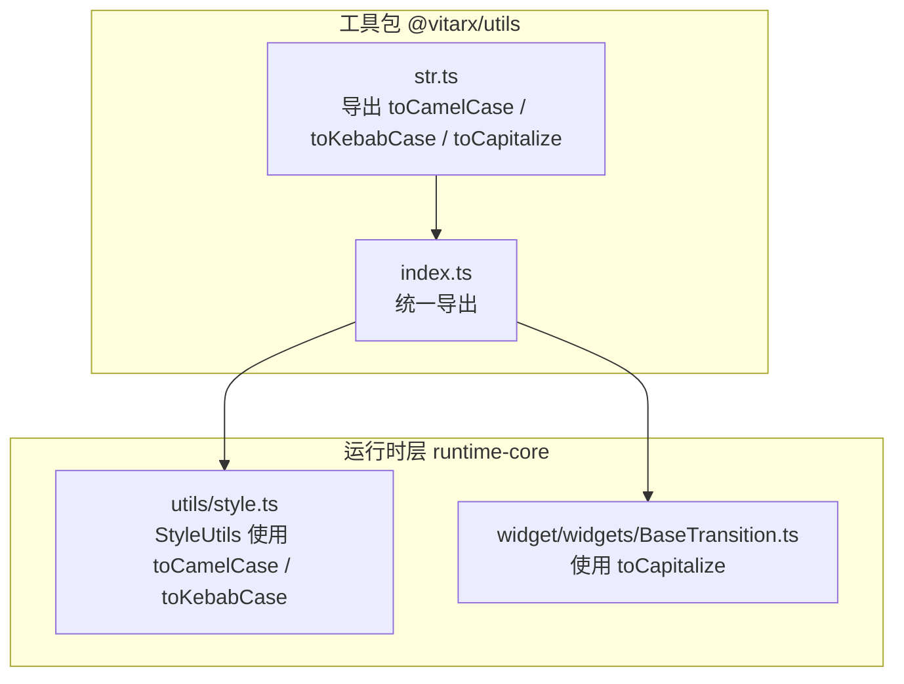
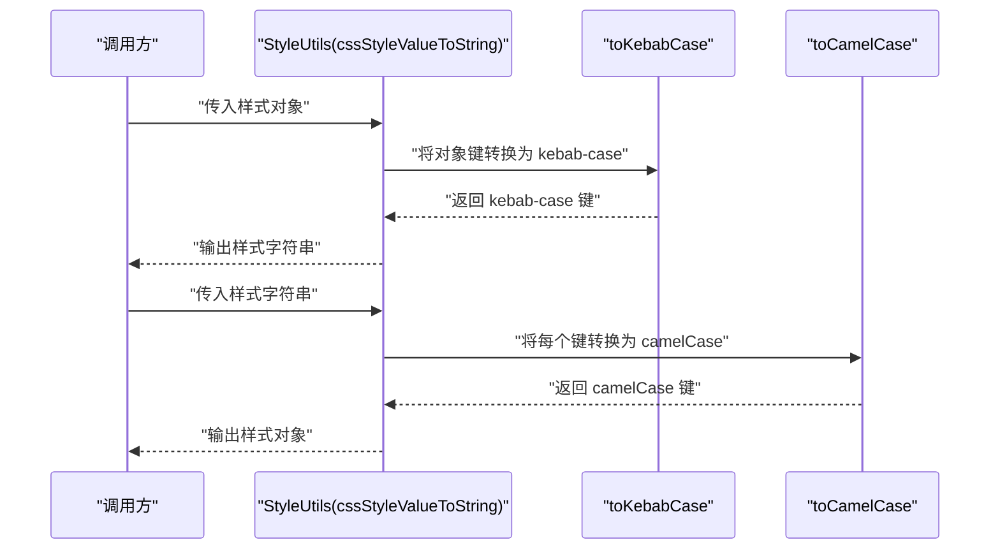
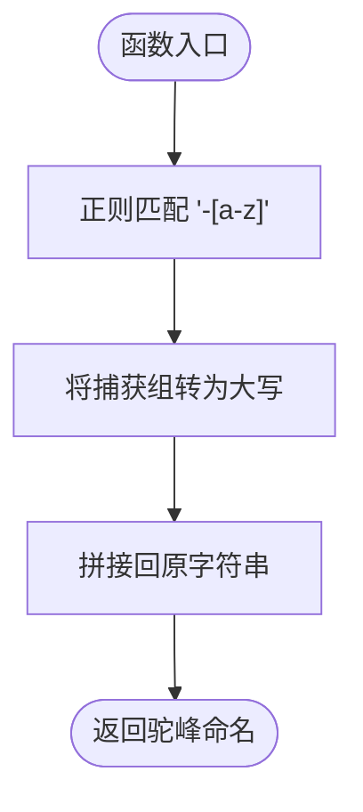
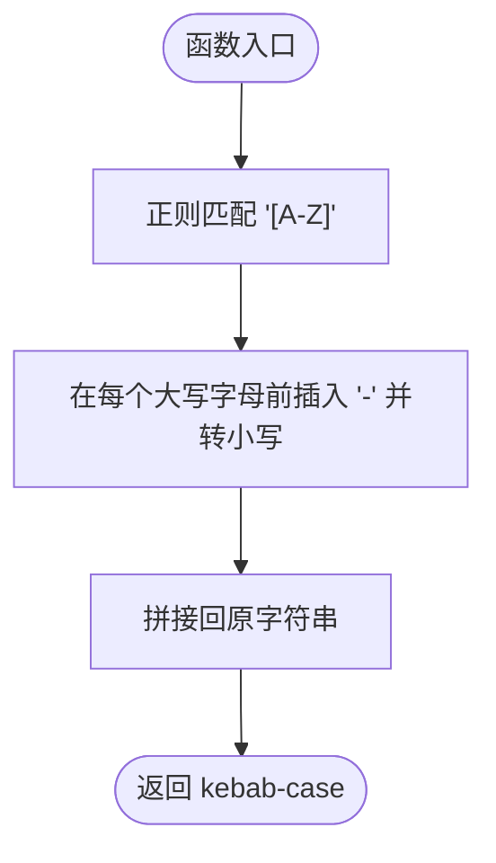
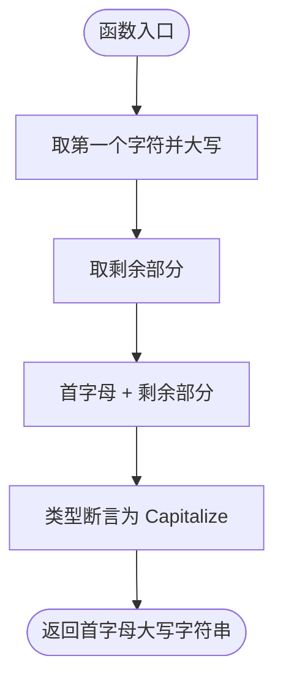
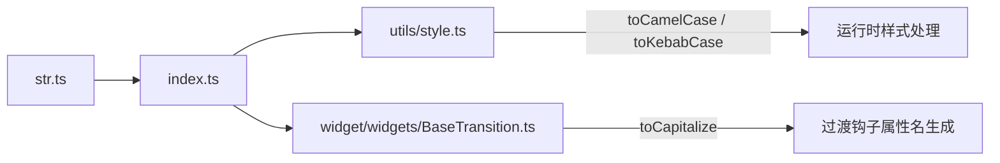

# 字符串处理

<cite>
**本文引用的文件**
- [packages/utils/src/str.ts](file://packages/utils/src/str.ts)
- [packages/utils/src/index.ts](file://packages/utils/src/index.ts)
- [packages/runtime-core/src/utils/style.ts](file://packages/runtime-core/src/utils/style.ts)
- [packages/runtime-core/src/widget/widgets/BaseTransition.ts](file://packages/runtime-core/src/widget/widgets/BaseTransition.ts)
- [packages/utils/README.md](file://packages/utils/README.md)
</cite>

## 目录
1. [简介](#简介)
2. [项目结构](#项目结构)
3. [核心组件](#核心组件)
4. [架构总览](#架构总览)
5. [详细组件分析](#详细组件分析)
6. [依赖关系分析](#依赖关系分析)
7. [性能考量](#性能考量)
8. [故障排查指南](#故障排查指南)
9. [结论](#结论)
10. [附录](#附录)

## 简介
本章节面向 Vitarx 生态中的字符串处理工具，系统性介绍三个关键函数：toCamelCase、toKebabCase、toCapitalize。它们分别负责：
- 将短横线命名（kebab-case）转换为驼峰命名（camelCase）
- 将驼峰命名转换为短横线命名
- 将字符串首字母大写，并结合 TypeScript 的 Capitalize 工具类型提供精确的类型推导

这些函数广泛应用于 CSS 类名处理、API 字段转换、JSX 属性命名以及动态类名生成等场景，尤其在运行时样式与过渡组件中承担桥梁作用，确保在不同命名风格之间安全、准确地转换。

## 项目结构
- 字符串工具函数位于 @vitarx/utils 包的 str.ts 中，并通过 index.ts 导出。
- 在运行时层（runtime-core）中，StyleUtils 类在样式对象与字符串互转时使用 toCamelCase 与 toKebabCase；BaseTransition 组件在构建事件钩子属性名时使用 toCapitalize。

图表来源
- [packages/utils/src/str.ts](file://packages/utils/src/str.ts#L1-L45)
- [packages/utils/src/index.ts](file://packages/utils/src/index.ts#L1-L8)
- [packages/runtime-core/src/utils/style.ts](file://packages/runtime-core/src/utils/style.ts#L1-L173)
- [packages/runtime-core/src/widget/widgets/BaseTransition.ts](file://packages/runtime-core/src/widget/widgets/BaseTransition.ts#L1-L200)

章节来源
- [packages/utils/src/str.ts](file://packages/utils/src/str.ts#L1-L45)
- [packages/utils/src/index.ts](file://packages/utils/src/index.ts#L1-L8)
- [packages/runtime-core/src/utils/style.ts](file://packages/runtime-core/src/utils/style.ts#L1-L173)
- [packages/runtime-core/src/widget/widgets/BaseTransition.ts](file://packages/runtime-core/src/widget/widgets/BaseTransition.ts#L1-L200)

## 核心组件
- toCamelCase：将短横线命名（如 hello-world）转换为驼峰命名（helloWorld）。内部使用正则替换，匹配“- + 小写字母”，并将捕获组转为大写。
- toKebabCase：将驼峰命名（如 helloWorld）转换为短横线命名（hello-world）。内部使用正则替换，匹配所有大写字母并在其前插入短横线，再统一转为小写。
- toCapitalize：将字符串首字母大写，其余保持不变。通过泛型与 TypeScript 的 Capitalize 工具类型，实现对输入字符串字面量类型的精确推导，保证返回值类型与输入一致但首字母大写。

章节来源
- [packages/utils/src/str.ts](file://packages/utils/src/str.ts#L1-L45)

## 架构总览
下面的序列图展示了运行时层如何在样式转换与过渡钩子中使用字符串工具函数。

图表来源
- [packages/runtime-core/src/utils/style.ts](file://packages/runtime-core/src/utils/style.ts#L72-L110)
- [packages/utils/src/str.ts](file://packages/utils/src/str.ts#L11-L29)

章节来源
- [packages/runtime-core/src/utils/style.ts](file://packages/runtime-core/src/utils/style.ts#L72-L110)
- [packages/utils/src/str.ts](file://packages/utils/src/str.ts#L11-L29)

## 详细组件分析

### toCamelCase：短横线命名转驼峰命名
- 功能概述
  - 接收一个采用短横线命名的字符串，返回驼峰命名形式。
  - 适用于 CSS 属性键名转换、API 字段名规范化等。
- 正则实现细节
  - 匹配模式：连字符后的小写字母。
  - 替换策略：将匹配到的字母转为大写，从而消除连字符并形成驼峰。
- 使用场景
  - 样式字符串解析：将 kebab-case 的 CSS 属性键转换为 camelCase，便于写入样式对象。
  - 动态类名生成：在运行时将 kebab-case 的类名转换为 camelCase，用于属性访问。
- 实际代码示例（路径）
  - 样式字符串转对象时的调用位置：[packages/runtime-core/src/utils/style.ts](file://packages/runtime-core/src/utils/style.ts#L96-L106)
- 复杂度与性能
  - 时间复杂度：O(n)，n 为字符串长度。
  - 空间复杂度：O(n)，由正则替换产生的新字符串决定。
- 边界与注意事项
  - 若输入包含多个连续连字符或末尾连字符，需注意结果是否符合预期。
  - 对纯数字或空字符串的处理取决于业务需求，当前实现按正则替换行为处理。

图表来源
- [packages/utils/src/str.ts](file://packages/utils/src/str.ts#L11-L14)
- [packages/runtime-core/src/utils/style.ts](file://packages/runtime-core/src/utils/style.ts#L96-L106)

章节来源
- [packages/utils/src/str.ts](file://packages/utils/src/str.ts#L11-L14)
- [packages/runtime-core/src/utils/style.ts](file://packages/runtime-core/src/utils/style.ts#L96-L106)

### toKebabCase：驼峰命名转短横线命名
- 功能概述
  - 接收一个驼峰命名的字符串，返回短横线命名形式。
  - 适用于将样式对象键写回 CSS 字符串、生成 CSS 类名等。
- 正则实现细节
  - 匹配模式：所有大写字母。
  - 替换策略：在每个大写字母前插入短横线，并统一转为小写。
- 使用场景
  - 样式对象转字符串：将 camelCase 的 CSS 属性键转换为 kebab-case，写入样式字符串。
  - 动态类名生成：在运行时将驼峰命名的类名转换为 kebab-case，用于 CSS 选择器或类名拼接。
- 实际代码示例（路径）
  - 样式对象转字符串时的调用位置：[packages/runtime-core/src/utils/style.ts](file://packages/runtime-core/src/utils/style.ts#L72-L86)
- 复杂度与性能
  - 时间复杂度：O(n)，n 为字符串长度。
  - 空间复杂度：O(n)，由正则替换产生的新字符串决定。
- 边界与注意事项
  - 首字母大写时会在前面插入连字符，需注意是否需要额外裁剪。
  - 对纯数字或空字符串的处理取决于业务需求，当前实现按正则替换行为处理。

图表来源
- [packages/utils/src/str.ts](file://packages/utils/src/str.ts#L26-L29)
- [packages/runtime-core/src/utils/style.ts](file://packages/runtime-core/src/utils/style.ts#L72-L86)

章节来源
- [packages/utils/src/str.ts](file://packages/utils/src/str.ts#L26-L29)
- [packages/runtime-core/src/utils/style.ts](file://packages/runtime-core/src/utils/style.ts#L72-L86)

### toCapitalize：首字母大写与精确类型推导
- 功能概述
  - 将字符串首字母大写，其余保持不变。
  - 通过泛型与 TypeScript 的 Capitalize 工具类型，实现对输入字符串字面量类型的精确推导，保证返回值类型与输入一致但首字母大写。
- 类型实现要点
  - 泛型约束：T extends string，确保输入为字符串字面量类型。
  - 类型断言：使用 as Capitalize<T> 将返回值类型固定为首字母大写的字面量类型。
- 使用场景
  - JSX 属性命名：在运行时根据枚举或字面量构造属性名（如 onBeforeEnter、onEnter、onAfterEnter 等）。
  - 动态类名生成：在 CSS 过渡组件中，根据类型字面量生成钩子属性名。
- 实际代码示例（路径）
  - 过渡组件中使用 toCapitalize 的位置：[packages/runtime-core/src/widget/widgets/BaseTransition.ts](file://packages/runtime-core/src/widget/widgets/BaseTransition.ts#L260-L280)
- 复杂度与性能
  - 时间复杂度：O(n)，n 为字符串长度（charAt + slice）。
  - 空间复杂度：O(n)，由拼接产生的新字符串决定。
- 边界与注意事项
  - 对空字符串的处理：当前实现会返回空字符串，符合预期。
  - 对非英文字符的处理：仅对首字母进行大写转换，其他字符保持不变。

图表来源
- [packages/utils/src/str.ts](file://packages/utils/src/str.ts#L40-L44)
- [packages/runtime-core/src/widget/widgets/BaseTransition.ts](file://packages/runtime-core/src/widget/widgets/BaseTransition.ts#L260-L280)

章节来源
- [packages/utils/src/str.ts](file://packages/utils/src/str.ts#L40-L44)
- [packages/runtime-core/src/widget/widgets/BaseTransition.ts](file://packages/runtime-core/src/widget/widgets/BaseTransition.ts#L260-L280)

## 依赖关系分析
- @vitarx/utils 的导出
  - index.ts 统一导出 str.ts 中的函数，便于外部按需引入。
- 运行时层的使用
  - runtime-core 的 StyleUtils 在样式对象与字符串互转时依赖 toCamelCase 与 toKebabCase。
  - BaseTransition 在构建事件钩子属性名时依赖 toCapitalize。

图表来源
- [packages/utils/src/str.ts](file://packages/utils/src/str.ts#L1-L45)
- [packages/utils/src/index.ts](file://packages/utils/src/index.ts#L1-L8)
- [packages/runtime-core/src/utils/style.ts](file://packages/runtime-core/src/utils/style.ts#L1-L173)
- [packages/runtime-core/src/widget/widgets/BaseTransition.ts](file://packages/runtime-core/src/widget/widgets/BaseTransition.ts#L1-L200)

章节来源
- [packages/utils/src/index.ts](file://packages/utils/src/index.ts#L1-L8)
- [packages/runtime-core/src/utils/style.ts](file://packages/runtime-core/src/utils/style.ts#L1-L173)
- [packages/runtime-core/src/widget/widgets/BaseTransition.ts](file://packages/runtime-core/src/widget/widgets/BaseTransition.ts#L1-L200)

## 性能考量
- 正则替换的性能
  - toCamelCase 与 toKebabCase 均为单次正则遍历，时间复杂度 O(n)，空间复杂度 O(n)。
  - 在高频调用场景（如大量样式键转换）中，建议缓存中间结果或批量处理以减少重复计算。
- 字符串拼接
  - toCapitalize 使用 charAt + slice + 拼接，属于轻量操作，适合在渲染路径中频繁调用。
- 类型推导成本
  - toCapitalize 的类型断言发生在编译期，运行时无额外开销，但能显著提升开发体验与类型安全性。

## 故障排查指南
- toCamelCase 未正确处理首字母大写
  - 现象：输入 helloWorld 期望得到 hello-world，但结果异常。
  - 排查：确认输入是否为驼峰命名；检查是否存在连续大写字母导致的意外连字符插入。
  - 参考位置：[packages/utils/src/str.ts](file://packages/utils/src/str.ts#L26-L29)
- toKebabCase 生成的键前多出连字符
  - 现象：输入 helloWorld 生成 -hello-world。
  - 排查：这是正则匹配首字母大写时的预期行为；若不希望出现前导连字符，可在调用前进行预处理或在消费端裁剪。
  - 参考位置：[packages/utils/src/str.ts](file://packages/utils/src/str.ts#L26-L29)
- toCapitalize 返回类型不符合预期
  - 现象：使用字面量字符串时，返回类型未被推断为首字母大写的字面量类型。
  - 排查：确保传入的是字面量字符串而非变量；确认使用了泛型约束与类型断言。
  - 参考位置：[packages/utils/src/str.ts](file://packages/utils/src/str.ts#L40-L44)
- 样式转换错误
  - 现象：样式字符串解析后属性名不正确。
  - 排查：核对 toCamelCase 的调用位置与输入格式；确认样式字符串的键值分割是否规范。
  - 参考位置：[packages/runtime-core/src/utils/style.ts](file://packages/runtime-core/src/utils/style.ts#L96-L106)

章节来源
- [packages/utils/src/str.ts](file://packages/utils/src/str.ts#L26-L29)
- [packages/utils/src/str.ts](file://packages/utils/src/str.ts#L40-L44)
- [packages/runtime-core/src/utils/style.ts](file://packages/runtime-core/src/utils/style.ts#L96-L106)

## 结论
Vitarx 的字符串工具函数以简洁高效的正则实现，为样式与过渡组件提供了可靠的命名转换能力。toCamelCase 与 toKebabCase 在样式对象与字符串互转中扮演关键角色，toCapitalize 则通过 TypeScript 的类型系统提升了开发时的类型安全与可维护性。在 JSX 属性命名与动态类名生成中，这些函数能够显著降低命名风格差异带来的风险，提升整体开发效率。

## 附录
- 安装与使用
  - 可通过 @vitarx/utils 包引入上述函数，并在运行时层按需使用。
  - 参考安装与使用示例：[packages/utils/README.md](file://packages/utils/README.md#L1-L50)
- 相关实现位置
  - 字符串工具函数定义：[packages/utils/src/str.ts](file://packages/utils/src/str.ts#L1-L45)
  - 运行时样式处理：[packages/runtime-core/src/utils/style.ts](file://packages/runtime-core/src/utils/style.ts#L72-L110)
  - 过渡组件钩子属性名生成：[packages/runtime-core/src/widget/widgets/BaseTransition.ts](file://packages/runtime-core/src/widget/widgets/BaseTransition.ts#L260-L280)