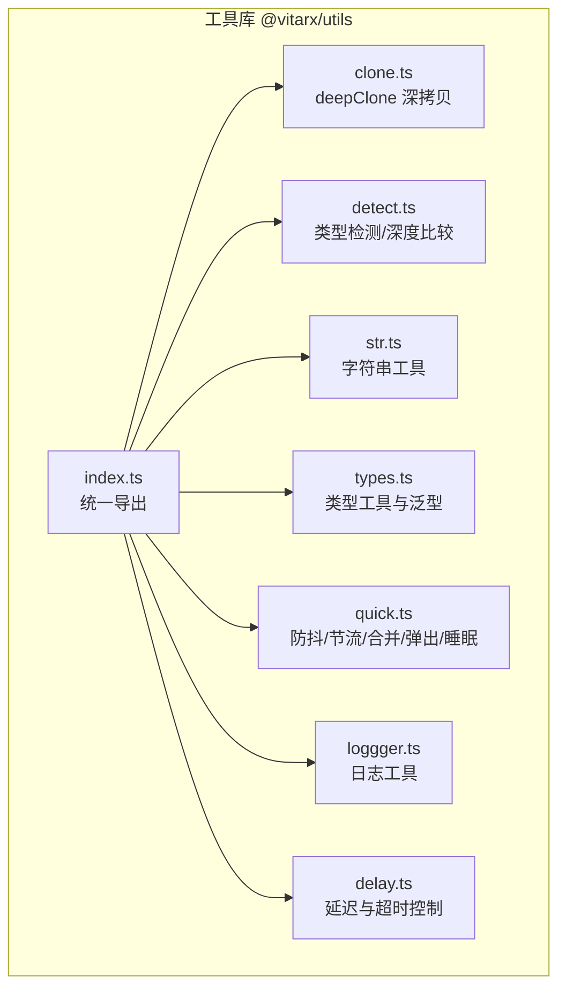
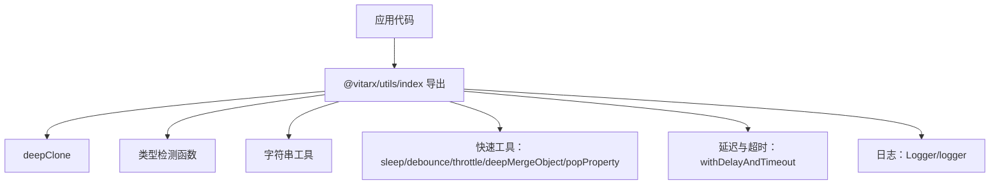
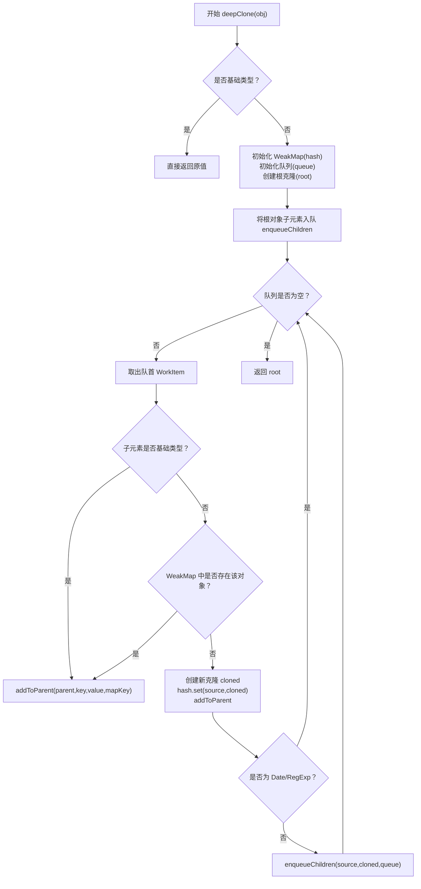
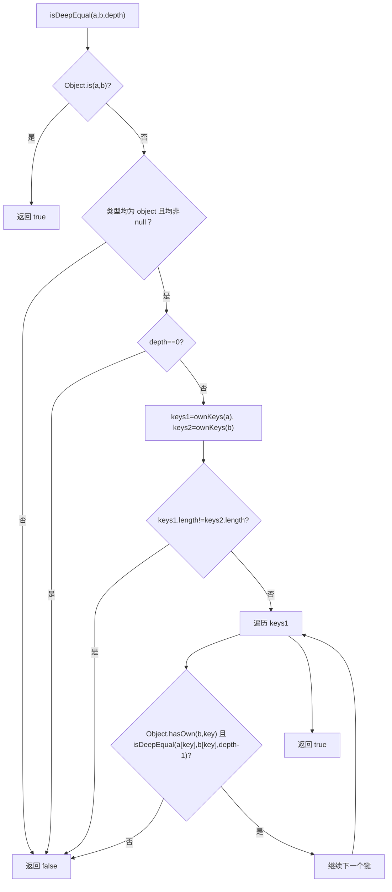
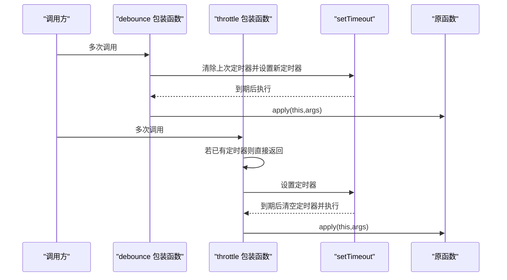
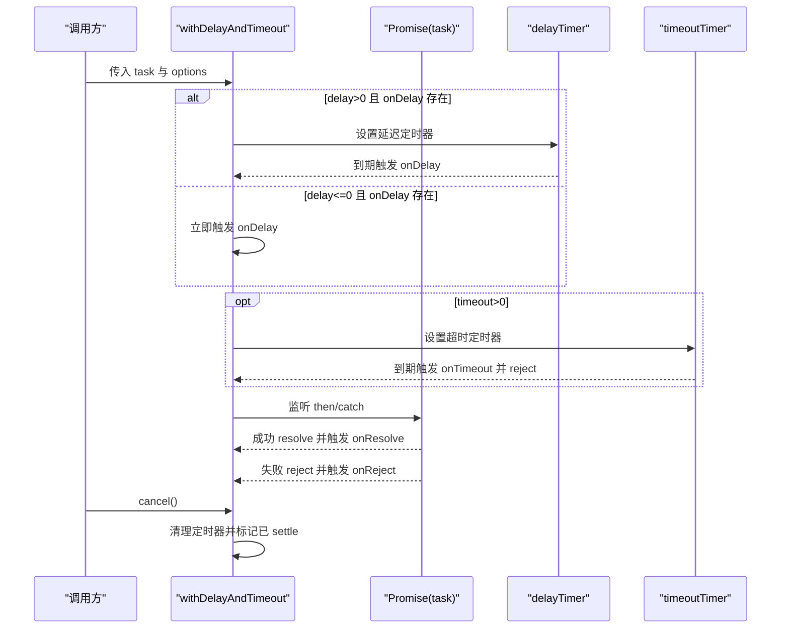
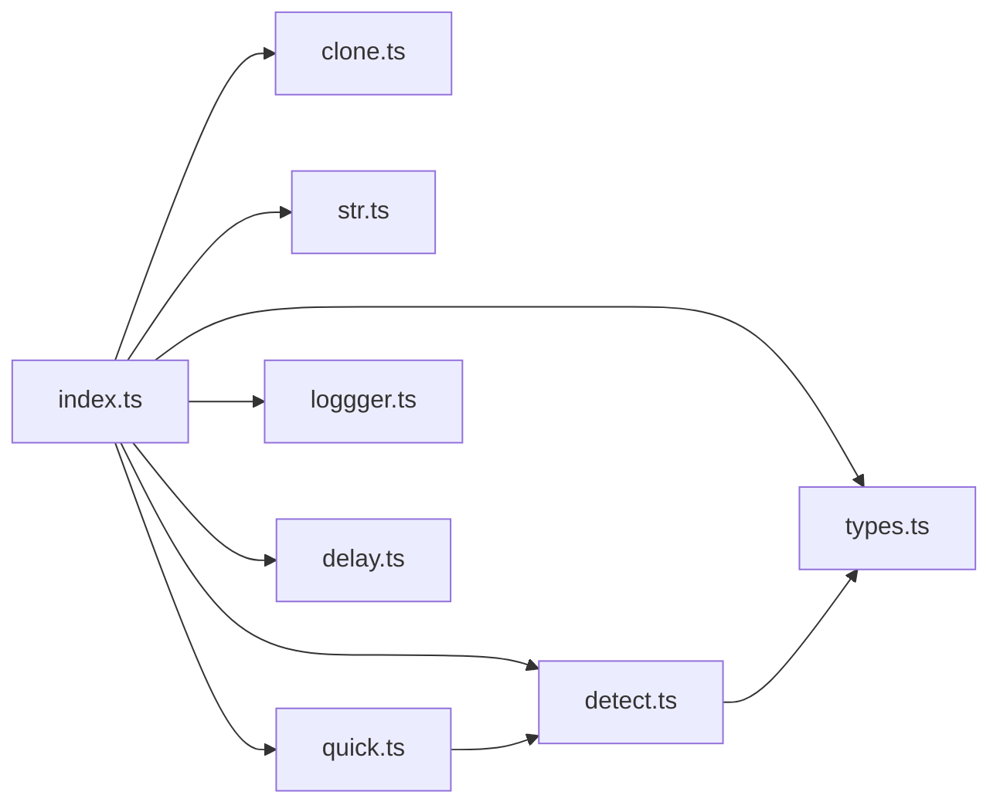

# 工具函数

<cite>
**本文引用的文件**
- [packages/utils/src/index.ts](file://packages/utils/src/index.ts)
- [packages/utils/src/clone.ts](file://packages/utils/src/clone.ts)
- [packages/utils/src/detect.ts](file://packages/utils/src/detect.ts)
- [packages/utils/src/str.ts](file://packages/utils/src/str.ts)
- [packages/utils/src/types.ts](file://packages/utils/src/types.ts)
- [packages/utils/src/quick.ts](file://packages/utils/src/quick.ts)
- [packages/utils/src/loggger.ts](file://packages/utils/src/loggger.ts)
- [packages/utils/src/delay.ts](file://packages/utils/src/delay.ts)
- [packages/utils/README.md](file://packages/utils/README.md)
- [packages/utils/package.json](file://packages/utils/package.json)
</cite>

## 目录
1. [简介](#简介)
2. [项目结构](#项目结构)
3. [核心组件](#核心组件)
4. [架构总览](#架构总览)
5. [详细组件分析](#详细组件分析)
6. [依赖分析](#依赖分析)
7. [性能考虑](#性能考虑)
8. [故障排查指南](#故障排查指南)
9. [结论](#结论)
10. [附录](#附录)

## 简介
本文件面向 Vitarx 工具函数库，系统性梳理以下能力：
- 深度克隆 deepClone：循环引用处理、内置类型支持、复杂数据结构遍历策略
- 防抖 debounce 与节流 throttle：时间控制与执行上下文管理
- 类型检测工具：isObject、isArray、isRecordObject、isCollection、isDeepEqual 等的精确判断逻辑
- 字符串工具：驼峰与短横线命名互转、首字母大写
- 延迟与超时控制：withDelayAndTimeout 的延迟触发、超时中断、取消机制
- 日志工具：Logger 类与 logger 实例，支持级别过滤、源码位置信息、格式化输出
- 其他常用工具：sleep、popProperty、deepMergeObject

本指南提供参数说明、返回值解释、使用示例与性能特征，帮助开发者在日常开发中高效利用这些辅助功能。

## 项目结构
工具函数库位于 packages/utils，采用按功能拆分的模块化组织方式，入口导出统一聚合。

图表来源
- [packages/utils/src/index.ts](file://packages/utils/src/index.ts#L1-L8)
- [packages/utils/src/clone.ts](file://packages/utils/src/clone.ts#L1-L124)
- [packages/utils/src/detect.ts](file://packages/utils/src/detect.ts#L1-L540)
- [packages/utils/src/str.ts](file://packages/utils/src/str.ts#L1-L45)
- [packages/utils/src/types.ts](file://packages/utils/src/types.ts#L1-L336)
- [packages/utils/src/quick.ts](file://packages/utils/src/quick.ts#L1-L175)
- [packages/utils/src/loggger.ts](file://packages/utils/src/loggger.ts#L1-L230)
- [packages/utils/src/delay.ts](file://packages/utils/src/delay.ts#L1-L145)

章节来源
- [packages/utils/src/index.ts](file://packages/utils/src/index.ts#L1-L8)
- [packages/utils/README.md](file://packages/utils/README.md#L1-L50)

## 核心组件
- deepClone：支持循环引用、Date/RegExp/Set/Map/Array/Object 的克隆，基于广度优先遍历与 WeakMap 哈希表去重
- 类型检测：isObject/isArray/isRecordObject、集合类型 isMap/isSet/isWeakMap/isWeakSet/isCollection、函数类型 isFunction/isAsyncFunction/isConstructor/isPureFunction/isSimpleGetterFunction、数值字符串 isNumString、空值 isEmpty、数组相等 isArrayEqual、深度相等 isDeepEqual
- 字符串工具：toCamelCase、toKebabCase、toCapitalize
- 延迟与超时：withDelayAndTimeout，支持延迟触发、超时中断、取消、信号校验
- 防抖与节流：debounce/throttle，管理执行上下文与时间窗口
- 其他工具：sleep、popProperty、deepMergeObject

章节来源
- [packages/utils/src/clone.ts](file://packages/utils/src/clone.ts#L1-L124)
- [packages/utils/src/detect.ts](file://packages/utils/src/detect.ts#L1-L540)
- [packages/utils/src/str.ts](file://packages/utils/src/str.ts#L1-L45)
- [packages/utils/src/quick.ts](file://packages/utils/src/quick.ts#L1-L175)
- [packages/utils/src/delay.ts](file://packages/utils/src/delay.ts#L1-L145)
- [packages/utils/src/loggger.ts](file://packages/utils/src/loggger.ts#L1-L230)

## 架构总览
工具函数库采用“按功能模块划分 + 统一入口导出”的设计，便于按需引入与 Tree-shaking。

图表来源
- [packages/utils/src/index.ts](file://packages/utils/src/index.ts#L1-L8)

## 详细组件分析

### 深度克隆 deepClone
- 功能概述
  - 支持任意类型对象的深度克隆，包括循环引用
  - 内置类型支持：Date、RegExp、Set、Map、Array、Object
  - 使用广度优先遍历与 WeakMap 哈希表避免重复克隆与死循环
- 关键实现要点
  - 基础类型直接返回
  - 使用 WeakMap 记录已克隆对象，遇到已克隆对象直接复用
  - 队列存储待处理子节点，按类型分支入队：Set/Map/Array/Object
  - addToParent 统一处理父容器写入：普通属性、Set.add、Map.set
  - Date/RegExp 不继续入队子元素，避免多余处理
- 参数与返回
  - 参数：任意类型 T
  - 返回：T 的深拷贝副本
- 性能特征
  - 时间复杂度：O(N)，N 为所有节点数量
  - 空间复杂度：O(N)，WeakMap + 队列
  - 适合大规模对象图，循环引用场景稳定
- 使用建议
  - 大对象图建议配合弱引用容器（WeakMap/WeakSet）减少内存压力
  - 克隆包含不可序列化对象（如 DOM、函数）时，注意结果语义差异

图表来源
- [packages/utils/src/clone.ts](file://packages/utils/src/clone.ts#L1-L124)

章节来源
- [packages/utils/src/clone.ts](file://packages/utils/src/clone.ts#L1-L124)

### 类型检测与深度比较
- isObject / isArray / isRecordObject
  - isObject：排除 null 的严格对象判断
  - isArray：基于 Array.isArray
  - isRecordObject：排除数组的“键值对对象”概念（含 Map/Set 等）
- isString / isNumber / isBool / isFunction / isAsyncFunction / isConstructor / isPureFunction / isSimpleGetterFunction
  - isAsyncFunction：基于原型链判断 async 关键字
  - isConstructor：通过函数字符串前缀判断 class
  - isPureFunction：排除类构造函数的“纯函数”判断
  - isSimpleGetterFunction：要求箭头函数且无花括号体
- isMap / isSet / isWeakMap / isWeakSet / isCollection
  - 使用 Object.prototype.toString 进行精确类型判断
- isNumString
  - 判断纯数字字符串，支持可选空格清理
- isEmpty
  - 空对象/空集合/空数组/0/false/null/undefined 视为空
- isArrayEqual
  - 严格长度与逐元素 Object.is 比较
- isDeepEqual
  - 递归比较，支持深度参数，Reflect.ownKeys 遍历，Object.hasOwn 检测键存在性
  - 特殊处理：Object.is 引用相等与 NaN 相等、-0 与 0 不等

图表来源
- [packages/utils/src/detect.ts](file://packages/utils/src/detect.ts#L439-L518)

章节来源
- [packages/utils/src/detect.ts](file://packages/utils/src/detect.ts#L1-L540)

### 字符串工具
- toCamelCase
  - 将短横线命名转为驼峰命名
- toKebabCase
  - 将驼峰命名转为短横线命名
- toCapitalize
  - 首字母大写

章节来源
- [packages/utils/src/str.ts](file://packages/utils/src/str.ts#L1-L45)

### 防抖 debounce 与节流 throttle
- debounce
  - 基于 setTimeout，每次调用清除上次定时器，延时 delay 后执行
  - 保持调用上下文 this，透传参数
- throttle
  - 基于时间窗口控制，delay 时间内仅执行一次
  - 保持调用上下文 this，透传参数
- 性能与上下文
  - 两者均通过 apply(this, args) 管理执行上下文
  - debounce 更适合输入框搜索、窗口尺寸监听等高频事件的最终触发
  - throttle 更适合滚动、鼠标移动等需要周期性触发的场景

图表来源
- [packages/utils/src/quick.ts](file://packages/utils/src/quick.ts#L129-L175)

章节来源
- [packages/utils/src/quick.ts](file://packages/utils/src/quick.ts#L129-L175)

### 延迟与超时控制 withDelayAndTimeout
- 功能概述
  - 包装 Promise 或异步任务，支持延迟触发、超时中断、取消、信号校验
- 关键点
  - delay：延迟触发 onDelay
  - timeout：超时触发 onTimeout 并拒绝
  - cancel：手动取消，清理定时器
  - signal：任务仍有效时才继续执行
- 参数与返回
  - 参数：task（Promise 或工厂函数）、options（delay/timeout/onDelay/onTimeout/onResolve/onReject/signal）
  - 返回：Promise<T> 并带有 cancel 方法
- 使用建议
  - 与 UI 加载态联动（delay 显示 loading，timeout 报错）
  - 与组件生命周期绑定（signal 校验组件是否仍处于活跃状态）

图表来源
- [packages/utils/src/delay.ts](file://packages/utils/src/delay.ts#L1-L145)

章节来源
- [packages/utils/src/delay.ts](file://packages/utils/src/delay.ts#L1-L145)

### 日志工具 Logger 与 logger
- Logger
  - 支持 DEBUG/INFO/WARN/ERROR 级别
  - 可配置 includeSourceInfo 与 prefix
  - formatMessage 统一格式化输出
  - debug/info/warn/error 内部委托 log
- logger
  - 全局单例，带 [Vitarx] 前缀
- 使用建议
  - 开发环境开启 includeSourceInfo，便于定位
  - 生产环境提升级别至 ERROR，减少日志噪声

章节来源
- [packages/utils/src/loggger.ts](file://packages/utils/src/loggger.ts#L1-L230)

### 其他常用工具
- sleep
  - 基于 Promise 的毫秒级延迟
- popProperty
  - 安全弹出对象属性，返回被删除值，不存在则返回 undefined
- deepMergeObject
  - 递归合并两个记录对象，支持 allowMergeUndefined 与 mergeArray 选项
  - 对数组：可选择拼接或覆盖
  - 对对象：递归合并
  - 类型约束：isRecordObject 保证输入为“键值对对象”

章节来源
- [packages/utils/src/quick.ts](file://packages/utils/src/quick.ts#L1-L128)

## 依赖分析
- 模块内聚与耦合
  - index.ts 作为统一出口，聚合各模块导出，降低上层依赖分散
  - quick.ts 依赖 detect.ts 与 types.ts 的类型与运行时判断
  - detect.ts 依赖 types.ts 的集合与记录类型定义
  - clone.ts 为独立算法模块，不依赖其他工具函数
  - str.ts 与 loggger.ts/delay.ts 为纯工具模块，低耦合
- 外部依赖
  - 无外部运行时依赖，纯 ES 模块
- 可能的循环依赖
  - 模块间无循环导入迹象

图表来源
- [packages/utils/src/index.ts](file://packages/utils/src/index.ts#L1-L8)
- [packages/utils/src/quick.ts](file://packages/utils/src/quick.ts#L1-L20)
- [packages/utils/src/detect.ts](file://packages/utils/src/detect.ts#L1-L10)

章节来源
- [packages/utils/src/index.ts](file://packages/utils/src/index.ts#L1-L8)
- [packages/utils/src/quick.ts](file://packages/utils/src/quick.ts#L1-L20)
- [packages/utils/src/detect.ts](file://packages/utils/src/detect.ts#L1-L10)
- [packages/utils/src/types.ts](file://packages/utils/src/types.ts#L1-L30)

## 性能考虑
- deepClone
  - O(N) 时间与空间，适合大对象图；循环引用通过 WeakMap 去重避免重复克隆
- debounce/throttle
  - 仅维护少量定时器，开销极低；注意避免在高频事件中频繁创建包装函数
- isDeepEqual
  - 递归比较，深度越大成本越高；合理使用 depth 参数
- withDelayAndTimeout
  - 定时器数量有限；建议及时 cancel，避免悬挂任务
- 日志
  - DEBUG/INFO/WARN/ERROR 级别过滤，生产环境建议提升级别

## 故障排查指南
- deepClone
  - 症状：循环引用导致栈溢出或性能异常
  - 排查：确认对象图确实存在循环引用；检查 WeakMap 是否正确记录
- debounce/throttle
  - 症状：上下文丢失或参数未传递
  - 排查：确认使用 apply(this,args)；避免在闭包中误绑定 this
- isDeepEqual
  - 症状：NaN 不相等或 -0/0 行为不符合预期
  - 排查：理解 Object.is 的语义；必要时在业务层做特殊处理
- withDelayAndTimeout
  - 症状：超时不触发或无法取消
  - 排查：确认 timeout > 0；检查 isSettled 标志与 signal 条件；确保 cancel 调用时机正确
- 日志
  - 症状：缺少源码位置信息
  - 排查：确认 includeSourceInfo 与环境变量 DEV；检查传入的 LogSource 参数

章节来源
- [packages/utils/src/clone.ts](file://packages/utils/src/clone.ts#L77-L124)
- [packages/utils/src/quick.ts](file://packages/utils/src/quick.ts#L129-L175)
- [packages/utils/src/detect.ts](file://packages/utils/src/detect.ts#L439-L518)
- [packages/utils/src/delay.ts](file://packages/utils/src/delay.ts#L72-L145)
- [packages/utils/src/loggger.ts](file://packages/utils/src/loggger.ts#L136-L224)

## 结论
Vitarx 工具函数库提供了高内聚、低耦合的通用能力集合，涵盖深度克隆、类型检测、字符串处理、防抖节流、延迟超时、日志与常用工具。通过清晰的模块边界与统一导出，开发者可按需引入，获得稳定的性能与良好的可维护性。建议在高频事件中谨慎使用 debounce/throttle，在大对象图场景优先考虑 deepClone 的循环引用与内存占用，结合 withDelayAndTimeout 优化用户体验与资源释放。

## 附录
- 安装与使用
  - 安装：npm install @vitarx/utils
  - 使用：从入口统一导出引入所需函数
- 版本与许可
  - 版本：参见包配置
  - 许可：MIT

章节来源
- [packages/utils/README.md](file://packages/utils/README.md#L1-L50)
- [packages/utils/package.json](file://packages/utils/package.json#L1-L22)