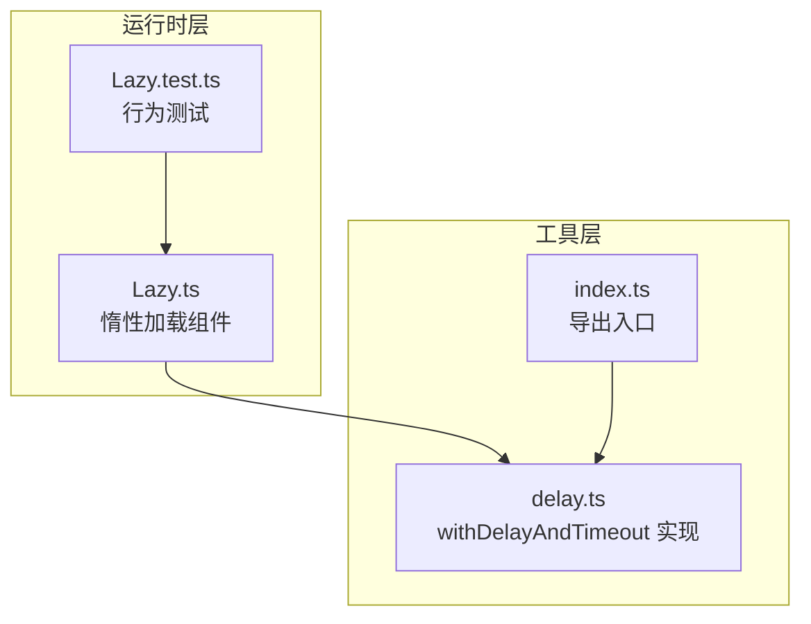
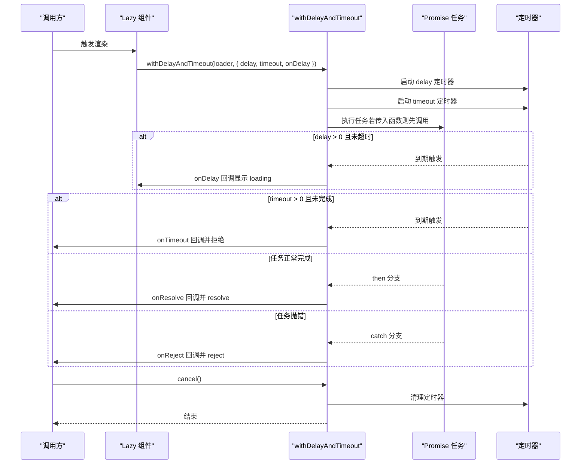
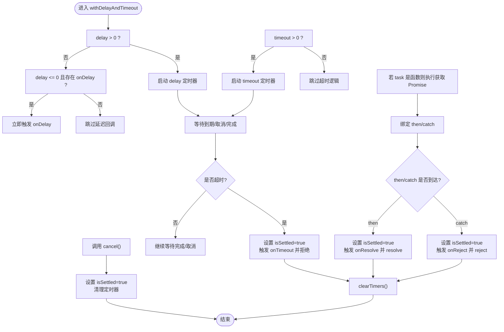
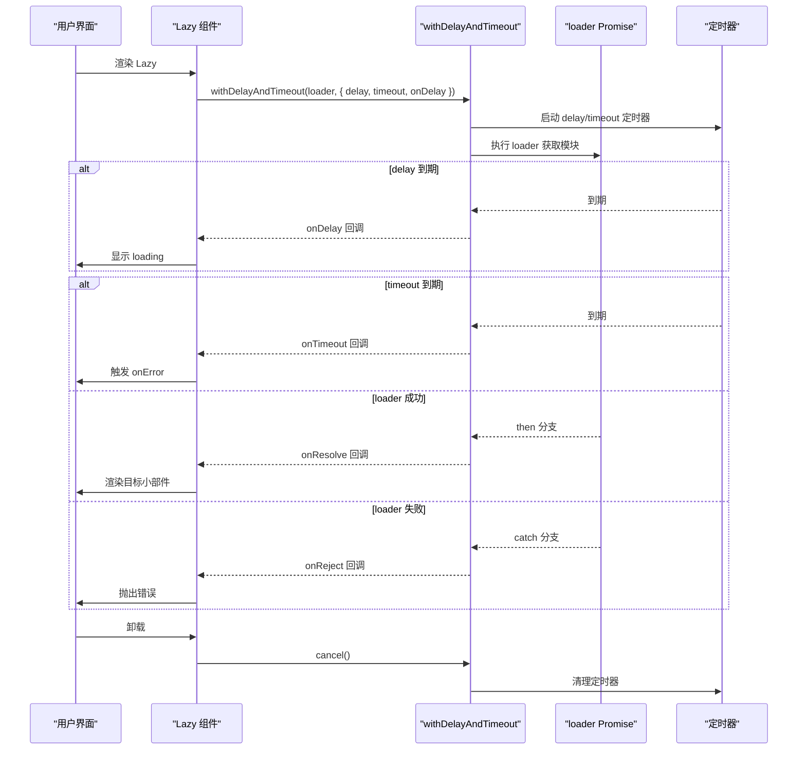

# 异步控制

<cite>
**本文引用的文件列表**
- [delay.ts](file://packages/utils/src/delay.ts)
- [index.ts](file://packages/utils/src/index.ts)
- [Lazy.ts](file://packages/runtime-core/src/widget/widgets/Lazy.ts)
- [Lazy.test.ts](file://packages/runtime-core/__tests__/widget/widgets/Lazy.test.ts)
</cite>

## 目录
1. [简介](#简介)
2. [项目结构](#项目结构)
3. [核心组件](#核心组件)
4. [架构总览](#架构总览)
5. [详细组件分析](#详细组件分析)
6. [依赖关系分析](#依赖关系分析)
7. [性能考量](#性能考量)
8. [故障排查指南](#故障排查指南)
9. [结论](#结论)
10. [附录](#附录)

## 简介
本文围绕 withDelayAndTimeout 函数展开，系统阐述其如何为 Promise 任务提供“延迟触发 + 超时控制 + 取消能力”的组合式异步控制方案。重点解析 DelayTimeoutOptions 配置项中 delay、timeout、onDelay、onTimeout、onResolve、onReject、signal 的作用机制；剖析内部定时器管理、isSettled 状态控制与 cancel 取消方法的实现原理；并通过 Lazy 组件在运行时中的实际应用，展示其在请求加载状态显示、接口超时熔断、用户操作取消等场景下的落地实践。最后给出性能优化建议，包括避免内存泄漏与合理设置超时阈值。

## 项目结构
- 工具层：在工具包中提供 withDelayAndTimeout 与 DelayTimeoutOptions 类型定义，供上层组件复用。
- 运行时层：在 Lazy 组件中消费 withDelayAndTimeout，实现异步小部件的延迟加载、超时熔断与取消控制。

图表来源
- [delay.ts](file://packages/utils/src/delay.ts#L1-L144)
- [index.ts](file://packages/utils/src/index.ts#L1-L8)
- [Lazy.ts](file://packages/runtime-core/src/widget/widgets/Lazy.ts#L1-L208)
- [Lazy.test.ts](file://packages/runtime-core/__tests__/widget/widgets/Lazy.test.ts#L126-L174)

章节来源
- [delay.ts](file://packages/utils/src/delay.ts#L1-L144)
- [index.ts](file://packages/utils/src/index.ts#L1-L8)
- [Lazy.ts](file://packages/runtime-core/src/widget/widgets/Lazy.ts#L1-L208)
- [Lazy.test.ts](file://packages/runtime-core/__tests__/widget/widgets/Lazy.test.ts#L126-L174)

## 核心组件
- withDelayAndTimeout：对任意 Promise 或返回 Promise 的任务进行包装，提供延迟触发、超时熔断与取消能力。
- DelayTimeoutOptions：配置项接口，包含 delay、timeout、onDelay、onTimeout、onResolve、onReject、signal。
- Lazy 组件：在运行时中消费 withDelayAndTimeout，实现异步小部件的延迟加载与超时熔断。

章节来源
- [delay.ts](file://packages/utils/src/delay.ts#L1-L144)
- [Lazy.ts](file://packages/runtime-core/src/widget/widgets/Lazy.ts#L1-L208)

## 架构总览
下面以序列图展示 withDelayAndTimeout 的典型调用流程，以及 Lazy 组件如何将其集成到异步加载管线中。

图表来源
- [delay.ts](file://packages/utils/src/delay.ts#L72-L144)
- [Lazy.ts](file://packages/runtime-core/src/widget/widgets/Lazy.ts#L159-L170)

## 详细组件分析

### withDelayAndTimeout 实现与配置项详解
- DelayTimeoutOptions 关键字段
  - delay：延迟触发时间（毫秒）。当 delay > 0 时，到期后触发 onDelay；当 delay ≤ 0 且存在 onDelay 时，立即触发。
  - timeout：超时时间（毫秒）。当 timeout > 0 时，到期后触发 onTimeout 并拒绝 Promise。
  - onDelay：延迟到期回调，常用于显示 loading。
  - onTimeout：超时回调，接收错误对象。
  - onResolve：任务成功回调，接收结果值。
  - onReject：任务失败回调，接收错误。
  - signal：外部有效性检查函数，返回 true 表示任务无效，将阻止后续副作用执行。
- 内部实现要点
  - 定时器管理：维护 delayTimer 与 timeoutTimer，统一通过 clearTimers 清理。
  - 状态控制：isSettled 标记任务是否已 settle，确保超时、完成、取消后不再触发副作用。
  - 取消方法：在 Promise 实例上挂载 cancel，调用后标记 isSettled 并清理定时器。
  - 任务执行：若传入的是函数，先执行获取 Promise；then/catch 中均会设置 isSettled 并清理定时器。

图表来源
- [delay.ts](file://packages/utils/src/delay.ts#L72-L144)

章节来源
- [delay.ts](file://packages/utils/src/delay.ts#L1-L144)

### Lazy 组件中的集成与使用
- Lazy 通过 withDelayAndTimeout 包装 loader，实现：
  - delay：在 delay 到期后触发 onDelay，从而切换为 loading 视图。
  - timeout：在超时后触发 onError（由 Lazy 内部处理），实现超时熔断。
  - cancel：在组件卸载时调用 task.cancel，防止卸载后状态更新。
- 测试覆盖了延迟显示 loading、超时触发 onError、delay=0 立即显示、timeout<=0 不限制超时、卸载时取消等边界场景。

图表来源
- [Lazy.ts](file://packages/runtime-core/src/widget/widgets/Lazy.ts#L159-L170)
- [Lazy.test.ts](file://packages/runtime-core/__tests__/widget/widgets/Lazy.test.ts#L126-L174)
- [Lazy.test.ts](file://packages/runtime-core/__tests__/widget/widgets/Lazy.test.ts#L176-L196)
- [Lazy.test.ts](file://packages/runtime-core/__tests__/widget/widgets/Lazy.test.ts#L323-L340)

章节来源
- [Lazy.ts](file://packages/runtime-core/src/widget/widgets/Lazy.ts#L1-L208)
- [Lazy.test.ts](file://packages/runtime-core/__tests__/widget/widgets/Lazy.test.ts#L126-L174)
- [Lazy.test.ts](file://packages/runtime-core/__tests__/widget/widgets/Lazy.test.ts#L176-L196)
- [Lazy.test.ts](file://packages/runtime-core/__tests__/widget/widgets/Lazy.test.ts#L323-L340)

## 依赖关系分析
- 导出关系：工具包通过 index.ts 导出 delay.ts 中的 withDelayAndTimeout，供运行时层按需引入。
- 使用关系：Lazy 组件在渲染路径中调用 withDelayAndTimeout，形成“运行时组件 → 工具函数”的单向依赖。
- 测试关系：Lazy.test.ts 验证了 delay、timeout、onError、卸载取消等关键行为。

图表来源
- [index.ts](file://packages/utils/src/index.ts#L1-L8)
- [delay.ts](file://packages/utils/src/delay.ts#L1-L144)
- [Lazy.ts](file://packages/runtime-core/src/widget/widgets/Lazy.ts#L1-L208)
- [Lazy.test.ts](file://packages/runtime-core/__tests__/widget/widgets/Lazy.test.ts#L126-L174)

章节来源
- [index.ts](file://packages/utils/src/index.ts#L1-L8)
- [delay.ts](file://packages/utils/src/delay.ts#L1-L144)
- [Lazy.ts](file://packages/runtime-core/src/widget/widgets/Lazy.ts#L1-L208)
- [Lazy.test.ts](file://packages/runtime-core/__tests__/widget/widgets/Lazy.test.ts#L126-L174)

## 性能考量
- 避免内存泄漏
  - 确保在组件卸载时调用 cancel，以清理定时器并阻止后续副作用执行。
  - 在任务完成或拒绝后，务必清理定时器，避免悬挂定时器占用资源。
- 合理设置超时阈值
  - timeout 应结合网络环境与业务特性设定，避免过短导致误判，过长影响用户体验。
  - 对于可预期的长耗时任务，优先考虑分段加载与进度反馈，而非仅依赖超时熔断。
- 降低不必要的 UI 刷新
  - onDelay 仅在 delay 到期后触发，delay=0 时立即触发，应根据业务需求选择合适的 delay 值，减少不必要的 UI 切换。
- 信号函数的开销
  - signal 应保持轻量，避免在高频调用中执行重逻辑，以免影响主流程性能。

## 故障排查指南
- 延迟不生效
  - 检查 delay 是否大于 0；若 delay ≤ 0，需确认是否期望立即触发 onDelay。
  - 确认 signal 返回值是否为 true，导致延迟回调被阻断。
- 超时未触发
  - 检查 timeout 是否大于 0；若为 0 或负值，不会触发超时逻辑。
  - 确认任务是否提前完成或被取消，导致超时逻辑未执行。
- 取消无效
  - 确认是否在渲染前保存了 cancel 引用并在卸载时调用。
  - 检查 isSettled 是否已被设置为 true，此时 cancel 将直接返回。
- UI 状态异常
  - 若卸载后仍出现状态更新，检查是否在 onBeforeUnmount 中调用了 cancel。
  - 确认 onResolve/onReject/onTimeout 是否正确地与 UI 刷新逻辑配合。

章节来源
- [Lazy.ts](file://packages/runtime-core/src/widget/widgets/Lazy.ts#L142-L144)
- [Lazy.test.ts](file://packages/runtime-core/__tests__/widget/widgets/Lazy.test.ts#L323-L340)

## 结论
withDelayAndTimeout 提供了简洁而强大的异步控制能力：通过 delay 实现“加载态显示”，通过 timeout 实现“超时熔断”，通过 cancel 实现“用户/组件级取消”。结合 Lazy 组件的集成，可在真实业务中稳定地提升交互体验与健壮性。实践中应重视定时器清理、合理设置超时阈值与信号函数的轻量化，以获得更佳的性能与可维护性。

## 附录
- API 速览（基于源码）
  - withDelayAndTimeout(task, options)：返回带 cancel 方法的 Promise。
  - DelayTimeoutOptions 字段：delay、timeout、onDelay、onTimeout、onResolve、onReject、signal。
- 典型使用场景
  - 请求加载状态显示：delay 到期后显示 loading，任务完成后替换为内容。
  - 接口超时熔断：timeout 到期后触发 onTimeout 并拒绝，交由 onError 处理。
  - 用户操作取消：在用户快速切换或组件卸载时调用 cancel，避免后续副作用。

章节来源
- [delay.ts](file://packages/utils/src/delay.ts#L1-L144)
- [Lazy.ts](file://packages/runtime-core/src/widget/widgets/Lazy.ts#L159-L170)