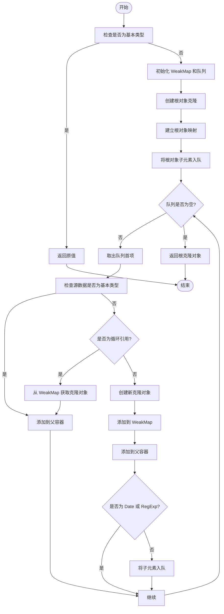
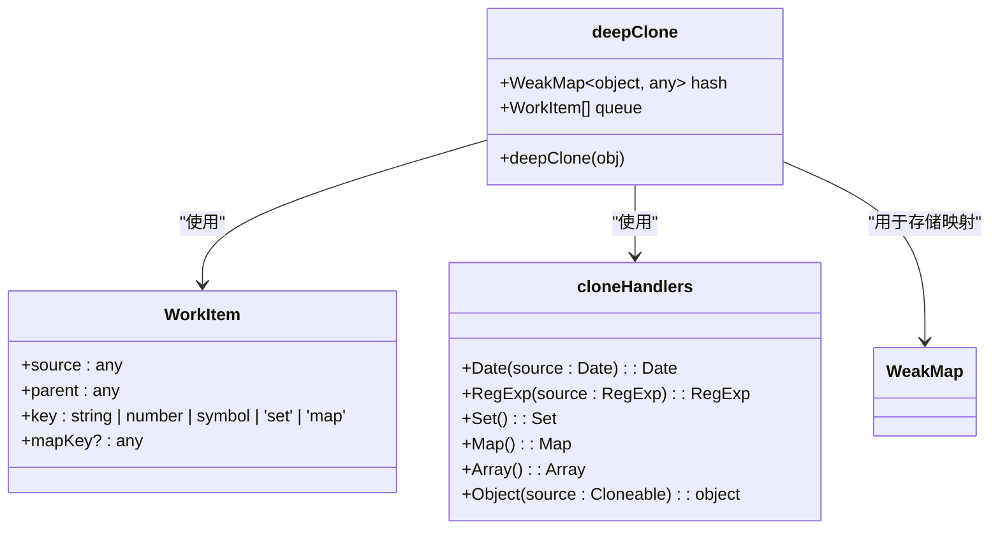
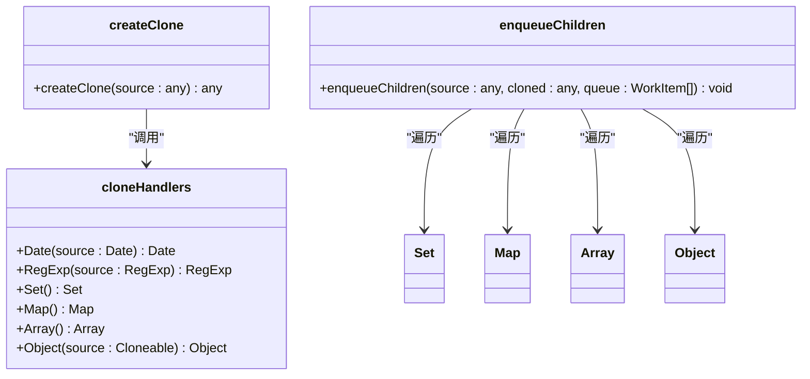
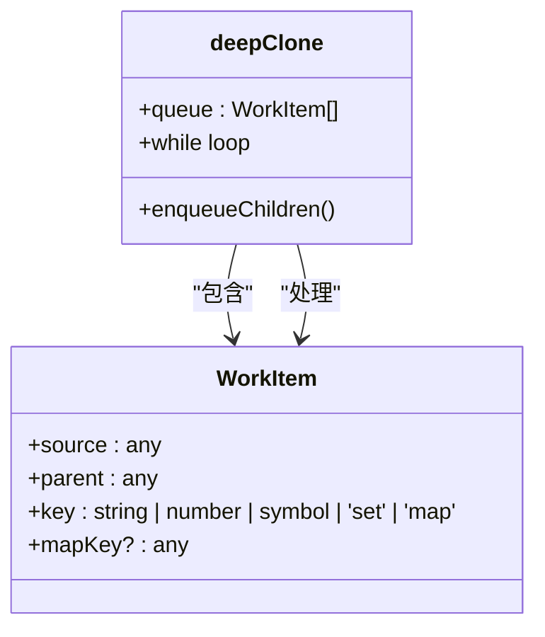
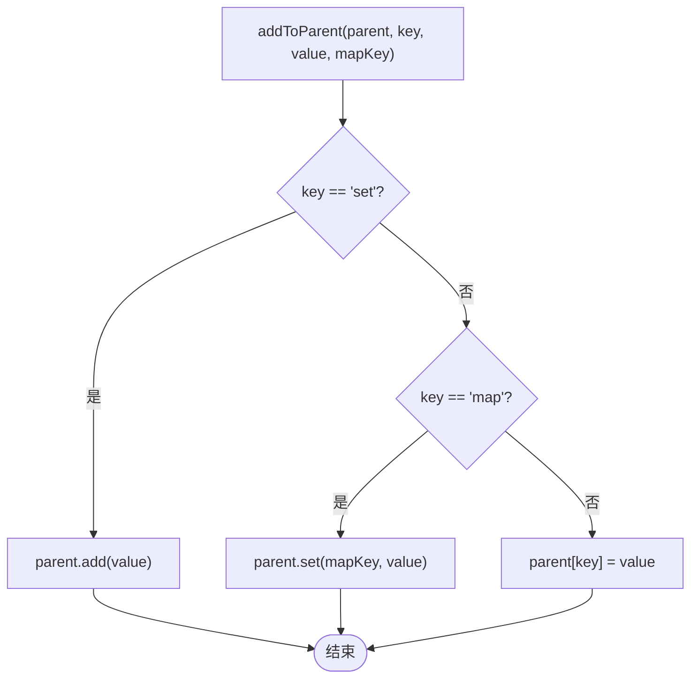
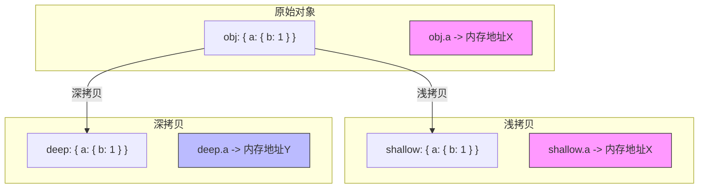

# 深拷贝

<cite>
**本文档引用的文件**  
- [clone.ts](file://packages/utils/src/clone.ts#L1-L124)
- [detect.ts](file://packages/utils/src/detect.ts#L1-L540)
- [types.ts](file://packages/utils/src/types.ts#L1-L336)
</cite>

## 目录
1. [介绍](#介绍)
2. [核心实现原理](#核心实现原理)
3. [循环引用处理机制](#循环引用处理机制)
4. [广度优先遍历策略](#广度优先遍历策略)
5. [内置类型支持](#内置类型支持)
6. [WorkItem 队列设计](#workitem-队列设计)
7. [addToParent 多类型容器适配](#addtoparent-多类型容器适配)
8. [使用示例](#使用示例)
9. [与浅拷贝的差异](#与浅拷贝的差异)
10. [性能特征](#性能特征)
11. [最佳实践](#最佳实践)

## 介绍

`deepClone` 是 Vitarx 框架中用于实现深度克隆的核心工具函数，位于 `@vitarx/utils` 包中。该函数能够安全地复制任意复杂的数据结构，包括嵌套对象、数组、Set、Map、Date、RegExp 等内置类型，并能正确处理循环引用，避免无限递归导致的栈溢出问题。`deepClone` 的设计兼顾了功能完整性与性能优化，适用于状态管理、数据快照、缓存隔离等多种前端开发场景。

**Section sources**
- [clone.ts](file://packages/utils/src/clone.ts#L77-L123)

## 核心实现原理

`deepClone` 函数采用迭代式广度优先遍历（BFS）策略，结合 `WeakMap` 缓存已克隆对象的引用，确保在处理复杂嵌套结构时既高效又安全。其核心流程分为三个阶段：初始化、队列处理和返回结果。

在初始化阶段，函数首先通过 `isPrimitive` 判断输入是否为基本类型，若是则直接返回原值。对于对象类型，创建一个 `WeakMap` 用于存储原始对象与克隆对象的映射关系，并初始化一个 `WorkItem` 队列来管理待处理的克隆任务。

队列处理阶段是算法的核心，通过 `while` 循环不断从队列中取出 `WorkItem` 进行处理。每个 `WorkItem` 包含源数据、父级克隆对象和键名等信息。处理逻辑会检查当前源数据是否为基本类型或已存在于 `WeakMap` 中（即循环引用），若是则直接赋值；否则创建新的克隆对象，建立映射，并将其子元素加入队列等待后续处理。

最终，当队列为空时，整个数据结构的克隆完成，返回最初创建的根节点克隆对象。



**Diagram sources**
- [clone.ts](file://packages/utils/src/clone.ts#L77-L123)

**Section sources**
- [clone.ts](file://packages/utils/src/clone.ts#L77-L123)

## 循环引用处理机制

`deepClone` 通过 `WeakMap` 实现对循环引用的安全处理。`WeakMap` 是一种特殊的集合，其键名必须是对象，且不会阻止垃圾回收机制回收这些键名对象。这一特性使其成为存储对象引用映射的理想选择，既能避免内存泄漏，又能有效检测循环引用。

当算法遍历到一个对象时，首先检查该对象是否已存在于 `WeakMap` 中。如果存在，说明该对象已被克隆过，当前正在处理的是一个循环引用，此时直接从 `WeakMap` 中取出对应的克隆对象并赋值给父容器，从而避免了无限递归。如果不存在，则创建新的克隆对象，并立即将原始对象与克隆对象的映射关系存入 `WeakMap`，为后续可能的循环引用检测做好准备。

这种机制确保了即使输入数据结构中存在复杂的循环引用（如对象的某个属性直接或间接地指向自身），`deepClone` 也能生成一个结构完整且无循环的新对象，而不会陷入死循环或抛出错误。



**Diagram sources**
- [clone.ts](file://packages/utils/src/clone.ts#L82-L89)
- [clone.ts](file://packages/utils/src/clone.ts#L104-L108)

**Section sources**
- [clone.ts](file://packages/utils/src/clone.ts#L82-L108)

## 广度优先遍历策略

`deepClone` 采用广度优先遍历（BFS）而非传统的深度优先遍历（DFS），这是其性能和稳定性设计的关键。BFS 通过一个队列（`WorkItem[]`）来管理待处理的克隆任务，确保在处理一个对象的所有子元素之前，先为该对象创建好克隆实例并建立 `WeakMap` 映射。

这种策略的优势在于，它保证了在任何子元素被处理之前，其父级对象的克隆已经存在。这不仅使得循环引用的检测更加可靠，还避免了 DFS 在处理极深嵌套结构时可能出现的栈溢出问题。BFS 的迭代式实现也比递归式 DFS 更加高效，尤其是在 JavaScript 引擎栈空间有限的情况下。

队列中的每个 `WorkItem` 代表一个待处理的克隆任务，包含源数据、父级克隆对象和键名。算法通过 `enqueueChildren` 函数将对象的子元素（如对象的属性、数组的元素、Set/Map 的值）封装成 `WorkItem` 并推入队列。`while` 循环则持续从队列头部取出任务进行处理，直到队列为空。

```mermaid
flowchart LR
A["原始对象"] --> B["创建根克隆"]
B --> C["建立 WeakMap 映射"]
C --> D["子元素入队"]
D --> E["队列: [child1, child2, ...]"]
E --> F["处理 child1"]
F --> G["创建 child1 克隆"]
G --> H["建立 WeakMap 映射"]
H --> I["child1 子元素入队"]
I --> J["队列: [child2, grandchild1, ...]"]
J --> K["处理 child2"]
K --> L["..."]
L --> M["队列为空"]
M --> N["返回根克隆"]
```



**Diagram sources**
- [clone.ts](file://packages/utils/src/clone.ts#L84-L95)
- [clone.ts](file://packages/utils/src/clone.ts#L37-L51)

**Section sources**
- [clone.ts](file://packages/utils/src/clone.ts#L83-L95)

## 内置类型支持

`deepClone` 通过预定义的 `cloneHandlers` 对象，为多种内置类型提供了专门的克隆逻辑，确保它们的特殊属性和行为能够被正确复制。

- **Date**: 使用 `new Date(source.getTime())` 创建一个具有相同时间戳的新 `Date` 对象。
- **RegExp**: 使用 `new RegExp(source.source, source.flags)` 创建一个具有相同模式和标志的新正则表达式对象。
- **Set**: 使用 `new Set()` 创建一个空的 `Set`，然后在后续处理中将其元素逐一添加。
- **Map**: 使用 `new Map()` 创建一个空的 `Map`，然后在后续处理中将其键值对逐一添加。
- **Array**: 使用 `[]` 创建一个空数组，然后在后续处理中将其元素逐一添加。
- **Object**: 使用 `Object.create(Object.getPrototypeOf(source))` 创建一个新对象，其原型链与源对象一致，从而保留了继承关系。

对于 `Date` 和 `RegExp`，由于它们是不可变的（immutable），在创建克隆后无需再处理其子元素。而对于 `Set`、`Map`、`Array` 和普通对象，它们的子元素（或成员）会被 `enqueueChildren` 函数识别并加入队列，等待后续的克隆处理。



**Diagram sources**
- [clone.ts](file://packages/utils/src/clone.ts#L14-L21)
- [clone.ts](file://packages/utils/src/clone.ts#L27-L34)
- [clone.ts](file://packages/utils/src/clone.ts#L37-L51)

**Section sources**
- [clone.ts](file://packages/utils/src/clone.ts#L14-L51)

## WorkItem 队列设计

`WorkItem` 是 `deepClone` 算法中用于传递克隆任务信息的接口。它定义了一个包含四个属性的对象：`source`（源数据）、`parent`（父级克隆对象）、`key`（在父容器中的键名）和可选的 `mapKey`（用于 `Map` 的键）。

`WorkItem` 的设计是实现广度优先遍历和多类型容器适配的关键。它将“从哪里复制”和“复制到哪里”这两个问题解耦。`source` 指明了需要克隆的数据，而 `parent` 和 `key` 则指明了克隆结果应该被放置的位置。这种设计使得算法可以统一处理所有类型的容器，无论是对象的属性、数组的索引，还是 `Set`/`Map` 的成员。

队列（`WorkItem[]`）作为任务调度中心，存储了所有待处理的 `WorkItem`。算法通过 `queue.shift()` 从队列头部取出任务，保证了广度优先的处理顺序。每当一个对象被克隆，其所有子元素都会被封装成 `WorkItem` 并通过 `queue.push()` 添加到队列尾部，等待后续处理。



**Diagram sources**
- [clone.ts](file://packages/utils/src/clone.ts#L6-L11)
- [clone.ts](file://packages/utils/src/clone.ts#L84-L96)

**Section sources**
- [clone.ts](file://packages/utils/src/clone.ts#L6-L11)

## addToParent 多类型容器适配

`addToParent` 函数是 `deepClone` 实现多类型容器适配的核心。它负责将一个克隆后的值（`value`）正确地添加到其父级容器（`parent`）的指定位置（`key`）。

该函数通过 `key` 参数的特殊值来区分不同的容器类型：
- 当 `key` 为 `'set'` 时，表示父容器是一个 `Set`，应调用 `parent.add(value)` 方法。
- 当 `key` 为 `'map'` 时，表示父容器是一个 `Map`，应调用 `parent.set(mapKey, value)` 方法，其中 `mapKey` 是原始 `Map` 中的键。
- 对于其他情况（普通对象或数组），则使用标准的属性赋值语法 `parent[key] = value`。

这种设计巧妙地利用了 `WorkItem` 接口中的 `key` 字段，使其不仅承载了位置信息，还承载了语义信息（即容器类型）。这使得 `deepClone` 能够用统一的逻辑处理 `Object`、`Array`、`Set` 和 `Map`，而无需为每种类型编写独立的分支逻辑。



**Diagram sources**
- [clone.ts](file://packages/utils/src/clone.ts#L54-L67)

**Section sources**
- [clone.ts](file://packages/utils/src/clone.ts#L54-L67)

## 使用示例

`deepClone` 可以轻松处理包含循环引用和复杂嵌套结构的数据。

**示例 1：处理循环引用**
```typescript
// 创建一个包含循环引用的对象
const obj = { name: "Alice" };
obj.self = obj; // obj.self 指向 obj 本身

// 使用 deepClone 进行克隆
const clonedObj = deepClone(obj);

// 验证克隆结果
console.log(clonedObj.name); // 输出: "Alice"
console.log(clonedObj.self === clonedObj); // 输出: true，循环引用被正确重建
console.log(clonedObj === obj); // 输出: false，是两个不同的对象
```

**示例 2：克隆复杂嵌套结构**
```typescript
const complexData = {
  user: {
    name: "Bob",
    settings: new Map([["theme", "dark"], ["notifications", true]]),
    tags: new Set(["developer", "javascript"]),
    lastLogin: new Date("2023-01-01"),
    pattern: /abc/i
  },
  config: {
    timeout: 5000
  }
};

const clonedData = deepClone(complexData);
// clonedData 是一个完全独立的、结构完整的副本
```

**Section sources**
- [clone.ts](file://packages/utils/src/clone.ts#L77-L123)

## 与浅拷贝的差异

浅拷贝（Shallow Clone）和深拷贝（Deep Clone）的主要区别在于对嵌套对象的处理方式。

- **浅拷贝**：只复制对象的第一层属性。对于嵌套的对象或数组，它复制的是引用（reference），而不是创建新的对象。这意味着修改克隆对象中的嵌套对象，会同时影响到原始对象。
- **深拷贝**：递归地复制对象的所有层级。它会为每一个嵌套的对象和数组创建全新的实例，从而实现完全的隔离。修改克隆对象不会影响原始对象。

例如，对于一个对象 `{ a: { b: 1 } }`：
- 浅拷贝的结果是 `{ a: <引用> }`，其中 `a` 指向与原对象相同的 `{ b: 1 }`。
- 深拷贝的结果是 `{ a: { b: 1 } }`，其中 `a` 指向一个全新的 `{ b: 1 }` 对象。

`deepClone` 函数实现了真正的深拷贝，确保了数据的完全独立性。



**Diagram sources**
- [clone.ts](file://packages/utils/src/clone.ts#L77-L123)

## 性能特征

`deepClone` 的性能特征主要由其算法复杂度和实现方式决定。

- **时间复杂度**：O(n)，其中 n 是输入数据结构中所有可遍历节点的总数。算法需要访问每个节点恰好一次。
- **空间复杂度**：O(n)，主要由 `WeakMap` 和 `WorkItem` 队列占用。`WeakMap` 存储了所有被克隆对象的映射，队列在最坏情况下可能存储所有叶子节点。

与递归式深拷贝相比，`deepClone` 的迭代式 BFS 实现避免了函数调用栈的开销，因此在处理极深嵌套结构时更加稳定，不会因栈溢出而失败。使用 `WeakMap` 而非普通 `Map` 作为缓存，可以防止内存泄漏，因为当原始对象被垃圾回收时，`WeakMap` 中的对应条目也会自动被清除。

然而，由于需要维护队列和 `WeakMap`，`deepClone` 的常数因子开销比简单的递归实现要大。对于小型、简单的数据结构，这种开销可能不明显；但对于大型数据，其稳定性和对循环引用的支持使其成为更优的选择。

**Section sources**
- [clone.ts](file://packages/utils/src/clone.ts#L82-L84)

## 最佳实践

`deepClone` 在以下场景中尤为适用：

1. **状态管理**：在 Redux 或 Vuex 等状态管理模式中，当需要更新一个嵌套状态时，应先对原状态进行深拷贝，然后在副本上进行修改，最后替换整个状态树，以保证状态的不可变性（immutability）。
2. **数据快照**：在实现撤销/重做（Undo/Redo）功能时，可以在关键操作前对当前数据状态进行深拷贝，生成一个快照，以便在需要时恢复。
3. **缓存隔离**：当从缓存中读取一个复杂对象并需要对其进行修改时，应先进行深拷贝，以防止污染缓存中的原始数据。
4. **参数传递**：当一个函数需要修改传入的对象，但又不希望影响调用方的原始数据时，可以在函数内部对参数进行深拷贝。

需要注意的是，`deepClone` 无法克隆函数、`Error` 对象、`Promise`、`Symbol` 值以及 DOM 节点等特殊类型。对于这些类型，函数会直接返回原值。因此，在使用 `deepClone` 时，应确保数据结构主要由可序列化的对象、数组、基本类型和内置集合构成。

**Section sources**
- [clone.ts](file://packages/utils/src/clone.ts#L77-L123)