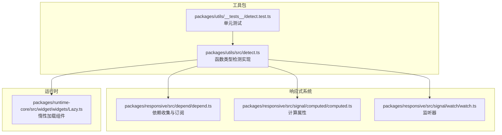
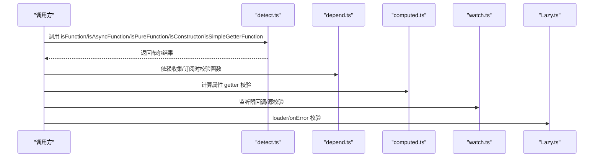
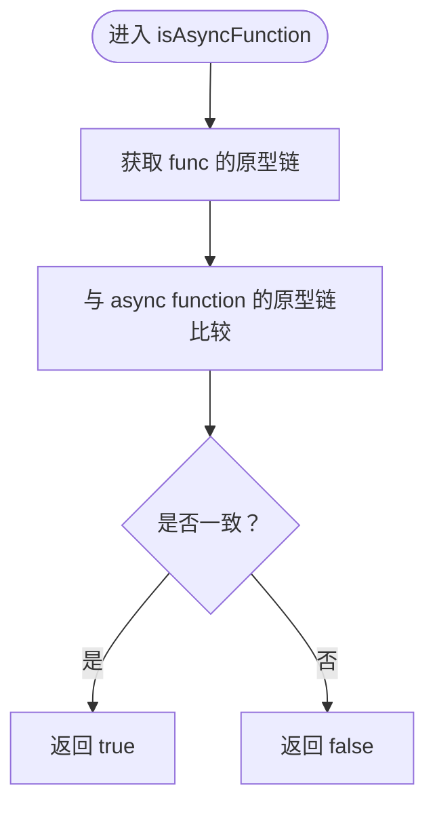
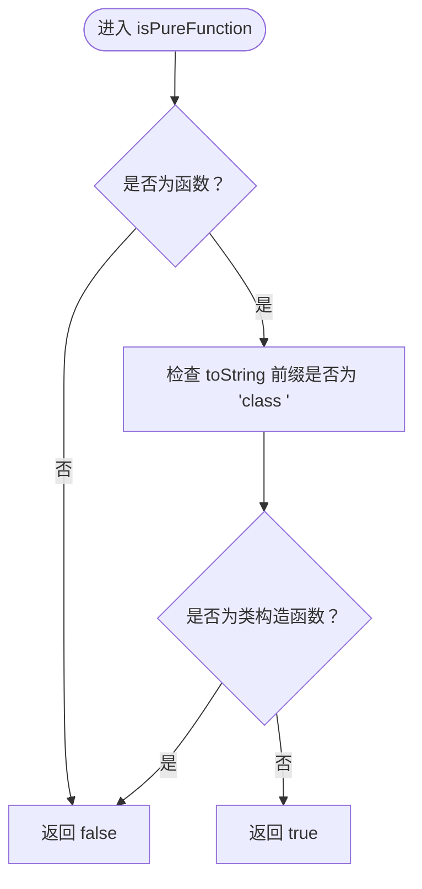
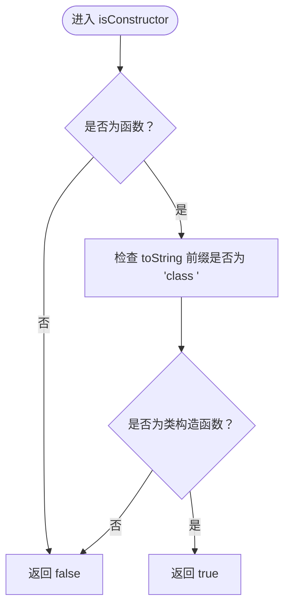
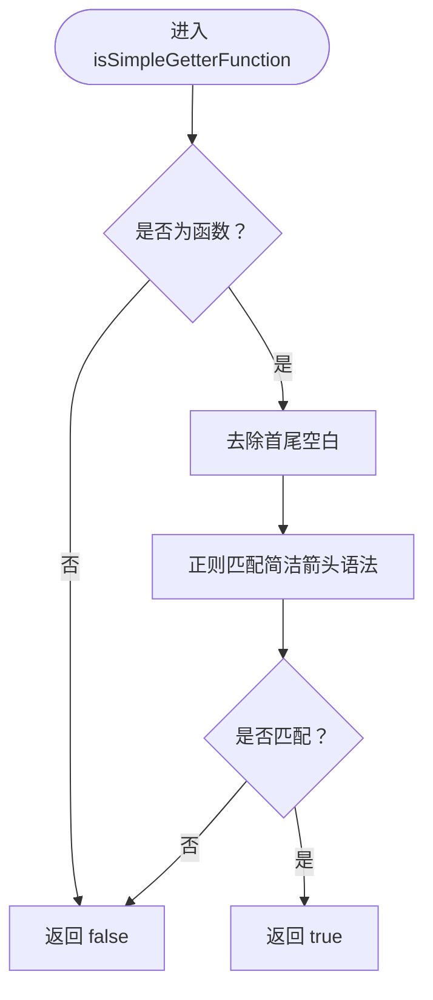
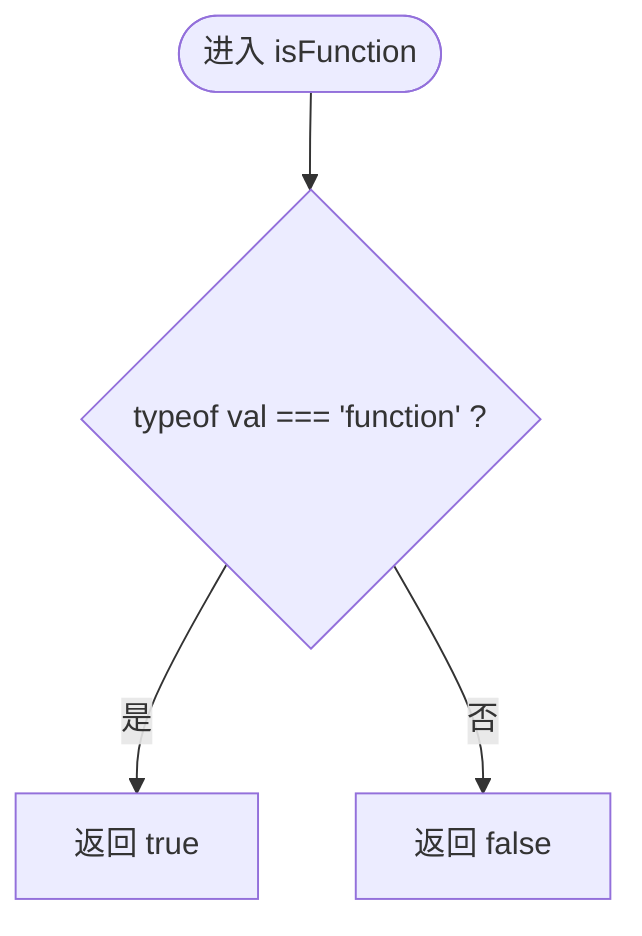
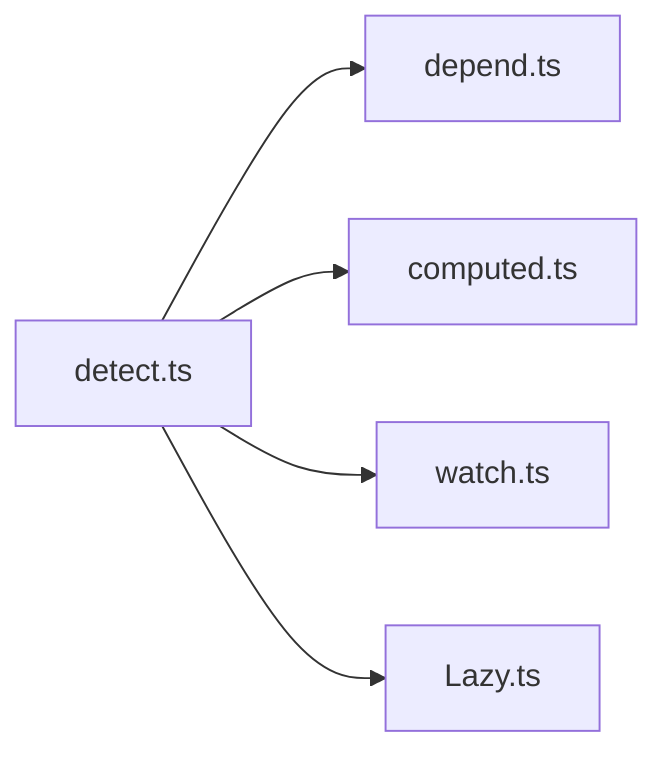

# 函数类型检测

<cite>
**本文引用的文件**
- [packages/utils/src/detect.ts](file://packages/utils/src/detect.ts)
- [packages/utils/__tests__/detect.test.ts](file://packages/utils/__tests__/detect.test.ts)
- [packages/responsive/src/depend/depend.ts](file://packages/responsive/src/depend/depend.ts)
- [packages/responsive/src/signal/computed/computed.ts](file://packages/responsive/src/signal/computed/computed.ts)
- [packages/responsive/src/signal/watch/watch.ts](file://packages/responsive/src/signal/watch/watch.ts)
- [packages/runtime-core/src/widget/widgets/Lazy.ts](file://packages/runtime-core/src/widget/widgets/Lazy.ts)
</cite>

## 目录
1. [简介](#简介)
2. [项目结构](#项目结构)
3. [核心组件](#核心组件)
4. [架构总览](#架构总览)
5. [详细组件分析](#详细组件分析)
6. [依赖分析](#依赖分析)
7. [性能考量](#性能考量)
8. [故障排查指南](#故障排查指南)
9. [结论](#结论)
10. [附录](#附录)

## 简介
本篇文档聚焦 Vitarx 工具库中针对“函数类型”的精细化判断能力，系统解析以下五类函数类型检测函数的实现原理与使用场景：
- isFunction：通用函数类型判定
- isAsyncFunction：异步函数识别（基于原型链比较）
- isPureFunction：纯函数识别（排除类构造函数）
- isConstructor：类构造函数识别（基于函数字符串前缀）
- isSimpleGetterFunction：简单 getter 函数识别（基于箭头函数简洁语法的正则）

文档将结合仓库中的实际使用点，说明这些函数在组件定义、依赖收集、计算属性与监听器中的应用，并指出常见陷阱（如 toString 被重写导致误判）。

## 项目结构
Vitarx 采用多包结构，函数类型检测能力位于工具包中，其他响应式与运行时模块广泛依赖这些检测函数进行类型约束与行为分支。

图表来源
- [packages/utils/src/detect.ts](file://packages/utils/src/detect.ts#L163-L274)
- [packages/utils/__tests__/detect.test.ts](file://packages/utils/__tests__/detect.test.ts#L1-L152)
- [packages/responsive/src/depend/depend.ts](file://packages/responsive/src/depend/depend.ts#L129-L151)
- [packages/responsive/src/signal/computed/computed.ts](file://packages/responsive/src/signal/computed/computed.ts#L242-L248)
- [packages/responsive/src/signal/watch/watch.ts](file://packages/responsive/src/signal/watch/watch.ts#L192-L242)
- [packages/runtime-core/src/widget/widgets/Lazy.ts](file://packages/runtime-core/src/widget/widgets/Lazy.ts#L124-L140)

章节来源
- [packages/utils/src/detect.ts](file://packages/utils/src/detect.ts#L163-L274)
- [packages/utils/__tests__/detect.test.ts](file://packages/utils/__tests__/detect.test.ts#L1-L152)

## 核心组件
本节概述五个函数的职责与典型用法。

- isFunction
  - 用途：判断输入是否为函数（包括普通函数、箭头函数、async 函数、生成器、类构造函数等）
  - 典型用法：在依赖收集与监听器中确保传入的是可调用对象
  - 参考路径：[packages/utils/src/detect.ts](file://packages/utils/src/detect.ts#L185-L205)

- isAsyncFunction
  - 用途：仅判断是否使用 async 关键字声明的函数，不关心返回值是否为 Promise
  - 实现要点：通过 Object.getPrototypeOf 比较原型链，精准识别 async 函数
  - 参考路径：[packages/utils/src/detect.ts](file://packages/utils/src/detect.ts#L163-L183)

- isPureFunction
  - 用途：排除类构造函数，仅保留普通函数、箭头函数、async 函数、生成器等
  - 实现要点：借助 func.toString().startsWith('class ') 排除类构造函数
  - 参考路径：[packages/utils/src/detect.ts](file://packages/utils/src/detect.ts#L207-L226)

- isConstructor
  - 用途：识别类构造函数
  - 实现要点：func.toString().startsWith('class ') 前缀匹配
  - 参考路径：[packages/utils/src/detect.ts](file://packages/utils/src/detect.ts#L228-L248)

- isSimpleGetterFunction
  - 用途：识别形如 () => 表达式 的简单 getter 函数（不支持带大括号的块级体）
  - 实现要点：正则 /^(\s*)\(\s*\)\s*=>\s*[^{]+$/ 匹配简洁箭头语法
  - 参考路径：[packages/utils/src/detect.ts](file://packages/utils/src/detect.ts#L250-L274)

章节来源
- [packages/utils/src/detect.ts](file://packages/utils/src/detect.ts#L163-L274)

## 架构总览
下图展示函数类型检测在系统中的调用关系与职责边界。

图表来源
- [packages/utils/src/detect.ts](file://packages/utils/src/detect.ts#L163-L274)
- [packages/responsive/src/depend/depend.ts](file://packages/responsive/src/depend/depend.ts#L129-L151)
- [packages/responsive/src/signal/computed/computed.ts](file://packages/responsive/src/signal/computed/computed.ts#L242-L248)
- [packages/responsive/src/signal/watch/watch.ts](file://packages/responsive/src/signal/watch/watch.ts#L192-L242)
- [packages/runtime-core/src/widget/widgets/Lazy.ts](file://packages/runtime-core/src/widget/widgets/Lazy.ts#L124-L140)

## 详细组件分析

### isAsyncFunction：基于原型链的精准识别
- 实现原理
  - 通过 Object.getPrototypeOf(func) 与 Object.getPrototypeOf(async function(){}) 的原型链对比，仅当两者原型一致时，才认定为 async 函数
  - 该方法不依赖函数签名字符串，避免了混淆（如返回 Promise 的普通函数不会被误判为 async）
- 使用场景
  - 在监听器中区分“副作用函数”与“纯返回值函数”，避免对异步副作用进行错误的懒计算策略
  - 在依赖收集与订阅流程中，为异步函数提供专门的处理分支
- 典型用例
  - 监听器内部对 source 参数进行 isAsyncFunction 判断，决定是否采用同步触发或异步处理
  - 计算属性在 getter 执行前后，根据 isAsyncFunction 的结果调整脏标记与通知策略
- 潜在陷阱
  - 严格模式下，某些 polyfill 或包装器可能改变原型链，导致误判
  - 通过 Object.setPrototypeOf 手工篡改原型链的极端情况
- 参考路径
  - [packages/utils/src/detect.ts](file://packages/utils/src/detect.ts#L163-L183)
  - [packages/utils/__tests__/detect.test.ts](file://packages/utils/__tests__/detect.test.ts#L74-L77)
  - [packages/responsive/src/signal/watch/watch.ts](file://packages/responsive/src/signal/watch/watch.ts#L216-L236)

图表来源
- [packages/utils/src/detect.ts](file://packages/utils/src/detect.ts#L163-L183)

章节来源
- [packages/utils/src/detect.ts](file://packages/utils/src/detect.ts#L163-L183)
- [packages/utils/__tests__/detect.test.ts](file://packages/utils/__tests__/detect.test.ts#L74-L77)
- [packages/responsive/src/signal/watch/watch.ts](file://packages/responsive/src/signal/watch/watch.ts#L216-L236)

### isPureFunction：排除类构造函数的纯函数识别
- 实现原理
  - 先确认 typeof val === 'function'，再通过 val.toString().startsWith('class ') 排除类构造函数
  - 该方法能识别普通函数、箭头函数、async 函数、生成器等“纯函数”
- 使用场景
  - 在组件定义或依赖收集时，确保传入的回调不是类构造函数
  - 在计算属性或监听器中，对 getter/setter 进行类型约束
- 典型用例
  - 计算属性的 getter 必须是 isPureFunction，避免将类构造函数误用为 getter
  - 监听器的回调在注册前进行 isPureFunction 校验，防止构造函数被当作副作用
- 潜在陷阱
  - toString 被重写或 polyfill 会改变字符串前缀，导致误判
  - 某些打包工具或运行时环境可能对函数字符串进行变换
- 参考路径
  - [packages/utils/src/detect.ts](file://packages/utils/src/detect.ts#L207-L226)
  - [packages/utils/__tests__/detect.test.ts](file://packages/utils/__tests__/detect.test.ts#L84-L87)
  - [packages/responsive/src/signal/computed/computed.ts](file://packages/responsive/src/signal/computed/computed.ts#L242-L248)

图表来源
- [packages/utils/src/detect.ts](file://packages/utils/src/detect.ts#L207-L226)

章节来源
- [packages/utils/src/detect.ts](file://packages/utils/src/detect.ts#L207-L226)
- [packages/utils/__tests__/detect.test.ts](file://packages/utils/__tests__/detect.test.ts#L84-L87)
- [packages/responsive/src/signal/computed/computed.ts](file://packages/responsive/src/signal/computed/computed.ts#L242-L248)

### isConstructor：类构造函数识别
- 实现原理
  - 与 isPureFunction 类似，通过 func.toString().startsWith('class ') 判断是否为类构造函数
- 使用场景
  - 在组件定义或依赖注入中，拒绝将类构造函数作为普通回调使用
  - 在运行时组件加载器中，校验模块导出的默认成员是否为可实例化的类
- 典型用例
  - 惰性加载组件的 loader 返回的模块 default 必须是 isConstructor，才能作为组件类实例化
- 潜在陷阱
  - toString 被重写或 polyfill 会改变字符串前缀
  - 某些环境对 class 声明进行转换，导致前缀不匹配
- 参考路径
  - [packages/utils/src/detect.ts](file://packages/utils/src/detect.ts#L228-L248)
  - [packages/utils/__tests__/detect.test.ts](file://packages/utils/__tests__/detect.test.ts#L89-L92)
  - [packages/runtime-core/src/widget/widgets/Lazy.ts](file://packages/runtime-core/src/widget/widgets/Lazy.ts#L172-L180)

图表来源
- [packages/utils/src/detect.ts](file://packages/utils/src/detect.ts#L228-L248)

章节来源
- [packages/utils/src/detect.ts](file://packages/utils/src/detect.ts#L228-L248)
- [packages/utils/__tests__/detect.test.ts](file://packages/utils/__tests__/detect.test.ts#L89-L92)
- [packages/runtime-core/src/widget/widgets/Lazy.ts](file://packages/runtime-core/src/widget/widgets/Lazy.ts#L172-L180)

### isSimpleGetterFunction：箭头函数简洁语法识别
- 实现原理
  - 仅接受形如 () => 表达式 的箭头函数，不接受 () => { ... } 形式的块级体
  - 通过正则 /^(\s*)\(\s*\)\s*=>\s*[^{]+$/ 匹配简洁语法，排除大括号
- 使用场景
  - 在计算属性或依赖收集中，要求 getter 为“简单 getter”，避免复杂逻辑影响性能与可读性
  - 在监听器中，对简单返回值的 getter 进行约束，减少副作用风险
- 典型用例
  - 计算属性的 getter 为 isSimpleGetterFunction 时，可启用更严格的缓存与通知策略
- 潜在陷阱
  - 正则对空白字符敏感，若源码格式化导致空格/换行异常，可能误判
  - 与 isPureFunction 组合使用，可进一步排除类构造函数
- 参考路径
  - [packages/utils/src/detect.ts](file://packages/utils/src/detect.ts#L250-L274)
  - [packages/utils/__tests__/detect.test.ts](file://packages/utils/__tests__/detect.test.ts#L94-L101)

图表来源
- [packages/utils/src/detect.ts](file://packages/utils/src/detect.ts#L250-L274)

章节来源
- [packages/utils/src/detect.ts](file://packages/utils/src/detect.ts#L250-L274)
- [packages/utils/__tests__/detect.test.ts](file://packages/utils/__tests__/detect.test.ts#L94-L101)

### isFunction：通用函数类型判定
- 实现原理
  - 基于 typeof val === 'function' 的基础判断，覆盖普通函数、箭头函数、async 函数、生成器、类构造函数等
- 使用场景
  - 在依赖收集、监听器、惰性加载组件等处，统一校验“可调用对象”
- 典型用例
  - 依赖收集 subscribe 的 tracker 参数必须是 isFunction
  - 监听器 watch 的 callback 参数必须是 isFunction
  - 惰性加载组件的 onError 参数必须是 isFunction
- 参考路径
  - [packages/utils/src/detect.ts](file://packages/utils/src/detect.ts#L185-L205)
  - [packages/responsive/src/depend/depend.ts](file://packages/responsive/src/depend/depend.ts#L129-L151)
  - [packages/responsive/src/signal/watch/watch.ts](file://packages/responsive/src/signal/watch/watch.ts#L192-L242)
  - [packages/runtime-core/src/widget/widgets/Lazy.ts](file://packages/runtime-core/src/widget/widgets/Lazy.ts#L124-L140)

图表来源
- [packages/utils/src/detect.ts](file://packages/utils/src/detect.ts#L185-L205)

章节来源
- [packages/utils/src/detect.ts](file://packages/utils/src/detect.ts#L185-L205)
- [packages/responsive/src/depend/depend.ts](file://packages/responsive/src/depend/depend.ts#L129-L151)
- [packages/responsive/src/signal/watch/watch.ts](file://packages/responsive/src/signal/watch/watch.ts#L192-L242)
- [packages/runtime-core/src/widget/widgets/Lazy.ts](file://packages/runtime-core/src/widget/widgets/Lazy.ts#L124-L140)

## 依赖分析
- 模块耦合
  - detect.ts 作为纯工具模块，被响应式系统的 depend/computed/watch 与运行时的 Lazy 组件广泛依赖
  - 依赖关系清晰，无循环依赖
- 直接/间接依赖
  - direct：depend.ts、computed.ts、watch.ts、Lazy.ts
  - indirect：通过 @vitarx/utils 的统一入口导入 detect.ts
- 外部依赖
  - 无外部依赖，纯 JavaScript/TypeScript 实现

图表来源
- [packages/utils/src/detect.ts](file://packages/utils/src/detect.ts#L163-L274)
- [packages/responsive/src/depend/depend.ts](file://packages/responsive/src/depend/depend.ts#L129-L151)
- [packages/responsive/src/signal/computed/computed.ts](file://packages/responsive/src/signal/computed/computed.ts#L242-L248)
- [packages/responsive/src/signal/watch/watch.ts](file://packages/responsive/src/signal/watch/watch.ts#L192-L242)
- [packages/runtime-core/src/widget/widgets/Lazy.ts](file://packages/runtime-core/src/widget/widgets/Lazy.ts#L124-L140)

章节来源
- [packages/utils/src/detect.ts](file://packages/utils/src/detect.ts#L163-L274)
- [packages/responsive/src/depend/depend.ts](file://packages/responsive/src/depend/depend.ts#L129-L151)
- [packages/responsive/src/signal/computed/computed.ts](file://packages/responsive/src/signal/computed/computed.ts#L242-L248)
- [packages/responsive/src/signal/watch/watch.ts](file://packages/responsive/src/signal/watch/watch.ts#L192-L242)
- [packages/runtime-core/src/widget/widgets/Lazy.ts](file://packages/runtime-core/src/widget/widgets/Lazy.ts#L124-L140)

## 性能考量
- toString 前缀判断
  - isPureFunction 与 isConstructor 依赖 func.toString()，在高频调用场景下会产生字符串开销
  - 建议在热路径中缓存结果，或仅在初始化阶段进行一次性校验
- 原型链比较
  - isAsyncFunction 通过 Object.getPrototypeOf 比较原型链，成本较低，适合频繁调用
- 正则匹配
  - isSimpleGetterFunction 的正则匹配开销较小，但需注意源码格式化带来的额外 trim 操作
- 建议
  - 在批量校验场景中，优先使用 isAsyncFunction 与 isFunction 进行快速过滤
  - 对于需要排除类构造函数的场景，isPureFunction 更合适
  - 对于简单 getter 的严格约束，isSimpleGetterFunction 与 isPureFunction 组合使用

[本节为通用建议，不直接分析具体文件]

## 故障排查指南
- toString 被重写导致误判
  - 症状：isPureFunction/isConstructor 返回值与预期不符
  - 排查：检查是否存在 polyfill、装饰器或运行时包装器重写了函数的 toString
  - 处理：在关键路径增加兜底校验（如结合 typeof 与原型链）
- 原型链被篡改
  - 症状：isAsyncFunction 误判或漏判
  - 排查：确认 Object.getPrototypeOf 的返回值是否被修改
  - 处理：在不受信任环境中，考虑引入更稳健的类型检测策略
- 正则误判简洁 getter
  - 症状：isSimpleGetterFunction 对格式化后的源码误判
  - 排查：检查源码中是否包含大括号或换行
  - 处理：在调用前确保源码格式化一致，或在上层做预处理
- 使用场景中的类型错误
  - 依赖收集 subscribe/tracker 非函数：抛出 TypeError
  - 监听器 watch/callback 非函数：抛出 TypeError
  - 惰性加载组件 onError 非函数：抛出 TypeError
  - 参考路径：
    - [packages/responsive/src/depend/depend.ts](file://packages/responsive/src/depend/depend.ts#L129-L151)
    - [packages/responsive/src/signal/watch/watch.ts](file://packages/responsive/src/signal/watch/watch.ts#L192-L242)
    - [packages/runtime-core/src/widget/widgets/Lazy.ts](file://packages/runtime-core/src/widget/widgets/Lazy.ts#L124-L140)

章节来源
- [packages/responsive/src/depend/depend.ts](file://packages/responsive/src/depend/depend.ts#L129-L151)
- [packages/responsive/src/signal/watch/watch.ts](file://packages/responsive/src/signal/watch/watch.ts#L192-L242)
- [packages/runtime-core/src/widget/widgets/Lazy.ts](file://packages/runtime-core/src/widget/widgets/Lazy.ts#L124-L140)

## 结论
Vitarx 的函数类型检测体系通过 isFunction 作为通用入口，结合 isAsyncFunction、isPureFunction、isConstructor、isSimpleGetterFunction 的差异化实现，实现了对函数类型的精细化控制。这些函数在依赖收集、计算属性、监听器与惰性加载组件等关键路径中发挥重要作用。实践中应关注 toString 被重写、原型链被篡改与正则误判等潜在陷阱，并在热路径中采取必要的性能优化与兜底策略。

[本节为总结，不直接分析具体文件]

## 附录
- 单元测试参考
  - [packages/utils/__tests__/detect.test.ts](file://packages/utils/__tests__/detect.test.ts#L74-L101)
- 关键实现参考
  - [packages/utils/src/detect.ts](file://packages/utils/src/detect.ts#L163-L274)