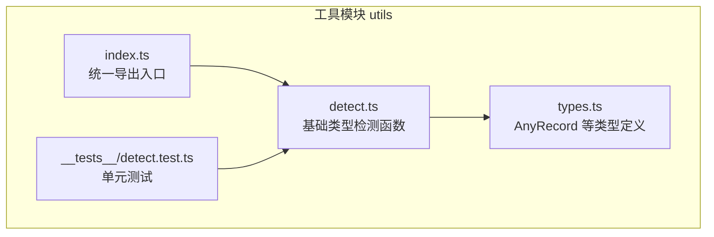
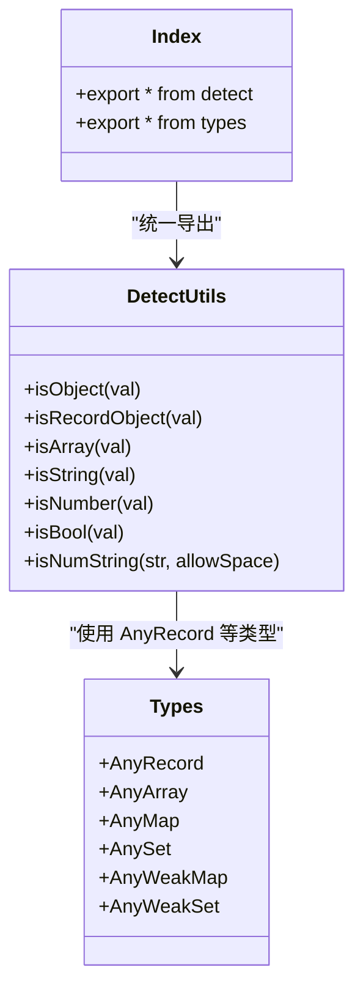
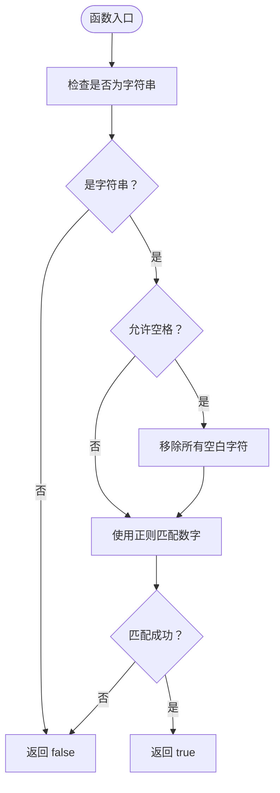
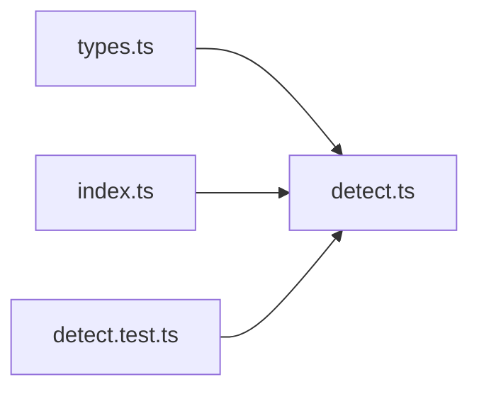

# 基础类型检测

<cite>
**本文引用的文件**
- [packages/utils/src/detect.ts](file://packages/utils/src/detect.ts)
- [packages/utils/src/types.ts](file://packages/utils/src/types.ts)
- [packages/utils/src/index.ts](file://packages/utils/src/index.ts)
- [packages/utils/__tests__/detect.test.ts](file://packages/utils/__tests__/detect.test.ts)
</cite>

## 目录
1. [简介](#简介)
2. [项目结构](#项目结构)
3. [核心组件](#核心组件)
4. [架构总览](#架构总览)
5. [详细组件分析](#详细组件分析)
6. [依赖分析](#依赖分析)
7. [性能考虑](#性能考虑)
8. [故障排查指南](#故障排查指南)
9. [结论](#结论)
10. [附录](#附录)

## 简介
本篇文档聚焦于 Vitarx 工具库中的基础类型检测工具函数，涵盖 isObject、isRecordObject、isArray、isString、isNumber、isBool 与 isNumString。我们将逐一解释每个函数的精确语义、边界情况处理（如 null、NaN、空字符串等），并结合源码说明其实现机制。同时给出实际使用建议与常见误用场景警示，帮助你在框架内部或用户代码中进行类型安全检查。

## 项目结构
- 工具函数位于 packages/utils/src/detect.ts，导出统一入口在 packages/utils/src/index.ts。
- 类型定义位于 packages/utils/src/types.ts，其中 AnyRecord 用于 isRecordObject 的类型约束。
- 测试用例位于 packages/utils/__tests__/detect.test.ts，覆盖了主要类型检测函数的行为。

图表来源
- [packages/utils/src/index.ts](file://packages/utils/src/index.ts#L1-L7)
- [packages/utils/src/detect.ts](file://packages/utils/src/detect.ts#L1-L300)
- [packages/utils/src/types.ts](file://packages/utils/src/types.ts#L1-L336)
- [packages/utils/__tests__/detect.test.ts](file://packages/utils/__tests__/detect.test.ts#L1-L152)

章节来源
- [packages/utils/src/index.ts](file://packages/utils/src/index.ts#L1-L7)
- [packages/utils/src/detect.ts](file://packages/utils/src/detect.ts#L1-L300)
- [packages/utils/src/types.ts](file://packages/utils/src/types.ts#L1-L336)
- [packages/utils/__tests__/detect.test.ts](file://packages/utils/__tests__/detect.test.ts#L1-L152)

## 核心组件
- isObject：判断变量是否为对象类型（排除 null）。
- isRecordObject：判断变量是否为“键值对记录对象”，排除数组，但 Map/Set 等集合也被视为记录对象。
- isArray：判断变量是否为数组。
- isString：判断变量是否为字符串。
- isNumber：判断变量是否为 number（注意 NaN 也视为 number）。
- isBool：判断变量是否为布尔值。
- isNumString：判断字符串是否为“纯数字字符串”，支持可选的空格过滤。

章节来源
- [packages/utils/src/detect.ts](file://packages/utils/src/detect.ts#L1-L300)

## 架构总览
以下类图展示了基础类型检测函数与其类型依赖的关系，以及导出入口的组织方式。

图表来源
- [packages/utils/src/detect.ts](file://packages/utils/src/detect.ts#L1-L300)
- [packages/utils/src/types.ts](file://packages/utils/src/types.ts#L1-L336)
- [packages/utils/src/index.ts](file://packages/utils/src/index.ts#L1-L7)

## 详细组件分析

### isObject
- 精确语义：当 typeof val === 'object' 且 val !== null 时返回 true。
- 边界情况：
  - null 返回 false（与多数语言直觉一致）。
  - 数组在 JS 中也是对象，因此返回 true。
  - 其他原始类型（如 number、string、boolean）返回 false。
- 实现要点：使用严格相等判断 null，避免将 null 视为对象。
- 使用建议：当你需要“对象且非 null”的语义时优先使用 isObject；若需排除数组，请改用 isRecordObject 或自定义组合判断。

章节来源
- [packages/utils/src/detect.ts](file://packages/utils/src/detect.ts#L1-L21)

### isRecordObject
- 精确语义：排除数组，其余对象（包括普通对象、Map、Set 等集合）均被视为“键值对记录对象”。
- 与 isObject 的区别：
  - isObject：只要 typeof === 'object' 且非 null 即为真，数组也返回 true。
  - isRecordObject：排除数组，Map/Set 等集合也被认为是记录对象。
- 边界情况：
  - null 返回 false。
  - 普通对象 {} 返回 true。
  - 数组 [] 返回 false。
  - Map/Set 等集合返回 true。
- 实现要点：先排除 null，再判断 typeof === 'object'，最后排除 Array.isArray。
- 使用建议：当你需要“可迭代键值对”的对象语义（如遍历键、作为字典使用）时，优先使用 isRecordObject。

章节来源
- [packages/utils/src/detect.ts](file://packages/utils/src/detect.ts#L23-L42)
- [packages/utils/src/types.ts](file://packages/utils/src/types.ts#L1-L336)

### isArray
- 精确语义：使用 Array.isArray 判断。
- 边界情况：null、undefined、普通对象、字符串等均返回 false。
- 实现要点：标准数组检测，性能稳定。
- 使用建议：需要严格区分数组与其他对象时使用。

章节来源
- [packages/utils/src/detect.ts](file://packages/utils/src/detect.ts#L44-L61)

### isString
- 精确语义：typeof val === 'string'。
- 边界情况：空字符串 "" 返回 true；数字、布尔值、null、undefined 等返回 false。
- 实现要点：严格基于 typeof。
- 使用建议：字符串字面量与 String 构造的值均可识别为字符串。

章节来源
- [packages/utils/src/detect.ts](file://packages/utils/src/detect.ts#L63-L80)

### isNumber
- 精确语义：typeof val === 'number'。
- 关键边界：NaN 属于 number 类型，因此 isNumber(NaN) 返回 true。
- 边界情况：Infinity、-Infinity、0、负数、小数等均返回 true。
- 实现要点：基于 typeof，不进行数值有效性校验。
- 使用建议：若需排除 NaN，请额外使用 Number.isNaN 或自定义判断。

章节来源
- [packages/utils/src/detect.ts](file://packages/utils/src/detect.ts#L82-L100)

### isBool
- 精确语义：typeof val === 'boolean'。
- 边界情况：布尔字面量 true/false 返回 true；其他类型（包括 0、1、字符串等）返回 false。
- 实现要点：严格基于 typeof。
- 使用建议：用于严格布尔类型检查。

章节来源
- [packages/utils/src/detect.ts](file://packages/utils/src/detect.ts#L102-L120)

### isNumString
- 精确语义：判断字符串是否为“纯数字字符串”。默认不允许空格；当 allowSpace 为 true 时，会先去除所有空白字符再判断。
- 正则逻辑：
  - 默认：使用 /^\d+$/ 匹配一个或多个数字字符。
  - 允许空格：先将字符串中的空白字符全部移除，再进行匹配。
- 边界情况：
  - 非字符串类型（包括 null、undefined、数字、布尔值等）一律返回 false。
  - 空字符串 "" 返回 false。
  - 包含小数点、负号、字母等字符的字符串返回 false。
  - 允许空格时，" 123 " 返回 true（allowSpace=true）。
- 常见误用场景：
  - 将非字符串传入 isNumString，会直接返回 false，这是预期行为，不应误以为是错误。
  - 误以为 isNumString("123.45") 会返回 true，实际上小数点会导致失败。
  - 误以为 isNumString("-123") 会返回 true，实际上负号会导致失败。
- 使用建议：
  - 若输入可能包含空白字符，显式传入 allowSpace=true。
  - 若需要更严格的数值校验（如小数、负数），请使用 parseFloat/parseInt 或正则扩展。

图表来源
- [packages/utils/src/detect.ts](file://packages/utils/src/detect.ts#L276-L300)

章节来源
- [packages/utils/src/detect.ts](file://packages/utils/src/detect.ts#L276-L300)

## 依赖分析
- detect.ts 依赖 types.ts 中的 AnyRecord 类型，用于 isRecordObject 的类型标注。
- index.ts 统一导出 detect.js 与 types，便于外部按需导入。
- 测试文件 detect.test.ts 覆盖了上述函数的行为，包括边界情况与典型用例。

图表来源
- [packages/utils/src/types.ts](file://packages/utils/src/types.ts#L1-L336)
- [packages/utils/src/detect.ts](file://packages/utils/src/detect.ts#L1-L300)
- [packages/utils/src/index.ts](file://packages/utils/src/index.ts#L1-L7)
- [packages/utils/__tests__/detect.test.ts](file://packages/utils/__tests__/detect.test.ts#L1-L152)

章节来源
- [packages/utils/src/types.ts](file://packages/utils/src/types.ts#L1-L336)
- [packages/utils/src/detect.ts](file://packages/utils/src/detect.ts#L1-L300)
- [packages/utils/src/index.ts](file://packages/utils/src/index.ts#L1-L7)
- [packages/utils/__tests__/detect.test.ts](file://packages/utils/__tests__/detect.test.ts#L1-L152)

## 性能考虑
- 所有基础类型检测均为 O(1) 操作，开销极低。
- isNumString 在 allowSpace=true 时会进行一次字符串替换，复杂度仍为 O(n)，n 为字符串长度。
- 建议在高频路径中避免重复判断，必要时缓存结果或提前进行类型预判。

## 故障排查指南
- isNumber(NaN) 返回 true 是预期行为，因为 NaN 的类型为 number。若需排除 NaN，请使用 Number.isNaN 或自定义判断。
- isNumString 对非字符串类型直接返回 false，这是设计使然。若出现意外 false，检查输入是否为字符串类型。
- isRecordObject 与 isObject 的差异：
  - 若你希望排除数组并接受 Map/Set 等集合，请使用 isRecordObject。
  - 若你需要“所有对象（包括数组）”的判断，请使用 isObject。
- 测试参考：可对照 packages/utils/__tests__/detect.test.ts 中的断言，验证各函数在边界情况下的行为。

章节来源
- [packages/utils/__tests__/detect.test.ts](file://packages/utils/__tests__/detect.test.ts#L1-L152)

## 结论
Vitarx 的基础类型检测工具提供了清晰、稳定的类型判断能力。isRecordObject 与 isObject 的语义差异明确，isNumString 的空格处理逻辑可按需开启。通过合理选择与组合这些函数，可以在框架内部与用户代码中实现可靠的类型安全检查。

## 附录
- 导出入口：通过 packages/utils/src/index.ts 统一导出 detect 与 types，便于按需导入。
- 测试用例：参考 packages/utils/__tests__/detect.test.ts，验证各函数在典型与边界场景的行为。

章节来源
- [packages/utils/src/index.ts](file://packages/utils/src/index.ts#L1-L7)
- [packages/utils/__tests__/detect.test.ts](file://packages/utils/__tests__/detect.test.ts#L1-L152)