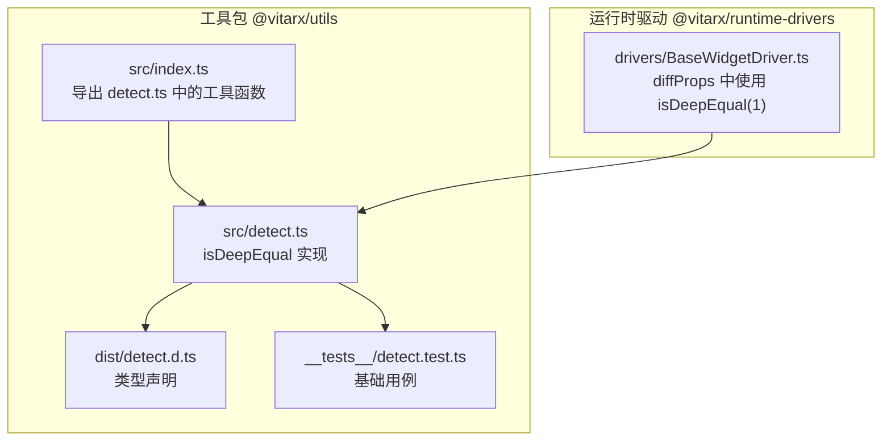
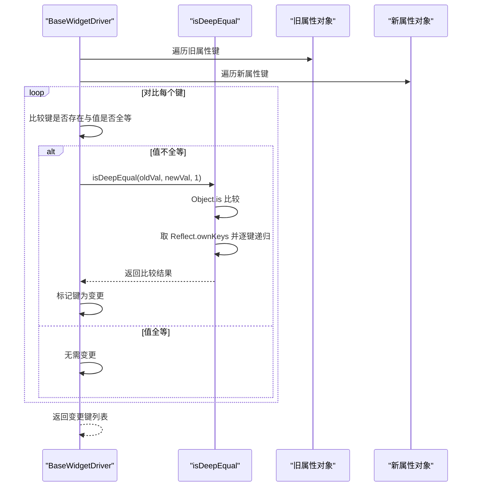
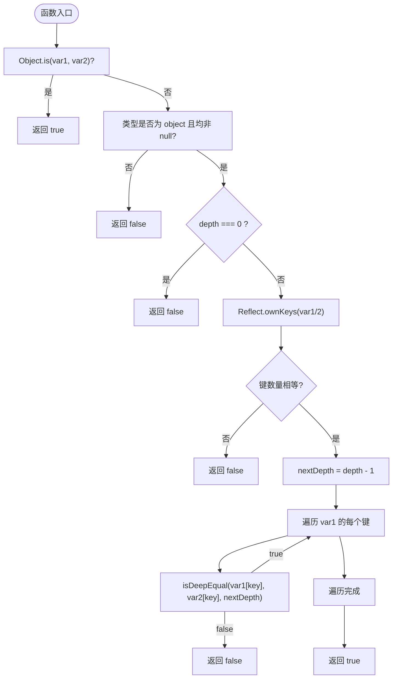
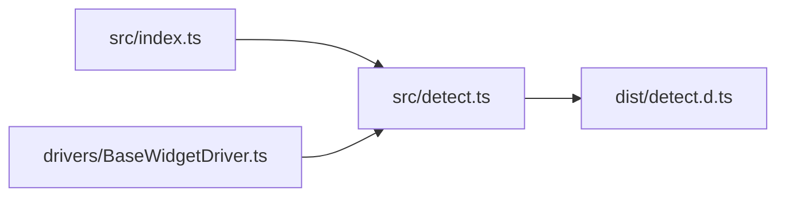

# 深度比较

<cite>
**本文引用的文件列表**
- [packages/utils/src/detect.ts](file://packages/utils/src/detect.ts)
- [packages/utils/src/index.ts](file://packages/utils/src/index.ts)
- [packages/utils/dist/detect.d.ts](file://packages/utils/dist/detect.d.ts)
- [packages/utils/__tests__/detect.test.ts](file://packages/utils/__tests__/detect.test.ts)
- [packages/runtime-drivers/src/drivers/BaseWidgetDriver.ts](file://packages/runtime-drivers/src/drivers/BaseWidgetDriver.ts)
</cite>

## 目录
1. [简介](#简介)
2. [项目结构](#项目结构)
3. [核心组件](#核心组件)
4. [架构总览](#架构总览)
5. [详细组件分析](#详细组件分析)
6. [依赖关系分析](#依赖关系分析)
7. [性能考量](#性能考量)
8. [故障排查指南](#故障排查指南)
9. [结论](#结论)
10. [附录](#附录)

## 简介
本篇文档围绕 isDeepEqual 函数展开，系统解析其深度比较算法的设计与实现要点，包括：
- 如何结合 Object.is 实现严格相等性判断（涵盖 NaN === NaN 与 0 !== -0 的语义）
- 递归遍历对象属性与数组元素的策略
- depth 参数的作用机制与性能影响
- 对循环引用的隐式处理方式（基于引用比较短路）
- 使用 Reflect.ownKeys 收集所有自有属性（含 symbol 键）的完整性保障
- 复杂结构（嵌套对象、日期对象、集合类型）的比较行为示例
- 高频更新场景下的性能优化建议

## 项目结构
isDeepEqual 位于工具包 @vitarx/utils 的类型检测模块中，作为公共 API 导出，供运行时驱动层复用。

图表来源
- [packages/utils/src/index.ts](file://packages/utils/src/index.ts#L1-L8)
- [packages/utils/src/detect.ts](file://packages/utils/src/detect.ts#L439-L518)
- [packages/utils/dist/detect.d.ts](file://packages/utils/dist/detect.d.ts#L352-L395)
- [packages/utils/__tests__/detect.test.ts](file://packages/utils/__tests__/detect.test.ts#L136-L141)
- [packages/runtime-drivers/src/drivers/BaseWidgetDriver.ts](file://packages/runtime-drivers/src/drivers/BaseWidgetDriver.ts#L105-L126)

章节来源
- [packages/utils/src/index.ts](file://packages/utils/src/index.ts#L1-L8)
- [packages/utils/src/detect.ts](file://packages/utils/src/detect.ts#L439-L518)
- [packages/utils/dist/detect.d.ts](file://packages/utils/dist/detect.d.ts#L352-L395)
- [packages/utils/__tests__/detect.test.ts](file://packages/utils/__tests__/detect.test.ts#L136-L141)
- [packages/runtime-drivers/src/drivers/BaseWidgetDriver.ts](file://packages/runtime-drivers/src/drivers/BaseWidgetDriver.ts#L105-L126)

## 核心组件
- isDeepEqual(var1, var2, depth = Infinity): boolean
  - 严格相等性：优先使用 Object.is(var1, var2) 判断
  - 类型与空值：若任一为 null 或类型不一致，直接返回 false
  - 深度控制：depth === 0 时只比较引用（返回 false）
  - 属性收集：使用 Reflect.ownKeys 获取所有自有键（含 symbol）
  - 递归比较：对每个键的值进行 isDeepEqual(value1, value2, depth-1)
  - 返回：全部键值一致则返回 true

章节来源
- [packages/utils/src/detect.ts](file://packages/utils/src/detect.ts#L483-L518)

## 架构总览
isDeepEqual 作为通用工具函数，被运行时驱动层在 diffProps 中以“浅层深度”（depth=1）的方式调用，用于快速判断属性是否发生变更，从而减少不必要的重渲染。

图表来源
- [packages/runtime-drivers/src/drivers/BaseWidgetDriver.ts](file://packages/runtime-drivers/src/drivers/BaseWidgetDriver.ts#L105-L126)
- [packages/utils/src/detect.ts](file://packages/utils/src/detect.ts#L483-L518)

## 详细组件分析

### isDeepEqual 算法流程
- 输入：var1, var2, depth
- 输出：boolean
- 流程要点：
  - 使用 Object.is 进行严格相等性判断（支持 NaN === NaN，但 0 !== -0）
  - 若类型不为 object 或存在 null，直接返回 false
  - depth === 0 时只比较引用，返回 false
  - 使用 Reflect.ownKeys 收集键集合，保证 symbol 键也被纳入
  - 键数量不同直接返回 false
  - 逐键取出值并递归比较，使用 nextDepth = depth - 1
  - 任一键值不一致即返回 false
  - 全部一致返回 true

图表来源
- [packages/utils/src/detect.ts](file://packages/utils/src/detect.ts#L483-L518)

章节来源
- [packages/utils/src/detect.ts](file://packages/utils/src/detect.ts#L483-L518)

### 严格相等性与特殊值语义
- NaN === NaN：返回 true
- 0 !== -0：返回 false
- 这些语义由 Object.is 保证，isDeepEqual 在首判阶段即命中，避免后续开销

章节来源
- [packages/utils/src/detect.ts](file://packages/utils/src/detect.ts#L483-L489)

### 递归遍历与键收集
- 使用 Reflect.ownKeys 收集所有自有键（包括 symbol），确保键的完整性
- 通过 Object.hasOwn 检查 var2 是否拥有对应键，避免原型链污染
- 逐键取出值后递归比较，使用 nextDepth 控制深度

章节来源
- [packages/utils/src/detect.ts](file://packages/utils/src/detect.ts#L495-L515)

### depth 参数的作用机制
- depth 默认 Infinity，表示无限深度
- depth === 0：只比较引用（已处理过严格相等，此处返回 false）
- 每进入下一层，nextDepth = depth - 1，当 depth 降至 0 时，仅比较引用
- 运行时驱动层在 diffProps 中传入 depth=1，用于“浅层深度”的快速比较

章节来源
- [packages/utils/src/detect.ts](file://packages/utils/src/detect.ts#L483-L502)
- [packages/runtime-drivers/src/drivers/BaseWidgetDriver.ts](file://packages/runtime-drivers/src/drivers/BaseWidgetDriver.ts#L118-L121)

### 循环引用的隐式处理
- 算法通过 Object.is 首判严格相等，若两个引用指向同一对象，将直接返回 true
- 当递归比较到同一对象时，同样会因 Object.is 成立而短路，避免无限递归
- 因此，循环引用在当前实现中得到隐式处理，无需额外的 visited 集合

章节来源
- [packages/utils/src/detect.ts](file://packages/utils/src/detect.ts#L483-L489)

### 复杂结构比较行为示例
- 嵌套对象：按键逐层递归比较
- 日期对象：严格相等性由 Object.is 判断，若为同一实例则 true，否则 false
- 集合类型：Map/Set/WeakMap/WeakSet 由 Object.is 判断引用相等性；若需比较内容，请在上层业务中自行处理或扩展

章节来源
- [packages/utils/src/detect.ts](file://packages/utils/src/detect.ts#L483-L518)
- [packages/utils/dist/detect.d.ts](file://packages/utils/dist/detect.d.ts#L352-L395)

## 依赖关系分析
- 导出关系：src/index.ts 统一导出 detect.ts 中的工具函数
- 类型声明：dist/detect.d.ts 提供 isDeepEqual 的类型签名
- 使用关系：runtime-drivers 的 BaseWidgetDriver 在 diffProps 中调用 isDeepEqual(1)，以降低比较成本

图表来源
- [packages/utils/src/index.ts](file://packages/utils/src/index.ts#L1-L8)
- [packages/utils/src/detect.ts](file://packages/utils/src/detect.ts#L439-L518)
- [packages/utils/dist/detect.d.ts](file://packages/utils/dist/detect.d.ts#L352-L395)
- [packages/runtime-drivers/src/drivers/BaseWidgetDriver.ts](file://packages/runtime-drivers/src/drivers/BaseWidgetDriver.ts#L105-L126)

章节来源
- [packages/utils/src/index.ts](file://packages/utils/src/index.ts#L1-L8)
- [packages/utils/src/detect.ts](file://packages/utils/src/detect.ts#L439-L518)
- [packages/utils/dist/detect.d.ts](file://packages/utils/dist/detect.d.ts#L352-L395)
- [packages/runtime-drivers/src/drivers/BaseWidgetDriver.ts](file://packages/runtime-drivers/src/drivers/BaseWidgetDriver.ts#L105-L126)

## 性能考量
- 严格相等性首判：Object.is 可快速命中相同引用或特殊值，避免后续遍历
- 键数量预判：先比较键数量，不一致可提前返回
- 深度控制：合理设置 depth 可显著降低比较成本；在高频更新场景中建议使用有限深度（如 1）
- 避免无限深度：对深层嵌套或大型对象，谨慎使用 Infinity，防止 CPU 占用过高
- 集合类型：Map/Set 等集合的比较依赖引用相等性；若需内容比较，可在上层业务中自定义策略

章节来源
- [packages/utils/src/detect.ts](file://packages/utils/src/detect.ts#L483-L518)
- [packages/runtime-drivers/src/drivers/BaseWidgetDriver.ts](file://packages/runtime-drivers/src/drivers/BaseWidgetDriver.ts#L118-L121)

## 故障排查指南
- 比较结果与预期不符
  - 检查是否传入了正确的 depth；在高频更新场景中优先使用有限深度
  - 确认对象是否为同一引用；若是，Object.is 会直接返回 true
  - 注意 symbol 键是否被正确比较；isDeepEqual 已使用 Reflect.ownKeys 收集
- 性能问题
  - 大型对象或深层嵌套导致比较耗时，考虑降低 depth 或拆分比较范围
  - 集合类型请在上层业务中自行处理内容比较
- 测试验证
  - 可参考基础用例，验证对象、数组、基本类型的比较行为

章节来源
- [packages/utils/__tests__/detect.test.ts](file://packages/utils/__tests__/detect.test.ts#L136-L141)
- [packages/utils/src/detect.ts](file://packages/utils/src/detect.ts#L483-L518)

## 结论
isDeepEqual 通过 Object.is 的严格相等性首判、Reflect.ownKeys 的完整键收集、以及 depth 参数的深度控制，构建了一个简洁高效的深度比较工具。其在运行时驱动层以有限深度（如 1）使用，平衡了准确性与性能。对于集合类型与深层复杂结构，建议在上层业务中配合自定义策略使用，以满足更严格的比较需求。

## 附录
- 使用示例路径
  - 基础对象与数组比较：[packages/utils/__tests__/detect.test.ts](file://packages/utils/__tests__/detect.test.ts#L136-L141)
  - 类型声明参考：[packages/utils/dist/detect.d.ts](file://packages/utils/dist/detect.d.ts#L352-L395)
- 实际使用位置
  - 运行时驱动层的 diffProps：[packages/runtime-drivers/src/drivers/BaseWidgetDriver.ts](file://packages/runtime-drivers/src/drivers/BaseWidgetDriver.ts#L105-L126)