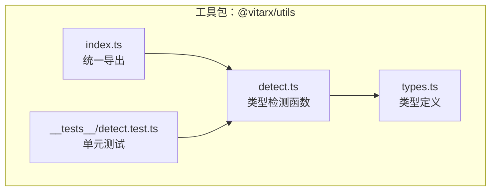
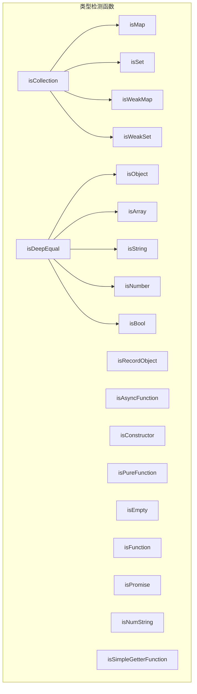
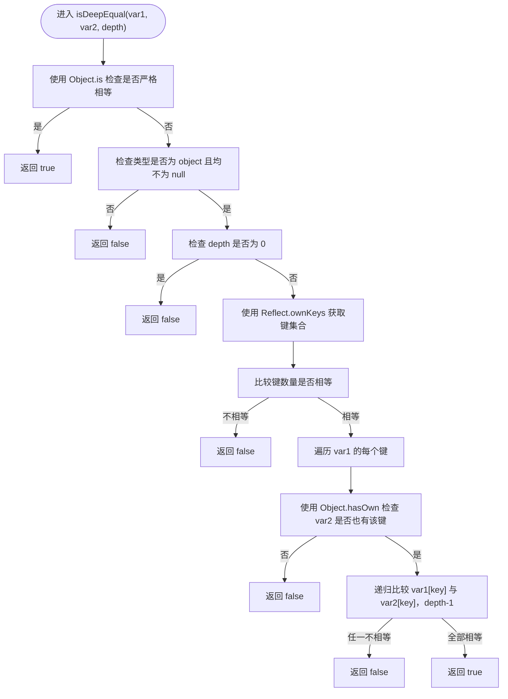
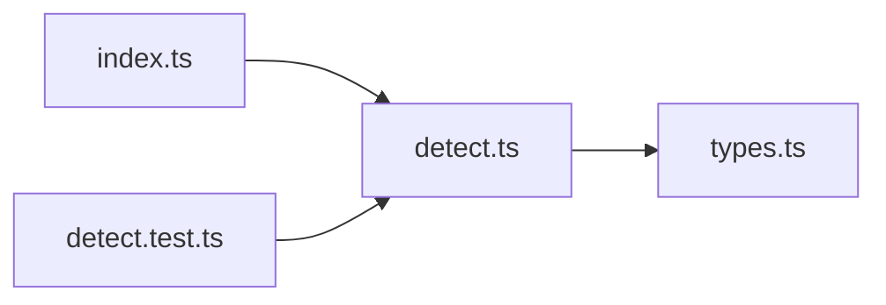

# 类型检测

<cite>
**本文引用的文件列表**
- [packages/utils/src/detect.ts](file://packages/utils/src/detect.ts)
- [packages/utils/src/types.ts](file://packages/utils/src/types.ts)
- [packages/utils/src/index.ts](file://packages/utils/src/index.ts)
- [packages/utils/__tests__/detect.test.ts](file://packages/utils/__tests__/detect.test.ts)
- [packages/utils/README.md](file://packages/utils/README.md)
</cite>

## 目录
1. [简介](#简介)
2. [项目结构](#项目结构)
3. [核心组件](#核心组件)
4. [架构总览](#架构总览)
5. [详细组件分析](#详细组件分析)
6. [依赖关系分析](#依赖关系分析)
7. [性能考量](#性能考量)
8. [故障排查指南](#故障排查指南)
9. [结论](#结论)
10. [附录](#附录)

## 简介
本章节系统梳理 Vitarx 工具库中“类型检测”函数集，覆盖基础类型判断（isObject、isRecordObject、isArray、isString、isNumber、isBool）、集合类型统一识别（isCollection）、深度比较（isDeepEqual）以及函数类型判断（isAsyncFunction、isConstructor、isPureFunction）。文档将逐一说明各函数的参数、返回值、行为语义、边界条件（如 null、NaN、-0、循环引用等），并提供常见误用场景与最佳实践建议。

## 项目结构
- 类型检测函数集中于 packages/utils/src/detect.ts，导出后由 packages/utils/src/index.ts 统一再导出。
- 类型定义集中在 packages/utils/src/types.ts，为 detect.ts 中的类型守卫与集合类型提供基础类型支持。
- 单元测试位于 packages/utils/__tests__/detect.test.ts，验证各函数的行为与边界。

图表来源
- [packages/utils/src/index.ts](file://packages/utils/src/index.ts#L1-L8)
- [packages/utils/src/detect.ts](file://packages/utils/src/detect.ts#L1-L540)
- [packages/utils/src/types.ts](file://packages/utils/src/types.ts#L1-L336)
- [packages/utils/__tests__/detect.test.ts](file://packages/utils/__tests__/detect.test.ts#L1-L152)

章节来源
- [packages/utils/src/index.ts](file://packages/utils/src/index.ts#L1-L8)
- [packages/utils/src/detect.ts](file://packages/utils/src/detect.ts#L1-L540)
- [packages/utils/src/types.ts](file://packages/utils/src/types.ts#L1-L336)
- [packages/utils/__tests__/detect.test.ts](file://packages/utils/__tests__/detect.test.ts#L1-L152)

## 核心组件
本节聚焦以下函数族：
- 基础类型判断：isObject、isRecordObject、isArray、isString、isNumber、isBool
- 集合类型识别：isMap、isSet、isWeakMap、isWeakSet、isCollection
- 深度比较：isDeepEqual
- 函数类型判断：isAsyncFunction、isConstructor、isPureFunction
- 其他辅助：isEmpty、isFunction、isPromise、isNumString、isSimpleGetterFunction

章节来源
- [packages/utils/src/detect.ts](file://packages/utils/src/detect.ts#L1-L540)
- [packages/utils/src/types.ts](file://packages/utils/src/types.ts#L1-L336)

## 架构总览
类型检测函数通过类型守卫（Type Guards）与原生 API（如 typeof、Array.isArray、Object.prototype.toString、Object.is、Reflect.ownKeys、Object.hasOwn）实现高精度判断。集合类型统一通过 isCollection 聚合 Map/Set/WeakMap/WeakSet 的识别，避免重复分支。深度比较 isDeepEqual 在保证严格相等（Object.is）的同时，支持任意深度与键枚举策略（Reflect.ownKeys）。

图表来源
- [packages/utils/src/detect.ts](file://packages/utils/src/detect.ts#L1-L540)

## 详细组件分析

### 基础类型判断

- isObject
  - 语义：判断是否为对象类型，明确排除 null。
  - 边界：null 返回 false；数组也视为对象。
  - 复杂度：O(1)。
  - 使用示例路径：[packages/utils/__tests__/detect.test.ts](file://packages/utils/__tests__/detect.test.ts#L25-L32)
  - 常见误用：误以为 null 是对象；误以为数组不是对象。
  
  章节来源
  - [packages/utils/src/detect.ts](file://packages/utils/src/detect.ts#L19-L21)
  - [packages/utils/__tests__/detect.test.ts](file://packages/utils/__tests__/detect.test.ts#L25-L32)

- isRecordObject
  - 语义：键值对记录对象，排除数组，集合类型也被认为是“键值对对象”。
  - 边界：Map/Set/WeakMap/WeakSet 返回 true；数组返回 false。
  - 复杂度：O(1)。
  - 使用示例路径：[packages/utils/__tests__/detect.test.ts](file://packages/utils/__tests__/detect.test.ts#L34-L39)
  
  章节来源
  - [packages/utils/src/detect.ts](file://packages/utils/src/detect.ts#L40-L42)
  - [packages/utils/__tests__/detect.test.ts](file://packages/utils/__tests__/detect.test.ts#L34-L39)

- isArray
  - 语义：严格判断是否为数组。
  - 边界：Array.isArray 的标准行为。
  - 复杂度：O(1)。
  - 使用示例路径：[packages/utils/__tests__/detect.test.ts](file://packages/utils/__tests__/detect.test.ts#L41-L45)
  
  章节来源
  - [packages/utils/src/detect.ts](file://packages/utils/src/detect.ts#L59-L61)
  - [packages/utils/__tests__/detect.test.ts](file://packages/utils/__tests__/detect.test.ts#L41-L45)

- isString
  - 语义：判断是否为字符串。
  - 边界：严格 typeof 判断。
  - 复杂度：O(1)。
  - 使用示例路径：[packages/utils/__tests__/detect.test.ts](file://packages/utils/__tests__/detect.test.ts#L47-L51)
  
  章节来源
  - [packages/utils/src/detect.ts](file://packages/utils/src/detect.ts#L78-L80)
  - [packages/utils/__tests__/detect.test.ts](file://packages/utils/__tests__/detect.test.ts#L47-L51)

- isNumber
  - 语义：判断是否为 number 类型。
  - 边界：包括 NaN、Infinity；严格 typeof。
  - 复杂度：O(1)。
  - 使用示例路径：[packages/utils/__tests__/detect.test.ts](file://packages/utils/__tests__/detect.test.ts#L53-L57)
  
  章节来源
  - [packages/utils/src/detect.ts](file://packages/utils/src/detect.ts#L98-L100)
  - [packages/utils/__tests__/detect.test.ts](file://packages/utils/__tests__/detect.test.ts#L53-L57)

- isBool
  - 语义：判断是否为布尔类型。
  - 边界：严格 typeof。
  - 复杂度：O(1)。
  - 使用示例路径：[packages/utils/__tests__/detect.test.ts](file://packages/utils/__tests__/detect.test.ts#L59-L63)
  
  章节来源
  - [packages/utils/src/detect.ts](file://packages/utils/src/detect.ts#L118-L120)
  - [packages/utils/__tests__/detect.test.ts](file://packages/utils/__tests__/detect.test.ts#L59-L63)

### 集合类型识别

- isMap
  - 语义：判断是否为 Map 实例。
  - 实现：基于 Object.prototype.toString。
  - 复杂度：O(1)。
  - 使用示例路径：[packages/utils/__tests__/detect.test.ts](file://packages/utils/__tests__/detect.test.ts#L110-L113)
  
  章节来源
  - [packages/utils/src/detect.ts](file://packages/utils/src/detect.ts#L318-L320)
  - [packages/utils/__tests__/detect.test.ts](file://packages/utils/__tests__/detect.test.ts#L110-L113)

- isSet
  - 语义：判断是否为 Set 实例。
  - 实现：基于 Object.prototype.toString。
  - 复杂度：O(1)。
  - 使用示例路径：[packages/utils/__tests__/detect.test.ts](file://packages/utils/__tests__/detect.test.ts#L115-L118)
  
  章节来源
  - [packages/utils/src/detect.ts](file://packages/utils/src/detect.ts#L338-L340)
  - [packages/utils/__tests__/detect.test.ts](file://packages/utils/__tests__/detect.test.ts#L115-L118)

- isWeakMap
  - 语义：判断是否为 WeakMap 实例。
  - 实现：基于 Object.prototype.toString。
  - 复杂度：O(1)。
  - 使用示例路径：[packages/utils/__tests__/detect.test.ts](file://packages/utils/__tests__/detect.test.ts#L120-L123)
  
  章节来源
  - [packages/utils/src/detect.ts](file://packages/utils/src/detect.ts#L358-L360)
  - [packages/utils/__tests__/detect.test.ts](file://packages/utils/__tests__/detect.test.ts#L120-L123)

- isWeakSet
  - 语义：判断是否为 WeakSet 实例。
  - 实现：基于 Object.prototype.toString。
  - 复杂度：O(1)。
  - 使用示例路径：[packages/utils/__tests__/detect.test.ts](file://packages/utils/__tests__/detect.test.ts#L124-L127)
  
  章节来源
  - [packages/utils/src/detect.ts](file://packages/utils/src/detect.ts#L378-L380)
  - [packages/utils/__tests__/detect.test.ts](file://packages/utils/__tests__/detect.test.ts#L124-L127)

- isCollection
  - 语义：统一识别 Map、Set、WeakMap、WeakSet。
  - 实现：isCollection(obj) 等价于 isMap(obj) || isSet(obj) || isWeakMap(obj) || isWeakSet(obj)。
  - 复杂度：O(1)。
  - 使用示例路径：[packages/utils/__tests__/detect.test.ts](file://packages/utils/__tests__/detect.test.ts#L130-L134)
  
  章节来源
  - [packages/utils/src/detect.ts](file://packages/utils/src/detect.ts#L401-L403)
  - [packages/utils/__tests__/detect.test.ts](file://packages/utils/__tests__/detect.test.ts#L130-L134)

### 深度比较 isDeepEqual

- 语义与目标
  - 在给定深度范围内，判断两个变量是否“深度相等”。支持对象、数组、原始值、日期等。
  - 使用 Object.is 进行严格相等判断，能正确处理 NaN 与 -0 的差异。
  - 支持深度控制：depth=0 表示只比较引用；depth=Infinity 表示无限深度。
  - 使用 Reflect.ownKeys 枚举键，确保不可枚举属性与 Symbol 键也能参与比较。
  - 采用 Object.hasOwn 检查属性存在性，兼容性更好。

- 关键流程与边界
  - 引用相等或 Object.is 相等 → 直接返回 true。
  - 至少一方为 null 或非对象 → 返回 false。
  - depth=0 → 只比较引用，返回 false（已排除引用相等情况）。
  - 键数量不一致 → 返回 false。
  - 递归比较每个键对应的值，深度每次进入下一层减 1。
  - NaN 与 NaN 视为相等；0 与 -0 视为不相等。

- 复杂度
  - 时间复杂度：O(n)，n 为被比较对象的键数与递归深度内的节点总数。
  - 空间复杂度：O(d)，d 为递归深度（栈空间）。

- 使用示例路径
  - [packages/utils/__tests__/detect.test.ts](file://packages/utils/__tests__/detect.test.ts#L136-L141)
  - [packages/utils/src/detect.ts](file://packages/utils/src/detect.ts#L483-L518)

图表来源
- [packages/utils/src/detect.ts](file://packages/utils/src/detect.ts#L483-L518)

章节来源
- [packages/utils/src/detect.ts](file://packages/utils/src/detect.ts#L483-L518)
- [packages/utils/__tests__/detect.test.ts](file://packages/utils/__tests__/detect.test.ts#L136-L141)

### 函数类型判断

- isAsyncFunction
  - 语义：判断函数是否使用 async 关键字声明（不考虑返回值是否为 Promise）。
  - 实现：比较函数的原型链，与 Object.getPrototypeOf(async function(){}) 的原型一致。
  - 复杂度：O(1)。
  - 使用示例路径：[packages/utils/__tests__/detect.test.ts](file://packages/utils/__tests__/detect.test.ts#L74-L78)
  
  章节来源
  - [packages/utils/src/detect.ts](file://packages/utils/src/detect.ts#L181-L183)
  - [packages/utils/__tests__/detect.test.ts](file://packages/utils/__tests__/detect.test.ts#L74-L78)

- isConstructor
  - 语义：判断是否为类构造函数。
  - 实现：通过 func.toString().startsWith('class ') 判断。
  - 注意：存在性能隐患，字符串匹配可能较慢。
  - 复杂度：O(1)。
  - 使用示例路径：[packages/utils/__tests__/detect.test.ts](file://packages/utils/__tests__/detect.test.ts#L89-L92)
  
  章节来源
  - [packages/utils/src/detect.ts](file://packages/utils/src/detect.ts#L246-L248)
  - [packages/utils/__tests__/detect.test.ts](file://packages/utils/__tests__/detect.test.ts#L89-L92)

- isPureFunction
  - 语义：判断是否为“纯函数”，即非类构造函数的函数。
  - 实现：isPureFunction(val) = isFunction(val) 且 !val.toString().startsWith('class ')。
  - 复杂度：O(1)。
  - 使用示例路径：[packages/utils/__tests__/detect.test.ts](file://packages/utils/__tests__/detect.test.ts#L84-L87)
  
  章节来源
  - [packages/utils/src/detect.ts](file://packages/utils/src/detect.ts#L224-L226)
  - [packages/utils/__tests__/detect.test.ts](file://packages/utils/__tests__/detect.test.ts#L84-L87)

- isFunction
  - 语义：判断是否为函数（含普通函数、箭头函数、async 函数、生成器函数、类构造函数）。
  - 实现：typeof val === 'function'。
  - 复杂度：O(1)。
  - 使用示例路径：[packages/utils/__tests__/detect.test.ts](file://packages/utils/__tests__/detect.test.ts#L79-L83)
  
  章节来源
  - [packages/utils/src/detect.ts](file://packages/utils/src/detect.ts#L203-L205)
  - [packages/utils/__tests__/detect.test.ts](file://packages/utils/__tests__/detect.test.ts#L79-L83)

- isSimpleGetterFunction
  - 语义：判断是否为形如 "() => 值" 的简单 getter 函数（必须是箭头函数且体为单表达式，不含大括号）。
  - 实现：先判断 typeof 为 function，再通过正则校验函数体形式。
  - 复杂度：O(1)。
  - 使用示例路径：[packages/utils/__tests__/detect.test.ts](file://packages/utils/__tests__/detect.test.ts#L94-L101)
  
  章节来源
  - [packages/utils/src/detect.ts](file://packages/utils/src/detect.ts#L269-L274)
  - [packages/utils/__tests__/detect.test.ts](file://packages/utils/__tests__/detect.test.ts#L94-L101)

### 其他辅助函数

- isEmpty
  - 语义：判断变量是否为空。空对象、空集合、空数组、0、false、null、undefined 均视为“空”。
  - 实现：对对象类型分别处理数组、集合、普通对象；集合通过 size 或存在性判断。
  - 复杂度：O(n)，n 为集合大小或对象键数。
  - 使用示例路径：[packages/utils/__tests__/detect.test.ts](file://packages/utils/__tests__/detect.test.ts#L65-L72)
  
  章节来源
  - [packages/utils/src/detect.ts](file://packages/utils/src/detect.ts#L148-L161)
  - [packages/utils/__tests__/detect.test.ts](file://packages/utils/__tests__/detect.test.ts#L65-L72)

- isPromise
  - 语义：判断是否为 Promise 实例。
  - 实现：val && val instanceof Promise。
  - 复杂度：O(1)。
  - 使用示例路径：[packages/utils/__tests__/detect.test.ts](file://packages/utils/__tests__/detect.test.ts#L143-L150)
  
  章节来源
  - [packages/utils/src/detect.ts](file://packages/utils/src/detect.ts#L537-L539)
  - [packages/utils/__tests__/detect.test.ts](file://packages/utils/__tests__/detect.test.ts#L143-L150)

- isNumString
  - 语义：判断字符串是否为“纯数字字符串”，可选择是否允许空格。
  - 实现：正则 /^\d+$/ 测试；allowSpace=true 时先去空格。
  - 复杂度：O(n)，n 为字符串长度。
  - 使用示例路径：[packages/utils/__tests__/detect.test.ts](file://packages/utils/__tests__/detect.test.ts#L103-L108)
  
  章节来源
  - [packages/utils/src/detect.ts](file://packages/utils/src/detect.ts#L295-L300)
  - [packages/utils/__tests__/detect.test.ts](file://packages/utils/__tests__/detect.test.ts#L103-L108)

### 函数类型判断实现原理说明

- isAsyncFunction
  - 原理：通过比较函数的原型链与 async function 的原型一致来判断是否使用 async 关键字。
  - 优点：无需关注返回值类型。
  - 局限：无法区分“声明为 async 但返回非 Promise”的函数与普通函数。
  
  章节来源
  - [packages/utils/src/detect.ts](file://packages/utils/src/detect.ts#L181-L183)

- isConstructor / isPureFunction
  - 原理：通过函数的字符串表示前缀 "class " 来判断是否为类构造函数；纯函数排除类构造函数。
  - 注意：toString 字符串匹配存在性能开销，且在某些打包/混淆环境下可能不稳定。
  
  章节来源
  - [packages/utils/src/detect.ts](file://packages/utils/src/detect.ts#L224-L248)

## 依赖关系分析

- detect.ts 依赖
  - types.ts：提供 AnyCollection、AnyRecord、AnyArray 等类型别名，用于 isCollection、isRecordObject 等函数的类型守卫。
  - index.ts：统一导出 detect.js（构建产物）与 types。
- 测试依赖
  - __tests__/detect.test.ts：对 detect.ts 中的函数进行行为验证。

图表来源
- [packages/utils/src/detect.ts](file://packages/utils/src/detect.ts#L1-L540)
- [packages/utils/src/types.ts](file://packages/utils/src/types.ts#L1-L336)
- [packages/utils/src/index.ts](file://packages/utils/src/index.ts#L1-L8)
- [packages/utils/__tests__/detect.test.ts](file://packages/utils/__tests__/detect.test.ts#L1-L152)

章节来源
- [packages/utils/src/detect.ts](file://packages/utils/src/detect.ts#L1-L540)
- [packages/utils/src/types.ts](file://packages/utils/src/types.ts#L1-L336)
- [packages/utils/src/index.ts](file://packages/utils/src/index.ts#L1-L8)
- [packages/utils/__tests__/detect.test.ts](file://packages/utils/__tests__/detect.test.ts#L1-L152)

## 性能考量
- isConstructor 使用函数字符串前缀匹配，存在 O(n) 字符串扫描成本，且在某些环境可能不稳定。若频繁调用，建议缓存结果或改用更稳定的检测方式（如结合其他启发式）。
- isDeepEqual 递归深度与键数量成正比，建议合理设置 depth 参数，避免对大型对象进行无限深度比较。
- isCollection 通过多次 isMap/isSet/isWeakMap/isWeakSet 组合判断，但均为 O(1) 操作，整体开销较小。
- isEmpty 对集合使用 size 或键数判断，时间复杂度与集合规模相关。

## 故障排查指南
- isNumber 与 NaN
  - 现象：NaN 属于 number 类型，isNumber(NaN) 返回 true。
  - 处理：如需排除 NaN，应在上层业务逻辑中额外判断 isNaN。
  
  章节来源
  - [packages/utils/src/detect.ts](file://packages/utils/src/detect.ts#L98-L100)
  - [packages/utils/__tests__/detect.test.ts](file://packages/utils/__tests__/detect.test.ts#L53-L57)

- isDeepEqual 与 -0
  - 现象：0 与 -0 在 Object.is 下被视为不相等，isDeepEqual(0, -0) 返回 false。
  - 处理：如需将 0/-0 视为相等，可在比较前做预处理或自定义比较器。
  
  章节来源
  - [packages/utils/src/detect.ts](file://packages/utils/src/detect.ts#L483-L518)

- isCollection 与数组
  - 现象：数组不属于 isCollection，仅 Map/Set/WeakMap/WeakSet 归为集合。
  - 处理：如需同时处理数组，请在上层逻辑中显式判断 isArray 或自定义组合。
  
  章节来源
  - [packages/utils/src/detect.ts](file://packages/utils/src/detect.ts#L401-L403)
  - [packages/utils/__tests__/detect.test.ts](file://packages/utils/__tests__/detect.test.ts#L130-L134)

- isConstructor 与字符串匹配
  - 现象：toString 前缀匹配可能受代码混淆影响。
  - 处理：在生产环境中谨慎使用，必要时结合其他启发式或白名单策略。
  
  章节来源
  - [packages/utils/src/detect.ts](file://packages/utils/src/detect.ts#L246-L248)

## 结论
Vitarx 的类型检测函数集以简洁、稳定为目标，广泛使用原生 API 保障跨平台一致性。isCollection 将 Map/Set/WeakMap/WeakSet 统一抽象，isDeepEqual 提供可控深度的严格比较，isAsyncFunction、isConstructor、isPureFunction 则从函数声明层面提供清晰的分类。建议在实际使用中结合业务需求对 NaN、-0、构造函数判定等边界进行二次处理，以获得更贴合场景的行为。

## 附录

### API 一览表（参数、返回值、典型行为）

- isObject(val): boolean
  - 输入：任意值
  - 返回：是否为对象（排除 null）
  - 示例路径：[packages/utils/__tests__/detect.test.ts](file://packages/utils/__tests__/detect.test.ts#L25-L32)

- isRecordObject(val): boolean
  - 输入：任意值
  - 返回：是否为“键值对对象”（排除数组）
  - 示例路径：[packages/utils/__tests__/detect.test.ts](file://packages/utils/__tests__/detect.test.ts#L34-L39)

- isArray(val): boolean
  - 输入：任意值
  - 返回：是否为数组
  - 示例路径：[packages/utils/__tests__/detect.test.ts](file://packages/utils/__tests__/detect.test.ts#L41-L45)

- isString(val): boolean
  - 输入：任意值
  - 返回：是否为字符串
  - 示例路径：[packages/utils/__tests__/detect.test.ts](file://packages/utils/__tests__/detect.test.ts#L47-L51)

- isNumber(val): boolean
  - 输入：任意值
  - 返回：是否为 number（包含 NaN、Infinity）
  - 示例路径：[packages/utils/__tests__/detect.test.ts](file://packages/utils/__tests__/detect.test.ts#L53-L57)

- isBool(val): boolean
  - 输入：任意值
  - 返回：是否为布尔
  - 示例路径：[packages/utils/__tests__/detect.test.ts](file://packages/utils/__tests__/detect.test.ts#L59-L63)

- isMap(obj): boolean
  - 输入：任意值
  - 返回：是否为 Map
  - 示例路径：[packages/utils/__tests__/detect.test.ts](file://packages/utils/__tests__/detect.test.ts#L110-L113)

- isSet(obj): boolean
  - 输入：任意值
  - 返回：是否为 Set
  - 示例路径：[packages/utils/__tests__/detect.test.ts](file://packages/utils/__tests__/detect.test.ts#L115-L118)

- isWeakMap(obj): boolean
  - 输入：任意值
  - 返回：是否为 WeakMap
  - 示例路径：[packages/utils/__tests__/detect.test.ts](file://packages/utils/__tests__/detect.test.ts#L120-L123)

- isWeakSet(obj): boolean
  - 输入：任意值
  - 返回：是否为 WeakSet
  - 示例路径：[packages/utils/__tests__/detect.test.ts](file://packages/utils/__tests__/detect.test.ts#L124-L127)

- isCollection(obj): boolean
  - 输入：任意值
  - 返回：是否为集合（Map/Set/WeakMap/WeakSet）
  - 示例路径：[packages/utils/__tests__/detect.test.ts](file://packages/utils/__tests__/detect.test.ts#L130-L134)

- isDeepEqual(var1, var2, depth=Infinity): boolean
  - 输入：两个值，depth（默认 Infinity）
  - 返回：在指定深度内是否相等
  - 示例路径：[packages/utils/__tests__/detect.test.ts](file://packages/utils/__tests__/detect.test.ts#L136-L141)

- isAsyncFunction(func): boolean
  - 输入：函数
  - 返回：是否为 async 声明
  - 示例路径：[packages/utils/__tests__/detect.test.ts](file://packages/utils/__tests__/detect.test.ts#L74-L78)

- isConstructor(func): boolean
  - 输入：函数
  - 返回：是否为类构造函数
  - 示例路径：[packages/utils/__tests__/detect.test.ts](file://packages/utils/__tests__/detect.test.ts#L89-L92)

- isPureFunction(val): boolean
  - 输入：任意值
  - 返回：是否为纯函数（非类构造函数）
  - 示例路径：[packages/utils/__tests__/detect.test.ts](file://packages/utils/__tests__/detect.test.ts#L84-L87)

- isFunction(val): boolean
  - 输入：任意值
  - 返回：是否为函数
  - 示例路径：[packages/utils/__tests__/detect.test.ts](file://packages/utils/__tests__/detect.test.ts#L79-L83)

- isSimpleGetterFunction(fn): boolean
  - 输入：函数
  - 返回：是否为 "() => 表达式" 的简单 getter
  - 示例路径：[packages/utils/__tests__/detect.test.ts](file://packages/utils/__tests__/detect.test.ts#L94-L101)

- isEmpty(val): boolean
  - 输入：任意值
  - 返回：是否为空（0/false/null/undefined/空数组/空对象/空集合）
  - 示例路径：[packages/utils/__tests__/detect.test.ts](file://packages/utils/__tests__/detect.test.ts#L65-L72)

- isPromise(val): boolean
  - 输入：任意值
  - 返回：是否为 Promise 实例
  - 示例路径：[packages/utils/__tests__/detect.test.ts](file://packages/utils/__tests__/detect.test.ts#L143-L150)

- isNumString(str, allowSpace=false): boolean
  - 输入：字符串，是否允许空格
  - 返回：是否为纯数字字符串
  - 示例路径：[packages/utils/__tests__/detect.test.ts](file://packages/utils/__tests__/detect.test.ts#L103-L108)

### 参考资料与使用示例
- 工具包 README 中的使用示例与功能概览：[packages/utils/README.md](file://packages/utils/README.md#L1-L50)