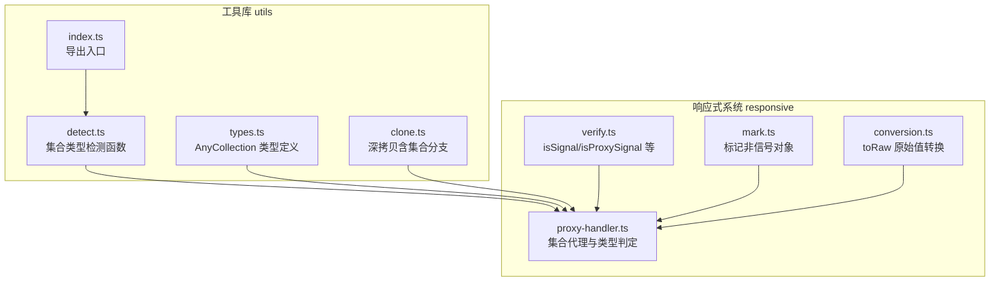
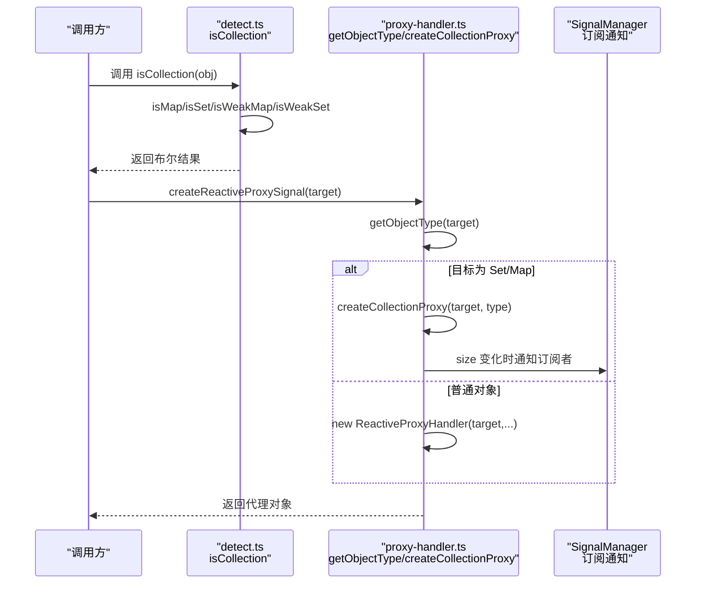
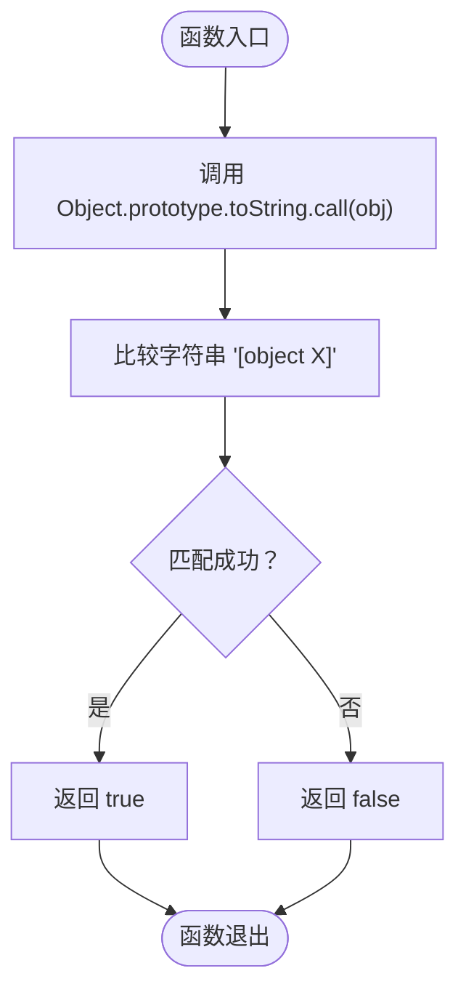
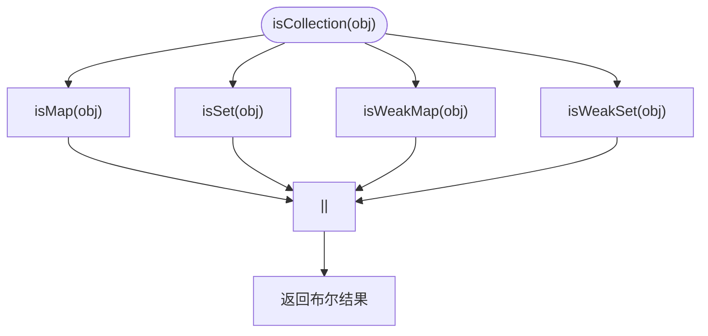
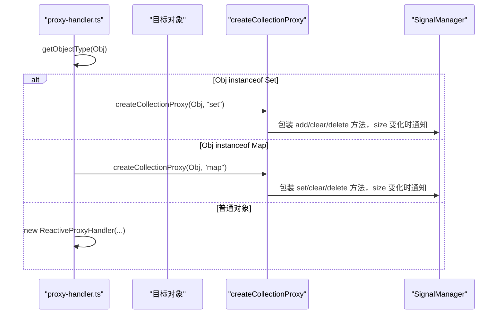
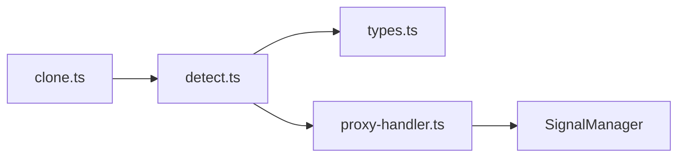

# 集合类型检测

<cite>
**本文引用的文件列表**
- [packages/utils/src/detect.ts](file://packages/utils/src/detect.ts)
- [packages/utils/src/types.ts](file://packages/utils/src/types.ts)
- [packages/utils/__tests__/detect.test.ts](file://packages/utils/__tests__/detect.test.ts)
- [packages/utils/src/index.ts](file://packages/utils/src/index.ts)
- [packages/responsive/src/signal/reactive/proxy-handler.ts](file://packages/responsive/src/signal/reactive/proxy-handler.ts)
- [packages/responsive/src/signal/utils/verify.ts](file://packages/responsive/src/signal/utils/verify.ts)
- [packages/responsive/src/signal/utils/mark.ts](file://packages/responsive/src/signal/utils/mark.ts)
- [packages/responsive/src/signal/utils/conversion.ts](file://packages/responsive/src/signal/utils/conversion.ts)
- [packages/utils/src/clone.ts](file://packages/utils/src/clone.ts)
</cite>

## 目录
1. [引言](#引言)
2. [项目结构与定位](#项目结构与定位)
3. [核心组件总览](#核心组件总览)
4. [架构概览](#架构概览)
5. [详细组件分析](#详细组件分析)
6. [依赖关系分析](#依赖关系分析)
7. [性能考量与优化建议](#性能考量与优化建议)
8. [故障排查指南](#故障排查指南)
9. [结论](#结论)

## 引言
本篇文档聚焦于 Vitarx 框架中集合类型检测机制，系统阐述 isMap、isSet、isWeakMap、isWeakSet 四个函数如何通过 Object.prototype.toString.call 实现精确类型判断，从而规避 instanceof 在跨 realm 环境下的失效问题；并深入解析 isCollection 作为统一抽象，如何整合上述四种集合类型的判断逻辑，为框架内部提供统一的集合识别接口。结合框架在响应式系统中的应用场景（如对 Map/Set 的特殊处理），说明这些函数的重要性，并给出性能考量与优化建议。

## 项目结构与定位
- 集合类型检测位于工具库 packages/utils 中，提供 isMap、isSet、isWeakMap、isWeakSet、isCollection 等基础类型判断能力。
- 响应式系统 packages/responsive 在创建集合代理时，依赖工具库的类型判断能力，确保对 Set/Map 的特殊行为（如 size 变化）进行正确追踪与通知。
- 类型定义位于 types.ts，明确 AnyCollection 的联合类型，便于上层模块进行类型约束与推导。

图表来源
- [packages/utils/src/detect.ts](file://packages/utils/src/detect.ts#L302-L403)
- [packages/utils/src/types.ts](file://packages/utils/src/types.ts#L18-L33)
- [packages/utils/src/index.ts](file://packages/utils/src/index.ts#L1-L8)
- [packages/utils/src/clone.ts](file://packages/utils/src/clone.ts#L13-L21)
- [packages/responsive/src/signal/reactive/proxy-handler.ts](file://packages/responsive/src/signal/reactive/proxy-handler.ts#L345-L358)

章节来源
- [packages/utils/src/detect.ts](file://packages/utils/src/detect.ts#L302-L403)
- [packages/utils/src/types.ts](file://packages/utils/src/types.ts#L18-L33)
- [packages/utils/src/index.ts](file://packages/utils/src/index.ts#L1-L8)
- [packages/utils/src/clone.ts](file://packages/utils/src/clone.ts#L13-L21)
- [packages/responsive/src/signal/reactive/proxy-handler.ts](file://packages/responsive/src/signal/reactive/proxy-handler.ts#L345-L358)

## 核心组件总览
- isMap：通过 Object.prototype.toString.call 判断 Map 实例。
- isSet：通过 Object.prototype.toString.call 判断 Set 实例。
- isWeakMap：通过 Object.prototype.toString.call 判断 WeakMap 实例。
- isWeakSet：通过 Object.prototype.toString.call 判断 WeakSet 实例。
- isCollection：统一聚合上述四种集合类型判断，形成“集合”的抽象接口。
- AnyCollection：在类型层面定义集合类型的联合类型，便于上层约束。

章节来源
- [packages/utils/src/detect.ts](file://packages/utils/src/detect.ts#L302-L403)
- [packages/utils/src/types.ts](file://packages/utils/src/types.ts#L18-L33)

## 架构概览
集合类型检测在框架内的调用链路如下：
- 工具库 detect.ts 提供 isMap/isSet/isWeakMap/isWeakSet/isCollection。
- 响应式系统 proxy-handler.ts 在创建集合代理时，先通过 getObjectType 判断目标类型（Set/Map/object），再根据类型选择 createCollectionProxy 或常规对象代理。
- createCollectionProxy 对 Set/Map 的关键方法（如 add/delete/clear/set）进行包装，以在 size 变化时触发订阅通知。
- AnyCollection 在类型层面统一约束集合类型，便于上层模块进行类型守卫与分支处理。

图表来源
- [packages/utils/src/detect.ts](file://packages/utils/src/detect.ts#L302-L403)
- [packages/responsive/src/signal/reactive/proxy-handler.ts](file://packages/responsive/src/signal/reactive/proxy-handler.ts#L345-L358)
- [packages/responsive/src/signal/reactive/proxy-handler.ts](file://packages/responsive/src/signal/reactive/proxy-handler.ts#L307-L343)

## 详细组件分析

### isMap/isSet/isWeakMap/isWeakSet：基于 Object.prototype.toString.call 的精确判断
- 设计要点
  - 使用 Object.prototype.toString.call(obj) === '[object X]' 的模式，避免 instanceof 在跨 iframe/iframe、Web Worker 等跨 realm 环境失效的问题。
  - 严格限定类型，例如 isSet 不会误判 Map/WeakSet/普通对象。
- 复杂度与性能
  - 时间复杂度 O(1)，空间复杂度 O(1)。
  - 仅一次字符串比较，开销极低。
- 错误处理与边界
  - 对 null/undefined 等非对象值返回 false，无需额外保护。
- 测试覆盖
  - 单测验证 Map/Set/WeakMap/WeakSet 的正反例，确保类型判断准确。

图表来源
- [packages/utils/src/detect.ts](file://packages/utils/src/detect.ts#L302-L380)

章节来源
- [packages/utils/src/detect.ts](file://packages/utils/src/detect.ts#L302-L380)
- [packages/utils/__tests__/detect.test.ts](file://packages/utils/__tests__/detect.test.ts#L110-L128)

### isCollection：统一抽象的集合识别接口
- 设计要点
  - 通过 isMap(obj) || isSet(obj) || isWeakMap(obj) || isWeakSet(obj) 整合四种集合类型，形成“集合”的统一抽象。
  - 适用于上层模块在需要“集合”语义时进行类型守卫，避免重复分支判断。
- 类型约束
  - AnyCollection 在 types.ts 中定义为 Map/WeakMap/WeakSet/Set 的联合类型，便于静态类型检查与 IDE 推断。

图表来源
- [packages/utils/src/detect.ts](file://packages/utils/src/detect.ts#L382-L403)
- [packages/utils/src/types.ts](file://packages/utils/src/types.ts#L18-L33)

章节来源
- [packages/utils/src/detect.ts](file://packages/utils/src/detect.ts#L382-L403)
- [packages/utils/src/types.ts](file://packages/utils/src/types.ts#L18-L33)
- [packages/utils/__tests__/detect.test.ts](file://packages/utils/__tests__/detect.test.ts#L130-L134)

### 响应式系统中的集合代理与类型判定
- getObjectType：先通过 instanceof 判断 Set/Map，再回退到普通对象，保证在大多数情况下快速分流。
- createCollectionProxy：对 Set/Map 的关键方法（add/delete/clear/set）进行包装，监控 size 变化并触发订阅通知，确保响应式系统能感知集合状态变更。
- 与工具库的关系：isCollection 用于上层模块的类型守卫；getObjectType 用于运行时快速分流；两者配合保障性能与正确性。

图表来源
- [packages/responsive/src/signal/reactive/proxy-handler.ts](file://packages/responsive/src/signal/reactive/proxy-handler.ts#L345-L358)
- [packages/responsive/src/signal/reactive/proxy-handler.ts](file://packages/responsive/src/signal/reactive/proxy-handler.ts#L307-L343)

章节来源
- [packages/responsive/src/signal/reactive/proxy-handler.ts](file://packages/responsive/src/signal/reactive/proxy-handler.ts#L345-L358)
- [packages/responsive/src/signal/reactive/proxy-handler.ts](file://packages/responsive/src/signal/reactive/proxy-handler.ts#L307-L343)

### 类型系统支撑：AnyCollection
- AnyCollection 定义为 Map/Set/WeakMap/WeakSet 的联合类型，便于：
  - 上层模块在需要“集合”语义时进行类型守卫与分支处理。
  - 静态类型检查与 IDE 推断，减少运行时错误。
- 在工具库与响应式系统中均有使用，确保类型一致性。

章节来源
- [packages/utils/src/types.ts](file://packages/utils/src/types.ts#L18-L33)

### 深拷贝中的集合分支
- clone.ts 中针对 Set/Map/Array/Object 分别提供克隆策略，体现集合类型在通用工具中的重要地位。
- 与 detect.ts 的类型判断相辅相成，确保在序列化/克隆等场景中正确处理集合。

章节来源
- [packages/utils/src/clone.ts](file://packages/utils/src/clone.ts#L13-L21)
- [packages/utils/src/clone.ts](file://packages/utils/src/clone.ts#L36-L51)

## 依赖关系分析
- detect.ts 与 types.ts：detect.ts 依赖 AnyCollection 类型定义，确保返回值与类型约束一致。
- proxy-handler.ts 与 detect.ts：虽然内部使用 instanceof 快速分流，但对外仍可通过 isCollection 进行统一类型守卫，便于上层模块复用工具库的精确判断能力。
- 响应式系统内部的 isSignal/isProxySignal/isMarkNonSignal 等工具与集合类型检测无直接耦合，但共同服务于“识别对象类型并采取相应处理”的目标。

图表来源
- [packages/utils/src/detect.ts](file://packages/utils/src/detect.ts#L302-L403)
- [packages/utils/src/types.ts](file://packages/utils/src/types.ts#L18-L33)
- [packages/utils/src/clone.ts](file://packages/utils/src/clone.ts#L13-L21)
- [packages/responsive/src/signal/reactive/proxy-handler.ts](file://packages/responsive/src/signal/reactive/proxy-handler.ts#L307-L343)

章节来源
- [packages/utils/src/detect.ts](file://packages/utils/src/detect.ts#L302-L403)
- [packages/utils/src/types.ts](file://packages/utils/src/types.ts#L18-L33)
- [packages/utils/src/clone.ts](file://packages/utils/src/clone.ts#L13-L21)
- [packages/responsive/src/signal/reactive/proxy-handler.ts](file://packages/responsive/src/signal/reactive/proxy-handler.ts#L307-L343)

## 性能考量与优化建议
- toString 调用开销
  - isMap/isSet/isWeakMap/isWeakSet 仅一次 Object.prototype.toString.call 与字符串比较，O(1) 复杂度，开销极小。
- instanceof 与跨 realm
  - 在跨 iframe/Worker 等环境，instanceof 可能失效；而 toString 判断不受此影响，更稳定可靠。
- 分支策略
  - 响应式系统在 proxy-handler.ts 中优先使用 instanceof 快速分流（Set/Map/object），随后在集合分支中使用 createCollectionProxy 包装关键方法，兼顾性能与正确性。
- 建议
  - 在高频路径中，若需统一集合识别，优先使用 isCollection，减少重复判断。
  - 若需要严格区分具体集合类型，使用 isMap/isSet/isWeakMap/isWeakSet，确保类型精确性。

[本节为通用性能讨论，不直接分析具体文件，故无章节来源]

## 故障排查指南
- 现象：在跨 iframe/Worker 环境中，使用 instanceof 判断集合类型失败
  - 原因：不同 realm 的构造函数不共享，instanceof 失效。
  - 解决：改用 Object.prototype.toString.call 的判断方式（工具库已内置）。
- 现象：isCollection 返回 false，但实际为 Map/Set
  - 排查：确认传入值非 null/undefined；检查是否被标记为非信号对象（markNonSignal）导致上层逻辑误判。
- 现象：集合代理未正确触发 size 变化通知
  - 排查：确认 getObjectType 判断为 Set/Map；检查 createCollectionProxy 是否被调用；确认包装的方法（add/delete/clear/set）是否被调用。

章节来源
- [packages/utils/src/detect.ts](file://packages/utils/src/detect.ts#L302-L403)
- [packages/responsive/src/signal/reactive/proxy-handler.ts](file://packages/responsive/src/signal/reactive/proxy-handler.ts#L345-L358)
- [packages/responsive/src/signal/reactive/proxy-handler.ts](file://packages/responsive/src/signal/reactive/proxy-handler.ts#L307-L343)
- [packages/responsive/src/signal/utils/mark.ts](file://packages/responsive/src/signal/utils/mark.ts#L23-L35)

## 结论
- Vitarx 通过 Object.prototype.toString.call 实现的 isMap/isSet/isWeakMap/isWeakSet，有效规避了 instanceof 在跨 realm 环境中的失效问题，提供了稳定可靠的类型判断。
- isCollection 作为统一抽象，将四种集合类型整合为“集合”的概念，为上层模块提供一致的类型守卫接口。
- 在响应式系统中，集合类型检测与代理策略协同工作：先通过 instanceof 快速分流，再在集合分支中精细处理 size 变化，确保响应式系统的正确性与性能。
- AnyCollection 类型定义进一步强化了类型安全，便于在工具库与响应式系统之间保持一致的类型契约。