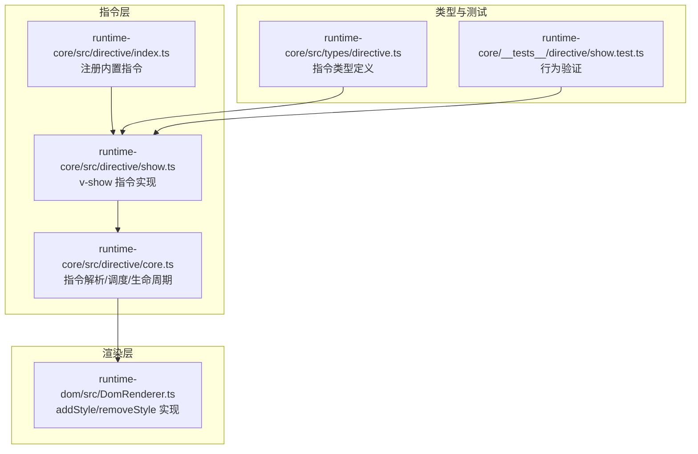
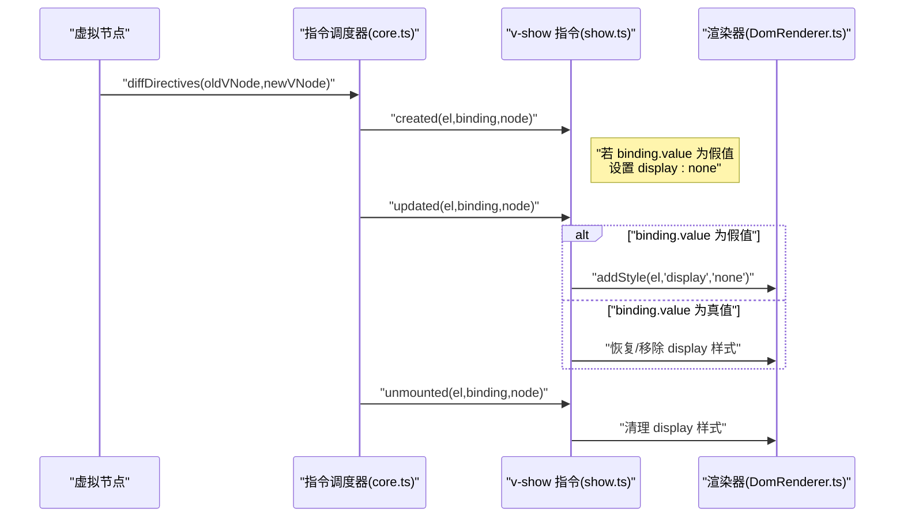
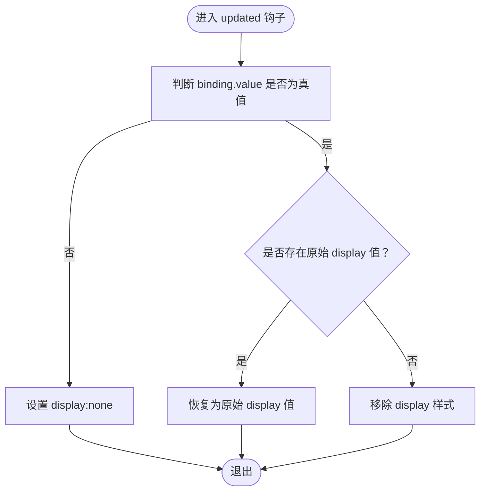
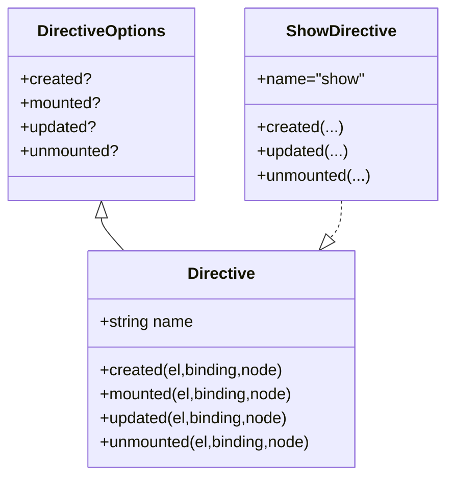
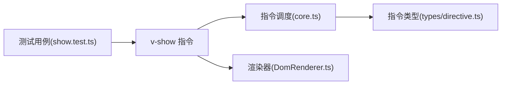

# 内置指令

<cite>
**本文引用的文件**
- [packages/runtime-core/src/directive/show.ts](file://packages/runtime-core/src/directive/show.ts)
- [packages/runtime-core/src/directive/core.ts](file://packages/runtime-core/src/directive/core.ts)
- [packages/runtime-core/src/directive/index.ts](file://packages/runtime-core/src/directive/index.ts)
- [packages/runtime-core/src/types/directive.ts](file://packages/runtime-core/src/types/directive.ts)
- [packages/runtime-dom/src/DomRenderer.ts](file://packages/runtime-dom/src/DomRenderer.ts)
- [packages/runtime-core/__tests__/directive/show.test.ts](file://packages/runtime-core/__tests__/directive/show.test.ts)
</cite>

## 目录
1. [简介](#简介)
2. [项目结构](#项目结构)
3. [核心组件](#核心组件)
4. [架构总览](#架构总览)
5. [详细组件分析](#详细组件分析)
6. [依赖关系分析](#依赖关系分析)
7. [性能考量](#性能考量)
8. [故障排查指南](#故障排查指南)
9. [结论](#结论)
10. [附录](#附录)

## 简介
本文件系统性阐述 Vitarx 内置指令的设计与实现机制，重点聚焦 v-show 指令的工作原理。v-show 通过操作元素的 display 样式实现显示/隐藏，与基于“渲染/销毁”的 v-if 形成对比；在频繁切换场景下，v-show 因避免了节点的创建/销毁而具备更优的性能表现。本文结合 show.ts 源码，解释 created、updated、unmounted 生命周期钩子如何协作确保状态一致性，并说明在组件卸载时恢复原始 display 值的细节。最后提供与响应式数据绑定集成的实际使用路径与最佳实践建议。

## 项目结构
Vitarx 的指令体系由三部分组成：
- 指令定义与注册：在 runtime-core 中定义内置指令并在入口处注册。
- 指令调度与生命周期：在 runtime-core 中统一解析、比较并调度指令的生命周期钩子。
- 渲染器适配：在 runtime-dom 中实现具体 DOM 操作（如 addStyle/removeStyle），并与指令解耦。

图表来源
- [packages/runtime-core/src/directive/index.ts](file://packages/runtime-core/src/directive/index.ts#L1-L7)
- [packages/runtime-core/src/directive/show.ts](file://packages/runtime-core/src/directive/show.ts#L1-L34)
- [packages/runtime-core/src/directive/core.ts](file://packages/runtime-core/src/directive/core.ts#L1-L329)
- [packages/runtime-dom/src/DomRenderer.ts](file://packages/runtime-dom/src/DomRenderer.ts#L180-L190)
- [packages/runtime-core/src/types/directive.ts](file://packages/runtime-core/src/types/directive.ts#L1-L89)
- [packages/runtime-core/__tests__/directive/show.test.ts](file://packages/runtime-core/__tests__/directive/show.test.ts#L1-L237)

章节来源
- [packages/runtime-core/src/directive/index.ts](file://packages/runtime-core/src/directive/index.ts#L1-L7)
- [packages/runtime-core/src/directive/show.ts](file://packages/runtime-core/src/directive/show.ts#L1-L34)
- [packages/runtime-core/src/directive/core.ts](file://packages/runtime-core/src/directive/core.ts#L1-L329)
- [packages/runtime-dom/src/DomRenderer.ts](file://packages/runtime-dom/src/DomRenderer.ts#L180-L190)
- [packages/runtime-core/src/types/directive.ts](file://packages/runtime-core/src/types/directive.ts#L1-L89)
- [packages/runtime-core/__tests__/directive/show.test.ts](file://packages/runtime-core/__tests__/directive/show.test.ts#L1-L237)

## 核心组件
- v-show 指令：通过 created/updated/unmounted 三个钩子控制元素的 display 样式，实现“保持节点存在”的显示/隐藏。
- 指令调度器：负责解析指令、比较新旧节点的指令差异，并按生命周期顺序调度钩子。
- 渲染器：提供 addStyle/removeStyle 等底层 DOM 操作能力，屏蔽平台差异。

章节来源
- [packages/runtime-core/src/directive/show.ts](file://packages/runtime-core/src/directive/show.ts#L1-L34)
- [packages/runtime-core/src/directive/core.ts](file://packages/runtime-core/src/directive/core.ts#L232-L301)
- [packages/runtime-dom/src/DomRenderer.ts](file://packages/runtime-dom/src/DomRenderer.ts#L180-L190)

## 架构总览
v-show 的执行流程围绕“值变化 → 生命周期钩子 → 渲染器样式变更”展开。diffDirectives 会根据新旧节点的指令集合计算差异，触发相应钩子；v-show 的 created 在初次挂载时根据绑定值设置 display；updated 在值变化时恢复或设置 display；unmounted 在节点卸载时清理残留样式，确保不污染后续状态。

图表来源
- [packages/runtime-core/src/directive/core.ts](file://packages/runtime-core/src/directive/core.ts#L239-L301)
- [packages/runtime-core/src/directive/show.ts](file://packages/runtime-core/src/directive/show.ts#L1-L34)
- [packages/runtime-dom/src/DomRenderer.ts](file://packages/runtime-dom/src/DomRenderer.ts#L180-L190)

## 详细组件分析

### v-show 指令实现
- created 钩子：在节点创建完成但尚未挂载到 DOM 时，若绑定值为假值，则预先设置 display:none，避免首屏闪烁。
- updated 钩子：在节点更新时，根据新值决定：
  - 假值：设置 display:none；
  - 真值：优先恢复节点 props.style 中记录的原始 display 值；若无原始值，则移除 display 样式，交由浏览器默认规则决定显示。
- unmounted 钩子：在节点卸载时，若绑定值仍为真值，则清理 display 样式，确保不遗留影响。

图表来源
- [packages/runtime-core/src/directive/show.ts](file://packages/runtime-core/src/directive/show.ts#L11-L21)

章节来源
- [packages/runtime-core/src/directive/show.ts](file://packages/runtime-core/src/directive/show.ts#L1-L34)

### 指令调度与生命周期
- defineDirective/normalizeDirective：将指令标准化并缓存至组件局部或全局指令表。
- withDirectives：为虚拟节点附加指令及其值/参数。
- resolveDirective：按优先级（组件局部 → 应用级 → 全局）解析指令。
- diffDirectives：比较新旧节点的指令集合，分别触发 beforeMount/mounted、beforeUpdate/updated、beforeUnmount/unmounted 等钩子；其中 updated 钩子通过调度器异步队列保证在 DOM 更新之后执行。

图表来源
- [packages/runtime-core/src/types/directive.ts](file://packages/runtime-core/src/types/directive.ts#L25-L89)
- [packages/runtime-core/src/directive/show.ts](file://packages/runtime-core/src/directive/show.ts#L1-L34)

章节来源
- [packages/runtime-core/src/directive/core.ts](file://packages/runtime-core/src/directive/core.ts#L1-L329)
- [packages/runtime-core/src/types/directive.ts](file://packages/runtime-core/src/types/directive.ts#L1-L89)

### 渲染器样式操作
- addStyle：通过 DOM API 设置 CSS 属性。
- removeStyle：移除 CSS 属性，若元素无任何样式则移除 style 属性，避免残留。

章节来源
- [packages/runtime-dom/src/DomRenderer.ts](file://packages/runtime-dom/src/DomRenderer.ts#L180-L190)

### 与 v-if 的对比与性能优势
- v-if：基于“渲染/销毁”的条件渲染，适合不常用或昂贵的子树；频繁切换会导致节点创建/销毁开销。
- v-show：基于“样式切换”的显示/隐藏，适合频繁切换的场景；避免节点创建/销毁，减少副作用与初始化成本。
- 二者在行为上的一致性：两者均通过 display 控制可见性；v-show 在显示时会恢复元素原本的 display 值，避免覆盖默认规则。

章节来源
- [packages/runtime-core/__tests__/directive/show.test.ts](file://packages/runtime-core/__tests__/directive/show.test.ts#L207-L236)

## 依赖关系分析
- v-show 依赖渲染器提供的样式操作能力。
- 指令调度器依赖当前 VNode 上下文，以确定指令作用域（组件局部/全局）。
- 测试用例覆盖了 v-show 的关键行为：初始值、更新切换、卸载清理、边界值（falsy/truthy）、与原生 display 值的交互等。

图表来源
- [packages/runtime-core/src/directive/show.ts](file://packages/runtime-core/src/directive/show.ts#L1-L34)
- [packages/runtime-core/src/directive/core.ts](file://packages/runtime-core/src/directive/core.ts#L1-L329)
- [packages/runtime-core/src/types/directive.ts](file://packages/runtime-core/src/types/directive.ts#L1-L89)
- [packages/runtime-dom/src/DomRenderer.ts](file://packages/runtime-dom/src/DomRenderer.ts#L180-L190)
- [packages/runtime-core/__tests__/directive/show.test.ts](file://packages/runtime-core/__tests__/directive/show.test.ts#L1-L237)

章节来源
- [packages/runtime-core/src/directive/show.ts](file://packages/runtime-core/src/directive/show.ts#L1-L34)
- [packages/runtime-core/src/directive/core.ts](file://packages/runtime-core/src/directive/core.ts#L1-L329)
- [packages/runtime-core/src/types/directive.ts](file://packages/runtime-core/src/types/directive.ts#L1-L89)
- [packages/runtime-dom/src/DomRenderer.ts](file://packages/runtime-dom/src/DomRenderer.ts#L180-L190)
- [packages/runtime-core/__tests__/directive/show.test.ts](file://packages/runtime-core/__tests__/directive/show.test.ts#L1-L237)

## 性能考量
- 频繁切换场景：v-show 通过样式切换避免节点创建/销毁，降低内存分配与初始化成本，适合按钮、弹窗、分页等高频切换。
- 初始渲染：created 钩子在节点创建阶段即根据绑定值设置 display:none，可避免首屏闪烁。
- 卸载清理：unmounted 钩子在卸载时清理 display 样式，防止残留影响后续渲染。
- 与响应式数据：diffDirectives 的 updated 钩子在调度器异步队列中执行，确保 DOM 已更新后再应用样式，避免竞态。

章节来源
- [packages/runtime-core/src/directive/core.ts](file://packages/runtime-core/src/directive/core.ts#L271-L275)
- [packages/runtime-core/src/directive/show.ts](file://packages/runtime-core/src/directive/show.ts#L1-L34)

## 故障排查指南
- 显示异常（始终显示/隐藏）：检查绑定值的真假性，确认 updated 钩子是否正确恢复/移除 display。
- 卸载后样式残留：确认 unmounted 钩子是否执行，以及是否正确恢复原始 display 值。
- 初始状态不一致：确认 created 钩子是否在节点创建阶段设置了正确的 display:none。
- 边界值问题：falsy 值（false、0、''、null、undefined、NaN）均应隐藏；truthy 值应显示并恢复原值。

章节来源
- [packages/runtime-core/__tests__/directive/show.test.ts](file://packages/runtime-core/__tests__/directive/show.test.ts#L1-L237)

## 结论
v-show 指令通过“样式切换 + 生命周期钩子 + 渲染器抽象”的设计，在保持节点存在的前提下实现高效的显示/隐藏控制。其 created/updated/unmounted 钩子协同确保状态一致性，配合调度器的异步更新策略，使样式变更与 DOM 更新解耦。在频繁切换场景下，v-show 相比 v-if 具备明显性能优势；在复杂布局中，合理使用 v-show 可显著降低渲染成本并提升交互流畅度。

## 附录
- 使用路径参考（不展示具体代码内容，仅给出定位）：
  - v-show 指令定义位置：[packages/runtime-core/src/directive/show.ts](file://packages/runtime-core/src/directive/show.ts#L1-L34)
  - 指令注册入口：[packages/runtime-core/src/directive/index.ts](file://packages/runtime-core/src/directive/index.ts#L1-L7)
  - 指令调度与生命周期：[packages/runtime-core/src/directive/core.ts](file://packages/runtime-core/src/directive/core.ts#L232-L301)
  - 渲染器样式操作实现：[packages/runtime-dom/src/DomRenderer.ts](file://packages/runtime-dom/src/DomRenderer.ts#L180-L190)
  - 行为验证测试：[packages/runtime-core/__tests__/directive/show.test.ts](file://packages/runtime-core/__tests__/directive/show.test.ts#L1-L237)